# Data Pipeline Flow — How Data Moves Through the System

> **Read this first.** This document is your map to the entire pipeline.  
> Every Mermaid diagram below renders natively in GitHub/VS Code.

---

## The Big Picture — All 14 Stages

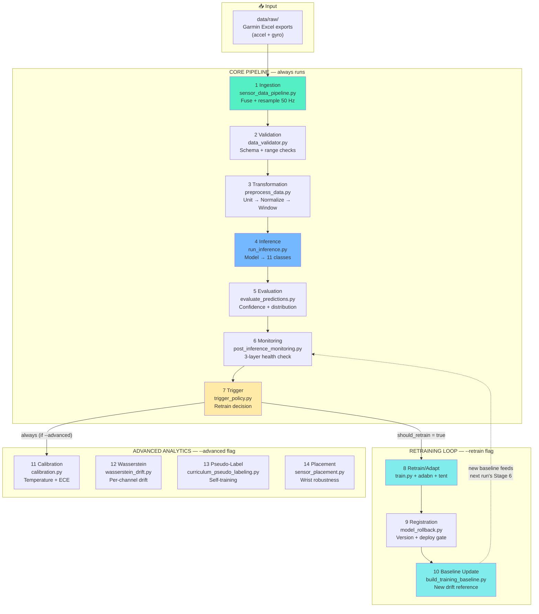
```mermaid
flowchart TB
    subgraph INPUT["📥 Input"]
        RAW["data/raw/\nGarmin Excel exports\n(accel + gyro)"]
    end

    subgraph CORE["CORE PIPELINE — always runs"]
        direction LR
        S1["1 Ingestion\nsensor_data_pipeline.py\nFuse + resample 50 Hz"]
        S2["2 Validation\ndata_validator.py\nSchema + range checks"]
        S3["3 Transformation\npreprocess_data.py\nUnit → Normalize → Window"]
        S4["4 Inference\nrun_inference.py\nModel → 11 classes"]
        S5["5 Evaluation\nevaluate_predictions.py\nConfidence + distribution"]
        S6["6 Monitoring\npost_inference_monitoring.py\n3-layer health check"]
        S7["7 Trigger\ntrigger_policy.py\nRetrain decision"]
        S1 --> S2 --> S3 --> S4 --> S5 --> S6 --> S7
    end

    subgraph RETRAIN["RETRAINING LOOP — --retrain flag"]
        direction LR
        S8["8 Retrain/Adapt\ntrain.py + adabn + tent"]
        S9["9 Registration\nmodel_rollback.py\nVersion + deploy gate"]
        S10["10 Baseline Update\nbuild_training_baseline.py\nNew drift reference"]
        S8 --> S9 --> S10
    end

    subgraph ADVANCED["ADVANCED ANALYTICS — --advanced flag"]
        direction LR
        S11["11 Calibration\ncalibration.py\nTemperature + ECE"]
        S12["12 Wasserstein\nwasserstein_drift.py\nPer-channel drift"]
        S13["13 Pseudo-Label\ncurriculum_pseudo_labeling.py\nSelf-training"]
        S14["14 Placement\nsensor_placement.py\nWrist robustness"]
    end

    RAW --> S1
    S7 -->|"should_retrain = true"| S8
    S7 -->|"always (if --advanced)"| S11
    S10 -.->|"new baseline feeds\nnext run's Stage 6"| S6

    style S1 fill:#55efc4
    style S4 fill:#74b9ff
    style S7 fill:#ffeaa7
    style S8 fill:#81ecec
    style S10 fill:#81ecec
```

### Stage-to-File Quick Reference

| Stage | Component | Core Module | Config |
|-------|-----------|-------------|--------|
| 1 | `src/components/data_ingestion.py` | `src/sensor_data_pipeline.py` | pipeline_config.yaml |
| 2 | `src/components/data_validation.py` | `src/data_validator.py` | pipeline_config.yaml |
| 3 | `src/components/data_transformation.py` | `src/preprocess_data.py` | pipeline_config.yaml |
| 4 | `src/components/model_inference.py` | `src/run_inference.py` | pipeline_config.yaml |
| 5 | `src/components/model_evaluation.py` | `src/evaluate_predictions.py` | — |
| 6 | `src/components/post_inference_monitoring.py` | `scripts/post_inference_monitoring.py` | pipeline_overrides.yaml |
| 7 | `src/components/trigger_evaluation.py` | `src/trigger_policy.py` | pipeline_overrides.yaml |
| 8 | `src/components/model_retraining.py` | `src/train.py` + `domain_adaptation/` | — |
| 9 | `src/components/model_registration.py` | `src/model_rollback.py` | pipeline_overrides.yaml |
| 10 | `src/components/baseline_update.py` | `scripts/build_training_baseline.py` | — |
| 11 | `src/components/calibration_uncertainty.py` | `src/calibration.py` | pipeline_overrides.yaml |
| 12 | `src/components/wasserstein_drift.py` | `src/wasserstein_drift.py` | — |
| 13 | `src/components/curriculum_pseudo_labeling.py` | `src/curriculum_pseudo_labeling.py` | pipeline_overrides.yaml |
| 14 | `src/components/sensor_placement.py` | `src/sensor_placement.py` | — |

---

## What Happens at Each Stage

### Stage 1 — Data Ingestion

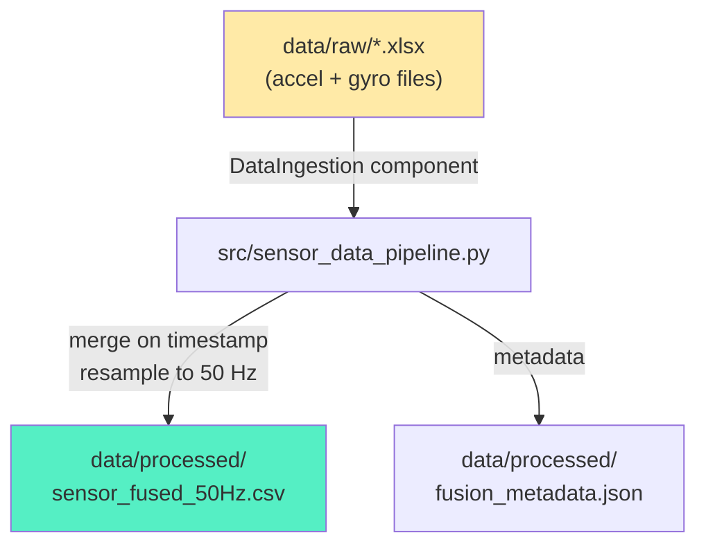
```mermaid
flowchart TD
    A["data/raw/*.xlsx\n(accel + gyro files)"] -->|"DataIngestion component"| B["src/sensor_data_pipeline.py"]
    B -->|"merge on timestamp\nresample to 50 Hz"| C["data/processed/\nsensor_fused_50Hz.csv"]
    B -->|"metadata"| D["data/processed/\nfusion_metadata.json"]

    style A fill:#ffeaa7
    style C fill:#55efc4
```

| What | Detail |
|------|--------|
| **Entry** | `src/components/data_ingestion.py` → calls `src/sensor_data_pipeline.py` |
| **Input** | Raw Excel/CSV from Garmin watch (accelerometer + gyroscope, separate files) |
| **Process** | Find newest accel/gyro pair → merge on nearest timestamp → resample to 50 Hz |
| **Output** | `data/processed/sensor_fused_50Hz.csv` — 6 sensor columns at 50 Hz |
| **Artifact** | `artifacts/<run>/data_ingestion/fused_csv_<ts>.csv` + n_rows, sampling_hz |
| **Run it** | `python run_pipeline.py --stages ingestion` |

---

### Stage 2 — Data Validation

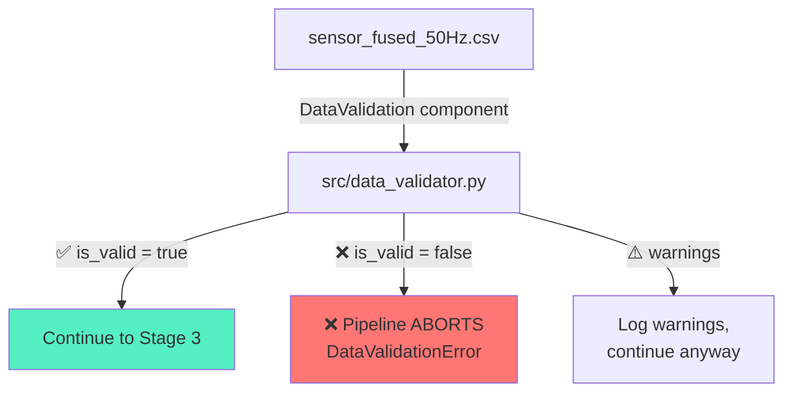
```mermaid
flowchart TD
    A["sensor_fused_50Hz.csv"] -->|"DataValidation component"| B["src/data_validator.py"]
    B -->|"✅ is_valid = true"| C["Continue to Stage 3"]
    B -->|"❌ is_valid = false"| D["❌ Pipeline ABORTS\nDataValidationError"]
    B -->|"⚠️ warnings"| E["Log warnings,\ncontinue anyway"]

    style D fill:#ff7675
    style C fill:#55efc4
```

| What | Detail |
|------|--------|
| **Entry** | `src/components/data_validation.py` → calls `src/data_validator.py` |
| **Checks** | Required columns exist · Numeric dtype · Missing-value ratio < threshold · Value ranges sane · Sampling rate ~50 Hz |
| **Output** | `validation_report.json` (is_valid, errors[], warnings[]) |
| **Hard fail** | If `is_valid = false` → pipeline raises `DataValidationError` and stops |
| **Artifact** | `artifacts/<run>/validation/validation_report.json` |
| **Run it** | `python run_pipeline.py --stages validation` |

---

### Stage 3 — Data Transformation

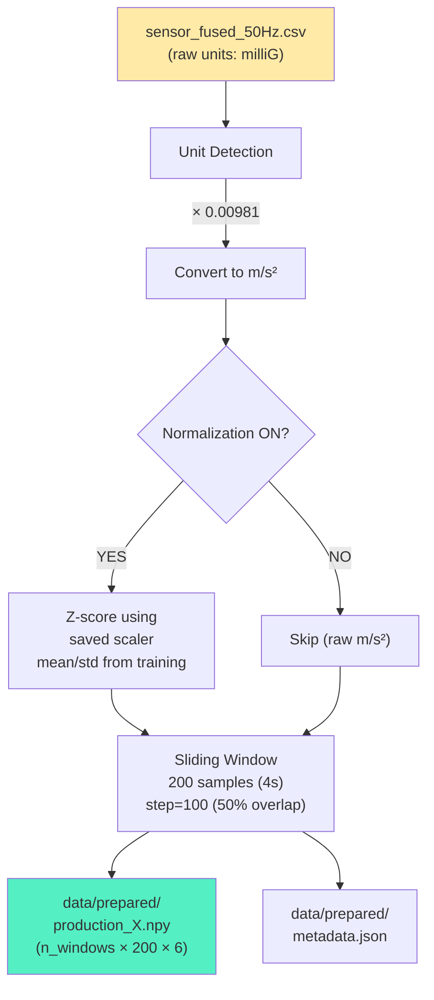
```mermaid
flowchart TD
    A["sensor_fused_50Hz.csv\n(raw units: milliG)"] --> B["Unit Detection"]
    B -->|"× 0.00981"| C["Convert to m/s²"]
    C --> D{"Normalization ON?"}
    D -->|"YES"| E["Z-score using\nsaved scaler\nmean/std from training"]
    D -->|"NO"| F["Skip (raw m/s²)"]
    E --> G["Sliding Window\n200 samples (4s)\nstep=100 (50% overlap)"]
    F --> G
    G --> H["data/prepared/\nproduction_X.npy\n(n_windows × 200 × 6)"]
    G --> I["data/prepared/\nmetadata.json"]

    style A fill:#ffeaa7
    style H fill:#55efc4
```

| What | Detail |
|------|--------|
| **Entry** | `src/components/data_transformation.py` → calls `src/preprocess_data.py` |
| **Key classes** | `UnitDetector` · `UnifiedPreprocessor` |
| **Scaler source** | `data/prepared/config.json` (mean/std per channel from training) |
| **Output** | `production_X.npy` shape `(n_windows, 200, 6)` + `metadata.json` |
| **Toggles** | `enable_unit_conversion`, `enable_normalization`, `enable_gravity_removal`, `enable_calibration` |
| **Artifact** | `artifacts/<run>/data_transformation/production_X.npy` + metadata |
| **Run it** | `python run_pipeline.py --stages transformation` |

---

### Stage 4 — Model Inference

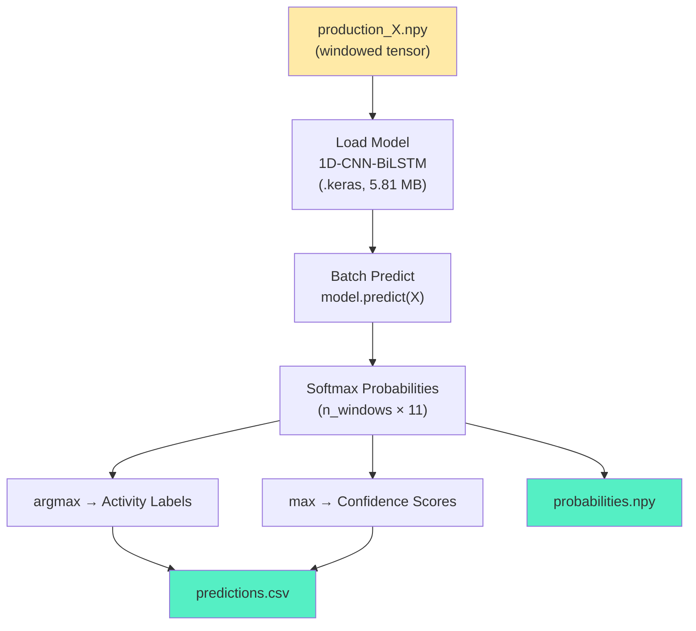
```mermaid
flowchart TD
    A["production_X.npy\n(windowed tensor)"] --> B["Load Model\n1D-CNN-BiLSTM\n(.keras, 5.81 MB)"]
    B --> C["Batch Predict\nmodel.predict(X)"]
    C --> D["Softmax Probabilities\n(n_windows × 11)"]
    D --> E["argmax → Activity Labels"]
    D --> F["max → Confidence Scores"]
    E --> G["predictions.csv"]
    F --> G
    D --> H["probabilities.npy"]

    style A fill:#ffeaa7
    style G fill:#55efc4
    style H fill:#55efc4
```

| What | Detail |
|------|--------|
| **Entry** | `src/components/model_inference.py` → calls `src/run_inference.py` |
| **Model** | `models/pretrained/fine_tuned_model_1dcnnbilstm.keras` |
| **Output files** | `predictions.csv`, `predictions.npy`, `probabilities.npy` |
| **Tracked metrics** | `inference_time_seconds`, `throughput_windows_per_sec`, `avg_ms_per_window`, `activity_distribution`, `confidence_stats` (mean/std/min/max/median/n_uncertain) |
| **Artifact** | `artifacts/<run>/inference/inference_summary.json` + prediction files |
| **Run it** | `python run_pipeline.py --stages inference` |

---

### Stage 5 — Evaluation

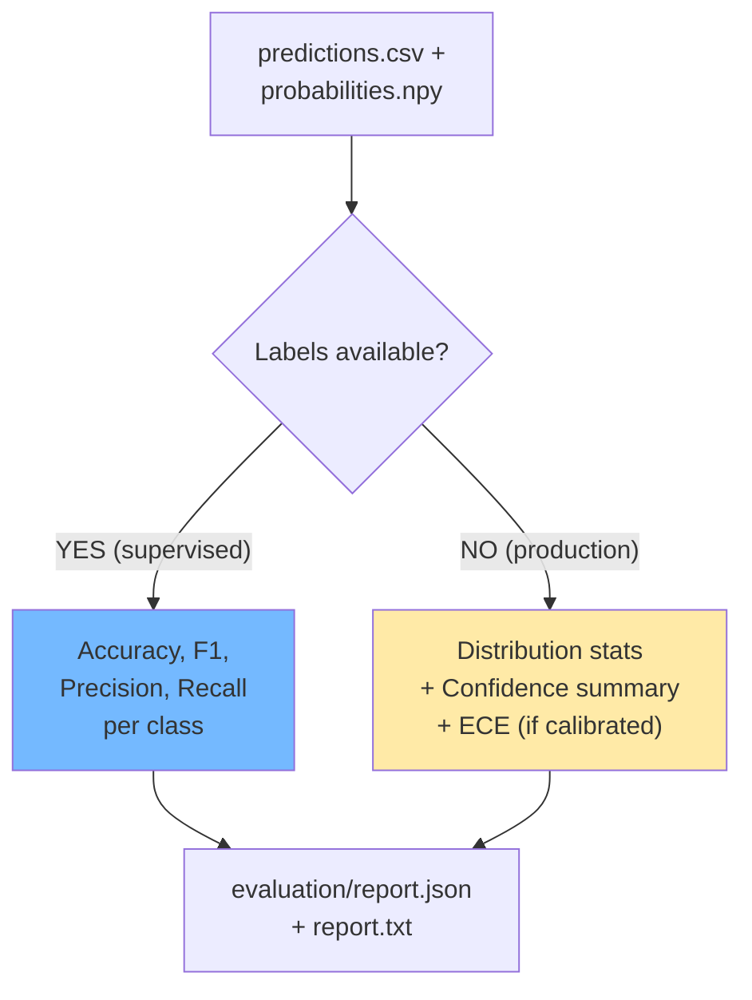
```mermaid
flowchart TD
    A["predictions.csv +\nprobabilities.npy"] --> B{"Labels available?"}
    B -->|"YES (supervised)"| C["Accuracy, F1,\nPrecision, Recall\nper class"]
    B -->|"NO (production)"| D["Distribution stats\n+ Confidence summary\n+ ECE (if calibrated)"]
    C --> E["evaluation/report.json\n+ report.txt"]
    D --> E

    style C fill:#74b9ff
    style D fill:#ffeaa7
```

| What | Detail |
|------|--------|
| **Entry** | `src/components/model_evaluation.py` → calls `src/evaluate_predictions.py` |
| **Production mode** | No labels → distribution + confidence only |
| **Supervised mode** | Labels exist → full classification metrics |
| **Artifact** | `artifacts/<run>/evaluation/evaluation_summary.json` |
| **Run it** | `python run_pipeline.py --stages evaluation` |

---

### Stage 6 — Post-Inference Monitoring (3-Layer)

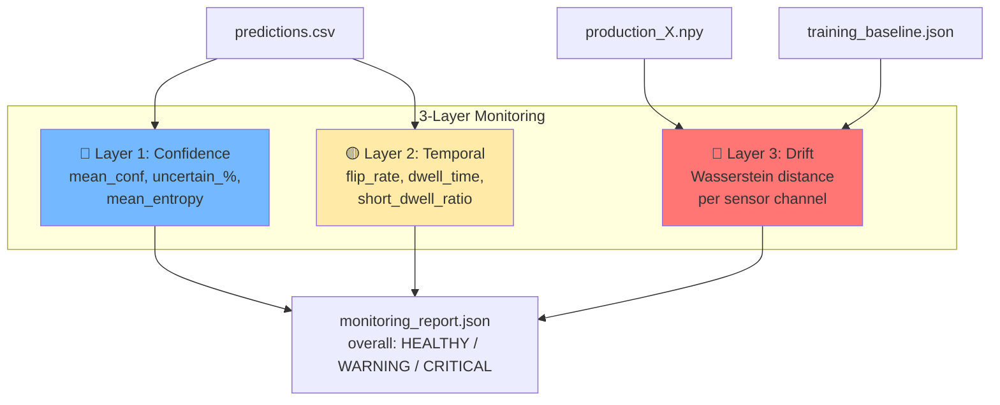
```mermaid
flowchart TD
    A["predictions.csv"] --> L1
    A --> L2
    B["production_X.npy"] --> L3
    C["training_baseline.json"] --> L3

    subgraph MONITORING["3-Layer Monitoring"]
        L1["🔵 Layer 1: Confidence\nmean_conf, uncertain_%,\nmean_entropy"]
        L2["🟡 Layer 2: Temporal\nflip_rate, dwell_time,\nshort_dwell_ratio"]
        L3["🔴 Layer 3: Drift\nWasserstein distance\nper sensor channel"]
    end

    L1 --> R["monitoring_report.json\noverall: HEALTHY / WARNING / CRITICAL"]
    L2 --> R
    L3 --> R

    style L1 fill:#74b9ff
    style L2 fill:#ffeaa7
    style L3 fill:#ff7675
```

| What | Detail |
|------|--------|
| **Entry** | `src/components/post_inference_monitoring.py` → calls `scripts/post_inference_monitoring.py` |
| **Layer 1** | Softmax confidence: mean, std, uncertain %, entropy |
| **Layer 2** | Temporal stability: flip rate, dwell time, short-dwell ratio |
| **Layer 3** | Distribution drift: Wasserstein distance per channel vs training baseline |
| **Baseline** | `models/training_baseline.json` and `models/normalized_baseline.json` (built by Stage 10) |
| **Artifact** | `artifacts/<run>/monitoring/monitoring_summary.json` |
| **Run it** | `python run_pipeline.py --stages monitoring` |

---

### Stage 7 — Trigger Evaluation

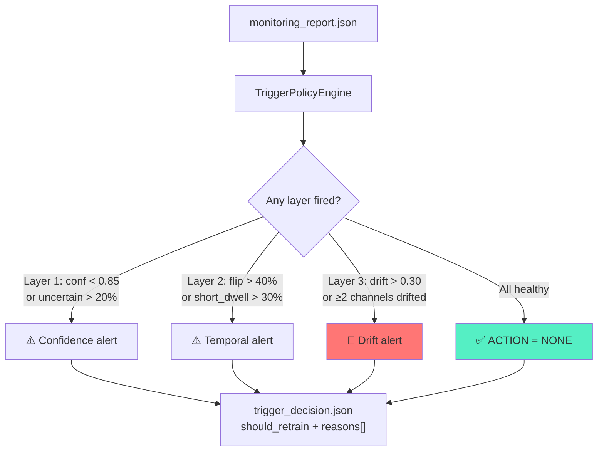
```mermaid
flowchart TD
    A["monitoring_report.json"] --> B["TriggerPolicyEngine"]
    B --> C{"Any layer fired?"}
    C -->|"Layer 1: conf < 0.85\nor uncertain > 20%"| D["⚠️ Confidence alert"]
    C -->|"Layer 2: flip > 40%\nor short_dwell > 30%"| E["⚠️ Temporal alert"]
    C -->|"Layer 3: drift > 0.30\nor ≥2 channels drifted"| F["🔴 Drift alert"]
    C -->|"All healthy"| G["✅ ACTION = NONE"]
    D --> H["trigger_decision.json\nshould_retrain + reasons[]"]
    E --> H
    F --> H
    G --> H

    style G fill:#55efc4
    style F fill:#ff7675
```

| What | Detail |
|------|--------|
| **Entry** | `src/components/trigger_evaluation.py` → calls `src/trigger_policy.py` |
| **Output** | `should_retrain` (bool), `action` (NONE/MONITOR/QUEUE_RETRAIN/TRIGGER_RETRAIN/ROLLBACK), `alert_level` (INFO/WARNING/CRITICAL), `reasons[]` |
| **Cooldown** | Prevents retraining spam (configurable hours) |
| **Artifact** | `artifacts/<run>/trigger/trigger_decision.json` |
| **Run it** | `python run_pipeline.py --stages trigger` |

---

## Retraining Stages (8–10) — The Closed Loop

> These stages only run when `--retrain` is passed.  
> They close the monitoring → retraining → redeployment loop.

---

### Stage 8 — Model Retraining / Domain Adaptation

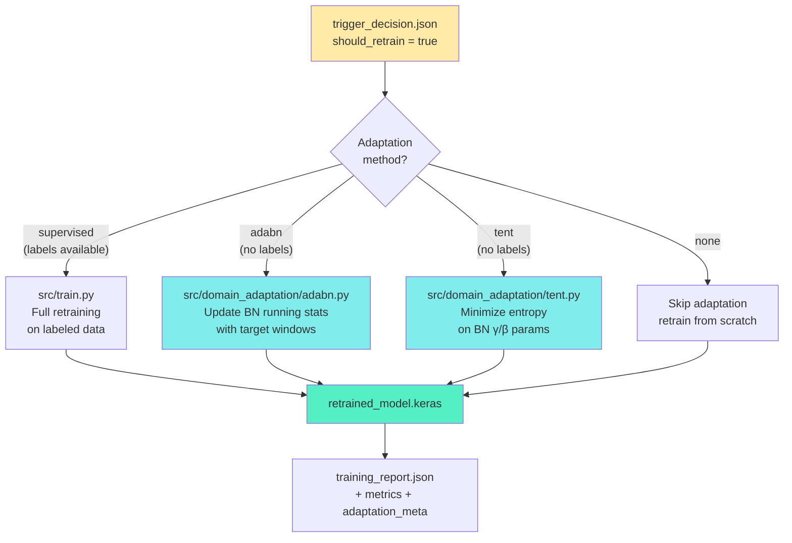
```mermaid
flowchart TD
    A["trigger_decision.json\nshould_retrain = true"] --> B{"Adaptation\nmethod?"}
    
    B -->|"supervised\n(labels available)"| C["src/train.py\nFull retraining\non labeled data"]
    B -->|"adabn\n(no labels)"| D["src/domain_adaptation/adabn.py\nUpdate BN running stats\nwith target windows"]
    B -->|"tent\n(no labels)"| E["src/domain_adaptation/tent.py\nMinimize entropy\non BN γ/β params"]
    B -->|"none"| F["Skip adaptation\nretrain from scratch"]
    
    C --> G["retrained_model.keras"]
    D --> G
    E --> G
    F --> G
    
    G --> H["training_report.json\n+ metrics + adaptation_meta"]

    style A fill:#ffeaa7
    style G fill:#55efc4
    style D fill:#81ecec
    style E fill:#81ecec
```

| What | Detail |
|------|--------|
| **Entry** | `src/components/model_retraining.py` → calls `src/train.py` |
| **Core files** | `src/train.py` · `src/domain_adaptation/adabn.py` · `src/domain_adaptation/tent.py` |
| **Adaptation methods** | `supervised` (full retrain), `adabn` (BN stats, unsupervised), `tent` (entropy minimization, unsupervised), `none` |
| **Inputs** | Current model + target production windows + optional labeled data |
| **Outputs** | `retrained_model.keras` + `training_report.json` (metrics, adaptation_method, n_samples) |
| **Safety** | TENT has built-in rollback if entropy increases (OOD guard) |
| **Artifact** | `artifacts/<run>/retraining/` |
| **Run it** | `python run_pipeline.py --retrain` |

**AdaBN vs TENT decision tree:**

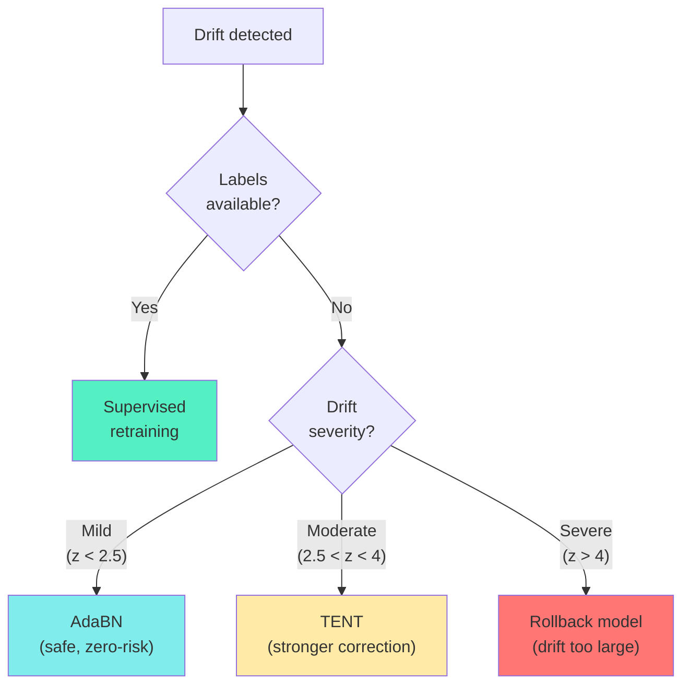
```mermaid
flowchart TD
    START["Drift detected"] --> Q1{"Labels\navailable?"}
    Q1 -->|"Yes"| SUP["Supervised\nretraining"]
    Q1 -->|"No"| Q2{"Drift\nseverity?"}
    Q2 -->|"Mild\n(z < 2.5)"| ADA["AdaBN\n(safe, zero-risk)"]
    Q2 -->|"Moderate\n(2.5 < z < 4)"| TENT["TENT\n(stronger correction)"]
    Q2 -->|"Severe\n(z > 4)"| ROLL["Rollback model\n(drift too large)"]

    style SUP fill:#55efc4
    style ADA fill:#81ecec
    style TENT fill:#ffeaa7
    style ROLL fill:#ff7675
```

---

### Stage 9 — Model Registration & Deployment Gate

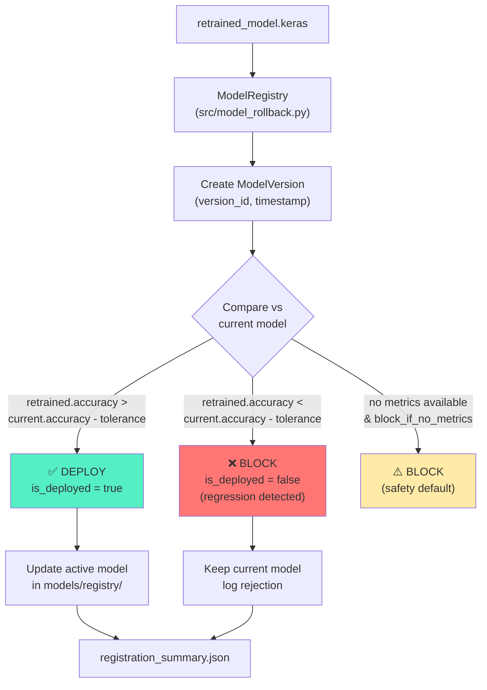
```mermaid
flowchart TD
    A["retrained_model.keras"] --> B["ModelRegistry\n(src/model_rollback.py)"]
    B --> C["Create ModelVersion\n(version_id, timestamp)"]
    C --> D{"Compare vs\ncurrent model"}
    
    D -->|"retrained.accuracy >\ncurrent.accuracy - tolerance"| E["✅ DEPLOY\nis_deployed = true"]
    D -->|"retrained.accuracy <\ncurrent.accuracy - tolerance"| F["❌ BLOCK\nis_deployed = false\n(regression detected)"]
    D -->|"no metrics available\n& block_if_no_metrics"| G["⚠️ BLOCK\n(safety default)"]
    
    E --> H["Update active model\nin models/registry/"]
    F --> I["Keep current model\nlog rejection"]
    
    H --> J["registration_summary.json"]
    I --> J

    style E fill:#55efc4
    style F fill:#ff7675
    style G fill:#ffeaa7
```

| What | Detail |
|------|--------|
| **Entry** | `src/components/model_registration.py` → calls `src/model_rollback.py` |
| **Core file** | `src/model_rollback.py` — `ModelRegistry`, `ModelVersion` |
| **Gate logic** | New model deploys only if `accuracy >= current - degradation_tolerance` (default 0.005) |
| **Outputs** | `registered_version`, `is_deployed` (bool), `is_better_than_current`, `proxy_metrics` |
| **Rollback** | If deployed model degrades → automatic rollback to previous version |
| **Config** | `pipeline_overrides.yaml` → `registration.degradation_tolerance`, `auto_deploy`, `block_if_no_metrics` |
| **Artifact** | `artifacts/<run>/registration/` |

---

### Stage 10 — Baseline Update

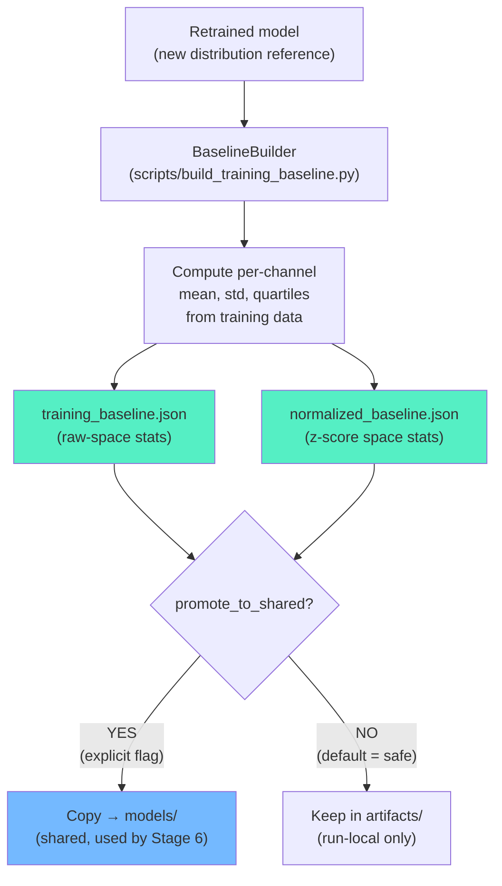
```mermaid
flowchart TD
    A["Retrained model\n(new distribution reference)"] --> B["BaselineBuilder\n(scripts/build_training_baseline.py)"]
    B --> C["Compute per-channel\nmean, std, quartiles\nfrom training data"]
    C --> D["training_baseline.json\n(raw-space stats)"]
    C --> E["normalized_baseline.json\n(z-score space stats)"]
    D --> F{"promote_to_shared?"}
    E --> F
    F -->|"YES\n(explicit flag)"| G["Copy → models/\n(shared, used by Stage 6)"]
    F -->|"NO\n(default = safe)"| H["Keep in artifacts/\n(run-local only)"]

    style D fill:#55efc4
    style E fill:#55efc4
    style G fill:#74b9ff
```

| What | Detail |
|------|--------|
| **Entry** | `src/components/baseline_update.py` → calls `scripts/build_training_baseline.py` |
| **Core file** | `scripts/build_training_baseline.py` — `BaselineBuilder` |
| **Inputs** | Labeled training CSV (or retrained model's training set) |
| **Outputs** | `training_baseline.json` + `normalized_baseline.json` (per-channel distribution stats) |
| **Governance** | `promote_to_shared=False` by default — new baselines stay local until explicitly promoted |
| **Why** | Layer 3 drift detection compares production data against these baselines |
| **Artifact** | `artifacts/<run>/baseline/` |

---

## Advanced Stages (11–14) — Deep Analytics

> These stages only run when `--advanced` is passed.  
> They provide deeper analysis for thesis evaluation and research.

---

### Stage 11 — Calibration & Uncertainty

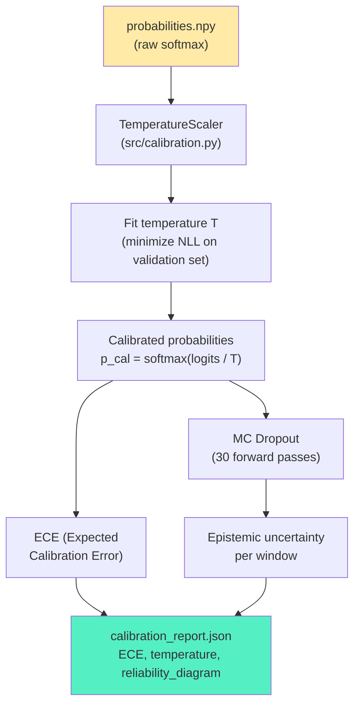
```mermaid
flowchart TD
    A["probabilities.npy\n(raw softmax)"] --> B["TemperatureScaler\n(src/calibration.py)"]
    B --> C["Fit temperature T\n(minimize NLL on validation set)"]
    C --> D["Calibrated probabilities\np_cal = softmax(logits / T)"]
    D --> E["ECE (Expected\nCalibration Error)"]
    D --> F["MC Dropout\n(30 forward passes)"]
    F --> G["Epistemic uncertainty\nper window"]
    E --> H["calibration_report.json\nECE, temperature, reliability_diagram"]
    G --> H

    style A fill:#ffeaa7
    style H fill:#55efc4
```

| What | Detail |
|------|--------|
| **Entry** | `src/components/calibration_uncertainty.py` → calls `src/calibration.py` |
| **Core file** | `src/calibration.py` — `TemperatureScaler`, `CalibrationEvaluator`, `UnlabeledCalibrationAnalyzer` |
| **Purpose** | Post-hoc calibration so confidence scores match true probabilities |
| **Key output** | `temperature` (scalar), `ECE` (lower = better calibrated), per-class reliability |
| **MC Dropout** | 30 forward passes with dropout → epistemic uncertainty map |
| **Config** | `mc_forward_passes: 30`, `mc_dropout_rate: 0.2`, `ece_warn_threshold: 0.10` |
| **Artifact** | `artifacts/<run>/calibration/` |

---

### Stage 12 — Wasserstein Drift Analysis

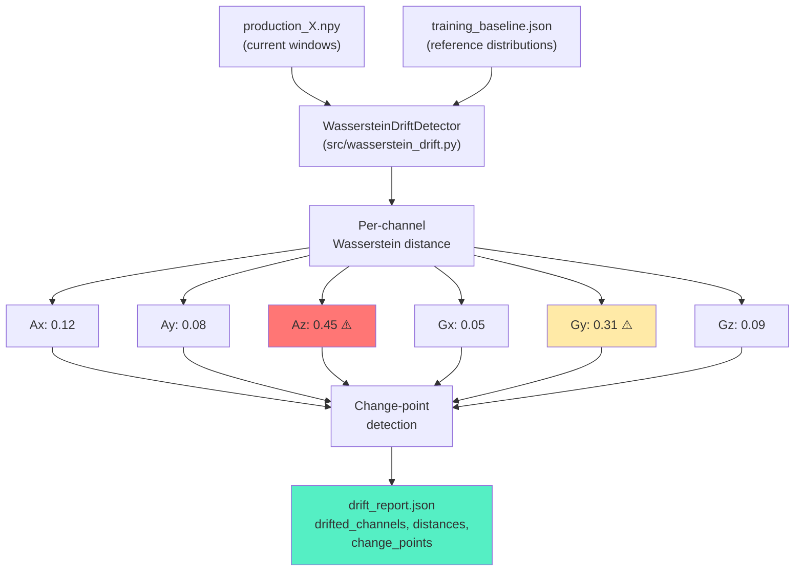
```mermaid
flowchart TD
    A["production_X.npy\n(current windows)"] --> W
    B["training_baseline.json\n(reference distributions)"] --> W
    
    W["WassersteinDriftDetector\n(src/wasserstein_drift.py)"] --> C["Per-channel\nWasserstein distance"]
    
    C --> D["Ax: 0.12"]
    C --> E["Ay: 0.08"]
    C --> F["Az: 0.45 ⚠️"]
    C --> G["Gx: 0.05"]
    C --> H["Gy: 0.31 ⚠️"]
    C --> I["Gz: 0.09"]
    
    D & E & F & G & H & I --> J["Change-point\ndetection"]
    J --> K["drift_report.json\ndrifted_channels, distances,\nchange_points"]

    style F fill:#ff7675
    style H fill:#ffeaa7
    style K fill:#55efc4
```

| What | Detail |
|------|--------|
| **Entry** | `src/components/wasserstein_drift.py` → calls `src/wasserstein_drift.py` |
| **Core file** | `src/wasserstein_drift.py` — `WassersteinDriftDetector`, `WassersteinChangePointDetector` |
| **Purpose** | Detailed per-sensor-channel drift measurement (more precise than Stage 6 Layer 3) |
| **Metric** | $W_1(P, Q) = \inf_{\gamma \in \Gamma(P,Q)} \mathbb{E}_{(x,y) \sim \gamma}[|x - y|]$ |
| **Outputs** | Per-channel distances, change-point timestamps, drift_detected booleans |
| **Artifact** | `artifacts/<run>/wasserstein/` |

---

### Stage 13 — Curriculum Pseudo-Labeling

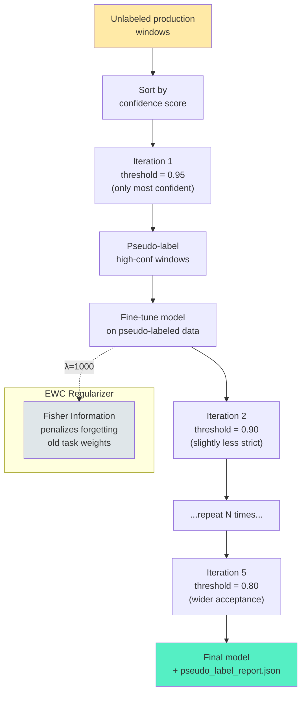
```mermaid
flowchart TD
    A["Unlabeled production\nwindows"] --> B["Sort by\nconfidence score"]
    B --> C["Iteration 1\nthreshold = 0.95\n(only most confident)"]
    C --> D["Pseudo-label\nhigh-conf windows"]
    D --> E["Fine-tune model\non pseudo-labeled data"]
    E --> F["Iteration 2\nthreshold = 0.90\n(slightly less strict)"]
    F --> G["...repeat N times..."]
    G --> H["Iteration 5\nthreshold = 0.80\n(wider acceptance)"]
    
    H --> I["Final model\n+ pseudo_label_report.json"]

    subgraph EWC["EWC Regularizer"]
        R["Fisher Information\npenalizes forgetting\nold task weights"]
    end
    
    E -.->|"λ=1000"| R

    style A fill:#ffeaa7
    style I fill:#55efc4
    style R fill:#dfe6e9
```

| What | Detail |
|------|--------|
| **Entry** | `src/components/curriculum_pseudo_labeling.py` → calls `src/curriculum_pseudo_labeling.py` |
| **Core file** | `src/curriculum_pseudo_labeling.py` — `CurriculumConfig`, `PseudoLabelSelector` |
| **Purpose** | Self-training: use model's own confident predictions as training labels |
| **Schedule** | Confidence threshold decays: 0.95 → 0.90 → 0.85 → 0.80 over iterations |
| **EWC** | Elastic Weight Consolidation (λ=1000) prevents catastrophic forgetting |
| **Config** | `initial_confidence_threshold: 0.95`, `n_iterations: 5`, `ewc_lambda: 1000` |
| **Artifact** | `artifacts/<run>/pseudo_labeling/` |

---

### Stage 14 — Sensor Placement Robustness

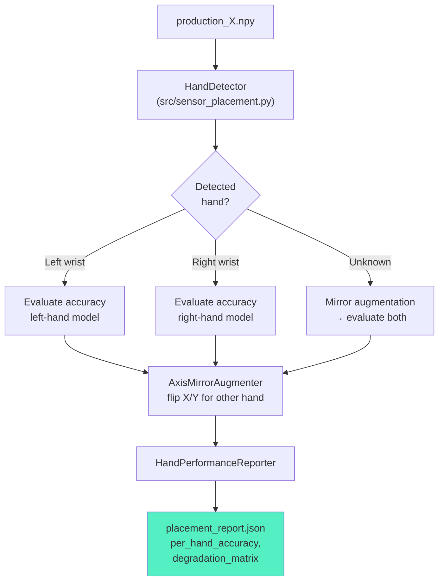
```mermaid
flowchart TD
    A["production_X.npy"] --> B["HandDetector\n(src/sensor_placement.py)"]
    B --> C{"Detected\nhand?"}
    C -->|"Left wrist"| D["Evaluate accuracy\nleft-hand model"]
    C -->|"Right wrist"| E["Evaluate accuracy\nright-hand model"]
    C -->|"Unknown"| F["Mirror augmentation\n→ evaluate both"]
    
    D --> G["AxisMirrorAugmenter\nflip X/Y for other hand"]
    E --> G
    F --> G
    
    G --> H["HandPerformanceReporter"]
    H --> I["placement_report.json\nper_hand_accuracy,\ndegradation_matrix"]

    style I fill:#55efc4
```

| What | Detail |
|------|--------|
| **Entry** | `src/components/sensor_placement.py` → calls `src/sensor_placement.py` |
| **Core file** | `src/sensor_placement.py` — `SensorPlacementConfig`, `AxisMirrorAugmenter`, `HandDetector`, `HandPerformanceReporter` |
| **Purpose** | Tests model robustness when watch is worn on different wrist |
| **Key technique** | Axis mirroring augmentation — flips X/Y axes to simulate opposite wrist |
| **Outputs** | Per-hand accuracy, degradation between hands |
| **Artifact** | `artifacts/<run>/sensor_placement/` |

---

## Full 14-Stage Overview

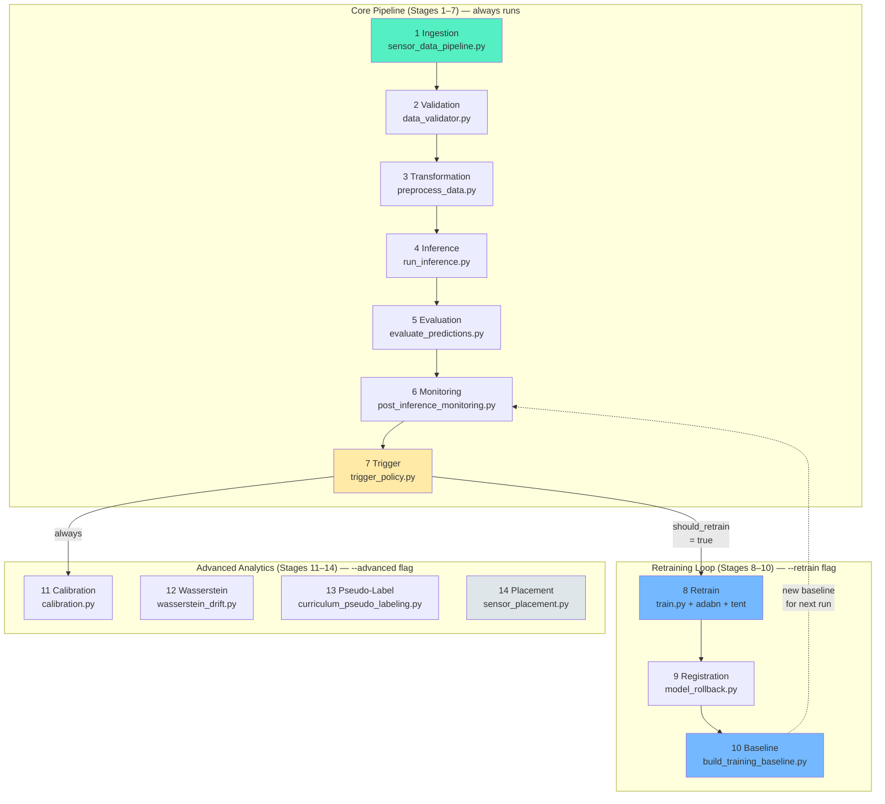
```mermaid
flowchart TB
    subgraph CORE["Core Pipeline (Stages 1–7) — always runs"]
        direction LR
        S1["1 Ingestion\nsensor_data_pipeline.py"] --> S2["2 Validation\ndata_validator.py"]
        S2 --> S3["3 Transformation\npreprocess_data.py"]
        S3 --> S4["4 Inference\nrun_inference.py"]
        S4 --> S5["5 Evaluation\nevaluate_predictions.py"]
        S5 --> S6["6 Monitoring\npost_inference_monitoring.py"]
        S6 --> S7["7 Trigger\ntrigger_policy.py"]
    end

    subgraph RETRAIN["Retraining Loop (Stages 8–10) — --retrain flag"]
        direction LR
        S8["8 Retrain\ntrain.py + adabn + tent"] --> S9["9 Registration\nmodel_rollback.py"]
        S9 --> S10["10 Baseline\nbuild_training_baseline.py"]
    end

    subgraph ADVANCED["Advanced Analytics (Stages 11–14) — --advanced flag"]
        direction LR
        S11["11 Calibration\ncalibration.py"]
        S12["12 Wasserstein\nwasserstein_drift.py"]
        S13["13 Pseudo-Label\ncurriculum_pseudo_labeling.py"]
        S14["14 Placement\nsensor_placement.py"]
    end

    S7 -->|"should_retrain\n= true"| S8
    S7 -->|"always"| S11
    S10 -.->|"new baseline\nfor next run"| S6

    style S1 fill:#55efc4
    style S7 fill:#ffeaa7
    style S8 fill:#74b9ff
    style S10 fill:#74b9ff
    style S14 fill:#dfe6e9
```

---

## Complete File ↔ Stage Map


```mermaid
flowchart TD
    subgraph ENTRY["🚀 Entry Points"]
        CLI["run_pipeline.py"]
        PRE["scripts/preprocess.py"]
        TRN["scripts/train.py"]
    end

    subgraph ORCHESTRATOR["🧠 Orchestrator"]
        PP["src/pipeline/\nproduction_pipeline.py"]
    end

    subgraph COMPONENTS["📦 Components (src/components/)"]
        C1["data_ingestion.py"]
        C2["data_validation.py"]
        C3["data_transformation.py"]
        C4["model_inference.py"]
        C5["model_evaluation.py"]
        C6["post_inference_monitoring.py"]
        C7["trigger_evaluation.py"]
        C8["model_retraining.py"]
        C9["model_registration.py"]
        C10["baseline_update.py"]
        C11["calibration_uncertainty.py"]
        C12["wasserstein_drift.py"]
        C13["curriculum_pseudo_labeling.py"]
        C14["sensor_placement.py"]
    end

    subgraph CORE["⚙️ Core Modules"]
        M1["src/sensor_data_pipeline.py"]
        M2["src/data_validator.py"]
        M3["src/preprocess_data.py"]
        M4["src/run_inference.py"]
        M5["src/evaluate_predictions.py"]
        M6["scripts/post_inference_monitoring.py"]
        M7["src/trigger_policy.py"]
        M8["src/train.py"]
        M9["src/model_rollback.py"]
        M10["scripts/build_training_baseline.py"]
        M11["src/calibration.py"]
        M12["src/wasserstein_drift.py"]
        M13["src/curriculum_pseudo_labeling.py"]
        M14["src/sensor_placement.py"]
    end

    subgraph CONTRACTS["📋 Contracts"]
        CFG["src/entity/config_entity.py\n(typed configs)"]
        ART["src/entity/artifact_entity.py\n(typed stage outputs)"]
        AM["src/utils/artifacts_manager.py\n(per-run artifact folders)"]
    end

    CLI --> PP
    PRE --> C1 & C2 & C3
    TRN --> C8 & C9 & C10
    PP --> C1 & C2 & C3 & C4 & C5 & C6 & C7 & C8 & C9 & C10 & C11 & C12 & C13 & C14
    C1 --> M1
    C2 --> M2
    C3 --> M3
    C4 --> M4
    C5 --> M5
    C6 --> M6
    C7 --> M7
    C8 --> M8
    C9 --> M9
    C10 --> M10
    C11 --> M11
    C12 --> M12
    C13 --> M13
    C14 --> M14
    PP --> AM
    PP --> CFG
    PP --> ART
```

---

## Data Directory Map

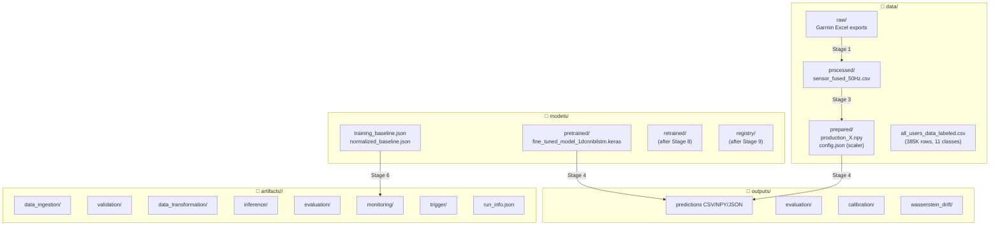
```mermaid
flowchart TD
    subgraph DATA["📁 data/"]
        RAW["raw/\nGarmin Excel exports"]
        PROC["processed/\nsensor_fused_50Hz.csv"]
        PREP["prepared/\nproduction_X.npy\nconfig.json (scaler)"]
        LABEL["all_users_data_labeled.csv\n(385K rows, 11 classes)"]
    end

    subgraph MODELS["📁 models/"]
        PRE["pretrained/\nfine_tuned_model_1dcnnbilstm.keras"]
        BASE["training_baseline.json\nnormalized_baseline.json"]
        RET["retrained/\n(after Stage 8)"]
        REG["registry/\n(after Stage 9)"]
    end

    subgraph OUTPUTS["📁 outputs/"]
        PRED["predictions CSV/NPY/JSON"]
        EVAL["evaluation/"]
        CAL["calibration/"]
        DRIFT["wasserstein_drift/"]
    end

    subgraph ARTIFACTS["📁 artifacts/<run_id>/"]
        A1["data_ingestion/"]
        A2["validation/"]
        A3["data_transformation/"]
        A4["inference/"]
        A5["evaluation/"]
        A6["monitoring/"]
        A7["trigger/"]
        ARI["run_info.json"]
    end

    RAW -->|"Stage 1"| PROC
    PROC -->|"Stage 3"| PREP
    PREP -->|"Stage 4"| PRED
    PRE -->|"Stage 4"| PRED
    BASE -->|"Stage 6"| A6
```

---

## How to Run Each Stage

```bash
# Full pipeline (stages 1–7)
python run_pipeline.py

# Individual stages
python run_pipeline.py --stages ingestion
python run_pipeline.py --stages validation
python run_pipeline.py --stages transformation
python run_pipeline.py --stages inference
python run_pipeline.py --stages evaluation
python run_pipeline.py --stages monitoring
python run_pipeline.py --stages trigger

# Enable retraining loop (stages 8–10)
python run_pipeline.py --retrain

# Enable advanced analytics (stages 11–14)
python run_pipeline.py --advanced

# Skip ingestion (use existing CSV)
python run_pipeline.py --skip-ingestion

# Standalone preprocessing (no full pipeline)
python scripts/preprocess.py --csv data/processed/sensor_fused_50Hz.csv

# Standalone training
python scripts/train.py --data data/all_users_data_labeled.csv
```

## Generated Files: What Can Be Cleaned

- `artifacts/<run_id>/`: safe to delete old timestamped run folders after you no longer need them for debugging, screenshots, or thesis evidence.
- `outputs/`: safe to delete transient files such as `*_fresh*`, timestamped prediction dumps, and rerunnable analysis exports.
- `outputs/` thesis figure PNGs: keep by default unless you are intentionally regenerating them.
- `reports/`: keep cited evidence and governance files by default, even if generated. In this repo that includes `ABLATION_WINDOWING.*`, `THRESHOLD_CALIBRATION.*`, `TRIGGER_POLICY_EVAL.*`, `DECISION_REGISTER.csv`, `EXTERNAL_REFERENCES.txt`, and `PAPER_SUPPORT_MAP.json`.
- Do not treat `models/`, `config/`, `src/`, or `tests/` as cleanup targets.

---

*Next: [02_src_deep_dive.md](02_src_deep_dive.md) — Every src/ file explained in detail*
