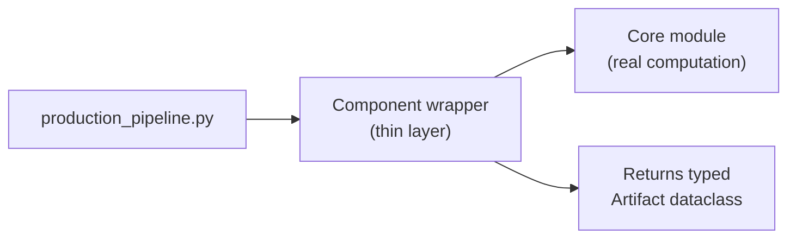
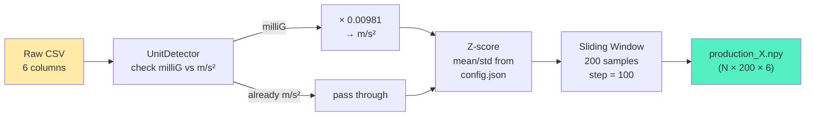
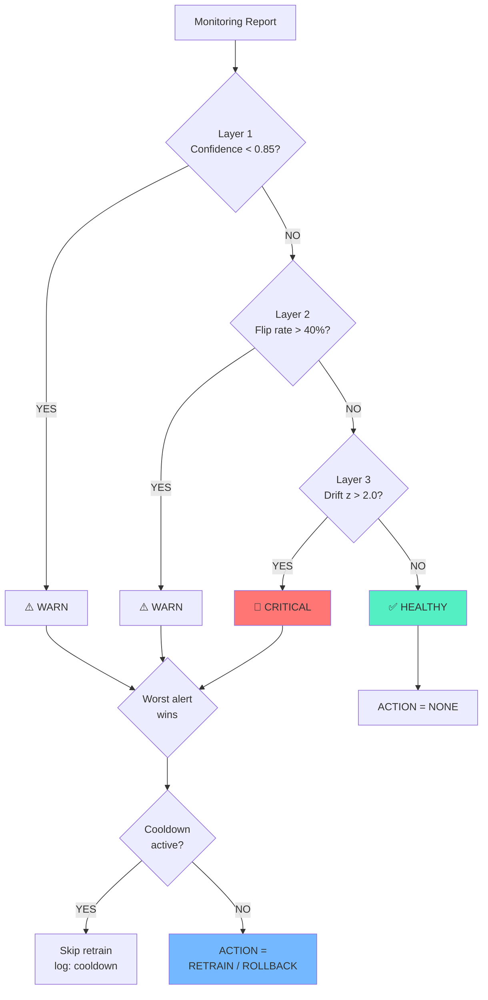
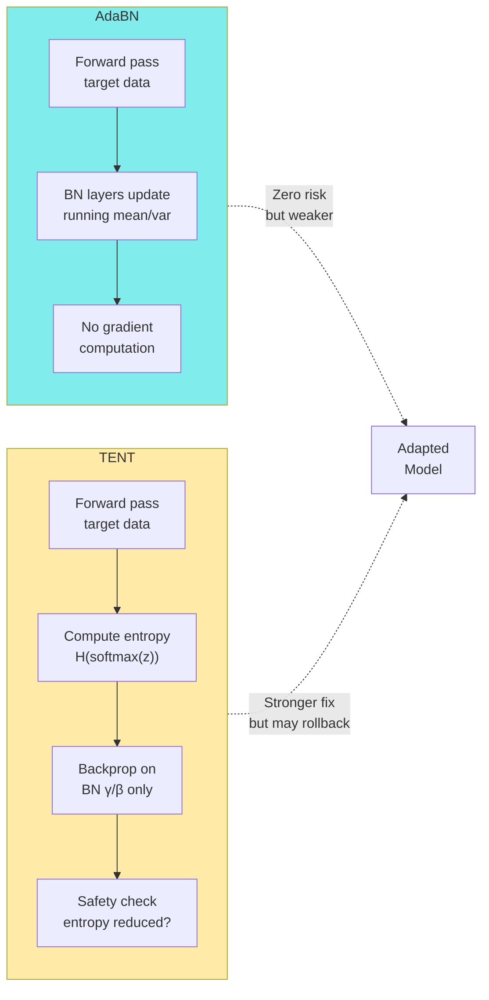
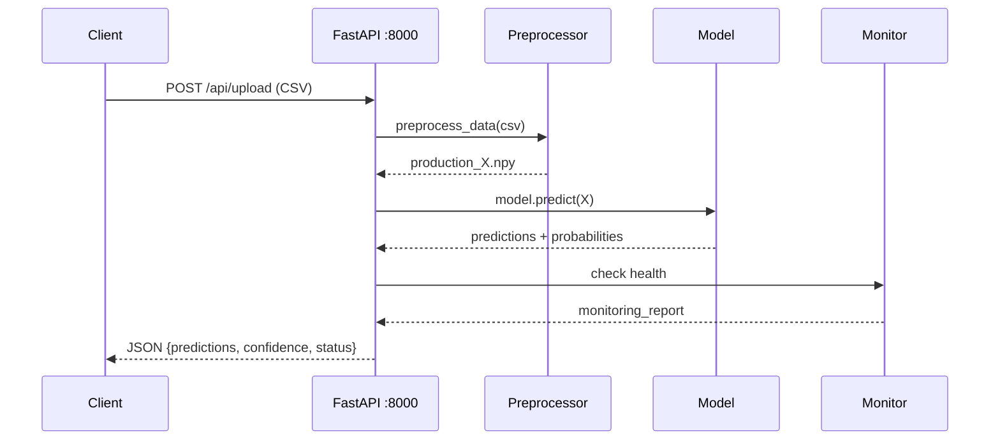

# Source Code Deep Dive — Every `src/` File

> Complete reference for every Python file in `src/`.  
> Organized by layer: **Pipeline → Components → Core Modules → Domain Adaptation → Utilities → API**.

---

## Table of Contents

| # | Section | Files |
|---|---------|-------|
| 1 | [Pipeline Orchestration](#1--pipeline-orchestration) | `production_pipeline.py`, `inference_pipeline.py` |
| 2 | [Stage Components](#2--stage-components-srccomponents) | 14 component wrappers |
| 3 | [Core Computation Modules](#3--core-computation-modules) | The "real work" files |
| 4 | [Domain Adaptation](#4--domain-adaptation) | `adabn.py`, `tent.py` |
| 5 | [Entity Contracts](#5--entity-contracts) | `config_entity.py`, `artifact_entity.py` |
| 6 | [Utilities](#6--utilities) | `artifacts_manager.py`, `common.py`, `main_utils.py`, etc. |
| 7 | [API & Deployment](#7--api--deployment) | `app.py`, `deployment_manager.py`, `prometheus_metrics.py` |
| 8 | [Standalone Modules](#8--standalone-modules) | `active_learning_export.py`, `ood_detection.py`, etc. |

---

## Architecture Overview

```mermaid
graph TD
    subgraph LAYER1["Entry Points"]
        CLI["run_pipeline.py"]
        API["src/api/app.py\nFastAPI :8000"]
    end

    subgraph LAYER2["Orchestration"]
        PP["production_pipeline.py\n14-stage sequencer"]
        IP["inference_pipeline.py\n(legacy)"]
    end

    subgraph LAYER3["Stage Wrappers (src/components/)"]
        C1["data_ingestion"]
        C2["data_validation"]
        C3["data_transformation"]
        C4["model_inference"]
        C5["model_evaluation"]
        C6["post_inference_monitoring"]
        C7["trigger_evaluation"]
        C8["model_retraining"]
        C9["model_registration"]
        C10["baseline_update"]
        C11["calibration_uncertainty"]
        C12["wasserstein_drift"]
        C13["curriculum_pseudo_labeling"]
        C14["sensor_placement"]
    end

    subgraph LAYER4["Core Computation"]
        M1["sensor_data_pipeline"]
        M2["data_validator"]
        M3["preprocess_data"]
        M4["run_inference"]
        M5["evaluate_predictions"]
        M6["monitoring (scripts/)"]
        M7["trigger_policy"]
        M8["train"]
        M9["model_rollback"]
        M10["build_baseline (scripts/)"]
        M11["calibration"]
        M12["wasserstein_drift"]
        M13["curriculum_pseudo_labeling"]
        M14["sensor_placement"]
    end

    subgraph LAYER5["Cross-Cutting"]
        CFG["config.py\npath constants"]
        ENT["entity/\nconfig + artifact types"]
        UTL["utils/\nartifacts, common, metrics"]
        DA["domain_adaptation/\nadabn + tent"]
        DEP["deployment_manager\nmlflow_tracking\nprometheus_metrics"]
    end

    CLI --> PP
    API --> PP
    PP --> C1 & C2 & C3 & C4 & C5 & C6 & C7 & C8 & C9 & C10 & C11 & C12 & C13 & C14
    C1 --> M1
    C2 --> M2
    C3 --> M3
    C4 --> M4
    C5 --> M5
    C6 --> M6
    C7 --> M7
    C8 --> M8
    C8 --> DA
    C9 --> M9
    C10 --> M10
    C11 --> M11
    C12 --> M12
    C13 --> M13
    C14 --> M14
    PP --> ENT
    PP --> UTL
    M1 & M2 & M3 & M4 & M7 --> CFG

    style PP fill:#55efc4
    style CFG fill:#ffeaa7
    style DA fill:#81ecec
```



---

## 1 — Pipeline Orchestration

### `src/pipeline/production_pipeline.py`

> 🧠 **The brain of the entire system.**

| Field | Detail |
|-------|--------|
| **Purpose** | Executes all 14 stages in order, manages skip/continue/retry, wires artifacts between stages, returns a single `PipelineResult` |
| **Importance** | 🔴 **Critical** — every pipeline run goes through this file |
| **When used** | Every time you run `python run_pipeline.py` |
| **Called by** | `run_pipeline.py` (CLI entry point) |
| **How** | `ProductionPipeline(configs...).run(stages=..., enable_retrain=..., enable_advanced=...)` |
| **Inputs** | 14 stage config objects + runtime flags (skip_ingestion, continue_on_failure, etc.) |
| **Outputs** | `PipelineResult` containing all stage artifacts + `artifacts/<timestamp>/run_info.json` |
| **Side effects** | Creates directories, writes artifacts, logs, may register models |
| **Dependencies** | All 14 component classes, `ArtifactsManager`, config/artifact entities |
| **Why it exists** | Separates "what order to run things" from "how each thing works" — classic orchestrator pattern |
| **Thesis role** | Implements the end-to-end MLOps lifecycle as modular, executable software |
| **Thesis sentence** | *"The production orchestrator executes all pipeline stages under a unified run contract with typed artifact passing."* |

**Key design decisions:**
- Stages run sequentially (not parallel) — each depends on the previous
- `continue_on_failure=True` logs errors but keeps going
- Retraining stages (8–10) only run with `--retrain` flag
- Advanced stages (11–14) only run with `--advanced` flag
- Baseline promotion is gated: `update_baseline=False` by default (governance)

---

### `src/pipeline/inference_pipeline.py`

| Field | Detail |
|-------|--------|
| **Purpose** | Legacy/alternate pipeline — runs only inference-related stages |
| **Importance** | 🟡 Low — superseded by `production_pipeline.py` |
| **When used** | If someone invokes it directly (backward compatibility) |
| **Why it exists** | Earlier iteration kept for reference; shows engineering evolution |
| **Thesis sentence** | *"An earlier inference-oriented pipeline was retained for backward compatibility."* |

---

## 2 — Stage Components (`src/components/`)

All 14 component files follow the same pattern:

```
Component class
  ├── __init__(pipeline_config, stage_config, upstream_artifact)
  └── initiate_<stage_name>() → StageArtifact
        ├── Imports the core module
        ├── Calls the real computation
        ├── Wraps result in typed artifact dataclass
        └── Returns artifact to orchestrator
```



### Stage 1 — `data_ingestion.py`

| Field | Detail |
|-------|--------|
| **Purpose** | Wraps `src/sensor_data_pipeline.py` — fuses raw accel+gyro exports |
| **Calls** | `SensorDataPipeline` or direct CSV file selection |
| **Returns** | `DataIngestionArtifact(fused_csv_path, n_rows, n_columns, sampling_hz, source_type)` |
| **Key logic** | Scans `data/raw/` for newest file pair, handles both Excel and CSV |

### Stage 2 — `data_validation.py`

| Field | Detail |
|-------|--------|
| **Purpose** | Wraps `src/data_validator.py` — enforces data quality gates |
| **Calls** | `DataValidator.validate(df)` |
| **Returns** | `DataValidationArtifact(is_valid, errors[], warnings[], stats)` |
| **Key logic** | If `is_valid=false` → raises `DataValidationError`, pipeline aborts |

### Stage 3 — `data_transformation.py`

| Field | Detail |
|-------|--------|
| **Purpose** | Wraps `src/preprocess_data.py` — converts CSV to windowed numpy arrays |
| **Calls** | `UnitDetector`, `UnifiedPreprocessor` |
| **Returns** | `DataTransformationArtifact(production_X_path, metadata_path, n_windows, window_size, unit_conversion_applied, gravity_removal_applied)` |
| **Key logic** | Applies unit conversion (milliG→m/s²), normalization (Z-score), sliding window |

### Stage 4 — `model_inference.py`

| Field | Detail |
|-------|--------|
| **Purpose** | Wraps `src/run_inference.py` — runs the trained model on windowed data |
| **Calls** | `_InferencePipeline(config).run()` |
| **Returns** | `ModelInferenceArtifact(predictions_csv_path, predictions_npy_path, probabilities_npy_path, n_predictions, inference_time_seconds, model_version, activity_distribution, confidence_stats)` |
| **Key logic** | Times the inference (`t0 = time.time()`), extracts confidence stats automatically |

### Stage 5 — `model_evaluation.py`

| Field | Detail |
|-------|--------|
| **Purpose** | Wraps `src/evaluate_predictions.py` — analyzes prediction quality |
| **Calls** | Evaluation functions from `evaluate_predictions.py` |
| **Returns** | `ModelEvaluationArtifact(report_json_path, distribution_summary, confidence_summary, has_labels, classification_metrics)` |
| **Key logic** | If labels exist → full accuracy/F1; if not → distribution + confidence only |

### Stage 6 — `post_inference_monitoring.py`

| Field | Detail |
|-------|--------|
| **Purpose** | Wraps `scripts/post_inference_monitoring.py` — 3-layer health check |
| **Calls** | `PostInferenceMonitor.run()` |
| **Returns** | `PostInferenceMonitoringArtifact(monitoring_report, overall_status, layer1_confidence, layer2_temporal, layer3_drift)` |
| **Key logic** | Loads baseline from `models/baselines/`, applies calibration temperature if available |

### Stage 7 — `trigger_evaluation.py`

| Field | Detail |
|-------|--------|
| **Purpose** | Wraps `src/trigger_policy.py` — decides whether to retrain |
| **Calls** | `TriggerPolicyEngine.evaluate(trigger_report)` |
| **Returns** | `TriggerEvaluationArtifact(should_retrain, action, alert_level, reasons[], cooldown_active)` |
| **Key logic** | Maps monitoring Layer 1/2/3 signals → trigger engine format → decision |

### Stage 8 — `model_retraining.py`

| Field | Detail |
|-------|--------|
| **Purpose** | Wraps `src/train.py` + domain adaptation modules |
| **Calls** | Trainer classes, `adapt_bn_statistics()`, `tent_adapt()` |
| **Returns** | `ModelRetrainingArtifact(retrained_model_path, training_report, adaptation_method, metrics, n_source_samples, n_target_samples)` |
| **Key logic** | Supports 4 adaptation methods: `none`, `adabn`, `tent`, `supervised` |

### Stage 9 — `model_registration.py`

| Field | Detail |
|-------|--------|
| **Purpose** | Wraps `src/model_rollback.py` — versions, compares, gates deployment |
| **Calls** | Model registry logic |
| **Returns** | `ModelRegistrationArtifact(registered_version, is_deployed, is_better_than_current, proxy_metrics)` |
| **Key logic** | Compares retrained model against current → deploys only if better |

### Stage 10 — `baseline_update.py`

| Field | Detail |
|-------|--------|
| **Purpose** | Wraps `scripts/build_training_baseline.py` — rebuilds drift reference stats |
| **Calls** | `BaselineBuilder` |
| **Returns** | `BaselineUpdateArtifact(baseline_path)` |
| **Key logic** | Promotion to shared `models/` path is gated by `promote_to_shared` flag |

### Stage 11 — `calibration_uncertainty.py`

| Field | Detail |
|-------|--------|
| **Purpose** | Wraps `src/calibration.py` — temperature scaling + ECE |
| **When** | `--advanced` flag |

### Stage 12 — `wasserstein_drift.py`

| Field | Detail |
|-------|--------|
| **Purpose** | Wraps `src/wasserstein_drift.py` — detailed per-channel drift analysis |
| **When** | `--advanced` flag |

### Stage 13 — `curriculum_pseudo_labeling.py`

| Field | Detail |
|-------|--------|
| **Purpose** | Wraps `src/curriculum_pseudo_labeling.py` — self-training with confidence-sorted pseudo-labels |
| **When** | `--advanced` flag |

### Stage 14 — `sensor_placement.py`

| Field | Detail |
|-------|--------|
| **Purpose** | Wraps `src/sensor_placement.py` — robustness across wrist positions |
| **When** | `--advanced` flag |

---

## 3 — Core Computation Modules

These are the files that do the **real work**. Components (above) are thin wrappers around these.

### `src/sensor_data_pipeline.py`

| Field | Detail |
|-------|--------|
| **Purpose** | Converts raw Garmin Excel/CSV exports into time-aligned, resampled sensor CSV |
| **Importance** | 🔴 Critical — without proper fusion, all downstream ML is invalid |
| **Main class** | `SensorDataPipeline` |
| **Process** | Find accel+gyro files → parse timestamps → merge on nearest → resample to 50 Hz → write CSV |
| **Inputs** | `data/raw/*.xlsx` (accel + gyro separately) |
| **Outputs** | `data/processed/sensor_fused_50Hz.csv` + metadata JSON |
| **Dependencies** | pandas, numpy, scipy |
| **Run standalone** | `python src/sensor_data_pipeline.py` |
| **Thesis sentence** | *"Raw multi-sensor wearable exports are fused and resampled into a canonical 50 Hz six-channel representation."* |

### `src/preprocess_data.py`

| Field | Detail |
|-------|--------|
| **Purpose** | Production preprocessing: unit detection → conversion → normalization → windowing → `.npy` |
| **Importance** | 🔴 Critical — this is the contract between raw data and model |
| **Key classes** | `UnitDetector`, `UnifiedPreprocessor` |
| **Process** | Detect milliG vs m/s² → convert × 0.00981 → Z-score (saved scaler) → window (200, step=100) |
| **Inputs** | Fused CSV + `data/prepared/config.json` (scaler params) |
| **Outputs** | `data/prepared/production_X.npy` + `metadata.json` |
| **Dependencies** | numpy, pandas, scipy, sklearn |
| **Why it matters** | Most "bad accuracy" bugs come from preprocessing contract violations |
| **Thesis sentence** | *"Production preprocessing enforces unit normalization and windowing to match the training contract."* |

**Preprocessing pipeline detail:**



### `src/data_validator.py`

| Field | Detail |
|-------|--------|
| **Purpose** | Validates fused sensor data for schema, types, ranges, missing values |
| **Main class** | `DataValidator` |
| **usage** | `DataValidator(config).validate(df)` → `ValidationResult` |
| **Checks** | Required columns · Numeric dtypes · Missing ratio < threshold · Value ranges · Sampling rate ~50 Hz |
| **Dependencies** | pandas, yaml |
| **Thesis sentence** | *"Data-quality gates prevent malformed input from reaching the model."* |

### `src/run_inference.py`

| Field | Detail |
|-------|--------|
| **Purpose** | Loads the Keras model and runs batch prediction on windowed `.npy` |
| **Main class** | `_InferencePipeline` |
| **Process** | Load `.keras` → `model.predict(X)` → softmax → argmax + confidence → CSV/NPY |
| **Model** | `models/pretrained/fine_tuned_model_1dcnnbilstm.keras` (input: `(None, 200, 6)`, output: `(None, 11)`) |
| **Dependencies** | TensorFlow/Keras, numpy, pandas |
| **Thesis sentence** | *"Inference runs as a vectorized batch prediction with per-window confidence scoring."* |

### `src/evaluate_predictions.py`

| Field | Detail |
|-------|--------|
| **Purpose** | Analyzes prediction quality — distribution stats, confidence, optional labeled metrics |
| **Process** | Distribution summary → confidence analysis → ECE (if calibrated) → classification report (if labels) |
| **Dependencies** | numpy, pandas, sklearn |
| **Thesis sentence** | *"Evaluation generates confidence and distribution analytics, with optional labeled accuracy metrics."* |

### `src/trigger_policy.py`

| Field | Detail |
|-------|--------|
| **Purpose** | Decision engine: monitoring signals → retrain/rollback/monitor action |
| **Main classes** | `TriggerPolicyEngine`, `TriggerThresholds`, `TriggerDecision` |
| **Process** | Check Layer 1 (confidence) → Layer 2 (temporal) → Layer 3 (drift) → worst alert wins |
| **Outputs** | `TriggerDecision(should_trigger, action, alert_level, recommendations[])` |
| **Cooldown** | Prevents retraining more than once in N hours |
| **Dependencies** | Python stdlib |
| **Thesis sentence** | *"A multi-signal trigger policy evaluates three monitoring layers to issue retrain or rollback decisions."* |

**Trigger decision flow:**



### `src/train.py`

| Field | Detail |
|-------|--------|
| **Purpose** | Training and retraining with support for domain adaptation |
| **Importance** | 🔴 Critical for the retraining loop |
| **Methods** | Supervised training, AdaBN adaptation, TENT adaptation |
| **Inputs** | Labeled training data + optional unlabeled target data |
| **Outputs** | Retrained model file + training metrics + scaler/label encoder artifacts |
| **Dependencies** | TensorFlow/Keras, numpy, pandas, sklearn, mlflow |
| **Thesis sentence** | *"The retraining module closes the monitoring→retraining loop with supervised and adaptation-based paths."* |

### `src/model_rollback.py`

| Field | Detail |
|-------|--------|
| **Purpose** | Model registry with version control, comparison gate, and rollback |
| **Process** | Compare new model metrics vs current → deploy only if better → rollback if degraded |
| **Governance** | Safe-by-default: won't deploy unless explicitly approved |
| **Dependencies** | TensorFlow/Keras, json, shutil |
| **Thesis sentence** | *"Registry governance prevents deployment of regressions with automatic rollback capability."* |

### `src/diagnostic_pipeline_check.py`

| Field | Detail |
|-------|--------|
| **Purpose** | Diagnoses preprocessing contract mismatches (window size, scaling, channel order) |
| **When used** | Manually, when accuracy is unexpectedly low |
| **Inputs** | `data/prepared/config.json`, `production_metadata.json`, `production_X.npy` |
| **Why it exists** | Most "bad accuracy" bugs = preprocessing contract violations, not model problems |
| **Thesis sentence** | *"A diagnostic tool distinguishes domain shift from implementation errors by checking contract consistency."* |

---

## 4 — Domain Adaptation

### `src/domain_adaptation/adabn.py`

| Field | Detail |
|-------|--------|
| **Purpose** | AdaBN — updates batch-normalization running statistics using unlabeled target data |
| **Importance** | 🟡 Medium-High — lightweight unsupervised adaptation |
| **Function** | `adapt_bn_statistics(model, target_X, ...)` |
| **How it works** | Forward-pass target data through model → BN layers update running mean/var → model adapted |
| **No labels needed** | ✅ Fully unsupervised |
| **Side effects** | Mutates BN layer statistics (clone model first if you need original) |
| **Dependencies** | TensorFlow/Keras, numpy |
| **Thesis sentence** | *"AdaBN updates batch-normalization statistics using unlabeled production windows to reduce domain mismatch."* |

### `src/domain_adaptation/tent.py`

| Field | Detail |
|-------|--------|
| **Purpose** | TENT — adapts BN affine parameters (γ/β) by minimizing entropy on target predictions |
| **Importance** | 🟡 Medium-High — main adaptation method for moderate drift |
| **Function** | `tent_adapt(model, target_X, ...)` → `(adapted_model, meta)` |
| **How it works** | Freeze all weights except BN γ/β → minimize Shannon entropy of softmax output → iterate |
| **Safety** | Built-in OOD guard and rollback: if adaptation makes things worse → revert |
| **Meta output** | `{entropy_delta, confidence_delta, rolled_back: bool}` |
| **Dependencies** | TensorFlow/Keras, numpy |
| **Thesis sentence** | *"TENT performs entropy-minimizing updates of BN affine parameters with safety rollback for OOD data."* |

**AdaBN vs TENT comparison:**



---

## 5 — Entity Contracts

### `src/entity/config_entity.py`

| Field | Detail |
|-------|--------|
| **Purpose** | Typed dataclasses for all stage configurations |
| **Importance** | 🔴 Critical — shared contract across entire system |
| **Key classes** | `PipelineConfig`, `DataIngestionConfig`, `DataTransformationConfig`, `ModelInferenceConfig`, `PostInferenceMonitoringConfig`, `TriggerEvaluationConfig`, `ModelRetrainingConfig`, `ModelRegistrationConfig`, `BaselineUpdateConfig`, `CalibrationUncertaintyConfig`, `WassersteinDriftConfig`, `CurriculumPseudoLabelingConfig`, `SensorPlacementConfig` |
| **Pattern** | Each config = Python `@dataclass` with sensible defaults, overridable from YAML/CLI |
| **Thesis sentence** | *"Typed configuration entities define explicit contracts for each pipeline stage."* |

### `src/entity/artifact_entity.py`

| Field | Detail |
|-------|--------|
| **Purpose** | Typed dataclasses for all stage outputs |
| **Importance** | 🔴 Critical — prevents loosely-typed dict passing between stages |
| **Key classes** | `DataIngestionArtifact` (10 stages → 10 artifact classes) |
| **Pattern** | Each artifact = `@dataclass` with paths, counts, flags, optional metrics |
| **Design benefit** | IDE autocompletion, type checking, explicit field documentation |
| **Thesis sentence** | *"Structured artifact entities ensure consistent, traceable data flow between pipeline stages."* |

---

## 6 — Utilities

### `src/utils/artifacts_manager.py`

| Field | Detail |
|-------|--------|
| **Purpose** | Creates timestamped run directories and saves stage outputs |
| **Main class** | `ArtifactsManager` |
| **Methods** | `initialize()` → create dir, `save_file(path, stage)`, `save_json(dict, stage, name)`, `log_stage_completion(stage, status, metrics)`, `finalize()` |
| **Creates** | `artifacts/<YYYYMMDD_HHMMSS>/` with 7 subdirs + `run_info.json` |
| **Dependencies** | pathlib, json, shutil |
| **Thesis sentence** | *"Each run produces a timestamped artifact bundle for full traceability."* |

### `src/utils/common.py`

| Field | Detail |
|-------|--------|
| **Purpose** | Generic I/O helpers: read/write JSON, YAML, NumPy; file operations |
| **Used by** | Almost every module that reads/writes files |

### `src/utils/main_utils.py`

| Field | Detail |
|-------|--------|
| **Purpose** | Pipeline-aware utilities: load models, save predictions, structured logging |
| **Used by** | Components and core modules |

### `src/utils/config_loader.py`

| Field | Detail |
|-------|--------|
| **Purpose** | Load YAML config overrides + environment variable overrides (12-Factor App Factor III) |
| **Functions** | `load_yaml_overrides(path)`, `apply_overrides(config, overrides)`, `load_monitoring_config()`, `load_trigger_config()` |
| **Pattern** | Override priority: CLI args > env vars > YAML file > dataclass defaults |

### `src/utils/temporal_metrics.py`

| Field | Detail |
|-------|--------|
| **Purpose** | Compute temporal flip rates per session for monitoring Layer 2 |
| **Functions** | `flip_rate_per_session(sessions, labels)`, `summarize_rates(rates)` |
| **Used by** | `scripts/threshold_sweep.py`, `scripts/windowing_ablation.py`, monitoring |

### `src/utils/production_optimizations.py`

| Field | Detail |
|-------|--------|
| **Purpose** | Model caching (avoid repeated loads), vectorized prediction, TF-Lite conversion |
| **Key features** | LRU model cache, batch size optimization, TFLite benchmarking |

### `src/config.py`

| Field | Detail |
|-------|--------|
| **Purpose** | Central path constants for the entire project |
| **Key constants** | `PROJECT_ROOT`, `DATA_DIR`, `MODELS_DIR`, `WINDOW_SIZE=200`, `OVERLAP=0.5`, `NUM_SENSORS=6`, `NUM_CLASSES=11`, `ACTIVITY_LABELS` (11 activities), `SENSOR_COLUMNS` |
| **Used by** | Almost everything |

---

## 7 — API & Deployment

### `src/api/app.py`

| Field | Detail |
|-------|--------|
| **Purpose** | FastAPI inference service with embedded monitoring dashboard |
| **Endpoints** | `/api/health`, `/api/upload` (CSV → predictions), `/api/predict`, `/dashboard` |
| **Features** | File upload → preprocessing → inference → monitoring → JSON response |
| **Dependencies** | FastAPI, uvicorn, TensorFlow |
| **Run** | `uvicorn src.api.app:app --port 8000` or `docker compose up` |
| **Thesis sentence** | *"A FastAPI service exposes the pipeline as a REST API with health checks and monitoring."* |

**API request flow:**



### `src/deployment_manager.py`

| Field | Detail |
|-------|--------|
| **Purpose** | Manages model deployment lifecycle: container build/push, blue-green, canary releases |
| **Key classes** | `DeploymentConfig`, `ContainerBuilder`, `DeploymentManager` |
| **Features** | Docker image build, container health checks, blue-green switching, canary rollout |
| **Dependencies** | Docker, subprocess |
| **Thesis sentence** | *"A deployment manager supports blue-green and canary releases for safe model updates."* |

### `src/prometheus_metrics.py`

| Field | Detail |
|-------|--------|
| **Purpose** | Exports pipeline metrics in Prometheus format for Grafana dashboards |
| **Key classes** | `MetricDefinition`, `MetricsExporter`, `MetricsHandler` |
| **Metrics** | Model F1/accuracy, data drift (PSI, KS), confidence/entropy, latency, throughput, trigger state |
| **Endpoint** | Starts HTTP server on port for `/metrics` scraping |
| **Dependencies** | http.server (stdlib) |
| **Thesis sentence** | *"Prometheus metrics enable real-time operational monitoring and Grafana dashboarding."* |

### `src/mlflow_tracking.py`

| Field | Detail |
|-------|--------|
| **Purpose** | Centralized MLflow integration: experiment setup, run management, metric/artifact logging, model registry |
| **Main class** | `MLflowTracker` |
| **Functions** | `get_or_create_tracker()`, `quick_log_run()` |
| **Features** | Auto-create experiments, log params/metrics/artifacts, register models, infer signatures |
| **Dependencies** | mlflow, pandas, numpy |
| **Thesis sentence** | *"MLflow tracking provides centralized experiment management and model versioning."* |

---

## 8 — Standalone Modules

### `src/active_learning_export.py`

| Field | Detail |
|-------|--------|
| **Purpose** | Selects uncertain samples for human labeling (active learning loop) |
| **Key classes** | `ActiveLearningConfig`, `UncertaintySampler`, `DiversitySampler`, `ActiveLearningExporter` |
| **Strategies** | Low confidence, high entropy, high disagreement, high energy score |
| **Output** | CSV/JSON of selected samples + metadata for labeling |
| **Thesis sentence** | *"Active learning utilities select the most informative samples for human labeling."* |

### `src/ood_detection.py`

| Field | Detail |
|-------|--------|
| **Purpose** | Energy-based Out-of-Distribution detection |
| **Formula** | $E(x) = -\log(\sum \exp(f_i(x)))$ — lower energy = in-distribution |
| **Key classes** | `OODConfig`, `EnergyOODDetector`, `EnsembleOODDetector` |
| **Integration** | `add_ood_metrics_to_monitoring()` — plugs into monitoring pipeline |
| **Dependencies** | numpy |
| **Thesis sentence** | *"Energy-based OOD detection identifies inputs outside the training distribution."* |

### `src/calibration.py`

| Field | Detail |
|-------|--------|
| **Purpose** | Post-hoc calibration (temperature scaling) + Expected Calibration Error (ECE) |
| **Stage** | 11 (advanced) via `calibration_uncertainty.py` component |
| **Why it matters** | Calibrated confidence → more reliable monitoring thresholds |
| **Thesis sentence** | *"Temperature scaling improves confidence calibration for reliable monitoring decisions."* |

### `src/wasserstein_drift.py`

| Field | Detail |
|-------|--------|
| **Purpose** | Per-channel Wasserstein distance computation for drift detection |
| **Stage** | 12 (advanced) |
| **Thesis sentence** | *"Wasserstein distance quantifies per-channel distribution drift between training and production data."* |

### `src/curriculum_pseudo_labeling.py`

| Field | Detail |
|-------|--------|
| **Purpose** | Self-training: assign pseudo-labels to confident unlabeled windows, retrain |
| **Stage** | 13 (advanced) |
| **Process** | Sort by confidence → accept high-confidence predictions as labels → retrain model |
| **Thesis sentence** | *"Curriculum pseudo-labeling enables self-training on unlabeled production data."* |

### `src/sensor_placement.py`

| Field | Detail |
|-------|--------|
| **Purpose** | Robustness evaluation across wrist sensor placements |
| **Stage** | 14 (advanced) |
| **Thesis sentence** | *"Sensor placement robustness tests verify model stability across wrist positions."* |

### `src/robustness.py`

| Field | Detail |
|-------|--------|
| **Purpose** | General robustness evaluation: noise injection, missing data, jitter |
| **Thesis sentence** | *"Robustness utilities quantify model stability under sensor degradation conditions."* |

---

*Next: [03_scripts_reference.md](03_scripts_reference.md) — Every script explained*
