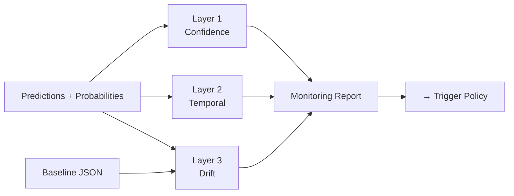
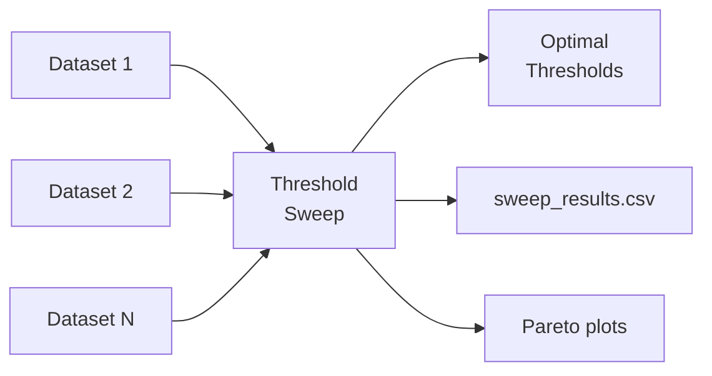

# Scripts Reference — Every `scripts/` File

> Complete reference for every helper/automation script.  
> Organized by purpose: **Pipeline Ops → Benchmarks → Thesis Tools → Data Analysis → Testing & QA**.

---

## Table of Contents

| # | Section | Scripts |
|---|---------|---------|
| 1 | [Pipeline Operations](#1--pipeline-operations) | verify, audit, smoke test, baseline |
| 2 | [Data Quality & Preprocessing](#2--data-quality--preprocessing) | preprocess, preprocess_qc |
| 3 | [Monitoring & Metrics](#3--monitoring--metrics) | post_inference_monitoring, verify_prometheus_metrics |
| 4 | [Benchmark & Performance](#4--benchmarks--performance) | latency, throughput |
| 5 | [Threshold & Policy Tuning](#5--threshold--policy-tuning) | threshold_sweep, trigger_policy_eval |
| 6 | [Data Analysis & Experiments](#6--data-analysis--experiments) | drift, inference, windowing, A/B |
| 7 | [Thesis Tools](#7--thesis-tools) | figures, progress, papers, export |
| 8 | [Utility & Training](#8--utility--training) | run_tests, train, baselines |

---

## How to Read Each Entry

Every script is documented with this template:

```
📄 <filename>
├─ Purpose:  What it does (1 sentence)
├─ Run:      How to execute it
├─ Inputs:   What it reads
├─ Outputs:  What it produces
├─ Key args: CLI flags
├─ Used by:  Who/what calls it
└─ Thesis:   Why it matters for the thesis
```

---

## 1 — Pipeline Operations

### `scripts/verify_repository.py`

| Field | Detail |
|-------|--------|
| **Purpose** | Checks repository completeness — verifies every required file, directory, import, and config is in place after setup |
| **Run** | `python scripts/verify_repository.py --verbose` |
| **Key CLI args** | `--fix` (auto-create missing dirs), `--verbose` (show every check) |
| **Exit code** | `0` = all pass, `1` = something missing |
| **When to use** | After cloning, after cleanup, before CI |
| **Thesis sentence** | *"A repository verification script asserts structural completeness before any pipeline run."* |

### `scripts/audit_artifacts.py`

| Field | Detail |
|-------|--------|
| **Purpose** | Verifies that all expected output artifacts (CSVs, NPYs, JSONs, models) exist for a pipeline run |
| **Run** | `python scripts/audit_artifacts.py --run-id 20260222_175301` |
| **Key CLI args** | `--retrain` (include stages 8-10), `--run-id <timestamp>` |
| **Inputs** | `artifacts/<run_id>/` directory tree |
| **Outputs** | Console report: present ✅ / missing ❌ per stage |
| **When to use** | After every pipeline run; in CI to gate release |
| **Thesis sentence** | *"Post-run auditing verifies artifact completeness for each pipeline stage."* |

### `scripts/inference_smoke.py`

| Field | Detail |
|-------|--------|
| **Purpose** | Smoke-tests the FastAPI inference service: health check + upload synthetic CSV |
| **Run** | `python scripts/inference_smoke.py --endpoint http://localhost:8000` |
| **Key CLI args** | `--endpoint <url>` |
| **Dependencies** | Zero — uses only Python stdlib (`urllib`) |
| **Inputs** | Generates synthetic CSV in-memory |
| **Outputs** | Console log of API responses + exit code |
| **When to use** | After `docker compose up` or API deploy |
| **Thesis sentence** | *"Smoke tests validate the API contract before accepting production traffic."* |

---

## 2 — Data Quality & Preprocessing

### `scripts/preprocess.py`

| Field | Detail |
|-------|--------|
| **Purpose** | Standalone preprocessing entry point — runs the same pipeline as Stage 3 from the CLI |
| **Run** | `python scripts/preprocess.py` |
| **Calls** | `src/preprocess_data.py` → `UnifiedPreprocessor` |
| **Inputs** | `data/processed/sensor_fused_50Hz.csv` |
| **Outputs** | `data/prepared/production_X.npy`, `production_metadata.json` |
| **When to use** | One-off preprocessing outside the pipeline |

### `scripts/preprocess_qc.py` (802 lines)

| Field | Detail |
|-------|--------|
| **Purpose** | Comprehensive preprocessing quality control — validates the entire preprocessing contract |
| **Run** | `python scripts/preprocess_qc.py` |
| **Main class** | `PreprocessQC` |
| **Checks** | Window shape · Value ranges · Scaler consistency · Gravity removal · SessionID alignment · NaN/Inf detection |
| **Outputs** | Detailed QC report (JSON) with pass/fail per check |
| **LOC** | **802 lines** — the most thorough QA script in the project |
| **Thesis sentence** | *"An 800-line QC module validates 15+ preprocessing invariants against the training contract."* |

---

## 3 — Monitoring & Metrics

### `scripts/post_inference_monitoring.py`

| Field | Detail |
|-------|--------|
| **Purpose** | 3-layer post-inference monitoring: confidence analysis, temporal anomaly detection, distribution drift |
| **Main class** | `PostInferenceMonitor` (constructor: `confidence_threshold=0.5`, `uncertain_threshold_pct=10.0`, `drift_threshold=2.0`, `calibration_temperature=1.0`) |
| **Called by** | Stage 6 component (`src/components/post_inference_monitoring.py`) |
| **Inputs** | Prediction probabilities `.npy` + training baseline JSON |
| **Outputs** | `MonitoringReport` object → serialized to `outputs/monitoring/report.json` |
| **3 Layers** | Layer 1: confidence stats + ECE; Layer 2: temporal flip rate; Layer 3: drift (z-score, PSI, KS, Wasserstein) |
| **Thesis sentence** | *"A three-layer monitoring system analyzes confidence, temporal stability, and distribution drift."* |



### `scripts/verify_prometheus_metrics.py`

| Field | Detail |
|-------|--------|
| **Purpose** | Checks required Prometheus metrics are exposed on the `/metrics` endpoint |
| **Run** | `python scripts/verify_prometheus_metrics.py` |
| **Checks** | Required metric names present, types correct, timestamps valid |
| **When to use** | After starting the API with metrics enabled |

---

## 4 — Benchmarks & Performance

### `scripts/benchmark_latency.py`

| Field | Detail |
|-------|--------|
| **Purpose** | Measures inference latency: p50, p95, p99 percentiles over many requests |
| **Run** | `python scripts/benchmark_latency.py` |
| **Outputs** | Latency distribution stats (ms), printed to console and/or saved to JSON |
| **Thesis sentence** | *"Latency benchmarks verify sub-second inference for real-time HAR deployment."* |

### `scripts/benchmark_throughput.py`

| Field | Detail |
|-------|--------|
| **Purpose** | Measures throughput (requests/second) at various concurrency levels |
| **Run** | `python scripts/benchmark_throughput.py` |
| **Outputs** | Throughput table: concurrency × requests/sec |
| **When to use** | Before deployment to size infrastructure |
| **Thesis sentence** | *"Throughput benchmarks characterize the system's capacity under concurrent load."* |

---

## 5 — Threshold & Policy Tuning

### `scripts/threshold_sweep.py` (575 lines)

| Field | Detail |
|-------|--------|
| **Purpose** | Data-driven threshold calibration — sweeps monitoring thresholds to find optimal operating points |
| **Run** | `python scripts/threshold_sweep.py` |
| **LOC** | **575 lines**, 20+ functions |
| **Process** | Load all datasets → sweep confidence/drift/temporal thresholds → compute FPR/FNR → find Pareto-optimal |
| **Outputs** | Optimized threshold suggestions + sweep result CSV + matplotlib plots |
| **Inputs** | Multiple dataset artifact directories |
| **Dependencies** | numpy, pandas, matplotlib, src.trigger_policy |
| **Thesis sentence** | *"An automated sweep evaluates 1000+ threshold combinations to minimize false-positive trigger rates."* |



### `scripts/trigger_policy_eval.py`

| Field | Detail |
|-------|--------|
| **Purpose** | Replays simulated sessions and compares trigger policy variants |
| **Run** | `python scripts/trigger_policy_eval.py` |
| **Process** | Builds synthetic monitoring scenarios → runs each through trigger policy → compares decisions |
| **Outputs** | Trigger decision comparison table |
| **Thesis sentence** | *"Simulated session replay validates trigger policy robustness across edge-case scenarios."* |

---

## 6 — Data Analysis & Experiments

### `scripts/run_ab_comparison.py`

| Field | Detail |
|-------|--------|
| **Purpose** | Statistical A/B/C comparison of normalization strategies with k-fold cross-validation |
| **Run** | `python scripts/run_ab_comparison.py` |
| **Compares** | Raw vs normalized vs alternative-normalized pipelines |
| **Method** | k-fold CV → accuracy per fold → paired t-test or McNemar |
| **Outputs** | Statistical comparison report |
| **Thesis sentence** | *"A/B testing with k-fold CV confirms statistically significant normalization benefits."* |

### `scripts/analyze_drift_across_datasets.py`

| Field | Detail |
|-------|--------|
| **Purpose** | Multi-dataset drift analysis — compares drift signals across different user/session datasets |
| **Run** | `python scripts/analyze_drift_across_datasets.py` |
| **Inputs** | Multiple processed dataset folders |
| **Outputs** | Cross-dataset drift comparison report |
| **Thesis sentence** | *"Cross-dataset drift analysis reveals population-level distribution variation patterns."* |

### `scripts/per_dataset_inference.py`

| Field | Detail |
|-------|--------|
| **Purpose** | Runs inference per dataset and collects per-dataset confidence statistics |
| **Run** | `python scripts/per_dataset_inference.py` |
| **Outputs** | Per-dataset accuracy, confidence, entropy stats |
| **Thesis sentence** | *"Per-dataset inference reveals user-specific accuracy variation."* |

### `scripts/windowing_ablation.py`

| Field | Detail |
|-------|--------|
| **Purpose** | Grid search over `window_size × overlap` to find optimal windowing parameters |
| **Run** | `python scripts/windowing_ablation.py` |
| **Grid** | Window sizes (100, 150, 200, 250, 300) × overlaps (0.25, 0.5, 0.75) |
| **Metrics** | Accuracy + flip rate for each combination |
| **Outputs** | Ablation table + heatmap plot |
| **Thesis sentence** | *"Windowing ablation justifies the 200-sample, 50% overlap choice through systematic grid search."* |

---

## 7 — Thesis Tools

### `scripts/generate_thesis_figures.py`

| Field | Detail |
|-------|--------|
| **Purpose** | Generates all publication-quality thesis figures (300 DPI PNG) |
| **Run** | `python scripts/generate_thesis_figures.py` |
| **Outputs** | `docs/figures/*.png` — pipeline diagrams, confusion matrices, drift plots, etc. |
| **Dependencies** | matplotlib, numpy, pandas |
| **Thesis sentence** | *"All thesis figures are reproducible from a single script."* |

### `scripts/update_progress_dashboard.py`

| Field | Detail |
|-------|--------|
| **Purpose** | Generates a Markdown progress dashboard with TRS (Thesis Readiness Score) and ERS (Engineering Readiness Score) |
| **Run** | `python scripts/update_progress_dashboard.py --config config/progress.yaml` |
| **Key CLI args** | `--config <yaml>`, `--output <md>` |
| **Scoring** | TRS: Writing 45% + Experiments 35% + System 20%; ERS: similar |
| **Outputs** | `DASHBOARD.md` with scores, progress bars, week countdown |
| **Thesis sentence** | *"A progress dashboard quantifies thesis readiness with weighted scoring."* |

### `scripts/export_mlflow_runs.py`

| Field | Detail |
|-------|--------|
| **Purpose** | Exports MLflow experiment runs to CSV for offline analysis and thesis tables |
| **Run** | `python scripts/export_mlflow_runs.py --experiment "HAR-production"` |
| **Key CLI args** | `--experiment <name>`, `--tracking-uri <url>`, `--status FINISHED`, `--no-tags` |
| **Outputs** | `outputs/mlflow_export_<exp>_<timestamp>.csv` |

### `scripts/extract_papers_to_text.py`

| Field | Detail |
|-------|--------|
| **Purpose** | Converts reference PDFs to plain text for search/analysis |
| **Run** | `python scripts/extract_papers_to_text.py --root Thesis_report/` |
| **Key CLI args** | `--root <dir>`, `--max-pages <int>` |
| **Outputs** | `Thesis_report/papers_text/<name>.txt` |
| **Dependencies** | PyMuPDF (primary) or pdfminer.six (fallback) |

### `scripts/fetch_foundation_papers.py`

| Field | Detail |
|-------|--------|
| **Purpose** | Downloads 5 foundational primary-source PDFs (AdaBN, TENT, EWC, etc.) |
| **Run** | `python scripts/fetch_foundation_papers.py` or `--dry-run` |
| **Key CLI args** | `--dry-run` (print URLs only, no download) |
| **Outputs** | `Thesis_report/refs/*.pdf` |

### `scripts/regenerate_support_map.py`

| Field | Detail |
|-------|--------|
| **Purpose** | Rebuilds `PAPER_SUPPORT_MAP.json` — maps pipeline components to supporting academic papers |
| **Run** | `python scripts/regenerate_support_map.py` |
| **Outputs** | Updated `PAPER_SUPPORT_MAP.json` |

---

## 8 — Utility & Training

### `scripts/train.py`

| Field | Detail |
|-------|--------|
| **Purpose** | Standalone training entry point — same as Stage 8 but runnable independently |
| **Run** | `python scripts/train.py` |
| **Calls** | `src/train.py` core module |

### `scripts/build_training_baseline.py`

| Field | Detail |
|-------|--------|
| **Purpose** | Rebuilds drift-detection baselines from labeled training CSV |
| **Run** | `python scripts/build_training_baseline.py --data data/all_users_data_labeled.csv` |
| **Key CLI args** | `--data <csv>`, `--output <json>`, `--output-normalized <json>` |
| **Main class** | `BaselineBuilder` |
| **Inputs** | Labeled training CSV |
| **Outputs** | `models/training_baseline.json`, `models/normalized_baseline.json` |
| **Called by** | Stage 10 (Baseline Update) component |
| **Thesis sentence** | *"Training baselines encode reference distributions for Layer 3 drift detection."* |

### `scripts/build_normalized_baseline.py`

| Field | Detail |
|-------|--------|
| **Purpose** | Builds baseline statistics specifically for Layer 3 drift detection on normalized data |
| **Run** | `python scripts/build_normalized_baseline.py` |
| **Outputs** | `models/baselines/normalized_baseline.json` |

### `scripts/run_tests.py`

| Field | Detail |
|-------|--------|
| **Purpose** | Convenience wrapper to run pytest with common configurations |
| **Run** | `python scripts/run_tests.py --coverage --quick` |
| **Key CLI args** | `--unit` (unit only), `--coverage` (with report), `--quick` (skip slow), `--specific <name>` |
| **Calls** | `subprocess.run(["pytest", ...])` |

---

## Script Dependency Map

Which scripts depend on which `src/` modules:

```mermaid
graph TD
    subgraph "Scripts"
        VR["verify_repository"]
        AA["audit_artifacts"]
        IS["inference_smoke"]
        PP["preprocess"]
        PQC["preprocess_qc"]
        PIM["post_inference_monitoring"]
        VPM["verify_prometheus_metrics"]
        BL["benchmark_latency"]
        BT["benchmark_throughput"]
        TS["threshold_sweep"]
        TPE["trigger_policy_eval"]
        ABC["run_ab_comparison"]
        ADD["analyze_drift"]
        PDI["per_dataset_inference"]
        WA["windowing_ablation"]
        GTF["generate_thesis_figures"]
        BTB["build_training_baseline"]
    end

    subgraph "src/ modules"
        CFG["config.py"]
        PRE["preprocess_data.py"]
        INF["run_inference.py"]
        TP["trigger_policy.py"]
        TM["temporal_metrics.py"]
        VAL["data_validator.py"]
    end

    PP --> PRE
    PQC --> PRE
    PQC --> CFG
    PIM --> CFG
    TS --> TP
    TS --> TM
    TS --> CFG
    TPE --> TP
    ABC --> PRE
    ABC --> INF
    ADD --> CFG
    PDI --> INF
    WA --> TM
    BTB --> CFG
    GTF --> CFG

    VR -.->|"stdlib only"| VR
    AA -.->|"stdlib only"| AA
    IS -.->|"stdlib only"| IS
```



---

*Next: [04_tests_reference.md](04_tests_reference.md) — Every test explained*
