# Tests Reference — Every `tests/` File

> Complete reference for every test file in the project.  
> Organized by layer: **Fixtures → Unit Tests → Integration Tests → QA & Cross-Cutting**.

---

## Table of Contents

| # | Section | Files |
|---|---------|-------|
| 1 | [Shared Fixtures](#1--shared-fixtures) | `conftest.py` |
| 2 | [Data & Preprocessing Tests](#2--data--preprocessing-tests) | 3 files |
| 3 | [Model & Inference Tests](#3--model--inference-tests) | 5 files |
| 4 | [Monitoring & Drift Tests](#4--monitoring--drift-tests) | 5 files |
| 5 | [Pipeline & Deployment Tests](#5--pipeline--deployment-tests) | 5 files |
| 6 | [Advanced Features Tests](#6--advanced-features-tests) | 4 files |
| 7 | [Cross-Cutting QA Tests](#7--cross-cutting-qa-tests) | 3 files |

---

## Test Coverage Map

Which pipeline stage each test file validates:

```mermaid
graph TD
    subgraph "Core Pipeline (1-7)"
        S1["Stage 1\nIngestion"]
        S2["Stage 2\nValidation"]
        S3["Stage 3\nTransformation"]
        S4["Stage 4\nInference"]
        S5["Stage 5\nEvaluation"]
        S6["Stage 6\nMonitoring"]
        S7["Stage 7\nTrigger"]
    end

    subgraph "Retraining (8-10)"
        S8["Stage 8\nRetraining"]
        S9["Stage 9\nRegistration"]
        S10["Stage 10\nBaseline"]
    end

    subgraph "Advanced (11-14)"
        S11["Stage 11\nCalibration"]
        S12["Stage 12\nWasserstein"]
        S13["Stage 13\nPseudo-Label"]
        S14["Stage 14\nSensor"]
    end

    subgraph "Test Files"
        TV["test_data_validation"]
        TP["test_preprocessing"]
        TD["test_drift_detection"]
        TW["test_wasserstein_drift"]
        TT["test_trigger_policy"]
        TR["test_retraining"]
        TA["test_adabn"]
        TC["test_calibration"]
        TRB["test_robustness"]
        TSP["test_sensor_placement"]
        TCL["test_curriculum_pseudo_labeling"]
        TAL["test_active_learning"]
        TMR["test_model_rollback"]
        TBU["test_baseline_update"]
        TOD["test_ood_detection"]
        TPM["test_prometheus_metrics"]
        TPI["test_pipeline_integration"]
        TMG["test_model_registration_gate"]
        TVG["test_validation_gate"]
        TTC["test_threshold_consistency"]
        TTM["test_temporal_metrics"]
        TBA["test_baseline_age_gauge"]
        TPD["test_progress_dashboard"]
        TCL2["test_config_loader"]
    end

    TV --> S2
    TP --> S3
    TD --> S6
    TW --> S12
    TT --> S7
    TR --> S8
    TA --> S8
    TC --> S11
    TSP --> S14
    TCL --> S13
    TAL --> S8
    TMR --> S9
    TBU --> S10
    TOD --> S6
    TPM --> S6
    TPI --> S1
    TPI --> S4
    TMG --> S9
    TVG --> S2
    TTC --> S6
    TTC --> S7
    TTM --> S6
    TBA --> S6
    TRB --> S4
```



### Test Types Distribution


---

## 1 — Shared Fixtures

### `tests/conftest.py`

| Fixture | Type | Purpose |
|---------|------|---------|
| `project_root` | `Path` | Returns the repository root for relative path construction |
| `test_data_dir` | `Path` | Creates a temporary `test_data/` directory per test session |
| `test_output_dir` | `Path` | Creates a temporary `test_output/` directory per test session |
| `sample_sensor_data` | `pd.DataFrame` | Generates realistic 6-channel sensor data (Ax, Ay, Az, Gx, Gy, Gz) |
| `sample_labeled_data` | `pd.DataFrame` | Same as above + `activity`, `User`, `timestamp` columns |

---

## 2 — Data & Preprocessing Tests

### `test_preprocessing.py`

| Field | Detail |
|-------|--------|
| **Tests** | Gravity removal via high-pass Butterworth filter |
| **Key tests** | `test_gravity_removal_reduces_dc_offset`, `test_gravity_removal_preserves_motion` |
| **Validates** | Preprocessing contract: accel Z-axis DC offset < 1.0 after filter; motion signal preserved |
| **Self-contained** | Yes — implements `apply_highpass_filter()` inline using `scipy.signal` |
| **Stage** | 3 (Transformation) |

### `test_data_validation.py`

| Field | Detail |
|-------|--------|
| **Tests** | Schema enforcement on sensor DataFrames |
| **Key tests** | `test_sensor_columns_present`, `test_no_missing_values`, `test_accelerometer_range` (-200 to 200), `test_gyroscope_range` (-2000 to 2000), `test_activity_labels_valid` |
| **Fixtures** | `sample_sensor_data`, `sample_labeled_data`, `activity_labels` |
| **Stage** | 2 (Validation) |

### `test_validation_gate.py`

| Field | Detail |
|-------|--------|
| **Tests** | `DataValidationError` is always raised on invalid data, even with `continue_on_failure=True` |
| **Key tests** | `test_invalid_data_raises_error_default` |
| **Why** | Ensures the pipeline never silently processes garbage data |
| **Validates** | `src.pipeline.production_pipeline.ProductionPipeline`, `src.exceptions.DataValidationError` |
| **Stage** | 2 (Validation gate) |

---

## 3 — Model & Inference Tests

### `test_retraining.py`

| Field | Detail |
|-------|--------|
| **Tests** | Model retraining component initialization and config wiring |
| **Key tests** | `test_creates_instance` |
| **Fixtures** | `pipeline_config`, `dummy_npy` (random .npy file), `transformation_artifact` |
| **Validates** | `src.components.model_retraining.ModelRetraining` |
| **Marker** | `pytest.mark.slow` |
| **Stage** | 8 (Retraining) |

### `test_adabn.py`

| Field | Detail |
|-------|--------|
| **Tests** | AdaBN domain adaptation — BN layer discovery; conv/dense weights unchanged after adaptation |
| **Key tests** | `test_finds_bn_layers`, `test_returns_empty_for_none`, `test_model_unchanged_weights` |
| **Fixtures** | `dummy_model` (Keras model with BN layers), `target_data` |
| **Validates** | `src.domain_adaptation.adabn` — `_find_bn_layers()`, `adapt_bn_statistics()` |
| **Marker** | `pytest.mark.slow` |
| **Stage** | 8 (Retraining / adaptation) |

### `test_model_rollback.py`

| Field | Detail |
|-------|--------|
| **Tests** | Model versioning — object creation and dict serialization |
| **Key tests** | `test_creation`, `test_to_dict` |
| **Validates** | `src.model_rollback.ModelVersion` |
| **Stage** | 9 (Registration) |

### `test_model_registration_gate.py`

| Field | Detail |
|-------|--------|
| **Tests** | Deployment gating — blocks deployment if `val_accuracy` drops below current model |
| **Key tests** | (parametrized with `_fake_registry_patch`, `_make_comp` helpers) |
| **Why** | Prevents regression deployment |
| **Validates** | `src.components.model_registration.ModelRegistration`, `src.model_rollback.ModelRegistry` |
| **Stage** | 9 (Registration gate) |

### `test_robustness.py`

| Field | Detail |
|-------|--------|
| **Tests** | Model stability under sensor degradation: noise, missing data, jitter, saturation |
| **Key tests** | Parametrized degradation matrix |
| **Fixtures** | `sample_windows`, `sample_labels` |
| **Validates** | `src.robustness` — `GaussianNoiseInjector`, `MissingDataInjector`, `SamplingJitterInjector`, `SaturationInjector` |
| **Stage** | 4 (Inference robustness) |

---

## 4 — Monitoring & Drift Tests

### `test_drift_detection.py`

| Field | Detail |
|-------|--------|
| **Tests** | PSI and KS-test based drift detection |
| **Key tests** | `test_identical_distributions_no_drift`, `test_different_distributions_detect_drift`, `test_variance_change_detected` |
| **Self-contained** | Yes — inline drift computation using `scipy.stats` |
| **Stage** | 6 (Monitoring / Layer 3) |

### `test_wasserstein_drift.py`

| Field | Detail |
|-------|--------|
| **Tests** | Wasserstein distance computation: same dist → small, different dist → large, identical → 0 |
| **Key tests** | `test_same_distribution_small_distance`, `test_different_distribution_large_distance`, `test_identical_data_zero_distance` |
| **Fixtures** | `baseline_data`, `no_drift_data`, `drifted_data` |
| **Validates** | `src.wasserstein_drift` — `WassersteinDriftDetector`, `WassersteinChangePointDetector` |
| **Stage** | 12 (Advanced drift) |

### `test_calibration.py`

| Field | Detail |
|-------|--------|
| **Tests** | Temperature scaling: default=1.0, fitting returns T>0, transformed probs sum to 1 |
| **Key tests** | `test_default_temperature`, `test_fit_returns_positive_temperature`, `test_transform_produces_valid_probs` |
| **Fixtures** | `mock_logits`, `mock_labels`, `mock_probs` |
| **Validates** | `src.calibration` — `TemperatureScaler`, `CalibrationEvaluator`, `UnlabeledCalibrationAnalyzer` |
| **Stage** | 11 (Advanced calibration) |

### `test_prometheus_metrics.py`

| Field | Detail |
|-------|--------|
| **Tests** | Prometheus metric recording — counter increment, labels, gauge set |
| **Key tests** | `test_counter_increment`, `test_counter_with_labels`, `test_gauge_set` |
| **Validates** | `src.prometheus_metrics.MetricValue` |

### `test_temporal_metrics.py`

| Field | Detail |
|-------|--------|
| **Tests** | Temporal flip rate: correct computation, rejects shuffled windows, summary stats |
| **Key tests** | `test_flip_rate_per_session_uses_adjacent_windows_in_order`, `test_flip_rate_rejects_shuffled_windows`, `test_flip_rate_summary_returns_median_and_p95` |
| **Validates** | `src.utils.temporal_metrics` — `flip_rate_per_session()`, `summarize_rates()` |
| **Stage** | 6 (Monitoring / Layer 2) |

---

## 5 — Pipeline & Deployment Tests

### `test_pipeline_integration.py`

| Field | Detail |
|-------|--------|
| **Tests** | Pipeline orchestrator: default config wiring, all 14 stages list, stage selection, retrain flag |
| **Key tests** | `test_default_configs`, `test_all_stages_list` (expects 14), `test_default_runs_7_stages`, `test_retrain_flag_adds_stages` |
| **Validates** | `src.pipeline.production_pipeline.ProductionPipeline`, `ALL_STAGES` |
| **Marker** | `pytest.mark.integration` |
| **Stage** | All (orchestration) |

### `test_baseline_update.py`

| Field | Detail |
|-------|--------|
| **Tests** | Baseline update component: config defaults, mock builder invocation |
| **Key tests** | `test_defaults`, `test_initiate_with_mock_builder` |
| **Fixtures** | `pipeline_config` (local, `tmp_path`) |
| **Validates** | `src.entity.config_entity.BaselineUpdateConfig` |
| **Stage** | 10 (Baseline) |

### `test_baseline_age_gauge.py`

| Field | Detail |
|-------|--------|
| **Tests** | `har_baseline_age_days` Prometheus gauge — age ≥ 0 for fresh file, -1 for missing |
| **Key tests** | `test_age_is_non_negative_for_fresh_file` |
| **Validates** | Baseline age computation in `src.api.app` |

### `test_trigger_policy.py`

| Field | Detail |
|-------|--------|
| **Tests** | Trigger engine: default thresholds, custom thresholds, initialization |
| **Key tests** | `test_default_thresholds`, `test_custom_thresholds`, `test_engine_initialization` |
| **Fixtures** | `temp_state_file` |
| **Validates** | `src.trigger_policy` — `TriggerPolicyEngine`, `TriggerThresholds`, `TriggerAction`, `AlertLevel` |
| **Stage** | 7 (Trigger) |

### `test_config_loader.py`

| Field | Detail |
|-------|--------|
| **Tests** | YAML override loading: valid file returns dict, missing file returns `{}`, unknown keys ignored |
| **Key tests** | `test_valid_yaml_returns_expected_values`, `test_missing_file_returns_empty_dict` |
| **Validates** | `src.utils.config_loader` — `load_yaml_overrides()`, `apply_overrides()` |

---

## 6 — Advanced Features Tests

### `test_curriculum_pseudo_labeling.py`

| Field | Detail |
|-------|--------|
| **Tests** | Pseudo-label selection, threshold scheduling, EWC regularization |
| **Fixtures** | `high_confidence_probs`, `mixed_confidence_probs` |
| **Validates** | `src.curriculum_pseudo_labeling` — `CurriculumConfig`, `PseudoLabelSelector` |
| **Stage** | 13 |

### `test_active_learning.py`

| Field | Detail |
|-------|--------|
| **Tests** | Uncertainty-based sample selection: least confidence and entropy strategies |
| **Key tests** | `test_least_confidence`, `test_entropy_sampling` |
| **Validates** | `src.active_learning_export.UncertaintySampler` |

### `test_sensor_placement.py`

| Field | Detail |
|-------|--------|
| **Tests** | Axis mirroring augmentation, hand detection |
| **Key tests** | `test_mirror_flips_correct_axes` |
| **Fixtures** | `sample_windows`, `sample_labels` |
| **Validates** | `src.sensor_placement` — `AxisMirrorAugmenter`, `HandDetector`, `HandPerformanceReporter` |
| **Stage** | 14 |

### `test_ood_detection.py`

| Field | Detail |
|-------|--------|
| **Tests** | Energy-based OOD: energy from logits, energy from probs, confident < uncertain energy |
| **Key tests** | `test_compute_energy_from_logits`, `test_confident_predictions_have_lower_energy` |
| **Validates** | `src.ood_detection.EnergyOODDetector` |

---

## 7 — Cross-Cutting QA Tests

### `test_threshold_consistency.py`

| Field | Detail |
|-------|--------|
| **Tests** | Cross-module threshold alignment: drift z-score consistent across config, trigger, and monitoring; confidence ordering invariant |
| **Key tests** | `test_drift_zscore_consistent_across_all_sources`, `test_trigger_confidence_warn_geq_monitoring_warn`, `test_uncertain_window_threshold_is_probability` |
| **Why** | Catches silent threshold mismatches between config files and code |
| **Validates** | `src.entity.config_entity`, `src.trigger_policy.TriggerThresholds` |

### `test_progress_dashboard.py`

| Field | Detail |
|-------|--------|
| **Tests** | TRS/ERS computation, markdown dashboard output format |
| **Key tests** | (imports `compute_trs`, `compute_ers`, `weeks_remaining`, `generate_dashboard`) |
| **Validates** | `scripts.update_progress_dashboard` |

### Summary Statistics

| Metric | Count |
|--------|-------|
| Total test files | **25** (1 conftest + 24 test modules) |
| Pipeline stages covered | **14/14** ✅ |
| Self-contained tests | 3 (preprocessing, data_validation, drift_detection) |
| Tests using `unittest.mock` | 4 (pipeline_integration, model_registration_gate, validation_gate, baseline_update) |
| Slow-marked tests | 2 (adabn, retraining) |
| Integration-marked tests | 1 (pipeline_integration) |

---

## Running Tests

```bash
# All tests
python scripts/run_tests.py

# Quick (skip slow)
python scripts/run_tests.py --quick

# With coverage
python scripts/run_tests.py --coverage

# Specific file
python scripts/run_tests.py --specific test_trigger_policy

# Direct pytest
pytest tests/ -v --tb=short
```

---

*Next: [05_config_deps_infra.md](05_config_deps_infra.md) — Config, Docker, and Infrastructure*
