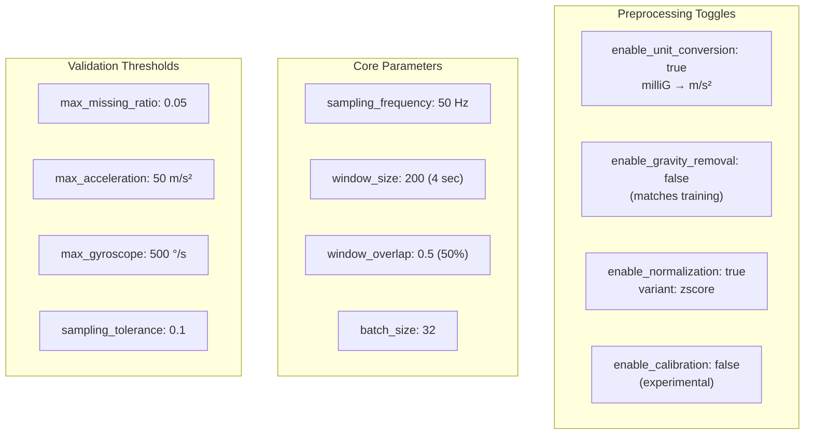
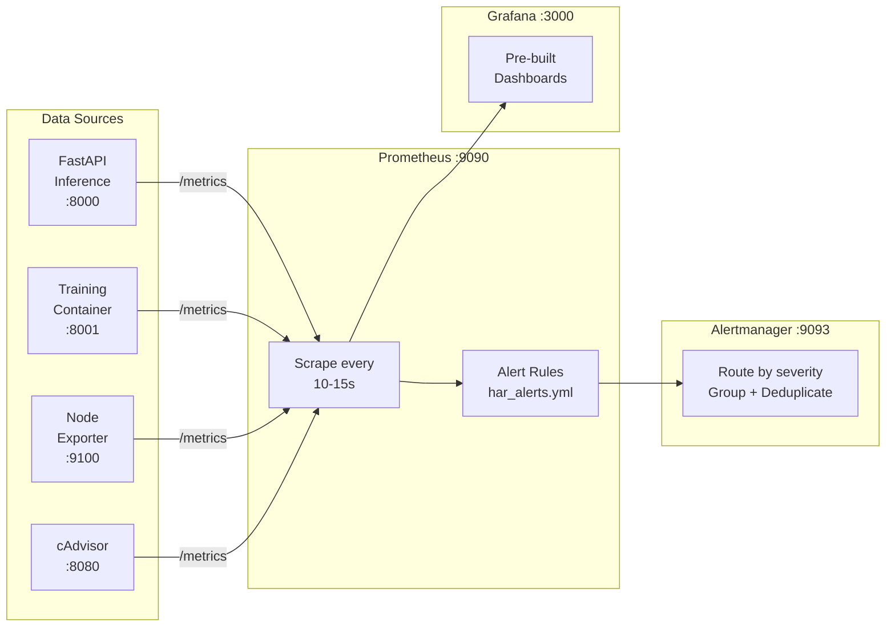
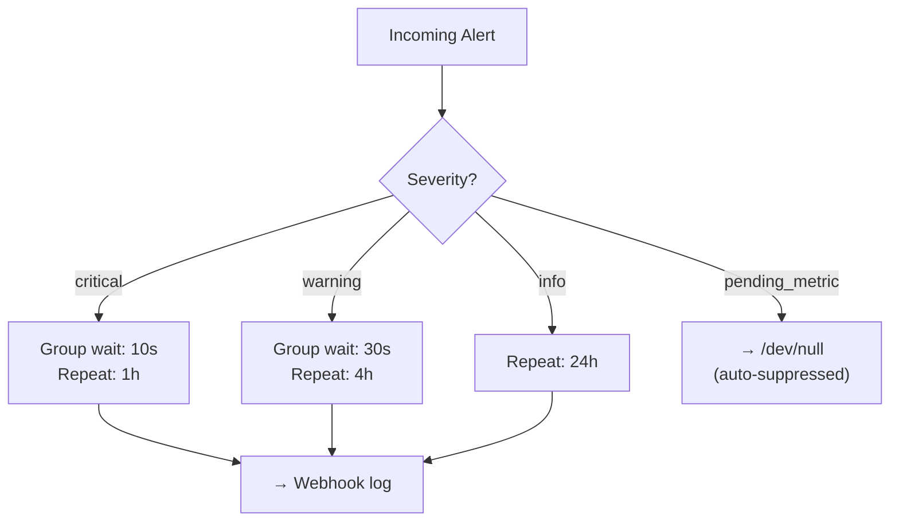
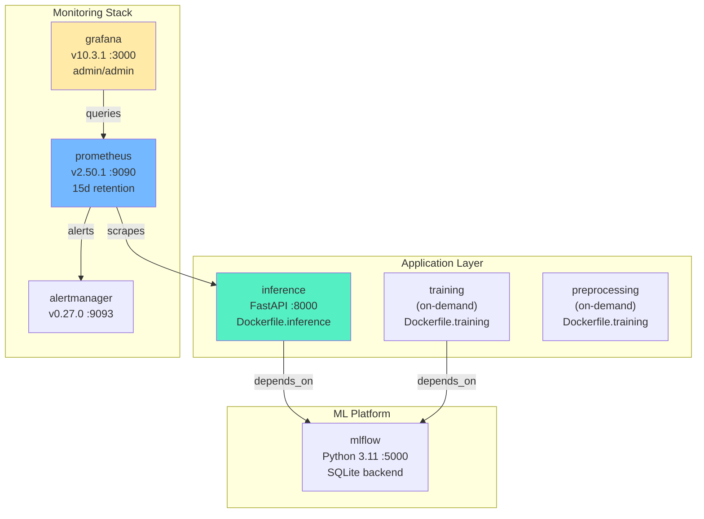
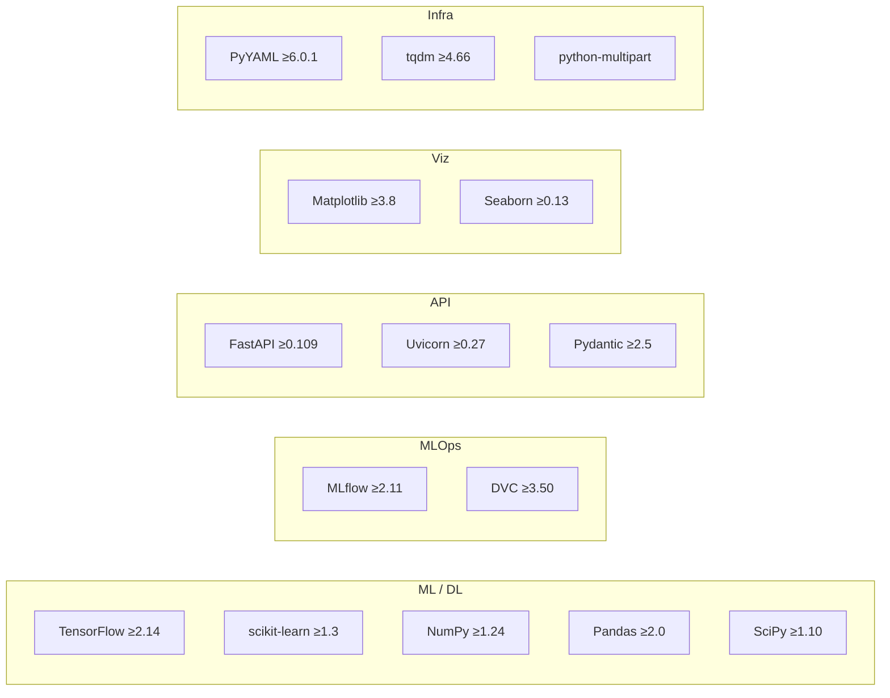
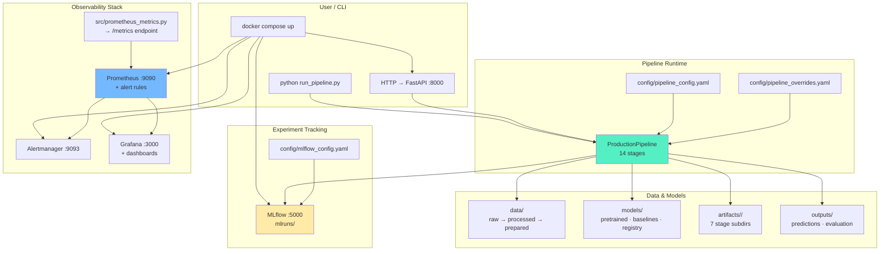

# Config, Dependencies & Infrastructure

> Everything outside `src/`, `scripts/`, and `tests/`:  
> **Config files · Docker · Prometheus · Grafana · Dependencies · CI/CD**.

---

## Table of Contents

| # | Section |
|---|---------|
| 1 | [Project Metadata](#1--project-metadata) |
| 2 | [Pipeline Configuration](#2--pipeline-configuration) |
| 3 | [Monitoring Stack](#3--monitoring-stack-prometheusgrafanaalertmanager) |
| 4 | [MLflow Configuration](#4--mlflow-configuration) |
| 5 | [Docker & Deployment](#5--docker--deployment) |
| 6 | [Dependencies](#6--dependencies) |
| 7 | [Code Quality](#7--code-quality) |
| 8 | [Full Infrastructure Diagram](#8--full-infrastructure-diagram) |

---

## 1 — Project Metadata

### `pyproject.toml`

| Field | Value |
|-------|-------|
| **Name** | `har-mlops-pipeline` |
| **Version** | `2.1.0` |
| **Python** | `>=3.10` |
| **License** | MIT |
| **Author** | Shalin Vachheta |
| **Keywords** | mlops, human-activity-recognition, anxiety-detection, wearable-sensors, deep-learning, domain-adaptation, uncertainty-quantification, drift-detection |

**CLI entry points:**
```toml
[project.scripts]
har-pipeline = "src.cli:main"
update-progress = "scripts.update_progress_dashboard:main"
```

### `setup.py`

Stub only — all config delegated to `pyproject.toml`.

### `pytest.ini`

Mirrors `pyproject.toml` test settings. Custom markers:

| Marker | Purpose |
|--------|---------|
| `@pytest.mark.slow` | Long-running tests (AdaBN, retraining) |
| `@pytest.mark.integration` | Full pipeline integration tests |
| `@pytest.mark.unit` | Quick unit tests |
| `@pytest.mark.gpu` | Requires GPU hardware |
| `@pytest.mark.robustness` | Noise injection / degradation tests |
| `@pytest.mark.calibration` | Calibration & uncertainty tests |

---

## 2 — Pipeline Configuration

### `config/pipeline_config.yaml`

The **primary config** — controls all preprocessing toggles:



**Critical rule from the paper (ICTH_16, Oleh & Obermaisser 2025):**
> *Training was: milliG → m/s² → StandardScaler → Window(200, 50%)*  
> *NO gravity removal. NO filtering. Production MUST match.*

### `config/pipeline_overrides.yaml`

Runtime overrides — all commented out by default (safe). Sections:

| Override Section | Controls |
|-----------------|----------|
| `monitoring:` | Stage 6 thresholds (confidence_warn, drift_zscore, etc.) |
| `trigger:` | Stage 7 thresholds (confidence_critical=0.50, cooldown_hours=24) |
| `registration:` | Stage 9 gate (degradation_tolerance=0.005) |
| `calibration:` | Stage 11 (mc_forward_passes=30, ece_warn=0.10) |
| `curriculum:` | Stage 13 (initial_confidence=0.95, ewc_lambda=1000) |

**Override priority:** CLI args > env vars > YAML file > dataclass defaults

---

## 3 — Monitoring Stack (Prometheus/Grafana/Alertmanager)



### `config/prometheus.yml`

| Scrape Job | Target | Interval |
|-----------|--------|----------|
| `prometheus` | localhost:9090 | 15s (default) |
| `har_inference` | inference:8000 | 10s |
| `har_training` | training:8001 | 30s |
| `har_monitoring` | inference:8002 | 15s |
| `node` | localhost:9100 | 15s |
| `cadvisor` | localhost:8080 | 15s |

External labels: `monitor: har_mlops`, `environment: production`

### `config/alertmanager.yml`

**Routing:**



**Inhibition rules:**
- `HARNoPredictions` (critical) suppresses all warnings
- `HARMissingDriftBaseline` (critical) suppresses `HARStaleDriftBaseline`

### `config/alerts/` — Alert Rules

Alert rules for Prometheus (YAML). Key alerts:
- Model accuracy degradation
- Confidence drop below threshold
- Drift detection triggers
- Baseline staleness warnings
- Scrape target down

### `config/grafana/` — Dashboard Provisioning

Pre-built Grafana dashboards + datasource config for auto-setup.

---

## 4 — MLflow Configuration

### `config/mlflow_config.yaml`

| Field | Value |
|-------|-------|
| **Tracking URI** | `mlruns` (local filesystem) |
| **Experiment** | `anxiety-activity-recognition` |
| **Model name** | `har-1dcnn-bilstm` |

**Logged metrics:** accuracy, loss, val_accuracy, val_loss, f1_score, precision, recall  
**Logged params:** learning_rate, batch_size, epochs, window_size, stride, optimizer, dropout_rate  
**Logged artifacts:** model_weights, confusion_matrix, classification_report, training_history, preprocessing_config

**Default tags:**
```yaml
project: "MasterArbeit_MLops"
author: "thesis-student"
model_type: "1D-CNN-BiLSTM"
task: "activity-recognition"
```

---

## 5 — Docker & Deployment

### `docker-compose.yml` — 7 Services



**Named volumes (5):**
| Volume | Purpose |
|--------|---------|
| `har-mlflow-data` | MLflow experiments & artifacts |
| `har-model-data` | Model files (shared across containers) |
| `har-prometheus-data` | Metrics time-series data |
| `har-grafana-data` | Dashboard state & user prefs |
| `har-alertmanager-data` | Alert state & silences |

**Network:** `har-network` (bridge)

### `docker/Dockerfile.inference`

| Field | Value |
|-------|-------|
| **Base** | `python:3.11-slim` |
| **Deps** | fastapi, uvicorn, tensorflow, numpy, pandas, scipy, pyyaml, prometheus-client |
| **Port** | 8000 |
| **CMD** | `uvicorn src.api.app:app --host 0.0.0.0 --port 8000` |
| **Health** | `curl -f http://localhost:8000/api/health || exit 1` (every 30s) |
| **Model** | `/app/models/pretrained/fine_tuned_model_1dcnnbilstm.keras` |

### `docker/Dockerfile.training`

| Field | Value |
|-------|-------|
| **Base** | `python:3.11-slim` |
| **Deps** | `requirements.txt` + mlflow, dvc, tensorflow, keras, scikit-learn |
| **Shared** | Used by both `training` and `preprocessing` services |
| **CMD** | Help message (run manually with `python src/train.py`) |

---

## 6 — Dependencies

### Core Stack



### Optional Dependencies

| Group | Packages |
|-------|----------|
| `dev` | pytest, pytest-cov, pytest-xdist, flake8, black, isort, mypy, jupyterlab, python-dotenv |
| `monitoring` | prometheus-client |
| `gpu` | tensorflow[and-cuda] |

### `config/requirements.txt`

Mirrors core dependencies from `pyproject.toml` for Docker builds:
```
numpy>=1.24  pandas>=2.0  scipy>=1.10  tensorflow>=2.14
scikit-learn>=1.3  mlflow>=2.11  dvc>=3.50  prometheus-client>=0.20
fastapi>=0.109  uvicorn[standard]>=0.27
```

---

## 7 — Code Quality

### `config/.pylintrc`

PyLint configuration for the project. Sets naming conventions, disabled warnings, and module import rules.

### Tool Configuration (from `pyproject.toml`)

| Tool | Setting |
|------|---------|
| **black** | line-length: 100, target: py310+py311 |
| **isort** | profile: black, line_length: 100 |
| **mypy** | python_version: 3.11, warn_return_any: true |
| **coverage** | source: src, omit: tests/\*, \_\_init\_\_.py, config.py |

---

## 8 — Full Infrastructure Diagram



## Runtime Folder Policy

| Location | Nature | Cleanup guidance |
|---------|--------|------------------|
| `artifacts/<run_id>/` | Per-run runtime artifacts | Safe to prune old runs after they are no longer needed |
| `outputs/` `*_fresh*` and timestamped predictions | Regenerable runtime output | Safe to delete |
| `outputs/` thesis figures | Regenerable but often referenced | Keep unless you are intentionally rebuilding figures |
| `reports/` verification logs | Regenerable check output | Usually safe to delete |
| `reports/` evidence/governance files | Shared cited assets | Keep by default |

---

## Quick Reference — All Config Files

| File | Purpose | Used by |
|------|---------|---------|
| `config/pipeline_config.yaml` | Preprocessing toggles, validation thresholds | `production_pipeline.py` |
| `config/pipeline_overrides.yaml` | Runtime threshold overrides | `config_loader.py` |
| `config/mlflow_config.yaml` | Experiment name, model registry, logging | `mlflow_tracking.py` |
| `config/prometheus.yml` | Scrape targets, intervals, alert rules | Prometheus container |
| `config/alertmanager.yml` | Alert routing, grouping, inhibition | Alertmanager container |
| `config/alerts/*.yml` | Prometheus alert rule definitions | Prometheus |
| `config/grafana/` | Dashboard + datasource provisioning | Grafana container |
| `config/requirements.txt` | Python deps for Docker builds | Dockerfiles |
| `config/requirements-lock.txt` | Pinned dependency versions | Reproducibility |
| `config/.pylintrc` | Code style rules | IDE / CI |
| `pyproject.toml` | Project metadata, deps, tool config | pip, pytest, black, mypy |
| `pytest.ini` | Test runner config (mirrors pyproject.toml) | pytest |
| `docker-compose.yml` | 7-service orchestration | Docker Compose |
| `docker/Dockerfile.inference` | Inference container | Docker |
| `docker/Dockerfile.training` | Training/preprocessing container | Docker |

---

*This is Document 5 of 5. See also:*
- [01_data_pipeline_flow.md](01_data_pipeline_flow.md) — How data moves through all 14 stages
- [02_src_deep_dive.md](02_src_deep_dive.md) — Every src/ file explained
- [03_scripts_reference.md](03_scripts_reference.md) — Every script explained
- [04_tests_reference.md](04_tests_reference.md) — Every test explained
