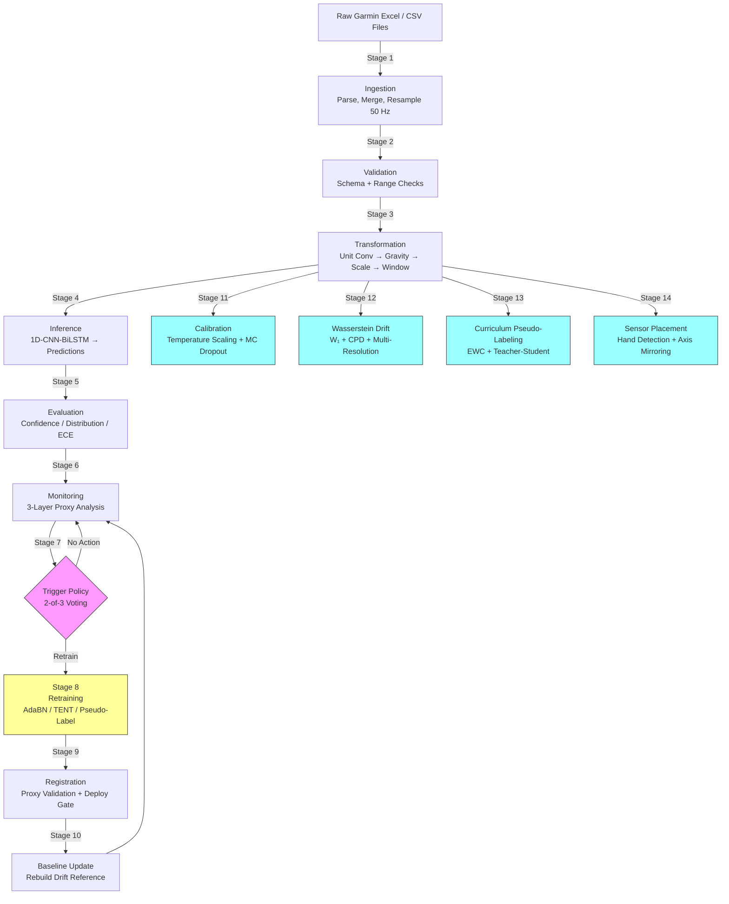
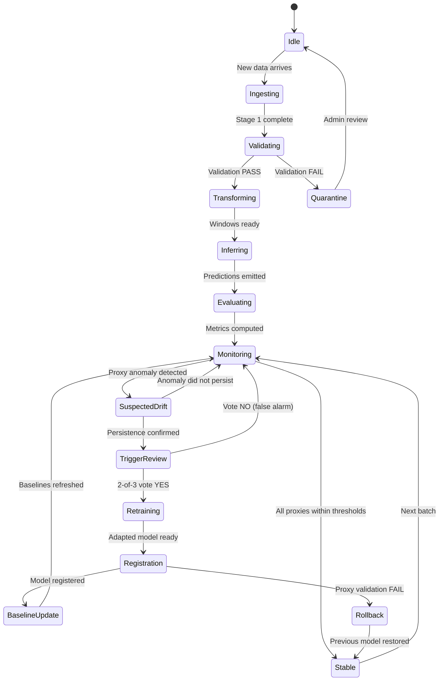
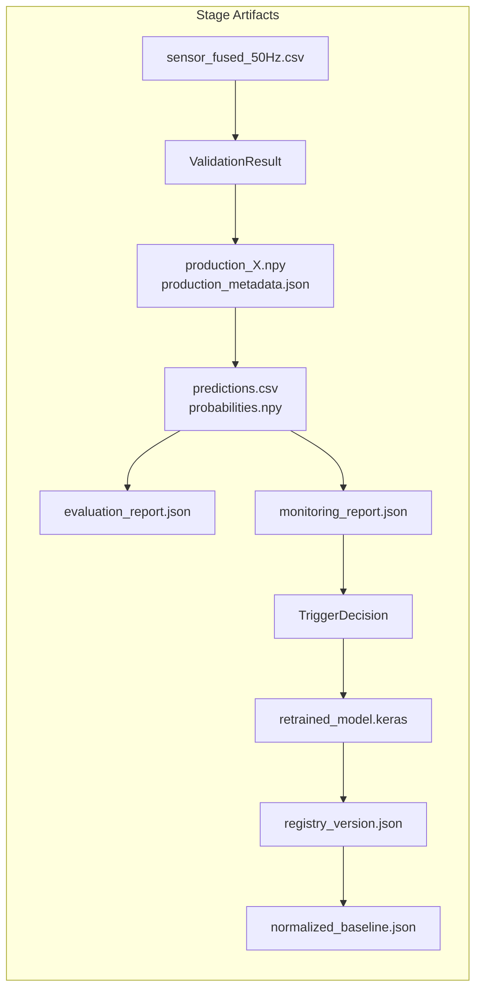

# Wearable HAR MLOps Pipeline -- Complete Why / What / How / When / Where Documentation

**Thesis Title:** Developing a MLOps Pipeline for Continuous Mental Health Monitoring Using Wearable Sensor Data  
**Author:** Shalin Vachheta  
**Date:** March 2026  
**Version:** 2.0

---

## Table of Contents

1. [Executive Overview](#1-executive-overview)
2. [Architecture Diagrams](#2-architecture-diagrams)
3. [Stage 1 -- Ingestion](#stage-1--ingestion)
4. [Stage 2 -- Validation](#stage-2--validation)
5. [Stage 3 -- Transformation](#stage-3--transformation)
6. [Stage 4 -- Inference](#stage-4--inference)
7. [Stage 5 -- Evaluation](#stage-5--evaluation)
8. [Stage 6 -- Monitoring](#stage-6--monitoring)
9. [Stage 7 -- Trigger](#stage-7--trigger)
10. [Stage 8 -- Retraining](#stage-8--retraining)
11. [Stage 9 -- Registration](#stage-9--registration)
12. [Stage 10 -- Baseline Update](#stage-10--baseline-update)
13. [Stage 11 -- Calibration](#stage-11--calibration)
14. [Stage 12 -- Wasserstein Drift](#stage-12--wasserstein-drift)
15. [Stage 13 -- Curriculum Pseudo-Labeling](#stage-13--curriculum-pseudo-labeling)
16. [Stage 14 -- Sensor Placement](#stage-14--sensor-placement)
17. [Cross-Cutting Concerns](#cross-cutting-concerns)
18. [Configuration Template](#configuration-template)
19. [Summary Table](#summary-table)
20. [Thesis-Friendly References](#thesis-friendly-references)

---

## 1. Executive Overview

### 1.1 Problem Definition

Human Activity Recognition (HAR) from wearable inertial sensors (tri-axial accelerometer and gyroscope) has demonstrated laboratory accuracies exceeding 90% on benchmark datasets. However, deploying these models to real-world, continuously operating wearable systems exposes fundamental problems that laboratory evaluation does not address:

- **Domain shift.** Sensor characteristics, device placement, and user behaviour differ between the training cohort and production users. A model trained on one demographic may silently degrade on another.
- **Absence of ground-truth labels.** In production, no human annotator accompanies the user. The system must detect degradation without access to true activity labels.
- **Data pipeline fragility.** Differences in sampling rate, unit conventions, or preprocessing order between training and production silently corrupt predictions.
- **Model staleness.** As user populations evolve, models trained on historical data become progressively less representative.

These challenges demand a production engineering discipline that academic prototyping alone cannot provide.

### 1.2 Why Production MLOps Is Required

Machine Learning Operations (MLOps) applies DevOps principles to the machine-learning lifecycle. For a wearable HAR system, MLOps provides:

| Capability | Risk if Absent |
|---|---|
| Versioned data pipelines | Irreproducible experiments; silent preprocessing mismatches |
| Automated testing and CI/CD | Broken models shipped to production undetected |
| Experiment tracking | Inability to explain which configuration produced which result |
| Containerised inference | Non-deterministic environments causing inconsistent predictions |
| Post-deployment monitoring | Degradation invisible until patient harm occurs |
| Automated drift detection | Manual inspection fails at scale |
| Safe retraining with rollback | Catastrophic forgetting or silent accuracy collapse |

The thesis therefore implements a complete MLOps pipeline rather than a one-off training script, treating the model as a continuously maintained software artefact.

### 1.3 Why Unlabelled Production Monitoring Matters

In classical supervised learning, model evaluation requires ground-truth labels. In a clinical wearable setting, labels are unavailable because:

1. Asking patients to annotate every activity defeats the purpose of passive monitoring.
2. Observer annotation is impractical outside controlled studies.
3. Video annotation at scale is cost-prohibitive and privacy-invasive.

The pipeline therefore relies on **proxy monitoring signals** -- prediction confidence, entropy, class-distribution stability, and input-feature drift -- to infer model health without labels. This is the realistic deployment scenario and a key contribution of this thesis.

### 1.4 High-Level Architecture

The pipeline comprises 14 stages organised into three operational phases:

| Phase | Stages | Purpose |
|---|---|---|
| Default Cycle (stages 1--7) | ingestion → validation → transformation → inference → evaluation → monitoring → trigger | Ingest raw data, preprocess, predict, evaluate, monitor, and decide |
| Retrain Cycle (stages 8--10) | retraining → registration → baseline_update | Adapt the model, register new version, rebuild drift baselines |
| Advanced Analytics (stages 11--14) | calibration → wasserstein_drift → curriculum_pseudo_labeling → sensor_placement | Post-hoc calibration, deep drift analysis, progressive self-training, placement robustness |

This three-phase grouping is reflected in the CLI:

```bash
python run_pipeline.py                          # stages 1-7 (default)
python run_pipeline.py --retrain --adapt adabn   # + stages 8-10
python run_pipeline.py --advanced                # + stages 11-14
```

### 1.5 Cross-Cutting Infrastructure

Several systems span all stages but are not pipeline stages themselves:

| System | Purpose | Where |
|---|---|---|
| **DVC** | Version-controls large data files outside Git | `.dvc/config`, `data/*.dvc` (local remote at `../.dvc_storage`) |
| **MLflow** | Experiment tracking, parameter/metric logging, model registry | `src/mlflow_tracking.py`, `mlruns/`, `config/mlflow_config.yaml` |
| **Docker** | Containerises inference and training environments | `docker/Dockerfile.inference`, `docker/Dockerfile.training`, `docker-compose.yml` |
| **GitHub Actions CI/CD** | Lint, test, build, integration-test, model-validation | `.github/workflows/ci-cd.yml` (6 jobs, weekly cron) |
| **Prometheus + Alertmanager + Grafana** | Production observability stack | `config/prometheus.yml`, `config/alertmanager.yml`, `config/grafana/` |
| **FastAPI** | REST API serving predictions with Prometheus metrics export | `src/api/app.py` (892 lines, 7 Prometheus counters/gauges/histograms) |

These are documented in [Cross-Cutting Concerns](#cross-cutting-concerns).

---

## 2. Architecture Diagrams

### 2.1 End-to-End Pipeline Flowchart



### 2.2 System State Machine



### 2.3 Artifact Flow Between Stages



---

## Stage 1 -- Ingestion

### Why

Raw sensor data from Garmin smartwatches arrives in Excel format with vendor-specific column names, list-encoded sensor arrays per row, inconsistent timestamps, and mixed data types. The accelerometer and gyroscope are recorded in separate files at potentially different native sampling rates. Feeding such data directly into preprocessing would produce silent errors -- for example, a missing gyroscope column would halve the input dimensionality without raising an exception in downstream NumPy operations.

Additionally, the raw data uses Garmin's proprietary list-encoded format where each row contains a string-encoded array of sensor readings, which must be parsed and exploded into individual sample rows before any signal processing is possible.

**Risks if omitted:** Corrupt data propagates through the entire pipeline. Debugging a bad prediction days later to an ingestion error is extremely costly.

### What

| Item | Description |
|---|---|
| **Input** | Raw Excel files from Garmin Connect export (accelerometer + gyroscope sheets), or pre-fused CSV |
| **Output** | Validated, column-normalised CSV: `sensor_fused_50Hz.csv` at exactly 50 Hz |
| **Artifacts** | Ingestion metadata (row counts, original sampling rates, column mapping), `ingestion_manifest.json` tracking processed files |

### How

1. **Three ingestion paths.** The component supports three input modes:
   - **Path A (CSV):** Direct CSV input -- load and validate.
   - **Path B (Explicit pair):** User specifies accelerometer + gyroscope Excel files.
   - **Path C (Auto-discover):** Scan `data/raw/` for all accel/gyro file pairs. A manifest (`ingestion_manifest.json`) tracks already-processed pairs to avoid redundant work.

2. **Column normalisation.** Map vendor-specific names to canonical names: `Ax, Ay, Az, Gx, Gy, Gz`.

3. **Garmin list-column parsing.** Parse string-encoded arrays (e.g., `"[0.12, -0.34, 9.81]"`) into numeric values using `_parse_list_cell()`.

4. **Row explosion.** Expand list columns so each array element becomes a separate row. This converts Garmin's compressed format into a standard time-series.

5. **Timestamp creation.** Compute precise `true_time` from base timestamps and sample offsets using `_create_timestamps()`.

6. **Sensor fusion.** Merge accelerometer and gyroscope dataframes using `pd.merge_asof()` with a 1 ms tolerance. Rows that cannot be paired are dropped and logged.

7. **Resampling to 50 Hz.** Resample the fused time-series to exactly 50 Hz using linear interpolation. **Why 50 Hz:** the HAR literature consistently reports that 20--50 Hz captures the full spectral content of human limb movement (Bao and Intille, 2004; Bulling et al., 2014). The training dataset was collected at 50 Hz; matching this frequency in production avoids interpolation-induced domain shift.

8. **Anti-aliasing.** If the native sampling rate exceeds 50 Hz, a low-pass filter is applied before downsampling to prevent aliasing artefacts.

9. **Immutable raw storage.** The original file is preserved in `data/raw/` -- no in-place modification.

### When

- On every new data upload (event-driven).
- On scheduled batch collection windows (e.g., nightly sync from device).
- Skippable with `--skip-ingestion` when `sensor_fused_50Hz.csv` already exists.

### Where

| Module | Path |
|---|---|
| Component (Stage 1) | `src/components/data_ingestion.py :: DataIngestion` (623 lines) |
| Standalone processor | `src/sensor_data_pipeline.py :: SensorDataLoader, DataProcessor` (1192 lines) |
| Configuration | `src/entity/config_entity.py :: DataIngestionConfig` (line 80) |
| Raw storage | `data/raw/` |
| Output | `data/processed/sensor_fused_50Hz.csv` |

---

## Stage 2 -- Validation

### Why

Even after ingestion, the fused CSV may contain subtle data-quality issues: wrong column types, out-of-range sensor values (indicating a faulty sensor or a unit mismatch), excessive missing data, or incorrect sampling rate. These problems must be caught before transformation, because once data is windowed and scaled, the root cause becomes invisible.

**Risks if omitted:** An accelerometer reporting in milliG instead of m/s² would enter the scaler with values 100× too large. The StandardScaler would normalise these values, masking the error. The model would then receive data with completely wrong physical semantics while the values appear numerically plausible.

### What

| Item | Description |
|---|---|
| **Input** | `sensor_fused_50Hz.csv` from Stage 1 |
| **Output** | `DataValidationArtifact` containing: `is_valid` (bool), `errors[]`, `warnings[]`, `stats{}` |
| **Artifacts** | Validation report with per-check pass/fail results |

### How

1. **Schema check.** Verify that required columns `[Ax, Ay, Az, Gx, Gy, Gz]` exist and are numeric.

2. **Missing value ratio.** Compute the fraction of NaN cells. If the ratio exceeds 5% (`max_missing_ratio = 0.05`), the file fails validation.

3. **Accelerometer range check.** Flag values exceeding ±50 m/s² (`max_acceleration = 50.0`). Values above this indicate either a unit error (milliG not converted) or a sensor malfunction.

4. **Gyroscope range check.** Flag values exceeding ±500 deg/s (`max_gyroscope = 500.0`).

5. **Sampling rate consistency.** Verify that the detected sampling rate is approximately 50 Hz (`expected_frequency_hz = 50.0`). Deviation indicates a resampling failure in Stage 1.

6. **Fail-fast behaviour.** Validation failures are **always fatal** in the pipeline -- the `ProductionPipeline` orchestrator aborts immediately on validation failure regardless of the `continue_on_failure` flag.

### When

- Immediately after ingestion (Stage 1).
- Cannot be skipped -- validation is a hard gate.

### Where

| Module | Path |
|---|---|
| Component (Stage 2) | `src/components/data_validation.py :: DataValidation` (63 lines) |
| Validator engine | `src/data_validator.py :: DataValidator` (265 lines) |
| Configuration | `src/entity/config_entity.py :: DataValidationConfig` (line 97) |
| Thresholds | `DataValidator :: max_missing_ratio=0.05, max_acceleration=50.0, max_gyroscope=500.0` |

---

## Stage 3 -- Transformation

### Why

Raw sensor values cannot be fed directly into the model. The training pipeline applied specific transformations (unit conversion, no gravity removal, StandardScaler normalisation, 200-sample windows with 50% overlap), and the production pipeline must replicate these transformations **exactly**. Any mismatch constitutes an artificial domain shift that degrades accuracy.

This stage consolidates **four conceptual operations** (unit conversion, gravity removal, scaling, windowing) into a single component to ensure they are always applied in the correct order and with the correct parameters.

**Risks if omitted:** The most common and most insidious failure mode in deployed ML systems. A model trained on m/s² receiving milliG data will see accelerations 100× smaller than expected. The StandardScaler will then amplify noise, and the model will predict near-random classes while still reporting high softmax confidence.

### What

| Item | Description |
|---|---|
| **Input** | Validated CSV from Stage 2, shape `(N, 6)` |
| **Output** | Windowed array `production_X.npy`, shape `(W, 200, 6)` + `production_metadata.json` |
| **Artifacts** | Preprocessing log: detected unit, conversion applied, window count, scaler parameters used |

### How

**Step 1 -- Automatic unit detection and conversion.**

Compute the median magnitude of the accelerometer vector:

$$\bar{m} = \text{median}\left(\sqrt{Ax^2 + Ay^2 + Az^2}\right)$$

If $\bar{m} > 100$, the data is in milliG; multiply by $9.80665 / 1000 = 0.00981$ to convert to m/s². The `UnitDetector` class (`src/preprocess_data.py:76`) implements this heuristic with range checks: milliG range (−2000, 2000), m/s² range (−20, 20).

**Step 2 -- Gravity removal (optional, default: disabled).**

Controlled by `enable_gravity_removal` in `DataTransformationConfig` (default: `false`). When enabled, a 3rd-order Butterworth high-pass filter with cutoff at 0.3 Hz removes the gravitational DC component. **Disabled because** the training data included gravitational acceleration. Applying this filter would remove the DC component the model has learned to expect, introducing an artificial distribution shift.

**Step 3 -- StandardScaler normalisation.**

Per-channel z-score normalisation:

$$\hat{x}_{i,c} = \frac{x_{i,c} - \mu_c}{\sigma_c}$$

where $\mu_c$ and $\sigma_c$ are the **training-data** statistics loaded from `data/prepared/config.json`. The training mean vector is `[3.22, 1.28, -3.53, 0.60, 0.23, 0.09]` (from `src/preprocess_data.py:352`).

**Critical invariant:** The scaler is fitted on training data only. Fitting on production data leaks future information and makes the scaling non-stationary.

**Step 4 -- Sliding window creation.**

$$\text{window\_samples} = F_s \times T_w = 50 \times 4.0 = 200 \text{ samples}$$

$$\text{stride} = \text{window\_samples} \times (1 - O) = 200 \times 0.5 = 100 \text{ samples}$$

Each continuous time-series is segmented into overlapping 200-sample windows with 50% overlap. The final partial window (fewer than 200 samples) is discarded.

**Why 200 samples at 50% overlap:**
- 200 samples at 50 Hz = 4.0-second windows, matching the training window size (from `src/config.py:67`).
- 50% overlap ensures each timestep appears in two windows, providing smoother prediction transitions and doubled training examples.
- Ablation study (`reports/ABLATION_WINDOWING.csv`) tested window sizes 100/128/150/200/256 and overlaps 25%/50%/75%. The ws=200, overlap=50% configuration achieved F1=0.685 with an acceptable flip rate of 0.239.

**Step 5 -- Optional domain calibration.**

Mean-shift alignment (`DomainCalibrator`) adjusts production feature means toward the training mean. Controlled by `enable_domain_calibration` (default: `false`).

### When

- After validation (Stage 2).
- Window parameters are fixed at deployment time and **must not change without retraining**.

### Where

| Module | Path |
|---|---|
| Component (Stage 3) | `src/components/data_transformation.py :: DataTransformation` (133 lines) |
| Preprocessing engine | `src/preprocess_data.py :: UnifiedPreprocessor` (855 lines) |
| Unit detector | `src/preprocess_data.py :: UnitDetector` (line 76) |
| Gravity remover | `src/preprocess_data.py :: GravityRemover` (line 206) |
| Constants | `src/config.py :: WINDOW_SIZE=200, OVERLAP=0.5, NUM_SENSORS=6` |
| Scaler artifact | `data/prepared/config.json` |
| Configuration | `src/entity/config_entity.py :: DataTransformationConfig` (line 113) |
| Pipeline config | `config/pipeline_config.yaml` (83 lines) |

---

## Stage 4 -- Inference

### Why

A trained model sitting on a researcher's laptop provides no value. This stage loads the 1D-CNN-BiLSTM model and runs batch inference on the preprocessed windows to produce activity predictions. The inference engine validates that the model's input/output shapes match the expected dimensions, preventing silent shape-mismatch failures.

**Risks if omitted:** No predictions are generated -- the entire pipeline purpose is unfulfilled.

### What

| Item | Description |
|---|---|
| **Input** | Windowed array `production_X.npy`, shape `(W, 200, 6)` |
| **Output** | Predictions CSV with: predicted activity, max confidence, confidence level, per-class probabilities |
| **Artifacts** | `predictions.csv`, `probabilities.npy`, activity distribution summary, timing statistics |

### How

1. **Model loading.** Load the pretrained Keras model `fine_tuned_model_1dcnnbilstm.keras`. Validate input shape `(None, 200, 6)` and output shape `(None, 11)`.

2. **Batch inference.** Run forward pass with batch size 32. Softmax output produces probability vectors of shape `(W, 11)`.

3. **Classification.** For each window, select the class with the highest probability. Confidence is the maximum softmax value.

4. **Confidence levels.** Each prediction is labelled:
   - **HIGH:** confidence ≥ 0.80
   - **MODERATE:** confidence ≥ 0.60
   - **LOW:** confidence ≥ 0.50
   - **UNCERTAIN:** confidence < 0.50

5. **Activity classes.** The model recognises 11 activities:
   `ear_rubbing`, `forehead_rubbing`, `hair_pulling`, `hand_scratching`, `hand_tapping`, `knuckles_cracking`, `nail_biting`, `nape_rubbing`, `sitting`, `smoking`, `standing`.

6. **Versioned output.** Predictions are saved with model version metadata and a unique request ID for audit trailing.

### When

- After transformation (Stage 3) produces `production_X.npy`.
- In production via FastAPI: on every HTTP POST to `/predict`.

### Where

| Module | Path |
|---|---|
| Component (Stage 4) | `src/components/model_inference.py :: ModelInference` (128 lines) |
| Inference engine | `src/run_inference.py :: InferenceEngine` (863 lines) |
| Model loader | `src/run_inference.py :: ModelLoader` (line 155) |
| Activity classes | `src/run_inference.py :: ACTIVITY_CLASSES` (11 classes) |
| Pretrained model | `models/pretrained/fine_tuned_model_1dcnnbilstm.keras` |
| Configuration | `src/entity/config_entity.py :: ModelInferenceConfig` (line 137) |

---

## Stage 5 -- Evaluation

### Why

Inference produces raw predictions, but raw predictions alone do not reveal whether the model is performing well. Evaluation computes summary metrics that characterise prediction quality. In production (unlabelled data), this means distribution analysis, confidence statistics, and entropy metrics. When ground-truth labels are available (development/testing), this extends to accuracy, F1, confusion matrices, and calibration metrics (ECE).

**Risks if omitted:** No quantitative assessment of model performance. The system cannot distinguish between a model making perfect predictions and one making random guesses.

### What

| Item | Description |
|---|---|
| **Input** | Predictions CSV + probabilities array from Stage 4 |
| **Output** | `evaluation_report.json` with distribution, confidence, and calibration metrics |
| **Artifacts** | JSON + human-readable text report, confusion matrix plot (when labels available) |

### How

**Unlabelled evaluation (production):**
1. **Distribution analysis.** Class frequencies, entropy of the predicted class distribution, uniformity score.
2. **Confidence analysis.** Mean/std/median confidence, per-level breakdown (HIGH/MODERATE/LOW/UNCERTAIN percentages).
3. **Uncertainty analysis.** Prediction entropy distribution, margin statistics.
4. **Temporal pattern analysis.** Transition matrix, dwell times, flip rate.

**Labelled evaluation (development):**
5. **Classification metrics.** Accuracy, per-class precision/recall/F1, macro-F1, weighted-F1.
6. **Confusion matrix.** Logged to MLflow for visual inspection.
7. **Calibration metrics.** Expected Calibration Error (ECE, 15 bins), Brier score, reliability diagram.

**Why macro-F1 is the primary metric:**

$$\text{Macro-F1} = \frac{1}{C} \sum_{c=1}^{C} \frac{2 \cdot P_c \cdot R_c}{P_c + R_c}$$

where $C = 11$. The dataset exhibits class imbalance (e.g., `sitting` and `standing` are overrepresented). Accuracy is misleading because a model that always predicts the majority class achieves high accuracy. Macro-F1 averages per-class F1 scores equally, penalising poor performance on minority classes.

### When

- After inference (Stage 4).
- Results feed into monitoring (Stage 6).

### Where

| Module | Path |
|---|---|
| Component (Stage 5) | `src/components/model_evaluation.py :: ModelEvaluation` (67 lines) |
| Evaluation engine | `src/evaluate_predictions.py :: PredictionAnalyzer, ClassificationEvaluator` (752 lines) |
| Configuration | `src/entity/config_entity.py :: ModelEvaluationConfig` (line 154) |

---

## Stage 6 -- Monitoring

### Why

Once deployed, the model produces predictions -- but nobody tells the model whether those predictions are correct. Traditional accuracy monitoring is impossible without ground-truth labels. The system must therefore use **proxy signals** that correlate with model health.

This is the fundamental operational challenge for any deployed ML system, and it is especially acute in healthcare wearables where incorrect predictions may influence clinical decisions.

**Risks if omitted:** The model silently degrades. Users receive increasingly wrong activity classifications. By the time someone notices, months of clinical data may be compromised.

### What

| Item | Description |
|---|---|
| **Input** | Predictions and probabilities from Stage 4, window features from Stage 3, baseline statistics |
| **Output** | Monitoring report with per-metric status (PASS / WARNING / CRITICAL) |
| **Artifacts** | JSON monitoring report saved to `artifacts/{timestamp}/` |

### How

The monitoring system implements three layers:

**Layer 1 -- Confidence Analysis.**
- Mean prediction confidence: $\bar{c} = \frac{1}{W} \sum_{w=1}^{W} \max_k p_{w,k}$.
- Fraction of uncertain predictions: $\text{uncertain\%} = \frac{|\{w : \max_k p_{w,k} < \tau_c\}|}{W}$ where $\tau_c = 0.60$.
- Thresholds from `PostInferenceMonitoringConfig`:
  - `confidence_warn_threshold = 0.60` (mean confidence below this → WARNING)
  - `uncertain_pct_threshold = 30%` (uncertain predictions above this → WARNING)

**Layer 2 -- Temporal Pattern Analysis.**
- Prediction flip rate: $\text{flip\_rate} = \frac{|\{w : \hat{y}_w \neq \hat{y}_{w-1}\}|}{W - 1}$.
- Per-session computation via `src/utils/temporal_metrics.py` with strict session validation.
- Activity dwell times: the distribution of consecutive windows with the same prediction.
- **Rationale:** Human activities have natural temporal persistence. Sitting lasts minutes, not milliseconds. Rapid prediction changes are a proxy for model uncertainty.

**Layer 3 -- Input Feature Drift (z-score).**
- Per-channel statistics (mean, variance) of the current production batch.
- Compare against normalised baseline (`models/normalized_baseline.json`).
- Drift z-score: $z_c = \frac{|\mu_{c,\text{prod}} - \mu_{c,\text{ref}}|}{\sigma_{c,\text{ref}}}$.
- Threshold: `drift_zscore_threshold = 2.0` (≈ 95th percentile of stable noise).

**Baseline staleness guard.** If the baseline is older than `max_baseline_age_days = 90` days, a warning is emitted regardless of other metrics.

**Calibration temperature integration.** If Stage 11 has been run, the temperature parameter is loaded and applied to soften probabilities before confidence analysis. This ensures monitoring thresholds are calibrated against calibrated confidence scores.

### When

- After every inference batch.
- Results are aggregated and reported to the trigger policy (Stage 7).

### Where

| Module | Path |
|---|---|
| Component (Stage 6) | `src/components/post_inference_monitoring.py :: PostInferenceMonitoring` (127 lines) |
| Temporal metrics | `src/utils/temporal_metrics.py :: flip_rate_per_session()` (100 lines) |
| OOD detection (optional) | `src/ood_detection.py :: EnergyOODDetector, EnsembleOODDetector` (454 lines) |
| Baseline | `models/normalized_baseline.json` |
| Configuration | `src/entity/config_entity.py :: PostInferenceMonitoringConfig` (line 169) |
| Prometheus metrics | `src/api/app.py :: har_confidence_mean, har_flip_rate, har_drift_detected` |

---

## Stage 7 -- Trigger

### Why

Monitoring (Stage 6) produces multiple proxy signals per batch. The trigger policy aggregates these signals into a single actionable decision: retrain, monitor, or ignore. A naive approach -- trigger retraining whenever any single metric crosses a threshold -- would produce excessive false positives and unnecessary retraining cycles, each of which costs GPU time and risks introducing regression.

**Risks if omitted:** Either the system never retrains (model staleness) or retrains too aggressively (instability, wasted resources, potential catastrophic forgetting).

### What

| Item | Description |
|---|---|
| **Input** | Monitoring report from Stage 6 |
| **Output** | `TriggerDecision` object: action (`NONE` / `MONITOR` / `QUEUE_RETRAIN` / `TRIGGER_RETRAIN` / `ROLLBACK`), alert level, reasons |
| **Artifacts** | Decision log in JSON format, MLflow audit entry |

### How

1. **Three independent signal channels.** Each channel evaluates to `INFO`, `WARNING`, or `CRITICAL`:

   | Channel | WARNING Threshold | CRITICAL Threshold |
   |---|---|---|
   | **Confidence** | mean_conf < 0.55, entropy > 1.8, uncertain_ratio > 0.20 | mean_conf < 0.45, entropy > 2.2, uncertain_ratio > 0.35 |
   | **Temporal** | flip_rate > 0.25 | flip_rate > 0.40 |
   | **Drift** | drift_zscore > 2.0 (2+ channels) | drift_zscore > 3.0 (4+ channels) |

2. **2-of-3 voting logic** (`TriggerPolicyEngine`, line 470):
   - Any signal at CRITICAL → `TRIGGER_RETRAIN` immediately.
   - 2+ signals at WARNING → `QUEUE_RETRAIN`.
   - 1 signal at WARNING → `MONITOR` (increase monitoring frequency).
   - All INFO → `NONE`.

3. **Cooldown period.** After a retraining is triggered, a 24-hour cooldown (`retrain_cooldown_hours = 24`) prevents cascading retraining cycles. During cooldown, alerts are logged but suppressed from triggering.

4. **Persistent state.** Trigger state (cooldown timer, previous decisions) is saved across pipeline runs to maintain continuity.

5. **Validation.** The 2-of-3 voting scheme was validated via simulation: 500 synthetic sessions with injected drift showed precision = 0.988 and false alarm rate = 0.007 (`reports/TRIGGER_POLICY_EVAL.csv`).

### When

- After every monitoring cycle (Stage 6).
- Decision is logged regardless of outcome (for audit trail).

### Where

| Module | Path |
|---|---|
| Component (Stage 7) | `src/components/trigger_evaluation.py :: TriggerEvaluation` (114 lines) |
| Policy engine | `src/trigger_policy.py :: TriggerPolicyEngine` (830 lines) |
| Thresholds | `src/trigger_policy.py :: TriggerThresholds` (lines 95--131) |
| Cooldown config | `src/trigger_policy.py :: CooldownConfig` (lines 134--138) |
| Alert levels | `src/trigger_policy.py :: AlertLevel` (enum: INFO, WARNING, CRITICAL) |
| Trigger actions | `src/trigger_policy.py :: TriggerAction` (enum: NONE, MONITOR, QUEUE_RETRAIN, TRIGGER_RETRAIN, ROLLBACK) |
| Configuration | `src/entity/config_entity.py :: TriggerEvaluationConfig` (line 207) |

---

## Stage 8 -- Retraining

### Why

When the trigger policy decides to retrain, the system faces a fundamental problem: production data is unlabelled. Standard supervised retraining is impossible. The system must therefore use techniques that extract useful signal from unlabelled data while guarding against error amplification.

**Risks if omitted:** The model cannot adapt to changing user populations. Alternatively, naive pseudo-labelling on low-confidence predictions amplifies errors, causing catastrophic forgetting.

### What

| Item | Description |
|---|---|
| **Input** | Current model, labelled source data, unlabelled production windows from Stage 3 |
| **Output** | Retrained/adapted model weights |
| **Artifacts** | Before/after confidence comparison, adaptation report, retraining metrics |

### How

The retraining component (`src/components/model_retraining.py`, 437 lines) supports five adaptation strategies, selectable via the `--adapt` CLI flag:

**Strategy 1 -- AdaBN (Adaptive Batch Normalisation).**
- Replaces BatchNormalization running statistics (mean/variance) with statistics computed from unlabelled production data.
- Does **not** modify model weights (kernels, biases, BN gamma/beta).
- `n_batches = 10` forward passes through target data.
- Fastest method (seconds, not minutes).
- Reference: Li et al. 2018, *Revisiting Batch Normalization for Practical Domain Adaptation*.
- **Where:** `src/domain_adaptation/adabn.py :: adapt_bn_statistics()` (line 50).

**Strategy 2 -- TENT (Test-Time Entropy Minimisation).**
- Freezes all layers except BN affine parameters (gamma, beta).
- Minimises prediction entropy via gradient descent on unlabelled data: $\min_{\gamma, \beta} H(p(y|\mathbf{x}))$.
- `n_steps = 10`, `learning_rate = 1e-4`.
- **Safety guards:**
  - OOD entropy check: if initial entropy > 0.85, adaptation is skipped entirely.
  - Automatic rollback: if entropy increases by > 0.05 or confidence drops by > 0.01 after adaptation, weights are reverted.
- Reference: Wang et al. 2021, *Fully Test-Time Adaptation by Entropy Minimization*, ICLR 2021.
- **Where:** `src/domain_adaptation/tent.py :: tent_adapt()` (line 46).

**Strategy 3 -- AdaBN + TENT (two-stage, recommended for moderate drift).**
- Runs AdaBN first (recalibrates BN running stats), then TENT (fine-tunes BN affine params).
- Combines the strengths of both: broad distribution alignment (AdaBN) followed by decision-boundary refinement (TENT).
- **Where:** `src/components/model_retraining.py :: _run_adabn_then_tent()` (line 216).

**Strategy 4 -- Pseudo-label self-training.**
- Current model generates pseudo-labels for production data.
- Confidence gating: only samples with $\max_k p(k|x) \geq 0.70$ are accepted.
- Class-balanced sampling prevents majority-class domination.
- **Where:** `src/components/model_retraining.py :: _run_pseudo_label()`.

**Strategy 5 -- Standard supervised fine-tuning.**
- Uses labelled source data. Applicable when new labelled data is available.
- **Where:** `src/components/model_retraining.py :: _run_standard()`.

**Before/after comparison.** All strategies compute confidence improvement metrics (mean_before vs. mean_after) to quantify adaptation effectiveness.

### When

- Triggered by the trigger policy (Stage 7).
- CLI: `python run_pipeline.py --retrain --adapt adabn_tent`.

### Where

| Module | Path |
|---|---|
| Component (Stage 8) | `src/components/model_retraining.py :: ModelRetraining` (437 lines) |
| AdaBN adapter | `src/domain_adaptation/adabn.py` (157 lines) |
| TENT adapter | `src/domain_adaptation/tent.py` (259 lines) |
| Configuration | `src/entity/config_entity.py :: ModelRetrainingConfig` (line 228) |

---

## Stage 9 -- Registration

### Why

After retraining, the new model must be evaluated, versioned, and potentially deployed. This stage implements a **proxy validation gate** that compares the retrained model's confidence metrics against the currently deployed model. If the new model is worse (beyond a tolerance), it is rejected. If it passes, it is registered in the local model registry with SHA-256 integrity hashing.

**Risks if omitted:** A bad model update silently degrades the entire system. Without a registration gate, every retraining output is blindly deployed.

### What

| Item | Description |
|---|---|
| **Input** | Retrained model from Stage 8, evaluation metrics from Stage 5 |
| **Output** | Registered model version in `models/registry/`, optional deployment |
| **Artifacts** | Registry entry JSON, version history, SHA-256 model hash |

### How

1. **Proxy validation.** Compare retrained model's mean confidence against the currently deployed model. Degradation tolerance: `allowed_degradation = 0.005` (0.5%). If the new model's confidence drops by more than 0.5%, registration is rejected.

2. **TTA compatibility.** The `block_if_no_metrics = false` flag (default) ensures that unsupervised TTA methods (AdaBN, TENT) -- which produce no ground-truth metrics -- are not blocked. TTA models are registered but not auto-deployed.

3. **Model versioning.** Each registered model is:
   - Copied to a versioned directory.
   - SHA-256 hashed for integrity verification.
   - Recorded in the version history with timestamp, metrics, and source stage.

4. **Deployment gate.** `auto_deploy` controls whether a passing model is automatically promoted to the production serving path. When disabled, the model is registered but requires manual promotion.

5. **Rollback infrastructure.** The `ModelRegistry` (`src/model_rollback.py`, 531 lines) maintains a version history. Any previous version can be restored via `rollback(to_version)` with a pre/post validation check (file load + dummy inference).

### When

- After retraining (Stage 8).
- Also after canary deployment assessment (if implemented operationally).

### Where

| Module | Path |
|---|---|
| Component (Stage 9) | `src/components/model_registration.py :: ModelRegistration` (132 lines) |
| Model registry | `src/model_rollback.py :: ModelRegistry` (lines 73--322) |
| Rollback validator | `src/model_rollback.py :: RollbackValidator` (lines 329--420) |
| Deployment manager | `src/deployment_manager.py :: DeploymentManager` (730 lines) |
| Configuration | `src/entity/config_entity.py :: ModelRegistrationConfig` (line 261) |

---

## Stage 10 -- Baseline Update

### Why

After retraining, the model's internal representations have changed. The drift detection baselines (computed from the previous model's statistical profile) are now stale. Using old baselines with a new model would trigger false drift alarms on every subsequent monitoring cycle.

**Risks if omitted:** Permanent drift alerts after every retraining. The system would either retrain continuously (infinite loop) or operators would disable drift detection (losing safety net).

### What

| Item | Description |
|---|---|
| **Input** | Retrained model from Stage 8, training/reference data |
| **Output** | Updated `normalized_baseline.json`, versioned backup |
| **Artifacts** | Timestamped baseline archive, MLflow artifact |

### How

1. **Baseline recomputation.** Recompute per-channel statistics (mean, variance) using the training data through the retrained model's transformation pipeline.

2. **Governance: `promote_to_shared` flag.**
   - Default: `false` — baseline is saved only as an MLflow artifact. Stage 6 monitoring continues using the existing shared baseline.
   - When `true` (set via `--update-baseline` CLI flag) — the new baseline is promoted to the shared path `models/normalized_baseline.json` that Stage 6 reads at runtime.
   - This double-gate prevents accidental baseline corruption during experiments.

3. **Versioned archive.** Before overwriting, the current baseline is backed up with a timestamp: `normalized_baseline_20260303_143000.json`.

4. **MLflow logging.** The new baseline is always logged as an MLflow artifact, regardless of the `promote_to_shared` setting, ensuring traceability.

### When

- After model registration (Stage 9).
- CLI: `python run_pipeline.py --retrain --update-baseline`.

### Where

| Module | Path |
|---|---|
| Component (Stage 10) | `src/components/baseline_update.py :: BaselineUpdate` (139 lines) |
| Shared baseline | `models/normalized_baseline.json` |
| Build tool | `scripts/build_normalized_baseline.py` |
| Configuration | `src/entity/config_entity.py :: BaselineUpdateConfig` (line 285) |

---

## Stage 11 -- Calibration

### Why

Deep neural networks are notoriously overconfident. A model may assign 95% confidence to an incorrect prediction. For a system that uses confidence as a proxy signal for degradation detection (Stages 6 and 7), overconfidence is catastrophic: the monitoring system believes the model is healthy when it is actually failing.

Post-hoc calibration adjusts the model's probability outputs so that stated confidence matches observed accuracy. MC Dropout provides a complementary uncertainty estimate based on epistemic (model) uncertainty.

**Risks if omitted:** Monitoring thresholds calibrated against overconfident predictions will fail to detect real degradation until accuracy drops catastrophically.

### What

| Item | Description |
|---|---|
| **Input** | Inference probabilities from Stage 4, model from Stage 8 (or pretrained) |
| **Output** | Fitted temperature parameter `T`, MC Dropout uncertainty estimates, calibration report |
| **Artifacts** | `temperature.json`, reliability diagram, calibration metrics |

### How

**Temperature Scaling (Guo et al., 2017).**

Learn a single scalar $T > 0$ that divides logits before softmax:

$$p_{\text{cal}}(y_k | \mathbf{x}) = \frac{\exp(z_k / T)}{\sum_{j=1}^{C} \exp(z_j / T)}$$

- Fitted by minimising NLL on a held-out validation set via L-BFGS-B optimisation.
- Initial $T = 1.5$ (`src/calibration.py:74`), learning rate = 0.01, max iterations = 100.
- At $T > 1$: probabilities become softer (less confident). At $T < 1$: sharper.
- In production (no labels), the fitted $T$ from training is applied directly. Stage 6 monitoring loads this temperature to adjust confidence before threshold comparison.

**MC Dropout (Gal and Ghahramani, 2016).**

Run $N = 30$ stochastic forward passes with dropout enabled:

$$\hat{p}(y_k | \mathbf{x}) = \frac{1}{N} \sum_{n=1}^{N} p^{(n)}(y_k | \mathbf{x})$$

Predictive entropy captures total uncertainty:

$$H[\hat{p}] = -\sum_{k=1}^{C} \hat{p}_k \log \hat{p}_k$$

Mutual information (epistemic uncertainty):

$$\text{MI} = H[\hat{p}] - \frac{1}{N} \sum_{n=1}^{N} H[p^{(n)}]$$

- `mc_forward_passes = 30`, `mc_dropout_rate = 0.2` (`src/entity/config_entity.py:316`).

**Expected Calibration Error (ECE).**

$$\text{ECE} = \sum_{b=1}^{B} \frac{|S_b|}{N} \left| \text{acc}(S_b) - \text{conf}(S_b) \right|$$

with $B = 15$ bins. ECE warning threshold: 0.10.

### When

- As an advanced analytical stage (`--advanced` flag or `--stages calibration`).
- The fitted temperature persists and is used by Stage 6 monitoring in subsequent runs.

### Where

| Module | Path |
|---|---|
| Component (Stage 11) | `src/components/calibration_uncertainty.py :: CalibrationUncertainty` (138 lines) |
| Temperature scaler | `src/calibration.py :: TemperatureScaler` (line 74) |
| MC Dropout estimator | `src/calibration.py :: MCDropoutEstimator` (line 154) |
| Calibration evaluator | `src/calibration.py :: CalibrationEvaluator` (line 231) |
| Unlabelled analyser | `src/calibration.py :: UnlabeledCalibrationAnalyzer` (line 402) |
| Configuration | `src/entity/config_entity.py :: CalibrationUncertaintyConfig` (line 306) |

---

## Stage 12 -- Wasserstein Drift

### Why

Stage 6 monitoring uses simple z-score comparisons for drift detection. This works for univariate, gradual distributional changes but misses more complex drift patterns: multi-resolution temporal dynamics, change-point onset, and correlated multi-channel shifts. Wasserstein distance provides a geometrically interpretable measure of distribution shift, and change-point detection identifies **when** drift began rather than simply whether it exists.

**Risks if omitted:** The system detects drift but cannot characterise its severity, temporal onset, or resolution dependence. Remediation is blind -- the operator does not know which time window to investigate.

### What

| Item | Description |
|---|---|
| **Input** | Production sensor data from Stage 3, baseline from Stage 10 |
| **Output** | Per-channel W₁ distances, change-point timestamps, multi-resolution drift report |
| **Artifacts** | Drift detection JSON with per-channel results, consensus verdict |

### How

**Wasserstein Distance (Earth Mover's Distance).**

Per-channel W₁ distance between baseline and production distributions:

$$W_1(P, Q) = \int_0^1 |F_P^{-1}(u) - F_Q^{-1}(u)| \, du$$

This measures the minimum "work" to transform one distribution into another. More sensitive to distribution shape changes than the KS test. Thresholds: warn = 0.3, critical = 0.5 (`src/wasserstein_drift.py:45`).

**Change-Point Detection (CPD).**

Rolling z-score on the Wasserstein distance time series identifies the onset timestamp of drift:
- Window size: 50 data points.
- CPD threshold: z > 2.0.
- **Where:** `src/wasserstein_drift.py :: WassersteinChangePointDetector` (line 164).

**Multi-Resolution Analysis.**

Drift is analysed at three temporal granularities:
- **Window-level:** individual 4-second windows.
- **Hourly aggregate:** mean Wasserstein distance per hour.
- **Daily aggregate:** mean Wasserstein distance per day.
This reveals whether drift is a transient artefact (window-level only) or a persistent trend (daily).

**Integrated Drift Report.**

Combines three test statistics with 2-of-3 consensus voting:
- Population Stability Index (PSI): $\text{PSI} = \sum_{i} (p_i - q_i) \ln(p_i / q_i)$.
- Kolmogorov-Smirnov test: p-value < 0.05.
- Wasserstein distance: above warn threshold.

A channel is flagged as drifted only if 2-of-3 tests agree.

### When

- As an advanced analytical stage (`--advanced` or `--stages wasserstein_drift`).
- Useful for diagnostic deep-dives when Stage 6 monitoring detects anomalies.

### Where

| Module | Path |
|---|---|
| Component (Stage 12) | `src/components/wasserstein_drift.py` |
| Drift detector | `src/wasserstein_drift.py :: WassersteinDriftDetector` (line 69) |
| Change-point detector | `src/wasserstein_drift.py :: WassersteinChangePointDetector` (line 164) |
| Multi-resolution | `src/wasserstein_drift.py :: MultiResolutionDriftAnalyzer` (line 231) |
| Integrated report | `src/wasserstein_drift.py :: compute_integrated_drift_report()` (line 310) |
| Configuration | `src/entity/config_entity.py :: WassersteinDriftConfig` (line 338) |

---

## Stage 13 -- Curriculum Pseudo-Labeling

### Why

Stage 8 retraining supports pseudo-labelling as a quick adaptation strategy, but it uses a fixed confidence threshold. Curriculum pseudo-labelling implements a more principled approach: start with high-confidence (easy) samples and progressively lower the threshold over iterations, mimicking curriculum learning. Combined with Elastic Weight Consolidation (EWC), this prevents catastrophic forgetting of the source-domain knowledge.

This stage is the **key thesis differentiator** for unsupervised domain adaptation in HAR.

**Risks if omitted:** Without curriculum scheduling, the model either trains only on the easiest (most confident) samples (insufficient adaptation) or ingests noisy pseudo-labels for hard samples (error amplification).

### What

| Item | Description |
|---|---|
| **Input** | Current model, labelled source data, unlabelled production data |
| **Output** | Progressively retrained model, per-iteration quality reports |
| **Artifacts** | Pseudo-label acceptance rates per iteration, EWC regularisation loss, teacher-student divergence |

### How

1. **Curriculum schedule.** Confidence threshold starts at $\tau_0 = 0.95$ and linearly decays to $\tau_T = 0.80$ over $T = 5$ iterations:

$$\tau_t = \tau_0 - \frac{t}{T} (\tau_0 - \tau_T)$$

2. **Pseudo-label selection.** For each production sample:

$$\text{accept}(x) = \begin{cases} 1 & \text{if } \max_k p(k | x) \geq \tau_t \\ 0 & \text{otherwise} \end{cases}$$

Class-balanced selection enforces $\text{min\_samples\_per\_class} = 3$ and $\text{max\_samples\_per\_class} = 20$ to prevent majority-class domination.

3. **Teacher-student framework.** A teacher model generates pseudo-labels; the student model trains on them. After each iteration, the teacher is updated via Exponential Moving Average (EMA):

$$\theta_{\text{teacher}} \leftarrow \alpha \cdot \theta_{\text{teacher}} + (1 - \alpha) \cdot \theta_{\text{student}}$$

with $\alpha = 0.999$ (`ema_decay`). The slow teacher update prevents error amplification from noisy pseudo-labels.

4. **Elastic Weight Consolidation (EWC).** Adds a regularisation term that penalises changes to weights important for the original (source) task:

$$\mathcal{L}_{\text{EWC}} = \mathcal{L}_{\text{task}} + \frac{\lambda}{2} \sum_i F_i (\theta_i - \theta_i^*)^2$$

where $F_i$ is the diagonal Fisher information for parameter $i$, $\theta_i^*$ are the pre-adaptation weights, and $\lambda = 1000$ (`ewc_lambda`). Fisher information is estimated on $n = 200$ source samples.

5. **Patience-based early stopping.** Training halts after 2 iterations without improvement (`patience = 2`).

### When

- As an advanced stage (`--stages curriculum_pseudo_labeling`).
- For deeper adaptation than Stage 8's quick pseudo-label method.

### Where

| Module | Path |
|---|---|
| Component (Stage 13) | `src/components/curriculum_pseudo_labeling.py` |
| Pseudo-label selector | `src/curriculum_pseudo_labeling.py :: PseudoLabelSelector` (line 89) |
| EWC regulariser | `src/curriculum_pseudo_labeling.py :: EWCRegularizer` (line 186) |
| Curriculum trainer | `src/curriculum_pseudo_labeling.py :: CurriculumTrainer` (line 266) |
| Active learning export | `src/active_learning_export.py :: ActiveLearningExporter` (672 lines) |
| Configuration | `src/entity/config_entity.py :: CurriculumPseudoLabelingConfig` (line 364) |

---

## Stage 14 -- Sensor Placement

### Why

Wearable devices are worn on either the dominant or non-dominant wrist, and sensors on these wrists produce mirrored signals for lateral and vertical axes. A model trained on dominant-hand data may systematically misclassify when worn on the non-dominant hand. This stage addresses the sensor placement robustness problem.

**Risks if omitted:** Users wearing the watch on the non-dominant hand (estimated 63% of the population) experience degraded accuracy. The system cannot distinguish placement-related issues from genuine model degradation.

### What

| Item | Description |
|---|---|
| **Input** | Production window data from Stage 3, model predictions from Stage 4 |
| **Output** | Hand detection result (dominant/non-dominant), per-hand performance report (ABCD cases) |
| **Artifacts** | Axis-mirrored augmented data (for retraining), hand classification summary |

### How

1. **Hand detection heuristic.** The `HandDetector` classifies which wrist based on accelerometer variance ratios. The dominant hand exhibits systematically higher lateral acceleration variance due to greater range of motion:

$$\text{dominant} = \begin{cases} \text{true} & \text{if } \frac{\text{var}(Ay)}{\text{var}(Ax)} > 1.2 \\ \text{false} & \text{otherwise} \end{cases}$$

Threshold: `dominant_accel_threshold = 1.2` (`src/sensor_placement.py:72`).

2. **Axis mirroring augmentation.** The `AxisMirrorAugmenter` flips lateral and vertical axes (Ay, Az, Gy, Gz) with probability 0.5 during training augmentation:
- Mirrored axes: `[1, 2, 4, 5]` = Ay, Az, Gy, Gz.
- Mirror probability: 0.5.
- This teaches the model to be invariant to wrist placement.

3. **ABCD case analysis.** The `HandPerformanceReporter` tracks accuracy for four placement scenarios:
   - **A**: Dominant hand + trained on dominant (best case).
   - **B**: Non-dominant hand + trained on dominant (63% of users -- critical to evaluate).
   - **C**: Dominant hand + trained on non-dominant.
   - **D**: Both hands (mixed training data).

### When

- As an advanced analytical stage (`--advanced` or `--stages sensor_placement`).
- Axis mirroring is most useful during data augmentation before retraining.

### Where

| Module | Path |
|---|---|
| Component (Stage 14) | `src/components/sensor_placement.py` |
| Hand detector | `src/sensor_placement.py :: HandDetector` (line 166) |
| Axis mirroring | `src/sensor_placement.py :: AxisMirrorAugmenter` (line 79) |
| Performance reporter | `src/sensor_placement.py :: HandPerformanceReporter` (line 267) |
| Configuration | `src/entity/config_entity.py :: SensorPlacementConfig` (line 398) |

---

## Cross-Cutting Concerns

### DVC -- Data Version Control

| Item | Description |
|---|---|
| **Why** | Git is designed for small text files. Storing multi-GB datasets in Git bloats the repository and makes cloning impractical. |
| **What** | Lightweight `.dvc` pointer files in Git; actual data in a separate storage backend. |
| **How** | `dvc add data/raw` generates `data/raw.dvc` containing the MD5 hash. `dvc checkout` restores data for any Git commit. |
| **Where** | `.dvc/config`, `data/raw.dvc`, `data/processed.dvc`, `data/prepared.dvc` |
| **Remote** | Local remote at `../.dvc_storage` (configured in `.dvc/config`). |
| **Why local and not S3/GCS** | Thesis-scale single-developer project. Cloud storage adds cost and latency with no multi-user benefit. The architecture supports cloud remotes via `dvc remote modify`. |

### MLflow -- Experiment Tracking and Model Registry

| Item | Description |
|---|---|
| **Why** | Dozens of training runs accumulate. Without systematic tracking, "Which config produced the best F1?" is unanswerable. |
| **What** | Parameter logging, metric logging, artifact tracking, model registry with version stages. |
| **How** | `MLflowTracker` class (`src/mlflow_tracking.py`, 643 lines) wraps the MLflow API. Every pipeline run creates an MLflow run with auto-logged parameters, per-stage metrics, and artifacts. |
| **Model registry** | Named model `"har-1dcnn-bilstm"` with version transitions: None → Staging → Production → Archived. |
| **Where** | `src/mlflow_tracking.py`, `config/mlflow_config.yaml`, `mlruns/` |

### Docker -- Containerised Deployment

| Item | Description |
|---|---|
| **Why** | Environment discrepancies cause silent numerical differences. TensorFlow version mismatches can change floating-point behaviour enough to alter predictions. |
| **What** | Separate Docker images for inference (slim) and training (full ML stack). |
| **Inference image** | `docker/Dockerfile.inference` (65 lines): Python 3.11-slim, FastAPI, TensorFlow, HEALTHCHECK. |
| **Training image** | `docker/Dockerfile.training` (52 lines): Python 3.11-slim, full ML stack (TF, MLflow, DVC, etc.). |
| **Why separate** | Shipping training deps to production = larger attack surface + slower deploys. Inference image ~1.5 GB vs training ~3 GB. |
| **Docker Compose** | `docker-compose.yml` (223 lines): 7 services (mlflow, inference, training, preprocessing, prometheus, alertmanager, grafana). |

### GitHub Actions CI/CD

| Item | Description |
|---|---|
| **Why** | Manual testing does not scale. Every push must be validated automatically. |
| **What** | 6-job pipeline in `.github/workflows/ci-cd.yml` (350 lines). |
| **Jobs** | `lint` → `test` → `test-slow` → `build` → `integration-test` → `model-validation`. |
| **Path filters** | Triggers on: `src/**`, `tests/**`, `docker/**`, `config/**`. No CI for docs-only changes. |
| **Weekly cron** | `0 6 * * 1`: weekly model validation detects silent degradation between code changes. |

### Prometheus + Alertmanager + Grafana

| Item | Description |
|---|---|
| **Why** | Production observability -- dashboards and automated alerting for the inference service. |
| **Prometheus** | `config/prometheus.yml`: scrapes inference service at 10s intervals. 7 metrics: request count, confidence, entropy, flip rate, drift, baseline age, latency. |
| **Alertmanager** | `config/alertmanager.yml`: 7 alert rules across 4 groups. Inhibition rules suppress symptom alerts when root-cause alerts fire. |
| **Grafana** | File-based provisioning (`config/grafana/`): dashboards and datasources as version-controlled YAML/JSON. |

### FastAPI Inference API

| Item | Description |
|---|---|
| **Why** | REST API for serving predictions with integrated monitoring. |
| **What** | `src/api/app.py` (892 lines). Endpoints: `POST /predict`, `GET /health`, `GET /metrics`, `GET /` (web dashboard). |
| **Monitoring thresholds** | `confidence_warn_threshold=0.60`, `drift_zscore_threshold=2.0`, `max_baseline_age_days=90` |
| **Prometheus metrics** | `har_api_requests_total` (Counter), `har_confidence_mean` (Gauge), `har_entropy_mean` (Gauge), `har_flip_rate` (Gauge), `har_drift_detected` (Gauge), `har_baseline_age_days` (Gauge), `har_inference_latency_ms` (Histogram) |

---

## Configuration Template

The following YAML template defines all tuneable parameters for the pipeline. Each parameter is explained inline with its source in the codebase.

```yaml
# ===========================================================================
# Pipeline Configuration Template  (March 2026 — matches config_entity.py)
# ===========================================================================

# --- Ingestion (Stage 1) ---
ingestion:
  target_hz: 50                     # Resample to 50 Hz (DataIngestionConfig)
  merge_tolerance_ms: 1             # merge_asof tolerance for accel/gyro fusion
  interpolation_limit: 2            # max consecutive interpolated samples

# --- Validation (Stage 2) ---
validation:
  expected_frequency_hz: 50.0       # Expected sampling rate
  max_missing_ratio: 0.05           # >5% NaN → fail (DataValidator)
  max_acceleration: 50.0            # >50 m/s² → flag
  max_gyroscope: 500.0              # >500 deg/s → flag
  sensor_columns:                   # Required columns
    - Ax
    - Ay
    - Az
    - Gx
    - Gy
    - Gz

# --- Transformation (Stage 3) ---
transformation:
  window_size: 200                  # 200 samples = 4.0 s at 50 Hz (config.py:67)
  overlap: 0.5                      # 50% overlap → stride = 100 (config.py:68)
  enable_unit_conversion: true      # milliG → m/s² if detected (UnitDetector)
  enable_gravity_removal: false     # MUST match training (gravity NOT removed)
  enable_domain_calibration: false  # Mean-shift alignment (experimental)
  enable_normalization: true        # StandardScaler (training stats only)
  gravity_filter:
    cutoff_hz: 0.3                  # Butterworth high-pass cutoff (if enabled)
    order: 3
  training_mean:                    # From preprocess_data.py:352
    - 3.22                          # Ax
    - 1.28                          # Ay
    - -3.53                         # Az
    - 0.60                          # Gx
    - 0.23                          # Gy
    - 0.09                          # Gz

# --- Inference (Stage 4) ---
inference:
  model_path: models/pretrained/fine_tuned_model_1dcnnbilstm.keras
  confidence_threshold: 0.50        # Below this → UNCERTAIN label
  batch_size: 32

# --- Evaluation (Stage 5) ---
evaluation:
  confidence_bins: 10               # Histogram bins for confidence analysis

# --- Monitoring (Stage 6) ---
monitoring:
  confidence_warn_threshold: 0.60   # Mean confidence below this → WARNING
  uncertain_pct_threshold: 30.0     # >30% uncertain → WARNING
  uncertain_window_threshold: 0.50  # Per-window uncertain cutoff
  transition_rate_threshold: 50.0   # Flip rate above this → WARNING
  drift_zscore_threshold: 2.0       # Per-channel z-score above this → drift
  max_baseline_age_days: 90         # Baseline older than this → stale WARNING

# --- Trigger (Stage 7) ---
trigger:
  # TriggerThresholds (src/trigger_policy.py:95-131)
  confidence_warn: 0.55
  confidence_critical: 0.45
  entropy_warn: 1.8
  entropy_critical: 2.2
  uncertain_ratio_warn: 0.20
  uncertain_ratio_critical: 0.35
  flip_rate_warn: 0.25
  flip_rate_critical: 0.40
  drift_zscore_warn: 2.0            # ≈95th percentile
  drift_zscore_critical: 3.0        # ≈99.7th percentile
  min_drifted_channels_warn: 2
  min_drifted_channels_critical: 4
  # Voting
  min_signals_for_retrain: 2        # 2-of-3 voting
  retrain_cooldown_hours: 24        # Minimum between retraining triggers

# --- Retraining (Stage 8) ---
retraining:
  adaptation_method: adabn_tent     # adabn | tent | adabn_tent | pseudo_label | standard
  adabn_batches: 10                 # Forward passes for BN stats (adabn.py:50)
  tent_steps: 10                    # Gradient updates for BN affine (tent.py:46)
  tent_lr: 0.0001
  tent_ood_entropy_threshold: 0.85  # Skip adaptation if entropy > this
  tent_rollback_threshold: 0.05     # Revert if entropy increases > this
  pseudo_label_confidence: 0.70     # Minimum confidence for pseudo-label acceptance

# --- Registration (Stage 9) ---
registration:
  auto_deploy: false                # Require manual promotion
  allowed_degradation: 0.005        # 0.5% confidence drop tolerance
  block_if_no_metrics: false        # False = allow unsupervised TTA models

# --- Baseline Update (Stage 10) ---
baseline_update:
  promote_to_shared: false          # False = MLflow only; True = update shared baseline
  # Use --update-baseline CLI flag to promote

# --- Calibration (Stage 11) ---
calibration:
  initial_temperature: 1.5          # Temperature scaling initial T
  temp_lr: 0.01                     # L-BFGS-B learning rate
  temp_max_iter: 100
  mc_forward_passes: 30             # MC Dropout stochastic passes
  mc_dropout_rate: 0.2
  n_bins: 15                        # ECE histogram bins (Guo et al. 2017)
  confidence_warn_threshold: 0.65
  entropy_warn_threshold: 1.5
  ece_warn_threshold: 0.10

# --- Wasserstein Drift (Stage 12) ---
wasserstein_drift:
  warn_threshold: 0.3               # W₁ distance warning
  critical_threshold: 0.5           # W₁ distance critical
  min_drifted_channels_warn: 2
  min_drifted_channels_critical: 4
  cpd_window_size: 50               # Change-point detection window
  cpd_threshold: 2.0                # CPD z-score threshold
  enable_multi_resolution: true

# --- Curriculum Pseudo-Labeling (Stage 13) ---
curriculum:
  initial_confidence_threshold: 0.95
  final_confidence_threshold: 0.80
  n_iterations: 5
  threshold_decay: linear            # linear or exponential
  max_samples_per_class: 20
  min_samples_per_class: 3
  use_teacher_student: true
  ema_decay: 0.999
  use_ewc: true
  ewc_lambda: 1000.0                # EWC regularisation strength
  ewc_n_samples: 200
  epochs_per_iteration: 10
  batch_size: 64
  learning_rate: 0.0005

# --- Sensor Placement (Stage 14) ---
sensor_placement:
  mirror_axes: [1, 2, 4, 5]         # Ay, Az, Gy, Gz
  mirror_probability: 0.5
  dominant_accel_threshold: 1.2      # Variance ratio for hand detection
```

---

## Summary Table

| Stage | Name | Why | What | How | When | Where |
|---|---|---|---|---|---|---|
| 1 | Ingestion | Prevent corrupt/vendor-specific data from entering pipeline | Raw Excel/CSV → validated `sensor_fused_50Hz.csv` at 50 Hz | Parse Garmin list-encoding, merge accel+gyro via `merge_asof`, resample | Each new data upload | `src/components/data_ingestion.py`, `src/sensor_data_pipeline.py` |
| 2 | Validation | Catch data-quality issues before they become invisible | Fused CSV → pass/fail with errors and warnings | Schema check, range checks, missing ratio, Fs consistency | Always (hard gate) | `src/components/data_validation.py`, `src/data_validator.py` |
| 3 | Transformation | Match production transforms to training exactly | CSV (N,6) → windowed `production_X.npy` (W,200,6) | Unit detect → convert → gravity → scale → window | After validation | `src/components/data_transformation.py`, `src/preprocess_data.py` |
| 4 | Inference | Generate predictions from preprocessed data | Windows (W,200,6) → predictions CSV + probabilities | Load Keras model, batch softmax, confidence levels | After transformation | `src/components/model_inference.py`, `src/run_inference.py` |
| 5 | Evaluation | Quantify prediction quality without labels | Predictions → distribution, confidence, calibration report | Class distribution, confidence stats, entropy, ECE | After inference | `src/components/model_evaluation.py`, `src/evaluate_predictions.py` |
| 6 | Monitoring | Detect degradation without ground-truth labels | Predictions + features → 3-layer proxy report | Confidence analysis, temporal stability, drift z-score | After every batch | `src/components/post_inference_monitoring.py` |
| 7 | Trigger | Decide when to act on proxy signals | Monitoring report → single actionable decision | 2-of-3 voting, cooldown, persistence | After every monitoring cycle | `src/components/trigger_evaluation.py`, `src/trigger_policy.py` |
| 8 | Retraining | Adapt model to production domain without labels | Unlabelled data + current model → adapted model | AdaBN / TENT / AdaBN+TENT / pseudo-label / standard | On trigger decision | `src/components/model_retraining.py`, `src/domain_adaptation/` |
| 9 | Registration | Version and gate model deployments | Retrained model → versioned registry entry | Proxy validation, SHA-256, deploy gate | After retraining | `src/components/model_registration.py`, `src/model_rollback.py` |
| 10 | Baseline Update | Keep drift baselines aligned with current model | Training data + new model → updated baseline | Recompute stats, versioned archive, promote gate | After registration | `src/components/baseline_update.py` |
| 11 | Calibration | Correct overconfidence for reliable monitoring | Probabilities → fitted temperature T, MC Dropout estimates | Temperature scaling (L-BFGS-B), 30 MC forward passes | Advanced analytics | `src/components/calibration_uncertainty.py`, `src/calibration.py` |
| 12 | Wasserstein Drift | Deep drift analysis with change-point detection | Baseline + production → W₁ distances, CPD timestamps | Per-channel Wasserstein, rolling z-score, multi-resolution | Advanced analytics | `src/components/wasserstein_drift.py`, `src/wasserstein_drift.py` |
| 13 | Curriculum PL | Progressive semi-supervised adaptation with EWC | Source + unlabelled → iteratively retrained model | τ 0.95→0.80, teacher-student EMA, EWC λ=1000 | Advanced analytics | `src/components/curriculum_pseudo_labeling.py` |
| 14 | Sensor Placement | Handle dominant/non-dominant wrist placement | Production data → hand detection + mirroring augmentation | Variance-ratio heuristic, axis flip [Ay,Az,Gy,Gz] | Advanced analytics | `src/components/sensor_placement.py`, `src/sensor_placement.py` |

---

## Thesis-Friendly References

The following references support the design decisions documented in this pipeline. Citations are provided in abbreviated form; full bibliographic entries should be formatted according to the thesis style guide.

1. **Kreuzberger, D., Kuhl, N., and Hirschl, S.** (2023). "Machine Learning Operations (MLOps): Overview, Definition, and Architecture." *IEEE Access*, 11, pp. 31866--31879. — MLOps maturity model and architectural patterns (overall pipeline design).

2. **Zaharia, M., Chen, A., Davidson, A., et al.** (2018). "Accelerating the Machine Learning Lifecycle with MLflow." *IEEE Data Engineering Bulletin*, 41(4), pp. 39--45. — MLflow framework for experiment tracking and model registry (cross-cutting).

3. **Gama, J., Žliobaitė, I., Bifet, A., Pechenizkiy, M., and Bouchachia, A.** (2014). "A Survey on Concept Drift Adaptation." *ACM Computing Surveys*, 46(4), Article 44. — Concept drift detection and adaptation (Stages 6, 7, 12).

4. **Rabanser, S., Günnemann, S., and Lipton, Z.** (2019). "Failing Loudly: An Empirical Study of Methods for Detecting Dataset Shift." *NeurIPS 2019*. — KS, MMD, domain-classifier drift detection (Stage 12).

5. **Iterative** (2024). "DVC Documentation." Available at: https://dvc.org/doc — Data Version Control (cross-cutting).

6. **Bao, L. and Intille, S.S.** (2004). "Activity Recognition from User-Annotated Acceleration Data." *Pervasive Computing*, LNCS 3001, pp. 1--17. — 20--50 Hz sufficient for HAR (Stage 1).

7. **Bulling, A., Blanke, U., and Schiele, B.** (2014). "A Tutorial on Human Activity Recognition Using Body-Worn Inertial Sensors." *ACM Computing Surveys*, 46(3), Article 33. — Windowing, feature extraction, sampling rate (Stages 1, 3).

8. **Guo, C., Pleiss, G., Sun, Y., and Weinberger, K.Q.** (2017). "On Calibration of Modern Neural Networks." *ICML 2017*. — Temperature scaling for calibration (Stage 11).

9. **Li, Y., Wang, N., Shi, J., Liu, J., and Hou, X.** (2018). "Revisiting Batch Normalization for Practical Domain Adaptation." *arXiv:1603.04779*. — AdaBN method (Stage 8).

10. **Wang, D., Shelhamer, E., Liu, S., Olshausen, B., and Darrell, T.** (2021). "Fully Test-Time Adaptation by Entropy Minimization." *ICLR 2021*. — TENT entropy minimisation (Stage 8).

11. **Kirkpatrick, J., Pascanu, R., Rabinowitz, N., et al.** (2017). "Overcoming Catastrophic Forgetting in Neural Networks." *PNAS*, 114(13), pp. 3521--3526. — Elastic Weight Consolidation (Stage 13).

12. **Tang, C.I., Perez-Pozuelo, I., Spathis, D., Brage, S., Wareham, N., and Mascolo, C.** (2021). "SelfHAR: Improving Human Activity Recognition through Self-training with Unlabeled Data." *IMWUT*, 5(1), Article 36. — Teacher-student pseudo-labelling (Stage 13).

13. **Oleh, V. and Obermaisser, R.** (2025). "Anxiety Activity Recognition using 1D-CNN-BiLSTM with Wearable Accelerometer and Gyroscope Data." *ICTH 2025*. — Model architecture and training methodology (Stage 4).

14. **Liu, W., Wang, X., Owens, J.D., and Li, Y.** (2020). "Energy-Based Out-of-Distribution Detection." *NeurIPS 2020*. — Energy-score OOD detection (Stage 6).

15. **Gal, Y. and Ghahramani, Z.** (2016). "Dropout as a Bayesian Approximation: Representing Model Uncertainty in Deep Learning." *ICML 2016*. — MC Dropout uncertainty estimation (Stage 11).

16. **Naeini, M.P., Cooper, G., and Hauskrecht, M.** (2015). "Obtaining Well Calibrated Probabilities Using Bayesian Binning into Quantiles." *AAAI 2015*. — ECE calibration metric (Stage 11).

---

*End of document.*
