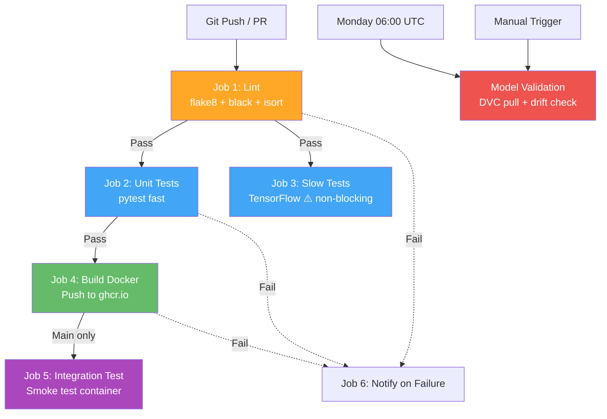
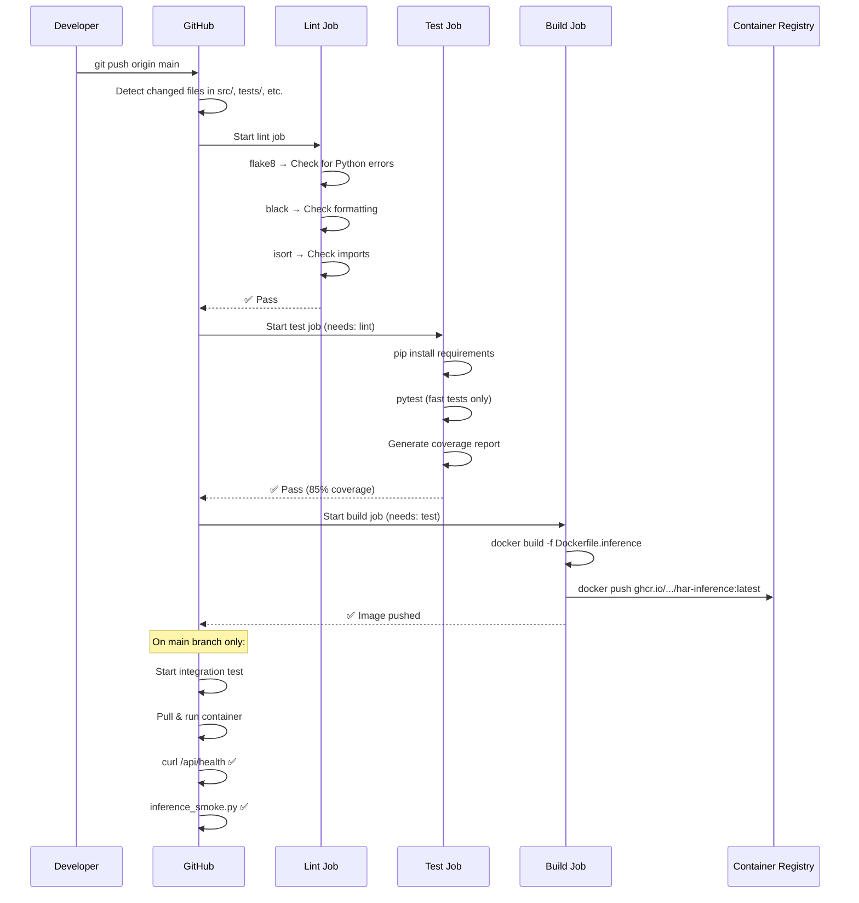
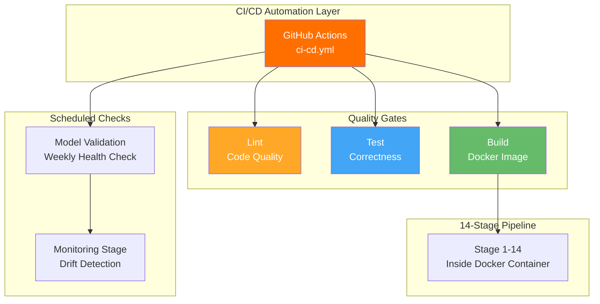

# GitHub Actions CI/CD — Continuous Integration & Deployment

## What is CI/CD?

CI/CD stands for **Continuous Integration** and **Continuous Deployment**. It means every time you push code, a computer **automatically tests it** and **builds it** for you.

Think of it like a **quality control assembly line** in a factory:
- A worker (developer) finishes a part (code change)
- The part goes on the conveyor belt (Git push)
- Station 1: Inspector checks for defects (linting)
- Station 2: Tester verifies it works (unit tests)
- Station 3: Stress test with heavy load (slow TensorFlow tests)
- Station 4: Package it for shipping (Docker build & push)
- If any station fails → the part is rejected and the worker is notified

Without CI/CD: "It works on my machine" → breaks in production.
With CI/CD: Every change is tested automatically before it can be deployed.

---

## What is GitHub Actions?

GitHub Actions is **GitHub's built-in CI/CD system**. You write a YAML file that describes what to do, and GitHub runs it on their cloud servers every time you push code.

- It's **free** for public repositories
- Runs on Linux, Windows, or macOS virtual machines
- Can be triggered by pushes, pull requests, schedules, or manually

---

## How CI/CD is Used in This Thesis

This project has a single CI/CD workflow file that runs **6 jobs** to ensure code quality, test correctness, build Docker images, run integration tests, validate models weekly, and notify on failures.

### Workflow Summary

| Job | What It Does | Runs When | Duration |
|-----|-------------|-----------|----------|
| **lint** | Checks code style (flake8, black, isort) | Every push/PR | ~1 min |
| **test** | Runs fast unit tests with coverage | After lint passes | ~3 min |
| **test-slow** | Runs TensorFlow model tests | After lint (non-blocking) | ~10 min |
| **build** | Builds & pushes Docker image | After test passes (not on PRs) | ~5 min |
| **integration-test** | Smoke test on Docker container | After build (main only) | ~3 min |
| **model-validation** | Weekly model health + drift check | Monday 06:00 UTC / manual | ~5 min |

---

## Where CI/CD Appears in the Repository

```
MasterArbeit_MLops/
├── .github/
│   └── workflows/
│       └── ci-cd.yml              ← The CI/CD workflow (350 lines)
├── docker/
│   └── Dockerfile.inference       ← Docker image built by CI/CD
├── tests/                         ← Tests run by CI/CD
│   ├── test_preprocessing.py
│   ├── test_model_inference.py
│   └── ... (25 test files)
└── config/
    └── requirements.txt           ← Dependencies installed by CI/CD
```

---

## The Workflow File Explained: `.github/workflows/ci-cd.yml`

### Header and Triggers

```yaml
name: HAR MLOps CI/CD

on:
  push:
    branches: [main, develop]
    paths:
      - 'src/**'
      - 'tests/**'
      - 'docker/**'
      - 'config/**'
      - 'requirements.txt'
      - '.github/workflows/**'
  pull_request:
    branches: [main]
  workflow_dispatch:
  schedule:
    - cron: '0 6 * * 1'
```

Line-by-line:

| Line | What It Means |
|------|--------------|
| `name: HAR MLOps CI/CD` | Name shown in GitHub Actions tab |
| `on: push:` | Run when code is pushed |
| `branches: [main, develop]` | Only for these branches (not feature branches) |
| `paths: - 'src/**'` | Only trigger if files in these folders changed |
| `pull_request: branches: [main]` | Also run on pull requests to main |
| `workflow_dispatch:` | Allow manual trigger from GitHub UI |
| `cron: '0 6 * * 1'` | Run every Monday at 06:00 UTC (weekly model check) |

### Environment Variables

```yaml
env:
  PYTHON_VERSION: '3.11'
  DOCKER_REGISTRY: ghcr.io
  IMAGE_NAME: shalinvachheta017/masterarbeit_mlops/har-inference
```

| Variable | Value | Purpose |
|----------|-------|---------|
| `PYTHON_VERSION` | 3.11 | Use Python 3.11 in all jobs |
| `DOCKER_REGISTRY` | ghcr.io | GitHub Container Registry |
| `IMAGE_NAME` | shalinvachheta017/.../har-inference | Full Docker image name |

---

### Job 1: Code Quality (Lint)

```yaml
lint:
  name: Code Quality
  runs-on: ubuntu-latest
  steps:
    - uses: actions/checkout@v4
    - uses: actions/setup-python@v5
      with:
        python-version: ${{ env.PYTHON_VERSION }}
    - run: pip install flake8 black==24.10.0 isort==6.0.1 mypy
    - run: flake8 src/ --select=E9,F63,F7,F82
    - run: black --check --diff src/
    - run: isort --check-only --diff src/
```

| Tool | What It Checks |
|------|---------------|
| **flake8** | Python errors: syntax errors (E9), comparison bugs (F63), undefined names (F82) |
| **black** | Code formatting: consistent indentation, line length, spacing |
| **isort** | Import ordering: stdlib → third-party → local imports |

Think of this like a **spell checker** for code — it catches style issues before they become bugs.

---

### Job 2: Unit Tests (Fast)

```yaml
test:
  name: Unit Tests
  runs-on: ubuntu-latest
  needs: lint
  steps:
    - run: pip install -r config/requirements.txt
    - run: pip install pytest pytest-cov pytest-xdist
    - run: |
        pytest tests/ -m "not slow and not integration and not gpu" \
          -v --cov=src --cov-report=xml --junitxml=test-results.xml
    - uses: codecov/codecov-action@v3
```

| Aspect | Detail |
|--------|--------|
| `needs: lint` | Only runs if lint passes |
| `-m "not slow and not integration and not gpu"` | Skips tests marked as slow, integration, or GPU-required |
| `--cov=src` | Measures how much of `src/` is tested (code coverage) |
| `codecov/codecov-action` | Uploads coverage report for tracking |

---

### Job 3: Slow Tests (TensorFlow)

```yaml
test-slow:
  name: Slow Tests (TensorFlow)
  runs-on: ubuntu-latest
  needs: lint
  continue-on-error: true
  steps:
    - run: pytest tests/ -m "slow" -v --tb=short
```

| Aspect | Detail |
|--------|--------|
| `continue-on-error: true` | If TF tests fail, the pipeline continues (non-blocking) |
| `-m "slow"` | Only runs tests with `@pytest.mark.slow` decorator |
| These tests load TensorFlow and the actual model — much slower |

---

### Job 4: Build Docker Image

```yaml
build:
  name: Build Docker Image
  runs-on: ubuntu-latest
  needs: test
  if: github.event_name != 'pull_request'
  permissions:
    packages: write
  steps:
    - uses: docker/setup-buildx-action@v3
    - uses: docker/login-action@v3
      with:
        registry: ghcr.io
        username: ${{ github.actor }}
        password: ${{ secrets.GITHUB_TOKEN }}
    - uses: docker/build-push-action@v5
      with:
        file: docker/Dockerfile.inference
        push: true
        tags: ${{ steps.meta.outputs.tags }}
        cache-from: type=gha
        cache-to: type=gha,mode=max
```

| Step | What Happens |
|------|-------------|
| Setup Buildx | Enables advanced Docker building features |
| Login to ghcr.io | Authenticates with GitHub Container Registry using the built-in token |
| Build & push | Builds `docker/Dockerfile.inference` and pushes to `ghcr.io/.../har-inference` |
| Cache | Uses GitHub Actions cache to speed up repeated builds |

**Image tags generated:**
- `latest` (only on main branch)
- Branch name (e.g., `develop`)
- Git commit SHA (e.g., `abc1234`)

---

### Job 5: Integration Tests (Smoke Test)

```yaml
integration-test:
  name: Integration Tests
  runs-on: ubuntu-latest
  needs: build
  if: github.ref == 'refs/heads/main'
  steps:
    - run: docker pull ghcr.io/.../har-inference:latest
    - run: |
        docker run -d --name har-test -p 8000:8000 ...
        # Wait up to 60 seconds for API to start
        for i in $(seq 1 30); do
          curl -sf http://localhost:8000/api/health && break
          sleep 2
        done
    - run: |
        curl -f http://localhost:8000/api/health
        python scripts/inference_smoke.py --endpoint http://localhost:8000
```

This **actually starts the Docker container** and sends real requests to verify:
1. The API health endpoint responds
2. The inference endpoint can process sensor data
3. The model produces valid predictions

---

### Job 6: Scheduled Model Validation

```yaml
model-validation:
  name: Scheduled Model Validation
  if: github.event_name == 'schedule' || github.event_name == 'workflow_dispatch'
  steps:
    - run: dvc pull models/pretrained/ --no-run-cache
    - run: python -m pytest tests/ -x --tb=short -q -m "not slow"
    - run: python run_pipeline.py --stages monitoring --skip-ingestion --continue-on-failure
```

This runs **every Monday morning** to:
1. Pull the latest model via DVC
2. Run tests to verify the model loads correctly
3. Check for data drift against the stored baseline

---

## How CI/CD Works — Visual Explanation

### Job Dependency Graph



### Complete Workflow Timeline



---

## Input and Output

### Input (What Triggers CI/CD)

| Trigger | Condition | Jobs Run |
|---------|-----------|----------|
| `git push` to main/develop | Files changed in src/, tests/, docker/, config/ | lint → test → build |
| Pull request to main | Any PR | lint → test (no build) |
| Manual trigger | Click "Run workflow" in GitHub | model-validation |
| Weekly schedule | Monday 06:00 UTC | model-validation |

### Output (What CI/CD Produces)

| Output | Where | Description |
|--------|-------|-------------|
| Test results | GitHub Actions tab | Pass/fail status + details |
| Coverage report | Codecov | How much code is tested |
| Docker image | `ghcr.io/.../har-inference` | Ready-to-deploy container |
| Smoke test results | GitHub Actions tab | Verified working container |
| Drift check | GitHub Actions tab | Model health status |

---

## Pipeline Stage

CI/CD is **not one of the 14 pipeline stages** — it sits above the pipeline and automates the entire workflow:



---

## Docker Image Details

CI/CD builds and pushes a single Docker image:

| Property | Value |
|----------|-------|
| **Registry** | `ghcr.io` (GitHub Container Registry) |
| **Image** | `ghcr.io/shalinvachheta017/masterarbeit_mlops/har-inference` |
| **Dockerfile** | `docker/Dockerfile.inference` |
| **Tags** | `latest` (main), branch name, commit SHA |
| **Cache** | GitHub Actions cache (speeds up rebuilds) |

### Tagging Strategy

```
Push to main   → ghcr.io/.../har-inference:latest
                  ghcr.io/.../har-inference:main
                  ghcr.io/.../har-inference:abc1234

Push to develop → ghcr.io/.../har-inference:develop
                  ghcr.io/.../har-inference:def5678
```

---

## Role in the Master's Thesis

| Thesis Aspect | How CI/CD Contributes |
|---------------|---------------------|
| **Chapter: Methodology** | Documents the automated testing and deployment strategy |
| **Chapter: Architecture** | CI/CD is the automation backbone — connects code → test → build → deploy |
| **Chapter: Quality Assurance** | Automated linting + testing prevents regressions |
| **Chapter: Deployment** | Docker images auto-built and pushed to container registry |
| **Chapter: Monitoring** | Weekly model validation via scheduled workflow |
| **MLOps Maturity** | CI/CD is Level 1+ MLOps — automated testing and building |

---

## Summary Reference

| Property | Value |
|----------|-------|
| **Technology** | GitHub Actions (built into GitHub) |
| **Workflow File** | `.github/workflows/ci-cd.yml` (350 lines) |
| **Workflow Name** | `HAR MLOps CI/CD` |
| **Jobs** | 6: lint, test, test-slow, build, integration-test, model-validation |
| **Python Version** | 3.11 |
| **Linting Tools** | flake8, black (24.10.0), isort (6.0.1) |
| **Test Framework** | pytest + pytest-cov + pytest-xdist |
| **Docker Registry** | `ghcr.io/shalinvachheta017/masterarbeit_mlops/har-inference` |
| **Schedule** | Monday 06:00 UTC (model validation) |
| **Triggers** | push, pull_request, workflow_dispatch, schedule |
