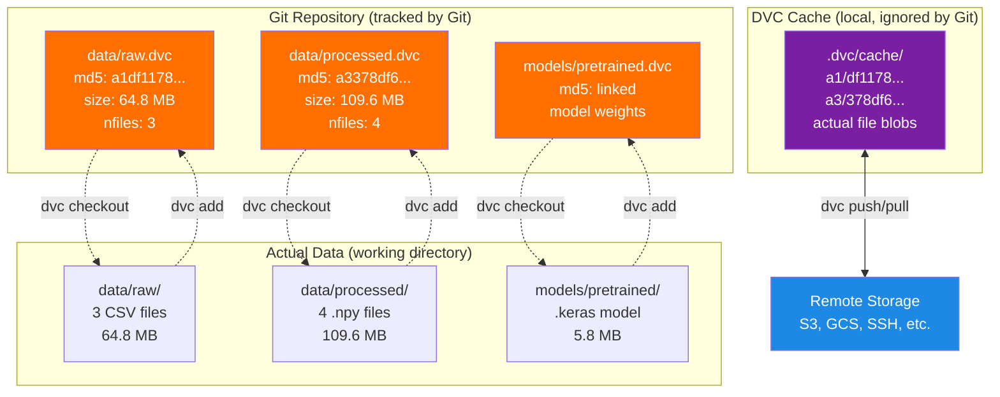
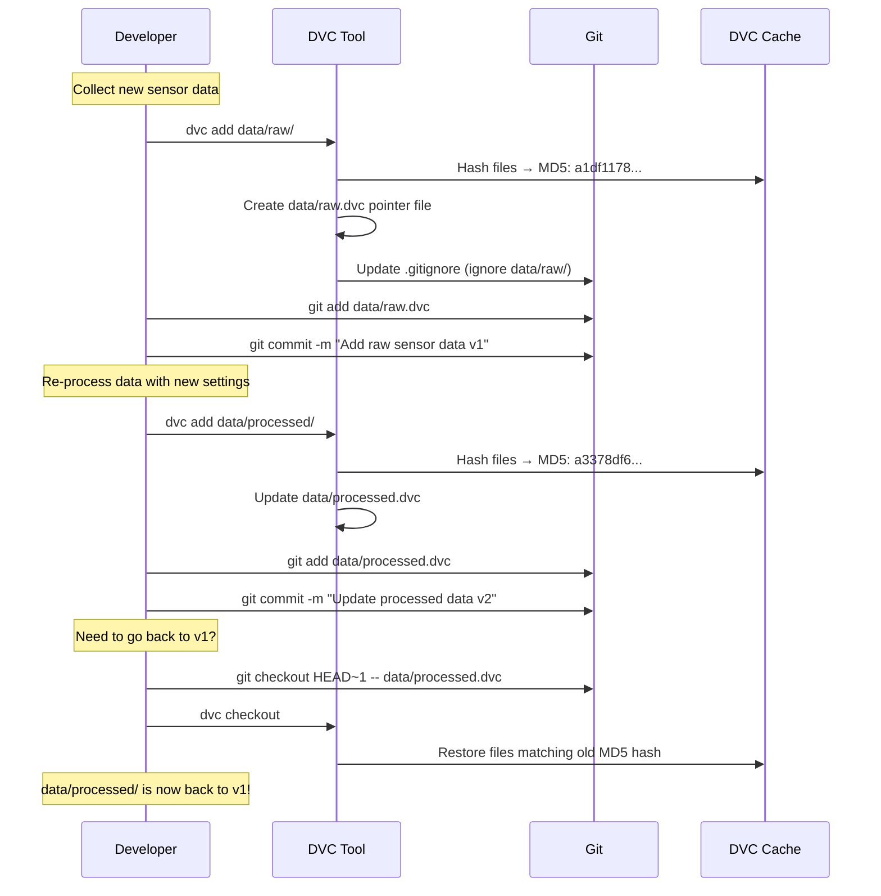
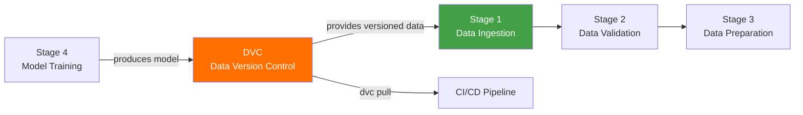

# DVC — Data Version Control

## What is DVC?

DVC (Data Version Control) is a tool that **tracks large data files** the same way Git tracks code files.

Think of it like **Git for big files**:
- Git is great for tracking code (small text files)
- But Git cannot handle large files like datasets (64 MB), model weights (5.8 MB), or processed data (109 MB)
- DVC solves this by storing only a small **pointer file** in Git, while the actual big file is stored separately

Imagine a **library catalog system**:
- The catalog card (= `.dvc` file, tiny) goes on the shelf where anyone can see it
- The actual book (= dataset, huge) is stored in the warehouse
- When you need the book, you look up the catalog card and fetch it from the warehouse

---

## Why is DVC Important in MLOps?

In machine learning projects, data changes over time:
- New sensor recordings are collected
- Data is cleaned or re-processed
- Features are re-engineered
- Models are re-trained on updated data

Without DVC:
```
"Which version of the training data produced our best model?"
"Someone accidentally deleted the raw data. Is it backed up?"
"The processed data changed but we don't know when or why."
```

With DVC:
```
raw.dvc → tracks data/raw/ (64.8 MB, 3 files) — MD5: a1df1178...
processed.dvc → tracks data/processed/ (109.6 MB, 4 files) — MD5: a3378df6...
pretrained.dvc → tracks models/pretrained/ (5.8 MB) — MD5: linked to model
```

Every time data changes, DVC creates a new hash. Git tracks the `.dvc` file change, so you can always:
- Go back to any previous version of the data
- Know exactly which data version trained which model
- Share data between team members without storing it in Git

---

## How DVC is Used in This Thesis

This project uses DVC for **data-only versioning** — it tracks the large data files and model weights, but does NOT use DVC pipelines (the pipeline is handled by `run_pipeline.py` instead).

### What DVC Tracks

| DVC File | What It Tracks | Size | Number of Files |
|----------|---------------|------|-----------------|
| `data/raw.dvc` | Raw sensor recordings | 64.8 MB | 3 files |
| `data/processed.dvc` | Processed/windowed data | 109.6 MB | 4 files |
| `data/prepared.dvc` | Train/test split data | varies | varies |
| `models/pretrained.dvc` | Pre-trained model weights | ~5.8 MB | model files |

### Hash Algorithm

DVC uses **MD5** hashing to uniquely identify each version of a file:
```
md5: a1df11782807ac51484f9e9747bc68f2.dir
```

This hash changes whenever the data content changes, making it easy to detect modifications.

---

## Where DVC Appears in the Repository

```
MasterArbeit_MLops/
├── data/
│   ├── raw.dvc               ← Pointer to raw sensor data
│   ├── processed.dvc         ← Pointer to processed data
│   ├── prepared.dvc          ← Pointer to prepared train/test data
│   ├── raw/                  ← Actual raw data (ignored by Git)
│   ├── processed/            ← Actual processed data (ignored by Git)
│   └── prepared/             ← Actual prepared data (ignored by Git)
├── models/
│   └── pretrained.dvc        ← Pointer to pre-trained model
├── .dvcignore                ← Files DVC should ignore
├── .gitignore                ← Contains data/* (Git ignores actual data)
└── pyproject.toml            ← dvc>=3.50 dependency
```

---

## Important Files Explained

### 1. DVC Pointer File: `data/raw.dvc`

This is a tiny text file that Git tracks. It **points to** the actual data.

```yaml
outs:
- md5: a1df11782807ac51484f9e9747bc68f2.dir
  size: 64817199
  nfiles: 3
  hash: md5
  path: raw
```

Line-by-line:

| Line | What It Means |
|------|--------------|
| `outs:` | "Outputs" — the files/folders this DVC file tracks |
| `md5: a1df1178...` | The unique fingerprint of the data. If any file changes, this hash changes |
| `size: 64817199` | Total size in bytes (≈ 64.8 MB) |
| `nfiles: 3` | The `raw/` folder contains 3 files |
| `hash: md5` | Using MD5 hashing algorithm |
| `path: raw` | Points to the `data/raw/` folder |

### 2. DVC Pointer File: `data/processed.dvc`

```yaml
outs:
- md5: a3378df65380f9062735e1f541f32b01.dir
  size: 109633840
  nfiles: 4
  hash: md5
  path: processed
```

This tracks the **processed data** — the output of the preprocessing pipeline (windowing, normalization). It's larger (109.6 MB) because it contains windowed numpy arrays.

### 3. `.dvcignore`

Similar to `.gitignore`, this file tells DVC which files to skip when scanning directories. It prevents DVC from tracking temporary files, logs, or cache.

---

## How DVC Works — Visual Explanation

### The Two-Layer Storage System



### Data Versioning Timeline



---

## Input and Output

### Input (What Goes Into DVC)

| Input | Source | Description |
|-------|--------|-------------|
| Raw sensor CSV files | Data collection | Accelerometer + gyroscope recordings |
| Processed numpy arrays | Preprocessing pipeline | Windowed, normalized sensor data |
| Prepared train/test splits | Data preparation stage | Ready-to-train data |
| Pre-trained model weights | Model training | `.keras` model file |

### Output (What DVC Produces)

| Output | Location | Description |
|--------|----------|-------------|
| `.dvc` pointer files | `data/*.dvc`, `models/*.dvc` | Small text files tracked by Git |
| Cache blobs | `.dvc/cache/` | Deduplicated data storage |
| Version history | Git log of `.dvc` files | Complete data lineage |

---

## Pipeline Stage

DVC operates **outside** the 14-stage production pipeline. It provides data versioning that supports the pipeline:



### Important: No DVC Pipeline YAML

This project does **NOT** use `dvc.yaml` or `dvc.lock` files. There is no DVC pipeline definition. The 14-stage pipeline is managed by `run_pipeline.py` and `src/pipeline/production_pipeline.py`. DVC is used **only** for data and model file versioning.

---

## Common DVC Commands

| Command | What It Does | Example |
|---------|-------------|---------|
| `dvc add <path>` | Start tracking a file/folder | `dvc add data/raw/` |
| `dvc push` | Upload data to remote storage | `dvc push` |
| `dvc pull` | Download data from remote storage | `dvc pull` |
| `dvc checkout` | Restore data files from cache | `dvc checkout` |
| `dvc status` | Show what files changed | `dvc status` |
| `dvc diff` | Compare data versions | `dvc diff HEAD~1` |

### Example: Adding New Data

```bash
# 1. Put new sensor data files into data/raw/
cp new_recordings/*.csv data/raw/

# 2. Tell DVC to track the changes
dvc add data/raw/

# 3. DVC updates the pointer file (new MD5 hash)
# data/raw.dvc now has a different md5 value

# 4. Commit the pointer file to Git
git add data/raw.dvc
git commit -m "Add new sensor recordings - batch 3"

# 5. Push data to remote storage (for team sharing)
dvc push
```

### Example: Reverting to Old Data

```bash
# 1. Check Git log for data changes
git log --oneline data/raw.dvc

# 2. Go back to old version
git checkout abc1234 -- data/raw.dvc

# 3. Restore the actual data files
dvc checkout

# 4. data/raw/ now contains the old version!
```

---

## CI/CD Integration

The GitHub Actions CI/CD workflow uses DVC to pull model artifacts:

```yaml
# From .github/workflows/ci-cd.yml (model-validation job)
- name: Download latest model
  run: |
    dvc pull models/pretrained/ --no-run-cache 2>/dev/null \
      || echo "DVC remote not configured — using model already present in repo."
```

This ensures the CI/CD pipeline always has the correct version of the model for testing and deployment.

---

## Role in the Master's Thesis

| Thesis Aspect | How DVC Contributes |
|---------------|-------------------|
| **Chapter: Methodology** | Documents the data versioning strategy — how data lineage is maintained |
| **Chapter: Architecture** | DVC is a foundational layer — ensures data reproducibility across the MLOps system |
| **Chapter: Data Management** | Tracks 180+ MB of sensor data and processed arrays without bloating the Git repo |
| **Chapter: Reproducibility** | Any experiment can be reproduced by checking out the matching `.dvc` files |
| **Chapter: CI/CD** | `dvc pull` in GitHub Actions ensures automated tests use the correct model version |

---

## Summary Reference

| Property | Value |
|----------|-------|
| **Technology** | DVC — Data Version Control (open-source) |
| **Version** | ≥ 3.50 (from pyproject.toml) |
| **DVC Files** | `data/raw.dvc`, `data/processed.dvc`, `data/prepared.dvc`, `models/pretrained.dvc` |
| **Hash Algorithm** | MD5 |
| **Pipeline Mode** | Data-only versioning (NO `dvc.yaml` pipeline) |
| **Total Tracked Data** | ~180 MB (raw: 64.8 MB, processed: 109.6 MB, model: ~5.8 MB) |
| **Config File** | `.dvcignore` |
| **Git Integration** | `.dvc` pointer files committed to Git, actual data in `.gitignore` |
| **CI/CD Usage** | `dvc pull models/pretrained/` in GitHub Actions model-validation job |
| **Dependency** | `dvc>=3.50` in `pyproject.toml` |
