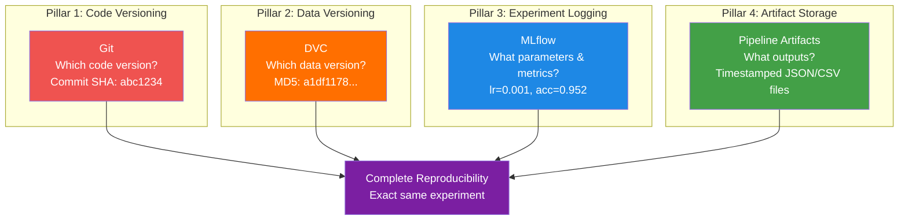
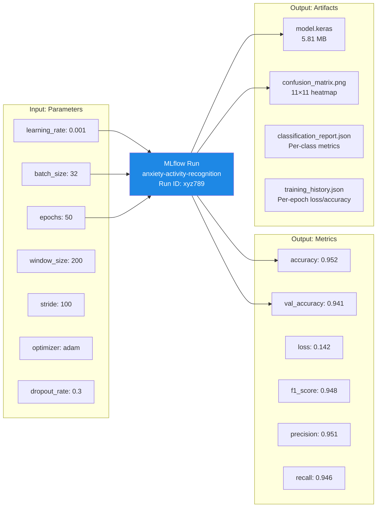
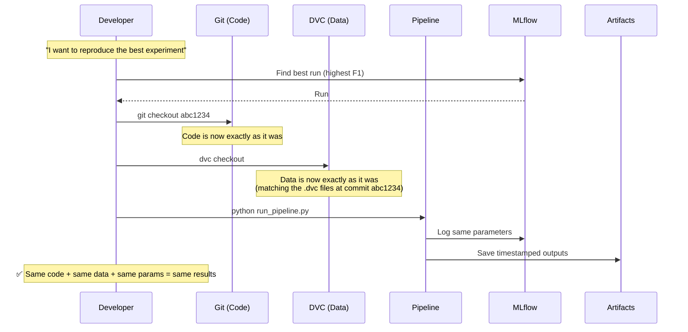
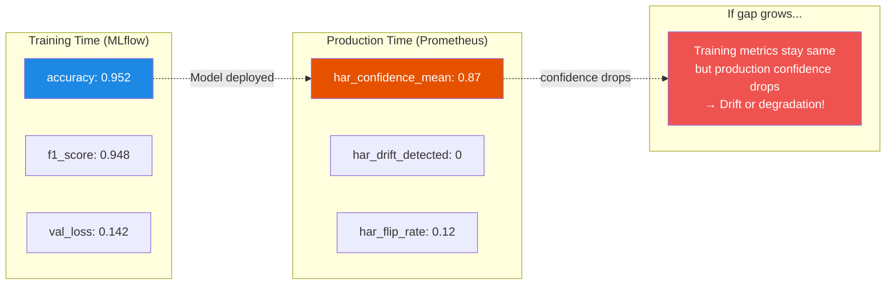

# Experiment Tracking — The Bigger Picture

## What is Experiment Tracking?

Experiment tracking is the **practice of recording everything about your ML experiments** so you can compare, reproduce, and learn from them. It's a broader concept that includes multiple tools working together.

Think of it like a **research lab journal**:
- You write down every experiment: date, hypothesis, materials, procedure, results
- You photograph the outcomes (confusion matrices, charts)
- You keep samples of what you produced (model files)
- You can look back and say: "Experiment #47 on February 15th had the best results"

In this thesis, experiment tracking is not just one tool — it's a **system** combining:
- **MLflow** → records parameters, metrics, and models
- **DVC** → records which data version was used
- **Pipeline artifacts** → records every stage's outputs
- **Git** → records which code version was used

Together, they provide **complete reproducibility**: you can recreate any experiment exactly.

---

## Why is Experiment Tracking Important in MLOps?

Machine learning is experimental by nature. You try many combinations:

| Experiment | Learning Rate | Epochs | Window Size | Normalization | Accuracy | F1 Score |
|-----------|--------------|--------|-------------|---------------|----------|----------|
| Run 1 | 0.001 | 50 | 200 | ON | 0.912 | 0.908 |
| Run 2 | 0.0005 | 80 | 200 | ON | 0.941 | 0.937 |
| Run 3 | 0.001 | 50 | 150 | OFF | 0.889 | 0.874 |
| Run 4 | 0.0005 | 100 | 200 | ON | 0.952 | 0.948 |
| ... | ... | ... | ... | ... | ... | ... |

Without experiment tracking, after 50 runs you have no idea which settings produced the best model. With tracking, you can instantly query: "Show me the run with the highest F1 score and its exact parameters."

---

## The Four Pillars of Experiment Tracking in This Thesis



---

## Pillar 1: Code Versioning (Git)

Every experiment runs a specific version of the code. Git records:

| What Git Tracks | Example |
|----------------|---------|
| Commit SHA | `abc1234def5678` |
| Branch | `main`, `develop`, `feature/new-model` |
| Author | `thesis-student` |
| Date | `2026-02-15 14:30:22` |
| Changed files | `src/components/model_trainer.py` |

**CI/CD tags** the Docker image with the Git SHA, so you always know which code version is running:
```
ghcr.io/.../har-inference:abc1234
```

---

## Pillar 2: Data Versioning (DVC)

Every experiment uses a specific version of the data. DVC records:

| What DVC Tracks | File | Hash |
|----------------|------|------|
| Raw sensor data | `data/raw.dvc` | `a1df11782807ac51484f9e9747bc68f2` |
| Processed arrays | `data/processed.dvc` | `a3378df65380f9062735e1f541f32b01` |
| Pre-trained model | `models/pretrained.dvc` | model hash |

The `.dvc` files are committed to Git, creating a **code ↔ data link**:
```
Git commit abc1234 → data/raw.dvc(md5: a1df1178) + data/processed.dvc(md5: a3378df6)
```

---

## Pillar 3: Experiment Logging (MLflow)

MLflow records the **details of each training run**:

### What Gets Logged



### How to Query

```python
from src.mlflow_tracking import MLflowTracker

tracker = MLflowTracker()

# Find the best run by F1 score
best = tracker.get_best_run(metric="f1_score")
print(f"Best F1: {best['metrics.f1_score']}")
print(f"Learning rate: {best['params.learning_rate']}")
print(f"Run ID: {best['run_id']}")

# Compare multiple runs
comparison = tracker.compare_runs(
    run_ids=["run1_id", "run2_id", "run3_id"],
    metrics=["accuracy", "f1_score", "loss"]
)
print(comparison)
```

---

## Pillar 4: Artifact Storage (Pipeline System)

The 14-stage production pipeline saves **timestamped artifacts** for every run:

```
artifacts/
├── 20260219_125400/
│   ├── validation_report.json      ← Stage 2 output
│   ├── preprocessing_config.json   ← Stage 3 output
│   ├── inference_summary.json      ← Stage 6 output
│   ├── trigger_decision.json       ← Stage 7 output
│   └── monitoring_report.json      ← Stage 8 output
├── 20260222_164651/
│   └── ...
└── 20260223_004636/
    └── ...
```

Each folder name is a **timestamp** (YYYYMMDD_HHMMSS), so you can always find the artifacts from a specific pipeline run.

### Example: inference_summary.json

```json
{
  "total_windows": 375,
  "total_time_seconds": 2.41,
  "throughput_windows_per_sec": 155.6,
  "avg_ms_per_window": 6.4,
  "predictions_per_class": {
    "Walking": 45,
    "Sitting": 89,
    "Standing": 67,
    ...
  },
  "activity_share": {
    "Walking": 0.12,
    "Sitting": 0.237,
    ...
  }
}
```

---

## How Everything Connects

### The Reproducibility Chain



### Tracking Coverage Map

| Question | Answer Source | Files |
|----------|-------------|-------|
| What code was used? | Git | `.git/` |
| What data was used? | DVC | `data/*.dvc` |
| What parameters were used? | MLflow | `mlruns/` |
| What metrics were achieved? | MLflow | `mlruns/` |
| What model was produced? | MLflow + Model Registry | `mlruns/`, `models/registry/` |
| What happened at each stage? | Pipeline artifacts | `artifacts/YYYYMMDD_HHMMSS/` |
| What monitoring said? | Monitoring report | `outputs/monitoring/monitoring_report.json` |
| Which model is deployed? | Model Registry | `models/registry/model_registry.json` |

---

## Where Experiment Tracking Appears in the Repository

```
MasterArbeit_MLops/
├── src/
│   ├── mlflow_tracking.py           ← MLflow experiment logging
│   ├── model_rollback.py            ← Model versioning & registry
│   └── utils/
│       └── artifacts_manager.py     ← Pipeline artifact management
├── config/
│   └── mlflow_config.yaml           ← Experiment configuration
├── mlruns/                          ← MLflow local storage
├── artifacts/                       ← Pipeline run artifacts (timestamped)
├── data/
│   ├── raw.dvc                      ← Data version tracking
│   └── processed.dvc               ← Data version tracking
└── .github/
    └── workflows/
        └── ci-cd.yml                ← CI/CD ensures code is tested
```

---

## Key Metrics Tracked

### Training Metrics (via MLflow)

| Metric | Description | Logged At |
|--------|-------------|-----------|
| `accuracy` | Overall classification accuracy | End of training |
| `val_accuracy` | Validation set accuracy | Each epoch |
| `loss` | Training loss | Each epoch |
| `val_loss` | Validation loss | Each epoch |
| `f1_score` | F1 score (macro-averaged) | End of training |
| `precision` | Precision (macro-averaged) | End of training |
| `recall` | Recall (macro-averaged) | End of training |

### Production Metrics (via Prometheus)

| Metric | Description | Logged At |
|--------|-------------|-----------|
| `har_confidence_mean` | Mean prediction confidence | Every batch |
| `har_entropy_mean` | Mean prediction entropy | Every batch |
| `har_flip_rate` | Activity prediction flip rate | Every batch |
| `har_drift_detected` | Data drift indicator | Every batch |
| `har_model_f1_score` | Current production F1 | Model deployment |
| `har_inference_latency_seconds` | Inference speed | Every prediction |

### The Gap Between Training and Production



This is why experiment tracking extends beyond training:
- **MLflow** tracks how the model performed during training
- **Prometheus + Monitoring** tracks how it performs in production
- If the gap between training and production metrics grows → the model needs retraining

---

## The MLflow Experiment: anxiety-activity-recognition

All experiments in this thesis are grouped under one MLflow experiment:

| Property | Value |
|----------|-------|
| **Experiment Name** | `anxiety-activity-recognition` |
| **Model Type** | 1D-CNN-BiLSTM |
| **Input Shape** | (batch, 200, 6) — 200 timesteps × 6 sensor channels |
| **Output Shape** | (batch, 11) — 11 activity classes |
| **Tracking URI** | `mlruns/` (local directory) |
| **Registry Model** | `har-1dcnn-bilstm` |

### The 11 Activity Classes

| Class | Activity | Description |
|-------|----------|-------------|
| 0 | Walking | Normal walking |
| 1 | Jogging | Running/jogging |
| 2 | Stairs | Walking up/down stairs |
| 3 | Sitting | Seated |
| 4 | Standing | Standing still |
| 5 | Typing | Typing on keyboard |
| 6 | Brushing Teeth | Dental hygiene |
| 7 | Eating Soup | Eating with spoon |
| 8 | Eating Chips | Eating with hands |
| 9 | Eating Pasta | Eating with fork |
| 10 | Drinking | Drinking from cup |

---

## How to View Experiments

### MLflow UI

```bash
# Start the MLflow web interface
mlflow ui
# Open http://localhost:5000

# Or via the module
python src/mlflow_tracking.py --ui
```

The MLflow UI shows:
- All runs sorted by date/metric
- Side-by-side parameter comparison
- Metric charts (accuracy over epochs)
- Downloadable artifacts (model, confusion matrix)

### Command Line

```bash
# List all experiments
python src/mlflow_tracking.py --list-experiments

# List runs in the experiment
python src/mlflow_tracking.py --list-runs anxiety-activity-recognition
```

### Python API

```python
from src.mlflow_tracking import MLflowTracker

tracker = MLflowTracker()

# Get the best run
best = tracker.get_best_run(metric="f1_score")

# Compare runs
df = tracker.compare_runs(
    run_ids=["id1", "id2"],
    metrics=["accuracy", "f1_score"]
)
```

---

## Role in the Master's Thesis

| Thesis Aspect | How Experiment Tracking Contributes |
|---------------|-----------------------------------|
| **Chapter: Methodology** | Core MLOps practice — documents how experiments are managed |
| **Chapter: Architecture** | Four-pillar system (Git + DVC + MLflow + Artifacts) |
| **Chapter: Reproducibility** | Any experiment can be completely recreated |
| **Chapter: Evaluation** | Side-by-side comparison of all model variants |
| **Chapter: Results** | Best model identified via MLflow query |
| **Chapter: MLOps Maturity** | Comprehensive tracking = Level 1+ MLOps capability |
| **Chapter: Monitoring** | Production metrics extend tracking beyond training |

---

## Summary Reference

| Property | Value |
|----------|-------|
| **Concept** | Experiment Tracking (MLOps practice) |
| **Pillar 1** | Git — code versioning |
| **Pillar 2** | DVC — data versioning (≥3.50) |
| **Pillar 3** | MLflow — parameter/metric/artifact logging |
| **Pillar 4** | Pipeline artifacts — timestamped stage outputs |
| **Experiment** | `anxiety-activity-recognition` |
| **Model** | `har-1dcnn-bilstm` (1D-CNN-BiLSTM) |
| **Training Metrics** | accuracy, loss, val_accuracy, val_loss, f1_score, precision, recall |
| **Production Metrics** | confidence_mean, entropy_mean, flip_rate, drift_detected |
| **Activity Classes** | 11 (Walking, Jogging, Stairs, Sitting, Standing, Typing, Brushing Teeth, Eating Soup/Chips/Pasta, Drinking) |
| **Artifact Storage** | `artifacts/YYYYMMDD_HHMMSS/` (timestamped folders) |
| **MLflow UI** | `http://localhost:5000` |
| **Key Files** | `src/mlflow_tracking.py`, `config/mlflow_config.yaml`, `data/*.dvc`, `src/utils/artifacts_manager.py` |
