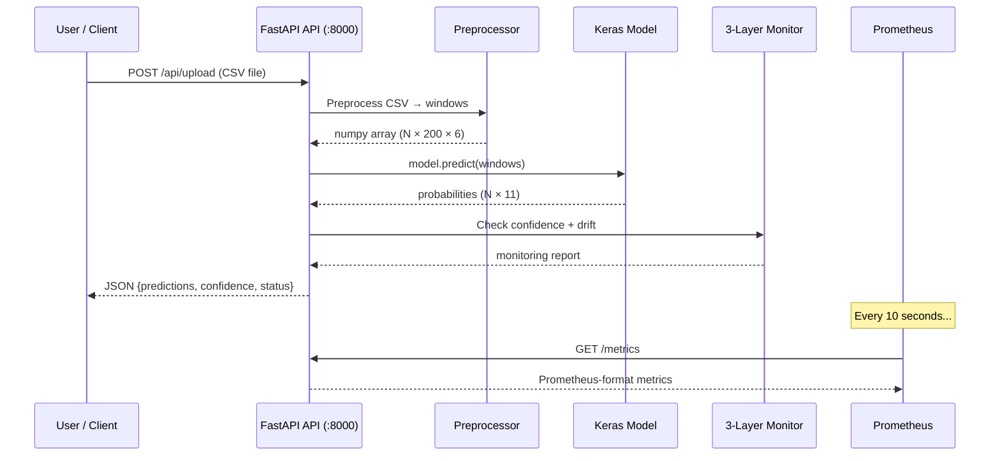
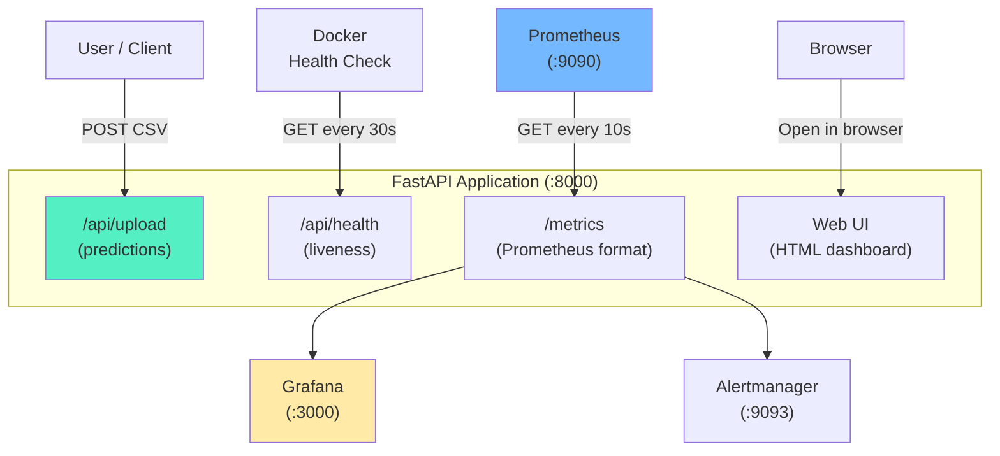

# FastAPI — Explained in Very Simple English

> **Audience:** Someone who knows Python but has never built a web API.  
> **Goal:** Understand *what* FastAPI does, *why* we need it, and *how* it works in this thesis.

---

## What is FastAPI? (One Paragraph)

Imagine you trained a machine learning model on your laptop. It works perfectly — but only you can use it. **FastAPI solves this.** It turns your Python function into a web endpoint that anyone (or any other program) can call over the internet. You send data to it, it runs your model, and sends the prediction back. It is like putting your model behind a counter at a restaurant — anyone can walk up, place an order (send data), and get their food (get a prediction).

---

## Why FastAPI Matters in MLOps

In MLOps, a model is not "done" when training finishes. A model is only useful when **other systems can use it**. That means:

- A mobile app needs to send sensor data and get a classification back
- A dashboard needs to check if the model is healthy
- A monitoring system needs to scrape performance metrics

Without an API, the model is just a `.keras` file sitting on a disk. **FastAPI turns the model into a live service.**

| MLOps Concern | How FastAPI Helps |
|---------------|-------------------|
| **Deployment** | Model becomes accessible over HTTP |
| **Integration** | Other tools (Prometheus, Grafana, CI/CD) can talk to it |
| **Monitoring** | Health check endpoint tells you if the service is alive |
| **Testing** | Automated tests can POST data and check responses |
| **Scalability** | Multiple replicas can serve predictions in parallel |

---

## How FastAPI is Used in THIS Thesis

In this thesis, FastAPI serves the trained **1D-CNN-BiLSTM Human Activity Recognition model**. Here is how it works:



### What happens step by step:

1. **User uploads a CSV file** with 6 sensor columns (accelerometer + gyroscope)
2. **FastAPI preprocesses the data** — converts units, normalizes, creates sliding windows
3. **FastAPI runs the Keras model** — gets predictions + confidence scores for each window
4. **FastAPI runs 3-layer monitoring** — checks confidence, temporal patterns, and drift
5. **FastAPI returns JSON** with predictions, activity names, confidence, and health status
6. **Prometheus scrapes `/metrics`** every 10 seconds for real-time monitoring

---

## Where It Appears in the Repository

```
src/
└── api/
    └── app.py              ← The main FastAPI application (all endpoints)

docker/
└── Dockerfile.inference    ← Runs FastAPI with uvicorn on port 8000

docker-compose.yml          ← Service "inference" builds and starts the API

config/
└── prometheus.yml          ← Prometheus scrapes FastAPI at inference:8000
```

---

## Important Files and Their Role

### `src/api/app.py` — The Main Application

This is the heart of the API. Everything happens here.

**Key components inside this file:**

| Component | What It Does |
|-----------|-------------|
| `app = FastAPI(...)` | Creates the web application |
| `@app.post("/api/upload")` | Accepts CSV uploads and returns predictions |
| `@app.get("/metrics")` | Exposes Prometheus metrics for scraping |
| `@app.get("/api/health")` | Returns `{"status": "healthy"}` — used by Docker health check |
| `_preprocess_csv()` | Converts uploaded CSV into model-ready windows |
| `_run_inference()` | Loads model and runs `model.predict()` |
| `_run_monitoring()` | Checks 3-layer health (confidence + temporal + drift) |
| Web UI (HTML) | Interactive browser page to upload CSV and see results |

**Prometheus metrics defined in the API:**

| Metric Name | Type | What It Measures |
|-------------|------|------------------|
| `har_api_requests_total` | Counter | How many requests have been made |
| `har_confidence_mean` | Gauge | Average prediction confidence |
| `har_entropy_mean` | Gauge | Average prediction entropy |
| `har_flip_rate` | Gauge | How often predictions flip between adjacent windows |
| `har_drift_detected` | Gauge | Whether drift is detected (0 or 1) |
| `har_baseline_age_days` | Gauge | How old the drift baseline is |
| `har_inference_latency_ms` | Histogram | How long each prediction takes |

### `docker/Dockerfile.inference` — Runs FastAPI

The last line of this Dockerfile is:

```dockerfile
CMD ["uvicorn", "src.api.app:app", "--host", "0.0.0.0", "--port", "8000"]
```

This tells Docker: "Start the FastAPI app using uvicorn web server on port 8000."

**uvicorn** is the actual web server. FastAPI is the framework that handles routes and request parsing. Think of it like:
- **FastAPI** = the chef who prepares the food
- **uvicorn** = the waiter who carries the food to the table

---

## Input and Output

### Input

| What | Format | Example |
|------|--------|---------|
| Sensor CSV file | `.csv` with 6 columns | Ax_w, Ay_w, Az_w, Gx_w, Gy_w, Gz_w |
| Health check request | GET request | `GET /api/health` |
| Metrics scrape | GET request | `GET /metrics` |

### Output

| What | Format | Example |
|------|--------|---------|
| Prediction response | JSON | `{"predictions": ["walking", "standing", ...], "confidence": [0.94, 0.87, ...]}` |
| Health status | JSON | `{"status": "healthy", "model_loaded": true}` |
| Prometheus metrics | Plain text | `har_confidence_mean 0.92` |

---

## Pipeline Stage

| Stage | Role of FastAPI |
|-------|----------------|
| Stage 4 — Inference | Runs model prediction on uploaded sensor data |
| Stage 6 — Monitoring | Exposes metrics for Prometheus to scrape |
| Deployment | Makes the model accessible as a web service |
| Health Checks | Docker pings `/api/health` every 30 seconds |

---

## How FastAPI Connects With Other Tools



---

## Example From This Thesis

### Scenario: A researcher uploads new sensor data

1. The researcher opens `http://localhost:8000` in their browser
2. They see the Web UI with an "Upload CSV" button
3. They upload `new_participant_session.csv` (6 sensor columns, 10 minutes of data)
4. FastAPI:
   - Detects units (milliG) → converts to m/s²
   - Normalizes using the saved scaler (Z-score)
   - Creates sliding windows (200 samples, 50% overlap) → ~60 windows
   - Loads the `.keras` model and runs `model.predict()`
   - Runs 3-layer monitoring (confidence, temporal, drift)
5. The browser shows:
   - Activity timeline: Walking → Standing → Sitting → ...
   - Average confidence: 0.89
   - Monitoring status: HEALTHY ✅
6. Meanwhile, Prometheus scrapes `/metrics` and Grafana shows the new data point on the dashboard

### Scenario: Docker health check fails

1. Docker runs `curl -f http://localhost:8000/api/health` every 30 seconds
2. If the API crashes or the model fails to load → `curl` returns an error
3. After 3 consecutive failures → Docker marks the container as **unhealthy**
4. In a production k8s setup, the container would be automatically restarted

---

## Role in the Master's Thesis

| Section | What FastAPI Proves |
|---------|---------------------|
| Chapter 4 (Implementation) | The model is deployed as a real REST API, not just a script |
| Chapter 4 (Monitoring) | Prometheus metrics are exposed automatically |
| Chapter 5 (Evaluation) | The system can handle real requests and return accurate predictions |
| Architecture Diagram | FastAPI is the central "serving layer" between model and users |

**Thesis sentence you can use:**  
*"The trained HAR model is exposed as a REST API using FastAPI, enabling real-time inference on uploaded sensor data with integrated health monitoring and Prometheus metric export."*

---

## Summary

| Question | Answer |
|----------|--------|
| What is it? | A Python web framework that turns functions into HTTP endpoints |
| Why use it? | To make the model accessible as a live service |
| Where in the repo? | `src/api/app.py` |
| What goes in? | CSV sensor data |
| What comes out? | JSON predictions + confidence + monitoring status |
| Who talks to it? | Users, Prometheus, Docker, Grafana |
| When does it run? | Always — it is the "always-on" service in docker-compose |
