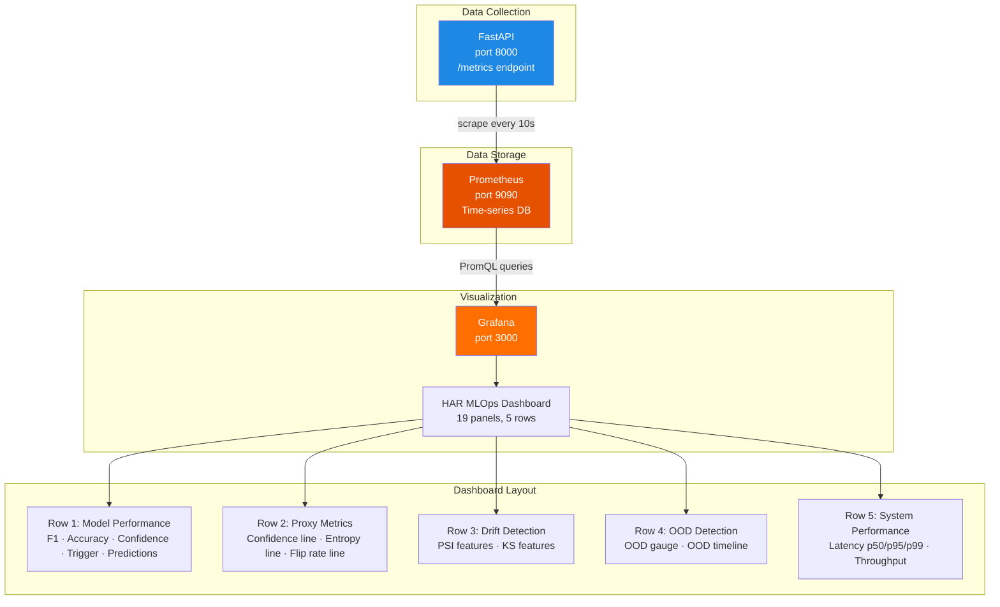
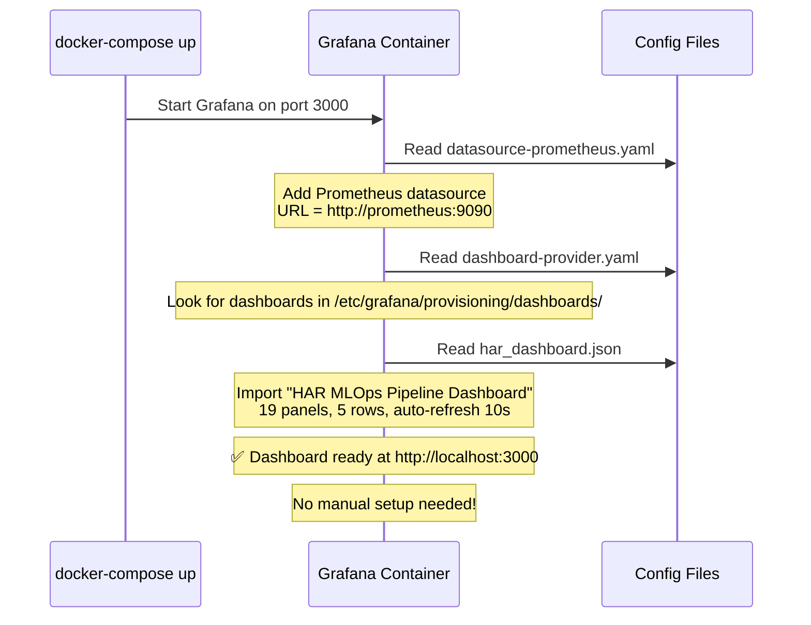
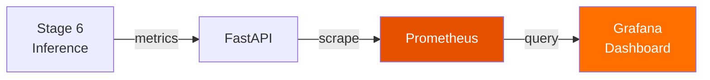

# Grafana — Dashboard Visualization

## What is Grafana?

Grafana is a tool that **turns numbers into visual dashboards**. It connects to data sources like Prometheus and displays beautiful charts, gauges, and alert panels in a web browser.

Think of it like a **car dashboard**:
- The speedometer (= confidence gauge) shows your current speed
- The fuel gauge (= F1 score) shows how much "quality" you have left
- Warning lights (= alert panels) flash when something needs attention
- The trip computer (= time-series charts) shows trends over time

Prometheus collects the numbers. Grafana makes them **visual and understandable**.

---

## Why is Grafana Important in MLOps?

Raw numbers are hard to understand:
```
har_confidence_mean 0.72
har_f1_score 0.948
har_drift_psi{feature="acc_x"} 0.08
har_flip_rate 0.12
```

A Grafana dashboard turns these into:
- A big **green/yellow/red gauge** showing F1 score
- A **line chart** showing confidence trending down over the last 6 hours
- A **pie chart** showing prediction distribution across activity classes
- A **stat panel** showing "Normal / Warning / Triggered" trigger state

One glance at the dashboard tells you: "Is the model healthy right now?"

---

## How Grafana is Used in This Thesis

The HAR pipeline has a **pre-configured dashboard** called "HAR MLOps Pipeline Dashboard" that visualizes all model health metrics collected by Prometheus. It provisions automatically when Docker starts.

### Dashboard Sections

| Row | Title | Panels |
|-----|-------|--------|
| **Row 1** | Model Performance Overview | F1 Score, Accuracy, Mean Confidence, Trigger State, Predictions by Class |
| **Row 2** | Proxy Metrics | Confidence Over Time, Entropy Over Time, Prediction Flip Rate |
| **Row 3** | Drift Detection | PSI by Feature, KS Statistic by Feature |
| **Row 4** | OOD Detection | OOD Ratio (gauge), OOD Metrics Over Time |
| **Row 5** | System Performance | Inference Latency Percentiles, Throughput (Samples/sec) |

---

## Where Grafana Appears in the Repository

```
MasterArbeit_MLops/
├── config/
│   └── grafana/
│       ├── dashboard-provider.yaml    ← Tells Grafana where to find dashboards
│       ├── datasource-prometheus.yaml ← Connects Grafana to Prometheus
│       └── har_dashboard.json         ← The actual dashboard (540 lines)
└── docker-compose.yml                 ← Grafana service on port 3000
```

---

## Important Files Explained

### 1. Datasource Config: `config/grafana/datasource-prometheus.yaml`

This file tells Grafana **where to get data from**.

```yaml
apiVersion: 1
datasources:
  - name: Prometheus
    type: prometheus
    url: http://prometheus:9090
    access: proxy
    isDefault: true
```

| Line | What It Means |
|------|--------------|
| `name: Prometheus` | Name shown in Grafana's datasource list |
| `type: prometheus` | Use the built-in Prometheus connector |
| `url: http://prometheus:9090` | Prometheus server address (Docker service name) |
| `access: proxy` | Grafana server talks to Prometheus (not the browser directly) |
| `isDefault: true` | Use this datasource by default for all panels |

### 2. Dashboard Provider: `config/grafana/dashboard-provider.yaml`

This file tells Grafana **to auto-load dashboards** from a folder.

```yaml
apiVersion: 1
providers:
  - name: 'HAR MLOps'
    folder: ''
    type: file
    options:
      path: /etc/grafana/provisioning/dashboards
```

| Line | What It Means |
|------|--------------|
| `name: 'HAR MLOps'` | Dashboard group name |
| `type: file` | Load dashboards from JSON files on disk |
| `path: /etc/grafana/provisioning/dashboards` | Directory inside the Docker container where dashboards are mounted |

### 3. The Dashboard: `config/grafana/har_dashboard.json`

This is the **main dashboard** — a 540-line JSON file that defines every panel, chart, and threshold. It's auto-provisioned when Grafana starts.

#### Dashboard Metadata

```json
{
  "title": "HAR MLOps Pipeline Dashboard",
  "uid": "har-mlops-dashboard",
  "description": "MLOps monitoring dashboard for Human Activity Recognition pipeline",
  "refresh": "10s",
  "tags": ["har", "mlops", "monitoring"],
  "style": "dark",
  "time": { "from": "now-6h", "to": "now" }
}
```

| Field | Meaning |
|-------|---------|
| `refresh: "10s"` | Dashboard auto-refreshes every 10 seconds |
| `time: "now-6h"` | Default view shows the last 6 hours |
| `style: "dark"` | Dark theme |

---

### Panel-by-Panel Breakdown

#### Panel 1: F1 Score (Stat Panel)

```json
{
  "title": "F1 Score",
  "type": "stat",
  "targets": [{ "expr": "har_model_f1_score" }],
  "thresholds": {
    "steps": [
      { "color": "red",    "value": null },
      { "color": "yellow", "value": 0.8 },
      { "color": "green",  "value": 0.85 }
    ]
  }
}
```

| Threshold | Color | Meaning |
|-----------|-------|---------|
| F1 < 0.80 | 🔴 Red | Model performing badly — needs attention |
| 0.80 ≤ F1 < 0.85 | 🟡 Yellow | Acceptable but could be better |
| F1 ≥ 0.85 | 🟢 Green | Model performing well |

#### Panel 2: Accuracy (Stat Panel)

```json
{
  "title": "Accuracy",
  "targets": [{ "expr": "har_model_accuracy" }],
  "thresholds": {
    "steps": [
      { "color": "red",    "value": null },
      { "color": "yellow", "value": 0.8 },
      { "color": "green",  "value": 0.9 }
    ]
  }
}
```

#### Panel 3: Mean Confidence (Stat Panel)

```json
{
  "title": "Mean Confidence",
  "targets": [{ "expr": "har_confidence_mean" }],
  "thresholds": {
    "steps": [
      { "color": "green",  "value": null },
      { "color": "yellow", "value": 0.7 },
      { "color": "red",    "value": 0.6 }
    ]
  }
}
```

Note: Confidence thresholds are **inverted** (red at bottom) — low confidence is bad.

#### Panel 4: Trigger State (Stat Panel with Value Mapping)

```json
{
  "title": "Trigger State",
  "targets": [{ "expr": "har_trigger_state{trigger_type=\"overall\"}" }],
  "mappings": [
    { "0": { "text": "Normal" } },
    { "1": { "text": "Warning" } },
    { "2": { "text": "Triggered" } }
  ],
  "thresholds": {
    "steps": [
      { "color": "green",  "value": null },
      { "color": "yellow", "value": 1 },
      { "color": "red",    "value": 2 }
    ]
  }
}
```

This panel shows a **traffic light**:
- 🟢 **Normal** (0) — everything is fine
- 🟡 **Warning** (1) — some metrics are concerning
- 🔴 **Triggered** (2) — retraining needed

#### Panel 5: Predictions by Class (Pie Chart)

```json
{
  "title": "Predictions by Class (Rate)",
  "type": "piechart",
  "targets": [{
    "expr": "sum(rate(har_predictions_total[5m])) by (activity_class)",
    "legendFormat": "Class {{activity_class}}"
  }]
}
```

Shows the **distribution of predicted activities** — helps detect class imbalance or stuck predictions.

#### Panels 6-8: Time Series Charts

| Panel | Metric | PromQL | Thresholds |
|-------|--------|--------|------------|
| Confidence Over Time | `har_confidence_mean` | Direct query | Yellow < 0.7, Red < 0.6 |
| Entropy Over Time | `har_entropy_mean` | Direct query | Yellow > 1.0, Red > 1.5 |
| Prediction Flip Rate | `har_flip_rate` | Direct query | Yellow > 0.10, Red > 0.15 |

#### Panels 9-10: Drift Detection

| Panel | Metric | PromQL |
|-------|--------|--------|
| PSI by Feature | `har_drift_psi` | `har_drift_psi` with `{{feature}}` legend |
| KS Statistic by Feature | `har_drift_ks_stat` | `har_drift_ks_stat` with `{{feature}}` legend |

#### Panels 11-12: OOD Detection

| Panel | Type | Metrics |
|-------|------|---------|
| OOD Ratio | Gauge | `har_ood_ratio` (thresholds: yellow > 10%, red > 20%) |
| OOD Metrics Over Time | Time series | `har_ood_ratio` + `har_energy_score_mean` |

#### Panels 13-14: System Performance

| Panel | Metrics Shown |
|-------|--------------|
| Inference Latency Percentiles | p50, p95, p99 of `har_inference_latency_seconds` |
| Throughput | `rate(har_samples_processed_total[5m])` samples/sec |

---

## How Grafana Works — Visual Explanation

### Architecture



### Auto-Provisioning Flow



---

## Input and Output

### Input (What Grafana Receives)

| Source | Data | Query Language |
|--------|------|---------------|
| Prometheus (port 9090) | All 16 HAR metrics | PromQL |
| Dashboard JSON | Panel definitions, thresholds, layouts | JSON |
| Provisioning configs | Datasource + dashboard paths | YAML |

### Output (What Grafana Shows)

| Output | Description |
|--------|-------------|
| Web dashboard | `http://localhost:3000` — interactive panels |
| Color-coded status | Green/yellow/red thresholds on all key metrics |
| Time-series charts | Historical trends for confidence, entropy, drift |
| Alert overlays | Visual markers when Prometheus alerts fire |

---

## Pipeline Stage

Grafana is the **visualization layer** that sits on top of the monitoring stack:



---

## Role in the Master's Thesis

| Thesis Aspect | How Grafana Contributes |
|---------------|----------------------|
| **Chapter: Monitoring** | Visual proof that the monitoring system works — dashboard screenshots |
| **Chapter: Architecture** | Part of the observability stack (Prometheus → Grafana) |
| **Chapter: Results** | Dashboard shows real-time model health during production inference |
| **Chapter: MLOps Maturity** | Production-grade visualization — essential for Level 2+ MLOps |
| **Screenshots** | Dashboard panels can be captured for thesis figures and appendices |

---

## Summary Reference

| Property | Value |
|----------|-------|
| **Technology** | Grafana (open-source, Grafana Labs) |
| **Dashboard File** | `config/grafana/har_dashboard.json` (540 lines) |
| **Datasource Config** | `config/grafana/datasource-prometheus.yaml` |
| **Provider Config** | `config/grafana/dashboard-provider.yaml` |
| **Port** | 3000 |
| **Dashboard Title** | "HAR MLOps Pipeline Dashboard" |
| **Dashboard UID** | `har-mlops-dashboard` |
| **Total Panels** | 19 panels in 5 rows |
| **Auto-Refresh** | Every 10 seconds |
| **Default Time Range** | Last 6 hours |
| **Data Source** | Prometheus at `http://prometheus:9090` |
| **Docker Service** | `grafana` in docker-compose.yml |
| **Theme** | Dark |
