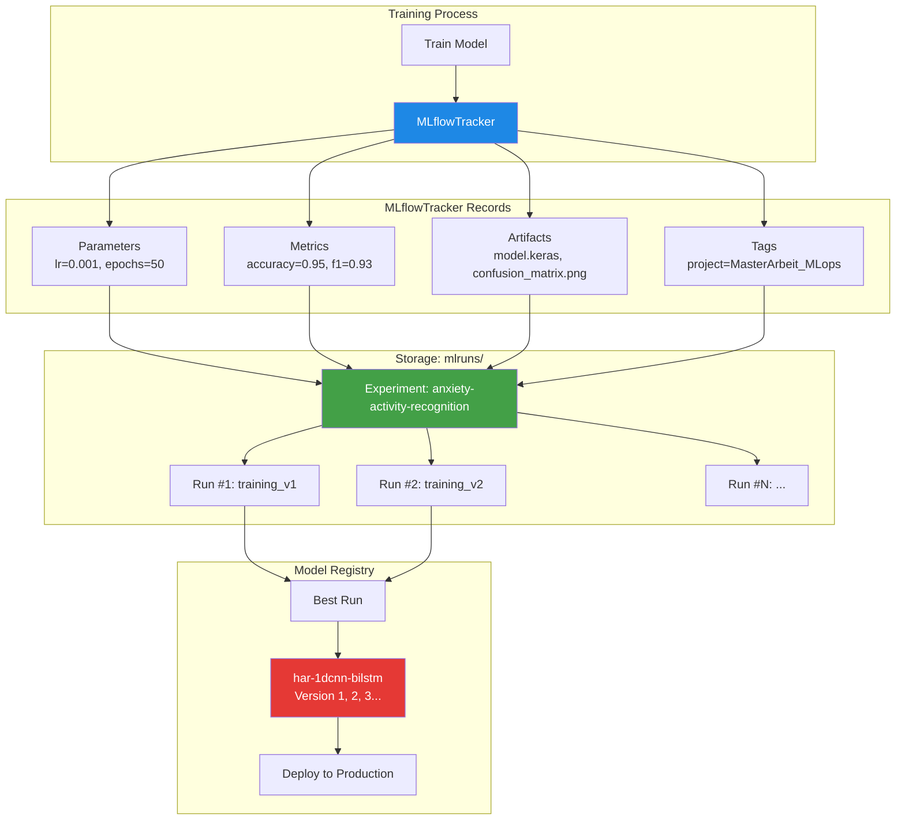
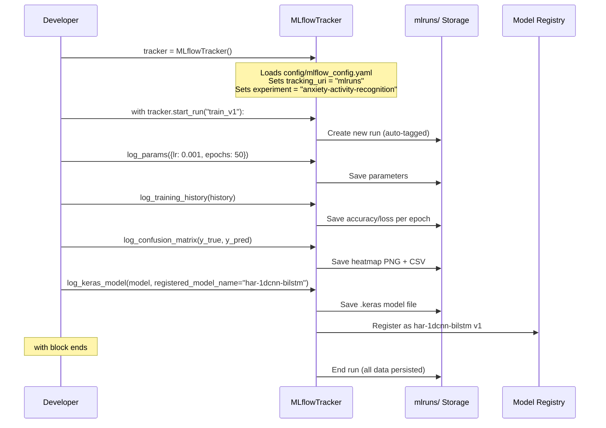
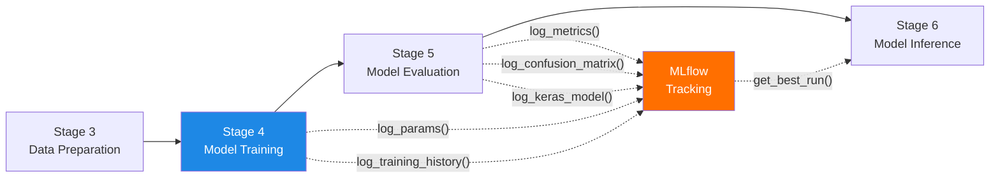

# MLflow — Experiment Tracking & Model Registry

## What is MLflow?

MLflow is a tool that **records everything about your machine learning experiments**.
Every time you train a model, MLflow saves *what settings you used*, *how well the model performed*, and *the model file itself*.

Think of it like a **laboratory notebook** for scientists:
- A scientist writes down every experiment they do
- They record what chemicals they used (= parameters)
- They record what happened (= metrics)
- They keep the samples (= artifacts/model files)
- Later they can compare experiments and find the best one

Without MLflow, you would train a model, get a good result, then forget what settings produced it. MLflow prevents this.

---

## Why is MLflow Important in MLOps?

In MLOps, you train models many times with different settings. You need to:

1. **Remember** what you tried (parameters like learning rate, batch size)
2. **Compare** results across experiments (which settings gave best F1?)
3. **Reproduce** the best experiment (exact same settings → same result)
4. **Register** the best model for production deployment
5. **Track** model versions (v1.0 → v1.1 → v2.0)

Without experiment tracking:
```
"I got 95% accuracy last week... but I don't remember the learning rate I used."
"Was it the model from Tuesday or Wednesday that was better?"
```

With MLflow:
```
Run #47: lr=0.001, batch=32, epochs=50 → accuracy=0.952, f1=0.948
Run #48: lr=0.0005, batch=64, epochs=80 → accuracy=0.961, f1=0.957  ← best!
```

---

## How MLflow is Used in This Thesis

This project uses MLflow to track the **1D-CNN-BiLSTM** model for Human Activity Recognition (HAR). The tracking is done through a custom `MLflowTracker` class that wraps the MLflow Python API.

### What Gets Tracked

| Category | Items Tracked |
|----------|--------------|
| **Parameters** | learning_rate, batch_size, epochs, window_size, stride, optimizer, dropout_rate |
| **Metrics** | accuracy, loss, val_accuracy, val_loss, f1_score, precision, recall |
| **Artifacts** | model_weights, confusion_matrix, classification_report, training_history, preprocessing_config |
| **Tags** | project=MasterArbeit_MLops, author=thesis-student, model_type=1D-CNN-BiLSTM, task=activity-recognition |

### Experiment Name

All runs are grouped under one experiment:
```
anxiety-activity-recognition
```

### Registered Model Name

The best model is registered in MLflow's Model Registry as:
```
har-1dcnn-bilstm
```

---

## Where MLflow Appears in the Repository

```
MasterArbeit_MLops/
├── src/
│   └── mlflow_tracking.py          ← Main MLflow integration (643 lines)
├── config/
│   └── mlflow_config.yaml          ← MLflow configuration (64 lines)
├── mlruns/                         ← Local tracking storage (auto-created)
└── docker-compose.yml              ← MLflow UI service on port 5000
```

---

## Important Files Explained

### 1. Configuration File: `config/mlflow_config.yaml`

This file tells MLflow **where to store data** and **what to track**.

```yaml
mlflow:
  tracking_uri: "mlruns"
  experiment_name: "anxiety-activity-recognition"
  registry:
    model_name: "har-1dcnn-bilstm"
```

Line-by-line:

| Line | What It Means |
|------|--------------|
| `tracking_uri: "mlruns"` | Store all experiment data in local `mlruns/` folder (not a remote server) |
| `experiment_name: "anxiety-activity-recognition"` | Group all runs under this experiment name |
| `model_name: "har-1dcnn-bilstm"` | When registering a model, use this name in the registry |

```yaml
run_defaults:
  tags:
    project: "MasterArbeit_MLops"
    author: "thesis-student"
    model_type: "1D-CNN-BiLSTM"
    task: "activity-recognition"
```

These **tags** are automatically added to every run. They help you search and filter later:
- "Show me all runs for this project"
- "Show me all runs using BiLSTM"

```yaml
logging:
  metrics:
    - accuracy
    - loss
    - val_accuracy
    - val_loss
    - f1_score
    - precision
    - recall
```

This is the list of **metrics to log during training**. Each metric gets a value at each epoch (training step), so you can see how the model improves over time.

```yaml
  artifacts:
    - model_weights
    - confusion_matrix
    - classification_report
    - training_history
    - preprocessing_config
```

These are the **files saved alongside each run**:
- `model_weights` → the trained `.keras` model file
- `confusion_matrix` → a PNG heatmap showing which activities get confused
- `classification_report` → per-class precision/recall/F1 as JSON
- `training_history` → loss and accuracy curves per epoch
- `preprocessing_config` → what normalization/windowing settings were used

---

### 2. Main Tracking Module: `src/mlflow_tracking.py`

This is the **core MLflow integration** — a 643-line Python file with the `MLflowTracker` class.

#### Class Initialization

```python
class MLflowTracker:
    DEFAULT_CONFIG_PATH = Path(__file__).parent.parent / "config" / "mlflow_config.yaml"

    def __init__(self, tracking_uri=None, experiment_name=None, config_path=None):
        self.config = self._load_config(config_path or self.DEFAULT_CONFIG_PATH)
        self.tracking_uri = tracking_uri or self.config.get("mlflow", {}).get("tracking_uri", "mlruns")
        mlflow.set_tracking_uri(self.tracking_uri)
        self.experiment_name = experiment_name or self.config.get("mlflow", {}).get("experiment_name", "default")
        self._setup_experiment()
        self.client = MlflowClient()
```

| Line | What It Does |
|------|-------------|
| `DEFAULT_CONFIG_PATH` | Automatically finds the config YAML relative to this file |
| `self._load_config(...)` | Reads the YAML settings |
| `mlflow.set_tracking_uri(...)` | Tells MLflow where to store data (`mlruns/` folder) |
| `self._setup_experiment()` | Creates the experiment if it doesn't exist yet |
| `self.client = MlflowClient()` | Creates a client for model registry operations |

#### Starting a Run (Context Manager)

```python
@contextmanager
def start_run(self, run_name=None, tags=None, nested=False):
    if run_name is None:
        run_name = f"run_{datetime.now().strftime('%Y%m%d_%H%M%S')}"
    default_tags = self.config.get("run_defaults", {}).get("tags", {})
    all_tags = {**default_tags, **(tags or {})}
    try:
        self.run = mlflow.start_run(run_name=run_name, nested=nested, tags=all_tags)
        self.run_id = self.run.info.run_id
        yield self
    finally:
        mlflow.end_run()
```

This uses Python's `with` statement pattern:
```python
with tracker.start_run("training_v1") as run:
    run.log_params({"lr": 0.001})      # Record settings
    run.log_metrics({"accuracy": 0.95}) # Record results
# Run automatically ends here (even if an error occurs)
```

Think of it like **opening and closing a notebook**:
- `with tracker.start_run(...)` = open a new page
- Write your experiment notes inside
- When the `with` block ends = close the page (it's saved forever)

#### Logging Methods

The tracker provides these recording methods:

| Method | What It Records | Example |
|--------|----------------|---------|
| `log_params(dict)` | Settings used for training | `{"learning_rate": 0.001, "epochs": 50}` |
| `log_metrics(dict, step)` | Performance numbers | `{"accuracy": 0.95, "f1_score": 0.93}` |
| `log_artifact(path)` | Any file | A confusion matrix image |
| `log_dict(dict, filename)` | A dictionary as JSON file | Config snapshot |
| `log_dataframe(df, filename)` | A pandas DataFrame as CSV | Training history table |
| `log_figure(fig, filename)` | A matplotlib chart as PNG | Loss curve plot |
| `log_keras_model(model)` | A Keras/TensorFlow model | The trained `.keras` file |

#### Logging a Keras Model

```python
def log_keras_model(self, model, artifact_path="model", input_example=None, registered_model_name=None):
    signature = None
    if input_example is not None:
        predictions = model.predict(input_example[:1], verbose=0)
        signature = infer_signature(input_example[:1], predictions)
    mlflow.keras.log_model(model, name=artifact_path, signature=signature,
                           registered_model_name=registered_model_name)
```

| Step | What Happens |
|------|-------------|
| 1. Create signature | MLflow records input shape `(None, 200, 6)` and output shape `(None, 11)` |
| 2. Save model | The `.keras` file is stored in the MLflow artifact store |
| 3. Register (optional) | If a name is given, adds this model to the Model Registry |

#### Training History Logging

```python
def log_training_history(self, history):
    for epoch, metrics in enumerate(zip(*[history.history[k] for k in history.history])):
        metric_dict = {k: v for k, v in zip(history.history.keys(), metrics)}
        self.log_metrics(metric_dict, step=epoch)
    self.log_dict(history.history, "training_history.json", "training")
```

This logs **every epoch's metrics as a time series**, so you can see:
- Epoch 1: accuracy=0.45, loss=1.80
- Epoch 2: accuracy=0.62, loss=1.20
- ...
- Epoch 50: accuracy=0.95, loss=0.12

#### Confusion Matrix & Classification Report

```python
def log_confusion_matrix(self, y_true, y_pred, class_names=None):
    cm = confusion_matrix(y_true, y_pred)
    fig, ax = plt.subplots(figsize=(12, 10))
    sns.heatmap(cm, annot=True, fmt="d", cmap="Blues", ...)
    self.log_figure(fig, "confusion_matrix.png", "evaluation")
    self.log_dataframe(cm_df, "confusion_matrix.csv", "evaluation")
```

This creates **both a visual heatmap and a CSV** of the confusion matrix, storing them inside the MLflow run.

#### Finding the Best Run

```python
def get_best_run(self, metric="accuracy", ascending=False):
    experiment = mlflow.get_experiment_by_name(self.experiment_name)
    runs = mlflow.search_runs(
        experiment_ids=[experiment.experiment_id],
        order_by=[f"metrics.{metric} {'ASC' if ascending else 'DESC'}"],
        max_results=1,
    )
    if len(runs) > 0:
        return runs.iloc[0].to_dict()
```

This searches all recorded runs and returns the one with the **highest** (or lowest) value of a metric. For example: "Which run had the highest accuracy?"

---

## How MLflow Works — Visual Explanation

### Architecture



### Typical Training Flow



---

## Input and Output

### Input (What Goes Into MLflow)

| Input | Source | Description |
|-------|--------|-------------|
| Training parameters | Developer/config | learning_rate, batch_size, epochs, etc. |
| Performance metrics | Model evaluation | accuracy, loss, f1_score, precision, recall |
| Keras model file | `model.fit()` output | The trained `.keras` weights |
| Confusion matrix | sklearn metrics | 11×11 matrix (11 activity classes) |
| Training history | `model.fit()` History | Per-epoch loss and accuracy |

### Output (What MLflow Produces)

| Output | Location | Description |
|--------|----------|-------------|
| Run records | `mlruns/` folder | All parameters, metrics, artifacts for each run |
| Registered model | Model Registry | Versioned model ready for deployment |
| Comparison data | MLflow UI | Side-by-side comparison of all runs |
| Best run query | Python API | Programmatic access to the best model |

---

## Pipeline Stage

MLflow tracking is used during **Stage 4 (Model Training)** and connects to other stages:



---

## Running MLflow

### Start the MLflow UI (Web Interface)

```bash
# From the project root
mlflow ui
# Opens at http://localhost:5000
```

### Using Docker Compose

The MLflow UI is also available as a Docker service:
```yaml
# In docker-compose.yml
mlflow:
  image: ghcr.io/mlflow/mlflow:v2.19.0
  ports:
    - "5000:5000"
  command: mlflow server --host 0.0.0.0
  volumes:
    - ./mlruns:/mlruns
```

### CLI Commands

```bash
# List all experiments
python src/mlflow_tracking.py --list-experiments

# List all runs in an experiment
python src/mlflow_tracking.py --list-runs anxiety-activity-recognition

# Start MLflow UI
python src/mlflow_tracking.py --ui
```

---

## Example: Complete Training Run

Here is what a full training run looks like in this project:

```python
from src.mlflow_tracking import MLflowTracker

# 1. Create tracker (reads config automatically)
tracker = MLflowTracker()

# 2. Start a run
with tracker.start_run("training_v1") as run:
    # 3. Log what settings we used
    run.log_params({
        "learning_rate": 0.001,
        "batch_size": 32,
        "epochs": 50,
        "model_type": "1D-CNN-BiLSTM",
        "window_size": 200,
        "stride": 100,
    })

    # 4. Train the model (happens outside MLflow)
    history = model.fit(X_train, y_train, epochs=50, batch_size=32, ...)

    # 5. Log training history (epoch-by-epoch)
    run.log_training_history(history)

    # 6. Log final metrics
    run.log_metrics({
        "accuracy": 0.952,
        "f1_score": 0.948,
        "loss": 0.142,
    })

    # 7. Log confusion matrix (heatmap + CSV)
    run.log_confusion_matrix(y_true, y_pred, class_names=[
        "Walking", "Jogging", "Stairs", "Sitting", "Standing",
        "Typing", "Brushing Teeth", "Eating Soup", "Eating Chips",
        "Eating Pasta", "Drinking"
    ])

    # 8. Save the model and register it
    run.log_keras_model(
        model,
        input_example=X_test[:1],
        registered_model_name="har-1dcnn-bilstm"
    )

# Run ends automatically → everything saved in mlruns/
```

After this run, you can:
- Open `http://localhost:5000` to see the MLflow UI
- Compare this run with previous runs
- Download the model from the registry
- Find the best run: `tracker.get_best_run(metric="f1_score")`

---

## Role in the Master's Thesis

| Thesis Aspect | How MLflow Contributes |
|---------------|----------------------|
| **Chapter: Methodology** | Documents the experiment tracking approach and reproducibility strategy |
| **Chapter: Architecture** | MLflow is a core component of the MLOps infrastructure — enables experiment comparison |
| **Chapter: Evaluation** | All model performance metrics (accuracy, F1, confusion matrix) are stored and comparable |
| **Chapter: Results** | "Best run" queries provide the exact parameters that produced the best model |
| **Reproducibility** | Any experiment can be reproduced by re-using its logged parameters |
| **Model Versioning** | Model Registry tracks versions, enabling comparison of model iterations |

---

## Summary Reference

| Property | Value |
|----------|-------|
| **Technology** | MLflow (open-source, by Databricks) |
| **Main File** | `src/mlflow_tracking.py` (643 lines) |
| **Config File** | `config/mlflow_config.yaml` (64 lines) |
| **Storage** | Local `mlruns/` directory |
| **UI Port** | 5000 |
| **Experiment** | `anxiety-activity-recognition` |
| **Model Name** | `har-1dcnn-bilstm` |
| **Core Class** | `MLflowTracker` |
| **Key Methods** | `start_run()`, `log_params()`, `log_metrics()`, `log_keras_model()` |
| **Pipeline Stage** | Stage 4 (Training) + Stage 5 (Evaluation) |
| **Docker Service** | `mlflow` in docker-compose.yml |
