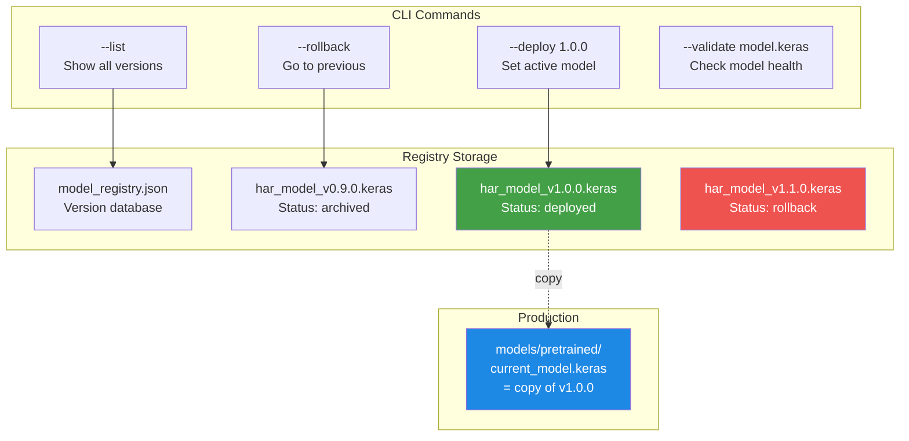
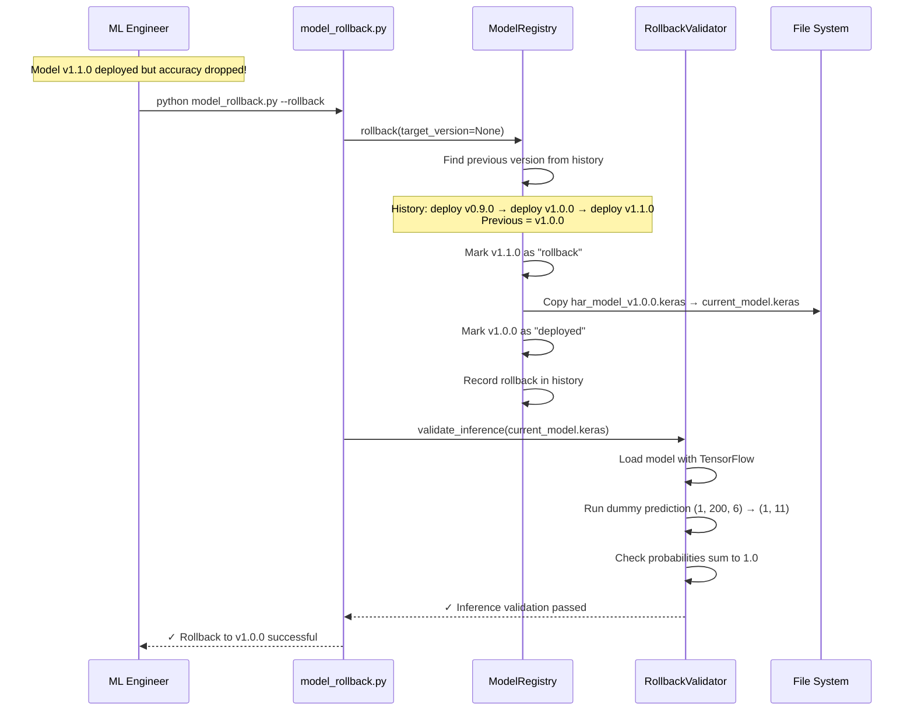
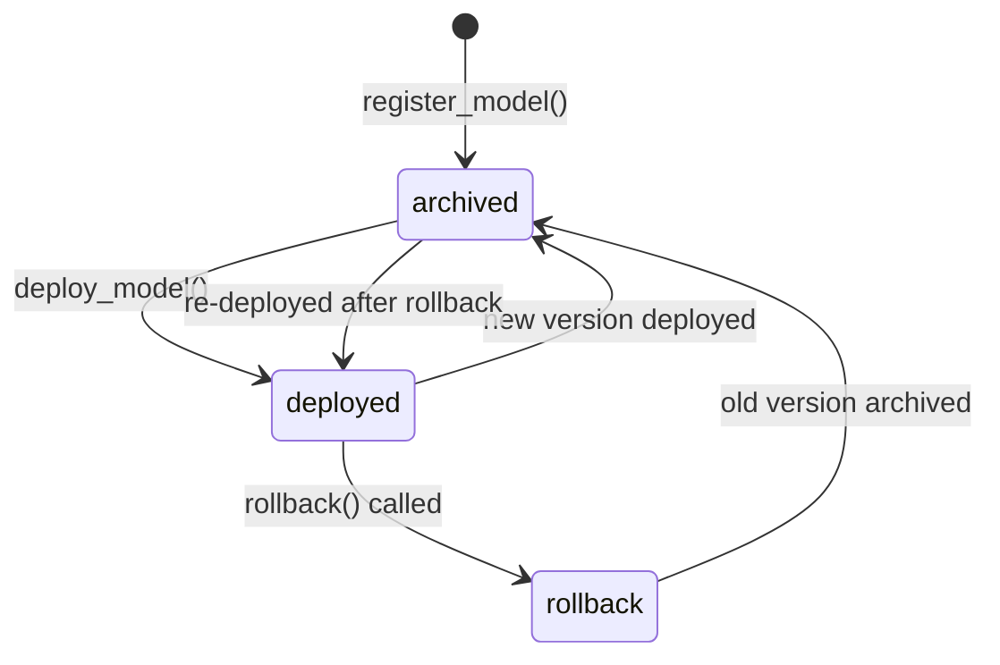

# Model Registry & Rollback — Version Management for Deployed Models

## What is a Model Registry?

A Model Registry is a system that **keeps track of all model versions** — which model is currently deployed, which ones were deployed before, and how to quickly switch between them.

Think of it like a **software update system** on your phone:
- Your phone keeps the current app version (= deployed model)
- It remembers previous versions (= archived models)
- If a new update has bugs, you can roll back to the previous version (= rollback)
- There's a log of every update that happened (= deployment history)

In ML, this is critical because a newly trained model might perform **worse** than the old one on real-world data. You need to be able to quickly switch back.

---

## Why is a Model Registry Important in MLOps?

Without a registry:
```
"We deployed a new model and accuracy dropped 15%. Where's the old model?"
"I think it was in /tmp/model_backup_v2_final_FINAL.keras..."
"The old model was on John's laptop. He's on vacation."
```

With a registry:
```
python src/model_rollback.py --list
  🟢 Version: 20260215.143022  Status: deployed   Accuracy: 0.952
  ⚪ Version: 20260210.091544  Status: archived   Accuracy: 0.941

python src/model_rollback.py --rollback
  ✓ Rolled back from 20260215.143022 to 20260210.091544
  ✓ Inference validation passed
```

---

## How the Model Registry is Used in This Thesis

The HAR pipeline has a **local model registry** implemented in `src/model_rollback.py`. It provides:

1. **Model registration** — store new model versions with metadata
2. **Model deployment** — set a specific version as the active model
3. **Rollback** — quickly revert to a previous working model
4. **Validation** — verify model loads and produces valid predictions before/after rollback
5. **Audit trail** — complete history of all deployments and rollbacks

### Model Information Stored

| Field | Description | Example |
|-------|-------------|---------|
| `version` | Semantic version or timestamp | `20260215.143022` |
| `path` | Location in registry directory | `models/registry/har_model_v1.0.0.keras` |
| `created_at` | When the model was registered | `2026-02-15T14:30:22` |
| `deployed_at` | When it was deployed to production | `2026-02-15T14:35:00` |
| `metrics` | Performance metrics (accuracy, F1, etc.) | `{"accuracy": 0.952}` |
| `config_hash` | SHA256 hash of the model file (first 12 chars) | `a3f8b2c1d4e5` |
| `data_version` | DVC version of training data | `a1df1178` |
| `status` | Current status | `deployed`, `archived`, `rollback` |

---

## Where the Model Registry Appears in the Repository

```
MasterArbeit_MLops/
├── src/
│   └── model_rollback.py           ← Registry + Rollback + Validator (531 lines)
├── models/
│   ├── registry/                   ← Registry storage directory
│   │   ├── model_registry.json     ← Registry database (JSON)
│   │   └── har_model_v*.keras      ← Archived model files
│   └── pretrained/
│       ├── fine_tuned_model_1dcnnbilstm.keras  ← Original model (5.81 MB)
│       └── current_model.keras     ← Currently deployed model (copy)
└── config/
    └── config_entity.py            ← MODELS_DIR, PROJECT_ROOT paths
```

---

## Important Files Explained

### 1. Main Module: `src/model_rollback.py`

This 531-line file contains three classes and a CLI interface.

#### ModelVersion (Data Class)

```python
@dataclass
class ModelVersion:
    version: str            # "1.0.0" or "20260215.143022"
    path: str               # Full path to model file in registry
    created_at: str         # ISO timestamp
    deployed_at: Optional[str]  # ISO timestamp (None if never deployed)
    metrics: Dict[str, float]   # {"accuracy": 0.952, "f1": 0.948}
    config_hash: str        # SHA256 hash of model file (integrity check)
    data_version: Optional[str] # DVC version hash of training data
    status: str             # "deployed", "archived", or "rollback"
```

This is the **identity card** for each model version. Think of it as a passport that contains all important information about the model.

#### ModelRegistry (Main Class)

```python
class ModelRegistry:
    def __init__(self, registry_dir=None):
        self.registry_dir = registry_dir or (MODELS_DIR / "registry")
        self.registry_file = self.registry_dir / "model_registry.json"
        self.registry = self._load_registry()
```

The registry stores everything in a single JSON file: `models/registry/model_registry.json`

```json
{
    "models": {
        "1.0.0": { "version": "1.0.0", "status": "deployed", ... },
        "0.9.0": { "version": "0.9.0", "status": "archived", ... }
    },
    "current_version": "1.0.0",
    "history": [
        { "action": "deploy", "version": "0.9.0", "timestamp": "..." },
        { "action": "deploy", "version": "1.0.0", "timestamp": "..." }
    ]
}
```

#### Key Methods

**register_model()** — Add a new model to the registry:

```python
def register_model(self, model_path, version, metrics, data_version=None, deploy=False):
    # 1. Copy model file to registry directory
    model_filename = f"har_model_v{version}.keras"
    registry_path = self.registry_dir / model_filename
    shutil.copy2(model_path, registry_path)
    
    # 2. Create version record with metadata
    model_version = ModelVersion(
        version=version,
        path=str(registry_path),
        config_hash=self._compute_hash(registry_path),
        status="archived",
        ...
    )
    
    # 3. Save to registry
    self.registry["models"][version] = model_version.to_dict()
    self._save_registry()
```

**deploy_model()** — Set a version as the active model:

```python
def deploy_model(self, version):
    # 1. Copy model from registry to production location
    current_model = MODELS_DIR / "pretrained" / "current_model.keras"
    shutil.copy2(model_path, current_model)
    
    # 2. Update statuses
    old_version → status = "archived"
    new_version → status = "deployed"
    
    # 3. Record in history
    self.registry["history"].append({
        "action": "deploy",
        "version": version,
        "previous_version": old_version,
        "timestamp": datetime.now().isoformat(),
    })
```

**rollback()** — Revert to a previous version:

```python
def rollback(self, target_version=None):
    # 1. If no target specified, find the previous version from history
    if target_version is None:
        deploy_history = [h for h in history if h["action"] == "deploy"]
        target_version = deploy_history[-1].get("previous_version")
    
    # 2. Mark current model as "rollback" (not just archived)
    current → status = "rollback"
    
    # 3. Deploy the target version
    self.deploy_model(target_version)
    
    # 4. Record rollback in history
    self.registry["history"].append({
        "action": "rollback",
        "from_version": current,
        "to_version": target_version,
        "reason": "manual_rollback",
    })
```

#### RollbackValidator

```python
class RollbackValidator:
    def validate_model_file(self, model_path):
        """Check that model file exists and is loadable."""
        model = tf.keras.models.load_model(model_path)
        # Check input/output shapes
        # input_shape: (None, 200, 6)
        # output_shape: (None, 11)
    
    def validate_inference(self, model_path):
        """Run a quick inference test."""
        dummy_input = np.random.randn(1, 200, 6).astype(np.float32)
        output = model.predict(dummy_input, verbose=0)
        # Check output shape is (1, 11)
        # Check probabilities sum to 1.0
```

The validator runs **two checks** before and after rollback:
1. **File validation**: Can TensorFlow load the model? Are input/output shapes correct?
2. **Inference validation**: Does a dummy prediction produce 11 class probabilities that sum to 1.0?

This prevents deploying a corrupted or incompatible model.

---

## How the Model Registry Works — Visual Explanation

### Registry Architecture



### Rollback Flow



### Model Status Lifecycle



---

## CLI Usage

The module includes a full command-line interface:

### List All Versions

```bash
python src/model_rollback.py --list
```
```
============================================================
REGISTERED MODEL VERSIONS
============================================================

🟢 Version: 1.0.0
   Status: deployed
   Created: 2026-02-15T14:30:22
   Deployed: 2026-02-15T14:35:00
   Metrics: accuracy=0.952

⚪ Version: 0.9.0
   Status: archived
   Created: 2026-02-10T09:15:44
   Metrics: accuracy=0.941
```

### Show Current Version

```bash
python src/model_rollback.py --current
```
```
Currently deployed: 1.0.0
```

### Deploy a Specific Version

```bash
python src/model_rollback.py --deploy 0.9.0
```

### Rollback to Previous Version

```bash
python src/model_rollback.py --rollback
```

### Rollback to a Specific Version

```bash
python src/model_rollback.py --rollback --version 0.9.0
```

### Register a New Model

```bash
python src/model_rollback.py --register path/to/model.keras
```

### Validate a Model

```bash
python src/model_rollback.py --validate path/to/model.keras
```

---

## Input and Output

### Input

| Input | Source | Description |
|-------|--------|-------------|
| Model `.keras` file | Training pipeline | The trained model weights |
| Performance metrics | Model evaluation | accuracy, F1, etc. |
| DVC version | DVC tracking | Which data version trained this model |
| CLI commands | ML engineer | --list, --deploy, --rollback |

### Output

| Output | Location | Description |
|--------|----------|-------------|
| Registry JSON | `models/registry/model_registry.json` | Version database |
| Archived models | `models/registry/har_model_v*.keras` | All model copies |
| Current model | `models/pretrained/current_model.keras` | Active production model |
| Deployment history | In registry JSON | Complete audit trail |

---

## Pipeline Stage

The Model Registry connects the training pipeline to production deployment:

```mermaid
graph LR
    S4[Stage 4<br/>Training] -->|"new model"| Reg[Model Registry<br/>register_model()]
    Reg -->|"deploy_model()"| Prod[Production<br/>current_model.keras]
    S8[Stage 8<br/>Monitoring] -->|"model degraded"| Reg
    Reg -->|"rollback()"| Prod

    style Reg fill:#FF6F00,color:white
    style Prod fill:#43A047,color:white
```

---

## Security: SHA256 Integrity Check

Every registered model has a SHA256 hash computed from its file contents:

```python
def _compute_hash(self, file_path):
    sha256_hash = hashlib.sha256()
    with open(file_path, "rb") as f:
        for byte_block in iter(lambda: f.read(4096), b""):
            sha256_hash.update(byte_block)
    return sha256_hash.hexdigest()[:12]
```

This ensures:
- The model file hasn't been corrupted
- The model file hasn't been tampered with
- You can verify the exact model that's deployed

---

## Role in the Master's Thesis

| Thesis Aspect | How Model Registry Contributes |
|---------------|-------------------------------|
| **Chapter: Deployment** | Documents model versioning and safe deployment strategy |
| **Chapter: Architecture** | Registry is the gate between training and production |
| **Chapter: Reliability** | Rollback capability ensures quick recovery from bad deployments |
| **Chapter: MLOps Maturity** | Model versioning + validation + rollback = Level 2 MLOps |
| **Chapter: Reproducibility** | Every deployed model is traceable to its training data (via DVC version) |
| **Chapter: Quality Assurance** | Pre/post-deployment validation prevents deploying broken models |

---

## Summary Reference

| Property | Value |
|----------|-------|
| **System** | Local Model Registry with Rollback |
| **Main File** | `src/model_rollback.py` (531 lines) |
| **Classes** | `ModelVersion`, `ModelRegistry`, `RollbackValidator` |
| **Registry Dir** | `models/registry/` |
| **Registry File** | `models/registry/model_registry.json` |
| **Model Format** | `.keras` (TensorFlow/Keras) |
| **Input Shape** | `(None, 200, 6)` — 200 timesteps, 6 sensor channels |
| **Output Shape** | `(None, 11)` — 11 activity classes |
| **Integrity Check** | SHA256 hash (first 12 characters) |
| **CLI Commands** | `--list`, `--current`, `--history`, `--deploy`, `--rollback`, `--register`, `--validate` |
| **Status Values** | `deployed`, `archived`, `rollback` |
