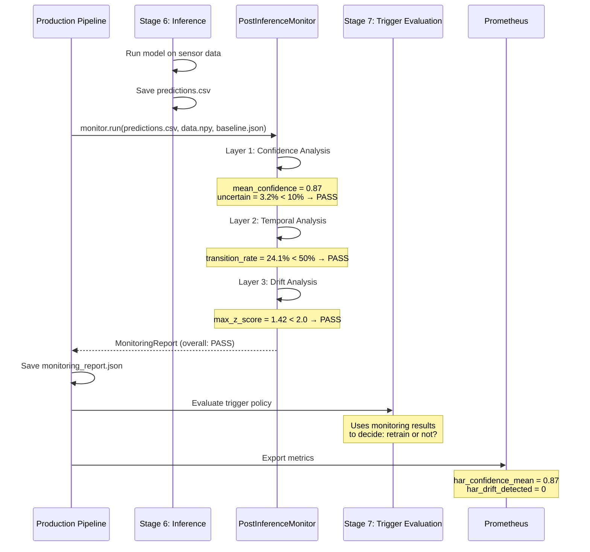
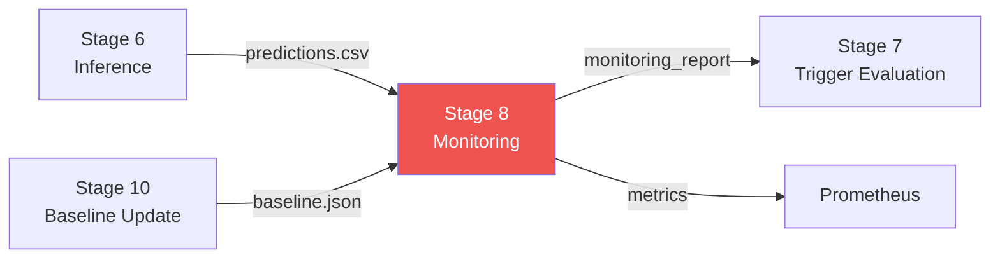

# Post-Inference Monitoring — 3-Layer Monitoring System

## What is Post-Inference Monitoring?

Post-inference monitoring means **checking the model's predictions AFTER they are made** to detect problems. The model might say "Walking" with 95% confidence, but is that confidence trustworthy? Is the data similar to what the model was trained on?

Think of it like a **3-layer security checkpoint** at an airport:
- **Layer 1 (Confidence Check)**: Is the passenger's ID valid? → Is the model confident enough?
- **Layer 2 (Temporal Check)**: Is the passenger's travel pattern normal? → Are predictions stable or oscillating?
- **Layer 3 (Drift Check)**: Does the passenger match the expected profile? → Does the new data look like training data?

If any layer flags a problem → an alert is raised and investigation begins.

---

## Why is Monitoring Important in MLOps?

Machine learning models can fail **silently** — they still produce predictions, but the predictions become less accurate over time. This happens because:

1. **Data drift**: The real-world data changes (new users, different phones, different activities)
2. **Concept drift**: The relationship between inputs and outputs changes
3. **Overconfidence**: The model is sure about wrong answers
4. **Noise**: Sensor data becomes noisy or corrupted

Without monitoring: "The model has been wrong 40% of the time for the past week, but it still outputs predictions, so nobody noticed."

With monitoring: "Layer 1 detected 23% uncertain predictions (threshold: 10%). Alert fired. Investigation started."

---

## How Monitoring is Used in This Thesis

The HAR pipeline has a dedicated `PostInferenceMonitor` class that runs **3 analysis layers** on every batch of predictions. It produces a `MonitoringReport` with pass/fail status for each layer.

### The 3 Layers

| Layer | Name | What It Checks | Alert Condition |
|-------|------|----------------|----------------|
| **Layer 1** | Confidence Analysis | Are predictions confident enough? | > 10% uncertain predictions |
| **Layer 2** | Temporal Analysis | Are prediction patterns stable? | > 50% transition rate (oscillating) |
| **Layer 3** | Drift Analysis | Is new data similar to training data? | Max z-score drift > 2.0 |

---

## Where Monitoring Appears in the Repository

```
MasterArbeit_MLops/
├── scripts/
│   └── post_inference_monitoring.py   ← Main monitoring module (392 lines)
├── src/
│   ├── components/
│   │   └── trigger_evaluation.py      ← Uses monitoring results for trigger decision
│   ├── prometheus_metrics.py          ← Exports monitoring metrics to Prometheus
│   └── api/
│       └── app.py                     ← Runs monitoring on every API request
├── config/
│   └── alerts/
│       └── har_alerts.yml             ← Alert rules based on monitoring metrics
└── outputs/
    └── monitoring/
        └── monitoring_report.json     ← Saved monitoring report
```

---

## Important Files Explained

### 1. Main Module: `scripts/post_inference_monitoring.py`

This 392-line file contains two classes: `MonitoringReport` and `PostInferenceMonitor`.

#### MonitoringReport (Data Container)

```python
class MonitoringReport:
    def __init__(self):
        self.overall_status = "PASS"      # PASS, WARNING, or ALERT
        self.layer1_confidence = {}        # Layer 1 results
        self.layer2_temporal = {}          # Layer 2 results
        self.layer3_drift = {}             # Layer 3 results
        self.alerts = []                   # List of alert messages
        self.metadata = {}                 # Extra info (prediction count, paths)
```

This is a simple container that **holds all monitoring results**. It can be serialized to JSON and saved to disk.

#### PostInferenceMonitor (Main Class)

```python
class PostInferenceMonitor:
    def __init__(
        self,
        confidence_threshold: float = 0.5,
        uncertain_threshold_pct: float = 10.0,
        drift_threshold: float = 2.0,
        calibration_temperature: float = 1.0,
    ):
```

| Parameter | Default | Meaning |
|-----------|---------|---------|
| `confidence_threshold` | 0.5 | Predictions below this confidence are "uncertain" |
| `uncertain_threshold_pct` | 10.0 | If more than 10% of predictions are uncertain → ALERT |
| `drift_threshold` | 2.0 | If z-score exceeds 2.0 standard deviations → ALERT |
| `calibration_temperature` | 1.0 | Temperature scaling from Stage 11 (1.0 = no adjustment) |

#### The `run()` Method

```python
def run(self, predictions_path, production_data_path=None, 
        baseline_path=None, model_path=None, output_dir=Path("outputs/monitoring")):
```

This is the **main entry point**. It:
1. Loads predictions from CSV
2. Applies temperature calibration (if T ≠ 1.0)
3. Runs Layer 1 (confidence)
4. Runs Layer 2 (temporal)
5. Runs Layer 3 (drift) — only if baseline exists
6. Determines overall status
7. Saves monitoring_report.json

---

### Layer 1: Confidence Analysis

```python
def _analyze_confidence(self, df):
    mean_conf = df['confidence'].mean()
    std_conf = df['confidence'].std()
    
    # Count uncertain predictions
    uncertain_count = (df['confidence'] < self.confidence_threshold).sum()
    uncertain_pct = 100 * uncertain_count / len(df)
    
    # Entropy approximation (K=11 HAR classes)
    K = 11
    confs = df['confidence'].clip(eps, 1.0 - eps).values
    entropy_vals = -(confs * np.log(confs) + (1 - confs) * np.log((1 - confs) / (K - 1) + eps))
    
    # Check threshold
    if uncertain_pct > self.uncertain_threshold_pct:  # > 10%
        results['status'] = 'ALERT'
    else:
        results['status'] = 'PASS'
```

**What it measures:**

| Metric | Formula | Meaning |
|--------|---------|---------|
| Mean confidence | Average of all prediction confidences | Overall model certainty |
| Uncertain % | (predictions < 0.5) / total × 100 | Proportion of low-confidence predictions |
| Entropy | -c·log(c) - (1-c)·log((1-c)/(K-1)) | How "spread out" the prediction is across 11 classes |

**When it alerts:**
- More than 10% of predictions have confidence below 0.5
- This suggests the model is unsure about too many predictions

#### Temperature Calibration

```python
if self.calibration_temperature != 1.0 and 'confidence' in predictions_df.columns:
    T = self.calibration_temperature
    p = predictions_df['confidence'].clip(1e-10, 1.0 - 1e-10).values
    p_cal = p ** (1.0 / T) / (p ** (1.0 / T) + (1.0 - p) ** (1.0 / T))
    predictions_df['confidence'] = p_cal
```

Temperature scaling adjusts overconfident predictions:
- T > 1.0 → sharpens (makes confident predictions even more confident)
- T < 1.0 → dampens (reduces overconfidence)
- T = 1.0 → no change (default)

This comes from Stage 11 (Calibration/Uncertainty) in the pipeline.

---

### Layer 2: Temporal Pattern Analysis

```python
def _analyze_temporal_patterns(self, df):
    activities = df['predicted_activity'].values
    transitions = np.sum(activities[1:] != activities[:-1])
    transition_rate = 100 * transitions / (len(activities) - 1)
    
    # Dwell time (window = 200 samples @ 25 Hz = 8 seconds)
    WINDOW_DURATION_SECS = 8.0
    SHORT_DWELL_WINDOWS = 2   # ≤ 2 windows (16 seconds) is "short"
    
    if transition_rate > 50:
        results['status'] = 'WARNING'
    else:
        results['status'] = 'PASS'
```

**What it measures:**

| Metric | Formula | Meaning |
|--------|---------|---------|
| Transition rate | (activity changes / total) × 100 | How often the activity label changes |
| Longest sequences | Max consecutive same activity | Stability of predictions |
| Mean dwell time | Average time in one activity (seconds) | How long before switching |
| Short dwell ratio | (short sequences / total) | Proportion of very brief activities |

**When it alerts:**
- Transition rate > 50% → "WARNING: High transition rate (possible noise)"
- This means the model is flipping between activities too rapidly (e.g., Walking → Sitting → Walking → Sitting every 8 seconds), which is physically unrealistic

**Physical context**: Each sensor window is 200 samples at 25 Hz = **8 seconds**. A person doesn't switch activities every 8 seconds in real life.

---

### Layer 3: Drift Analysis

```python
def _analyze_drift(self, production_data_path, baseline_path):
    production_data = np.load(production_data_path)   # .npy file
    with open(baseline_path, 'r') as f:
        baseline = json.load(f)                       # baseline stats JSON
    
    prod_mean = production_data.mean(axis=(0, 1))     # Average over windows + timesteps
    prod_std = production_data.std(axis=(0, 1))
    
    baseline_mean = np.array(baseline['mean'])
    baseline_std = np.array(baseline['std'])
    
    # Z-score drift: how many standard deviations away from baseline
    mean_diff = np.abs(prod_mean - baseline_mean) / (baseline_std + 1e-8)
    max_drift = float(np.max(mean_diff))
    
    if max_drift > self.drift_threshold:  # > 2.0
        results['status'] = 'ALERT'
    else:
        results['status'] = 'PASS'
```

**What it measures:**

| Metric | Formula | Meaning |
|--------|---------|---------|
| Z-score drift | \|prod_mean - baseline_mean\| / baseline_std | How far production data is from training data (in standard deviations) |
| Max drift | max(z-scores across 6 channels) | Worst-case channel drift |
| Drifted channels | Count where z > 1.0 | How many sensor channels have shifted |

**When it alerts:**
- Max z-score > 2.0 → "ALERT: Distribution drift detected"
- This means the sensor data patterns have significantly changed from what the model was trained on
- The 2.0 threshold follows the DDM approach (Gama et al., 2014) — 2σ covers ~95th percentile of the null distribution

**The 6 sensor channels**: acc_x, acc_y, acc_z (accelerometer) + gyro_x, gyro_y, gyro_z (gyroscope)

---

### Overall Status Determination

```python
def _determine_overall_status(self, report):
    alerts = []
    if report.layer1_confidence.get('status') == 'ALERT':
        alerts.append(report.layer1_confidence.get('alert'))
    if report.layer2_temporal.get('status') in ['ALERT', 'WARNING']:
        alerts.append(report.layer2_temporal.get('alert'))
    if report.layer3_drift.get('status') == 'ALERT':
        alerts.append(report.layer3_drift.get('alert'))
    
    report.alerts = alerts
    if alerts:
        return "ALERT"
    elif any_warning:
        return "WARNING"
    else:
        return "PASS"
```

The overall status is the **worst** status from all 3 layers:
- All PASS → **PASS** (everything is fine)
- Any WARNING → **WARNING** (investigate soon)
- Any ALERT → **ALERT** (take action now)

---

## How Monitoring Works — Visual Explanation

### 3-Layer Pipeline

```mermaid
graph TB
    Input[Predictions CSV<br/>confidence, predicted_activity]

    Input --> Cal{Temperature<br/>Calibration<br/>T ≠ 1.0?}
    Cal -->|Yes| Adjusted[Adjusted Confidences<br/>p^(1/T) rescaling]
    Cal -->|No| Raw[Raw Confidences]

    Adjusted --> L1[Layer 1: Confidence Analysis]
    Raw --> L1

    L1 --> L1R{Uncertain > 10%?}
    L1R -->|Yes| L1A[⚠️ ALERT<br/>High uncertainty rate]
    L1R -->|No| L1P[✅ PASS]

    Input --> L2[Layer 2: Temporal Analysis]
    L2 --> L2R{Transition rate > 50%?}
    L2R -->|Yes| L2W[⚠️ WARNING<br/>Possible noise]
    L2R -->|No| L2P[✅ PASS]

    subgraph "Requires Baseline"
        NPY[Production .npy data] --> L3[Layer 3: Drift Analysis]
        BAS[Baseline Stats JSON] --> L3
        L3 --> L3R{Max z-score > 2.0?}
        L3R -->|Yes| L3A[⚠️ ALERT<br/>Distribution drift]
        L3R -->|No| L3P[✅ PASS]
    end

    L1A --> Overall[Overall Status]
    L1P --> Overall
    L2W --> Overall
    L2P --> Overall
    L3A --> Overall
    L3P --> Overall

    Overall --> Report[monitoring_report.json<br/>PASS / WARNING / ALERT]

    style L1 fill:#42A5F5,color:white
    style L2 fill:#FFA726,color:white
    style L3 fill:#EF5350,color:white
    style Overall fill:#7B1FA2,color:white
```

### Integration with Pipeline



---

## Input and Output

### Input (What the Monitor Receives)

| Input | File Type | Content |
|-------|-----------|---------|
| Predictions CSV | `.csv` | Columns: predicted_activity, confidence, is_uncertain |
| Production data | `.npy` | Numpy array shape (N, 200, 6) — sensor windows |
| Baseline stats | `.json` | Training data mean/std per channel |
| Calibration temperature | Float | From Stage 11 (default: 1.0) |

### Output (What the Monitor Produces)

| Output | File | Content |
|--------|------|---------|
| Monitoring report | `outputs/monitoring/monitoring_report.json` | Full results from all 3 layers |
| Overall status | In report | PASS / WARNING / ALERT |
| Alert messages | In report | List of specific issues found |
| Prometheus metrics | Via MetricsExporter | har_confidence_mean, har_drift_detected, etc. |

---

## Pipeline Stage

Monitoring is **Stage 8** in the 14-stage pipeline, immediately after inference and trigger evaluation:



---

## Example: Monitoring Output

A typical `monitoring_report.json`:

```json
{
  "overall_status": "PASS",
  "layer1_confidence": {
    "mean_confidence": 0.872,
    "std_confidence": 0.145,
    "uncertain_count": 12,
    "uncertain_percentage": 3.2,
    "mean_entropy": 0.341,
    "status": "PASS"
  },
  "layer2_temporal": {
    "total_windows": 375,
    "transitions": 89,
    "transition_rate": 23.8,
    "mean_dwell_time_seconds": 33.6,
    "short_dwell_ratio": 0.12,
    "status": "PASS"
  },
  "layer3_drift": {
    "max_drift": 1.42,
    "n_drifted_channels": 1,
    "status": "PASS"
  },
  "alerts": [],
  "metadata": {
    "total_predictions": 375
  }
}
```

And an example when something goes wrong:

```json
{
  "overall_status": "ALERT",
  "layer1_confidence": {
    "mean_confidence": 0.541,
    "uncertain_count": 87,
    "uncertain_percentage": 23.2,
    "status": "ALERT",
    "alert": "High uncertainty rate: 23.2% > 10.0%"
  },
  "layer3_drift": {
    "max_drift": 3.71,
    "n_drifted_channels": 4,
    "status": "ALERT",
    "alert": "Distribution drift detected: 3.71 > 2.0"
  },
  "alerts": [
    "High uncertainty rate: 23.2% > 10.0%",
    "Distribution drift detected: 3.71 > 2.0"
  ]
}
```

---

## Role in the Master's Thesis

| Thesis Aspect | How Monitoring Contributes |
|---------------|--------------------------|
| **Chapter: Monitoring** | Central topic — 3-layer system is the core monitoring innovation |
| **Chapter: Architecture** | Monitoring is Stage 8 in the pipeline, connecting inference to trigger evaluation |
| **Chapter: Methodology** | Documents statistical methods: z-score drift, entropy, calibration, dwell-time analysis |
| **Chapter: Evaluation** | Monitoring results prove the system can detect model degradation |
| **Chapter: MLOps Maturity** | Automated monitoring with alerting = Level 2 MLOps capability |
| **Academic References** | Gama et al. 2014 (DDM), Page 1954 (CUSUM) for drift detection thresholds |

---

## Summary Reference

| Property | Value |
|----------|-------|
| **System** | 3-layer post-inference monitoring |
| **Main File** | `scripts/post_inference_monitoring.py` (392 lines) |
| **Classes** | `MonitoringReport`, `PostInferenceMonitor` |
| **Layer 1** | Confidence analysis (threshold: 50% confidence, 10% uncertain limit) |
| **Layer 2** | Temporal analysis (transition rate, dwell time, 8s windows) |
| **Layer 3** | Drift analysis (z-score, threshold: 2.0σ, 6 sensor channels) |
| **Calibration** | Temperature scaling from Stage 11 |
| **Output** | `outputs/monitoring/monitoring_report.json` |
| **Pipeline Stage** | Stage 8 |
| **Status Values** | PASS, WARNING, ALERT |
| **Connected to** | Prometheus (metrics export), Trigger Evaluation (retrain decision) |
