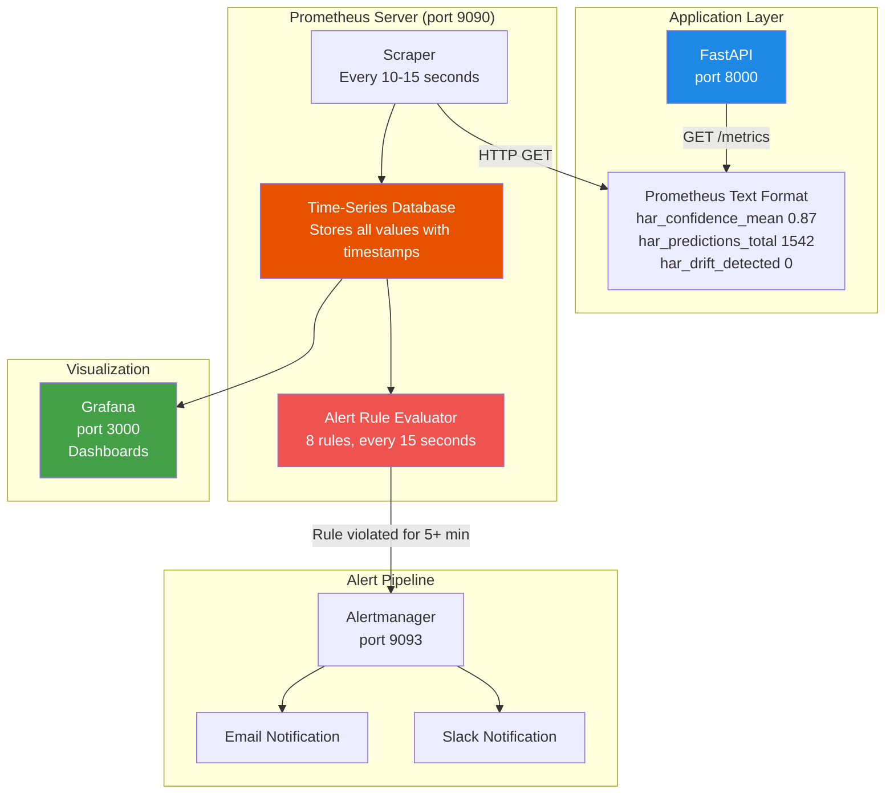
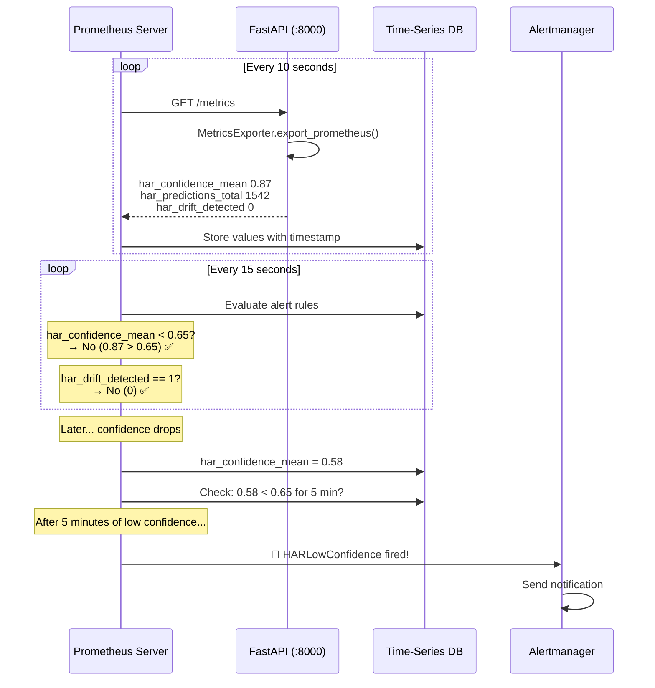
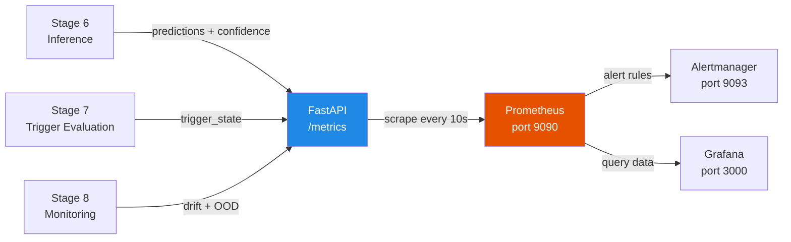

# Prometheus — Metrics Collection & Alerting

## What is Prometheus?

Prometheus is a tool that **collects numbers from your application** at regular intervals and stores them as time-series data. It then **watches those numbers** and sends alerts when something goes wrong.

Think of it like a **hospital patient monitor**:
- The monitor checks your heart rate, blood pressure, and oxygen every few seconds
- It shows the numbers on a screen (time-series data)
- If your heart rate goes too high or too low → alarm rings (alert)
- Doctors can look at the history to see trends (graphs)

In our HAR pipeline:
- Prometheus checks model confidence, drift, latency every 10-15 seconds
- If confidence drops below 0.65 → alert fires
- If no requests come for 10 minutes → critical alert

---

## Why is Prometheus Important in MLOps?

Machine learning models can **silently degrade** in production:
- The data distribution shifts (new user behavior)
- Model confidence drops but nobody notices
- Predictions become unreliable but there's no error message

Prometheus solves this by:
1. **Scraping** metrics from the API every 10 seconds
2. **Storing** all values with timestamps (time-series database)
3. **Evaluating** alert rules against the data
4. **Firing** alerts via Alertmanager when thresholds are breached

Without monitoring: "The model has been giving bad predictions for 3 days and nobody noticed."
With Prometheus: "Alert fired 5 minutes after model confidence dropped below 0.65."

---

## How Prometheus is Used in This Thesis

The HAR pipeline exposes metrics through two mechanisms:
1. **FastAPI `/metrics` endpoint** (`src/api/app.py`) — the live API exposes Prometheus-format metrics
2. **MetricsExporter class** (`src/prometheus_metrics.py`) — defines all metrics and formats them

Prometheus scrapes these endpoints and evaluates 8 alert rules defined in `config/alerts/har_alerts.yml`.

---

## Where Prometheus Appears in the Repository

```
MasterArbeit_MLops/
├── src/
│   ├── prometheus_metrics.py       ← Metric definitions + exporter (584 lines)
│   └── api/
│       └── app.py                  ← Exposes /metrics endpoint
├── config/
│   ├── prometheus.yml              ← Prometheus server config (scrape targets)
│   └── alerts/
│       ├── har_alerts.yml          ← 8 live alert rules (145 lines)
│       └── har_alerts_pending.yml  ← Future alert rules (173 lines)
└── docker-compose.yml              ← Prometheus service on port 9090
```

---

## Important Files Explained

### 1. Metric Definitions: `src/prometheus_metrics.py`

This file defines **all the numbers Prometheus collects**. It has 584 lines and contains two main classes.

#### MetricDefinition (Data Class)

```python
@dataclass
class MetricDefinition:
    name: str           # Metric name (e.g., "har_model_f1_score")
    type: str           # counter, gauge, histogram, or summary
    help: str           # Description of what this metric measures
    labels: List[str]   # Optional labels for grouping
    buckets: List[float] # Optional buckets for histograms
```

| Metric Type | Analogy | Behavior |
|-------------|---------|----------|
| **Counter** | Car odometer | Only goes up (e.g., total predictions made) |
| **Gauge** | Thermometer | Goes up and down (e.g., current confidence) |
| **Histogram** | Bucket sort | Groups values into ranges (e.g., latency distribution) |

#### All Metrics Defined

The file defines 16 metrics in the `METRIC_DEFINITIONS` dictionary:

| Metric Name | Type | What It Measures |
|------------|------|-----------------|
| `har_model_f1_score` | gauge | Current model F1 score (macro-averaged) |
| `har_model_accuracy` | gauge | Current model accuracy |
| `har_predictions_total` | counter | Total predictions made (per activity class) |
| `har_drift_psi` | gauge | Population Stability Index (per feature) |
| `har_drift_ks_stat` | gauge | Kolmogorov-Smirnov statistic (per feature) |
| `har_drift_detected` | gauge | Binary drift indicator (0=no, 1=yes) |
| `har_confidence_mean` | gauge | Mean prediction confidence in current window |
| `har_confidence_histogram` | histogram | Distribution of confidences (buckets: 0.5–0.99) |
| `har_entropy_mean` | gauge | Mean prediction entropy |
| `har_flip_rate` | gauge | Rate of activity prediction changes |
| `har_ood_ratio` | gauge | Ratio of out-of-distribution samples |
| `har_energy_score_mean` | gauge | Mean energy score (OOD indicator) |
| `har_trigger_state` | gauge | Trigger state (0=normal, 1=warning, 2=triggered) |
| `har_consecutive_warnings` | gauge | Number of consecutive warning states |
| `har_retraining_triggered_total` | counter | Total retraining triggers |
| `har_inference_latency_seconds` | histogram | Inference latency distribution |

#### MetricsExporter (Singleton Class)

```python
class MetricsExporter:
    _instance = None  # Singleton — only one instance exists

    def __init__(self):
        self._metrics: Dict[str, MetricValue] = {}
        for name, definition in METRIC_DEFINITIONS.items():
            self._metrics[name] = MetricValue(definition.type, definition.buckets)
```

The exporter is a **singleton** — the entire application shares one instance. This ensures all metrics are in one place.

#### Recording Methods

```python
def record_prediction(self, activity_class, confidence, latency_seconds):
    self._metrics["har_predictions_total"].inc(labels=(str(activity_class),))
    self._metrics["har_confidence_histogram"].observe(confidence)
    self._metrics["har_inference_latency_seconds"].observe(latency_seconds)

def record_batch_metrics(self, mean_confidence, mean_entropy, flip_rate, ...):
    self._metrics["har_confidence_mean"].set(mean_confidence)
    self._metrics["har_entropy_mean"].set(mean_entropy)
    self._metrics["har_flip_rate"].set(flip_rate)

def record_drift_metrics(self, psi_values, ks_values, drift_detected):
    for feature, psi in psi_values.items():
        self._metrics["har_drift_psi"].set(psi, labels=(feature,))
    self._metrics["har_drift_detected"].set(1.0 if drift_detected else 0.0)

def record_model_metrics(self, f1_score, accuracy, model_version="current"):
    self._metrics["har_model_f1_score"].set(f1_score, labels=(model_version, "all"))
    self._metrics["har_model_accuracy"].set(accuracy, labels=(model_version,))
```

Each method updates specific metrics internally. When Prometheus scrapes `/metrics`, all values are exported in Prometheus text format.

#### Prometheus Text Format Export

```python
def export_prometheus(self) -> str:
    lines = []
    for name, definition in METRIC_DEFINITIONS.items():
        metric = self._metrics.get(name)
        if metric:
            lines.append(metric.get_prometheus_format(definition))
    return "\n".join(lines)
```

Output looks like:
```
# HELP har_model_f1_score Current model F1 score (macro-averaged)
# TYPE har_model_f1_score gauge
har_model_f1_score{model_version="current",fold="all"} 0.948

# HELP har_confidence_mean Mean prediction confidence in current window
# TYPE har_confidence_mean gauge
har_confidence_mean 0.872

# HELP har_predictions_total Total number of predictions made
# TYPE har_predictions_total counter
har_predictions_total{activity_class="0"} 142
har_predictions_total{activity_class="1"} 89
```

---

### 2. Prometheus Server Config: `config/prometheus.yml`

This file tells the Prometheus **server** where to collect metrics from.

```yaml
global:
  scrape_interval: 15s
  evaluation_interval: 15s
  external_labels:
    monitor: 'har_mlops'
    environment: 'production'
```

| Line | What It Means |
|------|--------------|
| `scrape_interval: 15s` | Collect metrics from all targets every 15 seconds |
| `evaluation_interval: 15s` | Check alert rules every 15 seconds |
| `monitor: 'har_mlops'` | Label all data with this project name |

```yaml
alerting:
  alertmanagers:
    - static_configs:
        - targets:
          - alertmanager:9093
```

When an alert fires, Prometheus sends it to **Alertmanager** on port 9093. Alertmanager can then send emails, Slack messages, etc.

```yaml
rule_files:
  - "alerts/har_alerts.yml"
```

Load alert rules from this file (8 rules).

#### Scrape Targets

```yaml
scrape_configs:
  - job_name: 'prometheus'
    static_configs:
      - targets: ['localhost:9090']

  - job_name: 'har_inference'
    static_configs:
      - targets: ['inference:8000']
    metrics_path: '/metrics'
    scrape_interval: 10s

  - job_name: 'har_training'
    static_configs:
      - targets: ['training:8001']
    scrape_interval: 30s

  - job_name: 'har_monitoring'
    static_configs:
      - targets: ['inference:8002']

  - job_name: 'node'
    static_configs:
      - targets: ['localhost:9100']

  - job_name: 'cadvisor'
    static_configs:
      - targets: ['localhost:8080']
```

| Target | Port | What It Monitors |
|--------|------|-----------------|
| `prometheus` | 9090 | Prometheus's own health |
| `har_inference` | 8000 | The FastAPI inference service (10s interval) |
| `har_training` | 8001 | Training pipeline metrics (30s interval) |
| `har_monitoring` | 8002 | Monitoring service metrics |
| `node` | 9100 | System metrics (CPU, RAM, disk) |
| `cadvisor` | 8080 | Docker container metrics |

---

### 3. Alert Rules: `config/alerts/har_alerts.yml`

This file defines **8 alert rules** organized in **4 groups**:

#### Group 1: Model Health

```yaml
- alert: HARLowConfidence
  expr: har_confidence_mean < 0.65
  for: 5m
  labels:
    severity: warning
  annotations:
    summary: "HAR model confidence is low"
```

| Field | Meaning |
|-------|---------|
| `expr: har_confidence_mean < 0.65` | Fires when average confidence drops below 65% |
| `for: 5m` | Only fires if the condition persists for 5 minutes (not just a spike) |
| `severity: warning` | Warning level (not critical) |

#### All 8 Alert Rules

| Alert Name | Expression | Duration | Severity | Meaning |
|-----------|-----------|----------|----------|---------|
| `HARLowConfidence` | `har_confidence_mean < 0.65` | 5m | warning | Model is uncertain |
| `HARHighEntropy` | `har_entropy_mean > 1.8` | 5m | warning | Model confused across classes |
| `HARHighFlipRate` | `har_flip_rate > 0.25` | 10m | warning | Predictions oscillating |
| `HARDriftDetected` | `har_drift_detected == 1` | 5m | warning | Data distribution shifted |
| `HARHighLatency` | p95 latency > 500ms | 5m | warning | Inference too slow |
| `HARNoPredictions` | request rate == 0 | 10m | critical | Service may be down |
| `HARStaleDriftBaseline` | baseline > 90 days old | 1h | warning | Need fresh baseline |
| `HARMissingDriftBaseline` | baseline file missing | 5m | critical | Drift check disabled |

#### Threshold Alignment

The alert thresholds align with the pipeline's configuration:

```
confidence_warn_threshold = 0.60  (PostInferenceMonitoringConfig)
trigger confidence_warn   = 0.65  (TriggerEvaluationConfig — Prometheus uses this)
entropy_warn              = 1.8   (TriggerThresholds)
flip_rate_warn            = 0.25  (TriggerThresholds)
baseline_max_age_days     = 90    (PostInferenceMonitoringConfig)
```

---

## How Prometheus Works — Visual Explanation

### Data Flow Architecture



### Scrape Cycle



---

## Input and Output

### Input (What Prometheus Collects)

| Source | Port | Metrics Collected |
|--------|------|-------------------|
| FastAPI inference | 8000 | Confidence, entropy, flip rate, drift, latency, predictions |
| Training pipeline | 8001 | Training progress metrics |
| Monitoring service | 8002 | Monitoring health |
| Node exporter | 9100 | CPU, RAM, disk usage |
| cAdvisor | 8080 | Docker container resource usage |

### Output (What Prometheus Produces)

| Output | Destination | Description |
|--------|-------------|-------------|
| Time-series data | Internal TSDB | All metrics with timestamps (queryable via PromQL) |
| Alert notifications | Alertmanager → Email/Slack | When rules are violated |
| Query API | Grafana (port 3000) | Data for dashboard visualizations |
| Web UI | `http://localhost:9090` | Built-in query interface |

---

## Pipeline Stage

Prometheus monitors the **entire pipeline** but is especially connected to Stages 6, 7, and 8:



---

## Role in the Master's Thesis

| Thesis Aspect | How Prometheus Contributes |
|---------------|--------------------------|
| **Chapter: Monitoring** | Core monitoring infrastructure — collects all model health metrics |
| **Chapter: Architecture** | Part of the observability stack (Prometheus + Grafana + Alertmanager) |
| **Chapter: Alert System** | 8 alert rules covering confidence, drift, latency, service health |
| **Chapter: MLOps Maturity** | Production-grade monitoring — Level 2 MLOps capability |
| **Chapter: Evaluation** | Time-series data enables analysis of model performance over time |

---

## Summary Reference

| Property | Value |
|----------|-------|
| **Technology** | Prometheus (open-source, CNCF project) |
| **Main File** | `src/prometheus_metrics.py` (584 lines) |
| **Config File** | `config/prometheus.yml` |
| **Alert Rules** | `config/alerts/har_alerts.yml` (8 rules, 4 groups) |
| **Pending Rules** | `config/alerts/har_alerts_pending.yml` (future metrics) |
| **Port** | 9090 (Prometheus server) |
| **Scrape Interval** | 10s (inference), 15s (default), 30s (training) |
| **Total Metrics** | 16 metric definitions |
| **Alert Count** | 8 live rules |
| **Core Classes** | `MetricDefinition`, `MetricsExporter`, `MetricValue` |
| **Export Format** | Prometheus text exposition format |
| **Docker Service** | `prometheus` in docker-compose.yml |
