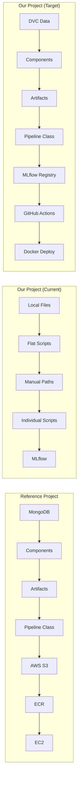

# 📚 Learnings from Reference MLOps Project

> **Reference Repository:** [vikashishere/YT-MLops-Proj1](https://github.com/vikashishere/YT-MLops-Proj1)  
> **Analysis Date:** December 17, 2025  
> **Purpose:** Extract best practices and improvements for our HAR MLOps pipeline

---

## 📊 Executive Summary

The reference project is a **production-grade MLOps pipeline** for vehicle insurance prediction. It demonstrates several **industry best practices** that we can adopt to upgrade our current HAR (Human Activity Recognition) pipeline for mental health monitoring.

### Key Takeaways

| Aspect | Reference Project | Our Current Project | Improvement Opportunity |
|--------|------------------|---------------------|------------------------|
| **Project Structure** | Modular with `components/`, `entity/`, `pipline/` | Flat `src/` folder | 🔴 High - Restructure |
| **Config Management** | `@dataclass` config entities | YAML + hardcoded values | 🟡 Medium - Add dataclasses |
| **Artifact Tracking** | `ArtifactEntity` classes | Manual file paths | 🔴 High - Add artifacts |
| **Pipeline Orchestration** | `TrainPipeline` class | Individual scripts | 🔴 High - Add pipeline class |
| **Exception Handling** | Custom `MyException` class | Standard exceptions | 🟡 Medium - Custom exceptions |
| **Cloud Integration** | AWS S3 + ECR | Local only | 🟢 Optional - Add cloud |
| **CI/CD** | GitHub Actions + EC2 | ❌ Not implemented | 🔴 High - Critical gap |
| **Model Registry** | S3-based registry | MLflow Model Registry | ✅ We're better |
| **Data Validation** | Schema-based validation | Basic checks | 🟡 Medium - Add schema |
| **Logging** | Structured logging module | Basic Python logging | 🟡 Medium - Improve |

---

## 🏗️ Architecture Improvements to Adopt

### 1. Modular Component Structure

**Reference Project Structure:**
```
src/
├── components/
│   ├── __init__.py
│   ├── data_ingestion.py
│   ├── data_validation.py
│   ├── data_transformation.py
│   ├── model_trainer.py
│   ├── model_evaluation.py
│   └── model_pusher.py
├── entity/
│   ├── __init__.py
│   ├── config_entity.py      # @dataclass configs
│   ├── artifact_entity.py    # @dataclass artifacts
│   ├── estimator.py          # Model wrapper
│   └── s3_estimator.py       # Cloud model wrapper
├── pipline/
│   ├── __init__.py
│   ├── training_pipeline.py
│   └── prediction_pipeline.py
├── configuration/
│   ├── mongo_db_connection.py
│   └── aws_connection.py
├── constants/
│   └── __init__.py
├── exception/
│   └── __init__.py
├── logger/
│   └── __init__.py
└── utils/
    └── main_utils.py
```

**Recommendation for Our Project:**
```
src/
├── components/                    # 🆕 NEW - Pipeline components
│   ├── __init__.py
│   ├── data_ingestion.py         # Extract from sensor_data_pipeline.py
│   ├── data_validation.py        # Extract from data_validator.py
│   ├── data_transformation.py    # Extract from preprocess_data.py
│   ├── model_inference.py        # Extract from run_inference.py
│   ├── model_evaluation.py       # Extract from evaluate_predictions.py
│   └── drift_detection.py        # 🆕 NEW component
├── entity/                        # 🆕 NEW - Data classes
│   ├── __init__.py
│   ├── config_entity.py          # All @dataclass configs
│   └── artifact_entity.py        # All @dataclass artifacts
├── pipeline/                      # 🆕 NEW - Pipeline orchestration
│   ├── __init__.py
│   ├── inference_pipeline.py     # Main inference orchestration
│   └── evaluation_pipeline.py    # Evaluation orchestration
├── core/                          # 🆕 NEW - Core utilities
│   ├── __init__.py
│   ├── exception.py              # Custom exception class
│   ├── logger.py                 # Structured logging
│   └── constants.py              # All constants
├── utils/                         # 🆕 NEW - Utility functions
│   └── main_utils.py
├── config.py                      # Keep existing
├── mlflow_tracking.py            # Keep existing
└── compare_data.py               # Keep existing
```

---

### 2. Entity Pattern with Dataclasses

**Reference Implementation:**
```python
# src/entity/config_entity.py
from dataclasses import dataclass
import os

@dataclass
class TrainingPipelineConfig:
    pipeline_name: str = "har_pipeline"
    artifact_dir: str = os.path.join("artifacts", TIMESTAMP)
    timestamp: str = TIMESTAMP

@dataclass
class DataIngestionConfig:
    data_ingestion_dir: str = os.path.join(training_pipeline_config.artifact_dir, "data_ingestion")
    raw_data_path: str = os.path.join(data_ingestion_dir, "raw")
    feature_store_path: str = os.path.join(data_ingestion_dir, "feature_store")
    train_test_split_ratio: float = 0.2
```

**How to Apply to Our Project:**

Create `src/entity/config_entity.py`:
```python
"""
Configuration entities for HAR MLOps Pipeline.
Inspired by: vikashishere/YT-MLops-Proj1
"""
from dataclasses import dataclass
from datetime import datetime
import os

TIMESTAMP: str = datetime.now().strftime("%Y%m%d_%H%M%S")


@dataclass
class PipelineConfig:
    """Master pipeline configuration."""
    pipeline_name: str = "har_mental_health_pipeline"
    artifact_dir: str = os.path.join("artifacts", TIMESTAMP)
    timestamp: str = TIMESTAMP


pipeline_config = PipelineConfig()


@dataclass
class DataIngestionConfig:
    """Configuration for data ingestion component."""
    data_ingestion_dir: str = os.path.join(pipeline_config.artifact_dir, "data_ingestion")
    raw_data_dir: str = "data/raw"
    processed_data_dir: str = os.path.join(data_ingestion_dir, "processed")
    feature_store_path: str = os.path.join(data_ingestion_dir, "feature_store", "sensor_data.csv")


@dataclass
class PreprocessingConfig:
    """Configuration for preprocessing component."""
    preprocessing_dir: str = os.path.join(pipeline_config.artifact_dir, "preprocessing")
    window_size: int = 200
    overlap: float = 0.5
    target_frequency: int = 50
    sensors: tuple = ("Ax", "Ay", "Az", "Gx", "Gy", "Gz")
    calibration_offset_az: float = -6.295
    unit_conversion_factor: float = 0.00981


@dataclass
class InferenceConfig:
    """Configuration for inference component."""
    inference_dir: str = os.path.join(pipeline_config.artifact_dir, "inference")
    model_path: str = "models/pretrained/fine_tuned_model_1dcnnbilstm.keras"
    batch_size: int = 32
    confidence_threshold: float = 0.5


@dataclass
class EvaluationConfig:
    """Configuration for evaluation component."""
    evaluation_dir: str = os.path.join(pipeline_config.artifact_dir, "evaluation")
    metrics_file: str = os.path.join(evaluation_dir, "metrics.json")
    confusion_matrix_path: str = os.path.join(evaluation_dir, "confusion_matrix.png")
    expected_accuracy: float = 0.85


@dataclass
class DriftDetectionConfig:
    """Configuration for drift detection component."""
    drift_dir: str = os.path.join(pipeline_config.artifact_dir, "drift_detection")
    reference_stats_path: str = "data/prepared/reference_stats.json"
    ks_threshold: float = 0.05
    wasserstein_threshold: float = 0.5
    alert_on_drift: bool = True
```

Create `src/entity/artifact_entity.py`:
```python
"""
Artifact entities for HAR MLOps Pipeline.
Each component produces artifacts that are passed to the next component.
"""
from dataclasses import dataclass
from typing import Optional


@dataclass
class DataIngestionArtifact:
    """Output artifact from data ingestion."""
    raw_data_path: str
    processed_data_path: str
    n_samples: int
    n_users: int
    ingestion_timestamp: str


@dataclass
class PreprocessingArtifact:
    """Output artifact from preprocessing."""
    windowed_data_path: str
    n_windows: int
    window_size: int
    scaler_path: str
    preprocessing_timestamp: str


@dataclass
class InferenceArtifact:
    """Output artifact from inference."""
    predictions_path: str
    probabilities_path: str
    n_predictions: int
    inference_time_ms: float
    model_version: str


@dataclass
class MetricsArtifact:
    """Classification metrics artifact."""
    accuracy: float
    f1_macro: float
    f1_weighted: float
    precision_macro: float
    recall_macro: float


@dataclass
class EvaluationArtifact:
    """Output artifact from evaluation."""
    metrics: MetricsArtifact
    confusion_matrix_path: str
    classification_report_path: str
    is_model_acceptable: bool
    evaluation_timestamp: str


@dataclass
class DriftDetectionArtifact:
    """Output artifact from drift detection."""
    drift_detected: bool
    sensors_with_drift: int
    drift_report_path: str
    should_retrain: bool
    detection_timestamp: str
```

---

### 3. Pipeline Orchestration Class

**Reference Implementation:**
```python
# Reference: src/pipline/training_pipeline.py
class TrainPipeline:
    def __init__(self):
        self.data_ingestion_config = DataIngestionConfig()
        self.data_validation_config = DataValidationConfig()
        # ... more configs

    def start_data_ingestion(self) -> DataIngestionArtifact:
        """Start data ingestion component."""
        pass
    
    def start_data_validation(self, artifact) -> DataValidationArtifact:
        """Start data validation component."""
        pass
    
    def run_pipeline(self) -> None:
        """Run complete pipeline."""
        data_ingestion_artifact = self.start_data_ingestion()
        data_validation_artifact = self.start_data_validation(data_ingestion_artifact)
        # ... chain components
```

**How to Apply to Our Project:**

Create `src/pipeline/inference_pipeline.py`:
```python
"""
Inference Pipeline Orchestrator for HAR Mental Health Monitoring.
Chains all components together with artifact passing.
Inspired by: vikashishere/YT-MLops-Proj1
"""
import sys
from src.core.exception import PipelineException
from src.core.logger import logging

from src.components.data_ingestion import DataIngestion
from src.components.data_validation import DataValidation  
from src.components.data_transformation import DataTransformation
from src.components.model_inference import ModelInference
from src.components.model_evaluation import ModelEvaluation
from src.components.drift_detection import DriftDetection

from src.entity.config_entity import (
    DataIngestionConfig,
    PreprocessingConfig,
    InferenceConfig,
    EvaluationConfig,
    DriftDetectionConfig
)
from src.entity.artifact_entity import (
    DataIngestionArtifact,
    PreprocessingArtifact,
    InferenceArtifact,
    EvaluationArtifact,
    DriftDetectionArtifact
)


class InferencePipeline:
    """
    Main inference pipeline that orchestrates all components.
    
    Pipeline Flow:
    1. Data Ingestion → Load raw sensor data
    2. Data Validation → Validate schema and quality
    3. Data Transformation → Preprocess and window
    4. Drift Detection → Check for distribution shift
    5. Model Inference → Run predictions
    6. Model Evaluation → Compute metrics
    """
    
    def __init__(self):
        self.data_ingestion_config = DataIngestionConfig()
        self.preprocessing_config = PreprocessingConfig()
        self.inference_config = InferenceConfig()
        self.evaluation_config = EvaluationConfig()
        self.drift_config = DriftDetectionConfig()
    
    def start_data_ingestion(self) -> DataIngestionArtifact:
        """
        Start data ingestion component.
        
        Returns:
            DataIngestionArtifact: Paths to ingested data
        """
        logging.info("=" * 60)
        logging.info("Starting Data Ingestion Component")
        logging.info("=" * 60)
        
        try:
            data_ingestion = DataIngestion(
                config=self.data_ingestion_config
            )
            artifact = data_ingestion.initiate_data_ingestion()
            
            logging.info(f"Data Ingestion Complete: {artifact.n_samples} samples")
            return artifact
            
        except Exception as e:
            raise PipelineException(e, sys) from e
    
    def start_data_transformation(
        self, 
        ingestion_artifact: DataIngestionArtifact
    ) -> PreprocessingArtifact:
        """
        Start data transformation component.
        
        Args:
            ingestion_artifact: Output from data ingestion
            
        Returns:
            PreprocessingArtifact: Paths to transformed data
        """
        logging.info("=" * 60)
        logging.info("Starting Data Transformation Component")
        logging.info("=" * 60)
        
        try:
            transformation = DataTransformation(
                config=self.preprocessing_config,
                ingestion_artifact=ingestion_artifact
            )
            artifact = transformation.initiate_data_transformation()
            
            logging.info(f"Transformation Complete: {artifact.n_windows} windows")
            return artifact
            
        except Exception as e:
            raise PipelineException(e, sys) from e
    
    def start_drift_detection(
        self,
        preprocessing_artifact: PreprocessingArtifact
    ) -> DriftDetectionArtifact:
        """
        Start drift detection component.
        
        Args:
            preprocessing_artifact: Output from preprocessing
            
        Returns:
            DriftDetectionArtifact: Drift detection results
        """
        logging.info("=" * 60)
        logging.info("Starting Drift Detection Component")
        logging.info("=" * 60)
        
        try:
            drift_detector = DriftDetection(
                config=self.drift_config,
                preprocessing_artifact=preprocessing_artifact
            )
            artifact = drift_detector.initiate_drift_detection()
            
            if artifact.drift_detected:
                logging.warning(f"⚠️ DRIFT DETECTED in {artifact.sensors_with_drift} sensors!")
            else:
                logging.info("✅ No significant drift detected")
            
            return artifact
            
        except Exception as e:
            raise PipelineException(e, sys) from e
    
    def start_model_inference(
        self,
        preprocessing_artifact: PreprocessingArtifact,
        drift_artifact: DriftDetectionArtifact
    ) -> InferenceArtifact:
        """
        Start model inference component.
        
        Args:
            preprocessing_artifact: Output from preprocessing
            drift_artifact: Output from drift detection
            
        Returns:
            InferenceArtifact: Prediction results
        """
        logging.info("=" * 60)
        logging.info("Starting Model Inference Component")
        logging.info("=" * 60)
        
        # Check if we should proceed with inference
        if drift_artifact.should_retrain:
            logging.warning("⚠️ Significant drift detected. Consider retraining before inference.")
        
        try:
            inference = ModelInference(
                config=self.inference_config,
                preprocessing_artifact=preprocessing_artifact
            )
            artifact = inference.initiate_inference()
            
            logging.info(f"Inference Complete: {artifact.n_predictions} predictions in {artifact.inference_time_ms:.2f}ms")
            return artifact
            
        except Exception as e:
            raise PipelineException(e, sys) from e
    
    def start_model_evaluation(
        self,
        inference_artifact: InferenceArtifact
    ) -> EvaluationArtifact:
        """
        Start model evaluation component.
        
        Args:
            inference_artifact: Output from inference
            
        Returns:
            EvaluationArtifact: Evaluation metrics
        """
        logging.info("=" * 60)
        logging.info("Starting Model Evaluation Component")
        logging.info("=" * 60)
        
        try:
            evaluation = ModelEvaluation(
                config=self.evaluation_config,
                inference_artifact=inference_artifact
            )
            artifact = evaluation.initiate_evaluation()
            
            logging.info(f"Evaluation Complete:")
            logging.info(f"  Accuracy: {artifact.metrics.accuracy:.4f}")
            logging.info(f"  F1 Macro: {artifact.metrics.f1_macro:.4f}")
            
            return artifact
            
        except Exception as e:
            raise PipelineException(e, sys) from e
    
    def run_pipeline(self) -> dict:
        """
        Run the complete inference pipeline.
        
        Returns:
            dict: All artifacts from the pipeline run
        """
        logging.info("=" * 80)
        logging.info("🚀 STARTING HAR INFERENCE PIPELINE")
        logging.info("=" * 80)
        
        try:
            # Step 1: Data Ingestion
            ingestion_artifact = self.start_data_ingestion()
            
            # Step 2: Data Transformation
            preprocessing_artifact = self.start_data_transformation(ingestion_artifact)
            
            # Step 3: Drift Detection
            drift_artifact = self.start_drift_detection(preprocessing_artifact)
            
            # Step 4: Model Inference
            inference_artifact = self.start_model_inference(
                preprocessing_artifact, 
                drift_artifact
            )
            
            # Step 5: Model Evaluation
            evaluation_artifact = self.start_model_evaluation(inference_artifact)
            
            logging.info("=" * 80)
            logging.info("✅ PIPELINE COMPLETED SUCCESSFULLY")
            logging.info("=" * 80)
            
            return {
                "ingestion": ingestion_artifact,
                "preprocessing": preprocessing_artifact,
                "drift": drift_artifact,
                "inference": inference_artifact,
                "evaluation": evaluation_artifact
            }
            
        except Exception as e:
            logging.error("❌ PIPELINE FAILED")
            raise PipelineException(e, sys) from e


# Entry point
if __name__ == "__main__":
    pipeline = InferencePipeline()
    artifacts = pipeline.run_pipeline()
```

---

### 4. Custom Exception Handling

**Reference Implementation:**
```python
# Reference: src/exception/__init__.py
import sys

class MyException(Exception):
    def __init__(self, error_message: Exception, error_detail: sys):
        super().__init__(error_message)
        self.error_message = self._get_detailed_error_message(error_message, error_detail)
    
    @staticmethod
    def _get_detailed_error_message(error, error_detail):
        _, _, exc_tb = error_detail.exc_info()
        file_name = exc_tb.tb_frame.f_code.co_filename
        line_number = exc_tb.tb_lineno
        return f"Error in [{file_name}] at line [{line_number}]: {error}"
```

**How to Apply to Our Project:**

Create `src/core/exception.py`:
```python
"""
Custom Exception Handler for HAR MLOps Pipeline.
Provides detailed error messages with file and line information.
"""
import sys
from typing import Optional


class PipelineException(Exception):
    """
    Custom exception for HAR pipeline with detailed error tracking.
    
    Inspired by: vikashishere/YT-MLops-Proj1
    """
    
    def __init__(
        self, 
        error_message: Exception, 
        error_detail: sys,
        component: Optional[str] = None
    ):
        """
        Initialize custom exception.
        
        Args:
            error_message: Original exception
            error_detail: sys module for traceback
            component: Optional component name where error occurred
        """
        super().__init__(str(error_message))
        self.error_message = self._format_error(error_message, error_detail, component)
    
    @staticmethod
    def _format_error(
        error: Exception, 
        error_detail: sys,
        component: Optional[str] = None
    ) -> str:
        """Format detailed error message."""
        _, _, exc_tb = error_detail.exc_info()
        
        if exc_tb is None:
            return str(error)
        
        file_name = exc_tb.tb_frame.f_code.co_filename
        line_number = exc_tb.tb_lineno
        
        component_info = f"[{component}] " if component else ""
        
        return (
            f"\n{'='*60}\n"
            f"❌ PIPELINE ERROR {component_info}\n"
            f"{'='*60}\n"
            f"📁 File: {file_name}\n"
            f"📍 Line: {line_number}\n"
            f"💬 Error: {error}\n"
            f"{'='*60}"
        )
    
    def __str__(self):
        return self.error_message


class DataValidationError(PipelineException):
    """Exception for data validation failures."""
    pass


class ModelInferenceError(PipelineException):
    """Exception for model inference failures."""
    pass


class DriftDetectionError(PipelineException):
    """Exception for drift detection failures."""
    pass
```

---

### 5. Structured Logging

**Reference Implementation:**
```python
# Reference: src/logger/__init__.py
import logging
import os
from datetime import datetime

LOG_FILE = f"{datetime.now().strftime('%m_%d_%Y_%H_%M_%S')}.log"
logs_path = os.path.join(os.getcwd(), "logs")
os.makedirs(logs_path, exist_ok=True)

LOG_FILE_PATH = os.path.join(logs_path, LOG_FILE)

logging.basicConfig(
    filename=LOG_FILE_PATH,
    format="[ %(asctime)s ] %(lineno)d %(name)s - %(levelname)s - %(message)s",
    level=logging.INFO
)
```

**How to Apply to Our Project:**

Create `src/core/logger.py`:
```python
"""
Structured Logging for HAR MLOps Pipeline.
Provides both console and file logging with rotation.
"""
import logging
import os
from datetime import datetime
from logging.handlers import RotatingFileHandler
from pathlib import Path


# Create logs directory
LOGS_DIR = Path("logs/pipeline")
LOGS_DIR.mkdir(parents=True, exist_ok=True)

# Create timestamped log file
TIMESTAMP = datetime.now().strftime("%Y%m%d_%H%M%S")
LOG_FILE = LOGS_DIR / f"pipeline_{TIMESTAMP}.log"

# Custom formatter
LOG_FORMAT = "[ %(asctime)s ] | %(levelname)-8s | %(name)s | %(funcName)s:%(lineno)d | %(message)s"
DATE_FORMAT = "%Y-%m-%d %H:%M:%S"


def setup_logger(name: str = "har_pipeline") -> logging.Logger:
    """
    Set up structured logger with file and console handlers.
    
    Args:
        name: Logger name
        
    Returns:
        Configured logger instance
    """
    logger = logging.getLogger(name)
    logger.setLevel(logging.DEBUG)
    
    # Prevent duplicate handlers
    if logger.handlers:
        return logger
    
    # File handler with rotation (10MB, 5 backups)
    file_handler = RotatingFileHandler(
        LOG_FILE,
        maxBytes=10*1024*1024,  # 10MB
        backupCount=5
    )
    file_handler.setLevel(logging.DEBUG)
    file_handler.setFormatter(logging.Formatter(LOG_FORMAT, DATE_FORMAT))
    
    # Console handler
    console_handler = logging.StreamHandler()
    console_handler.setLevel(logging.INFO)
    console_handler.setFormatter(logging.Formatter(
        "%(asctime)s | %(levelname)-8s | %(message)s",
        "%H:%M:%S"
    ))
    
    logger.addHandler(file_handler)
    logger.addHandler(console_handler)
    
    return logger


# Default logger instance
logging = setup_logger()
```

---

### 6. CI/CD with GitHub Actions + AWS

**Reference Implementation:**
The reference project uses:
- GitHub Actions for CI/CD
- AWS ECR for Docker image registry
- AWS EC2 as self-hosted runner
- S3 for model storage

**What We Should Adopt:**

Create `.github/workflows/aws.yml`:
```yaml
name: CI/CD Pipeline - HAR Mental Health Monitoring

on:
  push:
    branches: [main]
  pull_request:
    branches: [main]

permissions:
  id-token: write
  contents: read

jobs:
  # Job 1: Integration Testing
  integration-test:
    name: Integration Tests
    runs-on: ubuntu-latest
    steps:
      - uses: actions/checkout@v4
      
      - name: Set up Python
        uses: actions/setup-python@v5
        with:
          python-version: '3.11'
          cache: 'pip'
      
      - name: Install dependencies
        run: |
          pip install -r config/requirements.txt
          pip install pytest pytest-cov
      
      - name: Run tests
        run: pytest tests/ -v --cov=src --cov-report=xml
      
      - name: Upload coverage
        uses: codecov/codecov-action@v3

  # Job 2: Build Docker Image
  build-and-push:
    name: Build & Push Docker
    needs: integration-test
    runs-on: ubuntu-latest
    if: github.ref == 'refs/heads/main'
    
    steps:
      - uses: actions/checkout@v4
      
      - name: Configure AWS Credentials
        uses: aws-actions/configure-aws-credentials@v4
        with:
          aws-access-key-id: ${{ secrets.AWS_ACCESS_KEY_ID }}
          aws-secret-access-key: ${{ secrets.AWS_SECRET_ACCESS_KEY }}
          aws-region: ${{ secrets.AWS_DEFAULT_REGION }}
      
      - name: Login to Amazon ECR
        id: login-ecr
        uses: aws-actions/amazon-ecr-login@v2
      
      - name: Build and push image
        env:
          ECR_REGISTRY: ${{ steps.login-ecr.outputs.registry }}
          ECR_REPOSITORY: ${{ secrets.ECR_REPO }}
          IMAGE_TAG: ${{ github.sha }}
        run: |
          docker build -f docker/Dockerfile.inference -t $ECR_REGISTRY/$ECR_REPOSITORY:$IMAGE_TAG .
          docker push $ECR_REGISTRY/$ECR_REPOSITORY:$IMAGE_TAG
          docker tag $ECR_REGISTRY/$ECR_REPOSITORY:$IMAGE_TAG $ECR_REGISTRY/$ECR_REPOSITORY:latest
          docker push $ECR_REGISTRY/$ECR_REPOSITORY:latest

  # Job 3: Deploy to EC2 (Optional)
  deploy:
    name: Deploy to EC2
    needs: build-and-push
    runs-on: self-hosted
    if: github.ref == 'refs/heads/main'
    
    steps:
      - name: Pull latest image
        run: |
          docker pull ${{ secrets.ECR_REPO }}:latest
          docker stop har-inference || true
          docker rm har-inference || true
          docker run -d --name har-inference -p 5000:5000 ${{ secrets.ECR_REPO }}:latest
```

---

## 🎯 Priority Implementation Roadmap

### Phase 1: Quick Wins (1-2 days)
| Task | Effort | Impact | From Reference |
|------|--------|--------|----------------|
| Create `src/core/exception.py` | Low | High | ✅ Custom exceptions |
| Create `src/core/logger.py` | Low | High | ✅ Structured logging |
| Create `src/entity/config_entity.py` | Medium | High | ✅ Dataclass configs |

### Phase 2: Restructure (3-5 days)
| Task | Effort | Impact | From Reference |
|------|--------|--------|----------------|
| Create `src/entity/artifact_entity.py` | Medium | High | ✅ Artifact tracking |
| Refactor into `src/components/` | High | High | ✅ Modular components |
| Create `src/pipeline/inference_pipeline.py` | High | High | ✅ Pipeline class |

### Phase 3: CI/CD (2-3 days)
| Task | Effort | Impact | From Reference |
|------|--------|--------|----------------|
| Create `.github/workflows/ci.yml` | Medium | Critical | ✅ GitHub Actions |
| Add Docker registry push | Medium | High | ✅ ECR integration |
| Add deployment workflow | High | High | ✅ EC2 deployment |

---

## 📊 Comparison Summary



---

## ✅ Action Items

### Immediate (This Week)
- [ ] Create `src/core/` folder with `exception.py` and `logger.py`
- [ ] Create `src/entity/` folder with `config_entity.py` and `artifact_entity.py`
- [ ] Test new entity classes with existing code

### Next Week
- [ ] Refactor `run_inference.py` into `src/components/model_inference.py`
- [ ] Refactor `preprocess_data.py` into `src/components/data_transformation.py`
- [ ] Create `src/pipeline/inference_pipeline.py`

### Following Weeks
- [ ] Add GitHub Actions CI/CD
- [ ] Consider AWS integration (optional for thesis)
- [ ] Update documentation

---

## 📚 Key Learnings

1. **Entity Pattern** - Using `@dataclass` for configs and artifacts makes the code cleaner and type-safe
2. **Component Pattern** - Each pipeline step should be a separate class with `initiate_*` method
3. **Artifact Chaining** - Components should produce artifacts that are passed to the next component
4. **Pipeline Orchestration** - A central `Pipeline` class should orchestrate all components
5. **Custom Exceptions** - Detailed error messages with file/line info help debugging
6. **Structured Logging** - Both console and file logging with rotation
7. **CI/CD First** - The reference project has full CI/CD from the start

---

*Document Generated: December 17, 2025*  
*Reference: [vikashishere/YT-MLops-Proj1](https://github.com/vikashishere/YT-MLops-Proj1)*  
*Purpose: Upgrade HAR MLOps pipeline with industry best practices*
