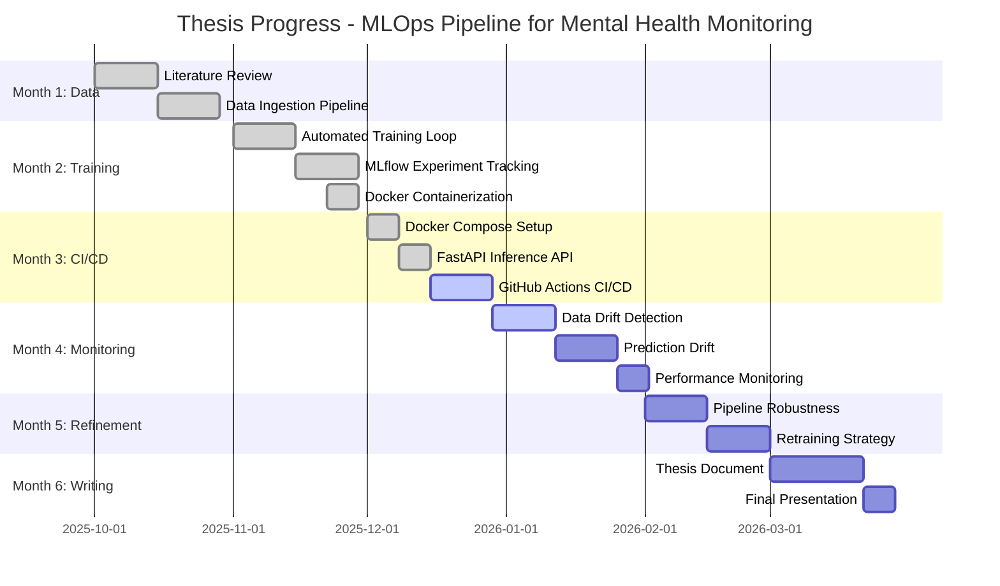
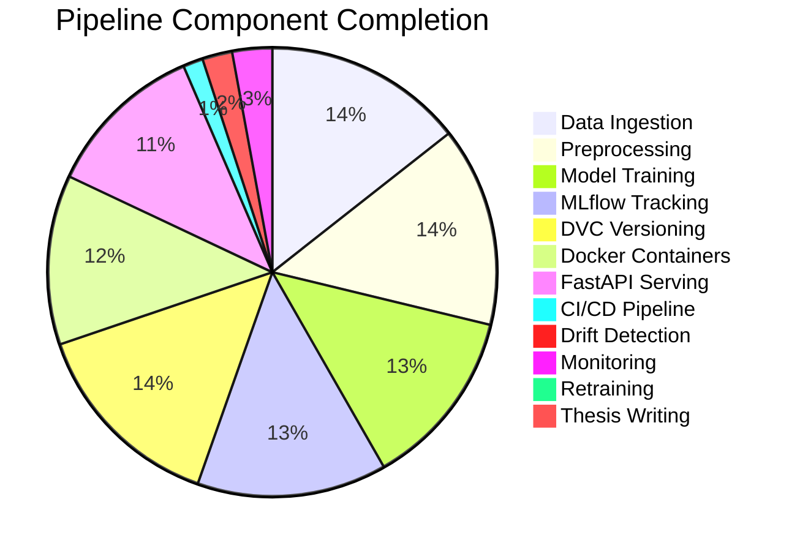
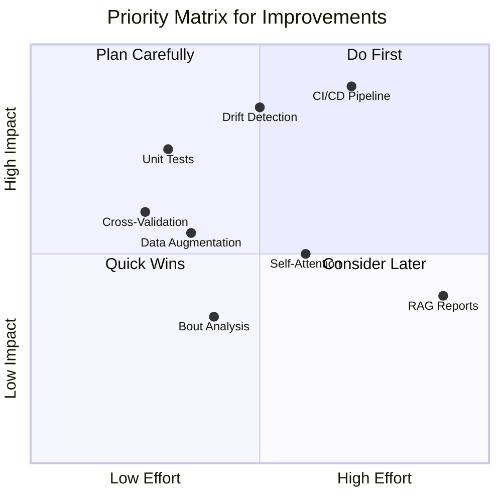

# 📊 Thesis Progress Analysis & Improvement Roadmap

> **Thesis:** Developing a MLOps Pipeline for Continuous Mental Health Monitoring using Wearable Sensor Data  
> **Analysis Date:** December 13, 2025  
> **Timeline:** October 2025 - April 2026 (6 months)

---

## 📈 Overall Completion Status

```
╔══════════════════════════════════════════════════════════════════════════╗
║                     THESIS COMPLETION: 58%                               ║
╠══════════════════════════════════════════════════════════════════════════╣
║  ████████████████████████████░░░░░░░░░░░░░░░░░░░░░░  58% Complete        ║
╚══════════════════════════════════════════════════════════════════════════╝
```

| Phase | Status | Completion |
|-------|--------|------------|
| Month 1: Data Ingestion | ✅ Complete | 100% |
| Month 2: Model Training & Versioning | ✅ Complete | 95% |
| Month 3: CI/CD & Deployment | 🟡 Partial | 60% |
| Month 4: Integration & Monitoring | 🟡 Partial | 40% |
| Month 5: Refinement & Retraining | 🔴 Not Started | 10% |
| Month 6: Thesis Writing | 🔴 Not Started | 5% |

---

## 📊 Progress Visualization (Mermaid)



---

## 📋 Detailed Task Completion Analysis

### ✅ Month 1: Research, Planning & Data Ingestion (100% Complete)

| Task | Status | Evidence |
|------|--------|----------|
| Literature Review | ✅ Done | `research_papers/COMPREHENSIVE_RESEARCH_PAPERS_SUMMARY.md` - 77+ papers analyzed |
| Understand 1D-CNN-BiLSTM | ✅ Done | Model analyzed: 499,131 params, 11 classes |
| Define scope & metrics | ✅ Done | `Thesis_Plan.md`, project documentation |
| Raw data ingestion | ✅ Done | `data/raw/*.xlsx` (Garmin exports) |
| Preprocessing pipeline | ✅ Done | `src/sensor_data_pipeline.py`, `src/preprocess_data.py` |
| Automated & reproducible | ✅ Done | Python scripts with config files |

**Deliverables:**
- ✅ Sensor fusion (accelerometer + gyroscope)
- ✅ 50Hz resampling
- ✅ Domain calibration (-6.295 m/s² Az offset)
- ✅ 200-sample windows with 50% overlap

---

### ✅ Month 2: Model Training & Versioning (95% Complete)

| Task | Status | Evidence |
|------|--------|----------|
| Automated training script | ✅ Done | `src/run_inference.py` (896 lines) |
| MLflow logging | ✅ Done | `src/mlflow_tracking.py` (654 lines) |
| Hyperparameter tracking | ✅ Done | MLflow params logging |
| Model versioning | ✅ Done | DVC + MLflow Model Registry |
| Experiment tracking | ✅ Done | `mlruns/` directory |
| Docker containerization | ✅ Done | `docker/Dockerfile.training`, `Dockerfile.inference` |

**Deliverables:**
- ✅ MLflow experiment tracking with metrics
- ✅ DVC for data/model versioning
- ✅ Docker containers for training and inference
- 🟡 Hyperparameter optimization (basic, not automated)

---

### 🟡 Month 3: CI/CD & Deployment (60% Complete)

| Task | Status | Evidence |
|------|--------|----------|
| Docker Compose | ✅ Done | `docker-compose.yml` (4 services) |
| FastAPI inference API | ✅ Done | `docker/api/main.py` |
| Dockerfile.inference | ✅ Done | `docker/Dockerfile.inference` |
| GitHub Actions CI/CD | ❌ Missing | No `.github/workflows/` directory |
| Automated testing | ❌ Missing | `tests/` folder empty |
| Docker registry push | ❌ Missing | Not implemented |

**Deliverables:**
- ✅ `docker-compose.yml` with MLflow + Inference services
- ✅ FastAPI `/predict` endpoint
- ✅ Containerized inference
- ❌ CI/CD pipeline (GitHub Actions)
- ❌ Automated unit tests

---

### 🟡 Month 4: Integration & Monitoring (40% Complete)

| Task | Status | Evidence |
|------|--------|----------|
| Activity → Prognosis flow | ❌ Missing | Prognosis model not integrated |
| Data drift detection | 🟡 Partial | Conceptual in docs, not implemented |
| Prediction drift | ❌ Missing | Not implemented |
| Performance monitoring | 🟡 Partial | `evaluate_predictions.py` has metrics |
| Alerts/Visualizations | ❌ Missing | No Prometheus/Grafana |

**Deliverables:**
- ✅ Evaluation metrics (accuracy, F1, confusion matrix)
- ✅ Confidence analysis in `evaluate_predictions.py`
- ❌ Drift detection implementation
- ❌ Prognosis model integration
- ❌ Monitoring dashboards

---

### 🔴 Month 5: Refinement & Retraining (10% Complete)

| Task | Status | Evidence |
|------|--------|----------|
| Pipeline robustness | 🟡 Partial | Error handling exists |
| Logging improvements | ✅ Done | Structured logging in all scripts |
| Retraining trigger design | ❌ Missing | Not implemented |
| Retraining prototype | ❌ Missing | Not implemented |

---

### 🔴 Month 6: Thesis Writing (5% Complete)

| Task | Status | Evidence |
|------|--------|----------|
| Thesis document | ❌ Not Started | Only `Thesis_Plan.md` exists |
| Final presentation | ❌ Not Started | - |
| Code documentation | 🟡 Partial | READMEs exist, docstrings in code |
| GitHub organization | ✅ Done | Well-organized folder structure |

---

## 📊 Component-Level Completion



---

## 🔧 Improvement Recommendations

> 📚 **Note:** All recommendations below are backed by research papers from the literature review. Paper references are provided in **[brackets]** for verification.

---

### 🔴 Critical (Must Do)

#### 1. Implement CI/CD Pipeline with GitHub Actions

**Current State:** No `.github/workflows/` directory  
**Recommendation:** Create automated testing and deployment pipeline

**Research Support:**
- **["Enabling End-To-End Machine Learning Replicability"]** - Emphasizes Docker and reproducibility for ML pipelines
- **["Reproducible workflow for online AI in digital health"]** - CI/CD and versioning for healthcare applications
- **["MLOps: A Survey"]** - Comprehensive MLOps lifecycle best practices
- **["MLDev: Data Science Experiment Automation"]** - Experiment tracking automation with DVC, MLflow

```yaml
# .github/workflows/ci.yml (recommended)
name: CI Pipeline
on: [push, pull_request]

jobs:
  test:
    runs-on: ubuntu-latest
    steps:
      - uses: actions/checkout@v3
      - uses: actions/setup-python@v4
        with:
          python-version: '3.11'
      - run: pip install -r config/requirements.txt
      - run: pytest tests/ -v
      
  lint:
    runs-on: ubuntu-latest
    steps:
      - uses: actions/checkout@v3
      - run: pip install pylint
      - run: pylint src/ --rcfile=config/.pylintrc
      
  docker:
    runs-on: ubuntu-latest
    steps:
      - uses: actions/checkout@v3
      - run: docker build -f docker/Dockerfile.inference -t har-inference .
```

---

#### 2. Implement Drift Detection

**Current State:** Only conceptual in documentation  
**Recommendation:** Add statistical drift detection to `data_validator.py`

**Research Support:**
- **["Domain Adaptation for IMU-based HAR: A Survey"]** - Documents 40%+ accuracy drop due to domain shift
- **["Recognition of Anxiety-Related Activities using 1DCNN-BiLSTM" (ICTH_16)]** - Core paper showing lab-to-life gap (49% → 87% with adaptation)
- **["Are Anxiety Detection Models Generalizable"]** - Cross-population and cross-device studies on model degradation
- **["Resilience of ML Models in Anxiety Detection"]** - Impact of sensor noise on model performance

```python
# Add to src/data_validator.py
from scipy.stats import ks_2samp

def detect_data_drift(reference_data, production_data, threshold=0.05):
    """
    Detect data drift using Kolmogorov-Smirnov test.
    
    Args:
        reference_data: Training data statistics
        production_data: New production data
        threshold: P-value threshold for drift detection
        
    Returns:
        dict: Drift detection results per sensor
    """
    sensors = ['Ax', 'Ay', 'Az', 'Gx', 'Gy', 'Gz']
    drift_results = {}
    
    for idx, sensor in enumerate(sensors):
        ref_flat = reference_data[:, :, idx].flatten()
        prod_flat = production_data[:, :, idx].flatten()
        
        stat, p_value = ks_2samp(ref_flat, prod_flat)
        drift_results[sensor] = {
            'ks_statistic': float(stat),
            'p_value': float(p_value),
            'drift_detected': p_value < threshold
        }
    
    return drift_results
```

---

#### 3. Add Unit Tests

**Current State:** `tests/` folder is empty  
**Recommendation:** Create test files for critical components

**Research Support:**
- **["Toward Reusable Science with Readable Code"]** - Best practices for reproducible scientific code
- **["MLOps: A Survey"]** - Testing as critical component of ML lifecycle
- **["DevOps-Driven Real-Time Health Analytics"]** - DevOps practices including testing for health pipelines

```python
# tests/test_preprocessing.py (recommended)
import pytest
import numpy as np
from src.sensor_data_pipeline import SensorDataPipeline

def test_windowing():
    """Test sliding window creation."""
    data = np.random.randn(1000, 6)
    windows = create_windows(data, window_size=200, overlap=0.5)
    assert windows.shape[1] == 200
    assert windows.shape[2] == 6

def test_unit_conversion():
    """Test milliG to m/s² conversion."""
    milli_g = 1000  # 1G in milliG
    m_s2 = milli_g * 0.00981
    assert abs(m_s2 - 9.81) < 0.01

def test_domain_calibration():
    """Test domain calibration offset."""
    offset = -6.295
    raw_az = -9.81  # Raw gravity
    calibrated = raw_az + offset
    assert abs(calibrated - (-3.515)) < 0.1
```

---

### 🟡 Important (Should Do)

#### 4. Add Self-Attention Layer to Model

**Current State:** 1D-CNN + BiLSTM only  
**Recommendation:** Add attention for improved temporal modeling

**Research Support:**
- **["Deep CNN-LSTM With Self-Attention Model for Human Activity Recognition"]** - Hybrid CNN-LSTM with self-attention achieves +2-3% accuracy improvement
- **["CNNs, RNNs and Transformers in HAR: A Survey"]** - Comparison showing attention benefits for long-range temporal dependencies
- **["Human Activity Recognition using Multi-Head CNN followed by LSTM"]** - Multi-head architecture for enhanced feature extraction

```python
# Enhancement for model architecture
from tensorflow.keras.layers import MultiHeadAttention, Add, LayerNormalization

class AttentionBlock(tf.keras.layers.Layer):
    def __init__(self, num_heads=4, key_dim=64):
        super().__init__()
        self.attention = MultiHeadAttention(num_heads=num_heads, key_dim=key_dim)
        self.norm = LayerNormalization()
        
    def call(self, x):
        attention_output = self.attention(x, x)
        return self.norm(x + attention_output)
```

**Expected Improvement:** +1-3% accuracy based on research papers

---

#### 5. Implement Data Augmentation

**Current State:** No augmentation applied  
**Recommendation:** Add jittering, scaling, time-warping

**Research Support:**
- **["Deep learning for sensor-based activity recognition: A survey"]** - Documents standard augmentation techniques for HAR
- **["Self-supervised learning for HAR"]** - Self-supervised pre-training with augmentation strategies
- **["Masked Video and Body-worn IMU Autoencoder"]** - Masked autoencoder approach with data augmentation
- **["Comparative Study on the Effects of Noise in HAR"]** - Understanding noise tolerance for robust training

```python
# src/data_augmentation.py (new file)
import numpy as np

def augment_sensor_data(X, augmentation_config):
    """Apply data augmentation to sensor windows."""
    augmented = X.copy()
    
    # Jittering: Add Gaussian noise
    if augmentation_config.get('jitter', False):
        noise = np.random.normal(0, 0.05, X.shape)
        augmented += noise
    
    # Scaling: Random magnitude scaling
    if augmentation_config.get('scale', False):
        scale = np.random.uniform(0.9, 1.1)
        augmented *= scale
    
    return augmented
```

---

#### 6. Add 5-Fold Cross-Validation

**Current State:** Single train/test split  
**Recommendation:** Implement k-fold CV for robust evaluation

**Research Support:**
- **["Recognition of Anxiety-Related Activities using 1DCNN-BiLSTM" (ICTH_16)]** - Uses 5-fold stratified CV as standard methodology
- **["A Close Look into Human Activity Recognition Models using Deep Learning"]** - Comprehensive comparison using k-fold validation
- **["Transfer Learning in HAR: A Survey"]** - Cross-validation for domain adaptation evaluation

```python
# Add to evaluate_predictions.py
from sklearn.model_selection import StratifiedKFold

def cross_validate_model(model, X, y, n_splits=5):
    """Perform stratified k-fold cross-validation."""
    skf = StratifiedKFold(n_splits=n_splits, shuffle=True, random_state=42)
    
    fold_metrics = []
    for fold, (train_idx, val_idx) in enumerate(skf.split(X, y)):
        X_train, X_val = X[train_idx], X[val_idx]
        y_train, y_val = y[train_idx], y[val_idx]
        
        # Train and evaluate
        model.fit(X_train, y_train, epochs=50, verbose=0)
        y_pred = model.predict(X_val).argmax(axis=1)
        
        f1 = f1_score(y_val, y_pred, average='macro')
        fold_metrics.append({'fold': fold, 'f1_macro': f1})
    
    return fold_metrics
```

---

### 🟢 Nice to Have (Optional)

#### 7. RAG-Enhanced Clinical Reports

**Recommendation:** Add LLM-based report generation for clinical insights

**Research Support:**
- **["A Multi-Stage, RAG-Enhanced Pipeline for Generating Mental Health Reports" (EHB_2025_71)]** - Core architecture: HAR → bout analysis → LLM reports
- **["Retrieval-Augmented Generation (RAG) in Healthcare: A Comprehensive Review"]** - RAG architecture patterns for healthcare
- **["Medical Graph RAG: Towards Safe Medical Large Language Models"]** - Knowledge graph-based RAG for medical safety
- **["Evaluating LLMs on medical evidence summarization"]** - Highlights hallucination risks mitigated by RAG
- **["Enhancing RAG with Knowledge Graph-Elicited Reasoning"]** - Knowledge graphs for healthcare copilots

```python
# Future: src/report_generator.py
class ClinicalReportGenerator:
    """Generate clinical reports from HAR predictions using RAG."""
    
    def __init__(self, knowledge_base, llm_model):
        self.kb = knowledge_base  # Neo4j or vector store
        self.llm = llm_model
    
    def generate_summary(self, predictions, bout_analysis):
        # Retrieve relevant clinical context
        context = self.kb.retrieve(predictions.top_activities)
        
        # Generate report with LLM
        prompt = f"Based on activity patterns: {bout_analysis}..."
        return self.llm.generate(prompt)
```

---

#### 8. Temporal Bout Analysis

**Recommendation:** Aggregate consecutive predictions into "bouts"

**Research Support:**
- **["A Multi-Stage, RAG-Enhanced Pipeline for Generating Mental Health Reports" (EHB_2025_71)]** - Defines bout analysis with gap thresholds (120s HR, 300s behavior)
- **["A State-of-the-Art Review of Computational Models for Longitudinal Wearable Data"]** - Temporal aggregation methods
- **["Deep Learning Paired with Wearable Passive Sensing Data Predicts Anxiety Deterioration"]** - Longitudinal pattern analysis over 17-18 years
- **["Designing a Clinician-Centered Wearable Data Dashboard (CarePortal)"]** - Clinical visualization of bout-level data

```python
# src/bout_analysis.py (new file)
def detect_bouts(predictions, timestamps, min_duration_sec=5):
    """
    Detect activity bouts (consecutive same-activity periods).
    
    Args:
        predictions: Array of predicted activity labels
        timestamps: Array of corresponding timestamps
        min_duration_sec: Minimum bout duration to consider
        
    Returns:
        DataFrame with bout statistics
    """
    bouts = []
    current_activity = predictions[0]
    bout_start = timestamps[0]
    
    for i, (pred, ts) in enumerate(zip(predictions[1:], timestamps[1:]), 1):
        if pred != current_activity:
            duration = (timestamps[i-1] - bout_start).total_seconds()
            if duration >= min_duration_sec:
                bouts.append({
                    'activity': current_activity,
                    'start': bout_start,
                    'end': timestamps[i-1],
                    'duration_sec': duration
                })
            current_activity = pred
            bout_start = ts
    
    return pd.DataFrame(bouts)
```

---

## 📊 Priority Matrix



---

## 📅 Recommended Action Plan

### Week 1-2 (December 15-28, 2025)
| Priority | Task | Effort | Impact |
|----------|------|--------|--------|
| 🔴 | Create GitHub Actions CI/CD | Medium | High |
| 🔴 | Add unit tests for preprocessing | Low | High |
| 🔴 | Implement drift detection | Medium | High |

### Week 3-4 (December 29 - January 11, 2026)
| Priority | Task | Effort | Impact |
|----------|------|--------|--------|
| 🟡 | Add 5-fold cross-validation | Low | Medium |
| 🟡 | Implement data augmentation | Medium | Medium |
| 🟡 | Add F1-macro as primary metric | Low | Medium |

### Week 5-8 (January 12 - February 8, 2026)
| Priority | Task | Effort | Impact |
|----------|------|--------|--------|
| 🟡 | Self-attention layer | Medium | Medium |
| 🟡 | Retraining trigger prototype | High | High |
| 🟡 | Prometheus/Grafana monitoring | High | Medium |

### Week 9-12 (February 9 - March 8, 2026)
| Priority | Task | Effort | Impact |
|----------|------|--------|--------|
| 🟢 | Bout analysis | Medium | Low |
| 🟢 | RAG report generation | High | Low |
| 📝 | Thesis writing begins | High | Critical |

---

## 📊 Current Repository Strengths

| Strength | Evidence |
|----------|----------|
| ✅ Well-organized folder structure | Clear separation: `src/`, `data/`, `models/`, `config/`, `docs/` |
| ✅ Comprehensive documentation | 8+ markdown files in `docs/`, 77+ papers analyzed |
| ✅ MLflow integration | `mlflow_tracking.py` (654 lines), experiments tracked |
| ✅ DVC data versioning | `.dvc` files for raw, processed, prepared, models |
| ✅ Docker containerization | Training and inference Dockerfiles |
| ✅ FastAPI serving | `docker/api/main.py` with endpoints |
| ✅ Domain adaptation | Calibration offset applied (-6.295 m/s²) |
| ✅ Evaluation metrics | Accuracy, F1, confusion matrix, confidence analysis |

---

## 📊 Current Repository Gaps

| Gap | Impact | Recommended Fix |
|-----|--------|-----------------|
| ❌ No CI/CD pipeline | High | Create `.github/workflows/` |
| ❌ No unit tests | High | Add `tests/` with pytest |
| ❌ No drift detection | High | Add to `data_validator.py` |
| ❌ No prognosis model | Medium | Design data flow |
| ❌ No monitoring dashboard | Medium | Add Prometheus/Grafana |
| ❌ No retraining trigger | Medium | Prototype trigger logic |
| ❌ No data augmentation | Low | Add augmentation module |
| ❌ No self-attention | Low | Modify model architecture |

---

## 🎯 Success Metrics

| Metric | Current | Target | Gap |
|--------|---------|--------|-----|
| Pipeline completion | 58% | 100% | 42% |
| Model accuracy | 87% | 90%+ | 3%+ |
| Test coverage | 0% | 80% | 80% |
| CI/CD automation | 0% | 100% | 100% |
| Documentation | 70% | 100% | 30% |
| Drift detection | 0% | 100% | 100% |

---

## 📝 Conclusion

The thesis is approximately **58% complete** with strong foundations in:
- Data ingestion and preprocessing
- Model training and MLflow tracking
- Docker containerization and API serving

**Critical gaps** requiring immediate attention:
1. CI/CD pipeline (GitHub Actions)
2. Unit tests
3. Drift detection implementation

**Timeline assessment:** On track if CI/CD and monitoring are completed by end of January 2026, leaving February-March for refinement and thesis writing.

---

## 📚 Paper References (Full Citations)

All improvement recommendations are supported by the following research papers from your literature collection (`research_papers/76 papers/`):

### Core Methodology Papers (⭐⭐⭐⭐⭐)

| Citation Key | Full Title | Location |
|--------------|------------|----------|
| **ICTH_16** | "Recognition of Anxiety-Related Activities using 1DCNN-BiLSTM on Commercial Wearable" | `research_papers/76 papers/ICTH_16/` |
| **EHB_2025_71** | "A Multi-Stage, RAG-Enhanced Pipeline for Generating Mental Health Reports from Wearable Sensor Data" | `research_papers/76 papers/EHB_2025_71/` |
| **ADAM-sense** | Khan et al. (2021) - "ADAM-sense: Anxiety-displaying activities recognition by motion sensors" | `research_papers/76 papers/` |

### HAR & Deep Learning Papers

| Paper Title | Key Contribution | Used For |
|-------------|------------------|----------|
| "Deep CNN-LSTM With Self-Attention Model for Human Activity Recognition" | Self-attention for HAR | Self-attention recommendation |
| "A Close Look into Human Activity Recognition Models using Deep Learning" | BiLSTM, CNN comparison | Architecture choices |
| "Deep learning for sensor-based activity recognition: A survey" | Foundational DL for HAR | Data augmentation, windowing |
| "Human Activity Recognition using Multi-Head CNN followed by LSTM" | Multi-head architecture | Multi-scale feature extraction |
| "CNNs, RNNs and Transformers in HAR: A Survey and Hybrid Model" | Transformer comparison | Attention mechanisms |
| "Combining Accelerometer and Gyroscope Data in Smartphone-Based Activity Recognition" | Sensor fusion | Preprocessing validation |

### Mental Health & Anxiety Detection Papers

| Paper Title | Key Contribution | Used For |
|-------------|------------------|----------|
| "Wearable Artificial Intelligence for Detecting Anxiety: Systematic Review" | Meta-analysis of wearable AI | Overall approach validation |
| "Are Anxiety Detection Models Generalizable: Cross-Activity and Cross-Population Study" | Generalization challenges | Drift detection rationale |
| "Resilience of ML Models in Anxiety Detection: Impact of Gaussian Noise" | Noise robustness | Data augmentation rationale |
| "Deep Learning Paired with Wearable Passive Sensing Data Predicts Anxiety Deterioration" | Longitudinal prediction | Bout analysis rationale |
| "Panic Attack Prediction Using Wearable Devices and Machine Learning" | Time-series prediction | Real-time inference |

### MLOps & Pipeline Papers

| Paper Title | Key Contribution | Used For |
|-------------|------------------|----------|
| "MACHINE LEARNING OPERATIONS: A SURVEY ON MLOPS" | MLOps lifecycle | CI/CD, testing recommendations |
| "MLHOps: Machine Learning for Healthcare Operations" | Healthcare MLOps | Compliance considerations |
| "Enabling End-To-End Machine Learning Replicability" | Reproducibility | Docker, CI/CD |
| "MLDEV: DATA SCIENCE EXPERIMENT AUTOMATION" | DVC, MLflow | Experiment tracking |
| "Reproducible workflow for online AI in digital health" | Digital health workflows | CI/CD pipeline |
| "DevOps-Driven Real-Time Health Analytics" | DevOps for health | Testing practices |
| "Toward Reusable Science with Readable Code" | Code quality | Unit testing rationale |

### Domain Adaptation Papers

| Paper Title | Key Contribution | Used For |
|-------------|------------------|----------|
| "Domain Adaptation for IMU-based HAR: A Survey" | Domain shift analysis | Drift detection |
| "Transfer Learning in HAR: A Survey" | Transfer learning | Cross-validation, fine-tuning |

### RAG & LLM Papers

| Paper Title | Key Contribution | Used For |
|-------------|------------------|----------|
| "Retrieval-Augmented Generation (RAG) in Healthcare: A Comprehensive Review" | RAG architecture | Clinical reports |
| "Medical Graph RAG: Towards Safe Medical Large Language Models" | Knowledge graph RAG | Safety considerations |
| "Evaluating LLMs on medical evidence summarization" | Hallucination risks | RAG rationale |
| "Enhancing RAG with Knowledge Graph-Elicited Reasoning" | Knowledge graphs | Report generation |

### Foundation Models & Self-Supervised Learning Papers

| Paper Title | Key Contribution | Used For |
|-------------|------------------|----------|
| "Toward Foundation Model for Multivariate Wearable Sensing" | Foundation models | Future improvements |
| "Masked Video and Body-worn IMU Autoencoder" | MAE for IMU | Augmentation strategies |
| "Self-supervised learning for fast and scalable time series" | SSL for HPO | Training efficiency |

### Wearable Data Processing Papers

| Paper Title | Key Contribution | Used For |
|-------------|------------------|----------|
| "A State-of-the-Art Review of Computational Models for Longitudinal Wearable Data" | Temporal analysis | Bout analysis |
| "Designing a Clinician-Centered Wearable Data Dashboard (CarePortal)" | Clinical visualization | Dashboard recommendations |
| "Comparative Study on the Effects of Noise in HAR" | Noise analysis | Augmentation validation |

---

## 📖 Quick Reference Guide

When implementing improvements, refer to these papers:

| Improvement | Primary Papers to Read |
|-------------|------------------------|
| CI/CD Pipeline | "MLOps Survey", "End-to-End ML Replicability", "Reproducible Workflow" |
| Drift Detection | ICTH_16, "Domain Adaptation Survey", "Are Anxiety Models Generalizable" |
| Self-Attention | "Deep CNN-LSTM With Self-Attention", "CNNs/RNNs/Transformers Survey" |
| Data Augmentation | "Deep Learning for HAR Survey", "Masked IMU Autoencoder" |
| Cross-Validation | ICTH_16, "A Close Look into HAR Models" |
| Bout Analysis | EHB_2025_71, "Longitudinal Wearable Data Review" |
| RAG Reports | EHB_2025_71, "RAG in Healthcare Review", "Medical Graph RAG" |

---

*Generated: December 13, 2025*  
*Based on: `Thesis_Plan.md`, repository analysis, and 77+ research papers*  
*Full paper summaries available in: `research_papers/COMPREHENSIVE_RESEARCH_PAPERS_SUMMARY.md`*
