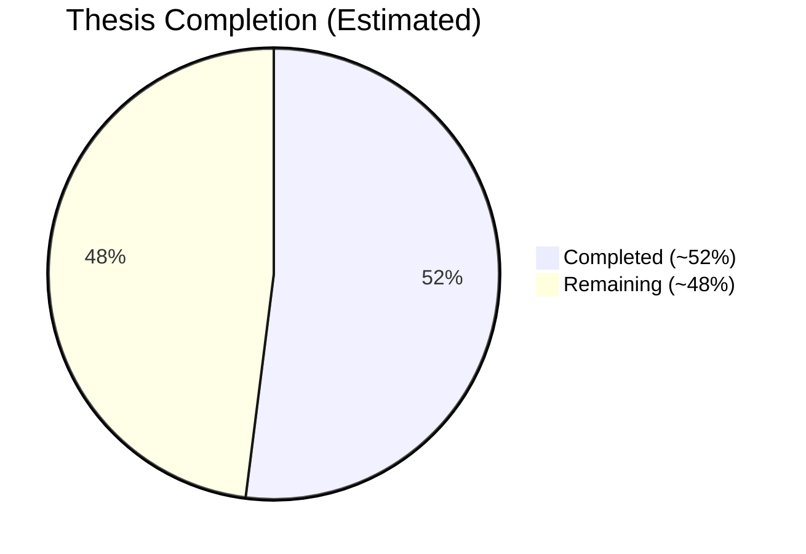

# Thesis Progress & Pipeline Improvement Report
**Generated:** 2025-12-13  
**Scope:** Repo status + paper-driven improvement backlog

## 1) Quick Summary

### Current thesis completion (estimated)

`Thesis_Plan.md` is currently **empty** (0 bytes), so an exact "plan-based" completion % cannot be computed from it.

**Estimated overall thesis completion:** **~52%** (evidence-based estimate using repo artifacts + existing status docs).  
**Current short-term task backlog completion (from `docs/CURRENT_STATUS.md` checkboxes):** **20%** (4/20).

### Evidence used for this estimate
- **Literature synthesis exists:** `research_papers/COMPREHENSIVE_RESEARCH_PAPERS_SUMMARY.md`, `research_papers/76_papers_summarizzation.md`, `research_papers/76_papers_suggestions.md`
- **End-to-end pipeline artifacts exist:** `data/prepared/production_X.npy`, `data/prepared/predictions/`, `outputs/evaluation/`
- **MLOps + serving exists:** `docker-compose.yml`, `docker/api/main.py`, `mlruns/`, DVC metadata in `data/*.dvc`

---

## 2) Completion Breakdown (Weighted)

This is a **pragmatic thesis-progress estimate** (not a calendar estimate). Adjust weights if your supervisor values one workstream more.

| Workstream | Weight | Completion | Why (repo evidence) |
|---|---:|---:|---|
| Literature review & research synthesis | 20% | 80% | 76+ papers summarized + categorized, but thesis narrative/gap framing not tracked in repo |
| Data ingestion & preprocessing | 20% | 75% | `src/sensor_data_pipeline.py`, `src/preprocess_data.py`, prepared production arrays + metadata |
| Model integration & inference | 15% | 70% | pretrained model integrated + batch inference + API (`models/pretrained/`, `src/run_inference.py`, `docker/api/main.py`) |
| MLOps infrastructure & deployment | 15% | 75% | DVC + MLflow + Docker compose present; CI/CD + monitoring still pending |
| Evaluation & experiments | 20% | 40% | evaluation outputs exist, but thesis-grade experiments (generalization, robustness, calibration, domain adaptation) are still limited |
| Thesis writing & finalization | 10% | 10% | `Thesis_Plan.md` is empty, so writing progress is currently not measurable here |

**Weighted total:** `0.20*0.80 + 0.20*0.75 + 0.15*0.70 + 0.15*0.75 + 0.20*0.40 + 0.10*0.10 ~= 0.52`

---

## 3) Mermaid Diagram (Progress Snapshot)

---

## 4) What's Missing vs. the "Ideal" Thesis Pipeline (From Papers)

Your repo already covers **HAR + MLOps + deployment** well. The biggest thesis-value gaps are:

1. **Thesis-grade evaluation** (generalization, robustness, calibration)
2. **Domain adaptation workflow** (lab-to-life gap experiments + automated re-tuning loop)
3. **Longitudinal/bout analysis layer** (turn window predictions into clinically interpretable events/trends)
4. **RAG/LLM report generation** (if it's in-scope for your thesis contribution)
5. **Monitoring + CI/CD** (to demonstrate "production readiness")

Reference improvement backlogs:
- Paper-driven backlog: `research_papers/76_papers_suggestions.md`
- Repo-specific paper insights: `docs/RESEARCH_PAPER_INSIGHTS.md`

---

## 5) Concrete Improvements to the Current Pipeline (Repo-Specific)

### P0 (High impact, low/medium effort)
- **Make `config/pipeline_config.yaml` actually control behavior end-to-end**  
  Today it's only partially used (e.g., `docker/api/main.py` defines `CONFIG_PATH` but doesn't apply it). Align `src/` + API around one config source.
- **Standardize sensor column naming and units across the repo**  
  Example mismatch: `src/config.py` contains `_w` sensor column names, while the rest of the pipeline largely uses `Ax/Ay/Az/Gx/Gy/Gz`.
- **Add data drift checks as part of evaluation + log to MLflow**  
  Minimal: KS-test / PSI between training vs production distributions per channel + confidence distribution shifts.
- **Add a "reject / unknown" pathway for low-confidence predictions**  
  Don't force a class label if confidence is low; log and surface it as "uncertain" (this improves clinical safety narratives).

### P1 (Thesis-value experiments)
- **Calibration improvements**  
  You compute ECE (when labels exist). Next: reliability diagrams + temperature scaling, then compare pre/post calibration.
- **Robustness & missingness evaluation**  
  Add controlled noise injection + missing-window simulation (and track degradation curves).
- **Bout analysis layer (clinical interpretability)**  
  Add a stage that groups consecutive windows into bouts, extracts durations, counts, trends, and exports a "weekly summary" artifact.

### P2 (Bigger thesis contribution)
- **Domain adaptation workflow**  
  Implement a repeatable pipeline: pretrain -> evaluate lab-to-life gap -> small labeled Garmin fine-tune -> cross-user + cross-device evaluation -> deploy.
- **RAG/LLM clinical reporting (if in scope)**  
  Generate clinician/patient reports from bout + physiological summaries with strict provenance logging (retrieved chunks/triples + "no answer" behavior).

---

## 6) Recommended Next Actions (2-week sprint suggestion)

1. Define a thesis-progress checklist in `Thesis_Plan.md` (checkbox-based) so completion becomes measurable.
2. Add drift + robustness evaluation outputs and log them to MLflow as artifacts.
3. Implement bout analysis + export a weekly summary JSON/CSV.
4. Add CI/CD (lint + tests + docker build) and a minimal monitoring story (even if only logging + basic metrics).

---

## 7) Open Questions (to lock thesis scope)

- What is the **clinical target**: screening vs monitoring vs prediction?
- What is the **ground truth** source (EMA / clinician labels / validated questionnaire), and how will you handle label noise?
- What is your **deployment target** (on-device vs phone vs cloud) and what are your privacy constraints?
- What are the **success metrics** for the thesis (accuracy, generalization gap reduction, reproducibility/auditability, clinical interpretability)?
