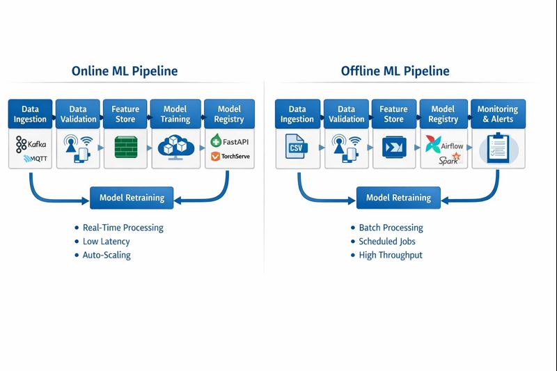
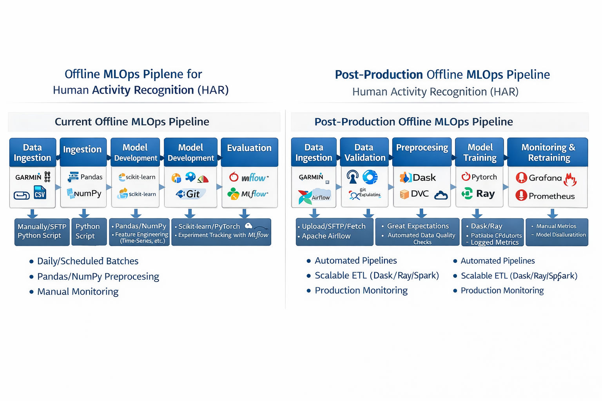
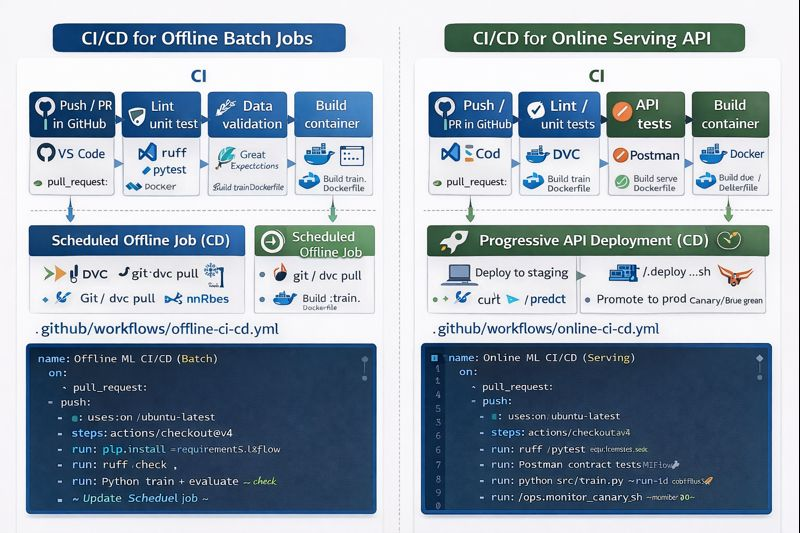

Here’s a **side-by-side (phone-friendly) table** comparing an **online (real-time) scalable MLOps pipeline** vs an **offline (batch) scalable ML pipeline** — across the **full ML lifecycle** (data → training → deployment → monitoring → retraining).

> **Online = “serve predictions now” (low latency)**
> **Offline = “compute in batches” (throughput + scheduled jobs)**

| Pipeline stage         | Online scalable ML Ops (real-time)                                                 | Offline scalable ML pipeline (batch)                                            |
| ---------------------- | ---------------------------------------------------------------------------------- | ------------------------------------------------------------------------------- |
| **Goal**               | Instant predictions per request/event                                              | Periodic predictions on many records                                            |
| **Typical use case**   | Fraud detection, HAR live activity, recommendations “now”, anomaly alerts          | Churn scoring weekly, demand forecast nightly, report generation, bulk labeling |
| **Data ingestion**     | Streaming/events (Kafka/MQTT/Webhooks), micro-batches                              | Batch pulls (CSV/DB dumps/APIs), scheduled extracts                             |
| **Storage**            | Hot store + time-series (Redis/Elastic/TSDB) + lake                                | Data lake / warehouse / filesystems (Parquet/CSV)                               |
| **Preprocessing**      | Must be **fast + deterministic** at inference time                                 | Can be heavy (joins, big aggregates, wide features)                             |
| **Feature store**      | Often needed: **online feature store** (low-latency reads)                         | Mostly **offline feature store** or feature tables                              |
| **Training**           | Still mostly offline (but frequent), supports continuous updates                   | Offline training on schedule (daily/weekly)                                     |
| **Evaluation**         | Includes latency, drift, live A/B, shadow tests                                    | Focus on accuracy + stability on held-out sets                                  |
| **Model packaging**    | Container + optimized runtime (ONNX/TensorRT optional)                             | Container or script job; can be simpler                                         |
| **Deployment**         | Real-time serving endpoint (FastAPI/TorchServe/BentoML) behind load balancer       | Batch job deployment (Spark job / Python job / Airflow task)                    |
| **Inference**          | Per request/event; strict SLA (e.g., <50ms–300ms)                                  | Batch scoring (minutes-hours), optimized for throughput                         |
| **Scaling method**     | Horizontal autoscaling, replicas, caching, queue backpressure                      | Parallel batch workers, distributed compute (Spark/Dask/Ray)                    |
| **Failure handling**   | Retries + circuit breakers + fallback model/rules                                  | Retry job; rerun partitions; checkpointing                                      |
| **Monitoring**         | **Service + model monitoring**: latency, error rate, drift, data quality, outliers | Mostly data quality + drift + job success/fail + batch metrics                  |
| **Human-in-the-loop**  | Online feedback loops, quick labeling of hard cases                                | Review results after runs; slower feedback cycle                                |
| **Retraining trigger** | Drift alerts, performance drop, new data volume threshold                          | Time-based (weekly/monthly) or “new data available”                             |
| **Reproducibility**    | Harder due to live data + moving distributions                                     | Easier: fixed snapshots/partitions, deterministic reruns                        |
| **Governance**         | Strong: audit logs, model version pinning, rollback in minutes                     | Strong too, but rollback = re-run job with older model                          |
| **Cost profile**       | Pay for always-on infra + peak traffic                                             | Cheaper if compute runs only on schedule                                        |

---

## Concrete example (same problem, two ways)

### Example problem: **Human Activity Recognition (HAR) from wearable IMU**

**Online pipeline**

1. Sensor stream → (Kafka/MQTT) → preprocessing (windowing)
2. Feature retrieval (optional) → model API → prediction
3. Store predictions + monitor drift/latency → trigger retraining if drift

**Offline pipeline**

1. Daily sensor files → batch preprocess/window
2. Train/evaluate model weekly
3. Nightly batch scoring for all users → generate reports → monitor drift on batch stats

---

## “Tool stack” examples (no cloud required)

### Online scalable (local/on-prem style)

* **Ingestion:** Kafka / Redpanda / MQTT
* **Serving:** FastAPI + Uvicorn / BentoML / TorchServe
* **Orchestration:** Kubernetes (k3s/minikube) or Docker Compose
* **Monitoring:** Prometheus + Grafana (+ logs via Loki/ELK)
* **Model registry/experiments:** MLflow
* **Data validation:** Great Expectations

### Offline scalable (local/on-prem style)

* **Orchestration:** Airflow / Prefect / Dagster (or even cron for simple)
* **Compute:** Dask / Ray / Spark (if big) or multiprocessing
* **Versioning:** DVC + Git (data + models)
* **Tracking:** MLflow
* **Storage:** Parquet on disk/NAS, Postgres

---

## The key “mental model” difference

* **Online pipeline:** optimize for **latency + reliability + rollback**
* **Offline pipeline:** optimize for **throughput + reproducibility + cost efficiency**

If you want, I can also draw a **clean pipeline diagram** (online vs offline) with the boxes: ingestion → validation → feature store → training → registry → deploy → monitoring → retrain, tailored to your thesis setup (Garmin IMU + local MLOps, no cloud).



I think you mean **DVC** (Data Version Control). The key idea is:

* **Git stores small *metadata* files (pointers)**
* **DVC stores the *actual big data/model files* in a DVC cache + a DVC remote (local disk / NAS / S3 / etc.)**

## What exactly goes into Git when you use DVC?

### 1) **`.dvc` pointer files** (created by `dvc add data.csv`)

Git commits a tiny YAML file like `data.csv.dvc` that contains:

* the **path** (`data.csv`)
* the **hash/checksum** of the file contents (usually MD5)
* file **size**, number of files (if directory), etc. ([Data Version Control · DVC][1])

So Git **does not store the data**, it stores a *receipt/pointer* that says:
“this dataset version = checksum X”.

### 2) **`dvc.yaml` + `dvc.lock`** (created by `dvc stage add` / pipelines)

* `dvc.yaml` describes pipeline stages (commands, deps, outs, metrics, plots) and is meant to be versioned in Git. ([Data Version Control · DVC][2])
* `dvc.lock` locks the exact versions/hashes of dependencies/outputs so runs are reproducible (also stored in Git). ([Data Version Control · DVC][3])

### 3) **`.dvc/config` (often tracked)**

Repo-level DVC config can be tracked by Git (but should not contain secrets). ([Data Version Control · DVC][4])

---

## Where is the real data stored then?

### A) **Local DVC cache** (on your machine)

DVC stores file contents in a content-addressed cache like:

`.dvc/cache/files/md5/ec/1d2935...`

It uses the **first 2 chars** of the hash as a folder name, rest as filename. ([Data Version Control · DVC][5])

### B) **DVC remote storage**

When you run `dvc push`, DVC uploads cached objects to the configured remote. ([Data Version Control · DVC][6])

---

## How do you “retrieve” a specific dataset version using Git SHA?

Two IDs are involved:

### ✅ Git commit SHA (version of *metadata + code*)

1. `git checkout <commit-sha>`
2. `dvc pull`

At that commit, the `.dvc` / `dvc.lock` files contain the correct checksums, so DVC knows **which exact data objects** to download.

### ✅ DVC hash (MD5/ETag/checksum) (version of *data content*)

The actual data is identified by the **content hash** stored inside `.dvc`/`dvc.lock` (MD5 for local/SSH, ETag for some cloud remotes, etc.). ([Data Version Control · DVC][1])

---

## Super simple analogy

* **Git = recipe book + barcode list**
* **DVC remote/cache = actual ingredients warehouse**
* **Git SHA** chooses the recipe version, **DVC hash** chooses the exact ingredient batch.

If you paste one of your `.dvc` files (or `dvc.yaml`/`dvc.lock`) here, I’ll explain line-by-line what each field means for your thesis pipeline.

[1]: https://doc.dvc.org/user-guide/project-structure/dvc-files?utm_source=chatgpt.com ".dvc Files | Data Version Control · DVC"
[2]: https://doc.dvc.org/user-guide/project-structure/dvcyaml-files?utm_source=chatgpt.com "dvc.yaml Files | Data Version Control · DVC"
[3]: https://doc.dvc.org/start/data-pipelines/data-pipelines?utm_source=chatgpt.com "Get Started: Data Pipelines"
[4]: https://doc.dvc.org/user-guide/project-structure/configuration?utm_source=chatgpt.com "DVC Configuration"
[5]: https://doc.dvc.org/user-guide/project-structure/internal-files?utm_source=chatgpt.com "Internal Directories and Files"
[6]: https://doc.dvc.org/command-reference/push?utm_source=chatgpt.com "push | Data Version Control · DVC"



Below is a **clear CI/CD explanation for Offline vs Online pipelines**, plus **what you actually write inside CI/CD files** (GitHub Actions examples), and **two images** (a pipeline diagram + a VS Code-style workflow view).

---

## 1) CI vs CD (simple meaning)

### CI = Continuous Integration

Runs automatically when you **push code** or open a **pull request** to ensure:

* code quality is OK (lint/format)
* tests pass (unit/integration)
* pipeline steps still work
* artifacts can be built (Docker image / package)

### CD = Continuous Delivery/Deployment

Runs after CI succeeds to **ship something**:

* Offline: ship **batch job / scheduled pipeline** + register a new model
* Online: ship **serving API** to staging → production (with safety)

---

## 2) Offline (Batch) CI/CD — how it happens

### CI for Offline (Batch)

Typical steps:

1. Lint/format (ruff/black)
2. Unit tests (pytest)
3. Data/schema validation (Great Expectations)
4. Build training container (Docker) OR verify environment reproducibility
5. (Optional) “small training smoke run” on tiny sample data

✅ CI goal here: **the batch pipeline will run correctly**.

### CD for Offline (Batch)

Typical steps:

1. Pull the correct data snapshot (DVC pull if used)
2. Train + evaluate model
3. Register model + metrics (MLflow)
4. Update the scheduled job that will run scoring (Airflow/Prefect/Cron)
5. Store batch outputs (reports, CSVs, dashboards)

✅ CD goal here: **a new model is produced + scheduled batch pipeline uses it**.

**Key difference:** Offline CD usually **deploys a job**, not a live API.

---

## 3) Online (Real-time) CI/CD — how it happens

### CI for Online (Serving)

Typical steps:

1. Lint/format
2. Unit tests
3. API contract tests (request/response validation)
4. Build serving Docker image
5. Security scan (optional)
6. Quick local inference smoke test (load model, call `/predict`)

✅ CI goal here: **the API is safe to deploy and won’t break clients**.

### CD for Online (Serving)

Typical steps:

1. Deploy to **staging**
2. Run smoke tests against staging endpoint
3. Promote to prod using **canary** or **blue/green**
4. Monitor service metrics + model metrics
5. Rollback automatically/manual if errors spike

✅ CD goal here: **safe release with rollback** because traffic is live.

**Key difference:** Online CD must protect **latency, uptime, and correctness**.

---

## 4) What you write in CI/CD files (offline vs online)

### What an Offline workflow file must include

* pipeline tests + data validation
* (optional) training smoke run
* training + evaluation steps in CD
* model registration (MLflow)
* update scheduler/job config (Airflow/cron)

### What an Online workflow file must include

* API tests + contract tests
* build serving image
* deploy to staging + smoke test endpoint
* progressive rollout (canary/blue-green)
* monitoring gate + rollback logic

---

## 5) Images (your requested visuals)

### Image A — CI/CD flow: Offline vs Online


### Image B — “VS Code view”: workflow YAML side-by-side


---

## 6) Copy-paste templates (as if in VS Code)

### Offline (Batch) — `.github/workflows/offline-ci-cd.yml`

```yaml
name: Offline ML CI/CD (Batch)
on:
  pull_request:
  push:
    branches: [ main ]

jobs:
  ci:
    runs-on: ubuntu-latest
    steps:
      - uses: actions/checkout@v4
      - uses: actions/setup-python@v5
        with: { python-version: '3.10' }
      - run: pip install -r requirements.txt
      - run: ruff check . && ruff format --check .
      - run: pytest -q
      - run: great_expectations checkpoint run imu_checkpoint
      - run: docker build -t har-train:${{ github.sha }} -f docker/train.Dockerfile .

  cd:
    needs: ci
    if: github.ref == 'refs/heads/main'
    runs-on: ubuntu-latest
    steps:
      - uses: actions/checkout@v4
      - run: dvc pull   # fetch data snapshot (optional if local-only)
      - run: python src/train.py --run-id ${{ github.sha }}
      - run: python src/evaluate.py --run-id ${{ github.sha }}
      - run: python src/register.py --run-id ${{ github.sha }}  # MLflow/DVC tag
      - run: python ops/deploy_batch_job.py --env prod          # update Airflow/cron
```

### Online (Serving) — `.github/workflows/online-ci-cd.yml`

```yaml
name: Online ML CI/CD (Serving)
on:
  pull_request:
  push:
    branches: [ main ]

jobs:
  ci:
    runs-on: ubuntu-latest
    steps:
      - uses: actions/checkout@v4
      - uses: actions/setup-python@v5
        with: { python-version: '3.10' }
      - run: pip install -r requirements.txt
      - run: ruff check . && ruff format --check .
      - run: pytest -q
      - run: pytest -q tests/api   # contract tests
      - run: docker build -t har-api:${{ github.sha }} -f docker/serve.Dockerfile .
      - run: trivy image har-api:${{ github.sha }} || true     # optional scan

  cd:
    needs: ci
    if: github.ref == 'refs/heads/main'
    runs-on: ubuntu-latest
    steps:
      - uses: actions/checkout@v4
      - run: ./ops/deploy_staging.sh har-api:${{ github.sha }}
      - run: ./ops/smoke_test.sh https://staging.example/predict
      - run: ./ops/promote_canary.sh har-api:${{ github.sha }}
      - run: ./ops/monitor_canary.sh --minutes 10
      - run: ./ops/promote_full.sh har-api:${{ github.sha }}
```

---

If you want, I can **adapt these two YAMLs exactly to your thesis repo structure** (your real folder names like `src/`, `config/`, `artifact/`, MLflow paths, DVC remote/local, etc.) and also make a third image: **“current thesis CI/CD vs post-production CI/CD”** aligned with your pipeline figure.



You’re thinking in the right direction: **Docker’s main job is to freeze the environment (dependencies + OS + runtime) so your code runs the same everywhere.**
But in MLOps we usually build **separate Docker images for training and inference** because they have **different requirements, risks, and scaling patterns**.

## Why Docker at all in your thesis MLOps?

### 1) Reproducibility (biggest reason for thesis)

* Same Python version, same libraries (numpy/torch/sklearn), same system libs
* Your supervisor/reviewer can run it the same way on another machine
* “It works on my laptop” becomes “it works anywhere”

### 2) Deployment consistency (even if fully offline)

Even in an offline pipeline (no cloud), you still “deploy”:

* a batch scoring job
* a scheduled pipeline
* a local service
  Docker makes that deployment consistent.

### 3) Isolation

Your system won’t break because you installed conflicting packages (CUDA, torch, etc.).
Docker isolates environments per project.

### 4) CI/CD automation

GitHub Actions can build the image, run tests inside it, and publish it as an artifact.

---

## Why **two images**: training vs inference?

### Training container (heavy)

Training needs:

* full ML stack (PyTorch/TensorFlow, notebooks/tools, maybe CUDA)
* data processing libs (pandas, scipy)
* experiment tracking (MLflow)
* sometimes compilers/build tools

It’s okay if it’s **big** and slower. It runs occasionally.

### Inference container (light + stable)

Inference needs:

* only what’s required to load the model and run `predict()`
* FastAPI + server runtime (if online)
* minimal libs for speed + security

It should be:

* **small**
* **fast to start**
* **less attack surface**
* easy to scale/replicate

**So:** training image = “build model”
inference image = “serve model”

That’s why MLOps documents describe them separately.

---

## Offline case: do we still need an inference image?

Not mandatory, but very useful.

In offline batch scoring, “inference” is still a job:

* load model
* read batch data
* predict
* write outputs (CSV/report)

If you Dockerize it:

* your cron/Airflow job runs the same everywhere
* no dependency mismatch when you move machines
* easy to reproduce results for your thesis

---

## Total uses of Docker in your thesis pipeline (complete list)

1. **Training runtime container** (run `train.py` reliably)
2. **Batch inference container** (run `batch_predict.py` reliably)
3. **Online inference API container** (FastAPI service), if you add real-time mode
4. **Packaging artifacts** (bundle model + preprocessing object + code version)
5. **CI**: run tests in the same container you’ll deploy
6. **CD**: deploy by switching image tag (`model:v12` → `model:v13`)
7. **Reproducible thesis demo**: “one command brings whole system up” (docker compose)

---

## Simple mental model

* **Docker image = a “sealed box” with everything needed to run**
* You make **two boxes** because training and inference are different jobs:

  * training = heavy/rare
  * inference = light/frequent/needs stability

---

If you want, I can also propose a clean **3-Dockerfile layout** for your repo:

* `docker/train.Dockerfile`
* `docker/batch_infer.Dockerfile`
* `docker/serve.Dockerfile`

…and a single `docker-compose.yml` that ties them together for your thesis demo.
