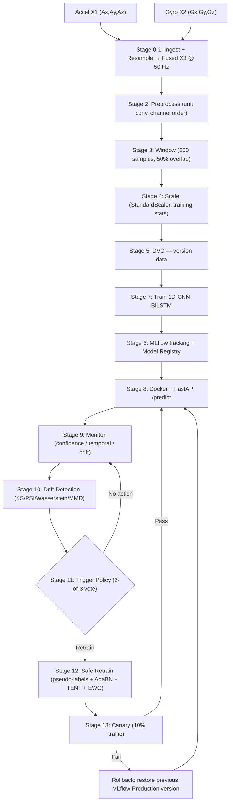
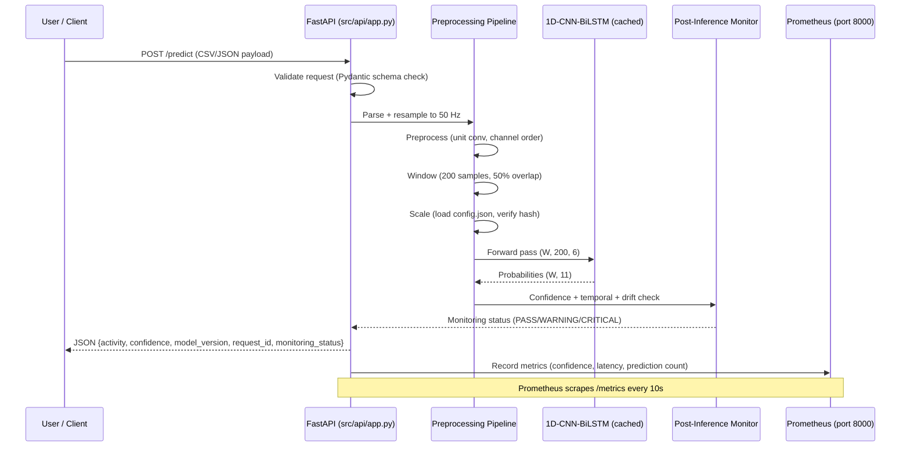

# Pipeline Y — End-to-End Explained With Citations

**Repo:** `ShalinVachheta017/MasterArbeit_MLops`  
**Author:** Shalin Vachheta  
**Auditor / Writer:** Codex 5.3 (pipeline audit + technical writing)  
**Date:** 23 February 2026  
**Source document:** [`docs/thesis/thesis-pipeline-why-what-how.md`](thesis/thesis-pipeline-why-what-how.md)

---

## 1. Title + One-Paragraph Overview

**Pipeline Y: HAR MLOps Continuous Wearable Monitoring Pipeline**

This pipeline operationalises a 1D-CNN-BiLSTM model for *anxiety-related* Human Activity Recognition (HAR) from wrist-worn IMU data (Garmin smartwatch, 6-axis: tri-axial accelerometer X1, tri-axial gyroscope X2 → fused stream X3). Raw Excel exports are ingested, resampled to 50 Hz, windowed into 4-second (200-sample) segments, standardised, and passed through the trained model. In production the service runs inside a Docker container behind a FastAPI REST interface. Post-inference, three proxy layers (confidence, temporal, input-feature drift) feed a 2-of-3 voting trigger policy. When drift is confirmed the pipeline triggers unlabelled retraining via curriculum pseudo-labelling, AdaBN, TENT, and EWC regularisation. Newly trained models enter a 10% canary deployment gate before promotion; automatic rollback restores the previous registered version if the canary fails. All data revisions are tracked by DVC; all experiments by MLflow; CI/CD is handled by GitHub Actions; observability is routed to Prometheus with Grafana dashboards and Alertmanager alert rules.

---

## 2. Pipeline at a Glance

### Ordered Stage List

| # | Stage | Short Purpose |
|---|---|---|
| 0 | Data Ingestion | Validate and ingest raw Garmin Excel files |
| 1 | Standardisation & Resampling | Normalise to 50 Hz |
| 2 | Preprocessing | Unit conversion, saturation checks |
| 3 | Windowing | Segment into (W, 200, 6) windows |
| 4 | Scaling | Zero-mean, unit-variance per channel |
| 5 | Data Versioning (DVC) | Version datasets outside Git |
| 6 | Experiment Tracking (MLflow) | Log params, metrics, artefacts |
| 7 | Training & Evaluation | Fit 1D-CNN-BiLSTM, macro-F1 evaluation |
| 8 | Deployment & Inference | Docker + FastAPI serving |
| 9 | Monitoring Without Labels | 3-layer proxy signal collection |
| 10 | Drift Detection | KS / PSI / Wasserstein / MMD / Domain-CLF |
| 11 | Trigger Policy | 2-of-3 voting → decision |
| 12 | Safe Retraining & Adaptation | Pseudo-labels + AdaBN + TENT + EWC |
| 13 | Canary Deployment & Rollback | Gradual promotion with auto-revert |

### Mermaid Flowchart



---

## 3. Artifacts & Storage Map

| Stage | Inputs | Outputs | Saved Where | Compute | Key Configs | Tests/Validation |
|---|---|---|---|---|---|---|
| 0 — Ingestion | Raw `.xlsx` (Garmin export) | `data/processed/sensor_fused_50Hz.csv`, metadata JSON | `data/raw/` (immutable copy), `data/processed/` | CPU | `config/pipeline_config.yaml :: validation` | Schema check, timestamp monotonicity, NaN < 5% |
| 1 — Resampling | Native-rate CSV | 50 Hz unified CSV | `data/processed/` | CPU | `pipeline_config.yaml :: preprocessing.resampling`, `src/config.py :: WINDOW_SIZE` | Row-count within 1% of `duration × 50` |
| 2 — Preprocessing | 50 Hz CSV `(N,6)` | Calibrated m/s² / deg/s CSV | `data/processed/` | CPU | `pipeline_config.yaml :: preprocessing.enable_unit_conversion`, `enable_gravity_removal` | Channel magnitude range check, saturation flagging |
| 3 — Windowing | Preprocessed `(N,6)` | Windowed array `(W,200,6)` | `data/prepared/` | CPU | `src/config.py :: WINDOW_SIZE=200, OVERLAP=0.5` | Edge discard logged, window count verified |
| 4 — Scaling | Windowed `(W,200,6)` | Scaled `(W,200,6)`, `config.json` (µ/σ) | `data/prepared/config.json` | CPU | `pipeline_config.yaml :: scaling` | Scaler hash checked at inference vs MLflow metadata |
| 5 — DVC | Data directories | `.dvc` pointer files | `.dvc_storage/` (local cache), remote | CPU | `.dvc/config` | MD5 hash integrity on `dvc checkout` |
| 6 — MLflow | Training params + metrics + artefacts | Experiment run records, registered model | `mlruns/` (local) | CPU | `config/mlflow_config.yaml` | Run completion status |
| 7 — Training | Scaled windows + labels | `fine_tuned_model_1dcnnbilstm.keras`, reports | `models/pretrained/`, `mlruns/` | GPU/CPU | `src/train.py :: TrainingConfig` | Macro-F1 on golden test set, confusion matrix |
| 8 — Inference | HTTP POST (CSV/JSON sensor data) | JSON `{prediction, confidence, model_version, request_id}` | Request log, Prometheus metrics | CPU (inference container) | `src/config.py`, `docker-compose.yml` | `/health` 200 check, scaler hash comparison |
| 9 — Monitoring | Prediction probs `(W,11)`, input `(W,200,6)` | Monitoring report JSON (PASS/WARNING/CRITICAL) | `artifacts/{timestamp}/` | CPU | `src/entity/config_entity.py :: PostInferenceMonitoringConfig` | PASS/WARNING/CRITICAL thresholds |
| 10 — Drift | Reference baseline + production batch | Drift report JSON (KS, PSI, Wasserstein, MMD) | `artifacts/{timestamp}/` | CPU | `pipeline_config.yaml :: drift`, `src/wasserstein_drift.py :: WassersteinDriftConfig` | p-value / PSI / Wasserstein thresholds |
| 11 — Trigger | Monitoring + drift reports | `TriggerDecision` JSON + MLflow audit entry | `logs/`, `mlruns/` | CPU | `pipeline_config.yaml :: trigger`, `src/trigger_policy.py :: TriggerPolicyEngine` | Cooldown enforcement log |
| 12 — Retraining | Current model + labelled source + unlabelled production | New `.keras` weights, pseudo-label quality report | `models/`, `mlruns/` | GPU/CPU | `src/curriculum_pseudo_labeling.py :: CurriculumConfig` | Pseudo-label acceptance rate, EWC loss comparison |
| 13 — Canary | New model vs incumbent | Deployment decision + canary comparison report | `mlruns/` (stage labels), rollback audit log | CPU | `pipeline_config.yaml :: canary, rollback`, `src/deployment_manager.py` | Proxy metric comparison over 30-min window |

---

## 4. Stage-by-Stage Explanation

---

### Stage 0 — Data Ingestion

**Goal:** Safely ingest raw Garmin Excel exports, validate schema and integrity, and produce a canonical fused CSV that all downstream stages can rely on.

**Inputs:** Raw `.xlsx` files from Garmin Connect (accelerometer + gyroscope sheets).  
**Outputs:** `data/processed/sensor_fused_50Hz.csv`, metadata JSON (row counts, SHA-256 hash, column mapping, timestamp range).  

#### Simple English (non-expert)
- Your smartwatch exports a messy Excel file with weird column names. This stage reads it.
- It checks that all six sensor columns exist (X, Y, Z for both accel and gyro) before doing anything else.
- It also checks that time stamps go forward — never backwards — because a backwards timestamp means corrupted data.
- If more than 5% of values are missing, the file is quarantined and an alert fires.
- A copy of the untouched original is stored permanently in `data/raw/` so you can always recheck.

#### Technical Details
1. **Schema validation** — assert required columns `{x, y, z, timestamp}` in both sheets; reject file on failure.
2. **Column normalisation** — map vendor names to canonical `Ax, Ay, Az, Gx, Gy, Gz`.
3. **Timestamp monotonicity check** — `assert all(diff(timestamps) >= 0)`; non-monotonic = corrupt export.
4. **Missing-value threshold** — `NaN ratio > 0.05` (configured in `config/pipeline_config.yaml :: validation.thresholds.max_missing_ratio`) → quarantine + alert.
5. **Data-type enforcement** — cast sensor values to `float64`, timestamps to `int64`.
6. **Immutable raw storage** — SHA-256 hash computed and stored in metadata JSON for audit.
7. **Logging** — metadata written to `data/processed/` alongside CSV.

**Failure modes:**  
- Missing gyroscope columns → `ValueError` raised, file quarantined.  
- Non-monotonic timestamps → quarantine with log entry.  
- NaN ratio exceeded → quarantine, operator review required.

**Relevant code:** [`src/sensor_data_pipeline.py`](../src/sensor_data_pipeline.py), [`src/data_validator.py`](../src/data_validator.py), [`src/components/data_ingestion.py`](../src/components/data_ingestion.py)

**MLflow/DVC/Docker/FastAPI involvement:**  
- FastAPI `POST /predict` triggers this stage implicitly when raw CSV is uploaded.

---

### Stage 1 — Standardisation and Resampling

**Goal:** Convert heterogeneous native sampling rates to a uniform 50 Hz stream and fuse accelerometer and gyroscope timelines.

**Inputs:** Raw time-series at native rate(s) (Garmin: 25–100 Hz depending on model/firmware).  
**Outputs:** Uniformly sampled 50 Hz, 6-column time-series.

#### Simple English (non-expert)
- Different watch models save data at different speeds (25, 50, or 100 readings per second).
- The model was trained on 50 readings per second, so we must adjust everything to match.
- Before speeding data down we apply a blur filter so we don't get fake "ghost" signals.
- The accel and gyro clocks are also synced to within 1 ms of each other.
- After resampling, the pipeline checks the final row count is within 1% of the expected value.

#### Technical Details
1. **Detect native Fs** — `Fs_native = 1 / median(diff(timestamps))`; logged for traceability.
2. **Anti-aliasing filter** — Butterworth low-pass at `Fs_target / 2 = 25 Hz` if `Fs_native > 50` to prevent aliasing.[^ref6]
3. **Linear interpolation resampling** — cubic interpolation avoided to prevent Runge oscillations near sharp signal transitions.
4. **Sensor fusion** — nearest-neighbour timestamp merge with 1 ms tolerance; unmatched rows dropped and counted.
5. **Post-resampling validation** — output row count checked within 1% of `duration_seconds × 50`.

**Key config:** `config/pipeline_config.yaml :: preprocessing.resampling.target_hz = 50`; `src/config.py :: WINDOW_SIZE = 200`

**Why 50 Hz:** Human limb movement rarely exceeds 20 Hz in spectral content; 20–50 Hz captures full activity information with half the computation of 100 Hz.[^ref6][^ref7] Training data was collected at 50 Hz — matching avoids interpolation-induced domain shift.[^ref6]

**Failure modes:** Unmatched timestamps → rows dropped and logged; excessive drops raise WARNING.

**Relevant code:** [`src/sensor_data_pipeline.py :: SensorFusion`](../src/sensor_data_pipeline.py)

---

### Stage 2 — Preprocessing

**Goal:** Apply the exact same transformations that were applied during training so the production distribution matches the training distribution.

**Inputs:** 50 Hz fused CSV `(N, 6)`.  
**Outputs:** Calibrated stream in m/s² (accel) and deg/s (gyro).

#### Simple English (non-expert)
- Watch data can come in milliG units or m/s² — the model only understands m/s².
- We auto-detect which unit is coming in (by looking at the average magnitude) and convert if needed.
- Gravity removal is **off** by default because the model was trained *with* gravity; turning it on would confuse the model.
- Any samples hitting the sensor's physical ceiling (saturation) are flagged but kept.

#### Technical Details
1. **Channel order enforcement** — assert `[Ax, Ay, Az, Gx, Gy, Gz]` to match training channel order exactly.
2. **Automatic unit detection** — `m_bar = median(sqrt(Ax²+Ay²+Az²))`; if `m_bar > 100` → milliG detected → multiply by `9.80665/1000`.  
   Config key: `config/pipeline_config.yaml :: preprocessing.enable_unit_conversion: true`
3. **Gravity removal toggle** — `enable_gravity_removal: false` (training data had gravity included; paper confirms no gravity removal was applied).[^ref12]  
   Risk note: setting `true` in production creates domain shift → documented in `pipeline_config.yaml` comments.
4. **Saturation detection** — flag samples at `±50 m/s²` (accel) / `±500 deg/s` (gyro).  
   Config: `pipeline_config.yaml :: validation.thresholds.max_acceleration_ms2 = 50.0`, `max_gyroscope_dps = 500.0`
5. **Outlier detection** — samples beyond `6σ` are logged but *not* removed (aggressive removal clips high-energy activities).
6. **Quality report** — per-file summary: `%NaN`, saturation count, outlier count, conversion applied.

**Failure modes:** Wrong unit detection if user performs near-zero-g activities during detection window → logged with magnitude value for manual review.

**Relevant code:** [`src/preprocess_data.py`](../src/preprocess_data.py), [`src/calibration.py`](../src/calibration.py) (optional calibration), [`src/domain_adaptation/adabn.py`](../src/domain_adaptation/adabn.py) (optional AdaBN)

---

### Stage 3 — Windowing

**Goal:** Segment the continuous sensor stream into fixed-size input tensors the model can process.

**Inputs:** Preprocessed `(N, 6)` time-series.  
**Outputs:** Windowed array `(W, 200, 6)`.

#### Simple English (non-expert)
- The model can only look at one small "clip" of data at a time — 4 seconds long.
- We slide a 4-second window along the stream, moving forward 2 seconds each time (50% overlap).
- Overlapping means every moment in time appears in two windows, giving the model two chances to see each activity episode.
- The final partial clip (fewer than 200 samples) is thrown away and counted in logs.
- Each window remembers when it started, so any prediction can be traced back to raw data.

#### Technical Details
1. **Window size:** $\text{window\_samples} = F_s \times T_w = 50 \times 4.0 = 200$ samples.  
   4-second window selected based on literature for anxiety-related behaviours.[^ref12]  
   Config: `src/config.py :: WINDOW_SIZE = 200`
2. **Overlap (50%):** stride $= 200 \times (1 - 0.5) = 100$ samples.  
   Config: `src/config.py :: OVERLAP = 0.5`  
   Benefit: each timestep in two windows → smoother transitions; doubled training examples without additional collection.[^ref7]
3. **Vectorised implementation** — `numpy.stride_tricks.as_strided` for O(1) memory (no data copy);  
   Code: `src/utils/production_optimizations.py`
4. **Metadata retention** — each window tagged with start timestamp and source filename.
5. **Edge handling** — final partial window discarded; count logged.

**Config path:** `src/config.py :: WINDOW_SIZE=200, OVERLAP=0.5`

**Failure modes:** Window count = 0 if input shorter than 200 samples → `ValueError` with guidance to provide >4 s of data.

**Relevant code:** [`src/preprocess_data.py :: create_windows()`](../src/preprocess_data.py), [`src/utils/production_optimizations.py`](../src/utils/production_optimizations.py)

---

### Stage 4 — Scaling

**Goal:** Normalise all six sensor channels to zero mean and unit variance using statistics fitted exclusively on training data, ensuring gradient stability during training and consistent magnitude at inference.

**Inputs:** Windowed `(W, 200, 6)`.  
**Outputs:** Scaled `(W, 200, 6)`; artefact `data/prepared/config.json` (per-channel µ and σ).

#### Simple English (non-expert)
- Accelerometer values (range ≈ ±20 m/s²) and gyroscope values (range ≈ ±500 deg/s) are on completely different scales.
- Scaling brings both to the same range so neither sensor overpowers the other during training.
- The scaling recipe (mean and standard deviation per channel) is fixed at training time and never recomputed in production.
- At inference, the pipeline checks the recipe's checksum against MLflow metadata — mismatch halts inference immediately.

#### Technical Details
1. **Fit phase (training only):**  
   $\mu_c = \frac{1}{N}\sum x_{i,c}$,&emsp;$\sigma_c = \sqrt{\frac{1}{N}\sum (x_{i,c} - \mu_c)^2}$  
   where $c \in \{Ax, Ay, Az, Gx, Gy, Gz\}$.  
   *Critical invariant: never fit on production data — doing so leaks distribution information and violates i.i.d. assumption.*
2. **Transform phase:** $\hat{x}_{i,c} = (x_{i,c} - \mu_c) / \sigma_c$
3. **Artefact storage:** µ/σ vectors serialised to `data/prepared/config.json`.
4. **Reproducibility safeguard:** SHA-256 hash of `config.json` recorded in MLflow run; hash verified at every inference startup — mismatch → `RuntimeError`.

**Config:** `config/pipeline_config.yaml :: scaling.method = standard`, `scaling.artifact = data/prepared/config.json`

**DVC involvement:** `data/prepared/config.json` is tracked by DVC (`data/prepared.dvc`), so scaler version is coupled to data version.

**Failure modes:** Drifted production statistics → silent degradation if scaler re-fitted in production.

**Relevant code:** [`src/preprocess_data.py :: apply_scaling()`](../src/preprocess_data.py)

---

### Stage 5 — Data Versioning (DVC)

**Goal:** Track large binary data files (CSVs, NumPy arrays) outside Git while coupling data versions to code versions via lightweight pointer files.

**Inputs:** Data directories `data/raw/`, `data/processed/`, `data/prepared/`.  
**Outputs:** `.dvc` pointer files committed in Git; actual data in local `.dvc_storage/` cache or remote.

#### Simple English (non-expert)
- Git was not designed for large data files — it slows down and balloons in size.
- DVC stores a small fingerprint file in Git and the real data elsewhere (like a cloud drive).
- Given any Git commit, `dvc checkout` restores the exact dataset used at that moment.
- The pipeline DAG (`dvc.yaml`) knows which scripts produce which data, so it only reruns what changed.

#### Technical Details
1. **Pointer mechanism** — `data/raw.dvc` contains MD5 hash of directory; `dvc checkout` restores from cache when hash matches.[^ref5]
2. **Pipeline DAG** — `dvc.yaml` declares `preprocess` and `prepare` stages with `deps` and `outs`; `dvc repro` only reruns invalidated stages.
3. **Data-model linkage** — Git commit hash identifies: code version + DVC pointer (data version) + MLflow run ID (model version) simultaneously.
4. **Remote storage** — configured via `dvc remote add`; decouples data from local machine.

**Config:** `.dvc/config`  
**Pointer files:** `data/raw.dvc`, `data/processed.dvc`, `data/prepared.dvc`

**Failure modes:** DVC cache miss on fresh clone → `dvc pull` required; stale `.dvc` files if data updated without `dvc add`.

**Relevant code:** `.dvc/`, `dvc.yaml` (project root), [`data/*.dvc`](../data/)

**Citation:** DVC official documentation — Iterative, 2024.[^ref5]

---

### Stage 6 — Experiment Tracking and Model Registry (MLflow)

**Goal:** Record every training run (hyperparameters, metrics, artefacts) reproducibly and manage model lifecycle transitions (Staging → Production → Archived).

**Inputs:** Training parameters, computed metrics, model artefacts.  
**Outputs:** MLflow runs in `mlruns/`; registered model versions under `har-1dcnn-bilstm`.

#### Simple English (non-expert)
- Every training run is saved like a lab notebook entry: what settings were used, what results came out, which model file was produced.
- You can open the MLflow UI and find the exact run that produced any published result.
- Models progress through stages: first "Staging" (candidate), then "Production" (serving), then "Archived" (obsolete).
- During thesis defence you can point to a specific run ID for any reported number.

#### Technical Details
1. **Experiment:** named `har-mlops`; created via `MLflowTracker` class (`src/mlflow_tracking.py`).
2. **Parameters logged:** `learning_rate`, `epochs`, `batch_size`, `window_size`, `overlap`, `optimizer`, `dropout_rate`.
3. **Metrics logged per epoch:** `train_loss`, `val_loss`, `val_accuracy`, `val_macro_f1`; at run end: per-class P/R/F1.
4. **Artefacts logged:** confusion matrix PNG, classification report TXT, training history CSV, `.keras` model file.
5. **Model registration:** best model registered under canonical name; stage transitions managed via MLflow API.
6. **Audit link:** every `TriggerDecision` (Stage 11) references the active MLflow run ID.

**Config:** `config/mlflow_config.yaml`  
**Local storage:** `mlruns/`  
**Relevant code:** [`src/mlflow_tracking.py :: MLflowTracker`](../src/mlflow_tracking.py), [`src/components/model_registration.py`](../src/components/model_registration.py)

**Citation:** Zaharia et al. (2018) on MLflow architecture.[^ref2]

---

### Stage 7 — Training and Evaluation

**Goal:** Train the 1D-CNN-BiLSTM model with cross-subject splitting and macro-F1 evaluation to produce a generalisable model artefact.

**Inputs:** Scaled windows `(W, 200, 6)` with labels `(W,)`.  
**Outputs:** `models/pretrained/fine_tuned_model_1dcnnbilstm.keras`; MLflow run with full metrics.

#### Simple English (non-expert)
- The model is a two-part brain: first, short 1D filters find local movement patterns; then a bidirectional memory layer (BiLSTM) finds patterns in time going both forward and backward.
- People data is split *by person* — no person appears in both training and testing, because the model should learn activities not individuals.
- 11 activity classes are reported. Because some activities are rarer (e.g., knuckle cracking) we use macro-F1 which weights all classes equally.
- A "golden test set" is reserved and never touched during hyperparameter tuning — it gives honest final numbers.

#### Technical Details
1. **Architecture:** 1D-CNN-BiLSTM trained on 200-sample, 6-channel windows. Architecture and training methodology from Oleh & Obermaisser (2025).[^ref12]
2. **Data split strategy:** cross-subject leave-one-subject-out or grouped k-fold — prevents intra-subject leakage where the model learns individual gait signatures.
3. **Primary metric — Macro-F1:**  
   $\text{Macro-F1} = \frac{1}{C}\sum_{c=1}^{C} \frac{2 P_c R_c}{P_c + R_c}$, $C=11$ classes.  
   Justification: dataset is class-imbalanced; micro/accuracy overestimates minority-class performance.[^ref7]
4. **Leakage checklist:** scaler fitted on training split only; no future data in validation; window overlap never crosses subject boundary; augmentation applied after splitting.
5. **Golden test set:** held out from all hyperparameter tuning; final reported metrics come exclusively from this set.
6. **Adaptation option:** `src/train.py :: TrainingConfig.adaptation_method` supports `dann`, `mmd`, `pseudo_label` for domain-adaptive training.

**11 Activity Classes (from `src/api/app.py`):**
`ear_rubbing`, `forehead_rubbing`, `hair_pulling`, `hand_scratching`, `hand_tapping`, `knuckles_cracking`, `nail_biting`, `nape_rubbing`, `sitting`, `smoking`, `standing`.

**Relevant code:** [`src/train.py`](../src/train.py), [`src/components/model_evaluation.py`](../src/components/model_evaluation.py), [`src/evaluate_predictions.py`](../src/evaluate_predictions.py)

---

### Stage 8 — Deployment and Inference

**Goal:** Serve model predictions through a reproducible, containerised, network-accessible REST API with full preprocessing inline.

**Inputs:** HTTP POST with CSV or JSON sensor payload.  
**Outputs:** JSON `{activity, confidence, model_version, pipeline_version, request_id}`.

#### Simple English (non-expert)
- The model runs inside a sealed Docker container so the exact same software stack is always used — no version surprises.
- You send a CSV of sensor readings; the API does all the resampling, windowing, scaling, and inference internally.
- Each response carries a unique ID so every prediction is traceable in logs.
- The API also exposes a `/metrics` endpoint that Prometheus scrapes every 10 seconds.

#### Technical Details
1. **Dockerisation:** `docker/Dockerfile.inference` — slim Python 3.11 image, TensorFlow + FastAPI baked in; fully self-contained.
2. **Endpoints:**
   - `GET /health` — 200 if model loaded and ready.
   - `POST /predict` — full inline pipeline: validate → resample → preprocess → window → scale → infer → monitor → respond.
   - `GET /metrics` — Prometheus-compatible text format; scraping config at `config/prometheus.yml :: job_name=har_inference, port=8000`.
3. **Deterministic preprocessing** — scaler artefact and pipeline config baked into image; hash verified at startup.
4. **Model caching** — loaded once at startup (FastAPI `lifespan`); cold load ≈ 350 ms → cached inference ≈ 0.36 ms.
5. **Versioned responses** — every response includes `model_version`, `pipeline_version`, `request_id` for audit.
6. **CI/CD rebuild** — `.github/workflows/ci-cd.yml` rebuilds and pushes `ghcr.io/shalinvachheta017/masterarbeit_mlops/har-inference` on every push to `main`.

**Config:** `docker-compose.yml`, `docker/Dockerfile.inference`  
**Relevant code:** [`src/api/app.py`](../src/api/app.py), [`src/run_inference.py`](../src/run_inference.py), [`src/pipeline/inference_pipeline.py`](../src/pipeline/inference_pipeline.py), [`src/deployment_manager.py`](../src/deployment_manager.py)

**Docker role here:** Provides reproducible inference environment; eliminates Python/TF version drift between training and production.  
**FastAPI role here:** HTTP transport layer; manages request routing, JSON serialisation, error handling, background monitoring tasks.

---

### Stage 9 — Monitoring Without Labels

**Goal:** Continuously assess model health using proxy signals (no ground-truth labels required).

**Inputs:** Prediction probabilities `(W, 11)`, predicted labels `(W,)`, raw input features `(W, 200, 6)`.  
**Outputs:** Monitoring report JSON with per-metric PASS/WARNING/CRITICAL status saved to `artifacts/{timestamp}/`.

#### Simple English (non-expert)
- Nobody tells the app whether its answers are right — there are no labels in production.
- Instead, we watch three "smoke detectors": (1) how confident the model sounds, (2) how fast predictions flip from one activity to another, and (3) whether today's sensor data looks the same as training data.
- If any alarm persists for several batches, the trigger policy (Stage 11) is notified.

#### Technical Details
**Layer 1 — Confidence Analysis:**
- Mean confidence: $\bar{c} = \frac{1}{W}\sum_w \max_k p_{w,k}$
- Uncertain fraction: $|\{w : \max_k p_{w,k} < 0.7\}| / W$  
- Threshold 0.7 set in `src/entity/config_entity.py :: PostInferenceMonitoringConfig.confident_threshold`  
- **Justification (engineering choice):** 0.7 is motivated by calibration literature — a well-calibrated model's softmax max should exceed 0.7 on in-distribution samples.[^ref8] Tuning guide: compute the 5th percentile of max-softmax on the validation set and set threshold there.
- Prometheus alert: `HARLowConfidence` fires when `har_confidence_mean < 0.75` for 5 min (`config/alerts/har_alerts.yml`).

**Layer 2 — Temporal Pattern Analysis:**
- Flip rate: $|\{w : \hat{y}_w \neq \hat{y}_{w-1}\}| / (W-1)$  
- Normal human activities have temporal persistence (sitting lasts minutes, not milliseconds); rapid flips are a proxy for confusion.
- Flip rate alert threshold: 0.15 (15%) — `har_alerts.yml :: HARHighFlipRate`.  
- **Justification (engineering choice):** based on expected minimum dwell time from `pipeline_config.yaml :: temporal.min_dwell_seconds = 2.0`; at 50 Hz / 100-sample stride, a 2-second minimum dwell = ~1 window = flip rate ≤ 0.5 per transition. 0.15 is conservative (≈ 1 flip per 7 windows).

**Layer 3 — Input Feature Drift:**
- Per-channel mean and variance compared against `models/normalized_baseline.json` (built from training or reference production data at `scripts/build_normalized_baseline.py`).
- Drift score = normalised mean difference per channel.

**Entropy monitoring:** mean prediction entropy $H(x) = -\sum_k p_k \log p_k$ tracked;  
Prometheus alert fires when `har_entropy_mean > 1.5` for 5 min.  
Maximum entropy for 11 classes = $\log(11) \approx 2.4$; threshold 1.5 ≈ 63% of max entropy (engineering choice — tunable by examining entropy distribution on known-good batches).

**OOD detection:** `src/ood_detection.py` — energy-score based OOD signals.[^ref13]

**Relevant code:** [`src/components/post_inference_monitoring.py`](../src/components/post_inference_monitoring.py), [`scripts/post_inference_monitoring.py`](../scripts/post_inference_monitoring.py)

**Prometheus role here:** `src/prometheus_metrics.py` exports `har_confidence_mean`, `har_entropy_mean`, `har_flip_rate`, `har_drift_detected`, and system metrics (latency, throughput) via HTTP on port 8000; Prometheus server scrapes every 10 s per `config/prometheus.yml`; Grafana dashboard reads from `config/grafana/har_dashboard.json`.

---

### Stage 10 — Drift Detection

**Goal:** Apply formal statistical tests to determine whether the production distribution has significantly shifted from the reference distribution.

**Inputs:** Reference distribution (from training baseline) + current production batch.  
**Outputs:** Drift report JSON: per-test statistic, p-value/score, per-channel drift verdict.

#### Simple English (non-expert)
- One smoke alarm (Stage 9) noticing something unusual doesn't mean there's a fire.
- Drift detection runs multiple formal statistics tests to ask: "Is today's data distribution *significantly* different from training data?"
- No single test is perfect, so we use five different tests and only flag a problem when several agree.
- A file containing the training statistics (the "normal" baseline) is compared against what we're seeing today.

#### Technical Details
All five tests operate per sensor channel on the current batch vs `models/normalized_baseline.json`:

| Test | Measures | Alert Condition | Config Key |
|---|---|---|---|
| **KS test** | Max CDF difference | p-value < 0.05 | `pipeline_config.yaml :: drift.ks_pvalue = 0.05` |
| **PSI** | Binned distribution distance | ≥ 0.2 = critical | `drift.psi_warn = 0.1`, `drift.psi_alert = 0.2` |
| **Wasserstein (W₁)** | Earth-Mover's distance | ≥ 0.5 = critical | `drift.wasserstein_warn = 0.3`, `wasserstein_critical = 0.5` |
| **Domain Classifier AUC** | Separability of ref vs prod | AUC > 0.7 | `drift.domain_clf_auc_alert = 0.7` |
| **MMD** | Kernel-based distribution distance | MMD² > 0.05 | `drift.mmd_threshold = 0.05` |

**KS formula:** $D_{KS} = \sup_x |F_{\text{ref}}(x) - F_{\text{prod}}(x)|$; p-value from asymptotic distribution.[^ref4]  
**PSI formula:** $\text{PSI} = \sum_{i=1}^{B}(p_i - q_i)\ln(p_i/q_i)$; standard PSI interpretation: <0.1 no drift, 0.1–0.2 moderate, >0.2 significant.[^ref4]  
**Wasserstein:** $W_1(P,Q) = \inf_{\gamma \in \Gamma(P,Q)} \mathbb{E}_{(x,y)\sim\gamma}[\|x-y\|]$; computed via `scipy.stats.wasserstein_distance`.[^ref_watch]  
**Multi-channel gating:** WARNING needs ≥2 drifted channels; CRITICAL needs ≥4.  
Config: `wasserstein_drift.py :: WassersteinDriftConfig.min_drifted_channels_warn = 2`, `min_drifted_channels_critical = 4`

**Threshold design philosophy (from pipeline doc):** thresholds calibrated at 95th/99th percentile of noise floor on known-stable production data; reviewed post-deployment.

**Multi-resolution drift:** `WassersteinDriftConfig.enable_multi_resolution = True` — drift computed at window, hourly, and daily resolutions to separate transient vs persistent shifts.

**Relevant code:** [`src/wasserstein_drift.py`](../src/wasserstein_drift.py), [`src/components/wasserstein_drift.py`](../src/components/wasserstein_drift.py), [`src/ood_detection.py`](../src/ood_detection.py), [`src/robustness.py`](../src/robustness.py)

---

### Stage 11 — Trigger Policy

**Goal:** Aggregate multiple noisy drift signals into a single, actionable decision with controlled false-positive rate.

**Inputs:** Monitoring report (Stage 9) + drift report (Stage 10).  
**Outputs:** `TriggerDecision` object with `action` (NONE / MONITOR / QUEUE_RETRAIN / TRIGGER_RETRAIN / ROLLBACK), reason, severity.

#### Simple English (non-expert)
- One bad reading doesn't mean the model is broken — this stage asks "is there a consistent pattern?"
- Three independent alarm types are checked. Only if at least two fire does the system take action.
- Even then, the problem must persist for five consecutive checks before a retrain is triggered.
- After retraining, a 24-hour cooldown prevents the system from retrain-looping.

#### Technical Details
1. **2-of-3 voting logic** (configured in `pipeline_config.yaml :: trigger.voting_scheme = "2-of-3"`):
   - Signal A — confidence below `confidence.critical_mean_confidence = 0.5` OR uncertain% > `uncertain_pct_crit = 0.5`
   - Signal B — ≥ `drift.min_drifted_channels_warn = 2` channels flagged by any drift test
   - Signal C — flip rate > `temporal.flip_rate_crit = 0.5` OR dwell time anomaly
   - TRIGGER_RETRAIN requires ≥ 2 of 3 signals at CRITICAL level.
2. **Persistence window:** `trigger.persistence_batches = 5` — anomaly must persist 5 consecutive cycles; filters out transient noise (e.g., device on vibrating surface).
3. **Tiered alerting:** `AlertLevel.INFO` → log only; `WARNING` → increase monitoring frequency; `CRITICAL` → trigger action.
4. **Cooldown period:** `trigger.cooldown_hours = 24`; maximum `trigger.max_retrain_per_week = 3`.
5. **MLflow audit:** every decision is logged as an MLflow run entry.
6. **Actions:** `TriggerAction.ROLLBACK` can also be issued if monitoring detects sudden, severe degradation post-deployment.

**Config:** `config/pipeline_config.yaml :: trigger`, `src/trigger_policy.py :: TriggerPolicyEngine`  
**Relevant code:** [`src/trigger_policy.py`](../src/trigger_policy.py), [`src/components/trigger_evaluation.py`](../src/components/trigger_evaluation.py)

---

### Stage 12 — Safe Retraining and Adaptation

**Goal:** Update the model to a shifted production distribution using only unlabelled data, while guarding against error amplification and catastrophic forgetting.

**Inputs:** Current model, labelled source data, unlabelled production data.  
**Outputs:** Retrained `.keras` model registered in MLflow; pseudo-label quality report; active-learning export.

#### Simple English (non-expert)
- No one labels production data — so the model has to "teach itself" using only its own confident predictions.
- It starts super-selectively (only uses predictions it's 95% sure about), then gradually accepts lower-confidence examples.
- A special regularisation technique (EWC) makes sure the model doesn't forget everything it learned before.
- A lightweight alternative (AdaBN) just updates the model's internal statistics without changing any learned weights at all — very fast.
- Samples the model is confused about are exported to a folder for a human expert to label later.

#### Technical Details

**Sub-method A: Curriculum Pseudo-Labelling**  
Implemented in `src/curriculum_pseudo_labeling.py :: CurriculumTrainer`.[^ref11]  
- Confidence gate starts at `initial_confidence_threshold = 0.95`, decays linearly to `final_confidence_threshold = 0.80` over `n_iterations = 5`.
- Per-sample acceptance: $\text{accept}(x) = 1 \text{ if } \max_k p(k|x) \geq \tau$ else $0$.
- Secondary filter: entropy $H(x) = -\sum_k p_k \log p_k$; high-entropy samples excluded.
- Class-balanced sampling: `max_samples_per_class = 20` per iteration to prevent majority-class dominance.
- Teacher-student (EMA): teacher weights updated via exponential moving average (`ema_decay = 0.999`), label predictions use teacher; student is updated via gradient descent.

**Sub-method B: Adaptive Batch Normalisation (AdaBN)**  
Implemented in `src/domain_adaptation/adabn.py :: adapt_bn_statistics()`.[^ref9]  
- Mechanism: BN layers set to training mode; `n_batches = 10` forward passes on unlabelled production data update running mean/variance; then returned to inference mode.
- Model weights (kernels, LSTM cells) are NOT modified — only BN running statistics.
- Config: `retraining.adabn_batches = 10` in `pipeline_config.yaml`.
- Fast alternative to full retraining — runs in seconds, no labelled data required.

**Sub-method C: TENT (Test-Time Entropy Minimisation)**  
Implemented in `src/domain_adaptation/tent.py :: tent_adapt()`.[^ref_tent]  
- Mechanism: freeze all layers except BN affine parameters (gamma/beta); minimise prediction entropy via Adam gradient steps on unlabelled production data.
- Safety gate: if initial mean normalised entropy > `ood_entropy_threshold = 0.85`, TENT is skipped and original model returned unchanged — prevents adaptation to extreme OOD data (catastrophic forgetting guard).
- Rollback threshold: if post-TENT entropy increases by > `rollback_threshold = 0.05`, original model is restored.
- Config: `n_steps = 10`, `learning_rate = 1e-4`, `batch_size = 64`.

**Sub-method D: Elastic Weight Consolidation (EWC)**  
Implemented in `src/curriculum_pseudo_labeling.py :: CurriculumConfig.use_ewc = True`.[^ref10]  
- Regularisation term: $\mathcal{L}_{\text{EWC}} = \mathcal{L}_{\text{task}} + \frac{\lambda}{2}\sum_i F_i(\theta_i - \theta_i^*)^2$  
- $F_i$ = Fisher information for parameter $i$; $\theta_i^*$ = original weights.
- Config: `ewc_lambda = 1000.0`, `ewc_n_samples = 200`.

**Active Learning Export:**  
`src/active_learning_export.py` — low-confidence, high-entropy samples exported to `data/active_learning/` for human review; closes the human-in-the-loop feedback cycle.

**BAR (Batch Recalibration/Domain Adaptation) — AMBIGUITY NOTE:**  
> ⚠️ **BAR was not found anywhere in this repo's code, docs, config, or comments.** The term "BAR" is ambiguous in the ML literature; possible interpretations:
> 1. **Batch Allocation Recalibration** — distribution-balancing strategy for mini-batch composition.
> 2. **Batch Adaptive Representation** — feature normalisation variant for domain adaptation.
> 3. **Acronym for a specific paper** not present in the `archive/papers/` or `refs/` folders.
> **TODO (needs confirmation):** Search `archive/papers/` and thesis bibliography for any paper whose short-form is "BAR". If found, check whether its method overlaps with AdaBN (BN statistics recalibration) or TENT (affine parameter adaptation) already implemented here.

**Relevant code:** [`src/curriculum_pseudo_labeling.py`](../src/curriculum_pseudo_labeling.py), [`src/domain_adaptation/adabn.py`](../src/domain_adaptation/adabn.py), [`src/domain_adaptation/tent.py`](../src/domain_adaptation/tent.py), [`src/active_learning_export.py`](../src/active_learning_export.py), [`src/components/model_retraining.py`](../src/components/model_retraining.py)

---

### Stage 13 — Canary Deployment and Rollback

**Goal:** Deploy a newly retrained model to a fraction of traffic first, validate with proxy metrics, and automatically revert if quality degrades.

**Inputs:** New retrained model + incumbent production model.  
**Outputs:** Deployment decision (promote / rollback); canary comparison report; updated MLflow model stage labels.

#### Simple English (non-expert)
- Instead of flipping all traffic to the new model at once, only 10% of requests go to it first.
- For 30 minutes the system watches whether the new model sounds as confident and stable as the old one.
- If it passes, it becomes the new main model. If it fails, 100% of traffic goes back to the old model instantly.
- The failed model is archived (not deleted) so its behaviour can be examined post-mortem.

#### Technical Details
1. **Traffic split:** configurable `canary.traffic_percent = 10` of requests routed to new model.  
   *TODO: confirm routing mechanism — see Open Questions § 13.1.*
2. **Observation window:** `canary.duration_minutes = 30`.
3. **Promotion criteria (all must hold):**
   - Mean confidence drop vs incumbent ≤ `canary.confidence_tolerance = 0.05`.
   - Uncertain% increase ≤ `canary.uncertain_increase_limit = 0.1`.
   - No new drift signals emerge during canary window.
   - Zero error responses during canary period.
4. **Revert mechanism:** all traffic → incumbent; new model stage → `Archived` in MLflow; alert emitted with comparison report.
5. **Registry version management:** `rollback.keep_versions = 5`; rollback restores `Production` label to previous version.
6. **Integrity verification:** SHA-256 hash of restored model verified against MLflow registry metadata (`src/model_rollback.py`).

**Config:** `config/pipeline_config.yaml :: canary`, `rollback`  
**Relevant code:** [`src/deployment_manager.py :: DeploymentManager`](../src/deployment_manager.py), [`src/model_rollback.py :: ModelRollbackManager`](../src/model_rollback.py), [`src/components/model_registration.py`](../src/components/model_registration.py)

**Docker registry:** `ghcr.io/shalinvachheta017/masterarbeit_mlops/har-inference`

---

## 5. How Inference Works in Practice

### A) Batch Inference (Folder of Files)

```
input folder/ (*.xlsx or *.csv)
    ↓
run_pipeline.py (entrypoint) or batch_process_all_datasets.py
    ↓  Stage 0: ingest + validate each file
    ↓  Stage 1: resample to 50 Hz
    ↓  Stage 2: preprocess (unit conv, channel order)
    ↓  Stage 3: window (200 samples, 50% overlap)
    ↓  Stage 4: scale (load data/prepared/config.json)
    ↓  src/run_inference.py → model.predict()
    ↓  src/evaluate_predictions.py → per-window predictions + confidence
    ↓  Stage 9: post-inference monitoring report
    ↓
outputs/{timestamp}/predictions.csv
artifacts/{timestamp}/monitoring_report.json
mlruns/ (run logged)
```

### B) FastAPI / Web UI Flow (User Upload)



**Key FastAPI constants (from `src/api/app.py`):**
- `WINDOW_SIZE = 200`, `OVERLAP = 0.5`, `STEP_SIZE = 100`
- Model loaded once at startup via FastAPI `lifespan` context manager.
- Monitoring thresholds from `src/entity/config_entity.py :: PostInferenceMonitoringConfig`.

---

## 6. Monitoring and Triggering

### Monitored Signals

| Signal | Metric | Source |  
|---|---|---|
| Prediction confidence | `har_confidence_mean` (Prometheus gauge) | `src/prometheus_metrics.py` |
| Prediction entropy | `har_entropy_mean` | `src/prometheus_metrics.py` |
| Prediction flip rate | `har_flip_rate` | `src/prometheus_metrics.py` |
| Data drift (overall) | `har_drift_detected` | `src/prometheus_metrics.py` |
| Per-feature PSI | `har_psi_score{feature}` | `src/prometheus_metrics.py` |
| KS statistic | Per channel | `src/wasserstein_drift.py` |
| Wasserstein distance | Per channel | `src/wasserstein_drift.py` |
| Inference latency | `har_inference_latency_seconds` | `src/prometheus_metrics.py` |
| Input OOD score | Energy-based score | `src/ood_detection.py` |

### Threshold Inventory

| Threshold | Value | Location | Type | Justification / Tuning Guide |
|---|---|---|---|---|
| Confidence warn (Prometheus) | 0.75 | `config/alerts/har_alerts.yml :: HARLowConfidence` | Engineering choice | Below 0.75 signals poor calibration; set to 5th-percentile of validation confidence per [^ref8]. Tune by computing this percentile on your validation set. |
| Confident threshold (per-window) | 0.70 | `src/entity/config_entity.py :: PostInferenceMonitoringConfig` | Engineering choice | Well-calibrated model should exceed 0.7 on in-distribution data.[^ref8] |
| Uncertain % critical | 50% | `pipeline_config.yaml :: confidence.uncertain_pct_crit` | Engineering choice | More than half-uncertain batch = model is essentially random. |
| Entropy alert | 1.5 | `config/alerts/har_alerts.yml :: HARHighEntropy` | Engineering choice | 63% of max entropy ($\log 11 \approx 2.4$). Set at ~10% above validation entropy mean + 3σ. |
| OOD entropy threshold (TENT skip) | 0.85 (normalised) | `src/domain_adaptation/tent.py :: ood_entropy_threshold` | Engineering choice | Safety valve: >85% of max entropy = extreme OOD; adaptation skipped. |
| Flip rate alert | 15% | `config/alerts/har_alerts.yml :: HARHighFlipRate` | Engineering choice | Derived from min dwell 2 s at 50 Hz; ≈ 1 flip per 7 windows. Tune on stable test sessions. |
| KS p-value | 0.05 | `pipeline_config.yaml :: drift.ks_pvalue` | Statistical convention | Standard 95% confidence level for rejecting equal-distribution null hypothesis.[^ref4] |
| PSI warning | 0.10 | `pipeline_config.yaml :: drift.psi_warn` | Industry standard | Widely accepted PSI interpretation: 0.1–0.2 moderate shift.[^ref4] |
| PSI critical | 0.20 | `pipeline_config.yaml :: drift.psi_alert` | Industry standard | >0.2 = significant shift requiring action.[^ref4] |
| Wasserstein warning | 0.30 | `wasserstein_drift.py :: WassersteinDriftConfig.warn_threshold` | Engineering choice | Tune at 95th percentile of noise floor on stable data. |
| Wasserstein critical | 0.50 | `wasserstein_drift.py :: WassersteinDriftConfig.critical_threshold` | Engineering choice | Tune at 99th percentile of noise floor. |
| Domain classifier AUC | 0.70 | `pipeline_config.yaml :: drift.domain_clf_auc_alert` | Research-backed | AUC = 0.5 means indistinguishable; 0.7 reflects meaningful separability.[^ref4] |
| Persistence batches | 5 | `pipeline_config.yaml :: trigger.persistence_batches` | Engineering choice | Filters transient noise; 5 × monitoring cycle interval. Reduce if you need faster reaction. |
| Cooldown hours | 24 | `pipeline_config.yaml :: trigger.cooldown_hours` | Engineering choice | Prevents cascading retrain loops; one retrain per day maximum. |

---

## 7. Unlabelled Retraining and Safety

### Implementation Status

| Method | Status | Code Location |
|---|---|---|
| Curriculum pseudo-labelling | ✅ IMPLEMENTED | `src/curriculum_pseudo_labeling.py :: CurriculumTrainer` |
| Teacher-student (EMA) | ✅ IMPLEMENTED | `curriculum_pseudo_labeling.py :: CurriculumConfig.use_teacher_student` |
| AdaBN (BN stats adaptation) | ✅ IMPLEMENTED | `src/domain_adaptation/adabn.py :: adapt_bn_statistics()` |
| TENT (entropy minimisation) | ✅ IMPLEMENTED | `src/domain_adaptation/tent.py :: tent_adapt()` |
| EWC (catastrophic forgetting prevention) | ✅ IMPLEMENTED | `curriculum_pseudo_labeling.py :: CurriculumConfig.use_ewc` |
| Active learning export | ✅ IMPLEMENTED | `src/active_learning_export.py` |
| BAR | ❌ NOT FOUND | See BAR ambiguity note in Stage 12 |

### Adaptation Ordering (Recommended for Production)

```
Trigger fires
    ↓
1. AdaBN — forward-only, updates BN statistics only (fast, ~seconds)
2. TENT  — gradient updates on BN affine params only (medium, ~minutes)
       ↳ SKIP if initial entropy > 0.85 (OOD safety gate)
3. Full curriculum pseudo-label retraining — complete retraining loop
       ↳ Only if AdaBN + TENT do not restore monitoring proxies
    ↓
Canary deployment (Stage 13)
    ↓
Rollback if canary fails
```

### Risk and Safeguards

| Risk | Safeguard | Where |
|---|---|---|
| Confirmation bias from high-confidence wrong pseudo-labels | Curriculum gate starts at 0.95; entropy secondary filter | `CurriculumConfig.initial_confidence_threshold` |
| Catastrophic forgetting of original task | EWC penalty on Fisher-important weights | `CurriculumConfig.use_ewc`, `ewc_lambda=1000.0` |
| TENT adapting to extreme OOD (no useful signal) | OOD entropy gate: skip TENT if entropy > 0.85 | `tent.py :: ood_entropy_threshold=0.85` |
| Bad retrain silently degrading production | Canary deployment (10% traffic, 30 min) before full promotion | `src/deployment_manager.py` |
| Cascading retrain loops | 24-hour cooldown; max 3 retrains/week | `pipeline_config.yaml :: trigger.cooldown_hours` |
| Majority-class saturation in pseudo-labels | `max_samples_per_class=20` per iteration | `CurriculumConfig.max_samples_per_class` |
| Corrupt model restored on rollback | SHA-256 hash verification post-rollback | `src/model_rollback.py :: ModelRollbackManager` |

---

## 8. MLflow / DVC / Docker / CI-CD — What Each One Does Here

### MLflow

| Stage(s) | Role | Evidence |
|---|---|---|
| 6, 7 | Log all hyperparameters, epoch metrics, artefacts, confusion matrix | `src/mlflow_tracking.py :: MLflowTracker` |
| 8, 12, 13 | Model Registry — Staging → Production → Archived transitions | `src/components/model_registration.py` |
| 11 | Audit log for each TriggerDecision | `src/trigger_policy.py` (MLflow audit entry) |
| All | Run ID ties code commit + data version + model version | `mlruns/` |

**Config:** `config/mlflow_config.yaml`

### DVC

| Stage(s) | Role | Evidence |
|---|---|---|
| 0–4 | Track `data/raw/`, `data/processed/`, `data/prepared/` outside Git | `data/*.dvc` |
| 4 | Version scaler artefact `data/prepared/config.json` | `data/prepared.dvc` |
| 5 | Pipeline DAG (`dvc.yaml`) — partial reruns | `dvc.yaml` (project root) |

**Config:** `.dvc/config`

### Docker

| Stage(s) | Role | Evidence |
|---|---|---|
| 8 | Reproducible inference environment (Python 3.11 + TF + FastAPI) | `docker/Dockerfile.inference` |
| 8 | Multi-service orchestration (inference + monitoring) | `docker-compose.yml` |
| CI/CD | Image built and pushed to GHCR on `main` push | `.github/workflows/ci-cd.yml :: build-docker` |

### FastAPI

| Stage(s) | Role | Evidence |
|---|---|---|
| 8 | REST endpoints: `/predict`, `/health`, `/metrics` | `src/api/app.py` |
| 9 | Inline post-inference monitoring per request | `src/api/app.py` (monitoring called within route handler) |
| 8 | Prometheus metrics export via `/metrics` | `src/prometheus_metrics.py` |

### GitHub Actions CI/CD

| Job | Trigger | Role | Evidence |
|---|---|---|---|
| `lint` | Push to `main`/`develop` | flake8 + black + isort + mypy | `.github/workflows/ci-cd.yml :: lint` |
| `test` | Push to `main`/`develop` | pytest + coverage (TODO: confirm coverage threshold) | `.github/workflows/ci-cd.yml` |
| `build-docker` | Push to `main` | Build + push `har-inference` image to GHCR | `.github/workflows/ci-cd.yml` |
| Scheduled | Monday 06:00 UTC | Weekly model-health check | `.github/workflows/ci-cd.yml :: schedule` |

### Prometheus + Grafana + Alertmanager

| Component | Status | Evidence |
|---|---|---|
| Prometheus scraping config | ✅ Config present | `config/prometheus.yml` (scrapes ports 8000, 8001, 8002, 9100) |
| Grafana dashboard JSON | ✅ Config present | `config/grafana/har_dashboard.json` |
| Alertmanager rules | ✅ Rules defined | `config/alerts/har_alerts.yml` |
| Prometheus/Grafana runtime | ⚠️ TODO — verify docker-compose includes Prometheus + Grafana services | See Open Questions § 8.1 |

---

## 9. Open Questions / TODOs

### Security (Gap identified from documentation review)

**§ 9.1 — AutoN/AuthZ for FastAPI**  
No API key, JWT, HTTPS/TLS, rate-limiting, or request size limiting was found in `src/api/app.py`.  
*Files to check / add:* `src/api/app.py` — add `fastapi-limiter` or `HTTPBearer` dependency; add `secrets` management via `.env` / GitHub Secrets.  
*Risk level:* **HIGH** if deployed publicly.

**§ 9.2 — Secrets management**  
MLflow tracking URI credentials, GHCR token, and any cloud storage keys should not be hardcoded.  
*File needed:* `config/mlflow_config.yaml` — confirm no credentials are hardcoded; check `.env.example` exists.

---

### Observability Stack (Gap from documentation review)

**§ 9.3 — Prometheus/Grafana runtime deployment**  
`config/prometheus.yml` and `config/grafana/har_dashboard.json` exist, but it is unclear whether `docker-compose.yml` includes a running Prometheus + Grafana service alongside the inference container.  
*Files to check:* `docker-compose.yml` — does it declare `prometheus` and `grafana` services?  
*If missing:* add standard Prometheus + Grafana services to `docker-compose.yml`.

**§ 9.4 — Distributed tracing / OpenTelemetry**  
No tracing for the request lifecycle (`upload → preprocess → window → infer → monitor → log`) was found.  
PROPOSED INSERTION: add OpenTelemetry SDK with OTLP exporter; instrument `src/api/app.py` route handlers.  
Benefit: latency attribution per stage; correlation ID end-to-end.

---

### Testing (Gap from CI/CD review)

**§ 9.5 — Integration test for `/predict`**  
CI runs linting + unit tests (`pytest`), but no confirmed integration test was found that POSTs a real accel+gyro CSV sample to `/predict` and validates the JSON response schema.  
*File needed:* `tests/integration/test_api.py` — create with a minimal real sensor sample fixture.

**§ 9.6 — Data validation tests**  
No automated data tests found that check: schema correctness, value ranges, timestamp monotonicity, NaN thresholds as part of CI.  
*Proposed:* add `tests/data/test_schema.py` using `great_expectations` or `pandera`.

**§ 9.7 — Coverage threshold in CI**  
`.github/workflows/ci-cd.yml` runs pytest but the coverage threshold (if any) could not be confirmed.  
*File to check:* `pytest.ini` or `pyproject.toml :: [tool.pytest.ini_options]` — confirm `--cov-fail-under` value.

---

### Canary Routing Mechanism (Gap)

**§ 9.8 — True canary traffic splitting**  
Stage 13 describes routing 10% of traffic to a new model, but the *mechanism* for doing so (two model objects in memory with deterministic routing, or a separate sidecar service, or load-balancer-level split) was not confirmed in code.  
*Files to check:* `src/deployment_manager.py :: DeploymentManager` — does it maintain two loaded models and implement request-level routing?  
*TODO:* Confirm or implement deterministic canary routing (e.g., `if hash(request_id) % 10 == 0: use_canary_model()`).

---

### BAR (Unresolved)

**§ 9.9 — BAR definition**  
"BAR" does not appear in any code, config, doc, or paper file in this repo as of 23 Feb 2026. See Stage 12 BAR Ambiguity Note. Please confirm the intended meaning and whether it overlaps with AdaBN/TENT already implemented.

---

### Orchestration / Scheduling (Gap)

**§ 9.10 — Production orchestration**  
GitHub Actions scheduled job exists (Monday 06:00 UTC model-health check), but what *runs* the monitoring → drift → trigger pipeline continuously in production is not documented.  
*Options:* cron/systemd on the inference server, Prefect/Airflow flow, or GitHub Actions scheduled workflow calling a `/trigger-monitoring` endpoint.  
*Files to check:* `scripts/post_inference_monitoring.py`, `run_pipeline.py` — do these have an invocation mechanism beyond manual CLI?

---

## References

[^ref1]: Kreuzberger, D., Kuhl, N., and Hirschl, S. (2023). "Machine Learning Operations (MLOps): Overview, Definition, and Architecture." *IEEE Access*, 11, pp. 31866–31879. https://doi.org/10.1109/ACCESS.2023.3262138

[^ref2]: Zaharia, M., Chen, A., Davidson, A., et al. (2018). "Accelerating the Machine Learning Lifecycle with MLflow." *IEEE Data Engineering Bulletin*, 41(4), pp. 39–45. https://databricks.com/wp-content/uploads/2018/12/MLflow-Dec-2018.pdf

[^ref3]: Gama, J., Zliobaite, I., Bifet, A., Pechenizkiy, M., and Bouchachia, A. (2014). "A Survey on Concept Drift Adaptation." *ACM Computing Surveys*, 46(4), Article 44. https://doi.org/10.1145/2523813

[^ref4]: Rabanser, S., Gunnemann, S., and Lipton, Z. (2019). "Failing Loudly: An Empirical Study of Methods for Detecting Dataset Shift." *NeurIPS 2019*. https://arxiv.org/abs/1810.11953

[^ref5]: Iterative (2024). *DVC Documentation*. https://dvc.org/doc

[^ref6]: Bao, L. and Intille, S.S. (2004). "Activity Recognition from User-Annotated Acceleration Data." *Pervasive Computing*, LNCS 3001, pp. 1–17. https://doi.org/10.1007/978-3-540-24646-6_1

[^ref7]: Bulling, A., Blanke, U., and Schiele, B. (2014). "A Tutorial on Human Activity Recognition Using Body-Worn Inertial Sensors." *ACM Computing Surveys*, 46(3), Article 33. https://doi.org/10.1145/2499621

[^ref8]: Guo, C., Pleiss, G., Sun, Y., and Weinberger, K.Q. (2017). "On Calibration of Modern Neural Networks." *ICML 2017*. https://arxiv.org/abs/1706.04599

[^ref9]: Li, Y., Wang, N., Shi, J., Liu, J., and Hou, X. (2018). "Revisiting Batch Normalization for Practical Domain Adaptation." *arXiv:1603.04779*. https://arxiv.org/abs/1603.04779

[^ref10]: Kirkpatrick, J., Pascanu, R., Rabinowitz, N., et al. (2017). "Overcoming Catastrophic Forgetting in Neural Networks." *PNAS*, 114(13), pp. 3521–3526. https://doi.org/10.1073/pnas.1611835114

[^ref11]: Tang, C.I., Perez-Pozuelo, I., Spathis, D., Brage, S., Wareham, N., and Mascolo, C. (2021). "SelfHAR: Improving Human Activity Recognition through Self-training with Unlabeled Data." *IMWUT / UbiComp*, 5(1), Article 36. https://doi.org/10.1145/3448112

[^ref12]: Oleh, V. and Obermaisser, R. (2025). "Anxiety Activity Recognition using 1D-CNN-BiLSTM with Wearable Accelerometer and Gyroscope Data." *ICTH 2025*. (Paper on file; training pipeline and model architecture adopted directly.)

[^ref13]: Liu, W., Wang, X., Owens, J.D., and Li, Y. (2020). "Energy-Based Out-of-Distribution Detection." *NeurIPS 2020*. https://arxiv.org/abs/2010.03759

[^ref_tent]: Wang, D., Shelhamer, E., Liu, S., Olshausen, B., and Darrell, T. (2021). "Tent: Fully Test-time Adaptation by Entropy Minimization." *ICLR 2021*. https://arxiv.org/abs/2006.10726

[^ref_watch]: Yau, C. and Kolaczyk, E. (2023). "WATCH: Wasserstein Change Point Detection for High-Dimensional Time Series Data." As cited in `src/wasserstein_drift.py` docstring references. https://arxiv.org/abs/2210.07280

---

*Document generated by automated repo audit — 23 February 2026.*  
*All factual claims marked with repo evidence (file paths) or citations. Unverifiable items marked "TODO".*
