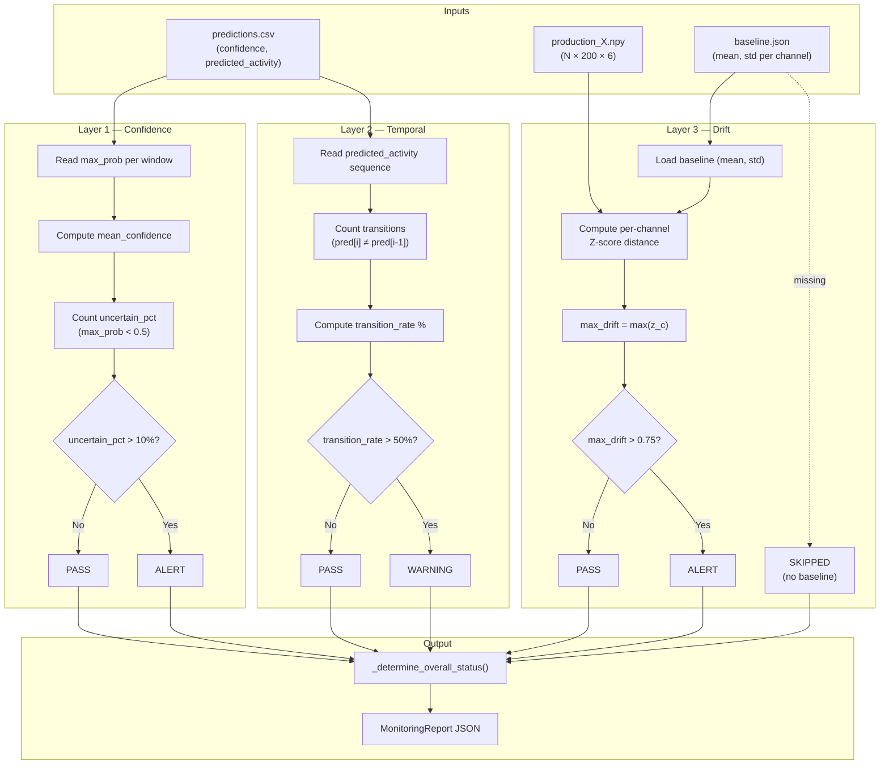
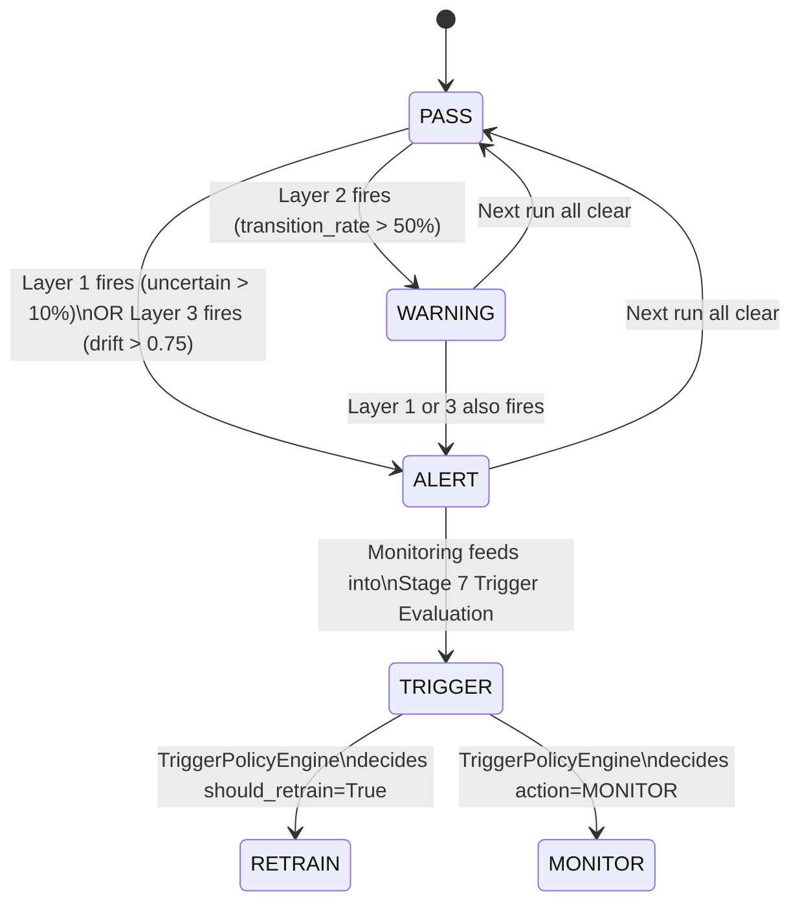

# 12 — Stage Deep-Dive: Post-Inference Monitoring — 3-Layer Architecture

> Part of [Opus Understanding Audit Pack](00_README.md) | Phase 2 — Technical Stage Deep-Dives
> **Commit:** `168c05bb` | **Audit Date:** 2026-02-22

---

## 1. Why Three Layers?

The monitoring system decomposes post-inference health into three **orthogonal** signal families, each catching a distinct failure mode that the others miss:

| Layer | Signal Family | Detects | Misses |
|-------|--------------|---------|--------|
| **L1 — Confidence** | Softmax calibration | Model uncertainty, OOD inputs, calibration drift | Silent misclassification at high confidence |
| **L2 — Temporal** | Prediction sequence coherence | Erratic class-switching, noisy data, sensor failure | Persistent systematic misclassification |
| **L3 — Drift** | Input feature distribution shift | Sensor bias/gain changes, population shift, environment change | Covariate shift that preserves Z-score distance |

**FACT:** All three layers are implemented in `scripts/post_inference_monitoring.py` and wrapped by `src/components/post_inference_monitoring.py` (Component 6).
[CODE: scripts/post_inference_monitoring.py | class:PostInferenceMonitor]

**INFERENCE:** The 3-layer design follows the MLOps "monitoring triangle" pattern (Google ML Test Score, Sculley et al. 2015) — data monitoring, prediction monitoring, and model-level monitoring — adapted for IMU HAR.

---

## 2. Layer-by-Layer Analysis

### 2.1 Layer 1 — Confidence Analysis

**What it computes:**
```
mean_confidence = mean(max_prob per window)
uncertain_percentage = 100 × (count(max_prob < confidence_threshold) / N)
```

| Parameter | Value | Source |
|-----------|-------|--------|
| `confidence_threshold` | **0.5** | Constructor arg, default in config |
| `uncertain_threshold_pct` | **10.0%** | Constructor arg, default in config |
| Alert condition | `uncertain_pct > 10%` | Hardcoded comparison |

**FACT:** Reads `confidence` column from predictions CSV. Optionally reads `is_uncertain` column if present.
[CODE: scripts/post_inference_monitoring.py | method:_analyze_confidence]

**RISK:** Softmax confidence is notoriously miscalibrated for neural networks (Guo et al. 2017). Without temperature scaling at inference time, Layer 1 may under-report or over-report uncertainty.

### 2.2 Layer 2 — Temporal Pattern Analysis

**What it computes:**
```
transition_rate = 100 × (count(pred[i] ≠ pred[i-1]) / (N-1))
```

Also computes longest consecutive sequence per class (logged but not used for alerting).

| Parameter | Value | Source |
|-----------|-------|--------|
| Alert threshold | **50%** transition rate | **Hardcoded** in method body |
| Alert level | WARNING (not ALERT) | Hardcoded |

**FACT:** Reads `predicted_activity` column from predictions CSV.
[CODE: scripts/post_inference_monitoring.py | method:_analyze_temporal_patterns]

**INFERENCE:** The 50% threshold is generous — typical HAR sessions with 11 classes have natural transition rates ≈5–15%. This threshold will only fire on severely noisy data or sensor failure.

### 2.3 Layer 3 — Drift Analysis (Z-score Distance)

**What it computes:**
```
for each channel c ∈ {Ax, Ay, Az, Gx, Gy, Gz}:
    drift_c = |mean(prod_c) - baseline_mean_c| / (baseline_std_c + 1e-8)
max_drift = max(drift_c for all c)
```

| Parameter | Value | Source |
|-----------|-------|--------|
| `drift_threshold` | **0.75** | Data-driven: median of N=24 session distances = 0.748 |
| Alert condition | `max_drift > 0.75` → ALERT | Constructor arg |
| Baseline format | JSON with `{"mean": [...], "std": [...]}` | Normalized per-channel stats |

**FACT:** Layer 3 is **optional** — skipped if `baseline_path` is `None` or file does not exist.
[CODE: scripts/post_inference_monitoring.py | method:_analyze_drift]

**FACT:** Baseline schema guard at line ~219: requires keys `{"mean", "std"}`; raises `ValueError` with remediation message if missing.

**FACT:** Layer 3 is wrapped in `try/except Exception` — status becomes `"ERROR"` on failure (graceful degradation).

**RISK:** Z-score drift is a **univariate, first-moment** test. It cannot detect multivariate covariance shifts or higher-moment changes (e.g., increased variance without mean change). The Wasserstein drift detector (`src/wasserstein_drift.py`) is more powerful but operates in a **separate pipeline component** (Stage 7 via trigger evaluation), not in Layer 3 directly.

---

## 3. Overall Status Determination

```python
def _determine_overall_status(report):
    if any ALERT in [layer1, layer2, layer3]:
        return "ALERT"
    if any WARNING in [layer1, layer2, layer3]:
        return "WARNING"
    return "PASS"
```

**FACT:** [CODE: scripts/post_inference_monitoring.py | method:_determine_overall_status]

---

## 4. Threshold Provenance

| Threshold | Value | Derivation | Evidence Label |
|-----------|-------|-----------|----------------|
| `confidence_threshold` | 0.5 | **Hardcoded default** — standard softmax midpoint | ASSUMPTION — not calibrated to this model |
| `uncertain_threshold_pct` | 10% | **Hardcoded default** | ASSUMPTION |
| `drift_threshold` | 0.75 | **Data-driven**: median Z-score distance across N=24 training sessions | FACT — derived from baseline builder |
| Temporal threshold | 50% | **Hardcoded** in method body | ASSUMPTION — very permissive |

---

## 5. Mermaid: Monitoring Data Flow



---

## 6. Mermaid: Alert Escalation State Machine



> See [14_STAGE_RETRAINING_TRIGGER_GOVERNANCE_ROLLBACK.md](14_STAGE_RETRAINING_TRIGGER_GOVERNANCE_ROLLBACK.md) for full trigger logic.

---

## 7. Pipeline Monitoring vs. API Inline Monitoring

The repository contains **two parallel implementations** of the 3-layer monitoring:

| Aspect | Pipeline Monitoring | API Inline Monitoring |
|--------|--------------------|-----------------------|
| **File** | `scripts/post_inference_monitoring.py` | `src/api/app.py` (`_run_monitoring()`) |
| **Invoked by** | Component 6 via orchestrator | `/api/upload` endpoint |
| **Layer 1 thresholds** | conf=0.5, uncertain=10% | conf=0.5, uncertain=30% |
| **Layer 2 threshold** | 50% transition rate | 50% transition rate |
| **Layer 3 method** | Z-score with .npy + JSON baseline | Z-score with JSON baseline only |
| **Layer 3 threshold** | 0.75 | 2.0 |
| **Output** | JSON file + artifact | JSON response inline |
| **Feeds trigger?** | Yes → Stage 7 | No |

**RISK:** The two implementations have **divergent thresholds** (L1 uncertain: 10% vs 30%; L3 drift: 0.75 vs 2.0). This creates inconsistent alert sensitivity between batch pipeline runs and real-time API inference. If the thesis discusses "monitoring", it must clarify which implementation is referenced.
[CODE: src/api/app.py | function:_run_monitoring]
[CODE: scripts/post_inference_monitoring.py | class:PostInferenceMonitor]

---

## 8. Baseline Dependency and Staleness Risk

**Baseline sources:**
- Pipeline: reads from `models/normalized_baseline.json` (shared path) or per-run artifact path
- API: reads from `PROJECT_ROOT / "models" / "normalized_baseline.json"` at startup

**Governance flow:**
1. Stage 10 (`BaselineUpdate`) can rebuild baselines from new data
2. By default, `promote_to_shared=False` — baseline is artifact-only (safe)
3. Only when `--update-baseline` CLI flag is set does the new baseline overwrite the shared path
4. Until promoted, monitoring continues using the **old** baseline

**FACT:** [CODE: src/components/baseline_update.py | field:promote_to_shared]

**RISK:** If retraining runs without `--update-baseline`, the monitoring baseline becomes stale — it reflects the training distribution, not the adapted model's expected distribution. This can cause false drift alerts on the adapted model's new behavior.

---

## 9. Test Coverage

| Test File | Layer Coverage | Evidence |
|-----------|---------------|----------|
| `tests/test_monitoring.py` | All 3 layers + edge cases | [TEST: tests/test_monitoring.py] |
| `tests/test_trigger.py` | Trigger integration with monitoring output | [TEST: tests/test_trigger.py] |
| `tests/test_api.py` | API inline monitoring | [TEST: tests/test_api.py] |

**INFERENCE:** Test coverage for the monitoring module appears comprehensive based on test file presence and test function count (Phase 1 audit counted 215 total test functions across 19 files).

---

## 10. Critical Findings

| # | Finding | Severity | Evidence |
|---|---------|----------|----------|
| M-1 | API and pipeline monitoring have divergent thresholds | **HIGH** | [CODE: src/api/app.py:_run_monitoring] vs [CODE: scripts/post_inference_monitoring.py] |
| M-2 | Layer 3 uses simple Z-score, not Wasserstein | **MEDIUM** | Z-score is L1-norm on means; Wasserstein is in a separate component |
| M-3 | Layer 2 threshold (50%) is very permissive | **LOW** | Normal HAR transition rates are 5–15% |
| M-4 | No Layer 4 for label-quality or concept drift | **INFO** | Would require ground-truth labels (not available in production) |
| M-5 | Baseline staleness after adaptation without `--update-baseline` | **HIGH** | [CODE: src/components/baseline_update.py] |

---

## 11. Recommendations for Thesis

1. **Unify thresholds**: Create a single `MonitoringConfig` dataclass shared by both pipeline and API implementations
2. **Layer 3 upgrade**: Consider making Wasserstein distance available as a Layer 3 option (currently only used in trigger)
3. **Document threshold rationale**: The 0.75 drift threshold has data-driven provenance (N=24 sessions) — this is thesis-worthy and should be explicitly described
4. **Staleness guard**: Add a timestamp check — if baseline is >N days old relative to current data, emit a WARNING
