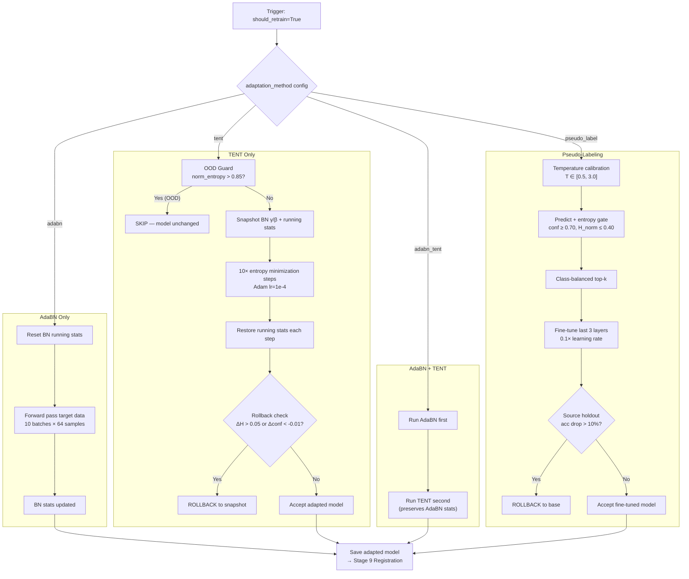
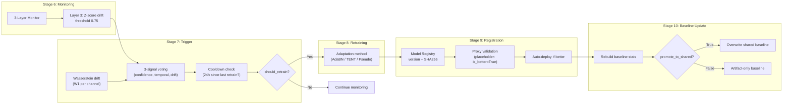

# 13 — Stage Deep-Dive: Drift Detection, Calibration, and Domain Adaptation

> Part of [Opus Understanding Audit Pack](00_README.md) | Phase 2 — Technical Stage Deep-Dives
> **Commit:** `168c05bb` | **Audit Date:** 2026-02-22

---

## 1. Drift Detection

### 1.1 Wasserstein Drift Detector

The primary statistical drift detector uses **Wasserstein-1 distance** (Earth Mover's Distance) per IMU channel.

**FACT:** Implemented in `src/wasserstein_drift.py` — class `WassersteinDriftDetector`.
[CODE: src/wasserstein_drift.py | class:WassersteinDriftDetector]

**Algorithm:**
```
for each channel c ∈ {Ax, Ay, Az, Gx, Gy, Gz}:
    W1_c = wasserstein_distance(flatten(baseline_c), flatten(production_c))
    status_c = CRITICAL if W1_c > 0.5
               WARNING  if W1_c > 0.3
               NORMAL   otherwise

overall = CRITICAL if n_critical ≥ 4
          WARNING  if n_warn ≥ 2
          NORMAL   otherwise
```

| Parameter | Default | Meaning |
|-----------|---------|---------|
| `warn_threshold` | **0.3** | Per-channel W1 → WARNING |
| `critical_threshold` | **0.5** | Per-channel W1 → CRITICAL |
| `min_drifted_channels_warn` | **2** | Channels needed for overall WARNING |
| `min_drifted_channels_critical` | **4** | Channels needed for overall CRITICAL |
| `sensor_columns` | `["Ax","Ay","Az","Gx","Gy","Gz"]` | 6 IMU channels |

**FACT:** Uses `scipy.stats.wasserstein_distance` with a NumPy CDF fallback if SciPy is unavailable.
[CODE: src/wasserstein_drift.py | method:wasserstein_1d]

**INFERENCE:** The 2-of-6 / 4-of-6 voting scheme provides robustness — a single noisy channel does not trigger retraining. This is appropriate for IMU data where individual axes can be affected by mounting orientation.

### 1.2 Change-Point Detection

The `WassersteinChangePointDetector` applies **rolling Z-score** analysis on a time series of Wasserstein distances:

```
z_t = (W1_t - rolling_mean(W1, window)) / (rolling_std(W1, window) + ε)
change_point if z_t > cpd_threshold
```

| Parameter | Default |
|-----------|---------|
| `window_size_cpd` | **50** data points |
| `cpd_threshold` | **2.0** standard deviations |

**FACT:** [CODE: src/wasserstein_drift.py | class:WassersteinChangePointDetector]

**ASSUMPTION:** The change-point detector requires a time series of ≥51 Wasserstein measurements, implying it is designed for long-running monitoring (not single-batch detection).

### 1.3 Drift Detection vs. Monitoring Layer 3

| Aspect | Monitoring Layer 3 | Wasserstein Drift |
|--------|-------------------|-------------------|
| **Metric** | Z-score distance on means | Wasserstein-1 on full distributions |
| **Sensitivity** | Mean-only | Full distribution (captures variance, shape) |
| **Channels** | max across all | Per-channel with voting (2-of-6, 4-of-6) |
| **Threshold** | 0.75 (data-driven, N=24) | 0.3 / 0.5 (configurable) |
| **Location** | Stage 6 (monitoring) | Stage 7 (trigger evaluation) |
| **Output** | Alert status | Feeds trigger policy engine |

---

## 2. Calibration and Uncertainty Quantification

### 2.1 Temperature Scaling

**FACT:** Implemented in `src/calibration.py` — class `TemperatureScaler`.
[CODE: src/calibration.py | class:TemperatureScaler]

**Algorithm:**
```
T* = argmin_{T ∈ [0.1, 10.0]}  NLL(softmax(logits / T), labels)
calibrated_probs = softmax(logits / T*)
```

| Parameter | Default |
|-----------|---------|
| `initial_temperature` | **1.5** |
| `lr` | **0.01** |
| `max_iter` | **100** |
| Optimization | `scipy.optimize.minimize_scalar`, bounds [0.1, 10.0] |

**INFERENCE:** Temperature scaling is the gold-standard post-hoc calibration method (Guo et al. 2017). A fitted T > 1 "softens" overconfident predictions; T < 1 "sharpens" them.

### 2.2 MC Dropout Uncertainty Estimation

**FACT:** Implemented in `src/calibration.py` — class `MCDropoutEstimator`.
[CODE: src/calibration.py | class:MCDropoutEstimator]

**Algorithm:**
```
for pass = 1 to n_passes:
    probs_pass = model.predict(X, training=True)  # dropout active
mean_probs = mean(probs_pass)

predictive_entropy = -Σ mean_probs × log(mean_probs)           # total uncertainty
expected_entropy   = mean(-Σ probs_pass × log(probs_pass))     # aleatoric
mutual_information = predictive_entropy - expected_entropy       # epistemic
```

| Parameter | Default |
|-----------|---------|
| `mc_forward_passes` | **30** |
| `mc_dropout_rate` | **0.2** |

**FACT:** Returns 6 outputs: `mean_probs`, `predictive_entropy`, `mutual_information` (epistemic), `expected_entropy` (aleatoric), `std_probs`, `all_probs`.

**INFERENCE:** Mutual information (epistemic uncertainty) is the key metric for detecting OOD inputs — high MI means the model "doesn't know" rather than the data being inherently ambiguous.

### 2.3 Calibration Evaluation (ECE)

**FACT:** `CalibrationEvaluator` computes Expected Calibration Error:
```
ECE = Σ_b (n_b / N) × |accuracy_b - confidence_b|     with n_bins = 15
```
[CODE: src/calibration.py | class:CalibrationEvaluator]

| Parameter | Default |
|-----------|---------|
| `n_bins` | **15** |
| `confidence_warn_threshold` | **0.65** |
| `entropy_warn_threshold` | **1.5** |

### 2.4 Integration Status

**RISK:** Calibration (`src/calibration.py`) is **NOT orchestrated** in the production pipeline. The pipeline's `ALL_STAGES` list (stages 1–10) does not include a calibration stage. Calibration is only used:
- Internally by TENT adaptation (entropy computation)
- Internally by pseudo-labeling (temperature grid search)
- Available as standalone script

[CODE: src/pipeline/production_pipeline.py | ALL_STAGES]

---

## 3. Domain Adaptation Methods

### 3.1 AdaBN — Adaptive Batch Normalization

**Purpose:** Align BatchNormalization running statistics (μ, σ²) to target domain data without modifying any learned weights.

**FACT:** Implemented in `src/domain_adaptation/adabn.py`.
[CODE: src/domain_adaptation/adabn.py | function:adapt_bn_statistics]

**What it touches:**
- **Only** `keras.layers.BatchNormalization` layers
- Modifies: `moving_mean`, `moving_variance`
- Does NOT modify: `gamma` (scale), `beta` (shift), conv/LSTM/dense kernels

**Algorithm:**
```
1. RESET running stats: mean→0, variance→1
2. FREEZE all layers except BN (BN must be trainable=True for TF2 stat updates)
3. Forward pass with training=True on n_batches of target data
   → BN layers accumulate new running statistics from target distribution
4. RESTORE original trainable flags
```

| Parameter | Default |
|-----------|---------|
| `n_batches` | **10** |
| `batch_size` | **64** |
| `reset_stats` | **True** |

**INFERENCE:** AdaBN is the lightest adaptation method — zero gradient steps, zero parameter changes. It only re-estimates the batch statistics that BN layers use during inference. Suitable when the shift is primarily in input distribution moments, not in the decision boundary.

### 3.2 TENT — Test-Time Entropy Minimization

**Purpose:** Fine-tune only BN affine parameters (γ, β) by minimizing prediction entropy on unlabeled target data.

**FACT:** Implemented in `src/domain_adaptation/tent.py`.
[CODE: src/domain_adaptation/tent.py | function:tent_adapt]

**Algorithm:**
```
1. OOD GUARD: Compute normalized entropy on first 256 samples
   If mean_normalized_entropy > 0.85 → SKIP TENT, return original model
2. SNAPSHOT all BN gamma/beta (for rollback) and running stats
3. For step = 1 to n_steps:
   a. Sample batch_size target windows
   b. Forward pass with training=True
   c. Loss = mean(-Σ probs × log(probs + 1e-9))     # entropy
   d. Backprop to gamma/beta only (all other params frozen)
   e. RESTORE running stats from snapshot (prevent side-effect corruption)
4. ROLLBACK CHECK:
   If entropy_delta > 0.05 (entropy increased) → rollback
   If confidence_delta < -0.01 (confidence dropped) → rollback
```

| Parameter | Default |
|-----------|---------|
| `ood_entropy_threshold` | **0.85** (normalized) |
| `rollback_threshold` | **0.05** (entropy delta) |
| `confidence_drop_threshold` | **0.01** (hard-coded) |
| `n_steps` | **10** |
| `learning_rate` | **1e-4** (Adam) |
| `batch_size` | **64** |

**Safety mechanisms (3 gates):**

| Gate | Condition | Action |
|------|-----------|--------|
| **OOD Guard** | `mean_normalized_entropy > 0.85` | Skip TENT entirely; log "quarantine recommended" |
| **Entropy Gate** | `entropy_after - entropy_before > 0.05` | Rollback all γ/β to snapshot |
| **Confidence Gate** | `confidence_after - confidence_before < -0.01` | Rollback all γ/β to snapshot |

**Critical implementation detail:** After each TENT gradient step with `training=True`, TF2 side-effect updates BN `moving_mean`/`moving_variance`. The code **restores running stats from snapshot after every step** to preserve AdaBN calibration.
[CODE: src/domain_adaptation/tent.py | function:tent_adapt — running stats restoration loop]

### 3.3 AdaBN + TENT (Combined)

**FACT:** `src/components/model_retraining.py` method `_run_adabn_then_tent` runs AdaBN first, then TENT.
[CODE: src/components/model_retraining.py | method:_run_adabn_then_tent]

**Flow:**
```
1. AdaBN: Replace BN running stats with target distribution stats
2. TENT: Fine-tune BN gamma/beta via entropy minimization
   (running stats preserved from step 1 via snapshot restoration)
```

**INFERENCE:** This is the recommended 2-stage approach: AdaBN handles the first-moment shift (mean/variance alignment), then TENT refines the affine parameters to minimize prediction uncertainty.

### 3.4 Pseudo-Labeling (Calibrated)

**FACT:** Implemented in `src/train.py` — class `DomainAdaptationTrainer`, method `_retrain_pseudo_labeling`.
[CODE: src/train.py | method:_retrain_pseudo_labeling]

**Algorithm (7 stages):**
```
1. TEMPERATURE CALIBRATION: Grid search T ∈ [0.5, 3.0] on source holdout
2. PREDICT: Apply scaled softmax to target data
3. ENTROPY GATE: Filter samples with confidence ≥ 0.70 AND norm_entropy ≤ 0.40
4. CLASS-BALANCED TOP-K: Per-class quota = max(30, 10% × |source| / n_classes)
5. LABEL SMOOTHING: Pseudo-labeled samples get smoothing=0.10
6. SELF-CONSISTENCY FILTER: Keep only source samples where model agrees with ground truth
7. FINE-TUNE: Freeze early layers, train last 3 layers at 0.1× learning rate
8. ROLLBACK: If source holdout accuracy drops > 10% → revert to base model
```

| Parameter | Value |
|-----------|-------|
| Confidence threshold | **0.70** |
| Entropy threshold | **0.40** (normalized) |
| Label smoothing | **0.10** |
| Rollback threshold | **0.10** (10% accuracy drop) |
| Layers fine-tuned | Last 3 only |
| Learning rate | **0.1× base** (0.0001) |

**INFERENCE:** This is a sophisticated pseudo-labeling pipeline with 5 safety mechanisms (temperature calibration, entropy gating, class-balanced selection, self-consistency filter, rollback safety). It substantially exceeds naive self-training.

### 3.5 Method Comparison

| Method | Parameters Changed | Gradient Steps | Labels Needed | Safety Gates | Complexity |
|--------|-------------------|----------------|---------------|-------------|------------|
| **AdaBN** | BN running stats only | 0 | None | None | Trivial |
| **TENT** | BN γ, β | 10 | None | 3 (OOD, entropy, confidence) | Low |
| **AdaBN+TENT** | BN stats + γ, β | 10 | None | 3 | Low |
| **Pseudo-label** | Last 3 layers | Full epochs | Pseudo (generated) | 5 (temp, entropy, balanced, consistency, rollback) | High |

---

## 4. Mermaid: Adaptation Decision Flow



---

## 5. Mermaid: Drift Detection to Adaptation Pipeline



---

## 6. Critical Findings

| # | Finding | Severity | Evidence |
|---|---------|----------|----------|
| D-1 | Calibration not orchestrated in pipeline stages | **HIGH** | `ALL_STAGES` has no calibration entry |
| D-2 | TENT has robust 3-gate safety (OOD, entropy, confidence) | **STRENGTH** | [CODE: src/domain_adaptation/tent.py] |
| D-3 | Pseudo-labeling has 5 safety mechanisms | **STRENGTH** | [CODE: src/train.py:_retrain_pseudo_labeling] |
| D-4 | Model registration uses `is_better=True` placeholder | **HIGH** | [CODE: src/components/model_registration.py:L69-L75] |
| D-5 | DANN and MMD adaptation methods fall back to pseudo-labeling | **MEDIUM** | [CODE: src/train.py:_retrain_dann, _retrain_mmd] |
| D-6 | Running stats restoration in TENT prevents AdaBN corruption | **STRENGTH** | [CODE: src/domain_adaptation/tent.py — post-step restoration] |

---

## 7. Recommendations for Thesis

1. **Calibration integration**: Add temperature scaling as a post-inference step before monitoring — this would improve Layer 1 reliability
2. **Proxy validation**: Replace `is_better=True` with actual metric comparison (e.g., compare ECE, F1 on holdout)
3. **Ablation study**: Compare AdaBN-only vs TENT-only vs AdaBN+TENT vs pseudo-labeling on cross-dataset transfers
4. **DANN/MMD**: Either implement properly or remove from the codebase to avoid confusion — currently they silently redirect to pseudo-labeling
