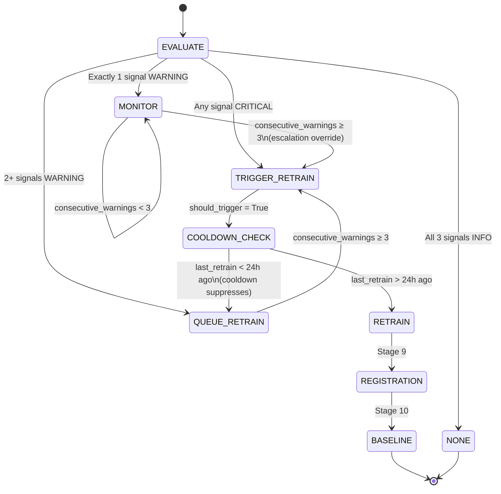
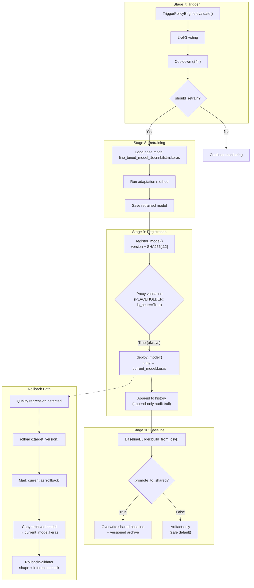

# 14 — Stage Deep-Dive: Retraining Trigger, Governance, and Rollback

> Part of [Opus Understanding Audit Pack](00_README.md) | Phase 2 — Technical Stage Deep-Dives
> **Commit:** `168c05bb` | **Audit Date:** 2026-02-22

---

## 1. Trigger Policy Engine

### 1.1 Architecture

**FACT:** The trigger engine is implemented in `src/trigger_policy.py` (~822 lines) and wrapped by `src/components/trigger_evaluation.py` (Component 7).
[CODE: src/trigger_policy.py | class:TriggerPolicyEngine]

The engine evaluates 3 independent signal categories, each producing an alert level, then applies **2-of-3 voting** to decide the action.

### 1.2 Signal Categories

| Signal | Metrics Evaluated | WARNING Threshold | CRITICAL Threshold |
|--------|------------------|-------------------|-------------------|
| **Confidence** | `mean_confidence`, `mean_entropy`, `uncertain_ratio` | conf < 0.55 OR entropy > 1.8 OR uncertain > 0.20 | conf < 0.45 OR entropy > 2.2 OR uncertain > 0.35 |
| **Temporal** | `flip_rate`, `mean_dwell_time_seconds`, `short_dwell_ratio` | flip > 0.25 | flip > 0.40 |
| **Drift** | `aggregate_drift_score`, `n_drifted_channels`, `ks_pvalue` | PSI > 0.75 OR W1 > 0.3 OR drifted ≥ 2 | PSI > 1.50 OR W1 > 0.5 OR drifted ≥ 4 |

### 1.3 Complete Threshold Table

| Parameter | Default | Category |
|-----------|---------|----------|
| `confidence_warn` | **0.55** | Confidence |
| `confidence_critical` | **0.45** | Confidence |
| `entropy_warn` | **1.8** | Confidence |
| `entropy_critical` | **2.2** | Confidence |
| `uncertain_ratio_warn` | **0.20** | Confidence |
| `uncertain_ratio_critical` | **0.35** | Confidence |
| `flip_rate_warn` | **0.25** | Temporal |
| `flip_rate_critical` | **0.40** | Temporal |
| `ks_pvalue_threshold` | **0.01** | Drift |
| `psi_warn` | **0.75** | Drift (data-driven, N=24) |
| `psi_critical` | **1.50** | Drift |
| `wasserstein_warn` | **0.3** | Drift |
| `wasserstein_critical` | **0.5** | Drift |
| `min_drifted_channels_warn` | **2** | Drift |
| `min_drifted_channels_critical` | **4** | Drift |
| `min_signals_for_retrain` | **2** | Voting |
| `consecutive_warnings_for_trigger` | **3** | Escalation |

**FACT:** [CODE: src/trigger_policy.py | class:TriggerThresholds]

### 1.4 Voting Logic

```python
# _aggregate_signals() pseudocode
signals = [confidence_level, temporal_level, drift_level]  # each is INFO/WARNING/CRITICAL

if any(s == CRITICAL for s in signals):
    action = TRIGGER_RETRAIN
    should_trigger = True
elif count(s == WARNING for s in signals) >= 2:    # 2-of-3 voting
    action = QUEUE_RETRAIN
    should_trigger = False
elif count(s == WARNING for s in signals) == 1:
    action = MONITOR
    should_trigger = False
else:  # all INFO
    action = NONE
    should_trigger = False

# Escalation override
if consecutive_warnings >= 3:
    should_trigger = True  # force retrain
```

**Actions enum:**

| `TriggerAction` | Meaning |
|-----------------|---------|
| `NONE` | All signals healthy |
| `MONITOR` | 1 warning — watch closely |
| `QUEUE_RETRAIN` | 2+ warnings — queue for next maintenance window |
| `TRIGGER_RETRAIN` | Any CRITICAL or 3 consecutive warnings — retrain immediately |
| `ROLLBACK` | (reserved, not currently auto-triggered) |

**FACT:** [CODE: src/trigger_policy.py | method:_aggregate_signals]

### 1.5 Cooldown Mechanism

| Parameter | Default |
|-----------|---------|
| `retrain_cooldown_hours` | **24** |
| `alert_cooldown_minutes` | **30** |
| `batch_accumulation_min` | **100** |

**Logic:** If `should_trigger=True` but last retrain was < 24 hours ago → **suppresses trigger**, downgrades to `QUEUE_RETRAIN`.

**FACT:** [CODE: src/trigger_policy.py | method:_apply_cooldowns, class:CooldownConfig]

### 1.6 State Persistence

State is persisted as JSON at `LOGS_DIR/trigger_state.json`:
```json
{
    "last_retrain_timestamp": "2026-02-19T...",
    "warning_count": 0,
    "consecutive_warnings": 0,
    "batches_since_retrain": 0,
    "alert_history": [...]   // capped at 100 entries
}
```

**FACT:** The state file is append-only for `alert_history` (capped at 100) and tracks `consecutive_warnings` across successive evaluations for escalation logic.

---

## 2. Trigger Evaluation Wrapper — Known Issues

**FACT:** `src/components/trigger_evaluation.py` transforms the 3-layer monitoring report into trigger-engine format:

| Monitoring Metric | Trigger Engine Field | Mapping |
|-------------------|---------------------|---------|
| `uncertain_percentage` | `uncertain_ratio` | `uncertain_percentage / 100` |
| `transition_rate` | `flip_rate` | `transition_rate / 100` |
| `max_drift` | `aggregate_drift_score` | Direct pass-through |
| — | `mean_entropy` | **Hardcoded to 0.0** |
| — | `mean_dwell_time_seconds` | **Hardcoded to 0.0** |
| — | `short_dwell_ratio` | **Hardcoded to 0.0** |
| — | `n_drifted_channels` | **Hardcoded to 0** |

**RISK:** 4 metrics are **placeholder zeros**. This means:
- The entropy signal in the confidence category is **always healthy** (0.0 < 1.8 warn threshold)
- The temporal dwell metrics are **never evaluated**
- The drift channel count is **always zero** (never meets ≥2 threshold for drift WARNING from that sub-signal)

[CODE: src/components/trigger_evaluation.py:L73-L82]

**Impact:** The trigger policy engine's drift assessment is partially blind — it can only use `aggregate_drift_score` (PSI/Wasserstein), not the per-channel count. Similarly, entropy-based detection is completely disabled.

---

## 3. Mermaid: Trigger Policy State Machine



---

## 4. Model Governance — Registry and Versioning

### 4.1 Model Registry

**FACT:** Implemented in `src/model_rollback.py` (~532 lines).
[CODE: src/model_rollback.py | class:ModelRegistry]

**Registry structure** (`model_registry.json`):
```json
{
    "models": {
        "<version>": {
            "version": "v1.0",
            "path": "/path/to/model.keras",
            "created_at": "2026-02-19T...",
            "deployed_at": "2026-02-19T...",
            "metrics": { "accuracy": 0.95, "f1_macro": 0.93 },
            "config_hash": "a1b2c3d4e5f6",
            "data_version": "training_v1",
            "status": "deployed"
        }
    },
    "current_version": "v1.0",
    "history": [
        { "action": "deploy", "version": "v1.0", "previous_version": null, "timestamp": "..." }
    ]
}
```

### 4.2 SHA256 Fingerprinting

**FACT:** `_compute_hash(file_path)` reads the model file in 4096-byte blocks, computes SHA256, returns the **first 12 hex characters** as `config_hash`.
[CODE: src/model_rollback.py | method:_compute_hash]

**INFERENCE:** The 12-char prefix provides 48 bits of collision resistance — sufficient for a model registry (not cryptographic security).

### 4.3 Version Statuses

| Status | Meaning |
|--------|---------|
| `deployed` | Currently active model |
| `archived` | Previous version, available for rollback |
| `rollback` | Was deployed but rolled back |

---

## 5. Rollback Mechanism

### 5.1 How Rollback Works

```python
def rollback(target_version=None):
    1. If no target: find most recent previous deploy in history,
       or fall back to newest archived version
    2. Mark CURRENT version as status='rollback'
    3. deploy_model(target_version):
       a. Copy model file → models/pretrained/current_model.keras (Windows: copy, not symlink)
       b. Mark old current as 'archived', new as 'deployed'
       c. Append to history
    4. Append 'rollback' action to history with from/to versions
```

**FACT:** History is **append-only** — provides full audit trail.
[CODE: src/model_rollback.py | method:rollback]

### 5.2 Rollback Validation

**FACT:** `RollbackValidator` performs two checks:
1. `validate_model_file(path)` — loads model, verifies `input_shape` and `output_shape`
2. `validate_inference(path)` — random input `(1, 200, 6)` → expects output `(1, 11)`, checks `sum(probs) ≈ 1.0` (atol=0.01)

[CODE: src/model_rollback.py | class:RollbackValidator]

### 5.3 CLI Interface

```bash
python src/model_rollback.py --list              # List all registered models
python src/model_rollback.py --current           # Show current deployed version
python src/model_rollback.py --history           # Full deployment history
python src/model_rollback.py --rollback          # Rollback to previous version
python src/model_rollback.py --rollback --version v1.0  # Rollback to specific version
python src/model_rollback.py --register model.keras     # Register new model
python src/model_rollback.py --deploy v2.0       # Deploy specific version
python src/model_rollback.py --validate model.keras     # Validate model file
```

---

## 6. Model Registration (Component 9)

**FACT:** `src/components/model_registration.py` wraps the registry:
[CODE: src/components/model_registration.py]

**Flow:**
1. Creates `ModelRegistry` from config `registry_dir`
2. Calls `registry.register_model(model_path, version, metrics)`
3. **Proxy validation** (if `config.proxy_validation`): currently `is_better=True` **always** (placeholder)
4. If `config.auto_deploy and is_better` → `registry.deploy_model(version)`
5. Returns `ModelRegistrationArtifact`

**RISK:** `is_better=True` placeholder means **every retrained model is auto-deployed** regardless of quality. This bypasses the intended governance gate.
[CODE: src/components/model_registration.py:L69-L75]

### 6.1 Proxy Model Validator

**FACT:** `ProxyModelValidator` in `src/trigger_policy.py` compares old vs new model on proxy metrics:
- Confidence (higher = better)
- Entropy (lower = better)
- Flip rate (lower = better)
- `improvement_threshold = 0.05` (5% relative)
- Requires **≥2 of 3** metrics improved AND no significant regression

[CODE: src/trigger_policy.py | class:ProxyModelValidator]

**RISK:** The `ProxyModelValidator` exists in the trigger module but is **not wired** into the registration component. The registration component uses its own placeholder logic instead.

---

## 7. Baseline Governance (Component 10)

**FACT:** `src/components/baseline_update.py` manages baseline lifecycle.
[CODE: src/components/baseline_update.py]

| `promote_to_shared` | Behavior |
|---------------------|----------|
| **False** (default) | Writes baseline to **artifact dir only**. Shared `models/` path unchanged. Logs: "NOT promoted…Re-run with --update-baseline to promote." |
| **True** | Writes to shared paths (`training_baseline.json`, `normalized_baseline.json`). Creates **versioned archive** in `baseline_versions/` subdirectory. |

**Versioning:** When promoted, creates `baseline_versions/training_baseline_YYYYMMDD_HHMMSS.json` — enables rollback of the monitoring baseline.

**MLflow integration:** If an active MLflow run exists, logs baseline files as artifacts and records `baseline_promoted` parameter.

---

## 8. Mermaid: Full Retrain Cycle Governance



---

## 9. Critical Findings

| # | Finding | Severity | Evidence |
|---|---------|----------|----------|
| T-1 | 4 placeholder zeros in trigger evaluation wrapper | **CRITICAL** | [CODE: src/components/trigger_evaluation.py:L73-L82] |
| T-2 | `is_better=True` always — governance gate bypassed | **CRITICAL** | [CODE: src/components/model_registration.py:L69-L75] |
| T-3 | `ProxyModelValidator` exists but not wired to registration | **HIGH** | [CODE: src/trigger_policy.py:ProxyModelValidator] vs registration component |
| T-4 | Cooldown mechanism well-designed (24h suppression) | **STRENGTH** | [CODE: src/trigger_policy.py:_apply_cooldowns] |
| T-5 | Rollback validator checks shape + inference | **STRENGTH** | [CODE: src/model_rollback.py:RollbackValidator] |
| T-6 | Baseline versioned archive provides rollback capability | **STRENGTH** | [CODE: src/components/baseline_update.py] |
| T-7 | History is append-only — full audit trail | **STRENGTH** | [CODE: src/model_rollback.py] |
| T-8 | Stages 8-10 not in default pipeline execution | **HIGH** | `ALL_STAGES` default excludes RETRAIN_STAGES |

---

## 10. Recommendations for Thesis

1. **Fix placeholder zeros**: Wire `mean_entropy`, `mean_dwell_time_seconds`, `short_dwell_ratio`, `n_drifted_channels` from monitoring to trigger
2. **Wire ProxyModelValidator**: Replace `is_better=True` with actual ProxyModelValidator comparison in registration component
3. **Orchestrate stages 8-10**: Add to default pipeline execution or document the `--enable-retrain` flag prominently
4. **Thesis figure**: The 2-of-3 voting + cooldown + escalation design is a strong contribution — create a dedicated thesis figure for it
5. **Rollback testing**: Add integration test that exercises the full rollback path (register → deploy → detect regression → rollback → validate)
- Rollback test results
