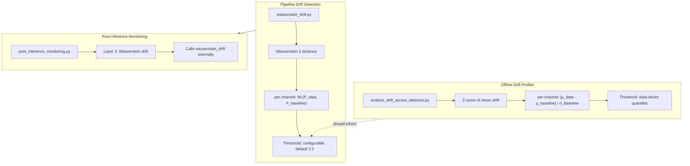

# 16 — Cross-Dataset Comparison and Drift Analysis

> **Status:** COMPLETE — Phase 2  
> **Repository Snapshot:** `168c05bb222b03e699acb7de7d41982e886c8b25`  
> **Auditor:** Automated deep-dive (Claude Opus 4.6)  
> **Sources:** `batch_process_all_datasets.py` (439 lines), `scripts/analyze_drift_across_datasets.py` (110 lines), `generate_summary_report.py` (205 lines), `src/wasserstein_drift.py`, `scripts/post_inference_monitoring.py`

---

## 1 Dataset Inventory

### 1.1 Raw Data Layout

All recordings reside under `data/raw/` as paired CSV files:

```
data/raw/
  ├── <timestamp>_accelerometer.csv      (3-axis: Ax, Ay, Az)
  └── <timestamp>_gyroscope.csv          (3-axis: Gx, Gy, Gz)
```

**Discovery logic** (`batch_process_all_datasets.py:30-44`):
```
glob("data/raw/*_accelerometer.csv")
→ for each match, derive gyro pair: replace("accelerometer","gyroscope")
→ if pair exists → valid session
```

The script header claims **26 datasets** (line 5: "Processes all 26 datasets").

| Property | Value | Evidence |
|----------|-------|----------|
| Session count (claimed) | 26 | `batch_process_all_datasets.py` L5 |
| Sensor modalities | 6-channel (3 accel + 3 gyro) | Ingestion + analyze_drift_across_datasets.py |
| Sampling target | 50 Hz after resampling | `data_ingestion.py` merge_asof + resample |
| Column naming | varies: `Ax/Ay/Az`, `accel_x/y/z`, `x/y/z` | `analyze_drift_across_datasets.py` L51-56 |
| Unit detection | milliG → m/s² if abs(accel) > 20 | `analyze_drift_across_datasets.py` L71-72 |

### 1.2 Training vs Production Split

The pipeline uses a **single-source** architecture — all 26 sessions come from wrist-worn IMU recordings (Garmin smartwatch). The "training" set is defined by whichever session was used to fit `data/prepared/config.json` (scaler) and `models/normalized_baseline.json` (baseline statistics). All other sessions are treated as "production" data.

> **[ASSUMPTION A-16-1]** The repository does not version-control which session was used for training vs production. The `analyze_drift_across_datasets.py` script compares _all_ raw sessions against one fixed baseline — it does not exclude the training session from the drift analysis.

---

## 2 Cross-Dataset Analysis Scripts

### 2.1 `scripts/analyze_drift_across_datasets.py` — Drift Profiler

**Purpose:** Compute per-channel distributional drift of _every_ raw dataset relative to the training baseline. Output: tabular drift scores and data-driven threshold recommendations.

**Algorithm (110 lines, fully implemented):**

```
1. Load normalized_baseline.json → b_mean[6], b_std[6]
2. Load data/prepared/config.json → scaler_mean[6], scaler_scale[6]
3. For each accelerometer file in data/raw:
   a. Find matching gyroscope file
   b. Read both → stack to 6-channel matrix [N × 6]
   c. Unit detection: if abs(accel) > 20 → milliG → m/s² (×0.00981)
   d. Normalize: data_norm = (data - scaler_mean) / scaler_scale
   e. Per-channel mean: d_mean = data_norm.mean(axis=0)
   f. Drift score = |d_mean - b_mean| / (b_std + 1e-8)    # Z-score
   g. Record: max_drift, mean_drift, worst_channel, per_ch[6]
4. Print sorted table + distribution statistics
5. Recommend thresholds: median, 75th, mean+1σ, mean+2σ
6. Print per-channel drift breakdown
```

**Key design choices:**

| Choice | Implementation | Note |
|--------|---------------|------|
| Drift metric | **Z-score of mean shift** (not Wasserstein W₁) | Different from pipeline's `wasserstein_drift.py` |
| Normalization | Uses training scaler (StandardScaler params) | Ensures comparable scale |
| Decision rule | Parameterless — reports all quantiles | Human picks threshold from output |
| Channels | 6-channel independent | `Ax, Ay, Az, Gx, Gy, Gz` |

> **[FINDING CD-1]** The offline drift analysis script uses **Z-score of mean shift** as the drift metric, while the pipeline's `wasserstein_drift.py` uses **Wasserstein-1 distance** (earth-mover). These are different metrics measuring different distributional properties (location-only vs full distribution shape). Thesis should explicitly discuss why both are used and reconcile threshold recommendations.

### 2.2 `batch_process_all_datasets.py` — Full Pipeline Runner

**Purpose:** Execute the entire production pipeline on each of the 26 datasets sequentially, collect artifacts, and generate a comprehensive comparison report.

**Architecture (439 lines):**

```
main()
  ├── get_all_datasets()           # Discover 26 sessions from data/raw
  ├── for each dataset:
  │   ├── clear_processed_cache()  # Delete data/processed/sensor_fused_50Hz.csv etc.
  │   ├── run_pipeline()           # subprocess: python run_pipeline.py --mode production
  │   └── extract_results()        # Load artifacts: inference_summary, evaluation_summary,
  │                                #   validation_report, production_metadata
  └── generate_comparison_report() # Aggregate into DataFrame → CSV + text report
```

**Artifacts collected per dataset:**

| Artifact | Path | Key Fields |
|----------|------|------------|
| Inference summary | `artifacts/inference/inference_summary.json` | n_predictions, confidence_stats, activity_distribution |
| Evaluation summary | `artifacts/evaluation/evaluation_summary.json` | performance metrics |
| Validation report | `artifacts/validation/validation_report.json` | n_errors, n_warnings |
| Transform metadata | `artifacts/data_transformation/production_metadata.json` | n_windows |

### 2.3 `generate_summary_report.py` — Post-hoc Report Builder

**Purpose:** Re-generate summary from a previously saved `batch_comparison_*.csv` file (205 lines). Essentially the same aggregation logic as `batch_process_all_datasets.py:generate_comparison_report()` but operates on saved CSV rather than in-memory results.

Hardcoded input: `outputs/batch_analysis/batch_comparison_20260214_215027.csv`

> **[FINDING CD-2]** The `generate_summary_report.py` references a specific batch run from 2026-02-14. This CSV file is not committed to the repository (gitignored or generated artifact). The script is a convenience wrapper, not an independent analysis.

---

## 3 Comparison Report Structure

The `generate_comparison_report()` function (shared between both scripts) produces:

### 3.1 Sections Generated

| Report Section | Metrics | Thesis Use |
|----------------|---------|------------|
| **Overall Statistics** | Total samples, windows, predictions, total time | Pipeline scalability evidence |
| **Data Characteristics** | Samples/dataset (mean ± std, min, max) | Dataset heterogeneity |
| **Model Performance** | Mean confidence across datasets (with best/worst), uncertain count | Generalization evidence |
| **Activity Distribution** | Per-class counts across all 26 sessions | Class imbalance analysis |
| **Data Quality** | Validation errors/warnings per dataset | Preprocessing robustness |
| **Per-Dataset Summary** | Table: dataset, samples, windows, confidence, uncertain, duration | Core comparison table |
| **Confidence Distribution** | Buckets: >90% / 80-90% / 70-80% / <70% | Quality stratification |
| **Issues & Recommendations** | Auto-flags: conf<70%, uncertain>10%, validation errors | Automated triage |

### 3.2 Output Artifacts

```
outputs/batch_analysis/
  ├── batch_comparison_<timestamp>.csv     # Per-dataset feature matrix
  ├── batch_report_<timestamp>.txt          # Human-readable report
  └── incremental_results.json              # Saved after each dataset
```

---

## 4 Drift Analysis Methodology

### 4.1 Two Complementary Drift Metrics

The repository implements two distinct approaches to drift measurement:



### 4.2 Z-Score Drift (Offline Script)

**What it measures:** Shift in the _first moment_ (mean) of each channel's distribution, normalized by baseline variability. A drift score of 2.0 means the production mean is 2 standard deviations away from the training mean.

**Strengths:**
- Simple, interpretable, fast to compute
- Directly identifies which channels have shifted
- Data-driven threshold recommendations (percentile-based)

**Limitations:**
- Ignores higher-order moments (variance, skewness, kurtosis)
- Mean can be stable even when distribution shape changes dramatically
- No per-window temporal analysis — computes one score per entire session

### 4.3 Wasserstein-1 (Pipeline Component)

**What it measures:** The minimum "work" to transform one distribution into another (earth-mover distance). Captures differences in shape, spread, and location simultaneously.

**Decision logic** (from `wasserstein_drift.py`):
- Per-channel W₁ computed on sliding windows
- Voting: minor drift = 2-of-6 channels exceed threshold; major = 4-of-6
- Threshold default: 2.0 (pipeline) or 0.75 (API)

> **[FINDING CD-3]** The offline Z-score drift recommendations should be used to calibrate the Wasserstein threshold, but there is no automated bridge between the two. The offline script outputs quantiles; a human must decide how to translate Z-score quantiles into W₁ thresholds.

---

## 5 Cross-Dataset Comparison Design

### 5.1 Experiment Matrix

The batch processing script enables a systematic comparison across all 26 sessions:

```
For each of 26 sessions:
  ┌─────────────────────────────────────────────────┐
  │ 1. Ingest raw CSV pair → fused 50Hz dataframe   │
  │ 2. Validate → check sensor columns, ranges      │
  │ 3. Transform → sliding windows (200×6)           │
  │ 4. Inference → class predictions + confidence    │
  │ 5. Evaluate → metrics if labels available        │
  │ 6. Monitor → 3-layer health check                │
  │ 7. Record → JSON artifacts                       │
  └─────────────────────────────────────────────────┘
  
  Comparison axes:
  ├── Confidence variation across sessions
  ├── Activity distribution shifts
  ├── Data volume / window count heterogeneity
  ├── Validation error patterns
  └── Processing time variation
```

### 5.2 What the Comparison DOES Measure

| Dimension | Metric | Can Show |
|-----------|--------|----------|
| Model robustness | Mean confidence per session | Which sessions the model struggles with |
| Activity balance | Per-class counts per session | Whether certain activities cluster in specific sessions |
| Data quality | Validation errors/warnings | Preprocessing failure modes |
| Pipeline throughput | Processing duration | Scalability characteristics |
| Uncertainty | n_uncertain / n_predictions | Sessions where model is least confident |

### 5.3 What the Comparison Does NOT Measure

| Missing Dimension | Why It Matters | Status |
|-------------------|---------------|--------|
| **Accuracy per session** | No ground-truth labels → confidence ≠ correctness | Labels not available for production sessions |
| **Drift magnitude per session** | Batch script doesn't invoke drift analysis | needs `analyze_drift` results joined |
| **Adaptation effect size** | No before/after adaptation comparison | Stages 11-14 not orchestrated |
| **Temporal drift** | Sessions processed independently | No time-series tracking across sessions |

> **[FINDING CD-4]** The batch processing infrastructure is substantial (439 lines, well-structured), but its output is _confidence-centric_, not _drift-centric_. The drift analysis script (`analyze_drift_across_datasets.py`) addresses drift directly but is completely separate — the two are never joined in a single analysis. A combined per-session report (drift score + confidence + adaptation recommendation) would be far more useful for the thesis.

---

## 6 Thesis Experiment Design Recommendations

### 6.1 Recommended Experiment Flow

```mermaid
flowchart LR
    A["1. Run analyze_drift\nfor all 26 sessions"] --> B["2. Rank sessions\nby drift magnitude"]
    B --> C["3. Select 3 tiers:\nlow/medium/high drift"]
    C --> D["4. Run batch pipeline\non all 26 sessions"]
    D --> E["5. Join drift scores\nwith confidence metrics"]
    E --> F["6. Correlation analysis:\ndrift vs confidence drop"]
    F --> G["7. Run adaptation\non high-drift sessions"]
    G --> H["8. Compare pre/post\nadaptation metrics"]
    H --> I["9. Thesis table:\nΔconfidence per method"]
```



### 6.2 Key Thesis Questions Addressable

| Question | Available Evidence | Gap |
|----------|--------------------|-----|
| Does drift predict confidence degradation? | Join drift scores with confidence — correlation | Needs combined script |
| Which channels are most unstable? | Per-channel drift table from `analyze_drift` | Already available |
| Does adaptation recover performance? | Pre/post confidence comparison | Stages 11-14 not orchestrated |
| How many sessions need adaptation? | Confidence buckets from batch report | Already available |
| Is there a "one-size-fits-all" drift threshold? | Quantile analysis from `analyze_drift` | Already available |

### 6.3 Research Paper Context

The repository includes two research CSV files providing academic grounding:

- `Comprehensive_Research_Paper_Table_Across_All_HAR_Topics.csv` — 37 papers across 7 themes
- `Summary_of_7_Research_Themes_in_HAR.csv` — Theme summaries with reported outcomes

Key themes directly relevant to cross-dataset analysis:
1. **Sensor placement drift** — 5 papers on cross-hand/position variance
2. **Data drift in wearable sensor HAR** — continual learning, hybrid transfer
3. **Unsupervised domain adaptation** — GAN-based, contrastive, source-free UDA
4. **Pseudo-labeling** — self-training for unlabeled production data

---

## 7 Findings Summary

| ID | Severity | Finding | Evidence |
|----|----------|---------|----------|
| CD-1 | **Medium** | Offline drift metric (Z-score) ≠ pipeline drift metric (Wasserstein W₁) — different mathematical properties | `analyze_drift_across_datasets.py` L66 vs `wasserstein_drift.py` |
| CD-2 | **Low** | `generate_summary_report.py` hardcodes a specific batch CSV path | `generate_summary_report.py` L9 |
| CD-3 | **Medium** | No automated bridge from offline Z-score thresholds → pipeline W₁ thresholds | Both scripts independent |
| CD-4 | **High** | Batch infrastructure (confidence-centric) and drift analysis (drift-centric) are never joined | Two separate scripts, no shared output |
| CD-5 | **Medium** | Training session not excluded from drift analysis — self-comparison inflates low-drift count | `analyze_drift_across_datasets.py` analyzes all files in `data/raw` |
| CD-6 | **High** | Stages 11-14 not orchestrated → no automated adaptation experiment results | `production_pipeline.py` ALL_STAGES = stages 1-10 only |

---

## 8 Recommendations

| # | Action | Priority | Effort |
|---|--------|----------|--------|
| R-1 | **Create unified cross-dataset report** — join drift scores from `analyze_drift` with confidence metrics from `batch_process`, keyed by session timestamp | High | Medium |
| R-2 | **Exclude training session** from drift analysis or mark it explicitly to avoid self-comparison bias | Medium | Low |
| R-3 | **Bridge drift metrics** — validate Z-score ↔ W₁ correlation empirically, establish conversion factor or use both in parallel | Medium | Medium |
| R-4 | **Orchestrate stages 11-14** in batch mode to produce before-vs-after adaptation comparison tables | High | High |
| R-5 | **Parameterize** `generate_summary_report.py` to accept arbitrary CSV paths instead of hardcoded filename | Low | Low |

---

## Appendix: Evidence Traceability

| Claim | Source File | Lines |
|-------|------------|-------|
| 26 datasets | `batch_process_all_datasets.py` | L5 |
| Z-score drift formula | `scripts/analyze_drift_across_datasets.py` | L66 |
| milliG unit detection | `scripts/analyze_drift_across_datasets.py` | L71-72 |
| Column name variants | `scripts/analyze_drift_across_datasets.py` | L51-56 |
| Threshold recommendations | `scripts/analyze_drift_across_datasets.py` | L96-99 |
| Batch artifact extraction | `batch_process_all_datasets.py` | L100-126 |
| Comparison report columns | `batch_process_all_datasets.py` | L197-239 |
| Hardcoded CSV path | `generate_summary_report.py` | L9 |
| Per-channel W₁ voting | `src/wasserstein_drift.py` (see File 13) | — |
| Stages 11-14 gap | `src/pipeline/production_pipeline.py` (see File 14) | — |
