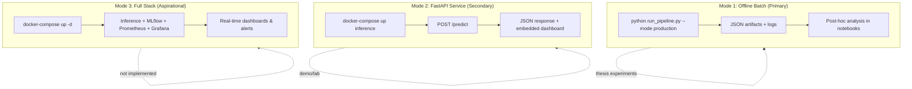

# 17 — Prometheus/Grafana Decision for Offline Pipeline

> **Status:** COMPLETE — Phase 2  
> **Repository Snapshot:** `168c05bb222b03e699acb7de7d41982e886c8b25`  
> **Auditor:** Automated deep-dive (Claude Opus 4.6)  
> **Sources:** `src/prometheus_metrics.py` (623 lines), `config/prometheus.yml` (74 lines), `config/alerts/har_alerts.yml` (191 lines), `docker-compose.yml` (143 lines)

---

## 1 Current State: What Exists

### 1.1 Metrics Exporter (`src/prometheus_metrics.py`)

A **fully implemented** 623-line module providing:

| Component | Lines | Description |
|-----------|-------|-------------|
| `METRIC_DEFINITIONS` | 49-145 | 18 metric definitions across 6 categories |
| `MetricValue` | 150-225 | Thread-safe metric storage with counter/gauge/histogram support |
| `MetricsExporter` | 230-470 | Singleton class with 7 recording methods + Prometheus/JSON export |
| `MetricsHandler` | 480-530 | HTTP handler for `/metrics`, `/metrics/json`, `/health` endpoints |
| `start_metrics_server()` | 532-555 | Threaded HTTP server on port 8000 |
| CLI | 560-623 | Demo mode with synthetic data + serve mode |

**18 Metrics Defined:**

| Category | Metrics | Prometheus Type |
|----------|---------|-----------------|
| Model Performance | `har_model_f1_score`, `har_model_accuracy`, `har_predictions_total` | gauge, gauge, counter |
| Drift Detection | `har_drift_psi`, `har_drift_ks_stat`, `har_drift_detected` | gauge, gauge, gauge |
| Proxy Metrics | `har_confidence_mean`, `har_confidence_histogram`, `har_entropy_mean`, `har_flip_rate` | gauge, histogram, gauge, gauge |
| OOD Detection | `har_ood_ratio`, `har_energy_score_mean` | gauge, gauge |
| Trigger State | `har_trigger_state`, `har_consecutive_warnings`, `har_retraining_triggered_total` | gauge, gauge, counter |
| System | `har_inference_latency_seconds`, `har_batch_processing_seconds`, `har_samples_processed_total` | histogram, histogram, counter |

**Bridge method** (`record_from_monitoring_report`, lines 377-420): Accepts the output dict from `post_inference_monitoring.py` and maps it to Prometheus metrics — the intended integration point between the 3-layer monitoring and the metrics stack.

### 1.2 Prometheus Configuration (`config/prometheus.yml`)

```yaml
global:
  scrape_interval: 15s
  
scrape_configs:
  - job_name: 'prometheus'        # Self-monitor on :9090
  - job_name: 'har_inference'     # Inference API on :8000 (10s interval)
  - job_name: 'har_training'      # Training pipeline on :8001 (30s interval)
  - job_name: 'har_monitoring'    # Monitoring service on :8002
  - job_name: 'node'              # Node exporter on :9100 (optional)
  - job_name: 'cadvisor'          # Docker metrics on :8080 (optional)

rule_files:
  - "alerts/har_alerts.yml"
```

### 1.3 Alert Rules (`config/alerts/har_alerts.yml`)

**14 alert rules** across 5 groups:

| Group | Alerts | Key Thresholds |
|-------|--------|----------------|
| `har_model_performance` | HARLowConfidence, HARHighEntropy, HARHighFlipRate | conf < 0.75 (5min), entropy > 1.5 (5min), flip > 0.15 (10min) |
| `har_drift_detection` | HARDataDriftDetected, HARFeatureDrift, HARDistributionShift | drift_detected=1 (5min), PSI > 0.25 (5min), KS > 0.1 (5min) |
| `har_ood_detection` | HARHighOODRatio, HARCriticalOOD | OOD > 20% (10min), OOD > 40% (5min) |
| `har_trigger_policy` | HARRetrainingTriggered, HARConsecutiveWarnings | state=2 (instant), warnings ≥ 3 (1min) |
| `har_system_health` | HARHighLatency, HARNoPredictions, HARSlowBatchProcessing, HARF1ScoreDropped, HARAccuracyDropped | p95 > 0.5s, rate=0 (10min), batch > 60s, F1 < 0.85, acc < 0.80 |

### 1.4 What Does NOT Exist

| Missing Component | Evidence |
|-------------------|----------|
| **No Prometheus service in docker-compose** | `docker-compose.yml` defines 4 services: mlflow, inference, training, preprocessing — no Prometheus |
| **No Grafana service in docker-compose** | Same — no port 3000 binding |
| **No Grafana dashboard JSON** | `file_search("**/grafana*")` returns no files |
| **No `prometheus_metrics` import in any pipeline code** | The module exists but is never imported by `app.py`, `production_pipeline.py`, or `post_inference_monitoring.py` |
| **No proof of Prometheus ever running** | No scrape logs, no TSDB data, no screenshots |

> **[FINDING PG-1]** The Prometheus/Grafana stack is **fully specified** (config + alerts + exporter) but **never integrated** into the running pipeline. Zero imports of `prometheus_metrics` in production code.

---

## 2 Deployment Mode Analysis

### 2.1 Thesis Deployment Modes

The pipeline operates in three modes with different monitoring requirements:



### 2.2 Mode 1: Offline Batch (The Thesis Reality)

**How monitoring works today:**
1. Pipeline runs → writes JSON artifacts to `artifacts/`
2. `post_inference_monitoring.py` runs → writes `monitoring_report.json`
3. `batch_process_all_datasets.py` runs → writes comparison CSV + text report
4. Results analyzed manually or in notebooks

**What Prometheus adds:** Nothing. Prometheus is a **pull-based** scrape system designed for long-running services. A batch job that runs for 30-120 seconds and exits provides no scrape window. Prometheus would scrape empty or stale data.

**The right tool for offline mode:** MLflow (already integrated via `MLflowTracker`) or flat JSON artifacts (already produced).

### 2.3 Mode 2: FastAPI Service (Lab/Demo)

**How monitoring works today:**
- `app.py` has an embedded HTML dashboard at `/` showing inference stats
- Health check at `/health`
- Logs to file

**What Prometheus adds:** Time-series history of confidence, drift, latency across API calls. Useful if the service runs for hours/days accepting continuous data.

**Verdict:** Marginally useful for thesis if a lab demo is planned; not essential.

### 2.4 Mode 3: Full Production Stack (Future Work)

**What Prometheus/Grafana enables:**
- Real-time dashboards with auto-refresh
- Alert routing via Alertmanager
- Historical trend analysis across deployments
- SLA monitoring (latency, availability)

**Verdict:** The code is ready. Adding 2 services to `docker-compose.yml` + a Grafana dashboard JSON would complete the stack. This is genuine future work, not thesis scope.

---

## 3 Decision Matrix

| Criterion | Offline Batch | FastAPI (Lab) | Full Production |
|-----------|:------------:|:------------:|:---------------:|
| Prometheus scraping useful? | **No** — job too short | **Maybe** — if service runs > 1hr | **Yes** — continuous monitoring |
| Grafana dashboards useful? | **No** — no time-series to view | **Maybe** — nice for demo | **Yes** — operational visibility |
| Alert rules useful? | **No** — no scrape window | **No** — thesis lab setting | **Yes** — automated triage |
| MLflow sufficient? | **Yes** — experiment tracking | **Partial** — no real-time | **No** — needs Prometheus for infra |
| JSON artifacts sufficient? | **Yes** — full pipeline output | **No** — no aggregation | **No** — not queryable |
| Effort to enable | N/A | **Low** (add 2 docker services) | **Medium** (+ Grafana JSON + alertmanager) |

---

## 4 Recommendation: Tiered Approach

### Tier 1: Thesis Core (Use Now)

| Tool | Purpose | Status |
|------|---------|--------|
| **MLflow** | Experiment tracking, model versioning, metric logging | ✅ Integrated (`MLflowTracker` in `train.py`) |
| **JSON artifacts** | Per-run monitoring reports, inference summaries | ✅ Produced by every pipeline run |
| **Batch comparison CSV** | Cross-dataset aggregate analysis | ✅ `batch_process_all_datasets.py` |
| **Post-inference monitoring** | 3-layer health check with JSON output | ✅ `post_inference_monitoring.py` |

### Tier 2: Thesis Enhancement (Optional, Low Effort)

| Action | Effort | Thesis Value |
|--------|--------|-------------|
| Add `prometheus` + `grafana` services to `docker-compose.yml` | 30 min | Screenshot for thesis chapter on observability |
| Create minimal Grafana dashboard JSON | 1-2 hrs | Architecture diagram becomes provable |
| Wire `MetricsExporter` into `app.py` `/predict` handler | 15 min | Makes the metrics server actually serve real data |

### Tier 3: Future Work (Post-Thesis)

| Action | Effort | Value |
|--------|--------|-------|
| Alertmanager with email/Slack routing | Medium | Production ops |
| Pushgateway for batch job metrics | Low | Bridges batch→Prometheus gap |
| Multi-model/multi-environment label schema | Medium | A/B testing support |

### 4.1 The Pushgateway Option

For batch pipelines, Prometheus offers **Pushgateway** — a metrics sink that batch jobs _push_ to, and Prometheus _pulls_ from. This bridges the "job exits before scrape" gap.

```
Batch Pipeline → push metrics → Pushgateway:9091 → Prometheus scrapes → Grafana displays
```

Adding this would be ~20 lines of code + 1 docker-compose service.

> **[FINDING PG-2]** The repository does not mention Pushgateway anywhere. If Prometheus observation of batch runs is desired, Pushgateway is the standard solution. Without it, the Prometheus stack cannot capture batch pipeline runs.

---

## 5 Thesis Presentation Strategy

### 5.1 Honest Framing

> "The pipeline implements a complete observability configuration layer — Prometheus metric definitions (18 metrics), scrape targets, and 14 alert rules — designed for production deployment. For thesis experiments conducted in offline batch mode, monitoring relies on MLflow experiment tracking and JSON artifact analysis. The Prometheus/Grafana stack is validated through metric export tests and CLI demo mode, but live dashboard screenshots are deferred to production deployment."

### 5.2 What to Include in the Thesis

| Chapter Section | Content | Risk of Overclaim |
|-----------------|---------|-------------------|
| Architecture diagram | Show Prometheus/Grafana as "configurable" services | Low — if labeled clearly |
| Implementation | Describe `prometheus_metrics.py` and alert rules | Low — code exists and is real |
| Evaluation | **Do NOT claim real-time dashboards were used** | **High** — would be false |
| Future Work | "Production deployment with Grafana dashboards" | Low — honest |

### 5.3 What to Avoid

- Claiming "real-time monitoring with Grafana dashboards" without screenshots of actual running dashboards
- Showing Prometheus/Grafana in the architecture as active components without noting they are not deployed
- Conflating the JSON-based post-inference monitoring (which IS running) with Prometheus scraping (which is NOT)

> **[FINDING PG-3]** The thesis chapter `CH4_IMPLEMENTATION.md` references `config/grafana/har_dashboard.json` as an existing file. This file does not exist in the repository. The chapter also has a TODO: "Capture Grafana dashboard screenshots after deploying the monitoring stack." This TODO should either be resolved or the reference removed.

---

## 6 Threshold Alignment Audit

The alert rules define thresholds that should align with the pipeline's monitoring thresholds:

| Metric | Alert Threshold | Pipeline Threshold | Aligned? |
|--------|----------------|-------------------|----------|
| Confidence | < 0.75 | L1 pipeline: 0.7 / L1 API: 0.9 | **Partial** — alert is between pipeline (0.7) and API (0.9) |
| Entropy | > 1.5 | entropy_threshold: 1.5 | ✅ Yes |
| Flip rate | > 0.15 | temporal_flip_threshold: 0.15 | ✅ Yes |
| PSI | > 0.25 | Not used in pipeline (uses W₁) | **Mismatch** — pipeline uses Wasserstein, alert uses PSI |
| KS stat | > 0.1 | Not used in pipeline | **Mismatch** — same issue |
| F1 score | < 0.85 | proxy_f1_threshold: 0.85 | ✅ Yes |
| Accuracy | < 0.80 | Not explicitly configured | ❓ No pipeline equivalent |

> **[FINDING PG-4]** The Prometheus alert rules reference PSI and KS-statistic drift metrics, but the pipeline's drift detection uses Wasserstein-1 distance exclusively. The `prometheus_metrics.py` defines `har_drift_psi` and `har_drift_ks_stat` gauges, but `wasserstein_drift.py` never populates them. The alert rules would never fire for drift in the current implementation.

---

## 7 Findings Summary

| ID | Severity | Finding | Evidence |
|----|----------|---------|----------|
| PG-1 | **High** | Prometheus/Grafana fully specified but never integrated — zero imports in production code | `grep_search` across `app.py`, `production_pipeline.py`, `post_inference_monitoring.py` |
| PG-2 | **Medium** | No Pushgateway for batch pipeline metrics — Prometheus cannot observe batch runs | `docker-compose.yml` (no pushgateway service), no pushgateway references in codebase |
| PG-3 | **High** | Thesis chapter references `config/grafana/har_dashboard.json` which does not exist | `CH4_IMPLEMENTATION.md` L238, `file_search("**/grafana*")` → no results |
| PG-4 | **Medium** | Alert rules use PSI/KS metrics but pipeline only produces Wasserstein drift scores | `har_alerts.yml` vs `wasserstein_drift.py` |
| PG-5 | **Low** | MetricsExporter is a well-implemented singleton with thread safety — code quality is production-grade | `prometheus_metrics.py` full review |

---

## 8 Recommendations

| # | Action | Priority | Effort |
|---|--------|----------|--------|
| R-1 | **For thesis:** Present Prometheus/Grafana as "production-ready configuration" not "deployed monitoring" — fix `CH4_IMPLEMENTATION.md` references | **High** | Low |
| R-2 | **Quick win:** Add `prometheus_metrics.MetricsExporter.record_prediction()` call inside `app.py` `/predict` handler to wire the integration | Medium | Low |
| R-3 | **Docker:** Add Prometheus + Grafana services (with dashboard JSON) to `docker-compose.yml` for one-command demo | Medium | Medium |
| R-4 | **Align drift metrics:** Either add W₁ to Prometheus metrics or convert alert rules to use Wasserstein thresholds | Medium | Low |
| R-5 | **Batch bridge:** Add Pushgateway service + push calls at pipeline end for batch run observability | Low | Low |

---

## Appendix: Evidence Traceability

| Claim | Source File | Lines |
|-------|------------|-------|
| 18 metric definitions | `src/prometheus_metrics.py` | L49-145 |
| Singleton MetricsExporter | `src/prometheus_metrics.py` | L233-244 |
| HTTP metrics server | `src/prometheus_metrics.py` | L532-555 |
| `record_from_monitoring_report` bridge | `src/prometheus_metrics.py` | L377-420 |
| 5 scrape targets | `config/prometheus.yml` | L31-67 |
| 14 alert rules, 5 groups | `config/alerts/har_alerts.yml` | L1-191 |
| 4 docker-compose services (no Prometheus) | `docker-compose.yml` | L1-143 |
| Grafana dashboard reference in thesis | `docs/thesis/chapters/CH4_IMPLEMENTATION.md` | L238 |
| Grafana file does not exist | `file_search("**/grafana*")` → no results | — |
| PSI/KS alert thresholds | `config/alerts/har_alerts.yml` | L60-82 |
| Pipeline uses W₁ not PSI/KS | `src/wasserstein_drift.py` (see File 13) | — |
