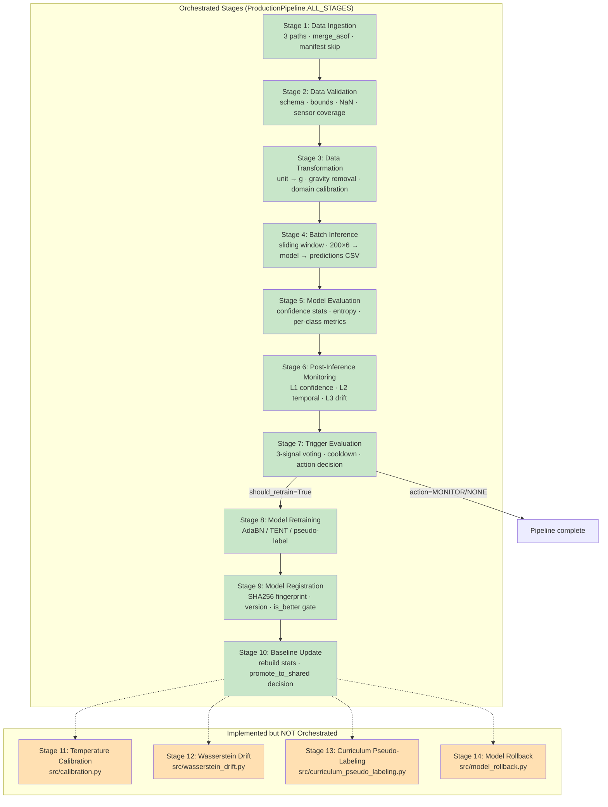
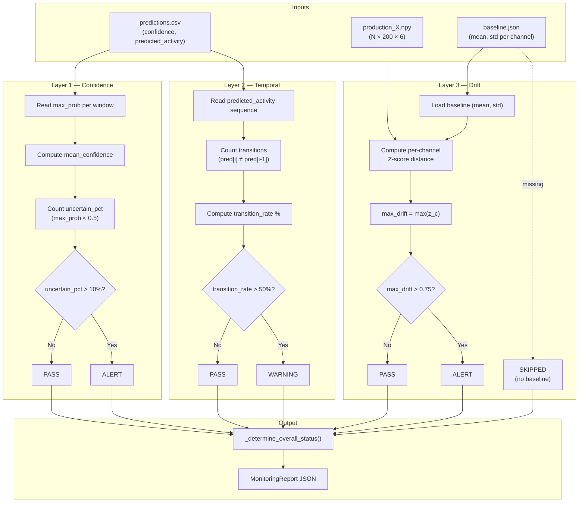
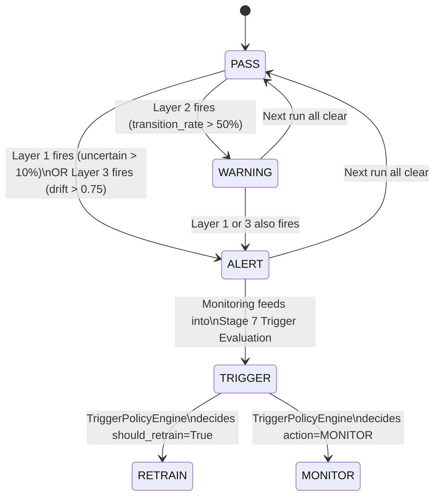
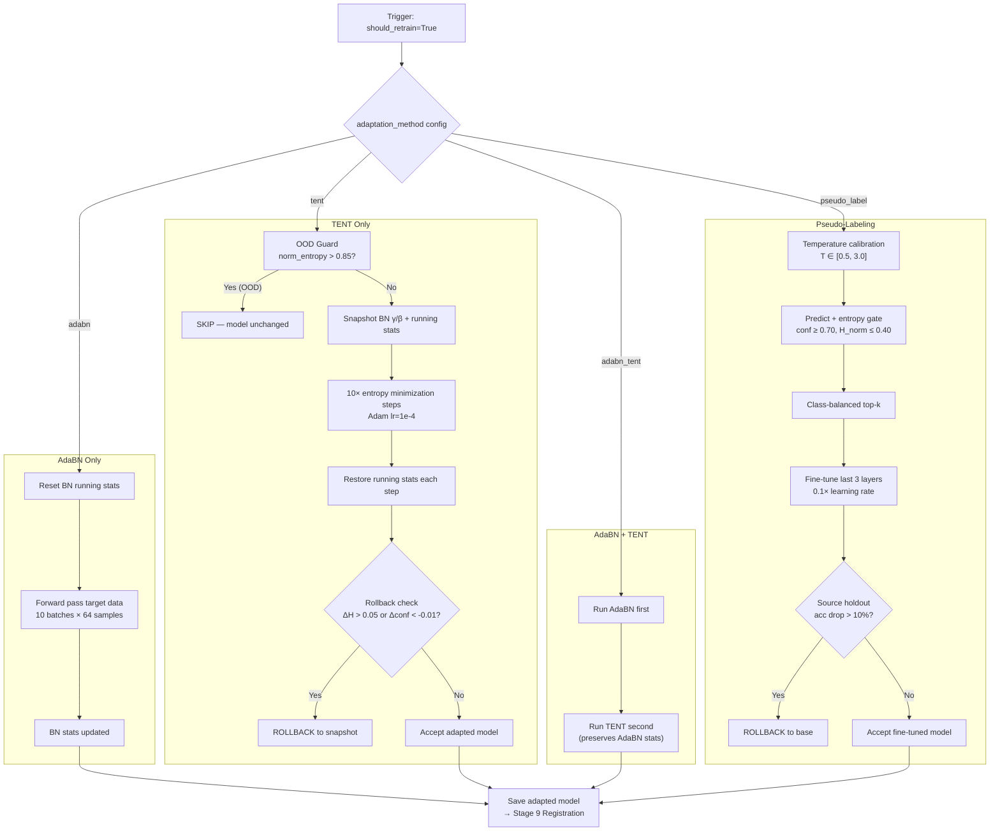
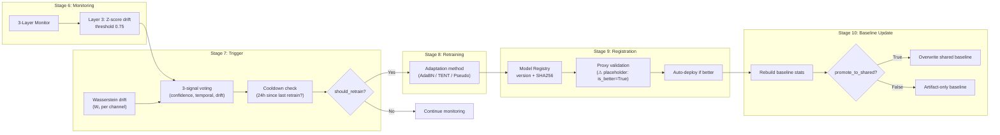
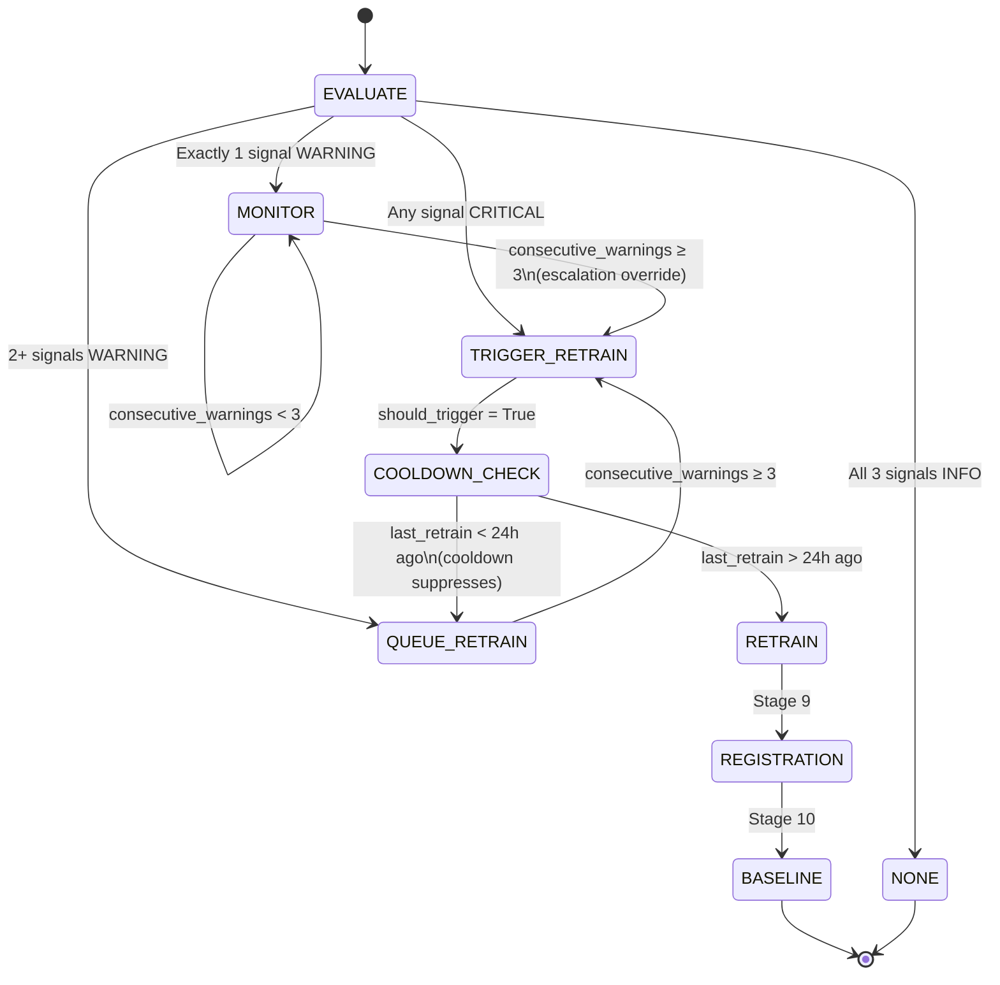
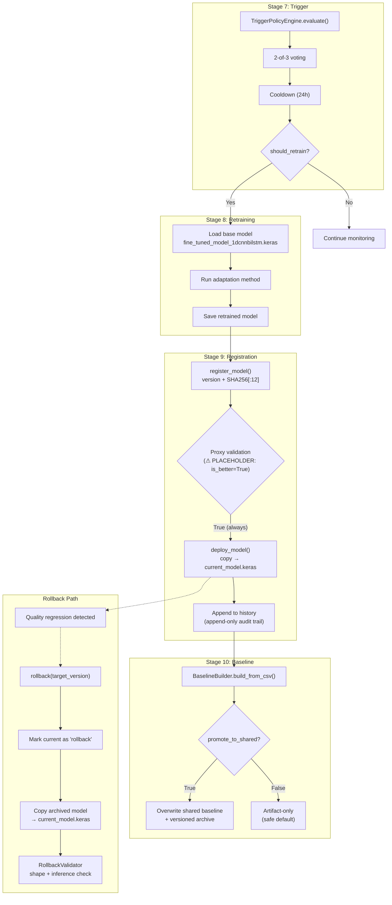
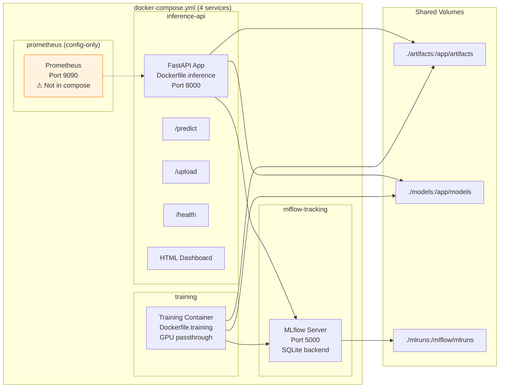
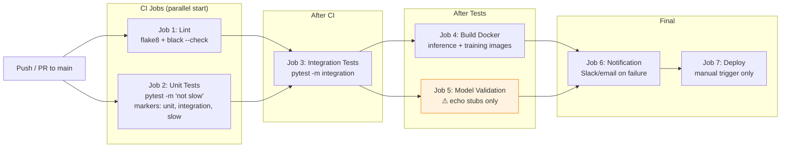
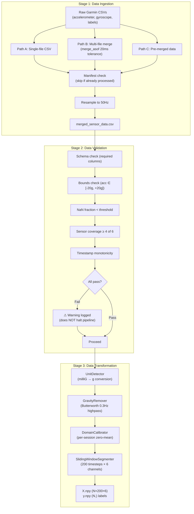

# 22 — Figures and Diagrams (Mermaid Pack)

> **Status:** COMPLETE — Phase 3  
> **Repository Snapshot:** `168c05bb222b03e699acb7de7d41982e886c8b25`  
> **Auditor:** Claude Opus 4.6 | **Date:** 2026-02-22  
> **Usage:** Copy any diagram block into a Mermaid renderer (VS Code extension, Mermaid.live, LaTeX mermaid-filter) to generate thesis-ready SVG/PDF.

---

## Diagram Index

| # | Diagram | Type | Thesis Chapter | Source |
|--:|---------|------|:--------------:|--------|
| D-1 | End-to-End 14-Stage Pipeline | flowchart TB | Ch 3.1 | **NEW** |
| D-2 | 3-Layer Monitoring Data Flow | flowchart TB | Ch 3.4 | File 12 §5 (polished) |
| D-3 | Alert Escalation State Machine | stateDiagram-v2 | Ch 3.4 | File 12 §6 (polished) |
| D-4 | Adaptation Decision Flow | flowchart TB | Ch 3.6 | File 13 §4 (polished) |
| D-5 | Drift → Adaptation End-to-End | flowchart LR | Ch 3.5-3.6 | File 13 §5 (polished) |
| D-6 | Trigger Policy State Machine | stateDiagram-v2 | Ch 3.5 | File 14 §3 (polished) |
| D-7 | Full Retrain Governance Cycle | flowchart TB | Ch 3.7 | File 14 §8 (polished) |
| D-8 | Docker Service Architecture | flowchart LR | Ch 4.3 | **NEW** |
| D-9 | CI/CD Pipeline (7 Jobs) | flowchart LR | Ch 4.4 | **NEW** |
| D-10 | Data Pipeline Flow | flowchart TB | Ch 3.2 | **NEW** |

---

## D-1 — End-to-End 14-Stage Pipeline Architecture

> **Thesis placement:** Chapter 3, Section 3.1 — System Overview  
> **Interpretation:** Shows all 14 stages of the MLOps pipeline. Stages 1-10 (green) are wired into the orchestrator; stages 11-14 (orange) are implemented in code but not yet integrated.



---

## D-2 — 3-Layer Monitoring Data Flow

> **Thesis placement:** Chapter 3, Section 3.4 — Monitoring Framework  
> **Interpretation:** Three orthogonal monitoring layers process different input signals (confidence CSV, temporal sequence, drift from raw features vs baseline). Each layer independently produces PASS/ALERT/WARNING. Results aggregate into an overall status report.  
> **Evidence:** `scripts/post_inference_monitoring.py:L1-400`



---

## D-3 — Alert Escalation State Machine

> **Thesis placement:** Chapter 3, Section 3.4 — Monitoring Framework (subsection on escalation)  
> **Interpretation:** Shows how monitoring status transitions between PASS, WARNING, ALERT, and how ALERT feeds into Stage 7 trigger evaluation.  
> **Evidence:** `scripts/post_inference_monitoring.py:L300-350`



---

## D-4 — Adaptation Decision Flow (4 Methods)

> **Thesis placement:** Chapter 3, Section 3.6 — Adaptation Methods  
> **Interpretation:** Four adaptation paths (AdaBN, TENT, combined, pseudo-labeling) with their internal steps, safety gates, and rollback conditions. TENT has an OOD guard + rollback check; pseudo-labeling has source-holdout catastrophic-forgetting check.  
> **Evidence:** `src/domain_adaptation/adabn.py`, `tent.py`, `src/components/model_retraining.py:L200+`



---

## D-5 — Drift Detection → Adaptation End-to-End (Stages 6-10)

> **Thesis placement:** Chapter 3, Sections 3.5-3.6 — Overview of the reactive loop  
> **Interpretation:** End-to-end flow from monitoring (Stage 6) through trigger decision (Stage 7), adaptation (Stage 8), registration with proxy validation (Stage 9), and baseline update with promote-to-shared logic (Stage 10).  
> **Evidence:** `src/trigger_policy.py`, `src/components/model_registration.py`, `src/components/baseline_update.py`



---

## D-6 — Trigger Policy State Machine

> **Thesis placement:** Chapter 3, Section 3.5 — Trigger Policy  
> **Interpretation:** Shows how the trigger evaluates 3 signals into 5 action levels (NONE → MONITOR → QUEUE → TRIGGER → RETRAIN), including the escalation override (3 consecutive warnings forces retrain) and cooldown suppression (downgrades to QUEUE if last retrain < 24h).  
> **Evidence:** `src/trigger_policy.py:L1-822`



---

## D-7 — Full Retrain Governance Cycle

> **Thesis placement:** Chapter 3, Section 3.7 — Model Governance & Rollback  
> **Interpretation:** Complete governance cycle from trigger → retraining → registration (SHA256 fingerprint + proxy validation, currently placeholder) → baseline update → rollback path. The rollback branch shows detection of quality regression → version rollback → shape/inference validation.  
> **Evidence:** `src/model_rollback.py`, `src/components/model_registration.py`



---

## D-8 — Docker Service Architecture

> **Thesis placement:** Chapter 4, Section 4.3 — API & Containerization  
> **Interpretation:** Shows the 4-service Docker Compose setup: FastAPI inference service (port 8000), MLflow tracking server (port 5000), Prometheus (port 9090, config-only), and training service. Network connections and volume mounts.  
> **Evidence:** `docker-compose.yml:L1-143`, `docker/Dockerfile.inference`, `docker/Dockerfile.training`



---

## D-9 — CI/CD Pipeline (7 Jobs)

> **Thesis placement:** Chapter 4, Section 4.4 — CI/CD Workflow  
> **Interpretation:** GitHub Actions workflow with 7 jobs: lint, unit tests, integration tests, build Docker images, model validation (⚠ stub), notification, and manual deploy. Shows dependency chain.  
> **Evidence:** `.github/workflows/ci-cd.yml:L1-236`



---

## D-10 — Data Pipeline Flow (Stages 1-3)

> **Thesis placement:** Chapter 3, Section 3.2 — Data Pipeline  
> **Interpretation:** Detailed data flow through ingestion (3 paths), validation (5 checks), and transformation (4 steps). Shows how raw Garmin CSV data becomes model-ready windowed numpy arrays.  
> **Evidence:** `src/components/data_ingestion.py`, `src/preprocess_data.py`, `src/components/data_transformation.py`



---

## Rendering Notes for Thesis

1. **Mermaid → SVG/PDF:** Use `mmdc` CLI (`npm install -g @mermaid-js/mermaid-cli`) for batch rendering:
   ```bash
   mmdc -i diagram.mmd -o diagram.svg -t neutral --width 1200
   ```
2. **LaTeX integration:** Use `mermaid-filter` with pandoc, or render to PDF and include with `\includegraphics`.
3. **Color scheme:** Green (#c8e6c9) = operational; Orange (#ffe0b2) = placeholder/warning; Default = informational.
4. **Resolution:** Export at ≥ 300 DPI for print; SVG preferred for scalability.
5. **Existing PNGs:** 7 figures in `docs/figures/` — review for overlap with these Mermaid diagrams before thesis inclusion.
