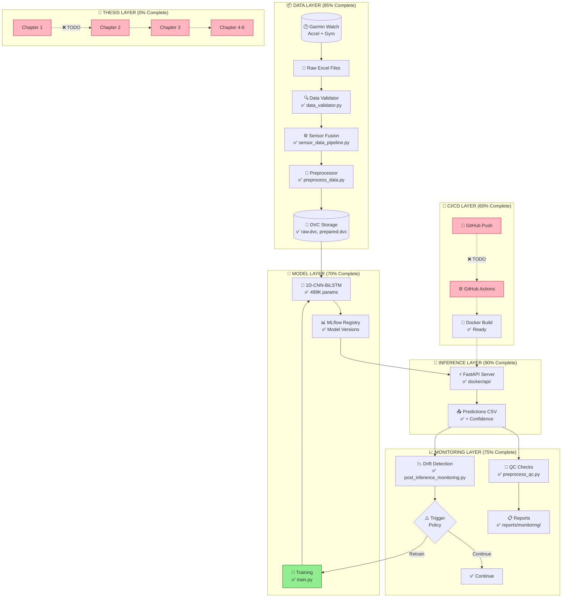
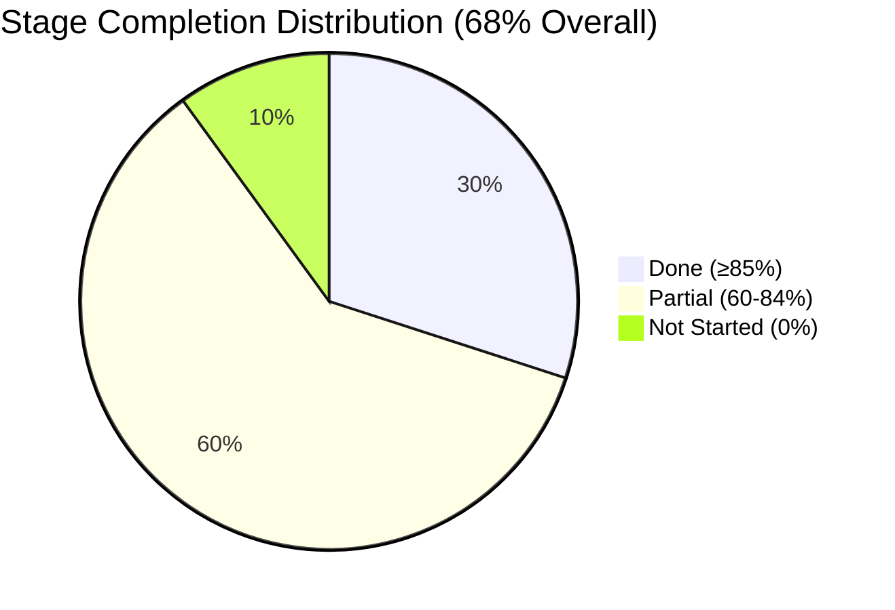

# 🎯 MASTER THESIS PROGRESS DASHBOARD
## MLOps Pipeline for Human Activity Recognition - Complete Status Overview

**📅 Date:** January 31, 2026  
**⏰ Weeks Remaining:** 15 weeks (Deadline: May 20, 2026)  
**📊 Overall Completion:** **~68%**

---

## 🗺️ VISUAL ROADMAP: Where We Are Now

```
                          ╔══════════════════════════════════════════════════════════════╗
                          ║        THESIS COMPLETION JOURNEY (Jan 31 → May 20, 2026)     ║
                          ╚══════════════════════════════════════════════════════════════╝

   YOU ARE HERE ↓
   ━━━━━━━━━━━━●━━━━━━━━━━━━━━━━━━━━━━━━━━━━━━━━━━━━━━━━━━━━━━━━━━━━━━━━━━━━━━━━━━━━━━━━○
   |           |                 |                    |                    |              |
   Oct 2025   Jan 2026         Feb                  Mar                  Apr           May 20
   START      NOW              Tests               Experiments        Thesis         SUBMIT
   (Month 1)  (Month 4)        Complete            Complete           Complete
                68%              80%                  90%                100%

   ████████████████████████████████████░░░░░░░░░░░░░░░░░░░░░░░░░░░░░░░░░░░░░░░░░░░░░░░░░
   |←─────── COMPLETED (68%) ───────→|←───────────── REMAINING (32%) ─────────────────→|
```

---

## 📊 STAGE-BY-STAGE COMPLETION MATRIX

```
╔════════════════════════════════════════════════════════════════════════════════════════╗
║                           PIPELINE STAGES COMPLETION                                    ║
╠════════════════════════════════════════════════════════════════════════════════════════╣
║                                                                                         ║
║  STAGE A: Data Ingestion          ████████████████████░░░░░░  75%   ✅ MOSTLY DONE     ║
║  ├─ sensor_data_pipeline.py       ✅ Complete                                          ║
║  ├─ Raw data loading              ✅ Complete                                          ║
║  └─ Unit tests                    ❌ Missing                                           ║
║                                                                                         ║
║  STAGE B: Preprocessing           █████████████████████████░░  90%   ✅ DONE           ║
║  ├─ preprocess_data.py            ✅ Complete (794 lines)                              ║
║  ├─ Sensor fusion                 ✅ Complete                                          ║
║  ├─ DVC versioning                ✅ Complete                                          ║
║  └─ data_validator.py             ✅ Complete (322 lines)                              ║
║                                                                                         ║
║  STAGE C: Data QC/Validation      █████████████████████████░░  90%   ✅ DONE           ║
║  ├─ preprocess_qc.py              ✅ Complete (802 lines)                              ║
║  ├─ QC reports                    ✅ 6+ runs recorded                                  ║
║  └─ CI hook                       ❌ Missing                                           ║
║                                                                                         ║
║  STAGE D: Baselines               ████████████████████░░░░░░  75%   🟡 PARTIAL         ║
║  ├─ build_training_baseline.py    ✅ Complete                                          ║
║  ├─ normalized_baseline.json      ✅ Complete                                          ║
║  └─ Baseline tests                ❌ Missing                                           ║
║                                                                                         ║
║  STAGE E: Training Pipeline       █████████████████░░░░░░░░░  65%   🟡 PARTIAL         ║
║  ├─ train.py                      ✅ Complete (NEW!)                                   ║
║  ├─ MLflow tracking               ✅ Complete                                          ║
║  ├─ K-fold CV                     ✅ Complete                                          ║
║  └─ Training config YAML          ❌ Missing                                           ║
║                                                                                         ║
║  STAGE F: Evaluation              █████████████████░░░░░░░░░  65%   🟡 PARTIAL         ║
║  ├─ evaluate_predictions.py       ✅ Complete (766 lines)                              ║
║  ├─ Confusion matrix              ✅ Complete                                          ║
║  ├─ Temperature scaling           ❌ Missing                                           ║
║  └─ ECE calibration               ❌ Missing                                           ║
║                                                                                         ║
║  STAGE G: Inference               █████████████████████████░░  90%   ✅ DONE           ║
║  ├─ run_inference.py              ✅ Complete (896 lines)                              ║
║  ├─ FastAPI server                ✅ Complete                                          ║
║  ├─ Docker container              ✅ Complete                                          ║
║  └─ Batch predictions             ✅ Complete                                          ║
║                                                                                         ║
║  STAGE H: Monitoring              ████████████████████░░░░░░  75%   🟡 PARTIAL         ║
║  ├─ post_inference_monitoring.py  ✅ Complete (1,590 lines)                            ║
║  ├─ Drift detection               ✅ Complete                                          ║
║  ├─ trigger_policy.py             ✅ Complete (NEW!)                                   ║
║  ├─ ood_detection.py              ✅ Complete (NEW!)                                   ║
║  ├─ prometheus_metrics.py         ✅ Complete (NEW!)                                   ║
║  ├─ Prometheus/Grafana stack      ⚠️ Config exists, not deployed                      ║
║  └─ Alerting rules                ❌ Missing                                           ║
║                                                                                         ║
║  STAGE I: CI/CD & Packaging       ████████████████░░░░░░░░░░  60%   🟡 PARTIAL         ║
║  ├─ docker-compose.yml            ✅ Complete                                          ║
║  ├─ Dockerfile.inference          ✅ Complete                                          ║
║  ├─ Dockerfile.training           ✅ Complete                                          ║
║  ├─ GitHub Actions                ❌ Missing                                           ║
║  └─ pyproject.toml                ❌ Missing                                           ║
║                                                                                         ║
║  STAGE J: Thesis Writing          ░░░░░░░░░░░░░░░░░░░░░░░░░░   0%   ❌ NOT STARTED     ║
║  ├─ Chapter 1: Introduction       ❌ Not started                                       ║
║  ├─ Chapter 2: Literature         ❌ Not started (150+ papers analyzed)                ║
║  ├─ Chapter 3: Methodology        ❌ Not started                                       ║
║  ├─ Chapter 4: Implementation     ❌ Not started                                       ║
║  ├─ Chapter 5: Results            ❌ Not started                                       ║
║  └─ Chapter 6: Conclusion         ❌ Not started                                       ║
║                                                                                         ║
╚════════════════════════════════════════════════════════════════════════════════════════╝
```

---

## 📈 COMPLETION PIE CHART

```
                    ┌────────────────────────────────────────┐
                    │     OVERALL THESIS COMPLETION: 68%     │
                    └────────────────────────────────────────┘

                              ██████████████
                         ████████████████████████
                      ██████████████████████████████
                    ██████████████████████████████████
                   ██████████████████████████████████████
                  █████████████████████░░░░░░░░░░░░░░░████
                 █████████████████░░░░░░░░░░░░░░░░░░░░░████
                 ████████████████░░░░░░░░░░░░░░░░░░░░░░████
                 ████████████████░░░░░░░░░░░░░░░░░░░░░░████
                 █████████████████░░░░░░░░░░░░░░░░░░░░░████
                  █████████████████░░░░░░░░░░░░░░░░░░░████
                   ██████████████████████████████████████
                    ██████████████████████████████████
                      ██████████████████████████████
                         ████████████████████████
                              ██████████████

           ████ Pipeline Implementation (68%)    ░░░░ Remaining (32%)

        Stage Breakdown:
        ────────────────────────────────────────────────────
        A: Data Ingestion      │██████████████████░░│ 75%
        B: Preprocessing       │████████████████████│ 90%
        C: Data QC             │████████████████████│ 90%
        D: Baselines           │██████████████████░░│ 75%
        E: Training            │█████████████████░░░│ 65%
        F: Evaluation          │█████████████████░░░│ 65%
        G: Inference           │████████████████████│ 90%
        H: Monitoring          │██████████████████░░│ 75%
        I: CI/CD               │████████████████░░░░│ 60%
        J: Thesis Writing      │░░░░░░░░░░░░░░░░░░░░│  0%
```

---

## 🔗 DEPENDENCY FLOW DIAGRAM

```
╔═══════════════════════════════════════════════════════════════════════════════════════════════╗
║                              PIPELINE DEPENDENCY FLOW                                          ║
║                                  "From This → To This"                                         ║
╚═══════════════════════════════════════════════════════════════════════════════════════════════╝

┌─────────────────────────────────────────────────────────────────────────────────────────────────┐
│ LAYER 1: DATA FOUNDATION                                                                        │
│ ══════════════════════════════════════════════════════════════════════════════════════════════ │
│                                                                                                 │
│  ┌──────────────────┐         ┌──────────────────┐         ┌──────────────────┐               │
│  │ 📁 RAW DATA      │────────▶│ ⚙️ PREPROCESSING │────────▶│ ✅ QC VALIDATION │               │
│  │                  │         │                  │         │                  │               │
│  │ data/raw/        │         │ preprocess_data  │         │ preprocess_qc.py │               │
│  │ *.xlsx, *.csv    │         │ sensor_fusion    │         │ data_validator   │               │
│  └──────────────────┘         └──────────────────┘         └────────┬─────────┘               │
│         ↑                              ↑                            │                          │
│         │                              │                            ▼                          │
│  Reference:                    Reference:                  ┌──────────────────┐               │
│  PROJECT_GUIDE.md             PIPELINE_EXECUTION_GUIDE.md  │ 📊 BASELINES     │               │
│  Section: data/               Section 4.1                  │ baseline_stats   │               │
│                                                            │ normalized_base  │               │
│                                                            └────────┬─────────┘               │
└─────────────────────────────────────────────────────────────────────┼───────────────────────────┘
                                                                      │
                                                                      ▼
┌─────────────────────────────────────────────────────────────────────────────────────────────────┐
│ LAYER 2: MODEL TRAINING & INFERENCE                                                             │
│ ══════════════════════════════════════════════════════════════════════════════════════════════ │
│                                                                                                 │
│  ┌──────────────────┐         ┌──────────────────┐         ┌──────────────────┐               │
│  │ 🎯 TRAINING      │────────▶│ 📦 MODEL REGISTRY│────────▶│ 🚀 INFERENCE     │               │
│  │                  │         │                  │         │                  │               │
│  │ train.py         │         │ MLflow           │         │ run_inference.py │               │
│  │ K-fold CV        │         │ model_rollback   │         │ FastAPI server   │               │
│  │ EWC loss         │         │ DVC versioning   │         │ Docker container │               │
│  └──────────────────┘         └──────────────────┘         └────────┬─────────┘               │
│         ↑                              ↑                            │                          │
│         │                              │                            ▼                          │
│  Reference:                    Reference:                  ┌──────────────────┐               │
│  PIPELINE_EXECUTION_GUIDE.md  PROJECT_GUIDE.md             │ 📈 EVALUATION    │               │
│  Section 4.2                  Section: models/             │ evaluate_predic  │               │
│  Thesis_Plan.md Month 2                                    │ confusion matrix │               │
│                                                            └────────┬─────────┘               │
└─────────────────────────────────────────────────────────────────────┼───────────────────────────┘
                                                                      │
                                                                      ▼
┌─────────────────────────────────────────────────────────────────────────────────────────────────┐
│ LAYER 3: MONITORING & OPERATIONS                                                                │
│ ══════════════════════════════════════════════════════════════════════════════════════════════ │
│                                                                                                 │
│  ┌──────────────────┐         ┌──────────────────┐         ┌──────────────────┐               │
│  │ 👁️ MONITORING    │────────▶│ ⚡ TRIGGER POLICY│────────▶│ 🔄 RETRAINING    │               │
│  │                  │         │                  │         │                  │               │
│  │ post_inference   │         │ trigger_policy   │         │ Back to TRAINING │               │
│  │ ood_detection    │         │ 2-of-3 voting    │         │ with new data    │               │
│  │ prometheus_metr  │         │ drift thresholds │         │                  │               │
│  └──────────────────┘         └──────────────────┘         └──────────────────┘               │
│         ↑                              ↑                            │                          │
│         │                              │                            │ CYCLE                    │
│  Reference:                    Reference:                           │ BACK                     │
│  PIPELINE_EXECUTION_GUIDE.md  FINAL_3_PATHWAYS.md                   └───────────┐             │
│  Section 4.4-4.6              Path B: Practical                                 │             │
│                                                                                 │             │
└─────────────────────────────────────────────────────────────────────────────────┼─────────────┘
                                                                                  │
                                                                                  ▼
┌─────────────────────────────────────────────────────────────────────────────────────────────────┐
│ LAYER 4: CI/CD & DEPLOYMENT                                                                     │
│ ══════════════════════════════════════════════════════════════════════════════════════════════ │
│                                                                                                 │
│  ┌──────────────────┐         ┌──────────────────┐         ┌──────────────────┐               │
│  │ 🐳 DOCKER        │────────▶│ 🔄 CI/CD         │────────▶│ 🌐 DEPLOYMENT    │               │
│  │                  │         │                  │         │                  │               │
│  │ docker-compose   │         │ GitHub Actions   │         │ Production       │               │
│  │ Dockerfile.*     │         │ ❌ NOT DONE      │         │ Server           │               │
│  └──────────────────┘         └──────────────────┘         └──────────────────┘               │
│         ↑                                                                                       │
│  Reference:                                                                                     │
│  PROJECT_GUIDE.md                                                                               │
│  Section: docker/                                                                               │
│                                                                                                 │
└─────────────────────────────────────────────────────────────────────────────────────────────────┘
                                                          │
                                                          ▼
┌─────────────────────────────────────────────────────────────────────────────────────────────────┐
│ LAYER 5: THESIS DOCUMENTATION                                                                   │
│ ══════════════════════════════════════════════════════════════════════════════════════════════ │
│                                                                                                 │
│  ┌──────────────────────────────────────────────────────────────────────────────────┐         │
│  │                           📝 THESIS WRITING (NOT STARTED)                         │         │
│  │                                                                                   │         │
│  │  Chapter 1: Introduction      ──▶ From: README.md, PROJECT_GUIDE.md              │         │
│  │  Chapter 2: Literature Review ──▶ From: 150+ papers, BIG_QUESTIONS.md            │         │
│  │  Chapter 3: Methodology       ──▶ From: PIPELINE_EXECUTION_GUIDE.md              │         │
│  │  Chapter 4: Implementation    ──▶ From: src/*.py, docker/                        │         │
│  │  Chapter 5: Results           ──▶ From: outputs/, reports/, mlruns/              │         │
│  │  Chapter 6: Conclusion        ──▶ From: FINAL_3_PATHWAYS.md                      │         │
│  │                                                                                   │         │
│  │  Reference: Thesis_Plan.md - Month 6 breakdown                                   │         │
│  │                                                                                   │         │
│  └──────────────────────────────────────────────────────────────────────────────────┘         │
│                                                                                                 │
└─────────────────────────────────────────────────────────────────────────────────────────────────┘
```

---

## 📚 DOCUMENT REFERENCE MAP

```
╔═══════════════════════════════════════════════════════════════════════════════════════════════╗
║                           KEY DOCUMENTS & WHAT THEY CONTAIN                                    ║
╚═══════════════════════════════════════════════════════════════════════════════════════════════╝

┌─────────────────────────────────────────────────────────────────────────────────────────────────┐
│                                                                                                 │
│  📄 PIPELINE_EXECUTION_GUIDE.md (794 lines)                                                    │
│  ════════════════════════════════════════                                                       │
│  ├── HOW to run each pipeline stage                                                            │
│  ├── Command-line examples for all scripts                                                     │
│  ├── Docker deployment instructions                                                            │
│  └── Troubleshooting guide                                                                     │
│                                                                                                 │
│  USE FOR: Running the pipeline, executing stages, understanding commands                       │
│                                                                                                 │
├─────────────────────────────────────────────────────────────────────────────────────────────────┤
│                                                                                                 │
│  📄 PROJECT_GUIDE.md (553 lines)                                                               │
│  ════════════════════════════════                                                              │
│  ├── Complete folder structure explanation                                                     │
│  ├── File-by-file descriptions                                                                 │
│  ├── Technology stack overview                                                                 │
│  └── Data flow diagrams                                                                        │
│                                                                                                 │
│  USE FOR: Understanding project structure, finding files, architecture overview                │
│                                                                                                 │
├─────────────────────────────────────────────────────────────────────────────────────────────────┤
│                                                                                                 │
│  📄 Thesis_Plan.md                                                                             │
│  ══════════════════                                                                            │
│  ├── 6-month timeline (Oct 2025 - Apr 2026)                                                   │
│  ├── Month-by-month milestones                                                                 │
│  ├── Weekly deliverables                                                                       │
│  └── Thesis chapter outline                                                                    │
│                                                                                                 │
│  USE FOR: Planning, timeline management, milestone tracking                                    │
│                                                                                                 │
├─────────────────────────────────────────────────────────────────────────────────────────────────┤
│                                                                                                 │
│  📄 FINAL_3_PATHWAYS_TO_COMPLETE_THESIS.md (414 lines)                                        │
│  ═══════════════════════════════════════════════════                                          │
│  ├── Path A: Academic approach (AdaBN, UDA)                                                   │
│  ├── Path B: Practical MLOps approach                                                         │
│  ├── Path C: Reference implementation patterns                                                │
│  └── Decision matrix for thesis direction                                                     │
│                                                                                                 │
│  USE FOR: Strategic decisions, implementation approach, domain adaptation                      │
│                                                                                                 │
├─────────────────────────────────────────────────────────────────────────────────────────────────┤
│                                                                                                 │
│  📄 docs/PIPELINE_STAGE_PROGRESS_DASHBOARD.md (1,266 lines)                                   │
│  ══════════════════════════════════════════════════════                                       │
│  ├── Detailed stage-by-stage breakdown                                                        │
│  ├── Evidence files for each stage                                                            │
│  ├── Risk/gap analysis                                                                        │
│  └── Mermaid diagrams                                                                         │
│                                                                                                 │
│  USE FOR: Detailed progress tracking, audit trail, evidence documentation                      │
│                                                                                                 │
└─────────────────────────────────────────────────────────────────────────────────────────────────┘
```

---

## 🔢 DETAILED TODO LIST BY PRIORITY

### 🔴 CRITICAL (Must Complete for Thesis)

| # | Task | Stage | Estimated Effort | Reference Document |
|---|------|-------|------------------|-------------------|
| 1 | **Create GitHub Actions CI/CD** | I | 2-3 days | PIPELINE_EXECUTION_GUIDE.md |
| 2 | **Add Temperature Scaling** | F | 1-2 days | FINAL_3_PATHWAYS.md |
| 3 | **Deploy Prometheus/Grafana** | H | 2-3 days | docker-compose.yml |
| 4 | **Write Chapter 1: Introduction** | J | 3-4 days | Thesis_Plan.md |
| 5 | **Write Chapter 2: Literature Review** | J | 5-7 days | BIG_QUESTIONS.md |
| 6 | **Write Chapter 3: Methodology** | J | 7-10 days | PIPELINE_EXECUTION_GUIDE.md |

### 🟠 HIGH PRIORITY (Important for Quality)

| # | Task | Stage | Estimated Effort | Reference Document |
|---|------|-------|------------------|-------------------|
| 7 | Create unit tests for data_validator | A | 1 day | tests/test_data_validation.py |
| 8 | Create integration test (end-to-end) | I | 1 day | tests/ |
| 9 | Implement ECE calibration | F | 1-2 days | FINAL_3_PATHWAYS.md |
| 10 | Create training config YAML | E | 0.5 days | config/ |
| 11 | Write Chapter 4: Implementation | J | 5-7 days | src/*.py |
| 12 | Write Chapter 5: Results | J | 4-5 days | outputs/, reports/ |

### 🟡 MEDIUM PRIORITY (Nice to Have)

| # | Task | Stage | Estimated Effort | Reference Document |
|---|------|-------|------------------|-------------------|
| 13 | Add AdaBN domain adaptation | E | 3-5 days | FINAL_3_PATHWAYS.md Path A |
| 14 | Create labeled audit set | D | 2-3 days | BIG_QUESTIONS.md Q1.1 |
| 15 | Add alerting rules | H | 1 day | config/alerts/ |
| 16 | Create pyproject.toml | I | 0.5 days | - |
| 17 | Write Chapter 6: Conclusion | J | 2-3 days | - |

---

## 📅 RECOMMENDED TIMELINE (Jan 31 → May 20)

```
╔═══════════════════════════════════════════════════════════════════════════════════════════════╗
║                              15-WEEK THESIS COMPLETION TIMELINE                                ║
╚═══════════════════════════════════════════════════════════════════════════════════════════════╝

   WEEK 1-2 (Feb 1-14): PIPELINE COMPLETION
   ─────────────────────────────────────────
   ┌────────────────────────────────────────────────────────────────────────────┐
   │  □ CI/CD GitHub Actions                    │ Stage I │ Reference: Thesis_Plan.md Month 3   │
   │  □ Temperature scaling                      │ Stage F │ Reference: FINAL_3_PATHWAYS.md      │
   │  □ Prometheus/Grafana deployment           │ Stage H │ Reference: docker-compose.yml       │
   └────────────────────────────────────────────────────────────────────────────┘

   WEEK 3-4 (Feb 15-28): TESTING & VALIDATION
   ──────────────────────────────────────────
   ┌────────────────────────────────────────────────────────────────────────────┐
   │  □ Unit tests (target: 70% coverage)       │ Stage I │ Reference: tests/                   │
   │  □ Integration tests                        │ Stage I │ Reference: PIPELINE_EXECUTION_GUIDE │
   │  □ ECE calibration                          │ Stage F │ Reference: FINAL_3_PATHWAYS.md      │
   └────────────────────────────────────────────────────────────────────────────┘

   WEEK 5-6 (Mar 1-14): EXPERIMENTS
   ────────────────────────────────
   ┌────────────────────────────────────────────────────────────────────────────┐
   │  □ Domain adaptation experiments           │ Stage E │ Reference: FINAL_3_PATHWAYS.md Path A│
   │  □ Full pipeline validation                │ All     │ Reference: PIPELINE_EXECUTION_GUIDE  │
   │  □ Collect results for thesis              │ All     │ Reference: outputs/, reports/        │
   └────────────────────────────────────────────────────────────────────────────┘

   WEEK 7-8 (Mar 15-28): THESIS CHAPTERS 1-2
   ─────────────────────────────────────────
   ┌────────────────────────────────────────────────────────────────────────────┐
   │  □ Chapter 1: Introduction (5-8 pages)     │ Stage J │ Reference: README.md, PROJECT_GUIDE │
   │  □ Chapter 2: Literature Review (15-20 p)  │ Stage J │ Reference: BIG_QUESTIONS.md, papers/ │
   └────────────────────────────────────────────────────────────────────────────┘

   WEEK 9-11 (Mar 29 - Apr 18): THESIS CHAPTERS 3-4
   ────────────────────────────────────────────────
   ┌────────────────────────────────────────────────────────────────────────────┐
   │  □ Chapter 3: Methodology (15-20 pages)    │ Stage J │ Reference: PIPELINE_EXECUTION_GUIDE │
   │  □ Chapter 4: Implementation (10-15 pages) │ Stage J │ Reference: src/*.py, docker/        │
   └────────────────────────────────────────────────────────────────────────────┘

   WEEK 12-13 (Apr 19 - May 2): THESIS CHAPTERS 5-6
   ────────────────────────────────────────────────
   ┌────────────────────────────────────────────────────────────────────────────┐
   │  □ Chapter 5: Results & Discussion (15 p)  │ Stage J │ Reference: outputs/, mlruns/        │
   │  □ Chapter 6: Conclusion (5-8 pages)       │ Stage J │ Reference: FINAL_3_PATHWAYS.md      │
   │  □ Abstract + Front matter                 │ Stage J │ Reference: Thesis_Plan.md           │
   └────────────────────────────────────────────────────────────────────────────┘

   WEEK 14-15 (May 3-20): REVIEW & SUBMISSION
   ──────────────────────────────────────────
   ┌────────────────────────────────────────────────────────────────────────────┐
   │  □ Advisor review                          │ Stage J │                                      │
   │  □ Incorporate feedback                    │ Stage J │                                      │
   │  □ Final formatting                        │ Stage J │                                      │
   │  □ SUBMISSION                              │ ✅      │ May 20, 2026                        │
   └────────────────────────────────────────────────────────────────────────────┘
```

---

## 📊 MERMAID DIAGRAMS (For Better Visualization)

### Pipeline Flow Diagram



### Completion Pie Chart



### Timeline Gantt Chart

```mermaid
gantt
    title Thesis Timeline: Jan 31 → May 20, 2026
    dateFormat YYYY-MM-DD
    
    section Phase 1: Pipeline
    CI/CD Setup              :crit, p1a, 2026-02-01, 14d
    Testing                  :p1b, 2026-02-15, 14d

    section Phase 2: Experiments  
    Domain Adaptation        :p2a, 2026-03-01, 14d
    Validation               :p2b, 2026-03-15, 14d

    section Phase 3: Writing
    Ch 1-2: Intro & Lit      :crit, p3a, 2026-03-15, 14d
    Ch 3-4: Method & Impl    :p3b, 2026-03-29, 21d
    Ch 5-6: Results & Conc   :p3c, 2026-04-19, 14d

    section Phase 4: Review
    Advisor Review           :p4a, 2026-05-03, 10d
    Final Submission         :milestone, p4b, 2026-05-20, 0d
```

---

## ✅ QUICK REFERENCE: What's Done vs What's TODO

### ✅ COMPLETED (Ready to Use)

| Component | File | Lines | Status |
|-----------|------|-------|--------|
| Sensor Fusion | src/sensor_data_pipeline.py | 1,182 | ✅ Production Ready |
| Preprocessing | src/preprocess_data.py | 794 | ✅ Production Ready |
| Data Validation | src/data_validator.py | 322 | ✅ Production Ready |
| Training | src/train.py | NEW | ✅ K-fold CV Ready |
| Inference | src/run_inference.py | 896 | ✅ Production Ready |
| Evaluation | src/evaluate_predictions.py | 766 | ✅ Production Ready |
| Monitoring | scripts/post_inference_monitoring.py | 1,590 | ✅ Production Ready |
| QC Script | scripts/preprocess_qc.py | 802 | ✅ Production Ready |
| MLflow Tracking | src/mlflow_tracking.py | 654 | ✅ Configured |
| OOD Detection | src/ood_detection.py | NEW | ✅ Ready |
| Trigger Policy | src/trigger_policy.py | NEW | ✅ Ready |
| Prometheus Metrics | src/prometheus_metrics.py | NEW | ✅ Ready |
| Model Rollback | src/model_rollback.py | NEW | ✅ Ready |
| FastAPI Server | docker/api/ | ~447 | ✅ Containerized |
| Docker Images | docker/Dockerfile.* | - | ✅ Ready |

### ❌ TODO (Must Complete)

| Component | Priority | Effort | Reference |
|-----------|----------|--------|-----------|
| GitHub Actions CI/CD | 🔴 Critical | 2-3 days | Thesis_Plan.md Month 3 |
| Temperature Scaling | 🔴 Critical | 1-2 days | FINAL_3_PATHWAYS.md |
| Prometheus/Grafana Deploy | 🔴 Critical | 2-3 days | docker-compose.yml |
| Unit Tests (70% coverage) | 🟠 High | 3-4 days | tests/ |
| ECE Calibration | 🟠 High | 1-2 days | FINAL_3_PATHWAYS.md |
| Chapter 1: Introduction | 🔴 Critical | 3-4 days | README.md |
| Chapter 2: Literature | 🔴 Critical | 5-7 days | BIG_QUESTIONS.md |
| Chapter 3: Methodology | 🔴 Critical | 7-10 days | PIPELINE_EXECUTION_GUIDE.md |
| Chapter 4: Implementation | 🟠 High | 5-7 days | src/*.py |
| Chapter 5: Results | 🟠 High | 4-5 days | outputs/, reports/ |
| Chapter 6: Conclusion | 🟡 Medium | 2-3 days | - |

---

## 🎯 SUMMARY

```
╔═══════════════════════════════════════════════════════════════════════════════════════════════╗
║                                    THESIS STATUS SUMMARY                                       ║
╠═══════════════════════════════════════════════════════════════════════════════════════════════╣
║                                                                                                ║
║   📊 OVERALL COMPLETION:         68%                                                          ║
║   📅 WEEKS REMAINING:            15 weeks                                                     ║
║   🎯 TARGET DEADLINE:            May 20, 2026                                                 ║
║                                                                                                ║
║   ═══════════════════════════════════════════════════════════════════════════════════════════ ║
║                                                                                                ║
║   ✅ PIPELINE IMPLEMENTATION:    75% Complete                                                 ║
║      - Data Layer:               90% ✅                                                       ║
║      - Model Layer:              65% 🟡                                                       ║
║      - Inference Layer:          90% ✅                                                       ║
║      - Monitoring Layer:         75% 🟡                                                       ║
║      - CI/CD Layer:              60% 🟡                                                       ║
║                                                                                                ║
║   ❌ THESIS WRITING:             0% Not Started                                               ║
║      - 6 chapters needed                                                                       ║
║      - ~60-80 pages estimated                                                                  ║
║      - 150+ papers available for citations                                                     ║
║                                                                                                ║
║   ═══════════════════════════════════════════════════════════════════════════════════════════ ║
║                                                                                                ║
║   🔴 TOP 3 PRIORITIES:                                                                        ║
║      1. Complete CI/CD pipeline (GitHub Actions)                                               ║
║      2. Start thesis writing (Chapter 1 & 2)                                                   ║
║      3. Deploy monitoring stack (Prometheus/Grafana)                                           ║
║                                                                                                ║
╚═══════════════════════════════════════════════════════════════════════════════════════════════╝
```

---

*Generated: January 31, 2026*  
*Next Review: February 7, 2026*
