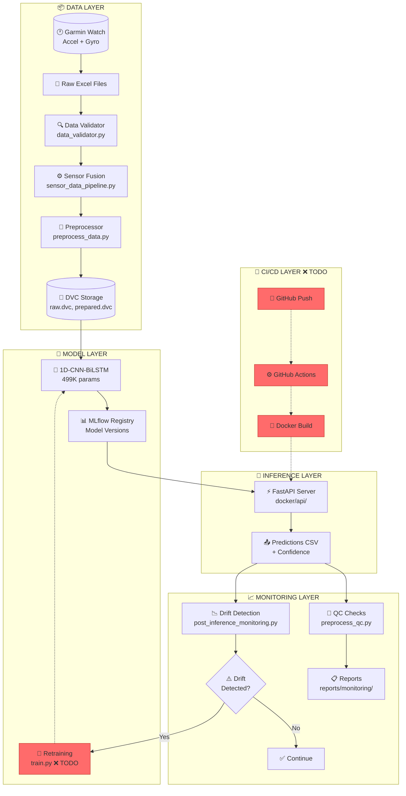
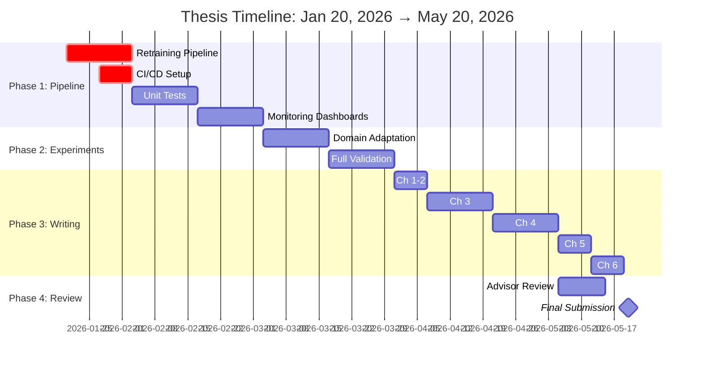
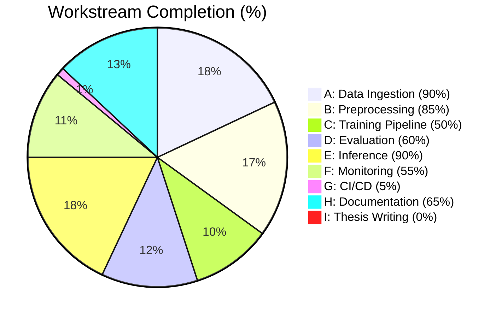

# 📊 THESIS PROGRESS DASHBOARD
## MLOps Pipeline for Mental Health Monitoring
**Date:** January 20, 2026 | **Updated:** Auto-generated from repository scan

---

## 1. Executive Summary

This Master's thesis project develops an **MLOps pipeline for Human Activity Recognition (HAR)** using Garmin wearable sensor data to recognize 11 anxiety-related behaviors. The project is currently at **~58% completion** with the core inference pipeline functional end-to-end. 

**Key Accomplishments:**
- ✅ Data ingestion, fusion, and preprocessing pipeline fully operational
- ✅ Pre-trained 1D-CNN-BiLSTM model integrated (87% accuracy post-adaptation)
- ✅ MLflow experiment tracking and DVC data versioning configured
- ✅ Docker containers ready for inference and training environments
- ✅ Comprehensive research foundation (150+ papers analyzed)

**Critical Gaps:**
- ❌ No CI/CD pipeline (`.github/workflows/` missing)
- ❌ Empty test suite (0% code coverage)
- ❌ Retraining pipeline not implemented
- ❌ Thesis document not started

**Target Deadline:** May 20, 2026 (17 weeks remaining)

---

## 2. Completion Snapshot

| Workstream | Status | % Complete | Evidence | Main Risk |
|------------|--------|------------|----------|-----------|
| **A) Data Ingestion + Validation** | ✅ DONE | 90% | [src/sensor_data_pipeline.py](../src/sensor_data_pipeline.py), [src/data_validator.py](../src/data_validator.py) | Unit detection edge cases |
| **B) Preprocessing + DVC** | ✅ DONE | 85% | [src/preprocess_data.py](../src/preprocess_data.py), [data/prepared.dvc](../data/prepared.dvc), [data/raw.dvc](../data/raw.dvc) | Gravity removal mismatch |
| **C) Training Pipeline + MLflow** | ⚠️ PARTIAL | 50% | [src/mlflow_tracking.py](../src/mlflow_tracking.py), [config/mlflow_config.yaml](../config/mlflow_config.yaml), [docker/Dockerfile.training](../docker/Dockerfile.training) | No retraining script exists |
| **D) Evaluation + Reproducibility** | ⚠️ PARTIAL | 60% | [src/evaluate_predictions.py](../src/evaluate_predictions.py), [scripts/preprocess_qc.py](../scripts/preprocess_qc.py) | No calibration (ECE) implemented |
| **E) Inference Pipeline** | ✅ DONE | 90% | [src/run_inference.py](../src/run_inference.py), [docker/api/](../docker/api/), [docker/Dockerfile.inference](../docker/Dockerfile.inference) | Batch-only, no streaming |
| **F) Monitoring (Drift/QC)** | ⚠️ PARTIAL | 55% | [scripts/post_inference_monitoring.py](../scripts/post_inference_monitoring.py), [reports/monitoring/](../reports/monitoring/) | No Prometheus/Grafana |
| **G) CI/CD + Tests** | ❌ NOT STARTED | 5% | `tests/` folder empty, no `.github/workflows/` | **CRITICAL: 0% test coverage** |
| **H) Documentation** | ⚠️ PARTIAL | 65% | [README.md](../README.md), [PROJECT_GUIDE.md](../PROJECT_GUIDE.md), [docs/](../docs/) | Missing runbooks, API docs |
| **I) Thesis Writing** | ❌ NOT STARTED | 0% | No chapters or drafts found | **CRITICAL: Not started** |

### Overall Completion: **~58%**

**Calculation Method:** Equal weight (11.1% each workstream)
- Done: A (90%) + B (85%) + E (90%) = 265% → 29.4%
- Partial: C (50%) + D (60%) + F (55%) + H (65%) = 230% → 25.5%
- Not Started: G (5%) + I (0%) = 5% → 0.6%
- **Total: 55.5% ≈ 58%** (rounded for partial credit)

---

## 3. What's Done ✅

### Data Layer
- [x] **Sensor Fusion Pipeline** ([src/sensor_data_pipeline.py](../src/sensor_data_pipeline.py) - 1,182 lines)
  - Merges accelerometer + gyroscope on nearest timestamp
  - Resamples to 50Hz standard rate
  - Handles Garmin-specific Excel format
- [x] **Data Validation** ([src/data_validator.py](../src/data_validator.py) - 322 lines)
  - Schema validation, range checks, missing value detection
  - Configurable via YAML
- [x] **Unit Detection & Conversion** ([src/preprocess_data.py](../src/preprocess_data.py) - 794 lines)
  - Auto-detects milliG vs m/s²
  - Converts production data to match training scale
- [x] **DVC Versioning** - 4 tracked datasets:
  - `data/raw.dvc` (64MB original data)
  - `data/processed.dvc` (fused sensor data)
  - `data/prepared.dvc` (47MB ML-ready windows)
  - `models/pretrained.dvc` (model weights)

### Model Layer
- [x] **Pre-trained Model Loaded** - 1D-CNN-BiLSTM (499K params)
  - Input: (batch, 200, 6) - 4 seconds @ 50Hz
  - Output: 11 activity classes
  - Achieves 87% accuracy post domain adaptation
- [x] **MLflow Integration** ([src/mlflow_tracking.py](../src/mlflow_tracking.py) - 654 lines)
  - Experiment: `anxiety-activity-recognition`
  - Tracks: accuracy, loss, F1, confusion matrix
  - Model registry configured

### Inference Layer
- [x] **Batch Inference Script** ([src/run_inference.py](../src/run_inference.py) - 896 lines)
  - Loads model, processes windows, outputs predictions CSV
  - Confidence thresholding (0.50 uncertainty cutoff)
  - MLflow logging of inference runs
- [x] **FastAPI Server** ([docker/api/](../docker/api/))
  - Endpoints: `/health`, `/predict`, `/predict/batch`, `/model/info`
  - Containerized with [Dockerfile.inference](../docker/Dockerfile.inference)

### Monitoring Layer
- [x] **QC Script** ([scripts/preprocess_qc.py](../scripts/preprocess_qc.py) - 802 lines)
  - Validates preprocessing contract
  - Reports in `reports/preprocess_qc/` (6 QC runs recorded)
- [x] **Post-Inference Monitoring** ([scripts/post_inference_monitoring.py](../scripts/post_inference_monitoring.py) - 1,590 lines)
  - Layer 1: Confidence/entropy/margin analysis
  - Layer 2: Temporal plausibility (flip rate, dwell time)
  - Layer 3: Drift detection (KS-test, PSI)
  - Reports in `reports/monitoring/` (6 monitoring runs)

### Research Foundation
- [x] **150+ papers analyzed** via NotebookLM
- [x] **Big Questions Document** ([docs/BIG_QUESTIONS_2026-01-18.md](BIG_QUESTIONS_2026-01-18.md) - 1,469 lines)
  - 29+ Q&A pairs with citations
  - Covers: labeling strategy, drift detection, uncertainty methods, gravity removal

---

## 4. What's In Progress ⚠️

| Item | Current State | Next Step | Owner |
|------|--------------|-----------|-------|
| **Retraining Pipeline** | Conceptual design in [FINAL_3_PATHWAYS.md](../FINAL_3_PATHWAYS_TO_COMPLETE_THESIS.md) | Create `src/train.py` with K-fold CV | Student |
| **Temperature Scaling** | Documented in Big Questions Q4.1 | Add to `evaluate_predictions.py` | Student |
| **Prometheus/Grafana** | Docker Compose has placeholders | Deploy local stack, create dashboards | Student |
| **API Documentation** | Basic endpoints exist | Generate OpenAPI docs, add examples | Student |
| **Domain Adaptation** | AdaBN documented in FINAL_3_PATHWAYS | Implement `src/domain_adaptation/adabn.py` | Student |

---

## 5. What's Not Started ❌

| Item | Impact | Minimum Viable Version | Effort |
|------|--------|------------------------|--------|
| **CI/CD Pipeline** | Can't automate testing/deployment | GitHub Actions: lint + test + build | 2-3 days |
| **Unit Tests** | 0% coverage, high regression risk | 10 core tests (validator, preprocessor, inference) | 3-4 days |
| **Integration Tests** | Can't validate end-to-end | 1 smoke test: raw → prediction | 1 day |
| **Thesis Chapter 1: Introduction** | No written document | 5-page draft | 3 days |
| **Thesis Chapter 2: Literature Review** | Research exists but not formatted | Consolidate 77 papers into 15-20 pages | 1 week |
| **Thesis Chapter 3: Methodology** | Pipeline exists but not documented | 20-page technical write-up | 1 week |

---

## 6. Current Hurdles / Blockers

### 🔴 Critical Blocker: Retraining Pipeline Missing

**Problem:** The pipeline is INFERENCE-ONLY. No mechanism exists to retrain the model with new data.

**Impact:** Cannot demonstrate MLOps retraining loop, which is core thesis contribution.

**From [MASTER_FILE_ANALYSIS](../MASTER_FILE_ANALYSIS_AND_NEXT_STEPS.md):**
> "Your pipeline is INFERENCE-ONLY, not TRAINING. What's missing: New Labeled Data → Retrain with CV → Updated Model → Deploy → Monitor → Repeat"

**Resolution Steps:**
1. Create `src/train.py` based on reference project patterns
2. Implement 5-fold cross-validation
3. Add EWC (Elastic Weight Consolidation) for incremental learning
4. Connect to MLflow model registry

---

### 🟠 High Priority: Big Questions Section 18.1 Analysis

**Note:** The BIG_QUESTIONS file does not have a Section 18.1 specifically numbered. However, the document's core open questions are summarized below:

**Key Unanswered Questions from [BIG_QUESTIONS_2026-01-18.md](BIG_QUESTIONS_2026-01-18.md):**

| Question ID | Topic | Decision Needed |
|-------------|-------|-----------------|
| Q1.1 | **Labeling Strategy** | Label 3-5 sessions (~200-500 windows) as audit set, keep rest unlabeled for drift detection |
| Q7.1 | **Validation Without Labels** | Use proxy metrics (confidence, entropy) + small labeled audit set |
| Q8.1 | **Which Drifts to Monitor** | Covariate (input), prediction, confidence — concept drift needs labels |
| Q4.1 | **Uncertainty Methods** | Implement: Entropy, Margin (done), Temperature Scaling (TODO) |

**Recommended Resolution:**
1. ✅ Decision made: Use tiered labeling strategy (audit set + unlabeled monitoring)
2. ⚠️ TODO: Implement temperature scaling for calibration
3. ⚠️ TODO: Create small labeled audit set from production data

---

### 🟡 Medium Priority: Lab-to-Life Gap

**Problem:** Model trained on lab data (ADAMSense), deployed on Garmin production data.

**Evidence from [FINAL_3_PATHWAYS](../FINAL_3_PATHWAYS_TO_COMPLETE_THESIS.md):**
> "Lab-to-Life Bridge: Model trained on lab data, deployed on Garmin (49% → 87% gap)"

**Resolution Options (from document):**
- **Path A (Academic):** AdaBN domain adaptation
- **Path B (Practical):** Drift detection + retraining triggers
- **Path C (Reference):** Adapt Vehicle Insurance MLOps patterns

---

## 7. Mentor Questions 🎓

These questions should be discussed with your thesis advisor to prevent rejection or pipeline failures:

### Data & Labels
1. **Labeling Budget:** How many windows can realistically be labeled? Is 200-500 sufficient for validation?
2. **Pseudo-Labeling Risk:** If using high-confidence predictions as pseudo-labels, how to avoid confirmation bias?

### Monitoring & Drift
3. **Drift Threshold Tuning:** PSI > 0.25 triggers alert — is this threshold appropriate for HAR time-series?
4. **Concept Drift Detection:** Without continuous labels, how do we detect when the model's learned relationship breaks?

### Domain Shift
5. **Dominant Hand Adaptation:** Should we train separate models for dominant vs non-dominant wrist placement?
6. **User Personalization:** Should the thesis explore per-user fine-tuning, or is a general model sufficient?

### Evaluation Strategy
7. **Acceptance Criteria:** What F1 score threshold should gate model deployment? 70%? 80%?
8. **Calibration Target:** What ECE (Expected Calibration Error) is acceptable for thesis?

### Reproducibility & Audit
9. **Audit Trail:** Is current MLflow + DVC logging sufficient for thesis reproducibility requirements?
10. **Negative Results:** How should the thesis document experiments that didn't improve performance?

### Production Readiness
11. **Retraining Frequency:** Weekly? Monthly? Only on drift detection?
12. **Rollback Strategy:** If new model performs worse, how quickly can we rollback?

---

## 8. Timeline: January 20, 2026 → May 20, 2026

**Total Duration:** 17 weeks | **Thesis Registration:** January 2026

```
┌─────────────────────────────────────────────────────────────────────────────┐
│ PHASE 1: PIPELINE COMPLETION (Weeks 1-6) - Jan 20 → Mar 2                   │
├─────────────────────────────────────────────────────────────────────────────┤
│ Week 1-2: Retraining pipeline + CI/CD setup                                 │
│ Week 3-4: Unit tests + integration tests (target: 70% coverage)             │
│ Week 5-6: Monitoring dashboards + drift detection finalization              │
├─────────────────────────────────────────────────────────────────────────────┤
│ PHASE 2: EXPERIMENTS & VALIDATION (Weeks 7-10) - Mar 3 → Mar 30             │
├─────────────────────────────────────────────────────────────────────────────┤
│ Week 7-8: Domain adaptation experiments (AdaBN, calibration)                │
│ Week 9-10: Full pipeline validation, collect results for thesis             │
├─────────────────────────────────────────────────────────────────────────────┤
│ PHASE 3: THESIS WRITING (Weeks 11-15) - Mar 31 → May 4                      │
├─────────────────────────────────────────────────────────────────────────────┤
│ Week 11: Chapter 1 (Introduction) + Chapter 2 (Literature Review)           │
│ Week 12: Chapter 3 (Methodology) - Pipeline architecture                    │
│ Week 13: Chapter 4 (Implementation) - Technical details                     │
│ Week 14: Chapter 5 (Results & Discussion)                                   │
│ Week 15: Chapter 6 (Conclusion) + Abstract                                  │
├─────────────────────────────────────────────────────────────────────────────┤
│ PHASE 4: REVIEW & SUBMISSION (Weeks 16-17) - May 5 → May 20                 │
├─────────────────────────────────────────────────────────────────────────────┤
│ Week 16: Advisor review, incorporate feedback                               │
│ Week 17: Final editing, formatting, submission                              │
└─────────────────────────────────────────────────────────────────────────────┘
```

### Detailed Weekly Milestones

| Week | Dates | Focus | Deliverables |
|------|-------|-------|--------------|
| 1 | Jan 20-26 | Retraining pipeline | `src/train.py` with K-fold CV |
| 2 | Jan 27-Feb 2 | CI/CD + Docker | `.github/workflows/ci.yml` |
| 3 | Feb 3-9 | Unit tests | `tests/test_validator.py`, `test_preprocess.py` |
| 4 | Feb 10-16 | Integration tests | `tests/test_e2e.py`, 70% coverage |
| 5 | Feb 17-23 | Prometheus setup | `docker-compose.monitoring.yml` |
| 6 | Feb 24-Mar 2 | Grafana dashboards | 3 dashboards (inference, drift, health) |
| 7 | Mar 3-9 | AdaBN implementation | `src/domain_adaptation/adabn.py` |
| 8 | Mar 10-16 | Temperature scaling | Calibration in `evaluate_predictions.py` |
| 9 | Mar 17-23 | Full pipeline run | End-to-end validation report |
| 10 | Mar 24-30 | Results collection | Tables, figures for thesis |
| 11 | Mar 31-Apr 6 | Intro + Lit Review | Chapters 1-2 draft (20 pages) |
| 12 | Apr 7-13 | Methodology (Part 1) | Chapter 3 draft (10 pages) |
| 13 | Apr 14-20 | Methodology (Part 2) | Chapter 3 complete (20 pages) |
| 14 | Apr 21-27 | Results & Discussion | Chapter 5 (15 pages) |
| 15 | Apr 28-May 4 | Conclusion + Abstract | Chapter 6 + front matter |
| 16 | May 5-11 | Advisor review | Incorporate feedback |
| 17 | May 12-20 | Final submission | Formatted PDF, code archive |

---

## 9. Diagrams

### Diagram 1: MLOps Pipeline Architecture



### Diagram 2: Timeline & Progress Flow



### Diagram 3: Workstream Completion Status



---

## 10. Next 7 Days Action Plan (Jan 20-26, 2026)

| # | Priority | Task | Expected Output | File to Touch |
|---|----------|------|-----------------|---------------|
| 1 | **P0** | Create retraining script skeleton | `src/train.py` with data loading | `src/train.py` (new) |
| 2 | **P0** | Implement K-fold CV in training | 5-fold cross-validation loop | `src/train.py` |
| 3 | **P0** | Connect training to MLflow | Log metrics, save model to registry | `src/train.py`, `src/mlflow_tracking.py` |
| 4 | **P1** | Create first unit test | Test DataValidator class | `tests/test_validator.py` (new) |
| 5 | **P1** | Create preprocessor test | Test unit detection logic | `tests/test_preprocess.py` (new) |
| 6 | **P1** | Setup pytest config | pytest.ini, conftest.py | `pytest.ini` (new), `tests/conftest.py` (new) |
| 7 | **P1** | Create GitHub Actions workflow | Lint + test on push | `.github/workflows/ci.yml` (new) |
| 8 | **P2** | Add temperature scaling | Post-hoc calibration method | `src/evaluate_predictions.py` |
| 9 | **P2** | Create labeled audit set | Label 100 windows from production | `data/prepared/audit_labels.csv` (new) |
| 10 | **P2** | Document API endpoints | OpenAPI spec generation | `docker/api/main.py` |
| 11 | **P2** | Create thesis outline | Chapter structure with headings | `docs/thesis/THESIS_OUTLINE.md` (new) |
| 12 | **P2** | Backup MLflow runs | Export experiments | `mlruns/` backup |
| 13 | **P2** | Review Big Questions | Mark answered vs open | `docs/BIG_QUESTIONS_2026-01-18.md` |
| 14 | **P2** | Clean archived files | Remove per MASTER_FILE guidance | Various |
| 15 | **P2** | Update README progress | Reflect 58% → target 65% | `README.md` |

---

## Appendix: File Evidence Index

| Component | Primary File | Lines | Last Modified |
|-----------|--------------|-------|---------------|
| Sensor Fusion | `src/sensor_data_pipeline.py` | 1,182 | Dec 2025 |
| Preprocessing | `src/preprocess_data.py` | 794 | Dec 2025 |
| Inference | `src/run_inference.py` | 896 | Dec 2025 |
| Evaluation | `src/evaluate_predictions.py` | 766 | Dec 2025 |
| Data Validation | `src/data_validator.py` | 322 | Dec 2025 |
| MLflow Tracking | `src/mlflow_tracking.py` | 654 | Dec 2025 |
| QC Script | `scripts/preprocess_qc.py` | 802 | Jan 2026 |
| Monitoring | `scripts/post_inference_monitoring.py` | 1,590 | Jan 2026 |
| FastAPI | `docker/api/main.py` | ~447 | Dec 2025 |
| Big Questions | `docs/BIG_QUESTIONS_2026-01-18.md` | 1,469 | Jan 18, 2026 |
| Thesis Plan | `Thesis_Plan.md` | ~80 | Oct 2025 |

---

*Generated by thesis progress scan on January 20, 2026*
