# 🎓 MENTOR Q&A: Simple Answers with Evidence

**Last Updated:** January 21, 2026  
**Purpose:** Answer thesis questions with repo evidence + paper citations  
**Style:** Simple English, short sentences, no buzzwords

---

## 1) Summary (8 lines)

**Where we are now:**
- Pipeline runs end-to-end: Raw Garmin → Fusion → Preprocessing → Inference → Predictions 

**What is blocked:**
- No labels in production. We cannot compute real accuracy.
- Retraining pipeline exists only as concept. No working `src/train.py`.
- No CI/CD. No tests. Thesis writing not started.

**What we will do next:**
- Build proxy monitoring (confidence + entropy + drift).
- Create audit set (100-500 labeled windows). Use for validation.
- Implement retraining trigger based on proxy metrics.

---

## 2) Glossary (Simple Meanings)

### Confidence
- **What it is:** The highest probability the model gives to any class. Example: model says 87% sitting, 8% standing, 5% walking → confidence = 0.87.
- **Why it helps:** High confidence often means the model is sure. We can filter out low-confidence predictions.
- **What it does NOT guarantee:** The model can be wrong even at 95% confidence. This is called "overconfidence." We need calibration to fix this.

### Entropy
- **What it is:** Measures how spread the probability is. Low entropy = one class dominates. High entropy = model is confused.
- **Formula:** H = -Σ p × log(p)
- **Why it helps when no labels:** High entropy windows are suspicious. They might be wrong. We can flag them for review.
- **Interpretation:** H=0 means certain. H>2.0 means very uncertain (for 11 classes).

### Drift
- **What it is:** When production data looks different from training data.  
- **Two types:**
  - **Covariate drift:** Input features change. Example: new user has different movement patterns.
  - **Concept drift:** The relationship between input and output changes. Example: "sitting" now looks different.
- **Why it matters:** If drift is big, model predictions become unreliable. We may need to retrain.

### Audit Set / Audit Labeling
- **What it is:** A small set of production windows (100-500) that we manually label.
- **Why "audit":** We use it to check (audit) if the model is working. Like a financial audit but for predictions.
- **How we use it:** Compare predictions vs. true labels. Calculate real accuracy.

### Risk Score
- **What it is:** A number (0 to 1) that says "how risky is this prediction?"
- **In our project:** Risk = uncertainty. High risk = model might be wrong.
- **Options:** risk = 1 - confidence, or risk = normalized entropy.

### A/B/C/D Wrist Situations
- **A = Right wrist + Right-dominant:** Watch on active hand. Best signal.
- **B = Left wrist + Left-dominant:** Watch on active hand. Good signal.
- **C = Left wrist + Right-dominant:** Watch on passive hand. Weaker signal. (~70% of users)
- **D = Right wrist + Left-dominant:** Watch on passive hand. Weaker signal.
- **Why it matters:** Cases C and D have lower signal-to-noise ratio. Model accuracy drops 10-15%.

---

## 3) Mentor Questions + Answers

---

### Q1) Production has no labels. How do we monitor model quality?

**Why this matters (2-3 lines):**
In production, users do not tell us the true activity. We cannot calculate accuracy or F1. But we still need to know if the model is working. We use "proxy metrics" — indirect signals that suggest something is wrong.

**What we can measure without labels (bullet list):**
- **Mean confidence:** If it drops, the model is less sure.
- **Mean entropy:** If it rises, predictions are more spread out.
- **Flip rate:** How often the prediction changes between adjacent windows.
- **Feature drift:** KS-test or PSI comparing production features to training baseline.
- **Prediction distribution:** If suddenly 80% predictions are "sitting," something changed.

**What we cannot know without labels (bullet list):**
- True accuracy (% correct predictions).
- True F1-score per class.
- Confusion matrix (which classes are confused).
- Concept drift (when the same input should give different output).

**Repo evidence:**
- [scripts/post_inference_monitoring.py](../scripts/post_inference_monitoring.py) — Implements 3-layer monitoring: Layer 1 (confidence/entropy), Layer 2 (temporal: flip rate, dwell time), Layer 3 (drift: KS-test, PSI).
- [docs/output_1801_2026-01-18.md](output_1801_2026-01-18.md) (Pair 13) — "4-layer monitoring framework for unlabeled data."
- [docs/BIG_QUESTIONS_2026-01-18.md](BIG_QUESTIONS_2026-01-18.md) (Q8.1) — "Which drifts can we detect without labels?"

**Paper evidence:**
- *From_Development_to_Deployment_An_Approach_to_MLOps_Monitoring, 2023* (papers/mlops_production/) — p.9-11: "Two-sample tests enable distribution shift detection on unlabeled production data."
- *MACHINE LEARNING OPERATIONS A SURVEY ON MLOPS* (papers/mlops_production/) — p.12-13: "Monitor confidence, prediction distribution, input feature statistics."
- *Domain Adaptation for IMU-based Human Activity Recognition* (papers/domain_adaptation/) — p.4-5: "Detecting drift without ground truth relies on KS test, MMD, or Jensen-Shannon divergence."

**Answer (simple):**
We monitor 4 things:
1. **Confidence** — Model's certainty. Dropping confidence = problem.
2. **Entropy** — Spread of probabilities. Rising entropy = confusion.
3. **Flip rate** — Stability over time. High flip rate = noisy predictions.
4. **Feature drift** — Compare production stats to training. Big difference = distribution shifted.

**Why each metric:**
| Metric | What it tells us | What it cannot tell us |
|--------|------------------|------------------------|
| Confidence | Model is uncertain | If prediction is correct |
| Entropy | Model is confused | Which class is wrong |
| Flip rate | Predictions unstable | If changes are errors |
| KS/PSI drift | Input distribution changed | If change hurts accuracy |

**Decision rule we will use (threshold/persistence):**
- **Confidence threshold:** Alert if mean confidence < 0.50.
- **Entropy threshold:** Alert if mean entropy > 2.0.
- **Drift threshold:** Alert if PSI > 0.25 on ≥2 of 6 channels.
- **Persistence rule:** Condition must hold for ≥3 consecutive windows/sessions before triggering.

**Next action (script/file to update):**
- Update [scripts/post_inference_monitoring.py](../scripts/post_inference_monitoring.py) to add persistence logic.
- Create `src/monitoring/retraining_trigger.py` that checks all conditions.

---

### Q2) What is our retraining trigger policy?

**Why this matters (2-3 lines):**
We cannot retrain every day. It is expensive. We need clear rules: when to retrain, when to wait. The policy must be based on evidence, not guessing.

**What we can measure without labels (bullet list):**
- Confidence collapse (mean drops below baseline by >0.15).
- Entropy spike (mean rises above baseline by >0.5).
- Flip rate increase (rises above 0.30).
- Feature drift (PSI > 0.25 on multiple channels).

**What we cannot know without labels (bullet list):**
- If accuracy actually dropped.
- If retraining will improve performance.

**Repo evidence:**
- [docs/output_1801_2026-01-18.md](output_1801_2026-01-18.md) (Pair 01) — "Retraining triggers: F1 < 0.80 or drift detected."
- [docs/BIG_QUESTIONS_2026-01-18.md](BIG_QUESTIONS_2026-01-18.md) (Q7.1) — "Retraining workflow without labels."
- [scripts/post_inference_monitoring.py](../scripts/post_inference_monitoring.py) (lines 70-100) — MonitoringConfig with thresholds.

**Paper evidence:**
- *MLOps A Step Forward to Enterprise Machine Learning 2023* (papers/mlops_production/) — p.7-8: "Trigger retraining based on performance degradation, data drift, or scheduled intervals."
- *Essential_MLOps_Data_Science_Horizons 2023* (papers/mlops_production/) — p.97-104: "Proxy metrics (confidence, prediction drift) as substitutes for accuracy when ground truth unavailable."

**Answer (simple):**
Our retraining trigger policy uses 4 conditions:

| Condition | Metric | Threshold | Check |
|-----------|--------|-----------|-------|
| Confidence collapse | mean_confidence | < 0.50 | Daily |
| Entropy spike | mean_entropy | > 2.0 | Daily |
| High flip rate | flip_rate | > 0.30 | Per session |
| Feature drift | PSI per channel | > 0.25 on ≥2 channels | Weekly |

**Persistence rule:** Any condition must be true for **3 consecutive checks** before triggering.

**How we set thresholds scientifically:**
1. **From baseline data:** Calculate mean/std on training data. Set threshold at 95th percentile.
2. **From papers:** PSI > 0.25 is standard "major shift" threshold.
3. **From monitoring history:** Adjust if too many false alarms.

**Decision rule we will use:**
```
IF (mean_confidence < 0.50 for 3 days) OR
   (PSI > 0.25 on ≥2 channels for 2 weeks) OR
   (flip_rate > 0.30 for 3 sessions)
THEN trigger_retraining = True
```

**Next action (script/file to update):**
- Create `src/monitoring/retraining_trigger.py`.
- Add threshold history tracking to MLflow.

---

### Q3) After drift is detected, how do we get labels (label acquisition stage)?

**Why this matters (2-3 lines):**
You cannot retrain without labels. Labeling all data is too expensive. We need a smart plan: label only a small subset that gives maximum information.

**What we can measure without labels (bullet list):**
- Uncertainty scores (entropy, margin) to find confusing samples.
- Drift magnitude to find shifted samples.
- Prediction distribution to find underrepresented classes.

**What we cannot know without labels (bullet list):**
- Which specific windows are wrong.
- True class distribution in production.

**Repo evidence:**
- [docs/output_1801_2026-01-18.md](output_1801_2026-01-18.md) (Pair 01) — "Label 3-5 sessions (~200-500 windows). Stratified selection: temporal diversity, feature coverage, class balance, uncertainty-based."
- [docs/BIG_QUESTIONS_2026-01-18.md](BIG_QUESTIONS_2026-01-18.md) (Q1.1) — "Tier 2: Keep rest unlabeled. Tier 3: Active learning."

**Paper evidence:**
- *activear.pdf* (papers/new paper/) — Title suggests active learning for activity recognition.
- *Transfer Learning in HAR: A Survey* (papers/domain_adaptation/) — p.8-9: "Few-shot fine-tuning with 5-50 labeled samples per class can bridge performance gaps."
- *Domain Adaptation for IMU-based Human Activity Recognition* (papers/domain_adaptation/) — p.2-3: "Small labeled target samples enable significant adaptation."

**Answer (simple):**

**Simple plan for audit set:**

| Step | Action | Details |
|------|--------|---------|
| 1 | Select 100-500 windows | Mix of random (50%) + uncertain (50%) |
| 2 | Manual labeling | Human watches video or recalls activity. ~2-4 hours work. |
| 3 | Validate selection | Check all 11 classes represented. |
| 4 | Store with metadata | Save as `data/audit/labeled/*.csv` with session_id, window_id, true_label. |

**Selection strategy:**
- **50% random:** Representative of overall distribution.
- **50% uncertain:** High entropy (>1.5) or low margin (<0.15). These are where model struggles.

**Two options for getting labels:**

| Option | Description | Effort | When to use |
|--------|-------------|--------|-------------|
| **Sentinel session** | User does scripted activities while recording. We know ground truth. | 1 hour recording + 1 hour prep | Best for controlled validation |
| **Retrospective labeling** | Review past sessions. Label from memory or video. | 2-4 hours labeling | When we cannot do new recording |

**Decision rule we will use:**
After drift detected:
1. Wait 1 week to collect more production data.
2. Sample 300 windows (150 random + 150 uncertain).
3. Label them (manual, ~3 hours).
4. Retrain on combined data (old training + new labeled).
5. If accuracy > 75% on audit set → deploy new model.

**Next action (script/file to update):**
- Create `scripts/labeling/select_audit_samples.py`.
- Create `data/audit/` directory structure.
- Create `docs/LABELING_WORKFLOW.md` with instructions.

---

### Q4) What are the A/B/C/D wrist situations and why do they matter?

**Why this matters (2-3 lines):**
~70% of people are right-handed and wear watches on left wrist. But most anxiety behaviors use the dominant (right) hand. This creates a signal mismatch. The watch sees weaker, secondary motion.

**What we can measure without labels (bullet list):**
- Signal amplitude (variance) per session.
- Confidence distribution per session.
- Motion energy (std of accelerometer magnitude).

**What we cannot know without labels (bullet list):**
- If lower confidence is due to wrist placement or actually wrong predictions.

**Repo evidence:**
- [docs/output_1801_2026-01-18.md](output_1801_2026-01-18.md) (Pair 02) — "Non-dominant wrist has lower signal-to-noise ratio. Use adaptive thresholds: Normal confidence 0.50 → Relaxed (non-dominant): 0.35."
- [scripts/post_inference_monitoring.py](../scripts/post_inference_monitoring.py) (lines 92-161) — `get_effective_thresholds(dominance_match=False)` with relaxed thresholds.
- [docs/BIG_QUESTIONS_2026-01-18.md](BIG_QUESTIONS_2026-01-18.md) (Q9.1) — "Detecting dominant hand patterns."

**Paper evidence:**
- *Transfer Learning in HAR: A Survey* (papers/domain_adaptation/) — p.4-5: "Cross-position heterogeneity causes variability in sensor readings when the same device is placed on different body parts."
- *Domain Adaptation for IMU-based Human Activity Recognition* (papers/domain_adaptation/) — p.1-3: "Sensor placement causes data distribution heterogeneities."

**Answer (simple):**

**The 4 cases:**

| Case | Watch Wrist | User Dominant Hand | Match? | Signal Quality | Expected Accuracy |
|------|-------------|-------------------|--------|----------------|-------------------|
| A | Right | Right | ✅ Yes | High | Best (~87%) |
| B | Left | Left | ✅ Yes | High | Good (~85%) |
| C | Left | Right | ❌ No | Low | Degraded (~75%) |
| D | Right | Left | ❌ No | Low | Degraded (~75%) |

**Why cases C and D are problematic:**
- User performs activity with dominant hand (e.g., nail biting with right hand).
- Watch is on opposite wrist (left).
- Watch sees indirect, attenuated motion.
- Signal amplitude is 60-80% of matched case.
- Model was trained on mostly matched data.

**Our adaptation strategy:**
1. **Store metadata:** Record `dominant_hand`, `watch_wrist`, `dominance_match` per session.
2. **Use relaxed thresholds:** For mismatched cases, lower confidence threshold from 0.50 to 0.35.
3. **Report separately:** Calculate metrics for matched vs. mismatched groups.

**Decision rule we will use:**
```python
if dominance_match == False:
    confidence_threshold = 0.35  # relaxed
    entropy_threshold = 2.5      # relaxed
    max_flip_rate = 0.45         # relaxed
```

**Next action (script/file to update):**
- Create `data/metadata/session_registry.csv` with wrist placement info.
- Update inference to load metadata and select thresholds.

---

### Q5) How do we measure distribution shift across A/B/C/D and detect the domain?

**Why this matters (2-3 lines):**
If we can automatically detect which case (A/B/C/D) a session belongs to, we can apply the right thresholds. We do not need to ask the user every time.

**What we can measure without labels (bullet list):**
- Mean/std of each sensor channel.
- Magnitude energy: sqrt(Ax² + Ay² + Az²) standard deviation.
- Gravity direction stability (low variance = stable orientation).
- Spectral features (frequency content).

**What we cannot know without labels (bullet list):**
- True dominant hand (unless user tells us).
- True wrist placement (unless stored in metadata).

**Repo evidence:**
- [scripts/post_inference_monitoring.py](../scripts/post_inference_monitoring.py) (lines 620-900) — DriftDetector with KS-test, PSI.
- [docs/output_1801_2026-01-18.md](output_1801_2026-01-18.md) (Pair 02) — "Variance analysis: Non-dominant has lower variance."

**Paper evidence:**
- *Domain Adaptation for IMU-based Human Activity Recognition* (papers/domain_adaptation/) — p.5-6: "Domain labels enable domain-adversarial training... position/device metadata serves similar purpose."
- *Transfer Learning in HAR: A Survey* (papers/domain_adaptation/) — p.11-12: "Cross-position evaluation requires proper stratification... aggregate metrics can hide significant performance gaps."

**Answer (simple):**

**Features to compare across A/B/C/D:**

| Feature | What it shows | Calculation |
|---------|---------------|-------------|
| Accel variance | Motion intensity | var(Ax), var(Ay), var(Az) |
| Magnitude energy | Overall movement | std(sqrt(Ax²+Ay²+Az²)) |
| Gravity direction | Orientation stability | var of Az over window |
| Peak frequency | Activity rhythm | FFT dominant frequency |

**Tests to use:**
- **KS-test:** Compare distribution shape. p < 0.05 = different.
- **Wasserstein distance:** Distribution distance. > 0.5 = significant shift.
- **Mean shift:** Simple |μ_prod - μ_train| / σ_train. > 0.5 = shifted.

**Building a case classifier:**
1. Collect labeled examples of each case (10-20 sessions per case).
2. Extract features: [mean_variance, magnitude_energy, gravity_stability, confidence_mean].
3. Train simple classifier (Random Forest or Logistic Regression).
4. At inference: Predict case → apply corresponding thresholds.

**Decision rule we will use:**
```
IF magnitude_energy < 0.6 * training_baseline AND confidence_mean < 0.60:
    predicted_case = "C_or_D" (mismatch)
    use_relaxed_thresholds = True
```

**Next action (script/file to update):**
- Create `scripts/analysis/detect_wrist_case.py`.
- Add case prediction to inference metadata.

---

### Q6) Evaluation script: production vs retraining — one script or two?

**Why this matters (2-3 lines):**
Production evaluation has no labels. Retraining evaluation has labels. They need different metrics. Should we build one flexible script or two separate scripts?

**What we can measure without labels (bullet list):**
- Confidence statistics (mean, std, percentiles).
- Entropy statistics.
- Prediction distribution.
- Drift metrics.

**What we cannot know without labels (bullet list):**
- Accuracy, F1, precision, recall.
- Confusion matrix.
- Per-class performance.

**Repo evidence:**
- [src/evaluate_predictions.py](../src/evaluate_predictions.py) — Has both `ClassificationEvaluator` (needs labels) and `PredictionAnalyzer` (no labels).
- [docs/BIG_QUESTIONS_2026-01-18.md](BIG_QUESTIONS_2026-01-18.md) (Q2.2) — "Two evaluation modes: ground-truth (labeled) and proxy (unlabeled)."

**Paper evidence:**
- *Essential_MLOps_Data_Science_Horizons 2023* (papers/mlops_production/) — p.97-104: "Proxy metrics as substitutes when ground truth unavailable."

**Answer (simple):**

**Comparison:**

| Aspect | Production Mode | Retraining Mode |
|--------|-----------------|-----------------|
| Labels available | ❌ No | ✅ Yes |
| Accuracy/F1 | ❌ Cannot compute | ✅ Compute |
| Confusion matrix | ❌ Cannot compute | ✅ Compute |
| Calibration (ECE) | ❌ Cannot compute | ✅ Compute |
| Confidence stats | ✅ Compute | ✅ Compute |
| Drift metrics | ✅ Compute | ✅ Compare old vs new |
| Per-domain scores | ⚠️ Proxy only | ✅ Real F1 per case |

**Recommendation: ONE script with TWO modes.**

**Pros of single script:**
- Shared code for loading predictions.
- Consistent metric names.
- Easier to maintain.

**Cons of single script:**
- More complex argument handling.
- Risk of accidentally running wrong mode.

**Proposed design:**
```python
# src/evaluate_predictions.py

def evaluate(predictions_path, labels_path=None, mode='auto'):
    """
    mode='auto': Detect if labels exist
    mode='production': Force proxy metrics only
    mode='retraining': Require labels, compute full metrics
    """
    if mode == 'auto':
        mode = 'retraining' if labels_path else 'production'
    
    if mode == 'production':
        return evaluate_proxy_metrics(predictions_path)
    else:
        return evaluate_with_labels(predictions_path, labels_path)
```

**Decision rule we will use:**
- Keep one script.
- Add `--mode` argument: `production` or `retraining`.
- Default: auto-detect based on labels file existence.

**Next action (script/file to update):**
- Update [src/evaluate_predictions.py](../src/evaluate_predictions.py) with explicit mode parameter.
- Add ECE (Expected Calibration Error) to retraining mode.

---

### Q7) Gravity removal: what is it and when do we use it?

**Why this matters (2-3 lines):**
Accelerometer measures two things mixed together: gravity (constant, pointing down) and motion (what we want). If training data removed gravity but production data did not, there is a mismatch.

**What we can measure without labels (bullet list):**
- Az mean value (~-9.81 m/s² if gravity present, ~0 if removed).
- Low-frequency power in accelerometer spectrum.

**What we cannot know without labels (bullet list):**
- Which approach gives better accuracy without testing.

**Repo evidence:**
- [docs/BIG_QUESTIONS_2026-01-18.md](BIG_QUESTIONS_2026-01-18.md) (Q6.1) — "Gravity affects ALL axes, but mostly Az when wrist horizontal."
- [src/sensor_data_pipeline.py](../src/sensor_data_pipeline.py) (lines 720-850) — GravityRemovalPreprocessor with Butterworth high-pass filter.
- [config/pipeline_config.yaml](../config/pipeline_config.yaml) — `enable_gravity_removal: false` setting.

**Paper evidence:**
- Evidence missing for specific gravity removal paper. Need to search in `papers/` for UCI HAR or accelerometer preprocessing papers.

**Answer (simple):**

**What is gravity in accelerometer:**
```
Total acceleration = Body motion + Gravity
```
- Gravity is always ~9.81 m/s² pointing down (Earth reference).
- In device coordinates, it depends on orientation.
- Wrist horizontal: mostly on Az axis.
- Wrist tilted: spread across Ax, Ay, Az.

**Why gravity removal can help:**
- Motion is what we care about.
- Gravity is "noise" that depends on orientation.
- Removing gravity makes features more orientation-invariant.

**When keeping gravity helps:**
- Posture detection (sitting vs standing uses gravity direction).
- Static activities (gravity tells us phone orientation).

**How to remove gravity:**
```python
# High-pass filter removes low-frequency (DC) component
from scipy.signal import butter, filtfilt

def remove_gravity(accel_data, cutoff_hz=0.3, fs=50):
    nyquist = fs / 2
    b, a = butter(3, cutoff_hz / nyquist, btype='high')
    return filtfilt(b, a, accel_data, axis=0)
```

**Our situation:**
- Training data (ADAMSense paper): Gravity already removed (Az mean = -3.42 m/s²).
- Production data (Garmin): Gravity present (Az mean = -9.83 m/s²).
- **Mismatch!** This causes problems.

**Recommendation:**
1. **Match training:** If training removed gravity → remove from production.
2. **Ablation experiment:** Test both options. Compare confidence distributions.
3. **Document decision:** Whatever we choose, be consistent.

**Decision rule we will use:**
- Set `enable_gravity_removal: True` in config.
- Monitor Az mean after preprocessing. Should be near 0, not -9.81.

**Next action (script/file to update):**
- Update [config/pipeline_config.yaml](../config/pipeline_config.yaml): Set `enable_gravity_removal: True`.
- Add validation check in preprocessing: assert |Az_mean| < 1.0 after gravity removal.

---

### Q8) Normalization: why, which scaler, where to store?

**Why this matters (2-3 lines):**
Neural networks work best when input features have similar scale. We use StandardScaler (mean=0, std=1). But the scaler must be fitted on training data only, and the same parameters must be used at inference.

**What we can measure without labels (bullet list):**
- Feature means and stds before/after normalization.
- Whether normalized data is close to N(0,1).

**What we cannot know without labels (bullet list):**
- Which scaler gives best accuracy without testing.

**Repo evidence:**
- [data/prepared/config.json](../data/prepared/config.json) — Contains `scaler_mean: [3.22, 1.28, -3.53, 0.60, 0.23, 0.09]` and `scaler_scale: [6.57, 4.35, 3.24, 49.93, 14.81, 14.17]`.
- [src/preprocess_data.py](../src/preprocess_data.py) (lines 507-521) — Scaler loading from config.json.
- [docs/BIG_QUESTIONS_2026-01-18.md](BIG_QUESTIONS_2026-01-18.md) (Q5.1) — "Why fit scaler on training only?"

**Paper evidence:**
- *Practical-mlops-operationalizing-machine-learning-models* (papers/mlops_production/) — p.145-148: "Inference requires exact replication of training-time preprocessing... storing normalization statistics alongside model artifacts is essential."

**Answer (simple):**

**Why normalize:**
- Accelerometer range: -50 to +50 m/s².
- Gyroscope range: -500 to +500 deg/s.
- Without normalization, gyroscope dominates because of larger values.
- Normalization puts all channels on same scale.

**Which scaler:**

| Scaler | Formula | When to use |
|--------|---------|-------------|
| StandardScaler | (x - mean) / std | Normal distributions, no extreme outliers |
| RobustScaler | (x - median) / IQR | Data has outliers |
| MinMaxScaler | (x - min) / (max - min) | Bounded range needed |

**Our choice: StandardScaler** because sensor data is roughly Gaussian.

**Where to store:**
```
data/prepared/config.json
├── scaler_mean: [3.22, 1.28, -3.53, 0.60, 0.23, 0.09]
└── scaler_scale: [6.57, 4.35, 3.24, 49.93, 14.81, 14.17]
```

**Critical rule:** NEVER refit scaler on production data. Always use training statistics.

**What happens after fine-tuning:**
1. If fine-tuning data is similar to original training → keep same scaler.
2. If fine-tuning data is very different → refit scaler on combined data.
3. **Version together:** Model v2 must use scaler fitted on same data as model v2.

**Decision rule we will use:**
- Store scaler params in `config.json` next to model.
- Validate at inference: Check `scaler_fitted_date` matches model training date.
- If mismatch: Log warning and stop.

**Next action (script/file to update):**
- Add `scaler_fitted_date` field to config.json.
- Add validation in [src/run_inference.py](../src/run_inference.py).

---

### Q9) Risk score definition: what is "risk" in our thesis?

**Why this matters (2-3 lines):**
"Risk" means the prediction might be wrong. We need a single number to rank predictions. This helps prioritize which ones to review or flag for human verification.

**What we can measure without labels (bullet list):**
- Max probability (confidence).
- Entropy of probability distribution.
- Margin (top1 - top2 probability).
- Drift magnitude.

**What we cannot know without labels (bullet list):**
- True error rate at each risk level.

**Repo evidence:**
- [scripts/post_inference_monitoring.py](../scripts/post_inference_monitoring.py) (lines 339-370) — Computes confidence, entropy, margin.
- [docs/output_1801_2026-01-18.md](output_1801_2026-01-18.md) (Pair 15) — "3-tier uncertainty framework."

**Paper evidence:**
- *NeurIPS-2020-energy-based-out-of-distribution-detection* (papers/new paper/) — Energy score for OOD detection.
- *NeurIPS-2021-adaptive-conformal-inference-under-distribution-shift* (papers/new paper/) — Adaptive inference under shift.

**Answer (simple):**

**Three options for risk score:**

| Option | Formula | Range | Interpretation |
|--------|---------|-------|----------------|
| A | risk = 1 - confidence | 0-1 | Simple. High risk = low confidence. |
| B | risk = entropy / log(K) | 0-1 | Normalized entropy. K=11 classes. |
| C | risk = w₁×(1-conf) + w₂×entropy + w₃×drift | 0-1 | Weighted combination. |

**Recommended: Option A (1 - confidence)**

**Why:**
- Simplest to understand and explain.
- Directly related to model's self-assessment.
- Easy to set threshold (risk > 0.5 = confidence < 0.5).
- Papers show confidence correlates with error rate (when calibrated).

**When to use Option B:**
- If confidence is overconfident (not calibrated).
- Entropy captures multi-class confusion better.

**When to use Option C:**
- If you want to incorporate drift signals.
- Requires tuning weights (w₁, w₂, w₃).

**Decision rule we will use:**
```python
risk = 1 - confidence  # Option A

if risk > 0.5:
    flag = "HIGH_RISK"
elif risk > 0.3:
    flag = "MEDIUM_RISK"
else:
    flag = "LOW_RISK"
```

**Next action (script/file to update):**
- Add `risk_score` column to predictions CSV.
- Add risk distribution to monitoring report.

---

### Q10) Risk threshold: how do we choose 0.3-0.5 scientifically?

**Why this matters (2-3 lines):**
If threshold is too low, we flag everything (too many false alarms). If too high, we miss errors. We need a principled way to choose.

**What we can measure without labels (bullet list):**
- Baseline risk distribution (from training or initial production).
- Percentiles (90th, 95th, 99th).

**What we cannot know without labels (bullet list):**
- P(error | risk > t) — the error rate above threshold.

**Repo evidence:**
- [scripts/post_inference_monitoring.py](../scripts/post_inference_monitoring.py) (lines 70-100) — Default thresholds: confidence_threshold=0.50, entropy_threshold=2.0.
- [docs/output_1801_2026-01-18.md](output_1801_2026-01-18.md) (Pair 01) — "Confidence < 50% = uncertain."

**Paper evidence:**
- Evidence missing for specific calibration paper with threshold selection. Need paper on "expected calibration error" or "reliability diagrams."

**Answer (simple):**

**Two approaches to set threshold:**

**Approach 1: Labeled audit set (RECOMMENDED)**
1. Get small labeled audit set (100-500 windows).
2. For each threshold t ∈ [0.1, 0.2, ..., 0.9]:
   - Compute error_rate = P(error | risk > t)
3. Plot curve: threshold vs. error rate.
4. Choose t where error_rate drops below acceptable level (e.g., 20%).

**Approach 2: Baseline quantiles (when no labels)**
1. Compute risk scores on training data (where we know ground truth).
2. Set threshold at 95th percentile of risk scores for correct predictions.
3. Interpretation: "If risk is above what 95% of correct predictions have, flag it."

**Example calculation:**
```python
# On training data with labels
correct_mask = (predictions == true_labels)
risk_correct = risk_scores[correct_mask]
threshold = np.percentile(risk_correct, 95)  # e.g., 0.42
```

**Which to use first:**
1. Start with Approach 2 (baseline quantiles) — no labels needed.
2. After creating audit set, use Approach 1 to refine.
3. Monitor and adjust over time.

**Decision rule we will use:**
- Initial threshold: Use 95th percentile from training baseline.
- After audit set: Calibrate using P(error | risk > t) curve.
- Persistence: Only flag if high risk for ≥3 consecutive windows.

**Next action (script/file to update):**
- Add threshold calibration script: `scripts/calibration/set_risk_threshold.py`.
- Store threshold in `config/monitoring_config.yaml`.

---

### Q11) Cross-validation for retraining: should we use it?

**Why this matters (2-3 lines):**
Random train/test split is wrong for time-series. Windows from same session are correlated. If we split randomly, test set "leaks" information from training.

**What we can measure without labels (bullet list):**
- N/A — this is about training methodology, not monitoring.

**What we cannot know without labels (bullet list):**
- N/A — we need labels to train.

**Repo evidence:**
- [docs/THESIS_PROGRESS_DASHBOARD_2026-01-20.md](THESIS_PROGRESS_DASHBOARD_2026-01-20.md) — "Implement K-fold CV in training."
- [docs/research/KEEP_Research_QA_From_Papers.md](research/KEEP_Research_QA_From_Papers.md) — "5-fold cross-validation provides robust performance estimates."

**Paper evidence:**
- *Transfer Learning in HAR: A Survey* (papers/domain_adaptation/) — p.12: "5-fold cross-validation requires sufficient samples per class."
- *ICTH_16.pdf* (papers/papers needs to read/) — Describes methodology with 6-subject dataset and leave-one-subject-out evaluation.

**Answer (simple):**

**Why random split is wrong:**
- Windows overlap by 50%. Window 1 and 2 share half their data.
- If window 1 is in training and window 2 is in test, model has seen part of test data.
- This inflates accuracy. Real performance is worse.

**Recommended: GroupKFold by subject/session**
```python
from sklearn.model_selection import GroupKFold

groups = data['subject_id']  # or session_id
gkf = GroupKFold(n_splits=5)

for train_idx, test_idx in gkf.split(X, y, groups):
    # No subject appears in both train and test
    X_train, X_test = X[train_idx], X[test_idx]
    ...
```

**If compute is heavy:**
- Use single hold-out split instead of 5-fold.
- Repeat with 3 different random seeds.
- Report mean ± std.

**Decision rule we will use:**
- Use GroupKFold with group = subject_id.
- K = 5 folds if we have ≥5 subjects.
- K = leave-one-out if fewer subjects.

**Next action (script/file to update):**
- Create `src/train.py` with GroupKFold implementation.
- Document in `docs/TRAINING_GUIDE.md`.

---

### Q12) Thesis claims: what can we claim and what can't we claim?

**Why this matters (2-3 lines):**
Thesis must be honest. We cannot claim accuracy in production if we do not have labels. We must clearly state what we CAN prove and what we CANNOT.

**Repo evidence:**
- [docs/THESIS_PROGRESS_DASHBOARD_2026-01-20.md](THESIS_PROGRESS_DASHBOARD_2026-01-20.md) — "Critical Gaps: No CI/CD, 0% test coverage, retraining not implemented."
- [docs/BIG_QUESTIONS_2026-01-18.md](BIG_QUESTIONS_2026-01-18.md) — Multiple Q&A acknowledging limitations.

**Paper evidence:**
- Standard scientific practice. No specific paper needed.

**Answer (simple):**

**What we CAN claim:**
- ✅ "We built an MLOps pipeline for HAR that runs end-to-end."
- ✅ "We implemented proxy metrics (confidence, entropy, drift) to monitor model quality without labels."
- ✅ "We can detect distribution shift using KS-test and PSI."
- ✅ "We achieved 87% accuracy on labeled lab data after fine-tuning."
- ✅ "We designed a retraining trigger policy based on literature."
- ✅ "We identified wrist placement as a source of domain shift."

**What we CANNOT claim:**
- ❌ "Our model achieves X% accuracy in production." (No labels = no accuracy)
- ❌ "Proxy metrics guarantee error detection." (They correlate but not perfectly)
- ❌ "The pipeline generalizes to all users." (Only tested on limited subjects)
- ❌ "Drift detection eliminates need for labels." (It helps prioritize, not replace)

**Limitations paragraph for thesis:**
> This work has several limitations. First, production accuracy cannot be directly measured without ground truth labels. We use proxy metrics (confidence, entropy, feature drift) that correlate with but do not guarantee error detection. Second, our experiments involve a limited number of subjects (6 in fine-tuning dataset), which may not represent the full population. Third, wrist placement metadata was not available for all production sessions, requiring inference from signal characteristics. Finally, the retraining pipeline was designed but not fully validated in a longitudinal deployment.

**Decision rule we will use:**
- Every claim must have evidence (repo file or paper).
- Use hedging language: "suggests," "indicates," "correlates with."
- Clearly state assumptions.

**Next action (script/file to update):**
- Create `docs/thesis/LIMITATIONS.md`.
- Reference in thesis Chapter 5 (Discussion).

---

## 4) Execution Checklist: 4-Case Dataset (A/B/C/D)

**Goal:** Build a dataset with all 4 wrist placement cases to test domain adaptation.

### Step 0: Dataset folder structure + metadata file
- [ ] Create `data/domains/` directory.
- [ ] Create subdirectories: `A_right_right/`, `B_left_left/`, `C_left_right/`, `D_right_left/`.
- [ ] Create `data/domains/domain_registry.csv` with columns: session_id, watch_wrist, dominant_hand, case, file_path.
- **Script:** Manual setup or `scripts/setup/create_domain_folders.py`.

### Step 1: Preprocess + QC
- [ ] Run sensor fusion per session.
- [ ] Run preprocessing (unit conversion, gravity removal, normalization, windowing).
- [ ] Run QC checks (validate shape, range, NaN).
- **Script:** `src/sensor_data_pipeline.py`, `src/preprocess_data.py`, `scripts/preprocess_qc.py`.

### Step 2: Inference without activity labels
- [ ] Run model inference on all sessions.
- [ ] Save predictions with confidence, entropy, risk score.
- **Script:** `src/run_inference.py`.

### Step 3: Distribution analysis per case
- [ ] Compute feature statistics per case (mean, std, variance).
- [ ] Run KS-test: A vs C, A vs D, B vs C, B vs D.
- [ ] Visualize: boxplots of confidence per case.
- **Script:** Create `scripts/analysis/analyze_domain_cases.py`.

### Step 4: Train case classifier (A/B/C/D)
- [ ] Extract features: [variance, magnitude_energy, confidence_mean].
- [ ] Train Random Forest classifier.
- [ ] Evaluate with leave-one-session-out.
- **Script:** Create `scripts/models/train_case_classifier.py`.

### Step 5: Label small audit set of activities
- [ ] Select 50-100 windows per case.
- [ ] Manual labeling (~3 hours total).
- [ ] Store in `data/audit/labeled/`.
- **Script:** `scripts/labeling/select_audit_samples.py`.

### Step 6: Retrain/fine-tune + evaluate
- [ ] Combine old training data + new labeled audit set.
- [ ] Fine-tune model with GroupKFold by subject.
- [ ] Evaluate on held-out audit data.
- **Script:** Create `src/train.py`.

### Step 7: Update thresholds + log artifacts
- [ ] Recalculate risk threshold from new data.
- [ ] Update `config/monitoring_config.yaml`.
- [ ] Log new model + scaler + thresholds to MLflow.
- **Script:** `scripts/calibration/set_risk_threshold.py`, `src/mlflow_tracking.py`.

---

## 5) Two Diagrams (Mermaid)

### Diagram 1: Production Loop (Inference + Monitoring + Trigger)

```mermaid
flowchart TB
    subgraph Production["🏭 PRODUCTION LOOP"]
        A[New Production Data] --> B[Preprocess]
        B --> C[Run Inference]
        C --> D[Predictions + Confidence]
        
        D --> E{Monitor}
        E --> F[Layer 1: Confidence/Entropy]
        E --> G[Layer 2: Flip Rate/Stability]
        E --> H[Layer 3: Drift Detection]
        
        F --> I{Thresholds OK?}
        G --> I
        H --> I
        
        I -->|Yes| J[✅ Continue Normal Operation]
        I -->|No| K{Persist for 3 checks?}
        
        K -->|No| J
        K -->|Yes| L[🚨 Trigger Retraining]
    end
    
    style L fill:#ff6b6b,stroke:#c0392b
    style J fill:#2ecc71,stroke:#27ae60
```



### Diagram 2: Retraining Loop (Audit Labeling + Retrain + Evaluate + Promote)

```mermaid
flowchart TB
    subgraph Retraining["🔄 RETRAINING LOOP"]
        A[🚨 Trigger Received] --> B[Sample Windows]
        B --> C[50% Random + 50% Uncertain]
        
        C --> D[👤 Human Labels Audit Set]
        D --> E[100-500 Labeled Windows]
        
        E --> F[Combine Data]
        F --> G[Old Training + New Labeled]
        
        G --> H[Retrain Model]
        H --> I[GroupKFold CV]
        
        I --> J[Evaluate on Audit Set]
        J --> K{Accuracy > 75%?}
        
        K -->|No| L[❌ Rollback to Old Model]
        K -->|Yes| M{Improvement > 5%?}
        
        M -->|No| L
        M -->|Yes| N[✅ Promote New Model]
        
        N --> O[Update Scaler + Thresholds]
        O --> P[Log to MLflow]
        P --> Q[Deploy to Production]
    end
    
    style L fill:#ff6b6b,stroke:#c0392b
    style N fill:#2ecc71,stroke:#27ae60
    style Q fill:#3498db,stroke:#2980b9
```



---

## Summary Table: Evidence Status

| Question | Repo Evidence | Paper Evidence | Status |
|----------|---------------|----------------|--------|
| Q1: Monitor without labels | ✅ Complete | ✅ 3 papers | Ready |
| Q2: Retraining trigger | ✅ Complete | ✅ 2 papers | Ready |
| Q3: Label acquisition | ✅ Complete | ✅ 3 papers | Ready |
| Q4: A/B/C/D cases | ✅ Complete | ✅ 2 papers | Ready |
| Q5: Distribution shift | ✅ Partial | ✅ 2 papers | Ready |
| Q6: Eval script modes | ✅ Complete | ✅ 1 paper | Ready |
| Q7: Gravity removal | ✅ Complete | ⚠️ Missing | Need paper |
| Q8: Normalization | ✅ Complete | ✅ 1 paper | Ready |
| Q9: Risk score | ✅ Complete | ✅ 2 papers | Ready |
| Q10: Risk threshold | ✅ Partial | ⚠️ Missing | Need paper |
| Q11: Cross-validation | ✅ Partial | ✅ 2 papers | Ready |
| Q12: Thesis claims | ✅ Complete | N/A | Ready |

---

**END OF DOCUMENT**
