# 🚀 Pipeline Stage Progress Dashboard (Thesis-Ready)

Last updated: 2026-01-26

---

## 📊 **Executive Summary**

This MLOps pipeline for mental health monitoring using wearable sensors consists of **10 comprehensive stages** (A through J), covering the complete lifecycle from data ingestion to thesis completion. The pipeline demonstrates **~70% overall completion** with production-ready components for inference, monitoring, and evaluation. **Thesis writing has not yet started.**

### 🎯 **Key Achievements**
- ✅ **End-to-end data processing**: Raw Garmin sensor data → Model-ready arrays
- ✅ **Production inference**: FastAPI service with Docker deployment
- ✅ **Quality assurance**: Automated QC checks and smoke tests
- ✅ **MLflow integration**: Experiment tracking and model management
- ✅ **Comprehensive monitoring**: Drift detection and confidence reporting

### 🔄 **Current Focus Areas**
- 🎯 Training pipeline activation and config management
- 🎯 CI/CD workflow implementation
- 🎯 Thesis compilation and defense preparation

---

## 📋 Changelog
- 2026-01-25: Fixed inventory coverage, repaired Stage I header formatting, and linked issue list to fixes.
- 2026-01-25: Rebuilt thesis-ready dashboard with macro-stages, cleaned citations, and appendices.
- 2026-01-25: Corrected evaluation artifact references and CI/CD test notes.
- 2026-01-25: Created initial stage dashboard with full inventory, rubric-based completion, and non-src deep dive.

## Executive Snapshot
- End-to-end ingestion, preprocessing, inference, and monitoring are present with runnable scripts and artifacts.
- Preprocessing produces model-ready NPY outputs; QC and smoke tests emit JSON reports.
- Training entrypoints are archived; MLflow tracking and DVC pointers exist, but no training config or CI.
- Evaluation outputs exist under `outputs/evaluation/`, but calibration configuration is not defined.
- Baseline and drift monitoring exist, with a normalized baseline script using absolute paths.
- Docker Compose provides MLflow and inference services; packaging/CI remain planned.

## Fixes Applied (Audit of Previous Dashboard)
- Corrected evaluation artifacts to `outputs/evaluation/*` and aligned evidence lists.
- Aligned stage status labels with rubric-based completion percentages.
- Clarified that `tests/` exists but contains no test files.
- Marked training entrypoints as archived and quoted paths with spaces/parentheses.
- Flagged absolute paths in `scripts/create_normalized_baseline.py` as a baseline risk.
- Clarified processed vs preprocessed vs prepared data flow in Stage B.
- Marked missing outputs/configs as NOT FOUND where applicable (e.g., CI/CD workflows, packaging).

## 📊 Stage Scoreboard (Macro-Stages A-J)

> **Progress Overview**: 10 pipeline stages from data ingestion to thesis completion

| Stage | Status | Completion % | Progress Bar | Primary Entry Point(s) | Main Artifacts | Biggest Risk/Gap |
|-------|---------|-------------|-------------|------------------------|----------------|------------------|
| **Stage A)** Data & Ingestion | 🟡 Partial | **75%** | ███████░░░ | `python src/sensor_data_pipeline.py` | `data/processed/sensor_fused_50Hz.csv` `data/processed/sensor_fused_meta.json` | ⚠️ No ingestion tests; relies on auto-selected latest file pair |
| **Stage B)** Preprocessing & Sensor Fusion | ✅ Done | **90%** | █████████░ | `python src/preprocess_data.py --input data/processed/sensor_fused_50Hz.csv` | `data/prepared/production_X.npy` `data/prepared/production_metadata.json` | ⚠️ Processed vs preprocessed naming overlap; output paths implicit |
| **Stage C)** Data QC / Validation | ✅ Done | **90%** | █████████░ | `python scripts/preprocess_qc.py --input data/processed/sensor_fused_50Hz.csv` | `reports/preprocess_qc/*.json` | ⚠️ No CI hook to enforce QC checks |
| **Stage D)** Baselines & Reference Statistics | 🟡 Partial | **75%** | ███████░░░ | `python scripts/build_training_baseline.py --input data/raw/all_users_data_labeled.csv` | `data/prepared/baseline_stats.json` `models/normalized_baseline.json` | ⚠️ Normalized baseline script uses absolute paths; baseline tests missing |
| **Stage E)** Training & Experiment Tracking | 🟡 Partial | **65%** | ██████░░░░ | `python "src/Archived(prepare traning- production- conversion)/training_cv_experiment/train_with_cv.py"` | `models/pretrained/fine_tuned_model_1dcnnbilstm.keras` `mlruns/` | ⚠️ Training entrypoints are archived; no active training config |
| **Stage F)** Evaluation & Confidence / Calibration | 🟡 Partial | **65%** | ██████░░░░ | `python src/evaluate_predictions.py --input data/prepared/predictions/predictions_20260106_115143.csv` | `outputs/evaluation/*.json` `outputs/evaluation/*.txt` | ⚠️ No calibration config or automated evaluation tests |
| **Stage G)** Inference & Smoke Tests | ✅ Done | **90%** | █████████░ | `python src/run_inference.py --input data/prepared/production_X.npy` | `data/prepared/predictions/*.csv` `reports/inference_smoke/*.json` | ⚠️ Inference smoke tests are manual; no CI automation |
| **Stage H)** Monitoring & Drift Detection | 🟡 Partial | **75%** | ███████░░░ | `python scripts/post_inference_monitoring.py --predictions data/prepared/predictions/predictions_20260106_115143.csv --mlflow` | `reports/monitoring/*/confidence_report.json` `reports/monitoring/*/drift_report.json` | ⚠️ Planned (no configs found): Prometheus/Grafana; monitoring runs are manual |
| **Stage I)** Retraining & CI/CD & Packaging | 🟡 Partial | **60%** | ██████░░░░ | `docker-compose up -d` | `docker-compose.yml` `docker/Dockerfile.inference` `docker/Dockerfile.training` | ⚠️ No CI workflows or packaging (pyproject.toml) yet |
| **Stage J)** Thesis Writing & Documentation | � Not Started | **0%** | ░░░░░░░░░░ | Manual thesis writing + documentation | `docs/thesis/*.md` `MASTER_FILE_ANALYSIS_AND_NEXT_STEPS.md` `Thesis_Plan.md` | ⚠️ Thesis writing not yet started; need to begin chapters |

See full paper index: `docs/APPENDIX_PAPER_INDEX.md`
See full inventory: `docs/APPENDIX_FILE_INVENTORY.md`

## 🔄 Pipeline Overview (Mermaid)

```mermaid
flowchart LR
  A[🔄 Stage A:<br/>Data & Ingestion] --> B[⚙️ Stage B:<br/>Preprocessing &<br/>Sensor Fusion]
  B --> C[✅ Stage C:<br/>QC / Validation]
  C --> D[📊 Stage D:<br/>Baselines &<br/>Reference Stats]
  D --> E[🤖 Stage E:<br/>Training &<br/>Experiment Tracking]
  E --> F[📈 Stage F:<br/>Evaluation &<br/>Calibration]
  E --> G[🚀 Stage G:<br/>Inference &<br/>Smoke Tests]
  G --> H[👁️ Stage H:<br/>Monitoring &<br/>Drift Detection]
  H --> I[🔄 Stage I:<br/>Retraining /<br/>CI/CD / Packaging]
  I --> J[📝 Stage J:<br/>Thesis Writing &<br/>Documentation]
  
  classDef completed fill:#90EE90,stroke:#006400,stroke-width:2px
  classDef partial fill:#FFE4B5,stroke:#FF8C00,stroke-width:2px
  classDef notstarted fill:#FFB6C1,stroke:#DC143C,stroke-width:2px
  
  class B,C,G completed
  class A,D,E,F,H,I partial
  class J notstarted
```

## 📈 Stage Completion (Mermaid Bar Chart)

```mermaid
xychart-beta
    title "📊 Pipeline Stage Completion Progress"
    x-axis ["A","B","C","D","E","F","G","H","I","J"]
    y-axis "Completion %" 0 --> 100
    bar [75, 90, 90, 75, 65, 65, 90, 75, 60, 0]
```

### 🎯 Completion Status Legend
- ✅ **Completed (90%+)**: Stages B, C, G
- 🟡 **In Progress (60-89%)**: Stages A, D, E, F, H, I
- 🔴 **Not Started (0%)**: Stage J (Thesis Writing)

## Stage-by-Stage Details

### 📑 **Quick Navigation: All 10 Stages**
| Stage | Name | Completion | Status |
|-------|------|------------|--------|
| **A** | Data & Ingestion | 75% | 🟡 Partial |
| **B** | Preprocessing & Sensor Fusion | 90% | ✅ Done |
| **C** | Data QC / Validation | 90% | ✅ Done |
| **D** | Baselines & Reference Statistics | 75% | 🟡 Partial |
| **E** | Training & Experiment Tracking | 65% | 🟡 Partial |
| **F** | Evaluation & Confidence / Calibration | 65% | 🟡 Partial |
| **G** | Inference & Smoke Tests | 90% | ✅ Done |
| **H** | Monitoring & Drift Detection | 75% | 🟡 Partial |
| **I** | Retraining & CI/CD & Packaging | 60% | 🟡 Partial |
| **J** | Thesis Writing & Documentation | 0% | 🔴 Not Started |

---

### Stage A) Data & Ingestion
Completion: 75% (███████░░░) - Status: Partial

What:
- Ingest raw Garmin Excel exports from `data/raw/`.
- Align accel/gyro streams and create fused CSV + metadata.

Why:
- Evidence-backed rationale aligned with relevant literature. [P047] [P006]

How (Inputs -> Steps -> Outputs):
- Inputs: `data/raw/*.xlsx`
- Steps: Auto-select latest accel/gyro pair or pass `--accel`/`--gyro`.; Resample and align timestamps.; Write fused CSV + metadata.
- Outputs: `data/processed/sensor_fused_50Hz.csv`; `data/processed/sensor_fused_meta.json`

Run individually:
- python src/sensor_data_pipeline.py --accel "data/raw/2025-03-23-15-23-10-accelerometer_data.xlsx" --gyro "data/raw/2025-03-23-15-23-10-gyroscope_data.xlsx"
- dvc pull  # from README (pull tracked raw data)

Evidence:
- `src/sensor_data_pipeline.py`
- `data/raw/2025-03-23-15-23-10-accelerometer_data.xlsx`
- `data/raw/2025-03-23-15-23-10-gyroscope_data.xlsx`
- `data/processed/sensor_fused_50Hz.csv`

Citations:
Primary papers (Top 3-7):
- [P047] "Self-supervised learning for human activity recognition using 700,000 person-days of wearable data" (Hang Yuan, 2024). (papers/new paper/s41746-024-01062-3.pdf)
- [P006] "1DCNN-BiLSTM_for_Wearable_Anxiety_Detection (metadata not parsed)" (NOT FOUND, NOT FOUND). (images/1DCNN-BiLSTM_for_Wearable_Anxiety_Detection.pdf)
- [P013] "Are Anxiety Detection Models Generalizable? A Cross-Activity and Cross-Population Study Using Wearables" (NOT FOUND, 2018). (papers/anxiety_detection/Are Anxiety Detection Models Generalizable-A Cross-Activity and Cross-Population Study Using Wearables.pdf)
- [P208] "Are Anxiety Detection Models Generalizable? A Cross-Activity and Cross-Population Study Using Wearables" (NOT FOUND, 2018). (papers/research_papers/76 papers/Are Anxiety Detection Models Generalizable-A Cross-Activity and Cross-Population Study Using Wearables.pdf)
- [P079] "Beyond Sensor Data: Foundation Models of Behavioral Data from Wearables Improve Health Predictions" (Eray Erturk; Fahad Kamran; Salar Abbaspourazad; Sean Jewell; Harsh Sharma; Yujie Li; Sinead Williamson; Nicholas J Foti; Joseph Futoma, 2025). (papers/papers needs to read/Beyond Sensor Data- Foundation Models of Behavioral Data from Wearables Improve Health Predictions.pdf)
- [P211] "Beyond Sensor Data: Foundation Models of Behavioral Data from Wearables Improve Health Predictions" (Eray Erturk; Fahad Kamran; Salar Abbaspourazad; Sean Jewell; Harsh Sharma; Yujie Li; Sinead Williamson; Nicholas J Foti; Joseph Futoma, 2025). (papers/research_papers/76 papers/Beyond Sensor Data- Foundation Models of Behavioral Data from Wearables Improve Health Predictions.pdf)
- [P097] "Biosensors and Ecological Momentary Assessments: Naturalistic (metadata not parsed)" (NOT FOUND, 2023). (papers/papers needs to read/Detecting Prolonged Stress in Real Life Using Wearable Biosensors and Ecological Momentary Assessments 2023.pdf)

Additional relevant papers (142)

- [P073] "DECODING HUMAN ACTIVITIES: ANALYZING WEARABLE ACCELEROMETER AND (metadata not parsed)" (NOT FOUND, 2024). (papers/papers needs to read/Analyzing Wearable Accelerometer and Gyroscope Data for Activity Recognition.pdf)
- [P206] "DECODING HUMAN ACTIVITIES: ANALYZING WEARABLE ACCELEROMETER AND (metadata not parsed)" (NOT FOUND, 2024). (papers/research_papers/76 papers/Analyzing Wearable Accelerometer and Gyroscope Data for Activity Recognition.pdf)
- [P087] "Deep CNN-LSTM With Self-Attention Model for Human Activity Recognition Using Wearable Sensor" (NOT FOUND, 2022). (papers/papers needs to read/Deep CNN-LSTM With Self-Attention Model for Human Activity Recognition Using Wearable Sensor.pdf)
- [P216] "Deep CNN-LSTM With Self-Attention Model for Human Activity Recognition Using Wearable Sensor" (NOT FOUND, 2022). (papers/research_papers/76 papers/Deep CNN-LSTM With Self-Attention Model for Human Activity Recognition Using Wearable Sensor.pdf)
- [P091] "Deep Learning Paired with Wearable Passive Sensing Data Predicts Deterioration in Anxiety Disorder Symptoms across 17–18 Years" (Nicholas C. Jacobson, Damien Lekkas, Raphael Huang, Natalie Thomas, 2022). (papers/papers needs to read/Deep Learning Paired with Wearable Passive Sensing Data Predicts Deterioration in Anxiety Disorder Symptoms across 17–18 Years 2020.pdf)
- [P092] "Deep Learning Paired with Wearable Passive Sensing Data Predicts Deterioration in Anxiety Disorder Symptoms across 17–18 Years" (Nicholas C. Jacobson, Damien Lekkas, Raphael Huang, Natalie Thomas, 2022). (papers/papers needs to read/Deep Learning Paired with Wearable Passive Sensing Data Predicts Deterioration in Anxiety Disorder Symptoms across 17–18 Years.pdf)
- [P220] "Deep Learning Paired with Wearable Passive Sensing Data Predicts Deterioration in Anxiety Disorder Symptoms across 17–18 Years" (Nicholas C. Jacobson, Damien Lekkas, Raphael Huang, Natalie Thomas, 2022). (papers/research_papers/76 papers/Deep Learning Paired with Wearable Passive Sensing Data Predicts Deterioration in Anxiety Disorder Symptoms across 17–18 Years.pdf)
- [P090] "Deep Learning in Human Activity Recognition with Wearable Sensors: A Review on Advances" (Shibo Zhang, Yaxuan Li, Shen Zhang, Farzad Shahabi, Stephen Xia, Yu Deng and Nabil Alshurafa, 2025). (papers/papers needs to read/Deep Learning in Human Activity Recognition with Wearable Sensors.pdf)
- [P219] "Deep Learning in Human Activity Recognition with Wearable Sensors: A Review on Advances" (Shibo Zhang, Yaxuan Li, Shen Zhang, Farzad Shahabi, Stephen Xia, Yu Deng and Nabil Alshurafa, 2025). (papers/research_papers/76 papers/Deep Learning in Human Activity Recognition with Wearable Sensors.pdf)
- [P095] "Designing a Clinician-Centered Wearable Data Dashboard (metadata not parsed)" (NOT FOUND, 2023). (papers/papers needs to read/Designing a Clinician-Centered Wearable Data Dashboard (CarePortal) Participatory Design Study.pdf)
- [P221] "Designing a Clinician-Centered Wearable Data Dashboard (metadata not parsed)" (NOT FOUND, 2023). (papers/research_papers/76 papers/Designing a Clinician-Centered Wearable Data Dashboard (CarePortal) Participatory Design Study.pdf)
- [P103] "Dynamic and Distributed Intelligence over Smart Devices, Internet of Things Edges, and Cloud Computing for Human Activity Recognition Using Wearable Sensors" (Ayman Wazwaz, Khalid Amin, Noura Semary and Tamer Ghanem, 2025). (papers/papers needs to read/Dynamic and Distributed Intelligence over Smart Devices, Internet of Things Edges, and Cloud Computing for Human Activity Recognition Using Wearable Sensors.pdf)
- [P226] "Dynamic and Distributed Intelligence over Smart Devices, Internet of Things Edges, and Cloud Computing for Human Activity Recognition Using Wearable Sensors" (Ayman Wazwaz, Khalid Amin, Noura Semary and Tamer Ghanem, 2025). (papers/research_papers/76 papers/Dynamic and Distributed Intelligence over Smart Devices, Internet of Things Edges, and Cloud Computing for Human Activity Recognition Using Wearable Sensors.pdf)
- [P116] "Exploring the Capabilities of LLMs for IMU-based Fine-grained Human Activity Understanding" (NOT FOUND, 2025). (papers/papers needs to read/Exploring the Capabilities of LLMs for IMU-based Fine-grained.pdf)
- [P233] "Exploring the Capabilities of LLMs for IMU-based Fine-grained Human Activity Understanding" (NOT FOUND, 2025). (papers/research_papers/76 papers/Exploring the Capabilities of LLMs for IMU-based Fine-grained.pdf)
- [P136] "LSM-2: Learning from Incomplete (metadata not parsed)" (NOT FOUND, 2025). (papers/papers needs to read/LSM-2-Learning from Incomplete Wearable Sensor Data.pdf)
- [P241] "LSM-2: Learning from Incomplete (metadata not parsed)" (NOT FOUND, 2025). (papers/research_papers/76 papers/LSM-2-Learning from Incomplete Wearable Sensor Data.pdf)
- [P147] "MHDeep: Mental Health Disorder Detection System Based on Wearable Sensors and Artificial Neural Networks" (NOT FOUND, 2022). (papers/papers needs to read/Mental Health Disorder Detection System Based on Wearable Sensors and Artificial Neural Networks 2023.pdf)
- [P059] "Models for Analyzing Longitudinal Wearable (metadata not parsed)" (NOT FOUND, 2024). (papers/papers needs to read/A State-of-the-Art Review of Computational Models for Analyzing Longitudinal Wearable Sensor Data in Healthcare.pdf)
- [P198] "Models for Analyzing Longitudinal Wearable (metadata not parsed)" (NOT FOUND, 2024). (papers/research_papers/76 papers/A State-of-the-Art Review of Computational Models for Analyzing Longitudinal Wearable Sensor Data in Healthcare.pdf)
- [P159] "Personalized machine learning of depressed mood using wearables" (Rutvik V. Shah, 2021). (papers/papers needs to read/Personalized machine learning of depressed mood using wearables 2021.pdf)
- [P163] "Quantifying Digital Biomarkers for Well-Being: Stress, Anxiety, Positive and Negative Affect via Wearable Devices and Their Time-Based Predictions" (Berrenur Saylam and Özlem Durmaz İncel, 2023). (papers/papers needs to read/Quantifying Digital Biomarkers for Well-Being Stress, Anxiety, Positive and Negative Affect via Wearable Devices and Their Time-Based Predictions 2023.pdf)
- [P167] "Resilience of Machine Learning Models in Anxiety Detection: Assessing the Impact of Gaussian Noise on Wearable Sensors" (Abdulrahman Alkurdi, Jean Clore, Richard Sowers, Elizabeth T. Hsiao-Wecksler and Manuel E. Hernandez, 2025). (papers/papers needs to read/Resilience of Machine Learning Models in Anxiety Detection Assessing the Impact of Gaussian Noise on Wearable Sensors.pdf)
- [P256] "Resilience of Machine Learning Models in Anxiety Detection: Assessing the Impact of Gaussian Noise on Wearable Sensors" (Abdulrahman Alkurdi, Jean Clore, Richard Sowers, Elizabeth T. Hsiao-Wecksler and Manuel E. Hernandez, 2025). (papers/research_papers/76 papers/Resilience of Machine Learning Models in Anxiety Detection Assessing the Impact of Gaussian Noise on Wearable Sensors.pdf)
- [P178] "Stress detection through wearable sensors a cnn (metadata not parsed)" (NOT FOUND, 2024). (papers/papers needs to read/Stress detection through wearable sensors a cnn.pdf)
- [P185] "Transforming Wearable Data into Personal Health Insights using Large Language Model Agents" (Mike A. Merrill; Akshay Paruchuri; Naghmeh Rezaei; Geza Kovacs; Javier Perez; Yun Liu; Erik Schenck; Nova Hammerquist; Jake Sunshine; Shyam Tailor; Kumar Ayush; Hao-Wei Su; Qian He; Cory Y. McLean; Mark Malhotra; Shwetak Patel; Jiening Zhan; Tim Althoff; Daniel McDuff; Xin Liu, 2025). (papers/papers needs to read/Transforming Wearable Data into Personal Health.pdf)
- [P265] "Transforming Wearable Data into Personal Health Insights using Large Language Model Agents" (Mike A. Merrill; Akshay Paruchuri; Naghmeh Rezaei; Geza Kovacs; Javier Perez; Yun Liu; Erik Schenck; Nova Hammerquist; Jake Sunshine; Shyam Tailor; Kumar Ayush; Hao-Wei Su; Qian He; Cory Y. McLean; Mark Malhotra; Shwetak Patel; Jiening Zhan; Tim Althoff; Daniel McDuff; Xin Liu, 2025). (papers/research_papers/76 papers/Transforming Wearable Data into Personal Health.pdf)
- [P124] "Using Wearable Sensors and Mobile Phones:Observational Study (metadata not parsed)" (NOT FOUND, 2018). (papers/papers needs to read/Identifying Objective Physiological Markers and Modifiable Behaviors for Self-Reported Stress and Mental Health Status Using Wearable Sensors and Mobile Phones Observational Study 2018.pdf)
- [P188] "Wearable Artificial Intelligence for Detecting Anxiety: Systematic (metadata not parsed)" (NOT FOUND, 2023). (papers/papers needs to read/Wearable Artificial Intelligence for Detecting Anxiety Systematic Review and Meta-Analysis.pdf)
- [P189] "Wearable Artificial Intelligence for Detecting Anxiety: Systematic (metadata not parsed)" (NOT FOUND, 2023). (papers/papers needs to read/Wearable Artificial Intelligence for Detecting Anxiety.pdf)
- [P267] "Wearable Artificial Intelligence for Detecting Anxiety: Systematic (metadata not parsed)" (NOT FOUND, 2023). (papers/research_papers/76 papers/Wearable Artificial Intelligence for Detecting Anxiety Systematic Review and Meta-Analysis.pdf)
- [P268] "Wearable Artificial Intelligence for Detecting Anxiety: Systematic (metadata not parsed)" (NOT FOUND, 2023). (papers/research_papers/76 papers/Wearable Artificial Intelligence for Detecting Anxiety.pdf)
- [P126] "Wearable Sensor-Based Human Activity Recognition with Hybrid Deep Learning Model" (Yee Jia Luwe, Chin Poo Lee and Kian Ming Lim, 2022). (papers/papers needs to read/informatics-09-00056.pdf)
- [P190] "Wearable Sensor‐Based Human Activity Recognition Using Hybrid Deep Learning Techniques" (NOT FOUND, 2025). (papers/papers needs to read/Wearable Sensor‐Based Human Activity Recognition Using Hybrid Deep Learning Techniques 2020.pdf)
- [P078] "6108 Military Central Hospital, Vietnam 7Hai Duong Central College of Pharmacy, Vietnam (metadata not parsed)" (NOT FOUND, 2025). (papers/papers needs to read/AWearable Device Dataset for Mental Health.pdf)
- [P010] "A Survey on Wearable Sensors for Mental Health Monitoring" (Nuno Gomes, Matilde Pato, André Ribeiro Lourenço and Nuno Datia, 2025). (papers/anxiety_detection/A Survey on Wearable Sensors for Mental Health Monitoring.pdf)
- [P060] "A Survey on Wearable Sensors for Mental Health Monitoring" (Nuno Gomes, Matilde Pato, André Ribeiro Lourenço and Nuno Datia, 2025). (papers/papers needs to read/A Survey on Wearable Sensors for Mental Health Monitoring 2023.pdf)
- [P067] "A Survey on Wearable Sensors for Mental Health Monitoring" (Nuno Gomes, Matilde Pato, André Ribeiro Lourenço and Nuno Datia, 2023). (papers/papers needs to read/A_Survey_on_Wearable_Sensors_for_Mental_Health_Mon.pdf)
- [P199] "A Survey on Wearable Sensors for Mental Health Monitoring" (Nuno Gomes, Matilde Pato, André Ribeiro Lourenço and Nuno Datia, 2025). (papers/research_papers/76 papers/A Survey on Wearable Sensors for Mental Health Monitoring.pdf)
- [P072] "An End-to-End Deep Learning Pipeline for Football Activity Recognition Based on Wearable Acceleration Sensors" (Rafael Cuperman, Kaspar M. B. Jansen and Michał G. Ciszewski, 2025). (papers/papers needs to read/An End-to-End Deep Learning Pipeline for Football Activity Recognition Based on Wearable Acceleration Sensors.pdf)
- [P205] "An End-to-End Deep Learning Pipeline for Football Activity Recognition Based on Wearable Acceleration Sensors" (Rafael Cuperman, Kaspar M. B. Jansen and Michał G. Ciszewski, 2025). (papers/research_papers/76 papers/An End-to-End Deep Learning Pipeline for Football Activity Recognition Based on Wearable Acceleration Sensors.pdf)
- [P089] "Deep learning for sensor-based activity recognition: A survey" (Jindong Wang, 2018). (papers/papers needs to read/Deep learning for sensor-based activity recognition_ A survey.pdf)
- [P218] "Deep learning for sensor-based activity recognition: A survey" (Jindong Wang, 2018). (papers/research_papers/76 papers/Deep learning for sensor-based activity recognition_ A survey.pdf)
- [P014] "Domain Adaptation for Inertial Measurement Unit-based Human Activity Recognition: A Survey" (Avijoy Chakma, Abu Zaher Md Faridee, Indrajeet Ghosh, Nirmalya Roy;, 2023). (papers/domain_adaptation/Domain Adaptation for Inertial Measurement Unit-based Human.pdf)
- [P225] "Domain Adaptation for Inertial Measurement Unit-based Human Activity Recognition: A Survey" (Avijoy Chakma, Abu Zaher Md Faridee, Indrajeet Ghosh, Nirmalya Roy;, 2023). (papers/research_papers/76 papers/Domain Adaptation for Inertial Measurement Unit-based Human.pdf)
- [P064] "Snap, Segment, Deploy: A Visual Data and Detection Pipeline for Wearable Industrial Assistants" (Di Wen; Junwei Zheng; Ruiping Liu; Yi Xu; Kunyu Peng; Rainer Stiefelhagen, 2025). (papers/papers needs to read/A Visual Data and Detection Pipeline for Wearable Industrial Assistants.pdf)
- [P202] "Snap, Segment, Deploy: A Visual Data and Detection Pipeline for Wearable Industrial Assistants" (Di Wen; Junwei Zheng; Ruiping Liu; Yi Xu; Kunyu Peng; Rainer Stiefelhagen, 2025). (papers/research_papers/76 papers/A Visual Data and Detection Pipeline for Wearable Industrial Assistants.pdf)
- [P015] "Transfer Learning in Human Activity Recognition: A Survey" (NOT FOUND, 2018). (papers/domain_adaptation/Transfer Learning in Human Activity Recognition  A Survey.pdf)
- [P264] "Transfer Learning in Human Activity Recognition: A Survey" (NOT FOUND, 2018). (papers/research_papers/76 papers/Transfer Learning in Human Activity Recognition  A Survey.pdf)
- [P061] "A systematic review of passive data for remote monitoring in psychosis and schizophrenia" (Siân Bladon, 2025). (papers/papers needs to read/A systematic review of passive data for remote monitoring in psychosis and schizophrenia.pdf)
- [P011] "ADAM-sense_Anxietydisplayingactivitiesrecognitionby (metadata not parsed)" (NOT FOUND, 2021). (papers/anxiety_detection/ADAM-sense_Anxietydisplayingactivitiesrecognitionby.pdf)
- [P070] "AI-Driven Health Monitoring using Wearable (metadata not parsed)" (NOT FOUND, 2025). (papers/papers needs to read/AI-Driven_Health_Monitoring_using_Wearable_Devices_for_Physical_and_Mental_Well-Being.pdf)
- [P069] "AI-Driven Tools for Detecting and Monitoring Mental Health Conditions Though Behaviour Patterns" (Kalpana Kasaudhan, 2025). (papers/papers needs to read/AI-Driven Tools for Detecting and Monitoring.pdf)
- [P065] "A_Comprehensive_Review_on_Harnessing_Wearable_Tech (metadata not parsed)" (NOT FOUND, 2024). (papers/papers needs to read/A_Comprehensive_Review_on_Harnessing_Wearable_Tech.pdf)
- [P041] "Active learning enabled activity recognition" (NOT FOUND, 2016). (papers/new paper/activear.pdf)
- [P138] "Adults using Wristband Sensors and Context Feature (metadata not parsed)" (NOT FOUND, 2021). (papers/papers needs to read/Machine Learning Based Anxiety Detection in Older 2020.pdf)
- [P068] "Advancing digital sensing in mental health research" (Samir Akre, 2023). (papers/papers needs to read/Advancing digital sensing in mental health research.pdf)
- [P012] "Anxiety Detection Leveraging Mobile Passive Sensing (metadata not parsed)" (NOT FOUND, 2020). (papers/anxiety_detection/Anxiety Detection Leveraging Mobile Passive Sensing.pdf)
- [P207] "Anxiety Detection Leveraging Mobile Passive Sensing (metadata not parsed)" (NOT FOUND, 2020). (papers/research_papers/76 papers/Anxiety Detection Leveraging Mobile Passive Sensing.pdf)
- [P074] "Anxolotl, an Anxiety Companion App - Stress Detection (metadata not parsed)" (NOT FOUND, 2022). (papers/papers needs to read/Anxolotl_an_Anxiety_Companion_App_-_Stress_Detecti.pdf)
- [P084] "Combining Accelerometer and Gyroscope Data in Smartphone-Based (metadata not parsed)" (NOT FOUND, 2021). (papers/papers needs to read/Combining Accelerometer and Gyroscope Data in Smartphone-Based.pdf)
- [P214] "Combining Accelerometer and Gyroscope Data in Smartphone-Based (metadata not parsed)" (NOT FOUND, 2021). (papers/research_papers/76 papers/Combining Accelerometer and Gyroscope Data in Smartphone-Based.pdf)
- [P131] "Data Visualisation on a Mobile App for Real-Time Mental Health Monitoring (metadata not parsed)" (NOT FOUND, 2023). (papers/papers needs to read/IV2023_Anxolotl.pdf)
- [P096] "Detecting Mental Disorders with Wearables: A Large Cohort Study" (NOT FOUND, 2023). (papers/papers needs to read/Detecting Mental Disorders with Wearables 2023.pdf)
- [P098] "Detection and monitoring of stress using wearables: a systematic review" (Anuja Pinge, 2024). (papers/papers needs to read/Detection and monitoring of stress using wearable a systematic review.pdf)
- [P101] "Development of a two-stage depression symptom detection model: application of neural networks to twitter data" (Faye Beatriz Tumaliuan, 2024). (papers/papers needs to read/Development of a two-stage depression symptom detection model.pdf)
- [P223] "Development of a two-stage depression symptom detection model: application of neural networks to twitter data" (Faye Beatriz Tumaliuan, 2024). (papers/research_papers/76 papers/Development of a two-stage depression symptom detection model.pdf)
- [P071] "Diana A. Vasile, Taesik Gong, Juheon Yi, Fahim Kawsar (metadata not parsed)" (NOT FOUND, 2024). (papers/papers needs to read/An AI-native Runtime for Multi-Wearable Environments.pdf)
- [P204] "Diana A. Vasile, Taesik Gong, Juheon Yi, Fahim Kawsar (metadata not parsed)" (NOT FOUND, 2024). (papers/research_papers/76 papers/An AI-native Runtime for Multi-Wearable Environments.pdf)
- [P108] "Enhancing generalized anxiety disorder diagnosis precision: MSTCNN model utilizing high-frequency EEG signals" (Wei Liu; Gang Li; Ziyi Huang; Weixiong Jiang; Xiaodong Luo; Xingjuan Xu, 2023). (papers/papers needs to read/Enhancing generalized anxiety disorder diagnosis precision MSTCNN model utilizing high-frequency EEG signals.pdf)
- [P114] "Evaluating BiLSTM and CNN+GRU Approaches for Human Activity Recognition Using WiFi CSI Data" (Almustapha A. Wakili; Babajide J. Asaju; Woosub Jung, 2025). (papers/papers needs to read/Evaluating BiLSTM and CNN+GRU Approaches for Human Activity Recognition Using WiFi CSI Data.pdf)
- [P231] "Evaluating BiLSTM and CNN+GRU Approaches for Human Activity Recognition Using WiFi CSI Data" (Almustapha A. Wakili; Babajide J. Asaju; Woosub Jung, 2025). (papers/research_papers/76 papers/Evaluating BiLSTM and CNN+GRU Approaches for Human Activity Recognition Using WiFi CSI Data.pdf)
- [P119] "Fusing Wearable Biosensors with Artificial Intelligence for Mental Health Monitoring: A Systematic Review" (Ali Kargarandehkordi, Shizhe Li, Kaiying Lin, Kristina T. Phillips, Roberto M. Benzo and Peter Washington, 2025). (papers/papers needs to read/Fusing Wearable Biosensors with Artificial Intelligence for Mental Health Monitoring.pdf)
- [P121] "Human Activity Recognition Using Tools of Convolutional Neural Networks: (metadata not parsed)" (NOT FOUND, 2022). (papers/papers needs to read/Human Activity Recognition Using Tools of Convolutional Neural Networks.pdf)
- [P235] "Human Activity Recognition Using Tools of Convolutional Neural Networks: (metadata not parsed)" (NOT FOUND, 2022). (papers/research_papers/76 papers/Human Activity Recognition Using Tools of Convolutional Neural Networks.pdf)
- [P120] "Human Activity Recognition using Multi-Head CNN (metadata not parsed)" (IEEE, 2020). (papers/papers needs to read/Human Activity Recognition using Multi-Head CNN followed by LSTM.pdf)
- [P234] "Human Activity Recognition using Multi-Head CNN (metadata not parsed)" (IEEE, 2020). (papers/research_papers/76 papers/Human Activity Recognition using Multi-Head CNN followed by LSTM.pdf)
- [P122] "I-ETL: an interoperability-aware health (meta) data pipeline to enable federated analyses" (Nelly Barret; Anna Bernasconi; Boris Bikbov; Pietro Pinoli, 2025). (papers/papers needs to read/I-ETL an interoperability-aware health (meta)data pipeline to enable federated analyses.pdf)
- [P236] "I-ETL: an interoperability-aware health (meta) data pipeline to enable federated analyses" (Nelly Barret; Anna Bernasconi; Boris Bikbov; Pietro Pinoli, 2025). (papers/research_papers/76 papers/I-ETL an interoperability-aware health (meta)data pipeline to enable federated analyses.pdf)
- [P128] "Integrating Environmental Data for Mental Health Monitoring: A Data-Driven IoT-Based Approach" (Sanaz Zamani, Minh Nguyen and Roopak Sinha, 2025). (papers/papers needs to read/Integrating Environmental Data for Mental Health Monitoring_ A Data-Driven IoT-Based Approach.pdf)
- [P130] "IoT-based Mental Health Monitoring with Machine (metadata not parsed)" (NOT FOUND, 2025). (papers/papers needs to read/IoT-based_Mental_Health_Monitoring_with_Machine_Learning.pdf)
- [P129] "JIS College of Engineering, India (metadata not parsed)" (NOT FOUND, 2025). (papers/papers needs to read/Integrating-AI_ML-With-Wearable-Devices-for-Monitoring-Student-Mental-Health.pdf)
- [P125] "Large Language Models Memorize Sensor Datasets! Implications on Human Activity Recognition Research" (NOT FOUND, 2018). (papers/papers needs to read/Implications on Human Activity Recognition Research.pdf)
- [P237] "Large Language Models Memorize Sensor Datasets! Implications on Human Activity Recognition Research" (NOT FOUND, 2018). (papers/research_papers/76 papers/Implications on Human Activity Recognition Research.pdf)
- [P132] "Leveraging Machine Learning for Personalized Wearable Biomedical Devices: A Review" (Ali Olyanasab and Mohsen Annabestani, 2024). (papers/papers needs to read/jpm-14-00203.pdf)
- [P137] "Machine Learning Applied to Edge Computing and Wearable Devices for Healthcare: Systematic Mapping of the Literature" (Carlos Vinicius Fernandes Pereira, Edvard Martins de Oliveira and Adler Diniz de Souza, 2025). (papers/papers needs to read/Machine Learning Applied to Edge Computing and Wearable Devices for Healthcare- Systematic Mapping of the Literature.pdf)
- [P242] "Machine Learning Applied to Edge Computing and Wearable Devices for Healthcare: Systematic Mapping of the Literature" (Carlos Vinicius Fernandes Pereira, Edvard Martins de Oliveira and Adler Diniz de Souza, 2025). (papers/research_papers/76 papers/Machine Learning Applied to Edge Computing and Wearable Devices for Healthcare- Systematic Mapping of the Literature.pdf)
- [P139] "Machine Learning based Anxiety Detection using (metadata not parsed)" (Kriti Gupta, 2024). (papers/papers needs to read/Machine Learning based Anxiety Detection using Physiological Signals and Context Features.pdf)
- [P243] "Machine Learning based Anxiety Detection using (metadata not parsed)" (Kriti Gupta, 2024). (papers/research_papers/76 papers/Machine Learning based Anxiety Detection using Physiological Signals and Context Features.pdf)
- [P140] "Machine Learning for Healthcare Wearable Devices  The Big Picture (metadata not parsed)" (NOT FOUND, 2022). (papers/papers needs to read/Machine Learning for Healthcare Wearable Devices  The Big Picture.pdf)
- [P187] "Machine Learning in Early Detection of Mental Disorders:Protocol (metadata not parsed)" (NOT FOUND, 2023). (papers/papers needs to read/Using Wearable Devices and Speech Data for Personalized Machine Learning in Early Detection of Mental Disorders Protocol for a Participatory Research Study.pdf)
- [P266] "Machine Learning in Early Detection of Mental Disorders:Protocol (metadata not parsed)" (NOT FOUND, 2023). (papers/research_papers/76 papers/Using Wearable Devices and Speech Data for Personalized Machine Learning in Early Detection of Mental Disorders Protocol for a Participatory Research Study.pdf)
- [P054] "Microsoft Word - A Close Look into Human Activity Recognition Models using Deep Learning_NewSub.docx" (NOT FOUND, 2022). (papers/papers needs to read/A Close Look into Human Activity Recognition Models using Deep Learning.pdf)
- [P194] "Microsoft Word - A Close Look into Human Activity Recognition Models using Deep Learning_NewSub.docx" (NOT FOUND, 2022). (papers/research_papers/76 papers/A Close Look into Human Activity Recognition Models using Deep Learning.pdf)
- [P143] "Mingfang Zhang, Yifei Huang∗, Ruicong Liu, and Yoichi Sato (metadata not parsed)" (NOT FOUND, 2024). (papers/papers needs to read/Masked Video and Body-worn IMU Autoencoder for Egocentric Action Recognition.pdf)
- [P245] "Mingfang Zhang, Yifei Huang∗, Ruicong Liu, and Yoichi Sato (metadata not parsed)" (NOT FOUND, 2024). (papers/research_papers/76 papers/Masked Video and Body-worn IMU Autoencoder for Egocentric Action Recognition.pdf)
- [P174] "Novel Deep Learning Network for Gait Recognition Using Multimodal Inertial Sensors" (Ling-Feng Shi, Zhong-Ye Liu, Ke-Jun Zhou, Yifan Shi and Xiao Jing, 2023). (papers/papers needs to read/sensors-23-00849.pdf)
- [P048] "Out-of-Distribution Detection of Human Activity Recognition with Smartwatch Inertial Sensors" (Philip Boyer, David Burns and Cari Whyne, 2021). (papers/new paper/sensors-21-01669-v2.pdf)
- [P156] "Panic Attack Prediction Using Wearable Devices and Machine (metadata not parsed)" (NOT FOUND, 2022). (papers/papers needs to read/Panic Attack Prediction Using Wearable Devices and Machine.pdf)
- [P252] "Panic Attack Prediction Using Wearable Devices and Machine (metadata not parsed)" (NOT FOUND, 2022). (papers/research_papers/76 papers/Panic Attack Prediction Using Wearable Devices and Machine.pdf)
- [P157] "Passive Sensing for Mental Health Monitoring Using Machine (metadata not parsed)" (NOT FOUND, 2025). (papers/papers needs to read/Passive Sensing for Mental Health Monitoring Using Machine Learning With Wearables and Smartphones.pdf)
- [P158] "Passive Sensing for Mental Health Monitoring Using Machine (metadata not parsed)" (NOT FOUND, 2025). (papers/papers needs to read/Passive Sensing for Mental Health Monitoring Using Machine.pdf)
- [P179] "Preprocessing Techniques for Detection, Prediction, (metadata not parsed)" (NOT FOUND, 2023). (papers/papers needs to read/techniques for detection, prediction and monitoring of stress and stress related mental disorders with use of ML,DL.pdf)
- [P162] "Provider Perspectives on Integrating Sensor-Captured Patient-Generated Data in Mental Health Care" (Ada Ng, 2019). (papers/papers needs to read/Provider Perspectives on Integrating Sensor-Captured Patient-Generated Data in Mental Health Care.pdf)
- [P253] "Provider Perspectives on Integrating Sensor-Captured Patient-Generated Data in Mental Health Care" (Ada Ng, 2019). (papers/research_papers/76 papers/Provider Perspectives on Integrating Sensor-Captured Patient-Generated Data in Mental Health Care.pdf)
- [P164] "Real-Time Stress Monitoring, Detection, and Management in College Students: (metadata not parsed)" (Demir, Mustafa, 2025). (papers/papers needs to read/Real-Time Stress Monitoring Detection and Management in College Students.pdf)
- [P254] "Real-Time Stress Monitoring, Detection, and Management in College Students: (metadata not parsed)" (Demir, Mustafa, 2025). (papers/research_papers/76 papers/Real-Time Stress Monitoring Detection and Management in College Students.pdf)
- [P005] "Recognition of Anxiety-Related Activities using 1DCNNBiLSTM (metadata not parsed)" (NOT FOUND, 2025). (ICTH_16.pdf)
- [P123] "Recognition of Anxiety-Related Activities using 1DCNNBiLSTM (metadata not parsed)" (NOT FOUND, 2025). (papers/papers needs to read/ICTH_16.pdf)
- [P056] "Sensor-based Human Activity Recognition and (metadata not parsed)" (NOT FOUND, 2023). (papers/papers needs to read/A Multi-Task Deep Learning Approach for Sensor-based Human Activity Recognition and Segmentation.pdf)
- [P196] "Sensor-based Human Activity Recognition and (metadata not parsed)" (NOT FOUND, 2023). (papers/research_papers/76 papers/A Multi-Task Deep Learning Approach for Sensor-based Human Activity Recognition and Segmentation.pdf)
- [P133] "SensorLM: Learning the Language of Wearable Sensors" (Yuwei Zhang; Kumar Ayush; Siyuan Qiao; A. Ali Heydari; Girish Narayanswamy; Maxwell A. Xu; Ahmed A. Metwally; Shawn Xu; Jake Garrison; Xuhai Xu; Tim Althoff; Yun Liu; Pushmeet Kohli; Jiening Zhan; Mark Malhotra; Shwetak Patel; Cecilia Mascolo; Xin Liu; Daniel McDuff; Yuzhe Yang, 2025). (papers/papers needs to read/Learning the Language of wearable sensors.pdf)
- [P238] "SensorLM: Learning the Language of Wearable Sensors" (Yuwei Zhang; Kumar Ayush; Siyuan Qiao; A. Ali Heydari; Girish Narayanswamy; Maxwell A. Xu; Ahmed A. Metwally; Shawn Xu; Jake Garrison; Xuhai Xu; Tim Althoff; Yun Liu; Pushmeet Kohli; Jiening Zhan; Mark Malhotra; Shwetak Patel; Cecilia Mascolo; Xin Liu; Daniel McDuff; Yuzhe Yang, 2025). (papers/research_papers/76 papers/Learning the Language of wearable sensors.pdf)
- [P175] "Smart Wearable Technologies for Real-Time Mental Health Monitoring: A (metadata not parsed)" (MCA, 2025). (papers/papers needs to read/Smart-Wearable-Technologies-for-Real-Time-Mental-Health-Monitoring-A-Holistic-Approach-to-Early-Detection-and-Intervention.pdf)
- [P117] "State and Trait Anxiety Share Common Network Topological Mechanisms of Human Brain" (Lili Jiang, 2022). (papers/papers needs to read/fninf-16-859309.pdf)
- [P183] "Toward Foundation Model for Multivariate Wearable (metadata not parsed)" (NOT FOUND, 2024). (papers/papers needs to read/Toward Foundation Model for Multivariate Wearable Sensing of Physiological Signals.pdf)
- [P262] "Toward Foundation Model for Multivariate Wearable (metadata not parsed)" (NOT FOUND, 2024). (papers/research_papers/76 papers/Toward Foundation Model for Multivariate Wearable Sensing of Physiological Signals.pdf)
- [P088] "WEARABLE SENSORS AND HEALTH MONITORING SYSTEMS (metadata not parsed)" (NOT FOUND, 2022). (papers/papers needs to read/Deep CNN-LSTM With Self-Attention Model for.pdf)
- [P217] "WEARABLE SENSORS AND HEALTH MONITORING SYSTEMS (metadata not parsed)" (NOT FOUND, 2022). (papers/research_papers/76 papers/Deep CNN-LSTM With Self-Attention Model for.pdf)
- [P192] "Wearable Tech for Mental Health Monitoring Real-Time Stress Detection Using Biometric Sensors" (NOT FOUND, 2025). (papers/papers needs to read/Wearable_Tech_for_Mental_Health_Monitoring_Real-Time_Stress_Detection_Using_Biometric_Sensors.pdf)
- [P191] "Wearable, Environmental, and Smartphone-Based Passive Sensing for Mental Health Monitoring" (Panicos A. Kyriacou, 2021). (papers/papers needs to read/Wearable, Environmental, and Smartphone-Based Passive Sensing for Mental Health Monitoring 2021.pdf)
- [P177] "© The Author(s) 2025 (metadata not parsed)" (NOT FOUND, 2025). (papers/papers needs to read/Stress and Emotion Open Access Data A Review on Datasets, Modalities, Methods, Challenges, and Future Research Perspectives.pdf)
- [P004] "A Multi-Stage, RAG-Enhanced Pipeline for Generating (metadata not parsed)" (Markus Richter, 2025). (EHB_2025_71.pdf)
- [P106] "A Multi-Stage, RAG-Enhanced Pipeline for Generating (metadata not parsed)" (Markus Richter, 2025). (papers/papers needs to read/EHB_2025_71.pdf)
- [P063] "A Unified Hyperparameter Optimization Pipeline for (metadata not parsed)" (NOT FOUND, 2025). (papers/papers needs to read/A Unified Hyperparameter Optimization Pipeline for Transformer-Based Time Series Forecasting Models.pdf)
- [P201] "A Unified Hyperparameter Optimization Pipeline for (metadata not parsed)" (NOT FOUND, 2025). (papers/research_papers/76 papers/A Unified Hyperparameter Optimization Pipeline for Transformer-Based Time Series Forecasting Models.pdf)
- [P077] "AutoMR: A Universal Time Series Motion Recognition Pipeline (metadata not parsed)" (NOT FOUND, 2025). (papers/papers needs to read/AutoMR- A Universal Time Series Motion Recognition Pipeline.pdf)
- [P210] "AutoMR: A Universal Time Series Motion Recognition Pipeline (metadata not parsed)" (NOT FOUND, 2025). (papers/research_papers/76 papers/AutoMR- A Universal Time Series Motion Recognition Pipeline.pdf)
- [P083] "CNNs, RNNs and Transformers in Human Action Recognition: (metadata not parsed)" (NOT FOUND, 2022). (papers/papers needs to read/CNNs, RNNs and Transformers in Human Action Recognition A Survey and a Hybrid Model.pdf)
- [P213] "CNNs, RNNs and Transformers in Human Action Recognition: (metadata not parsed)" (NOT FOUND, 2022). (papers/research_papers/76 papers/CNNs, RNNs and Transformers in Human Action Recognition A Survey and a Hybrid Model.pdf)
- [P018] "Developing a Scalable MLOps Pipeline for Continuou (metadata not parsed)" (NOT FOUND, 2025). (papers/mlops_production/Developing a Scalable MLOps Pipeline for Continuou.pdf)
- [P099] "Developing a Scalable MLOps Pipeline for Continuou (metadata not parsed)" (NOT FOUND, 2025). (papers/papers needs to read/Developing a Scalable MLOps Pipeline for Continuou.pdf)
- [P029] "Developing a Scalable MLOps Pipeline for Continuous Mental Health Monitoring using Wearable (metadata not parsed)" (NOT FOUND, 2025). (papers/mlops_production/Thesis_MLOps_FullPlan_with_GanttChart.pdf)
- [P182] "Developing a Scalable MLOps Pipeline for Continuous Mental Health Monitoring using Wearable (metadata not parsed)" (NOT FOUND, 2025). (papers/papers needs to read/Thesis_MLOps_FullPlan_with_GanttChart.pdf)
- [P021] "MACHINE LEARNING OPERATIONS : A SURVEY ON MLO PS (metadata not parsed)" (NOT FOUND, 2022). (papers/mlops_production/MACHINE LEARNING OPERATIONS A SURVEY ON MLOPS.pdf)
- [P051] "MACHINE LEARNING OPERATIONS : A SURVEY ON MLO PS (metadata not parsed)" (NOT FOUND, 2022). (papers/papers needs to read/2202.10169v2.pdf)
- [P141] "MACHINE LEARNING OPERATIONS : A SURVEY ON MLO PS (metadata not parsed)" (NOT FOUND, 2022). (papers/papers needs to read/MACHINE LEARNING OPERATIONS A SURVEY ON MLOPS.pdf)
- [P244] "MACHINE LEARNING OPERATIONS : A SURVEY ON MLO PS (metadata not parsed)" (NOT FOUND, 2022). (papers/research_papers/76 papers/MACHINE LEARNING OPERATIONS A SURVEY ON MLOPS.pdf)
- [P025] "Research Roadmap: Developing a Scalable MLOps Pipeline for Continuous Mental Health Monitoring" (ChatGPT Deep Research, NOT FOUND). (papers/mlops_production/Research Roadmap_ Developing a Scalable MLOps Pipeline for Continuous Mental Health Monitoring.pdf)
- [P166] "Research Roadmap: Developing a Scalable MLOps Pipeline for Continuous Mental Health Monitoring" (ChatGPT Deep Research, NOT FOUND). (papers/papers needs to read/Research Roadmap_ Developing a Scalable MLOps Pipeline for Continuous Mental Health Monitoring.pdf)
- [P027] "Roadmap for a Scalable MLOps Pipeline in Mental Health Monitoring (Master’s Thesis)" (ChatGPT Deep Research, NOT FOUND). (papers/mlops_production/Roadmap for a Scalable MLOps Pipeline in Mental Health Monitoring (Master’s Thesis).pdf)
- [P171] "Roadmap for a Scalable MLOps Pipeline in Mental Health Monitoring (Master’s Thesis)" (ChatGPT Deep Research, NOT FOUND). (papers/papers needs to read/Roadmap for a Scalable MLOps Pipeline in Mental Health Monitoring (Master’s Thesis).pdf)

Repo docs:
- [D010] README (README.md)
- [D001] PIPELINE_DEEP_DIVE_opus (docs/PIPELINE_DEEP_DIVE_opus.md)

---

### Stage B) Preprocessing & Sensor Fusion
Completion: 90% (█████████░) - Status: Done

What:
- Normalize and window fused CSV into model-ready arrays.
- Persist scaler config and preprocessing metadata.

Why:
- Evidence-backed rationale aligned with relevant literature. [P174] [P110]

How (Inputs -> Steps -> Outputs):
- Inputs: `data/processed/sensor_fused_50Hz.csv`; `data/prepared/config.json`
- Steps: Load fused CSV and config.; Normalize + window.; Save `production_X.npy` + metadata.
- Outputs: `data/prepared/production_X.npy`; `data/prepared/production_metadata.json`

Run individually:
- python src/preprocess_data.py --input data/processed/sensor_fused_50Hz.csv
- dvc pull data/processed.dvc  # from README

Evidence:
- `src/preprocess_data.py`
- `config/pipeline_config.yaml`
- `data/processed/sensor_fused_50Hz.csv`
- `data/prepared/production_X.npy`

Citations:
Primary papers (Top 3-7):
- [P174] "Novel Deep Learning Network for Gait Recognition Using Multimodal Inertial Sensors" (Ling-Feng Shi, Zhong-Ye Liu, Ke-Jun Zhou, Yifan Shi and Xiao Jing, 2023). (papers/papers needs to read/sensors-23-00849.pdf)
- [P110] "EMERGE: Enhancing Multimodal Electronic Health Records Predictive Modeling with Retrieval-Augmented Generation" (NOT FOUND, 2024). (papers/papers needs to read/Enhancing Multimodal Electronic Health Records.pdf)
- [P229] "EMERGE: Enhancing Multimodal Electronic Health Records Predictive Modeling with Retrieval-Augmented Generation" (NOT FOUND, 2024). (papers/research_papers/76 papers/Enhancing Multimodal Electronic Health Records.pdf)
- [P080] "LEARNING -READY MULTIMODAL ONCOLOGY DATASETS (metadata not parsed)" (NOT FOUND, 2023). (papers/papers needs to read/Building Flexible, Scalable, and Machine Learning-ready Multimodal Oncology Datasets.pdf)
- [P212] "LEARNING -READY MULTIMODAL ONCOLOGY DATASETS (metadata not parsed)" (NOT FOUND, 2023). (papers/research_papers/76 papers/Building Flexible, Scalable, and Machine Learning-ready Multimodal Oncology Datasets.pdf)
- [P154] "Multimodal Frame-Scoring Transformer for Video Summarization (metadata not parsed)" (NOT FOUND, 2018). (papers/papers needs to read/Multimodal Frame-Scoring Transformer for Video Summarization.pdf)
- [P250] "Multimodal Frame-Scoring Transformer for Video Summarization (metadata not parsed)" (NOT FOUND, 2018). (papers/research_papers/76 papers/Multimodal Frame-Scoring Transformer for Video Summarization.pdf)

Additional relevant papers (12)

- [P176] "SFF-DA: Spatiotemporal Feature Fusion for (metadata not parsed)" (NOT FOUND, 2023). (papers/papers needs to read/Spatiotemporal Feature Fusion for.pdf)
- [P261] "SFF-DA: Spatiotemporal Feature Fusion for (metadata not parsed)" (NOT FOUND, 2023). (papers/research_papers/76 papers/Spatiotemporal Feature Fusion for.pdf)
- [P066] "A Multi-Resolution Deep Learning Approach for IoT-Integrated Biomedical Signal Processing using CNN-LSTM" (NOT FOUND, 2025). (papers/papers needs to read/A_Multi-Resolution_Deep_Learning_Approach_for_IoT-Integrated_Biomedical_Signal_Processing_using_CNN-LSTM.pdf)
- [P084] "Combining Accelerometer and Gyroscope Data in Smartphone-Based (metadata not parsed)" (NOT FOUND, 2021). (papers/papers needs to read/Combining Accelerometer and Gyroscope Data in Smartphone-Based.pdf)
- [P214] "Combining Accelerometer and Gyroscope Data in Smartphone-Based (metadata not parsed)" (NOT FOUND, 2021). (papers/research_papers/76 papers/Combining Accelerometer and Gyroscope Data in Smartphone-Based.pdf)
- [P073] "DECODING HUMAN ACTIVITIES: ANALYZING WEARABLE ACCELEROMETER AND (metadata not parsed)" (NOT FOUND, 2024). (papers/papers needs to read/Analyzing Wearable Accelerometer and Gyroscope Data for Activity Recognition.pdf)
- [P206] "DECODING HUMAN ACTIVITIES: ANALYZING WEARABLE ACCELEROMETER AND (metadata not parsed)" (NOT FOUND, 2024). (papers/research_papers/76 papers/Analyzing Wearable Accelerometer and Gyroscope Data for Activity Recognition.pdf)
- [P116] "Exploring the Capabilities of LLMs for IMU-based Fine-grained Human Activity Understanding" (NOT FOUND, 2025). (papers/papers needs to read/Exploring the Capabilities of LLMs for IMU-based Fine-grained.pdf)
- [P233] "Exploring the Capabilities of LLMs for IMU-based Fine-grained Human Activity Understanding" (NOT FOUND, 2025). (papers/research_papers/76 papers/Exploring the Capabilities of LLMs for IMU-based Fine-grained.pdf)
- [P143] "Mingfang Zhang, Yifei Huang∗, Ruicong Liu, and Yoichi Sato (metadata not parsed)" (NOT FOUND, 2024). (papers/papers needs to read/Masked Video and Body-worn IMU Autoencoder for Egocentric Action Recognition.pdf)
- [P245] "Mingfang Zhang, Yifei Huang∗, Ruicong Liu, and Yoichi Sato (metadata not parsed)" (NOT FOUND, 2024). (papers/research_papers/76 papers/Masked Video and Body-worn IMU Autoencoder for Egocentric Action Recognition.pdf)
- [P138] "Adults using Wristband Sensors and Context Feature (metadata not parsed)" (NOT FOUND, 2021). (papers/papers needs to read/Machine Learning Based Anxiety Detection in Older 2020.pdf)

Repo docs:
- [D011] README (src/README.md)
- [D001] PIPELINE_DEEP_DIVE_opus (docs/PIPELINE_DEEP_DIVE_opus.md)
- [D003] PIPELINE_RERUN_GUIDE (docs/technical/PIPELINE_RERUN_GUIDE.md)

---

### Stage C) Data QC / Validation
Completion: 90% (█████████░) - Status: Done

What:
- Validate preprocessing outputs and schema assumptions.
- Emit QC JSON reports for auditability.

Why:
- Evidence-backed rationale aligned with relevant literature. [P010] [P060]

How (Inputs -> Steps -> Outputs):
- Inputs: `data/processed/sensor_fused_50Hz.csv` or `data/prepared/production_X.npy`
- Steps: Run QC checks.; Generate QC metrics.; Write reports to `reports/preprocess_qc/`.
- Outputs: `reports/preprocess_qc/*.json`

Run individually:
- python scripts/preprocess_qc.py --input data/processed/sensor_fused_50Hz.csv
- python scripts/preprocess_qc.py --input data/prepared/production_X.npy --type normalized

Evidence:
- `scripts/preprocess_qc.py`
- `src/data_validator.py`
- `reports/preprocess_qc/qc_20260109_141213.json`

Citations:
Primary papers (Top 3-7):
- [P010] "A Survey on Wearable Sensors for Mental Health Monitoring" (Nuno Gomes, Matilde Pato, André Ribeiro Lourenço and Nuno Datia, 2025). (papers/anxiety_detection/A Survey on Wearable Sensors for Mental Health Monitoring.pdf)
- [P060] "A Survey on Wearable Sensors for Mental Health Monitoring" (Nuno Gomes, Matilde Pato, André Ribeiro Lourenço and Nuno Datia, 2025). (papers/papers needs to read/A Survey on Wearable Sensors for Mental Health Monitoring 2023.pdf)
- [P067] "A Survey on Wearable Sensors for Mental Health Monitoring" (Nuno Gomes, Matilde Pato, André Ribeiro Lourenço and Nuno Datia, 2023). (papers/papers needs to read/A_Survey_on_Wearable_Sensors_for_Mental_Health_Mon.pdf)
- [P199] "A Survey on Wearable Sensors for Mental Health Monitoring" (Nuno Gomes, Matilde Pato, André Ribeiro Lourenço and Nuno Datia, 2025). (papers/research_papers/76 papers/A Survey on Wearable Sensors for Mental Health Monitoring.pdf)
- [P061] "A systematic review of passive data for remote monitoring in psychosis and schizophrenia" (Siân Bladon, 2025). (papers/papers needs to read/A systematic review of passive data for remote monitoring in psychosis and schizophrenia.pdf)
- [P070] "AI-Driven Health Monitoring using Wearable (metadata not parsed)" (NOT FOUND, 2025). (papers/papers needs to read/AI-Driven_Health_Monitoring_using_Wearable_Devices_for_Physical_and_Mental_Well-Being.pdf)
- [P069] "AI-Driven Tools for Detecting and Monitoring Mental Health Conditions Though Behaviour Patterns" (Kalpana Kasaudhan, 2025). (papers/papers needs to read/AI-Driven Tools for Detecting and Monitoring.pdf)

Additional relevant papers (37)

- [P043] "Adaptive Conformal Inference (metadata not parsed)" (NOT FOUND, 2021). (papers/new paper/NeurIPS-2021-adaptive-conformal-inference-under-distribution-shift-Paper.pdf)
- [P179] "Baharlouei, Vahid Janfaza, Ahmadreza Mahmoudzadeh, Farzan Sasangohar (metadata not parsed)" (NOT FOUND, 2023). (papers/papers needs to read/techniques for detection, prediction and monitoring of stress and stress related mental disorders with use of ML,DL.pdf)
- [P131] "Data Visualisation on a Mobile App for Real-Time Mental Health Monitoring (metadata not parsed)" (NOT FOUND, 2023). (papers/papers needs to read/IV2023_Anxolotl.pdf)
- [P036] "Detecting and Correcting for Label Shift with Black Box Predictors" (Zachary C. Lipton, Yu-Xiang Wang, Alexander J. Smola, 2018). (papers/new paper/1802.03916v3.pdf)
- [P098] "Detection and monitoring of stress using wearables: a systematic review" (Anuja Pinge, 2024). (papers/papers needs to read/Detection and monitoring of stress using wearable a systematic review.pdf)
- [P029] "Developing a Scalable MLOps Pipeline for Continuous Mental Health Monitoring using Wearable (metadata not parsed)" (NOT FOUND, 2025). (papers/mlops_production/Thesis_MLOps_FullPlan_with_GanttChart.pdf)
- [P182] "Developing a Scalable MLOps Pipeline for Continuous Mental Health Monitoring using Wearable (metadata not parsed)" (NOT FOUND, 2025). (papers/papers needs to read/Thesis_MLOps_FullPlan_with_GanttChart.pdf)
- [P037] "Energy-based Out-of-distribution Detection (metadata not parsed)" (NOT FOUND, 2021). (papers/new paper/2010.03759v4.pdf)
- [P042] "Energy-based Out-of-distribution Detection (metadata not parsed)" (NOT FOUND, 2020). (papers/new paper/NeurIPS-2020-energy-based-out-of-distribution-detection-Paper.pdf)
- [P112] "Enhancing the Structural Health Monitoring (SHM) through data reconstruction: Integrating 1D convolutional neural networks (1DCNN) with bidirectional long short-term memory networks (Bi-LSTM)" (T.Q. Minh, 2025). (papers/papers needs to read/Enhancing the Structural Health Monitoring (SHM) through data.pdf)
- [P020] "From Development to Deployment: An Approach to MLOps Monitoring for Machine Learning Model Operationalization" (NOT FOUND, 2023). (papers/mlops_production/From_Development_to_Deployment_An_Approach_to_MLOps_Monitoring_for_Machine_Learning_Model_Operationalization 2023.pdf)
- [P118] "From Development to Deployment: An Approach to MLOps Monitoring for Machine Learning Model Operationalization" (NOT FOUND, 2023). (papers/papers needs to read/From_Development_to_Deployment_An_Approach_to_MLOps_Monitoring_for_Machine_Learning_Model_Operationalization 2023.pdf)
- [P119] "Fusing Wearable Biosensors with Artificial Intelligence for Mental Health Monitoring: A Systematic Review" (Ali Kargarandehkordi, Shizhe Li, Kaiying Lin, Kristina T. Phillips, Roberto M. Benzo and Peter Washington, 2025). (papers/papers needs to read/Fusing Wearable Biosensors with Artificial Intelligence for Mental Health Monitoring.pdf)
- [P128] "Integrating Environmental Data for Mental Health Monitoring: A Data-Driven IoT-Based Approach" (Sanaz Zamani, Minh Nguyen and Roopak Sinha, 2025). (papers/papers needs to read/Integrating Environmental Data for Mental Health Monitoring_ A Data-Driven IoT-Based Approach.pdf)
- [P175] "International Journal of Scientific Research in Engineering and Management (IJSREM) (metadata not parsed)" (MCA, 2025). (papers/papers needs to read/Smart-Wearable-Technologies-for-Real-Time-Mental-Health-Monitoring-A-Holistic-Approach-to-Early-Detection-and-Intervention.pdf)
- [P130] "IoT-based Mental Health Monitoring with Machine (metadata not parsed)" (NOT FOUND, 2025). (papers/papers needs to read/IoT-based_Mental_Health_Monitoring_with_Machine_Learning.pdf)
- [P129] "JIS College of Engineering, India (metadata not parsed)" (NOT FOUND, 2025). (papers/papers needs to read/Integrating-AI_ML-With-Wearable-Devices-for-Monitoring-Student-Mental-Health.pdf)
- [P048] "Out-of-Distribution Detection of Human Activity Recognition with Smartwatch Inertial Sensors" (Philip Boyer, David Burns and Cari Whyne, 2021). (papers/new paper/sensors-21-01669-v2.pdf)
- [P157] "Passive Sensing for Mental Health Monitoring Using Machine (metadata not parsed)" (NOT FOUND, 2025). (papers/papers needs to read/Passive Sensing for Mental Health Monitoring Using Machine Learning With Wearables and Smartphones.pdf)
- [P158] "Passive Sensing for Mental Health Monitoring Using Machine (metadata not parsed)" (NOT FOUND, 2025). (papers/papers needs to read/Passive Sensing for Mental Health Monitoring Using Machine.pdf)
- [P164] "Real-Time Stress Monitoring, Detection, and Management in College Students: (metadata not parsed)" (Demir, Mustafa, 2025). (papers/papers needs to read/Real-Time Stress Monitoring Detection and Management in College Students.pdf)
- [P254] "Real-Time Stress Monitoring, Detection, and Management in College Students: (metadata not parsed)" (Demir, Mustafa, 2025). (papers/research_papers/76 papers/Real-Time Stress Monitoring Detection and Management in College Students.pdf)
- [P025] "Research Roadmap: Developing a Scalable MLOps Pipeline for Continuous Mental Health Monitoring" (ChatGPT Deep Research, NOT FOUND). (papers/mlops_production/Research Roadmap_ Developing a Scalable MLOps Pipeline for Continuous Mental Health Monitoring.pdf)
- [P166] "Research Roadmap: Developing a Scalable MLOps Pipeline for Continuous Mental Health Monitoring" (ChatGPT Deep Research, NOT FOUND). (papers/papers needs to read/Research Roadmap_ Developing a Scalable MLOps Pipeline for Continuous Mental Health Monitoring.pdf)
- [P027] "Roadmap for a Scalable MLOps Pipeline in Mental Health Monitoring (Master’s Thesis)" (ChatGPT Deep Research, NOT FOUND). (papers/mlops_production/Roadmap for a Scalable MLOps Pipeline in Mental Health Monitoring (Master’s Thesis).pdf)
- [P171] "Roadmap for a Scalable MLOps Pipeline in Mental Health Monitoring (Master’s Thesis)" (ChatGPT Deep Research, NOT FOUND). (papers/papers needs to read/Roadmap for a Scalable MLOps Pipeline in Mental Health Monitoring (Master’s Thesis).pdf)
- [P040] "WATCH: Adaptive Monitoring for AI Deployments via Weighted-Conformal Martingales" (Drew Prinster, Xing Han, Anqi Liu, Suchi Saria, 2025). (papers/new paper/2505.04608v2.pdf)
- [P088] "WEARABLE SENSORS AND HEALTH MONITORING SYSTEMS (metadata not parsed)" (NOT FOUND, 2022). (papers/papers needs to read/Deep CNN-LSTM With Self-Attention Model for.pdf)
- [P217] "WEARABLE SENSORS AND HEALTH MONITORING SYSTEMS (metadata not parsed)" (NOT FOUND, 2022). (papers/research_papers/76 papers/Deep CNN-LSTM With Self-Attention Model for.pdf)
- [P192] "Wearable Tech for Mental Health Monitoring Real-Time Stress Detection Using Biometric Sensors" (NOT FOUND, 2025). (papers/papers needs to read/Wearable_Tech_for_Mental_Health_Monitoring_Real-Time_Stress_Detection_Using_Biometric_Sensors.pdf)
- [P191] "Wearable, Environmental, and Smartphone-Based Passive Sensing for Mental Health Monitoring" (Panicos A. Kyriacou, 2021). (papers/papers needs to read/Wearable, Environmental, and Smartphone-Based Passive Sensing for Mental Health Monitoring 2021.pdf)
- [P062] "A Two-Stage Anomaly Detection Framework for Improved Healthcare Using Support Vector Machines and Regression Models" (NOT FOUND, 2025). (papers/papers needs to read/A Two-Stage Anomaly Detection Framework for Improved Healthcare Using Support Vector Machines and Regression Models.pdf)
- [P200] "A Two-Stage Anomaly Detection Framework for Improved Healthcare Using Support Vector Machines and Regression Models" (NOT FOUND, 2025). (papers/research_papers/76 papers/A Two-Stage Anomaly Detection Framework for Improved Healthcare Using Support Vector Machines and Regression Models.pdf)
- [P085] "Comparative Study on the Effects of Noise in (metadata not parsed)" (NOT FOUND, 2023). (papers/papers needs to read/Comparative Study on the Effects of Noise in.pdf)
- [P215] "Comparative Study on the Effects of Noise in (metadata not parsed)" (NOT FOUND, 2023). (papers/research_papers/76 papers/Comparative Study on the Effects of Noise in.pdf)
- [P167] "Resilience of Machine Learning Models in Anxiety Detection: Assessing the Impact of Gaussian Noise on Wearable Sensors" (Abdulrahman Alkurdi, Jean Clore, Richard Sowers, Elizabeth T. Hsiao-Wecksler and Manuel E. Hernandez, 2025). (papers/papers needs to read/Resilience of Machine Learning Models in Anxiety Detection Assessing the Impact of Gaussian Noise on Wearable Sensors.pdf)
- [P256] "Resilience of Machine Learning Models in Anxiety Detection: Assessing the Impact of Gaussian Noise on Wearable Sensors" (Abdulrahman Alkurdi, Jean Clore, Richard Sowers, Elizabeth T. Hsiao-Wecksler and Manuel E. Hernandez, 2025). (papers/research_papers/76 papers/Resilience of Machine Learning Models in Anxiety Detection Assessing the Impact of Gaussian Noise on Wearable Sensors.pdf)

Repo docs:
- [D005] QC_EXECUTION_SUMMARY (docs/technical/QC_EXECUTION_SUMMARY.md)
- [D004] PIPELINE_TEST_RESULTS (docs/technical/PIPELINE_TEST_RESULTS.md)

---

### Stage D) Baselines & Reference Statistics
Completion: 75% (███████░░░) - Status: Partial

What:
- Compute baseline statistics for drift detection.
- Store normalized baseline artifacts.

Why:
- Evidence-backed rationale aligned with relevant literature. [P090] [P219]

How (Inputs -> Steps -> Outputs):
- Inputs: `data/raw/all_users_data_labeled.csv`
- Steps: Aggregate stats and histograms.; Normalize and write baseline JSON.
- Outputs: `data/prepared/baseline_stats.json`; `models/normalized_baseline.json`

Run individually:
- python scripts/build_training_baseline.py --input data/raw/all_users_data_labeled.csv --output data/prepared/baseline_stats.json
- python scripts/create_normalized_baseline.py  # uses hard-coded absolute paths

Evidence:
- `scripts/build_training_baseline.py`
- `scripts/create_normalized_baseline.py`
- `data/prepared/baseline_stats.json`
- `models/normalized_baseline.json`

Citations:
Primary papers (Top 3-7):
- [P090] "Deep Learning in Human Activity Recognition with Wearable Sensors: A Review on Advances" (Shibo Zhang, Yaxuan Li, Shen Zhang, Farzad Shahabi, Stephen Xia, Yu Deng and Nabil Alshurafa, 2025). (papers/papers needs to read/Deep Learning in Human Activity Recognition with Wearable Sensors.pdf)
- [P219] "Deep Learning in Human Activity Recognition with Wearable Sensors: A Review on Advances" (Shibo Zhang, Yaxuan Li, Shen Zhang, Farzad Shahabi, Stephen Xia, Yu Deng and Nabil Alshurafa, 2025). (papers/research_papers/76 papers/Deep Learning in Human Activity Recognition with Wearable Sensors.pdf)
- [P087] "Deep CNN-LSTM With Self-Attention Model for Human Activity Recognition Using Wearable Sensor" (NOT FOUND, 2022). (papers/papers needs to read/Deep CNN-LSTM With Self-Attention Model for Human Activity Recognition Using Wearable Sensor.pdf)
- [P216] "Deep CNN-LSTM With Self-Attention Model for Human Activity Recognition Using Wearable Sensor" (NOT FOUND, 2022). (papers/research_papers/76 papers/Deep CNN-LSTM With Self-Attention Model for Human Activity Recognition Using Wearable Sensor.pdf)
- [P103] "Dynamic and Distributed Intelligence over Smart Devices, Internet of Things Edges, and Cloud Computing for Human Activity Recognition Using Wearable Sensors" (Ayman Wazwaz, Khalid Amin, Noura Semary and Tamer Ghanem, 2025). (papers/papers needs to read/Dynamic and Distributed Intelligence over Smart Devices, Internet of Things Edges, and Cloud Computing for Human Activity Recognition Using Wearable Sensors.pdf)
- [P226] "Dynamic and Distributed Intelligence over Smart Devices, Internet of Things Edges, and Cloud Computing for Human Activity Recognition Using Wearable Sensors" (Ayman Wazwaz, Khalid Amin, Noura Semary and Tamer Ghanem, 2025). (papers/research_papers/76 papers/Dynamic and Distributed Intelligence over Smart Devices, Internet of Things Edges, and Cloud Computing for Human Activity Recognition Using Wearable Sensors.pdf)
- [P047] "Self-supervised learning for human activity recognition using 700,000 person-days of wearable data" (Hang Yuan, 2024). (papers/new paper/s41746-024-01062-3.pdf)

Additional relevant papers (102)

- [P126] "Wearable Sensor-Based Human Activity Recognition with Hybrid Deep Learning Model" (Yee Jia Luwe, Chin Poo Lee and Kian Ming Lim, 2022). (papers/papers needs to read/informatics-09-00056.pdf)
- [P190] "Wearable Sensor‐Based Human Activity Recognition Using Hybrid Deep Learning Techniques" (NOT FOUND, 2025). (papers/papers needs to read/Wearable Sensor‐Based Human Activity Recognition Using Hybrid Deep Learning Techniques 2020.pdf)
- [P010] "A Survey on Wearable Sensors for Mental Health Monitoring" (Nuno Gomes, Matilde Pato, André Ribeiro Lourenço and Nuno Datia, 2025). (papers/anxiety_detection/A Survey on Wearable Sensors for Mental Health Monitoring.pdf)
- [P060] "A Survey on Wearable Sensors for Mental Health Monitoring" (Nuno Gomes, Matilde Pato, André Ribeiro Lourenço and Nuno Datia, 2025). (papers/papers needs to read/A Survey on Wearable Sensors for Mental Health Monitoring 2023.pdf)
- [P067] "A Survey on Wearable Sensors for Mental Health Monitoring" (Nuno Gomes, Matilde Pato, André Ribeiro Lourenço and Nuno Datia, 2023). (papers/papers needs to read/A_Survey_on_Wearable_Sensors_for_Mental_Health_Mon.pdf)
- [P199] "A Survey on Wearable Sensors for Mental Health Monitoring" (Nuno Gomes, Matilde Pato, André Ribeiro Lourenço and Nuno Datia, 2025). (papers/research_papers/76 papers/A Survey on Wearable Sensors for Mental Health Monitoring.pdf)
- [P089] "Deep learning for sensor-based activity recognition: A survey" (Jindong Wang, 2018). (papers/papers needs to read/Deep learning for sensor-based activity recognition_ A survey.pdf)
- [P218] "Deep learning for sensor-based activity recognition: A survey" (Jindong Wang, 2018). (papers/research_papers/76 papers/Deep learning for sensor-based activity recognition_ A survey.pdf)
- [P098] "Detection and monitoring of stress using wearables: a systematic review" (Anuja Pinge, 2024). (papers/papers needs to read/Detection and monitoring of stress using wearable a systematic review.pdf)
- [P014] "Domain Adaptation for Inertial Measurement Unit-based Human Activity Recognition: A Survey" (Avijoy Chakma, Abu Zaher Md Faridee, Indrajeet Ghosh, Nirmalya Roy;, 2023). (papers/domain_adaptation/Domain Adaptation for Inertial Measurement Unit-based Human.pdf)
- [P225] "Domain Adaptation for Inertial Measurement Unit-based Human Activity Recognition: A Survey" (Avijoy Chakma, Abu Zaher Md Faridee, Indrajeet Ghosh, Nirmalya Roy;, 2023). (papers/research_papers/76 papers/Domain Adaptation for Inertial Measurement Unit-based Human.pdf)
- [P119] "Fusing Wearable Biosensors with Artificial Intelligence for Mental Health Monitoring: A Systematic Review" (Ali Kargarandehkordi, Shizhe Li, Kaiying Lin, Kristina T. Phillips, Roberto M. Benzo and Peter Washington, 2025). (papers/papers needs to read/Fusing Wearable Biosensors with Artificial Intelligence for Mental Health Monitoring.pdf)
- [P132] "Leveraging Machine Learning for Personalized Wearable Biomedical Devices: A Review" (Ali Olyanasab and Mohsen Annabestani, 2024). (papers/papers needs to read/jpm-14-00203.pdf)
- [P059] "Models for Analyzing Longitudinal Wearable (metadata not parsed)" (NOT FOUND, 2024). (papers/papers needs to read/A State-of-the-Art Review of Computational Models for Analyzing Longitudinal Wearable Sensor Data in Healthcare.pdf)
- [P198] "Models for Analyzing Longitudinal Wearable (metadata not parsed)" (NOT FOUND, 2024). (papers/research_papers/76 papers/A State-of-the-Art Review of Computational Models for Analyzing Longitudinal Wearable Sensor Data in Healthcare.pdf)
- [P065] "Review began (metadata not parsed)" (NOT FOUND, 2024). (papers/papers needs to read/A_Comprehensive_Review_on_Harnessing_Wearable_Tech.pdf)
- [P015] "Transfer Learning in Human Activity Recognition: A Survey" (NOT FOUND, 2018). (papers/domain_adaptation/Transfer Learning in Human Activity Recognition  A Survey.pdf)
- [P264] "Transfer Learning in Human Activity Recognition: A Survey" (NOT FOUND, 2018). (papers/research_papers/76 papers/Transfer Learning in Human Activity Recognition  A Survey.pdf)
- [P188] "Wearable Artificial Intelligence for Detecting Anxiety: Systematic (metadata not parsed)" (NOT FOUND, 2023). (papers/papers needs to read/Wearable Artificial Intelligence for Detecting Anxiety Systematic Review and Meta-Analysis.pdf)
- [P267] "Wearable Artificial Intelligence for Detecting Anxiety: Systematic (metadata not parsed)" (NOT FOUND, 2023). (papers/research_papers/76 papers/Wearable Artificial Intelligence for Detecting Anxiety Systematic Review and Meta-Analysis.pdf)
- [P006] "1DCNN-BiLSTM_for_Wearable_Anxiety_Detection (metadata not parsed)" (NOT FOUND, NOT FOUND). (images/1DCNN-BiLSTM_for_Wearable_Anxiety_Detection.pdf)
- [P070] "AI-Driven Health Monitoring using Wearable (metadata not parsed)" (NOT FOUND, 2025). (papers/papers needs to read/AI-Driven_Health_Monitoring_using_Wearable_Devices_for_Physical_and_Mental_Well-Being.pdf)
- [P041] "Active learning enabled activity recognition" (NOT FOUND, 2016). (papers/new paper/activear.pdf)
- [P072] "An End-to-End Deep Learning Pipeline for Football Activity Recognition Based on Wearable Acceleration Sensors" (Rafael Cuperman, Kaspar M. B. Jansen and Michał G. Ciszewski, 2025). (papers/papers needs to read/An End-to-End Deep Learning Pipeline for Football Activity Recognition Based on Wearable Acceleration Sensors.pdf)
- [P205] "An End-to-End Deep Learning Pipeline for Football Activity Recognition Based on Wearable Acceleration Sensors" (Rafael Cuperman, Kaspar M. B. Jansen and Michał G. Ciszewski, 2025). (papers/research_papers/76 papers/An End-to-End Deep Learning Pipeline for Football Activity Recognition Based on Wearable Acceleration Sensors.pdf)
- [P013] "Are Anxiety Detection Models Generalizable? A Cross-Activity and Cross-Population Study Using Wearables" (NOT FOUND, 2018). (papers/anxiety_detection/Are Anxiety Detection Models Generalizable-A Cross-Activity and Cross-Population Study Using Wearables.pdf)
- [P208] "Are Anxiety Detection Models Generalizable? A Cross-Activity and Cross-Population Study Using Wearables" (NOT FOUND, 2018). (papers/research_papers/76 papers/Are Anxiety Detection Models Generalizable-A Cross-Activity and Cross-Population Study Using Wearables.pdf)
- [P079] "Beyond Sensor Data: Foundation Models of Behavioral Data from Wearables Improve Health Predictions" (Eray Erturk; Fahad Kamran; Salar Abbaspourazad; Sean Jewell; Harsh Sharma; Yujie Li; Sinead Williamson; Nicholas J Foti; Joseph Futoma, 2025). (papers/papers needs to read/Beyond Sensor Data- Foundation Models of Behavioral Data from Wearables Improve Health Predictions.pdf)
- [P211] "Beyond Sensor Data: Foundation Models of Behavioral Data from Wearables Improve Health Predictions" (Eray Erturk; Fahad Kamran; Salar Abbaspourazad; Sean Jewell; Harsh Sharma; Yujie Li; Sinead Williamson; Nicholas J Foti; Joseph Futoma, 2025). (papers/research_papers/76 papers/Beyond Sensor Data- Foundation Models of Behavioral Data from Wearables Improve Health Predictions.pdf)
- [P097] "Biosensors and Ecological Momentary Assessments: Naturalistic (metadata not parsed)" (NOT FOUND, 2023). (papers/papers needs to read/Detecting Prolonged Stress in Real Life Using Wearable Biosensors and Ecological Momentary Assessments 2023.pdf)
- [P073] "DECODING HUMAN ACTIVITIES: ANALYZING WEARABLE ACCELEROMETER AND (metadata not parsed)" (NOT FOUND, 2024). (papers/papers needs to read/Analyzing Wearable Accelerometer and Gyroscope Data for Activity Recognition.pdf)
- [P206] "DECODING HUMAN ACTIVITIES: ANALYZING WEARABLE ACCELEROMETER AND (metadata not parsed)" (NOT FOUND, 2024). (papers/research_papers/76 papers/Analyzing Wearable Accelerometer and Gyroscope Data for Activity Recognition.pdf)
- [P091] "Deep Learning Paired with Wearable Passive Sensing Data Predicts Deterioration in Anxiety Disorder Symptoms across 17–18 Years" (Nicholas C. Jacobson, Damien Lekkas, Raphael Huang, Natalie Thomas, 2022). (papers/papers needs to read/Deep Learning Paired with Wearable Passive Sensing Data Predicts Deterioration in Anxiety Disorder Symptoms across 17–18 Years 2020.pdf)
- [P092] "Deep Learning Paired with Wearable Passive Sensing Data Predicts Deterioration in Anxiety Disorder Symptoms across 17–18 Years" (Nicholas C. Jacobson, Damien Lekkas, Raphael Huang, Natalie Thomas, 2022). (papers/papers needs to read/Deep Learning Paired with Wearable Passive Sensing Data Predicts Deterioration in Anxiety Disorder Symptoms across 17–18 Years.pdf)
- [P220] "Deep Learning Paired with Wearable Passive Sensing Data Predicts Deterioration in Anxiety Disorder Symptoms across 17–18 Years" (Nicholas C. Jacobson, Damien Lekkas, Raphael Huang, Natalie Thomas, 2022). (papers/research_papers/76 papers/Deep Learning Paired with Wearable Passive Sensing Data Predicts Deterioration in Anxiety Disorder Symptoms across 17–18 Years.pdf)
- [P095] "Designing a Clinician-Centered Wearable Data Dashboard (metadata not parsed)" (NOT FOUND, 2023). (papers/papers needs to read/Designing a Clinician-Centered Wearable Data Dashboard (CarePortal) Participatory Design Study.pdf)
- [P221] "Designing a Clinician-Centered Wearable Data Dashboard (metadata not parsed)" (NOT FOUND, 2023). (papers/research_papers/76 papers/Designing a Clinician-Centered Wearable Data Dashboard (CarePortal) Participatory Design Study.pdf)
- [P096] "Detecting Mental Disorders with Wearables: A Large Cohort Study" (NOT FOUND, 2023). (papers/papers needs to read/Detecting Mental Disorders with Wearables 2023.pdf)
- [P071] "Diana A. Vasile, Taesik Gong, Juheon Yi, Fahim Kawsar (metadata not parsed)" (NOT FOUND, 2024). (papers/papers needs to read/An AI-native Runtime for Multi-Wearable Environments.pdf)
- [P204] "Diana A. Vasile, Taesik Gong, Juheon Yi, Fahim Kawsar (metadata not parsed)" (NOT FOUND, 2024). (papers/research_papers/76 papers/An AI-native Runtime for Multi-Wearable Environments.pdf)
- [P114] "Evaluating BiLSTM and CNN+GRU Approaches for Human Activity Recognition Using WiFi CSI Data" (Almustapha A. Wakili; Babajide J. Asaju; Woosub Jung, 2025). (papers/papers needs to read/Evaluating BiLSTM and CNN+GRU Approaches for Human Activity Recognition Using WiFi CSI Data.pdf)
- [P231] "Evaluating BiLSTM and CNN+GRU Approaches for Human Activity Recognition Using WiFi CSI Data" (Almustapha A. Wakili; Babajide J. Asaju; Woosub Jung, 2025). (papers/research_papers/76 papers/Evaluating BiLSTM and CNN+GRU Approaches for Human Activity Recognition Using WiFi CSI Data.pdf)
- [P116] "Exploring the Capabilities of LLMs for IMU-based Fine-grained Human Activity Understanding" (NOT FOUND, 2025). (papers/papers needs to read/Exploring the Capabilities of LLMs for IMU-based Fine-grained.pdf)
- [P233] "Exploring the Capabilities of LLMs for IMU-based Fine-grained Human Activity Understanding" (NOT FOUND, 2025). (papers/research_papers/76 papers/Exploring the Capabilities of LLMs for IMU-based Fine-grained.pdf)
- [P120] "Human Activity Recognition using Multi-Head CNN (metadata not parsed)" (IEEE, 2020). (papers/papers needs to read/Human Activity Recognition using Multi-Head CNN followed by LSTM.pdf)
- [P234] "Human Activity Recognition using Multi-Head CNN (metadata not parsed)" (IEEE, 2020). (papers/research_papers/76 papers/Human Activity Recognition using Multi-Head CNN followed by LSTM.pdf)
- [P178] "International Journal of Electrical and Computer Engineering (IJECE) (metadata not parsed)" (NOT FOUND, 2024). (papers/papers needs to read/Stress detection through wearable sensors a cnn.pdf)
- [P175] "International Journal of Scientific Research in Engineering and Management (IJSREM) (metadata not parsed)" (MCA, 2025). (papers/papers needs to read/Smart-Wearable-Technologies-for-Real-Time-Mental-Health-Monitoring-A-Holistic-Approach-to-Early-Detection-and-Intervention.pdf)
- [P129] "JIS College of Engineering, India (metadata not parsed)" (NOT FOUND, 2025). (papers/papers needs to read/Integrating-AI_ML-With-Wearable-Devices-for-Monitoring-Student-Mental-Health.pdf)
- [P121] "Journal of Machine Learning Research-- Microsoft Word Template" (NOT FOUND, 2022). (papers/papers needs to read/Human Activity Recognition Using Tools of Convolutional Neural Networks.pdf)
- [P235] "Journal of Machine Learning Research-- Microsoft Word Template" (NOT FOUND, 2022). (papers/research_papers/76 papers/Human Activity Recognition Using Tools of Convolutional Neural Networks.pdf)
- [P136] "LSM-2: Learning from Incomplete (metadata not parsed)" (NOT FOUND, 2025). (papers/papers needs to read/LSM-2-Learning from Incomplete Wearable Sensor Data.pdf)
- [P241] "LSM-2: Learning from Incomplete (metadata not parsed)" (NOT FOUND, 2025). (papers/research_papers/76 papers/LSM-2-Learning from Incomplete Wearable Sensor Data.pdf)
- [P125] "Large Language Models Memorize Sensor Datasets! Implications on Human Activity Recognition Research" (NOT FOUND, 2018). (papers/papers needs to read/Implications on Human Activity Recognition Research.pdf)
- [P237] "Large Language Models Memorize Sensor Datasets! Implications on Human Activity Recognition Research" (NOT FOUND, 2018). (papers/research_papers/76 papers/Implications on Human Activity Recognition Research.pdf)
- [P147] "MHDeep: Mental Health Disorder Detection System Based on Wearable Sensors and Artificial Neural Networks" (NOT FOUND, 2022). (papers/papers needs to read/Mental Health Disorder Detection System Based on Wearable Sensors and Artificial Neural Networks 2023.pdf)
- [P137] "Machine Learning Applied to Edge Computing and Wearable Devices for Healthcare: Systematic Mapping of the Literature" (Carlos Vinicius Fernandes Pereira, Edvard Martins de Oliveira and Adler Diniz de Souza, 2025). (papers/papers needs to read/Machine Learning Applied to Edge Computing and Wearable Devices for Healthcare- Systematic Mapping of the Literature.pdf)
- [P242] "Machine Learning Applied to Edge Computing and Wearable Devices for Healthcare: Systematic Mapping of the Literature" (Carlos Vinicius Fernandes Pereira, Edvard Martins de Oliveira and Adler Diniz de Souza, 2025). (papers/research_papers/76 papers/Machine Learning Applied to Edge Computing and Wearable Devices for Healthcare- Systematic Mapping of the Literature.pdf)
- [P187] "Machine Learning in Early Detection of Mental Disorders:Protocol (metadata not parsed)" (NOT FOUND, 2023). (papers/papers needs to read/Using Wearable Devices and Speech Data for Personalized Machine Learning in Early Detection of Mental Disorders Protocol for a Participatory Research Study.pdf)
- [P266] "Machine Learning in Early Detection of Mental Disorders:Protocol (metadata not parsed)" (NOT FOUND, 2023). (papers/research_papers/76 papers/Using Wearable Devices and Speech Data for Personalized Machine Learning in Early Detection of Mental Disorders Protocol for a Participatory Research Study.pdf)
- [P140] "MachineLearningforHealthcareWearableDevices: (metadata not parsed)" (NOT FOUND, 2022). (papers/papers needs to read/Machine Learning for Healthcare Wearable Devices  The Big Picture.pdf)
- [P054] "Microsoft Word - A Close Look into Human Activity Recognition Models using Deep Learning_NewSub.docx" (NOT FOUND, 2022). (papers/papers needs to read/A Close Look into Human Activity Recognition Models using Deep Learning.pdf)
- [P194] "Microsoft Word - A Close Look into Human Activity Recognition Models using Deep Learning_NewSub.docx" (NOT FOUND, 2022). (papers/research_papers/76 papers/A Close Look into Human Activity Recognition Models using Deep Learning.pdf)
- [P048] "Out-of-Distribution Detection of Human Activity Recognition with Smartwatch Inertial Sensors" (Philip Boyer, David Burns and Cari Whyne, 2021). (papers/new paper/sensors-21-01669-v2.pdf)
- [P156] "Panic Attack Prediction Using Wearable Devices and Machine (metadata not parsed)" (NOT FOUND, 2022). (papers/papers needs to read/Panic Attack Prediction Using Wearable Devices and Machine.pdf)
- [P252] "Panic Attack Prediction Using Wearable Devices and Machine (metadata not parsed)" (NOT FOUND, 2022). (papers/research_papers/76 papers/Panic Attack Prediction Using Wearable Devices and Machine.pdf)
- [P157] "Passive Sensing for Mental Health Monitoring Using Machine (metadata not parsed)" (NOT FOUND, 2025). (papers/papers needs to read/Passive Sensing for Mental Health Monitoring Using Machine Learning With Wearables and Smartphones.pdf)
- [P159] "Personalized machine learning of depressed mood using wearables" (Rutvik V. Shah, 2021). (papers/papers needs to read/Personalized machine learning of depressed mood using wearables 2021.pdf)
- [P163] "Quantifying Digital Biomarkers for Well-Being: Stress, Anxiety, Positive and Negative Affect via Wearable Devices and Their Time-Based Predictions" (Berrenur Saylam and Özlem Durmaz İncel, 2023). (papers/papers needs to read/Quantifying Digital Biomarkers for Well-Being Stress, Anxiety, Positive and Negative Affect via Wearable Devices and Their Time-Based Predictions 2023.pdf)
- [P167] "Resilience of Machine Learning Models in Anxiety Detection: Assessing the Impact of Gaussian Noise on Wearable Sensors" (Abdulrahman Alkurdi, Jean Clore, Richard Sowers, Elizabeth T. Hsiao-Wecksler and Manuel E. Hernandez, 2025). (papers/papers needs to read/Resilience of Machine Learning Models in Anxiety Detection Assessing the Impact of Gaussian Noise on Wearable Sensors.pdf)
- [P256] "Resilience of Machine Learning Models in Anxiety Detection: Assessing the Impact of Gaussian Noise on Wearable Sensors" (Abdulrahman Alkurdi, Jean Clore, Richard Sowers, Elizabeth T. Hsiao-Wecksler and Manuel E. Hernandez, 2025). (papers/research_papers/76 papers/Resilience of Machine Learning Models in Anxiety Detection Assessing the Impact of Gaussian Noise on Wearable Sensors.pdf)
- [P056] "Sensor-based Human Activity Recognition and (metadata not parsed)" (NOT FOUND, 2023). (papers/papers needs to read/A Multi-Task Deep Learning Approach for Sensor-based Human Activity Recognition and Segmentation.pdf)
- [P196] "Sensor-based Human Activity Recognition and (metadata not parsed)" (NOT FOUND, 2023). (papers/research_papers/76 papers/A Multi-Task Deep Learning Approach for Sensor-based Human Activity Recognition and Segmentation.pdf)
- [P133] "SensorLM: Learning the Language of Wearable Sensors" (Yuwei Zhang; Kumar Ayush; Siyuan Qiao; A. Ali Heydari; Girish Narayanswamy; Maxwell A. Xu; Ahmed A. Metwally; Shawn Xu; Jake Garrison; Xuhai Xu; Tim Althoff; Yun Liu; Pushmeet Kohli; Jiening Zhan; Mark Malhotra; Shwetak Patel; Cecilia Mascolo; Xin Liu; Daniel McDuff; Yuzhe Yang, 2025). (papers/papers needs to read/Learning the Language of wearable sensors.pdf)
- [P238] "SensorLM: Learning the Language of Wearable Sensors" (Yuwei Zhang; Kumar Ayush; Siyuan Qiao; A. Ali Heydari; Girish Narayanswamy; Maxwell A. Xu; Ahmed A. Metwally; Shawn Xu; Jake Garrison; Xuhai Xu; Tim Althoff; Yun Liu; Pushmeet Kohli; Jiening Zhan; Mark Malhotra; Shwetak Patel; Cecilia Mascolo; Xin Liu; Daniel McDuff; Yuzhe Yang, 2025). (papers/research_papers/76 papers/Learning the Language of wearable sensors.pdf)
- [P064] "Snap, Segment, Deploy: A Visual Data and Detection Pipeline for Wearable Industrial Assistants" (Di Wen; Junwei Zheng; Ruiping Liu; Yi Xu; Kunyu Peng; Rainer Stiefelhagen, 2025). (papers/papers needs to read/A Visual Data and Detection Pipeline for Wearable Industrial Assistants.pdf)
- [P202] "Snap, Segment, Deploy: A Visual Data and Detection Pipeline for Wearable Industrial Assistants" (Di Wen; Junwei Zheng; Ruiping Liu; Yi Xu; Kunyu Peng; Rainer Stiefelhagen, 2025). (papers/research_papers/76 papers/A Visual Data and Detection Pipeline for Wearable Industrial Assistants.pdf)
- [P183] "Toward Foundation Model for Multivariate Wearable (metadata not parsed)" (NOT FOUND, 2024). (papers/papers needs to read/Toward Foundation Model for Multivariate Wearable Sensing of Physiological Signals.pdf)
- [P262] "Toward Foundation Model for Multivariate Wearable (metadata not parsed)" (NOT FOUND, 2024). (papers/research_papers/76 papers/Toward Foundation Model for Multivariate Wearable Sensing of Physiological Signals.pdf)
- [P185] "Transforming Wearable Data into Personal Health Insights using Large Language Model Agents" (Mike A. Merrill; Akshay Paruchuri; Naghmeh Rezaei; Geza Kovacs; Javier Perez; Yun Liu; Erik Schenck; Nova Hammerquist; Jake Sunshine; Shyam Tailor; Kumar Ayush; Hao-Wei Su; Qian He; Cory Y. McLean; Mark Malhotra; Shwetak Patel; Jiening Zhan; Tim Althoff; Daniel McDuff; Xin Liu, 2025). (papers/papers needs to read/Transforming Wearable Data into Personal Health.pdf)
- [P265] "Transforming Wearable Data into Personal Health Insights using Large Language Model Agents" (Mike A. Merrill; Akshay Paruchuri; Naghmeh Rezaei; Geza Kovacs; Javier Perez; Yun Liu; Erik Schenck; Nova Hammerquist; Jake Sunshine; Shyam Tailor; Kumar Ayush; Hao-Wei Su; Qian He; Cory Y. McLean; Mark Malhotra; Shwetak Patel; Jiening Zhan; Tim Althoff; Daniel McDuff; Xin Liu, 2025). (papers/research_papers/76 papers/Transforming Wearable Data into Personal Health.pdf)
- [P124] "Using Wearable Sensors and Mobile Phones:Observational Study (metadata not parsed)" (NOT FOUND, 2018). (papers/papers needs to read/Identifying Objective Physiological Markers and Modifiable Behaviors for Self-Reported Stress and Mental Health Status Using Wearable Sensors and Mobile Phones Observational Study 2018.pdf)
- [P088] "WEARABLE SENSORS AND HEALTH MONITORING SYSTEMS (metadata not parsed)" (NOT FOUND, 2022). (papers/papers needs to read/Deep CNN-LSTM With Self-Attention Model for.pdf)
- [P217] "WEARABLE SENSORS AND HEALTH MONITORING SYSTEMS (metadata not parsed)" (NOT FOUND, 2022). (papers/research_papers/76 papers/Deep CNN-LSTM With Self-Attention Model for.pdf)
- [P189] "Wearable Artificial Intelligence for Detecting Anxiety: Systematic (metadata not parsed)" (NOT FOUND, 2023). (papers/papers needs to read/Wearable Artificial Intelligence for Detecting Anxiety.pdf)
- [P268] "Wearable Artificial Intelligence for Detecting Anxiety: Systematic (metadata not parsed)" (NOT FOUND, 2023). (papers/research_papers/76 papers/Wearable Artificial Intelligence for Detecting Anxiety.pdf)
- [P192] "Wearable Tech for Mental Health Monitoring Real-Time Stress Detection Using Biometric Sensors" (NOT FOUND, 2025). (papers/papers needs to read/Wearable_Tech_for_Mental_Health_Monitoring_Real-Time_Stress_Detection_Using_Biometric_Sensors.pdf)
- [P191] "Wearable, Environmental, and Smartphone-Based Passive Sensing for Mental Health Monitoring" (Panicos A. Kyriacou, 2021). (papers/papers needs to read/Wearable, Environmental, and Smartphone-Based Passive Sensing for Mental Health Monitoring 2021.pdf)
- [P078] "6108 Military Central Hospital, Vietnam 7Hai Duong Central College of Pharmacy, Vietnam (metadata not parsed)" (NOT FOUND, 2025). (papers/papers needs to read/AWearable Device Dataset for Mental Health.pdf)
- [P061] "A systematic review of passive data for remote monitoring in psychosis and schizophrenia" (Siân Bladon, 2025). (papers/papers needs to read/A systematic review of passive data for remote monitoring in psychosis and schizophrenia.pdf)
- [P177] "Aleksandr Ometov 1 · Anzhelika Mezina 2 · Hsiao-Chun Lin 1 · (metadata not parsed)" (NOT FOUND, 2025). (papers/papers needs to read/Stress and Emotion Open Access Data A Review on Datasets, Modalities, Methods, Challenges, and Future Research Perspectives.pdf)
- [P083] "CNNs, RNNs and Transformers in Human Action Recognition: (metadata not parsed)" (NOT FOUND, 2022). (papers/papers needs to read/CNNs, RNNs and Transformers in Human Action Recognition A Survey and a Hybrid Model.pdf)
- [P213] "CNNs, RNNs and Transformers in Human Action Recognition: (metadata not parsed)" (NOT FOUND, 2022). (papers/research_papers/76 papers/CNNs, RNNs and Transformers in Human Action Recognition A Survey and a Hybrid Model.pdf)
- [P134] "Leveraging MIMIC Datasets for Better Digital Health: A Review on Open Problems, Progress Highlights, and Future Promises" (Afifa Khaled; Mohammed Sabir; Rizwan Qureshi; Camillo Maria Caruso; Valerio Guarrasi; Suncheng Xiang; S Kevin Zhou, 2025). (papers/papers needs to read/Leveraging MIMIC Datasets for Better Digital Health- A Review on Open Problems, Progress Highlights, and Future Promises.pdf)
- [P239] "Leveraging MIMIC Datasets for Better Digital Health: A Review on Open Problems, Progress Highlights, and Future Promises" (Afifa Khaled; Mohammed Sabir; Rizwan Qureshi; Camillo Maria Caruso; Valerio Guarrasi; Suncheng Xiang; S Kevin Zhou, 2025). (papers/research_papers/76 papers/Leveraging MIMIC Datasets for Better Digital Health- A Review on Open Problems, Progress Highlights, and Future Promises.pdf)
- [P021] "MACHINE LEARNING OPERATIONS : A SURVEY ON MLO PS (metadata not parsed)" (NOT FOUND, 2022). (papers/mlops_production/MACHINE LEARNING OPERATIONS A SURVEY ON MLOPS.pdf)
- [P051] "MACHINE LEARNING OPERATIONS : A SURVEY ON MLO PS (metadata not parsed)" (NOT FOUND, 2022). (papers/papers needs to read/2202.10169v2.pdf)
- [P141] "MACHINE LEARNING OPERATIONS : A SURVEY ON MLO PS (metadata not parsed)" (NOT FOUND, 2022). (papers/papers needs to read/MACHINE LEARNING OPERATIONS A SURVEY ON MLOPS.pdf)
- [P244] "MACHINE LEARNING OPERATIONS : A SURVEY ON MLO PS (metadata not parsed)" (NOT FOUND, 2022). (papers/research_papers/76 papers/MACHINE LEARNING OPERATIONS A SURVEY ON MLOPS.pdf)
- [P142] "Machine Learning Operations in Health Care: A Scoping Review" (Anjali Rajagopal MBBS, 2024). (papers/papers needs to read/Machine Learning Operations in Health Care A Scoping Review.pdf)
- [P169] "Retrieval-Augmented Generation (RAG) in Healthcare: A Comprehensive Review" (Fnu Neha, Deepshikha Bhati and Deepak Kumar Shukla, 2025). (papers/papers needs to read/Retrieval-Augmented Generation (RAG) in Healthcare A Comprehensive Review.pdf)
- [P257] "Retrieval-Augmented Generation (RAG) in Healthcare: A Comprehensive Review" (Fnu Neha, Deepshikha Bhati and Deepak Kumar Shukla, 2025). (papers/research_papers/76 papers/Retrieval-Augmented Generation (RAG) in Healthcare A Comprehensive Review.pdf)

Repo docs:
- [D004] PIPELINE_TEST_RESULTS (docs/technical/PIPELINE_TEST_RESULTS.md)
- [D001] PIPELINE_DEEP_DIVE_opus (docs/PIPELINE_DEEP_DIVE_opus.md)

---

### Stage E) Training & Experiment Tracking
Completion: 65% (██████░░░░) - Status: Partial

What:
- Train models via archived CV workflow and log to MLflow.
- Track artifacts with DVC pointers.

Why:
- Evidence-backed rationale aligned with relevant literature. [P015] [P264]

How (Inputs -> Steps -> Outputs):
- Inputs: `data/prepared/*` and labeled CSVs; `config/mlflow_config.yaml`
- Steps: Run archived training script.; Log metrics/artifacts to MLflow.; Track artifacts with `.dvc` files.
- Outputs: `models/pretrained/fine_tuned_model_1dcnnbilstm.keras`; `mlruns/`

Run individually:
- python "src/Archived(prepare traning- production- conversion)/training_cv_experiment/train_with_cv.py"
- docker-compose up -d mlflow
- mlflow ui --port 5000
- python src/mlflow_tracking.py --list-experiments
- dvc pull  # from README
- RECOMMENDED: dvc repro  # requires dvc.yaml (NOT FOUND)

Evidence:
- `src/mlflow_tracking.py`
- `config/mlflow_config.yaml`
- `models/pretrained/fine_tuned_model_1dcnnbilstm.keras`
- `mlruns/`
- `data/raw.dvc`

Citations:
Primary papers (Top 3-7):
- [P015] "Transfer Learning in Human Activity Recognition: A Survey" (NOT FOUND, 2018). (papers/domain_adaptation/Transfer Learning in Human Activity Recognition  A Survey.pdf)
- [P264] "Transfer Learning in Human Activity Recognition: A Survey" (NOT FOUND, 2018). (papers/research_papers/76 papers/Transfer Learning in Human Activity Recognition  A Survey.pdf)
- [P072] "An End-to-End Deep Learning Pipeline for Football Activity Recognition Based on Wearable Acceleration Sensors" (Rafael Cuperman, Kaspar M. B. Jansen and Michał G. Ciszewski, 2025). (papers/papers needs to read/An End-to-End Deep Learning Pipeline for Football Activity Recognition Based on Wearable Acceleration Sensors.pdf)
- [P205] "An End-to-End Deep Learning Pipeline for Football Activity Recognition Based on Wearable Acceleration Sensors" (Rafael Cuperman, Kaspar M. B. Jansen and Michał G. Ciszewski, 2025). (papers/research_papers/76 papers/An End-to-End Deep Learning Pipeline for Football Activity Recognition Based on Wearable Acceleration Sensors.pdf)
- [P087] "Deep CNN-LSTM With Self-Attention Model for Human Activity Recognition Using Wearable Sensor" (NOT FOUND, 2022). (papers/papers needs to read/Deep CNN-LSTM With Self-Attention Model for Human Activity Recognition Using Wearable Sensor.pdf)
- [P216] "Deep CNN-LSTM With Self-Attention Model for Human Activity Recognition Using Wearable Sensor" (NOT FOUND, 2022). (papers/research_papers/76 papers/Deep CNN-LSTM With Self-Attention Model for Human Activity Recognition Using Wearable Sensor.pdf)
- [P014] "Domain Adaptation for Inertial Measurement Unit-based Human Activity Recognition: A Survey" (Avijoy Chakma, Abu Zaher Md Faridee, Indrajeet Ghosh, Nirmalya Roy;, 2023). (papers/domain_adaptation/Domain Adaptation for Inertial Measurement Unit-based Human.pdf)

Additional relevant papers (147)

- [P225] "Domain Adaptation for Inertial Measurement Unit-based Human Activity Recognition: A Survey" (Avijoy Chakma, Abu Zaher Md Faridee, Indrajeet Ghosh, Nirmalya Roy;, 2023). (papers/research_papers/76 papers/Domain Adaptation for Inertial Measurement Unit-based Human.pdf)
- [P063] "A Unified Hyperparameter Optimization Pipeline for (metadata not parsed)" (NOT FOUND, 2025). (papers/papers needs to read/A Unified Hyperparameter Optimization Pipeline for Transformer-Based Time Series Forecasting Models.pdf)
- [P201] "A Unified Hyperparameter Optimization Pipeline for (metadata not parsed)" (NOT FOUND, 2025). (papers/research_papers/76 papers/A Unified Hyperparameter Optimization Pipeline for Transformer-Based Time Series Forecasting Models.pdf)
- [P047] "Self-supervised learning for human activity recognition using 700,000 person-days of wearable data" (Hang Yuan, 2024). (papers/new paper/s41746-024-01062-3.pdf)
- [P126] "Wearable Sensor-Based Human Activity Recognition with Hybrid Deep Learning Model" (Yee Jia Luwe, Chin Poo Lee and Kian Ming Lim, 2022). (papers/papers needs to read/informatics-09-00056.pdf)
- [P066] "A Multi-Resolution Deep Learning Approach for IoT-Integrated Biomedical Signal Processing using CNN-LSTM" (NOT FOUND, 2025). (papers/papers needs to read/A_Multi-Resolution_Deep_Learning_Approach_for_IoT-Integrated_Biomedical_Signal_Processing_using_CNN-LSTM.pdf)
- [P090] "Deep Learning in Human Activity Recognition with Wearable Sensors: A Review on Advances" (Shibo Zhang, Yaxuan Li, Shen Zhang, Farzad Shahabi, Stephen Xia, Yu Deng and Nabil Alshurafa, 2025). (papers/papers needs to read/Deep Learning in Human Activity Recognition with Wearable Sensors.pdf)
- [P219] "Deep Learning in Human Activity Recognition with Wearable Sensors: A Review on Advances" (Shibo Zhang, Yaxuan Li, Shen Zhang, Farzad Shahabi, Stephen Xia, Yu Deng and Nabil Alshurafa, 2025). (papers/research_papers/76 papers/Deep Learning in Human Activity Recognition with Wearable Sensors.pdf)
- [P093] "Deep Learning-based Fall Detection Algorithm Using Ensemble Model of Coarse-fine CNN and GRU Networks" (NOT FOUND, 2023). (papers/papers needs to read/Deep_Learning-based_Fall_Detection_Algorithm_Using_Ensemble_Model_of_Coarse-fine_CNN_and_GRU_Networks.pdf)
- [P089] "Deep learning for sensor-based activity recognition: A survey" (Jindong Wang, 2018). (papers/papers needs to read/Deep learning for sensor-based activity recognition_ A survey.pdf)
- [P218] "Deep learning for sensor-based activity recognition: A survey" (Jindong Wang, 2018). (papers/research_papers/76 papers/Deep learning for sensor-based activity recognition_ A survey.pdf)
- [P020] "From Development to Deployment: An Approach to MLOps Monitoring for Machine Learning Model Operationalization" (NOT FOUND, 2023). (papers/mlops_production/From_Development_to_Deployment_An_Approach_to_MLOps_Monitoring_for_Machine_Learning_Model_Operationalization 2023.pdf)
- [P118] "From Development to Deployment: An Approach to MLOps Monitoring for Machine Learning Model Operationalization" (NOT FOUND, 2023). (papers/papers needs to read/From_Development_to_Deployment_An_Approach_to_MLOps_Monitoring_for_Machine_Learning_Model_Operationalization 2023.pdf)
- [P120] "Human Activity Recognition using Multi-Head CNN (metadata not parsed)" (IEEE, 2020). (papers/papers needs to read/Human Activity Recognition using Multi-Head CNN followed by LSTM.pdf)
- [P234] "Human Activity Recognition using Multi-Head CNN (metadata not parsed)" (IEEE, 2020). (papers/research_papers/76 papers/Human Activity Recognition using Multi-Head CNN followed by LSTM.pdf)
- [P054] "Microsoft Word - A Close Look into Human Activity Recognition Models using Deep Learning_NewSub.docx" (NOT FOUND, 2022). (papers/papers needs to read/A Close Look into Human Activity Recognition Models using Deep Learning.pdf)
- [P194] "Microsoft Word - A Close Look into Human Activity Recognition Models using Deep Learning_NewSub.docx" (NOT FOUND, 2022). (papers/research_papers/76 papers/A Close Look into Human Activity Recognition Models using Deep Learning.pdf)
- [P056] "Sensor-based Human Activity Recognition and (metadata not parsed)" (NOT FOUND, 2023). (papers/papers needs to read/A Multi-Task Deep Learning Approach for Sensor-based Human Activity Recognition and Segmentation.pdf)
- [P196] "Sensor-based Human Activity Recognition and (metadata not parsed)" (NOT FOUND, 2023). (papers/research_papers/76 papers/A Multi-Task Deep Learning Approach for Sensor-based Human Activity Recognition and Segmentation.pdf)
- [P088] "WEARABLE SENSORS AND HEALTH MONITORING SYSTEMS (metadata not parsed)" (NOT FOUND, 2022). (papers/papers needs to read/Deep CNN-LSTM With Self-Attention Model for.pdf)
- [P217] "WEARABLE SENSORS AND HEALTH MONITORING SYSTEMS (metadata not parsed)" (NOT FOUND, 2022). (papers/research_papers/76 papers/Deep CNN-LSTM With Self-Attention Model for.pdf)
- [P190] "Wearable Sensor‐Based Human Activity Recognition Using Hybrid Deep Learning Techniques" (NOT FOUND, 2025). (papers/papers needs to read/Wearable Sensor‐Based Human Activity Recognition Using Hybrid Deep Learning Techniques 2020.pdf)
- [P041] "Active learning enabled activity recognition" (NOT FOUND, 2016). (papers/new paper/activear.pdf)
- [P038] "COMPARING SELF -SUPERVISED LEARNING TECHNIQUES FOR (metadata not parsed)" (NOT FOUND, 2024). (papers/new paper/2404.15331v1.pdf)
- [P003] "DVCcheat_sheet" (NOT FOUND, 2019). (cheat sheet/DVC_cheatsheet.pdf)
- [P114] "Evaluating BiLSTM and CNN+GRU Approaches for Human Activity Recognition Using WiFi CSI Data" (Almustapha A. Wakili; Babajide J. Asaju; Woosub Jung, 2025). (papers/papers needs to read/Evaluating BiLSTM and CNN+GRU Approaches for Human Activity Recognition Using WiFi CSI Data.pdf)
- [P231] "Evaluating BiLSTM and CNN+GRU Approaches for Human Activity Recognition Using WiFi CSI Data" (Almustapha A. Wakili; Babajide J. Asaju; Woosub Jung, 2025). (papers/research_papers/76 papers/Evaluating BiLSTM and CNN+GRU Approaches for Human Activity Recognition Using WiFi CSI Data.pdf)
- [P002] "FIND YOUR WAY TO MLFLOW WITHOUT CONFUSION (metadata not parsed)" (NOT FOUND, 2023). (cheat sheet/1697955590966.pdf)
- [P016] "INTERNATIONAL JOURNAL OF SCIENTIFIC RESEARCH IN ENGINEERING AND MANAGEMENT (IJSREM) (metadata not parsed)" (IEEE, 2024). (papers/mlops_production/Building-Scalable-MLOps-Optimizing-Machine-Learning-Deployment-and-Operations.pdf)
- [P081] "INTERNATIONAL JOURNAL OF SCIENTIFIC RESEARCH IN ENGINEERING AND MANAGEMENT (IJSREM) (metadata not parsed)" (IEEE, 2024). (papers/papers needs to read/Building-Scalable-MLOps-Optimizing-Machine-Learning-Deployment-and-Operations.pdf)
- [P121] "Journal of Machine Learning Research-- Microsoft Word Template" (NOT FOUND, 2022). (papers/papers needs to read/Human Activity Recognition Using Tools of Convolutional Neural Networks.pdf)
- [P235] "Journal of Machine Learning Research-- Microsoft Word Template" (NOT FOUND, 2022). (papers/research_papers/76 papers/Human Activity Recognition Using Tools of Convolutional Neural Networks.pdf)
- [P021] "MACHINE LEARNING OPERATIONS : A SURVEY ON MLO PS (metadata not parsed)" (NOT FOUND, 2022). (papers/mlops_production/MACHINE LEARNING OPERATIONS A SURVEY ON MLOPS.pdf)
- [P141] "MACHINE LEARNING OPERATIONS : A SURVEY ON MLO PS (metadata not parsed)" (NOT FOUND, 2022). (papers/papers needs to read/MACHINE LEARNING OPERATIONS A SURVEY ON MLOPS.pdf)
- [P244] "MACHINE LEARNING OPERATIONS : A SURVEY ON MLO PS (metadata not parsed)" (NOT FOUND, 2022). (papers/research_papers/76 papers/MACHINE LEARNING OPERATIONS A SURVEY ON MLOPS.pdf)
- [P022] "MLOps: A Step Forward to Enterprise Machine (metadata not parsed)" (NOT FOUND, 2009). (papers/mlops_production/MLOps A Step Forward to Enterprise Machine Learning 2023.pdf)
- [P151] "MLOps: A Step Forward to Enterprise Machine (metadata not parsed)" (NOT FOUND, 2009). (papers/papers needs to read/MLOps A Step Forward to Enterprise Machine Learning 2023.pdf)
- [P024] "Practical MLOps" (Noah Gift & Alfredo Deza, 2024). (papers/mlops_production/Practical-mlops-operationalizing-machine-learning-models.pdf)
- [P160] "Practical MLOps" (Noah Gift & Alfredo Deza, 2024). (papers/papers needs to read/Practical-mlops-operationalizing-machine-learning-models.pdf)
- [P173] "Self-supervised learning for fast and scalable time series hyper-parameter tuning" (NOT FOUND, 2021). (papers/papers needs to read/Self-supervised learning for fast and scalable time series hyper-parameter tuning.pdf)
- [P260] "Self-supervised learning for fast and scalable time series hyper-parameter tuning" (NOT FOUND, 2021). (papers/research_papers/76 papers/Self-supervised learning for fast and scalable time series hyper-parameter tuning.pdf)
- [P180] "The Agile Deployment of Machine Learning Models in Healthcare" (Stuart Jackson, 2018). (papers/papers needs to read/The Agile Deployment of Machine Learning Models in Healthcar 2019.pdf)
- [P004] "A Multi-Stage, RAG-Enhanced Pipeline for Generating (metadata not parsed)" (Markus Richter, 2025). (EHB_2025_71.pdf)
- [P106] "A Multi-Stage, RAG-Enhanced Pipeline for Generating (metadata not parsed)" (Markus Richter, 2025). (papers/papers needs to read/EHB_2025_71.pdf)
- [P077] "AutoMR: A Universal Time Series Motion Recognition Pipeline (metadata not parsed)" (NOT FOUND, 2025). (papers/papers needs to read/AutoMR- A Universal Time Series Motion Recognition Pipeline.pdf)
- [P210] "AutoMR: A Universal Time Series Motion Recognition Pipeline (metadata not parsed)" (NOT FOUND, 2025). (papers/research_papers/76 papers/AutoMR- A Universal Time Series Motion Recognition Pipeline.pdf)
- [P082] "CNN and LSTM-Based Emotion Charting Using Physiological Signals" (Muhammad Najam Dar, Muhammad Usman Akram, Sajid Gul Khawaja and Amit N. Pujari, 2020). (papers/papers needs to read/CNN and LSTM-Based Emotion Charting Using Physiological Signals 2020.pdf)
- [P073] "DECODING HUMAN ACTIVITIES: ANALYZING WEARABLE ACCELEROMETER AND (metadata not parsed)" (NOT FOUND, 2024). (papers/papers needs to read/Analyzing Wearable Accelerometer and Gyroscope Data for Activity Recognition.pdf)
- [P206] "DECODING HUMAN ACTIVITIES: ANALYZING WEARABLE ACCELEROMETER AND (metadata not parsed)" (NOT FOUND, 2024). (papers/research_papers/76 papers/Analyzing Wearable Accelerometer and Gyroscope Data for Activity Recognition.pdf)
- [P091] "Deep Learning Paired with Wearable Passive Sensing Data Predicts Deterioration in Anxiety Disorder Symptoms across 17–18 Years" (Nicholas C. Jacobson, Damien Lekkas, Raphael Huang, Natalie Thomas, 2022). (papers/papers needs to read/Deep Learning Paired with Wearable Passive Sensing Data Predicts Deterioration in Anxiety Disorder Symptoms across 17–18 Years 2020.pdf)
- [P092] "Deep Learning Paired with Wearable Passive Sensing Data Predicts Deterioration in Anxiety Disorder Symptoms across 17–18 Years" (Nicholas C. Jacobson, Damien Lekkas, Raphael Huang, Natalie Thomas, 2022). (papers/papers needs to read/Deep Learning Paired with Wearable Passive Sensing Data Predicts Deterioration in Anxiety Disorder Symptoms across 17–18 Years.pdf)
- [P220] "Deep Learning Paired with Wearable Passive Sensing Data Predicts Deterioration in Anxiety Disorder Symptoms across 17–18 Years" (Nicholas C. Jacobson, Damien Lekkas, Raphael Huang, Natalie Thomas, 2022). (papers/research_papers/76 papers/Deep Learning Paired with Wearable Passive Sensing Data Predicts Deterioration in Anxiety Disorder Symptoms across 17–18 Years.pdf)
- [P017] "Demystifying MLOps and Presenting a Recipe for the Selection of Open-Source Tools" (Firstname Lastname, Firstname Lastname and Firstname Lastname, 2021). (papers/mlops_production/Demystifying MLOps and Presenting a Recipe for the Selection of Open-Source Tools 2021.pdf)
- [P094] "Demystifying MLOps and Presenting a Recipe for the Selection of Open-Source Tools" (Firstname Lastname, Firstname Lastname and Firstname Lastname, 2021). (papers/papers needs to read/Demystifying MLOps and Presenting a Recipe for the Selection of Open-Source Tools 2021.pdf)
- [P018] "Developing a Scalable MLOps Pipeline for Continuou (metadata not parsed)" (NOT FOUND, 2025). (papers/mlops_production/Developing a Scalable MLOps Pipeline for Continuou.pdf)
- [P099] "Developing a Scalable MLOps Pipeline for Continuou (metadata not parsed)" (NOT FOUND, 2025). (papers/papers needs to read/Developing a Scalable MLOps Pipeline for Continuou.pdf)
- [P029] "Developing a Scalable MLOps Pipeline for Continuous Mental Health Monitoring using Wearable (metadata not parsed)" (NOT FOUND, 2025). (papers/mlops_production/Thesis_MLOps_FullPlan_with_GanttChart.pdf)
- [P182] "Developing a Scalable MLOps Pipeline for Continuous Mental Health Monitoring using Wearable (metadata not parsed)" (NOT FOUND, 2025). (papers/papers needs to read/Thesis_MLOps_FullPlan_with_GanttChart.pdf)
- [P103] "Dynamic and Distributed Intelligence over Smart Devices, Internet of Things Edges, and Cloud Computing for Human Activity Recognition Using Wearable Sensors" (Ayman Wazwaz, Khalid Amin, Noura Semary and Tamer Ghanem, 2025). (papers/papers needs to read/Dynamic and Distributed Intelligence over Smart Devices, Internet of Things Edges, and Cloud Computing for Human Activity Recognition Using Wearable Sensors.pdf)
- [P226] "Dynamic and Distributed Intelligence over Smart Devices, Internet of Things Edges, and Cloud Computing for Human Activity Recognition Using Wearable Sensors" (Ayman Wazwaz, Khalid Amin, Noura Semary and Tamer Ghanem, 2025). (papers/research_papers/76 papers/Dynamic and Distributed Intelligence over Smart Devices, Internet of Things Edges, and Cloud Computing for Human Activity Recognition Using Wearable Sensors.pdf)
- [P019] "Essential MLOps" (NOT FOUND, NOT FOUND). (papers/mlops_production/Essential_MLOps_Data_Science_Horizons_2023_Data_Science_Horizons_Final_2023.pdf)
- [P113] "Essential MLOps" (NOT FOUND, NOT FOUND). (papers/papers needs to read/Essential_MLOps_Data_Science_Horizons_2023_Data_Science_Horizons_Final_2023.pdf)
- [P116] "Exploring the Capabilities of LLMs for IMU-based Fine-grained Human Activity Understanding" (NOT FOUND, 2025). (papers/papers needs to read/Exploring the Capabilities of LLMs for IMU-based Fine-grained.pdf)
- [P233] "Exploring the Capabilities of LLMs for IMU-based Fine-grained Human Activity Understanding" (NOT FOUND, 2025). (papers/research_papers/76 papers/Exploring the Capabilities of LLMs for IMU-based Fine-grained.pdf)
- [P122] "I-ETL: an interoperability-aware health (meta) data pipeline to enable federated analyses" (Nelly Barret; Anna Bernasconi; Boris Bikbov; Pietro Pinoli, 2025). (papers/papers needs to read/I-ETL an interoperability-aware health (meta)data pipeline to enable federated analyses.pdf)
- [P236] "I-ETL: an interoperability-aware health (meta) data pipeline to enable federated analyses" (Nelly Barret; Anna Bernasconi; Boris Bikbov; Pietro Pinoli, 2025). (papers/research_papers/76 papers/I-ETL an interoperability-aware health (meta)data pipeline to enable federated analyses.pdf)
- [P102] "International Journal for Multidisciplinary Research (IJFMR) (metadata not parsed)" (IEEE, 2025). (papers/papers needs to read/DevOps-Driven Real-Time Health Analytics.pdf)
- [P224] "International Journal for Multidisciplinary Research (IJFMR) (metadata not parsed)" (IEEE, 2025). (papers/research_papers/76 papers/DevOps-Driven Real-Time Health Analytics.pdf)
- [P028] "International Journal of Scientific Research in Computer Science, Engineering and Information Technology" (TechnoScience Academy;http://technoscienceacademy.com, 2025). (papers/mlops_production/The Role of MLOps in Healthcare Enhancing Predictive Analytics and Patient Outcomes.pdf)
- [P181] "International Journal of Scientific Research in Computer Science, Engineering and Information Technology" (TechnoScience Academy;http://technoscienceacademy.com, 2025). (papers/papers needs to read/The Role of MLOps in Healthcare Enhancing Predictive Analytics and Patient Outcomes.pdf)
- [P125] "Large Language Models Memorize Sensor Datasets! Implications on Human Activity Recognition Research" (NOT FOUND, 2018). (papers/papers needs to read/Implications on Human Activity Recognition Research.pdf)
- [P237] "Large Language Models Memorize Sensor Datasets! Implications on Human Activity Recognition Research" (NOT FOUND, 2018). (papers/research_papers/76 papers/Implications on Human Activity Recognition Research.pdf)
- [P001] "MLOps Lifecycle Framework and LLMOps Integration – Repository Analysis" (ChatGPT Deep Research, NOT FOUND). (ai helps/MLOps Lifecycle Framework and LLMOps Integration – Repository Analysis.pdf)
- [P023] "MLOps and LLMOps with Python: A Comprehensive Guide with Tools and Best Practices | by André Castro | Medium" (NOT FOUND, 2025). (papers/mlops_production/MLOps and LLMOps with Python_ A Comprehensive Guide with Tools and Best Practices _ by André Castro _ Medium.pdf)
- [P152] "MLOps and LLMOps with Python: A Comprehensive Guide with Tools and Best Practices | by André Castro | Medium" (NOT FOUND, 2025). (papers/papers needs to read/MLOps and LLMOps with Python_ A Comprehensive Guide with Tools and Best Practices _ by André Castro _ Medium.pdf)
- [P008] "MLOps_Production_System_Blueprint (metadata not parsed)" (NOT FOUND, NOT FOUND). (images/MLOps_Production_System_Blueprint.pdf)
- [P174] "Novel Deep Learning Network for Gait Recognition Using Multimodal Inertial Sensors" (Ling-Feng Shi, Zhong-Ye Liu, Ke-Jun Zhou, Yifan Shi and Xiao Jing, 2023). (papers/papers needs to read/sensors-23-00849.pdf)
- [P048] "Out-of-Distribution Detection of Human Activity Recognition with Smartwatch Inertial Sensors" (Philip Boyer, David Burns and Cari Whyne, 2021). (papers/new paper/sensors-21-01669-v2.pdf)
- [P165] "Reproducible workflow for online AI in digital health" (Susobhan Ghosh; Bhanu T. Gullapalli; Daiqi Gao; Asim Gazi; Anna Trella; Ziping Xu; Kelly Zhang; Susan A. Murphy, 2025). (papers/papers needs to read/Reproducible workflow for online AI in digital health.pdf)
- [P255] "Reproducible workflow for online AI in digital health" (Susobhan Ghosh; Bhanu T. Gullapalli; Daiqi Gao; Asim Gazi; Anna Trella; Ziping Xu; Kelly Zhang; Susan A. Murphy, 2025). (papers/research_papers/76 papers/Reproducible workflow for online AI in digital health.pdf)
- [P025] "Research Roadmap: Developing a Scalable MLOps Pipeline for Continuous Mental Health Monitoring" (ChatGPT Deep Research, NOT FOUND). (papers/mlops_production/Research Roadmap_ Developing a Scalable MLOps Pipeline for Continuous Mental Health Monitoring.pdf)
- [P166] "Research Roadmap: Developing a Scalable MLOps Pipeline for Continuous Mental Health Monitoring" (ChatGPT Deep Research, NOT FOUND). (papers/papers needs to read/Research Roadmap_ Developing a Scalable MLOps Pipeline for Continuous Mental Health Monitoring.pdf)
- [P026] "Resilience-aware MLOps for AI-based medical diagnostic system" (Viacheslav Moskalenko, 2024). (papers/mlops_production/Resilience-aware MLOps for AI-based medical diagnostic system  2024.pdf)
- [P168] "Resilience-aware MLOps for AI-based medical diagnostic system" (Viacheslav Moskalenko, 2024). (papers/papers needs to read/Resilience-aware MLOps for AI-based medical diagnostic system  2024.pdf)
- [P027] "Roadmap for a Scalable MLOps Pipeline in Mental Health Monitoring (Master’s Thesis)" (ChatGPT Deep Research, NOT FOUND). (papers/mlops_production/Roadmap for a Scalable MLOps Pipeline in Mental Health Monitoring (Master’s Thesis).pdf)
- [P171] "Roadmap for a Scalable MLOps Pipeline in Mental Health Monitoring (Master’s Thesis)" (ChatGPT Deep Research, NOT FOUND). (papers/papers needs to read/Roadmap for a Scalable MLOps Pipeline in Mental Health Monitoring (Master’s Thesis).pdf)
- [P064] "Snap, Segment, Deploy: A Visual Data and Detection Pipeline for Wearable Industrial Assistants" (Di Wen; Junwei Zheng; Ruiping Liu; Yi Xu; Kunyu Peng; Rainer Stiefelhagen, 2025). (papers/papers needs to read/A Visual Data and Detection Pipeline for Wearable Industrial Assistants.pdf)
- [P202] "Snap, Segment, Deploy: A Visual Data and Detection Pipeline for Wearable Industrial Assistants" (Di Wen; Junwei Zheng; Ruiping Liu; Yi Xu; Kunyu Peng; Rainer Stiefelhagen, 2025). (papers/research_papers/76 papers/A Visual Data and Detection Pipeline for Wearable Industrial Assistants.pdf)
- [P183] "Toward Foundation Model for Multivariate Wearable (metadata not parsed)" (NOT FOUND, 2024). (papers/papers needs to read/Toward Foundation Model for Multivariate Wearable Sensing of Physiological Signals.pdf)
- [P262] "Toward Foundation Model for Multivariate Wearable (metadata not parsed)" (NOT FOUND, 2024). (papers/research_papers/76 papers/Toward Foundation Model for Multivariate Wearable Sensing of Physiological Signals.pdf)
- [P127] "Transitioning from MLOps to LLMOps: Navigating the Unique Challenges of Large Language Models" (Saurabh Pahune and Zahid Akhtar, 2025). (papers/papers needs to read/information-16-00087-v2.pdf)
- [P058] "‡The Jane and Terry Semel Institute for Neuroscience and Human Behavior, UCLA, Los Angeles, US (metadata not parsed)" (NOT FOUND, 2023). (papers/papers needs to read/A Self-supervised Framework for Improved 2023.pdf)
- [P148] "4Ningbo Institute of Digital Twin, Eastern Institute of Technology, Ningbo, China (metadata not parsed)" (NOT FOUND, 2025). (papers/papers needs to read/Mental-Perceiver Audio-Textual Multi-Modal Learning for Estimating Mental.pdf)
- [P138] "Adults using Wristband Sensors and Context Feature (metadata not parsed)" (NOT FOUND, 2021). (papers/papers needs to read/Machine Learning Based Anxiety Detection in Older 2020.pdf)
- [P079] "Beyond Sensor Data: Foundation Models of Behavioral Data from Wearables Improve Health Predictions" (Eray Erturk; Fahad Kamran; Salar Abbaspourazad; Sean Jewell; Harsh Sharma; Yujie Li; Sinead Williamson; Nicholas J Foti; Joseph Futoma, 2025). (papers/papers needs to read/Beyond Sensor Data- Foundation Models of Behavioral Data from Wearables Improve Health Predictions.pdf)
- [P211] "Beyond Sensor Data: Foundation Models of Behavioral Data from Wearables Improve Health Predictions" (Eray Erturk; Fahad Kamran; Salar Abbaspourazad; Sean Jewell; Harsh Sharma; Yujie Li; Sinead Williamson; Nicholas J Foti; Joseph Futoma, 2025). (papers/research_papers/76 papers/Beyond Sensor Data- Foundation Models of Behavioral Data from Wearables Improve Health Predictions.pdf)
- [P083] "CNNs, RNNs and Transformers in Human Action Recognition: (metadata not parsed)" (NOT FOUND, 2022). (papers/papers needs to read/CNNs, RNNs and Transformers in Human Action Recognition A Survey and a Hybrid Model.pdf)
- [P213] "CNNs, RNNs and Transformers in Human Action Recognition: (metadata not parsed)" (NOT FOUND, 2022). (papers/research_papers/76 papers/CNNs, RNNs and Transformers in Human Action Recognition A Survey and a Hybrid Model.pdf)
- [P101] "Development of a two-stage depression symptom detection model: application of neural networks to twitter data" (Faye Beatriz Tumaliuan, 2024). (papers/papers needs to read/Development of a two-stage depression symptom detection model.pdf)
- [P223] "Development of a two-stage depression symptom detection model: application of neural networks to twitter data" (Faye Beatriz Tumaliuan, 2024). (papers/research_papers/76 papers/Development of a two-stage depression symptom detection model.pdf)
- [P105] "EEG Emotion Recognition via a Lightweight 1DCNN-BiLSTM Model in Resource-Limited Environments" (NOT FOUND, 2024). (papers/papers needs to read/EEGEmotion Recognition via a Lightweight.pdf)
- [P108] "Enhancing generalized anxiety disorder diagnosis precision: MSTCNN model utilizing high-frequency EEG signals" (Wei Liu; Gang Li; Ziyi Huang; Weixiong Jiang; Xiaodong Luo; Xingjuan Xu, 2023). (papers/papers needs to read/Enhancing generalized anxiety disorder diagnosis precision MSTCNN model utilizing high-frequency EEG signals.pdf)
- [P112] "Enhancing the Structural Health Monitoring (SHM) through data reconstruction: Integrating 1D convolutional neural networks (1DCNN) with bidirectional long short-term memory networks (Bi-LSTM)" (T.Q. Minh, 2025). (papers/papers needs to read/Enhancing the Structural Health Monitoring (SHM) through data.pdf)
- [P055] "IMUD IFFUSION : A D IFFUSION MODEL FOR MULTIVARIATE (metadata not parsed)" (NOT FOUND, 2024). (papers/papers needs to read/A DIFFUSION MODEL FOR MULTIVARIATE.pdf)
- [P195] "IMUD IFFUSION : A D IFFUSION MODEL FOR MULTIVARIATE (metadata not parsed)" (NOT FOUND, 2024). (papers/research_papers/76 papers/A DIFFUSION MODEL FOR MULTIVARIATE.pdf)
- [P178] "International Journal of Electrical and Computer Engineering (IJECE) (metadata not parsed)" (NOT FOUND, 2024). (papers/papers needs to read/Stress detection through wearable sensors a cnn.pdf)
- [P130] "IoT-based Mental Health Monitoring with Machine (metadata not parsed)" (NOT FOUND, 2025). (papers/papers needs to read/IoT-based_Mental_Health_Monitoring_with_Machine_Learning.pdf)
- [P080] "LEARNING -READY MULTIMODAL ONCOLOGY DATASETS (metadata not parsed)" (NOT FOUND, 2023). (papers/papers needs to read/Building Flexible, Scalable, and Machine Learning-ready Multimodal Oncology Datasets.pdf)
- [P212] "LEARNING -READY MULTIMODAL ONCOLOGY DATASETS (metadata not parsed)" (NOT FOUND, 2023). (papers/research_papers/76 papers/Building Flexible, Scalable, and Machine Learning-ready Multimodal Oncology Datasets.pdf)
- [P136] "LSM-2: Learning from Incomplete (metadata not parsed)" (NOT FOUND, 2025). (papers/papers needs to read/LSM-2-Learning from Incomplete Wearable Sensor Data.pdf)
- [P241] "LSM-2: Learning from Incomplete (metadata not parsed)" (NOT FOUND, 2025). (papers/research_papers/76 papers/LSM-2-Learning from Incomplete Wearable Sensor Data.pdf)
- [P132] "Leveraging Machine Learning for Personalized Wearable Biomedical Devices: A Review" (Ali Olyanasab and Mohsen Annabestani, 2024). (papers/papers needs to read/jpm-14-00203.pdf)
- [P051] "MACHINE LEARNING OPERATIONS : A SURVEY ON MLO PS (metadata not parsed)" (NOT FOUND, 2022). (papers/papers needs to read/2202.10169v2.pdf)
- [P149] "MLDev: Data Science Experiment Automation and Reproducibility Software" (Anton hritankov, Nikita Pershin, Nikita Ukhov, Artem Ukhov, 2021). (papers/papers needs to read/MLDEV DATA SCIENCE EXPERIMENT AUTOMATION AND.pdf)
- [P247] "MLDev: Data Science Experiment Automation and Reproducibility Software" (Anton hritankov, Nikita Pershin, Nikita Ukhov, Artem Ukhov, 2021). (papers/research_papers/76 papers/MLDEV DATA SCIENCE EXPERIMENT AUTOMATION AND.pdf)
- [P137] "Machine Learning Applied to Edge Computing and Wearable Devices for Healthcare: Systematic Mapping of the Literature" (Carlos Vinicius Fernandes Pereira, Edvard Martins de Oliveira and Adler Diniz de Souza, 2025). (papers/papers needs to read/Machine Learning Applied to Edge Computing and Wearable Devices for Healthcare- Systematic Mapping of the Literature.pdf)
- [P242] "Machine Learning Applied to Edge Computing and Wearable Devices for Healthcare: Systematic Mapping of the Literature" (Carlos Vinicius Fernandes Pereira, Edvard Martins de Oliveira and Adler Diniz de Souza, 2025). (papers/research_papers/76 papers/Machine Learning Applied to Edge Computing and Wearable Devices for Healthcare- Systematic Mapping of the Literature.pdf)
- [P142] "Machine Learning Operations in Health Care: A Scoping Review" (Anjali Rajagopal MBBS, 2024). (papers/papers needs to read/Machine Learning Operations in Health Care A Scoping Review.pdf)
- [P139] "Machine Learning based Anxiety Detection using (metadata not parsed)" (Kriti Gupta, 2024). (papers/papers needs to read/Machine Learning based Anxiety Detection using Physiological Signals and Context Features.pdf)
- [P243] "Machine Learning based Anxiety Detection using (metadata not parsed)" (Kriti Gupta, 2024). (papers/research_papers/76 papers/Machine Learning based Anxiety Detection using Physiological Signals and Context Features.pdf)
- [P187] "Machine Learning in Early Detection of Mental Disorders:Protocol (metadata not parsed)" (NOT FOUND, 2023). (papers/papers needs to read/Using Wearable Devices and Speech Data for Personalized Machine Learning in Early Detection of Mental Disorders Protocol for a Participatory Research Study.pdf)
- [P266] "Machine Learning in Early Detection of Mental Disorders:Protocol (metadata not parsed)" (NOT FOUND, 2023). (papers/research_papers/76 papers/Using Wearable Devices and Speech Data for Personalized Machine Learning in Early Detection of Mental Disorders Protocol for a Participatory Research Study.pdf)
- [P140] "MachineLearningforHealthcareWearableDevices: (metadata not parsed)" (NOT FOUND, 2022). (papers/papers needs to read/Machine Learning for Healthcare Wearable Devices  The Big Picture.pdf)
- [P144] "Medical Graph RAG: Towards Safe Medical Large Language Model via (metadata not parsed)" (NOT FOUND, 2024). (papers/papers needs to read/Medical Graph RAG Towards Safe Medical Large Language Model via.pdf)
- [P246] "Medical Graph RAG: Towards Safe Medical Large Language Model via (metadata not parsed)" (NOT FOUND, 2024). (papers/research_papers/76 papers/Medical Graph RAG Towards Safe Medical Large Language Model via.pdf)
- [P154] "Multimodal Frame-Scoring Transformer for Video Summarization (metadata not parsed)" (NOT FOUND, 2018). (papers/papers needs to read/Multimodal Frame-Scoring Transformer for Video Summarization.pdf)
- [P250] "Multimodal Frame-Scoring Transformer for Video Summarization (metadata not parsed)" (NOT FOUND, 2018). (papers/research_papers/76 papers/Multimodal Frame-Scoring Transformer for Video Summarization.pdf)
- [P155] "Optimization of hepatological clinical guidelines interpretation by large language models: a retrieval augmented generation-based framework" (Simone Kresevic, 2024). (papers/papers needs to read/Optimization of hepatological clinical guidelines interpretation by large language models- a retrieval augmented generation-based framework.pdf)
- [P251] "Optimization of hepatological clinical guidelines interpretation by large language models: a retrieval augmented generation-based framework" (Simone Kresevic, 2024). (papers/research_papers/76 papers/Optimization of hepatological clinical guidelines interpretation by large language models- a retrieval augmented generation-based framework.pdf)
- [P157] "Passive Sensing for Mental Health Monitoring Using Machine (metadata not parsed)" (NOT FOUND, 2025). (papers/papers needs to read/Passive Sensing for Mental Health Monitoring Using Machine Learning With Wearables and Smartphones.pdf)
- [P159] "Personalized machine learning of depressed mood using wearables" (Rutvik V. Shah, 2021). (papers/papers needs to read/Personalized machine learning of depressed mood using wearables 2021.pdf)
- [P057] "Privacy-Preserving Multi-Stage Fall Detection Framework with Semi-supervised Federated Learning and Robotic Vision Confirmation" (Seyed Alireza Rahimi Azghadi; Truong-Thanh-Hung Nguyen; Helene Fournier; Monica Wachowicz; Rene Richard; Francis Palma; Hung Cao, 2025). (papers/papers needs to read/A Privacy-Preserving Multi-Stage Fall Detection Framework with Semi-supervised Federated Learning and Robotic Vision Confirmation.pdf)
- [P197] "Privacy-Preserving Multi-Stage Fall Detection Framework with Semi-supervised Federated Learning and Robotic Vision Confirmation" (Seyed Alireza Rahimi Azghadi; Truong-Thanh-Hung Nguyen; Helene Fournier; Monica Wachowicz; Rene Richard; Francis Palma; Hung Cao, 2025). (papers/research_papers/76 papers/A Privacy-Preserving Multi-Stage Fall Detection Framework with Semi-supervised Federated Learning and Robotic Vision Confirmation.pdf)
- [P107] "Replicability: A Case Study in Educational Data (metadata not parsed)" (NOT FOUND, 2018). (papers/papers needs to read/Enabling End-To-End Machine Learning.pdf)
- [P227] "Replicability: A Case Study in Educational Data (metadata not parsed)" (NOT FOUND, 2018). (papers/research_papers/76 papers/Enabling End-To-End Machine Learning.pdf)
- [P167] "Resilience of Machine Learning Models in Anxiety Detection: Assessing the Impact of Gaussian Noise on Wearable Sensors" (Abdulrahman Alkurdi, Jean Clore, Richard Sowers, Elizabeth T. Hsiao-Wecksler and Manuel E. Hernandez, 2025). (papers/papers needs to read/Resilience of Machine Learning Models in Anxiety Detection Assessing the Impact of Gaussian Noise on Wearable Sensors.pdf)
- [P256] "Resilience of Machine Learning Models in Anxiety Detection: Assessing the Impact of Gaussian Noise on Wearable Sensors" (Abdulrahman Alkurdi, Jean Clore, Richard Sowers, Elizabeth T. Hsiao-Wecksler and Manuel E. Hernandez, 2025). (papers/research_papers/76 papers/Resilience of Machine Learning Models in Anxiety Detection Assessing the Impact of Gaussian Noise on Wearable Sensors.pdf)
- [P133] "SensorLM: Learning the Language of Wearable Sensors" (Yuwei Zhang; Kumar Ayush; Siyuan Qiao; A. Ali Heydari; Girish Narayanswamy; Maxwell A. Xu; Ahmed A. Metwally; Shawn Xu; Jake Garrison; Xuhai Xu; Tim Althoff; Yun Liu; Pushmeet Kohli; Jiening Zhan; Mark Malhotra; Shwetak Patel; Cecilia Mascolo; Xin Liu; Daniel McDuff; Yuzhe Yang, 2025). (papers/papers needs to read/Learning the Language of wearable sensors.pdf)
- [P238] "SensorLM: Learning the Language of Wearable Sensors" (Yuwei Zhang; Kumar Ayush; Siyuan Qiao; A. Ali Heydari; Girish Narayanswamy; Maxwell A. Xu; Ahmed A. Metwally; Shawn Xu; Jake Garrison; Xuhai Xu; Tim Althoff; Yun Liu; Pushmeet Kohli; Jiening Zhan; Mark Malhotra; Shwetak Patel; Cecilia Mascolo; Xin Liu; Daniel McDuff; Yuzhe Yang, 2025). (papers/research_papers/76 papers/Learning the Language of wearable sensors.pdf)
- [P170] "TS-RAG: Retrieval-Augmented Generation based Time Series Foundation Models are Stronger Zero-Shot Forecaster" (Kanghui Ning; Zijie Pan; Yu Liu; Yushan Jiang; James Yiming Zhang; Kashif Rasul; Anderson Schneider; Lintao Ma; Yuriy Nevmyvaka; Dongjin Song, 2025). (papers/papers needs to read/Retrieval-Augmented Generation based Time Series Foundation Models are Stronger Zero-Shot Forecaster.pdf)
- [P258] "TS-RAG: Retrieval-Augmented Generation based Time Series Foundation Models are Stronger Zero-Shot Forecaster" (Kanghui Ning; Zijie Pan; Yu Liu; Yushan Jiang; James Yiming Zhang; Kashif Rasul; Anderson Schneider; Lintao Ma; Yuriy Nevmyvaka; Dongjin Song, 2025). (papers/research_papers/76 papers/Retrieval-Augmented Generation based Time Series Foundation Models are Stronger Zero-Shot Forecaster.pdf)
- [P185] "Transforming Wearable Data into Personal Health Insights using Large Language Model Agents" (Mike A. Merrill; Akshay Paruchuri; Naghmeh Rezaei; Geza Kovacs; Javier Perez; Yun Liu; Erik Schenck; Nova Hammerquist; Jake Sunshine; Shyam Tailor; Kumar Ayush; Hao-Wei Su; Qian He; Cory Y. McLean; Mark Malhotra; Shwetak Patel; Jiening Zhan; Tim Althoff; Daniel McDuff; Xin Liu, 2025). (papers/papers needs to read/Transforming Wearable Data into Personal Health.pdf)
- [P265] "Transforming Wearable Data into Personal Health Insights using Large Language Model Agents" (Mike A. Merrill; Akshay Paruchuri; Naghmeh Rezaei; Geza Kovacs; Javier Perez; Yun Liu; Erik Schenck; Nova Hammerquist; Jake Sunshine; Shyam Tailor; Kumar Ayush; Hao-Wei Su; Qian He; Cory Y. McLean; Mark Malhotra; Shwetak Patel; Jiening Zhan; Tim Althoff; Daniel McDuff; Xin Liu, 2025). (papers/research_papers/76 papers/Transforming Wearable Data into Personal Health.pdf)
- [P186] "a Power Generation Laboratory, KEPCO Research Institute, Daejeon, Republic of Korea (metadata not parsed)" (NOT FOUND, 2019). (papers/papers needs to read/Tutorial on time series prediction using 1D-CNN and BiLSTM.pdf)
- [P150] "aVector Institute for Artificial Intelligence, Toronto, Ontario, Canada (metadata not parsed)" (NOT FOUND, 2023). (papers/papers needs to read/MLHOps Machine Learning for Healthcare Operations.pdf)
- [P248] "aVector Institute for Artificial Intelligence, Toronto, Ontario, Canada (metadata not parsed)" (NOT FOUND, 2023). (papers/research_papers/76 papers/MLHOps Machine Learning for Healthcare Operations.pdf)
- [P052] "work, further incorporating Large Language Model Operations (metadata not parsed)" (NOT FOUND, 2025). (papers/papers needs to read/2503.15577v1.pdf)

Repo docs:
- [D010] README (README.md)
- [D001] PIPELINE_DEEP_DIVE_opus (docs/PIPELINE_DEEP_DIVE_opus.md)
- [D006] tracking_audit (docs/technical/tracking_audit.md)

---

### Stage F) Evaluation & Confidence / Calibration
Completion: 65% (██████░░░░) - Status: Partial

What:
- Evaluate predictions and generate JSON/TXT reports.
- Support confidence reporting and calibration analysis.

Why:
- Evidence-backed rationale aligned with relevant literature. [P043] [P040]

How (Inputs -> Steps -> Outputs):
- Inputs: `data/prepared/predictions/*.csv`
- Steps: Compute metrics.; Write `outputs/evaluation/*` reports.; Log evaluation events.
- Outputs: `outputs/evaluation/*.json`; `outputs/evaluation/*.txt`

Run individually:
- python src/evaluate_predictions.py --input data/prepared/predictions/predictions_20260106_115143.csv --output outputs/evaluation

Evidence:
- `src/evaluate_predictions.py`
- `outputs/evaluation/evaluation_20251212_175119.json`
- `outputs/evaluation/evaluation_20251212_175119.txt`
- `logs/evaluation/evaluation_20251212_175119.log`

Citations:
Primary papers (Top 3-7):
- [P043] "Adaptive Conformal Inference (metadata not parsed)" (NOT FOUND, 2021). (papers/new paper/NeurIPS-2021-adaptive-conformal-inference-under-distribution-shift-Paper.pdf)
- [P040] "WATCH: Adaptive Monitoring for AI Deployments via Weighted-Conformal Martingales" (Drew Prinster, Xing Han, Anqi Liu, Suchi Saria, 2025). (papers/new paper/2505.04608v2.pdf)
- [P033] "On Calibration of Modern Neural Networks" (Chuan Guo, Geoff Pleiss, Yu Sun, Kilian Q. Weinberger, 2017). (papers/new paper/1706.04599v2 (1).pdf)
- [P034] "On Calibration of Modern Neural Networks" (Chuan Guo, Geoff Pleiss, Yu Sun, Kilian Q. Weinberger, 2017). (papers/new paper/1706.04599v2.pdf)
- [P193] "When Does Optimizing a Proper Loss Yield Calibration? (metadata not parsed)" (NOT FOUND, 2023). (papers/papers needs to read/When Does Optimizing a Proper Loss Yield Calibration.pdf)
- [P269] "When Does Optimizing a Proper Loss Yield Calibration? (metadata not parsed)" (NOT FOUND, 2023). (papers/research_papers/76 papers/When Does Optimizing a Proper Loss Yield Calibration.pdf)
- [P036] "Detecting and Correcting for Label Shift with Black Box Predictors" (Zachary C. Lipton, Yu-Xiang Wang, Alexander J. Smola, 2018). (papers/new paper/1802.03916v3.pdf)

Additional relevant papers (9)

- [P037] "Energy-based Out-of-distribution Detection (metadata not parsed)" (NOT FOUND, 2021). (papers/new paper/2010.03759v4.pdf)
- [P042] "Energy-based Out-of-distribution Detection (metadata not parsed)" (NOT FOUND, 2020). (papers/new paper/NeurIPS-2020-energy-based-out-of-distribution-detection-Paper.pdf)
- [P048] "Out-of-Distribution Detection of Human Activity Recognition with Smartwatch Inertial Sensors" (Philip Boyer, David Burns and Cari Whyne, 2021). (papers/new paper/sensors-21-01669-v2.pdf)
- [P145] "Building an End-to-End Predictive Maint...ps] _ by Abhishek Chandragiri _ Medium" (Shalin Vachheta, 2025). (papers/papers needs to read/medium.pdf)
- [P110] "EMERGE: Enhancing Multimodal Electronic Health Records Predictive Modeling with Retrieval-Augmented Generation" (NOT FOUND, 2024). (papers/papers needs to read/Enhancing Multimodal Electronic Health Records.pdf)
- [P229] "EMERGE: Enhancing Multimodal Electronic Health Records Predictive Modeling with Retrieval-Augmented Generation" (NOT FOUND, 2024). (papers/research_papers/76 papers/Enhancing Multimodal Electronic Health Records.pdf)
- [P028] "International Journal of Scientific Research in Computer Science, Engineering and Information Technology" (TechnoScience Academy;http://technoscienceacademy.com, 2025). (papers/mlops_production/The Role of MLOps in Healthcare Enhancing Predictive Analytics and Patient Outcomes.pdf)
- [P181] "International Journal of Scientific Research in Computer Science, Engineering and Information Technology" (TechnoScience Academy;http://technoscienceacademy.com, 2025). (papers/papers needs to read/The Role of MLOps in Healthcare Enhancing Predictive Analytics and Patient Outcomes.pdf)
- [P009] "Prognosis_Models_Building_Predictive_Foresight (metadata not parsed)" (NOT FOUND, NOT FOUND). (images/Prognosis_Models_Building_Predictive_Foresight.pdf)

Repo docs:
- [D008] UNLABELED_EVALUATION (docs/thesis/UNLABELED_EVALUATION.md)
- [D002] evaluation_audit (docs/technical/evaluation_audit.md)

---

### Stage G) Inference & Smoke Tests
Completion: 90% (█████████░) - Status: Done

What:
- Run batch inference and export predictions + metadata.
- Provide FastAPI inference service and smoke tests.

Why:
- Evidence-backed rationale aligned with relevant literature. [P020] [P016]

How (Inputs -> Steps -> Outputs):
- Inputs: `data/prepared/production_X.npy`; `models/pretrained/fine_tuned_model_1dcnnbilstm.keras`
- Steps: Load model and config.; Run predictions.; Write outputs and smoke report.
- Outputs: `data/prepared/predictions/*.csv`; `reports/inference_smoke/*.json`

Run individually:
- python src/run_inference.py --input data/prepared/production_X.npy
- python scripts/inference_smoke.py --input data/prepared/production_X.npy --model models/pretrained/fine_tuned_model_1dcnnbilstm.keras
- docker-compose up -d inference

Evidence:
- `src/run_inference.py`
- `scripts/inference_smoke.py`
- `data/prepared/predictions/predictions_20260106_115143.csv`
- `reports/inference_smoke/smoke_20260109_141333.json`
- `docker/api/main.py`

Citations:
Primary papers (Top 3-7):
- [P020] "From Development to Deployment: An Approach to MLOps Monitoring for Machine Learning Model Operationalization" (NOT FOUND, 2023). (papers/mlops_production/From_Development_to_Deployment_An_Approach_to_MLOps_Monitoring_for_Machine_Learning_Model_Operationalization 2023.pdf)
- [P016] "INTERNATIONAL JOURNAL OF SCIENTIFIC RESEARCH IN ENGINEERING AND MANAGEMENT (IJSREM) (metadata not parsed)" (IEEE, 2024). (papers/mlops_production/Building-Scalable-MLOps-Optimizing-Machine-Learning-Deployment-and-Operations.pdf)
- [P102] "International Journal for Multidisciplinary Research (IJFMR) (metadata not parsed)" (IEEE, 2025). (papers/papers needs to read/DevOps-Driven Real-Time Health Analytics.pdf)
- [P224] "International Journal for Multidisciplinary Research (IJFMR) (metadata not parsed)" (IEEE, 2025). (papers/research_papers/76 papers/DevOps-Driven Real-Time Health Analytics.pdf)
- [P017] "Demystifying MLOps and Presenting a Recipe for the Selection of Open-Source Tools" (Firstname Lastname, Firstname Lastname and Firstname Lastname, 2021). (papers/mlops_production/Demystifying MLOps and Presenting a Recipe for the Selection of Open-Source Tools 2021.pdf)
- [P018] "Developing a Scalable MLOps Pipeline for Continuou (metadata not parsed)" (NOT FOUND, 2025). (papers/mlops_production/Developing a Scalable MLOps Pipeline for Continuou.pdf)
- [P029] "Developing a Scalable MLOps Pipeline for Continuous Mental Health Monitoring using Wearable (metadata not parsed)" (NOT FOUND, 2025). (papers/mlops_production/Thesis_MLOps_FullPlan_with_GanttChart.pdf)

Additional relevant papers (57)

- [P019] "Essential MLOps" (NOT FOUND, NOT FOUND). (papers/mlops_production/Essential_MLOps_Data_Science_Horizons_2023_Data_Science_Horizons_Final_2023.pdf)
- [P118] "From Development to Deployment: An Approach to MLOps Monitoring for Machine Learning Model Operationalization" (NOT FOUND, 2023). (papers/papers needs to read/From_Development_to_Deployment_An_Approach_to_MLOps_Monitoring_for_Machine_Learning_Model_Operationalization 2023.pdf)
- [P081] "INTERNATIONAL JOURNAL OF SCIENTIFIC RESEARCH IN ENGINEERING AND MANAGEMENT (IJSREM) (metadata not parsed)" (IEEE, 2024). (papers/papers needs to read/Building-Scalable-MLOps-Optimizing-Machine-Learning-Deployment-and-Operations.pdf)
- [P028] "International Journal of Scientific Research in Computer Science, Engineering and Information Technology" (TechnoScience Academy;http://technoscienceacademy.com, 2025). (papers/mlops_production/The Role of MLOps in Healthcare Enhancing Predictive Analytics and Patient Outcomes.pdf)
- [P021] "MACHINE LEARNING OPERATIONS : A SURVEY ON MLO PS (metadata not parsed)" (NOT FOUND, 2022). (papers/mlops_production/MACHINE LEARNING OPERATIONS A SURVEY ON MLOPS.pdf)
- [P023] "MLOps and LLMOps with Python: A Comprehensive Guide with Tools and Best Practices | by André Castro | Medium" (NOT FOUND, 2025). (papers/mlops_production/MLOps and LLMOps with Python_ A Comprehensive Guide with Tools and Best Practices _ by André Castro _ Medium.pdf)
- [P022] "MLOps: A Step Forward to Enterprise Machine (metadata not parsed)" (NOT FOUND, 2009). (papers/mlops_production/MLOps A Step Forward to Enterprise Machine Learning 2023.pdf)
- [P008] "MLOps_Production_System_Blueprint (metadata not parsed)" (NOT FOUND, NOT FOUND). (images/MLOps_Production_System_Blueprint.pdf)
- [P024] "Practical MLOps" (Noah Gift & Alfredo Deza, 2024). (papers/mlops_production/Practical-mlops-operationalizing-machine-learning-models.pdf)
- [P165] "Reproducible workflow for online AI in digital health" (Susobhan Ghosh; Bhanu T. Gullapalli; Daiqi Gao; Asim Gazi; Anna Trella; Ziping Xu; Kelly Zhang; Susan A. Murphy, 2025). (papers/papers needs to read/Reproducible workflow for online AI in digital health.pdf)
- [P255] "Reproducible workflow for online AI in digital health" (Susobhan Ghosh; Bhanu T. Gullapalli; Daiqi Gao; Asim Gazi; Anna Trella; Ziping Xu; Kelly Zhang; Susan A. Murphy, 2025). (papers/research_papers/76 papers/Reproducible workflow for online AI in digital health.pdf)
- [P025] "Research Roadmap: Developing a Scalable MLOps Pipeline for Continuous Mental Health Monitoring" (ChatGPT Deep Research, NOT FOUND). (papers/mlops_production/Research Roadmap_ Developing a Scalable MLOps Pipeline for Continuous Mental Health Monitoring.pdf)
- [P026] "Resilience-aware MLOps for AI-based medical diagnostic system" (Viacheslav Moskalenko, 2024). (papers/mlops_production/Resilience-aware MLOps for AI-based medical diagnostic system  2024.pdf)
- [P027] "Roadmap for a Scalable MLOps Pipeline in Mental Health Monitoring (Master’s Thesis)" (ChatGPT Deep Research, NOT FOUND). (papers/mlops_production/Roadmap for a Scalable MLOps Pipeline in Mental Health Monitoring (Master’s Thesis).pdf)
- [P064] "Snap, Segment, Deploy: A Visual Data and Detection Pipeline for Wearable Industrial Assistants" (Di Wen; Junwei Zheng; Ruiping Liu; Yi Xu; Kunyu Peng; Rainer Stiefelhagen, 2025). (papers/papers needs to read/A Visual Data and Detection Pipeline for Wearable Industrial Assistants.pdf)
- [P202] "Snap, Segment, Deploy: A Visual Data and Detection Pipeline for Wearable Industrial Assistants" (Di Wen; Junwei Zheng; Ruiping Liu; Yi Xu; Kunyu Peng; Rainer Stiefelhagen, 2025). (papers/research_papers/76 papers/A Visual Data and Detection Pipeline for Wearable Industrial Assistants.pdf)
- [P180] "The Agile Deployment of Machine Learning Models in Healthcare" (Stuart Jackson, 2018). (papers/papers needs to read/The Agile Deployment of Machine Learning Models in Healthcar 2019.pdf)
- [P075] "4Center for Biomedical Informatics Research, Stanford, California, USA (metadata not parsed)" (NOT FOUND, 2023). (papers/papers needs to read/Atechnical framework for deploying custom real-time machine 2023.pdf)
- [P076] "4Center for Biomedical Informatics Research, Stanford, California, USA (metadata not parsed)" (NOT FOUND, 2023). (papers/papers needs to read/Atechnical framework for deploying custom real-time machine.pdf)
- [P209] "4Center for Biomedical Informatics Research, Stanford, California, USA (metadata not parsed)" (NOT FOUND, 2023). (papers/research_papers/76 papers/Atechnical framework for deploying custom real-time machine.pdf)
- [P004] "A Multi-Stage, RAG-Enhanced Pipeline for Generating (metadata not parsed)" (Markus Richter, 2025). (EHB_2025_71.pdf)
- [P106] "A Multi-Stage, RAG-Enhanced Pipeline for Generating (metadata not parsed)" (Markus Richter, 2025). (papers/papers needs to read/EHB_2025_71.pdf)
- [P063] "A Unified Hyperparameter Optimization Pipeline for (metadata not parsed)" (NOT FOUND, 2025). (papers/papers needs to read/A Unified Hyperparameter Optimization Pipeline for Transformer-Based Time Series Forecasting Models.pdf)
- [P201] "A Unified Hyperparameter Optimization Pipeline for (metadata not parsed)" (NOT FOUND, 2025). (papers/research_papers/76 papers/A Unified Hyperparameter Optimization Pipeline for Transformer-Based Time Series Forecasting Models.pdf)
- [P072] "An End-to-End Deep Learning Pipeline for Football Activity Recognition Based on Wearable Acceleration Sensors" (Rafael Cuperman, Kaspar M. B. Jansen and Michał G. Ciszewski, 2025). (papers/papers needs to read/An End-to-End Deep Learning Pipeline for Football Activity Recognition Based on Wearable Acceleration Sensors.pdf)
- [P205] "An End-to-End Deep Learning Pipeline for Football Activity Recognition Based on Wearable Acceleration Sensors" (Rafael Cuperman, Kaspar M. B. Jansen and Michał G. Ciszewski, 2025). (papers/research_papers/76 papers/An End-to-End Deep Learning Pipeline for Football Activity Recognition Based on Wearable Acceleration Sensors.pdf)
- [P077] "AutoMR: A Universal Time Series Motion Recognition Pipeline (metadata not parsed)" (NOT FOUND, 2025). (papers/papers needs to read/AutoMR- A Universal Time Series Motion Recognition Pipeline.pdf)
- [P210] "AutoMR: A Universal Time Series Motion Recognition Pipeline (metadata not parsed)" (NOT FOUND, 2025). (papers/research_papers/76 papers/AutoMR- A Universal Time Series Motion Recognition Pipeline.pdf)
- [P003] "DVCcheat_sheet" (NOT FOUND, 2019). (cheat sheet/DVC_cheatsheet.pdf)
- [P131] "Data Visualisation on a Mobile App for Real-Time Mental Health Monitoring (metadata not parsed)" (NOT FOUND, 2023). (papers/papers needs to read/IV2023_Anxolotl.pdf)
- [P094] "Demystifying MLOps and Presenting a Recipe for the Selection of Open-Source Tools" (Firstname Lastname, Firstname Lastname and Firstname Lastname, 2021). (papers/papers needs to read/Demystifying MLOps and Presenting a Recipe for the Selection of Open-Source Tools 2021.pdf)
- [P099] "Developing a Scalable MLOps Pipeline for Continuou (metadata not parsed)" (NOT FOUND, 2025). (papers/papers needs to read/Developing a Scalable MLOps Pipeline for Continuou.pdf)
- [P182] "Developing a Scalable MLOps Pipeline for Continuous Mental Health Monitoring using Wearable (metadata not parsed)" (NOT FOUND, 2025). (papers/papers needs to read/Thesis_MLOps_FullPlan_with_GanttChart.pdf)
- [P113] "Essential MLOps" (NOT FOUND, NOT FOUND). (papers/papers needs to read/Essential_MLOps_Data_Science_Horizons_2023_Data_Science_Horizons_Final_2023.pdf)
- [P002] "FIND YOUR WAY TO MLFLOW WITHOUT CONFUSION (metadata not parsed)" (NOT FOUND, 2023). (cheat sheet/1697955590966.pdf)
- [P122] "I-ETL: an interoperability-aware health (meta) data pipeline to enable federated analyses" (Nelly Barret; Anna Bernasconi; Boris Bikbov; Pietro Pinoli, 2025). (papers/papers needs to read/I-ETL an interoperability-aware health (meta)data pipeline to enable federated analyses.pdf)
- [P236] "I-ETL: an interoperability-aware health (meta) data pipeline to enable federated analyses" (Nelly Barret; Anna Bernasconi; Boris Bikbov; Pietro Pinoli, 2025). (papers/research_papers/76 papers/I-ETL an interoperability-aware health (meta)data pipeline to enable federated analyses.pdf)
- [P181] "International Journal of Scientific Research in Computer Science, Engineering and Information Technology" (TechnoScience Academy;http://technoscienceacademy.com, 2025). (papers/papers needs to read/The Role of MLOps in Healthcare Enhancing Predictive Analytics and Patient Outcomes.pdf)
- [P175] "International Journal of Scientific Research in Engineering and Management (IJSREM) (metadata not parsed)" (MCA, 2025). (papers/papers needs to read/Smart-Wearable-Technologies-for-Real-Time-Mental-Health-Monitoring-A-Holistic-Approach-to-Early-Detection-and-Intervention.pdf)
- [P141] "MACHINE LEARNING OPERATIONS : A SURVEY ON MLO PS (metadata not parsed)" (NOT FOUND, 2022). (papers/papers needs to read/MACHINE LEARNING OPERATIONS A SURVEY ON MLOPS.pdf)
- [P244] "MACHINE LEARNING OPERATIONS : A SURVEY ON MLO PS (metadata not parsed)" (NOT FOUND, 2022). (papers/research_papers/76 papers/MACHINE LEARNING OPERATIONS A SURVEY ON MLOPS.pdf)
- [P001] "MLOps Lifecycle Framework and LLMOps Integration – Repository Analysis" (ChatGPT Deep Research, NOT FOUND). (ai helps/MLOps Lifecycle Framework and LLMOps Integration – Repository Analysis.pdf)
- [P152] "MLOps and LLMOps with Python: A Comprehensive Guide with Tools and Best Practices | by André Castro | Medium" (NOT FOUND, 2025). (papers/papers needs to read/MLOps and LLMOps with Python_ A Comprehensive Guide with Tools and Best Practices _ by André Castro _ Medium.pdf)
- [P151] "MLOps: A Step Forward to Enterprise Machine (metadata not parsed)" (NOT FOUND, 2009). (papers/papers needs to read/MLOps A Step Forward to Enterprise Machine Learning 2023.pdf)
- [P160] "Practical MLOps" (Noah Gift & Alfredo Deza, 2024). (papers/papers needs to read/Practical-mlops-operationalizing-machine-learning-models.pdf)
- [P164] "Real-Time Stress Monitoring, Detection, and Management in College Students: (metadata not parsed)" (Demir, Mustafa, 2025). (papers/papers needs to read/Real-Time Stress Monitoring Detection and Management in College Students.pdf)
- [P254] "Real-Time Stress Monitoring, Detection, and Management in College Students: (metadata not parsed)" (Demir, Mustafa, 2025). (papers/research_papers/76 papers/Real-Time Stress Monitoring Detection and Management in College Students.pdf)
- [P166] "Research Roadmap: Developing a Scalable MLOps Pipeline for Continuous Mental Health Monitoring" (ChatGPT Deep Research, NOT FOUND). (papers/papers needs to read/Research Roadmap_ Developing a Scalable MLOps Pipeline for Continuous Mental Health Monitoring.pdf)
- [P168] "Resilience-aware MLOps for AI-based medical diagnostic system" (Viacheslav Moskalenko, 2024). (papers/papers needs to read/Resilience-aware MLOps for AI-based medical diagnostic system  2024.pdf)
- [P171] "Roadmap for a Scalable MLOps Pipeline in Mental Health Monitoring (Master’s Thesis)" (ChatGPT Deep Research, NOT FOUND). (papers/papers needs to read/Roadmap for a Scalable MLOps Pipeline in Mental Health Monitoring (Master’s Thesis).pdf)
- [P127] "Transitioning from MLOps to LLMOps: Navigating the Unique Challenges of Large Language Models" (Saurabh Pahune and Zahid Akhtar, 2025). (papers/papers needs to read/information-16-00087-v2.pdf)
- [P192] "Wearable Tech for Mental Health Monitoring Real-Time Stress Detection Using Biometric Sensors" (NOT FOUND, 2025). (papers/papers needs to read/Wearable_Tech_for_Mental_Health_Monitoring_Real-Time_Stress_Detection_Using_Biometric_Sensors.pdf)
- [P043] "Adaptive Conformal Inference (metadata not parsed)" (NOT FOUND, 2021). (papers/new paper/NeurIPS-2021-adaptive-conformal-inference-under-distribution-shift-Paper.pdf)
- [P071] "Diana A. Vasile, Taesik Gong, Juheon Yi, Fahim Kawsar (metadata not parsed)" (NOT FOUND, 2024). (papers/papers needs to read/An AI-native Runtime for Multi-Wearable Environments.pdf)
- [P204] "Diana A. Vasile, Taesik Gong, Juheon Yi, Fahim Kawsar (metadata not parsed)" (NOT FOUND, 2024). (papers/research_papers/76 papers/An AI-native Runtime for Multi-Wearable Environments.pdf)
- [P137] "Machine Learning Applied to Edge Computing and Wearable Devices for Healthcare: Systematic Mapping of the Literature" (Carlos Vinicius Fernandes Pereira, Edvard Martins de Oliveira and Adler Diniz de Souza, 2025). (papers/papers needs to read/Machine Learning Applied to Edge Computing and Wearable Devices for Healthcare- Systematic Mapping of the Literature.pdf)
- [P242] "Machine Learning Applied to Edge Computing and Wearable Devices for Healthcare: Systematic Mapping of the Literature" (Carlos Vinicius Fernandes Pereira, Edvard Martins de Oliveira and Adler Diniz de Souza, 2025). (papers/research_papers/76 papers/Machine Learning Applied to Edge Computing and Wearable Devices for Healthcare- Systematic Mapping of the Literature.pdf)

Repo docs:
- [D010] README (README.md)
- [D003] PIPELINE_RERUN_GUIDE (docs/technical/PIPELINE_RERUN_GUIDE.md)
- [D001] PIPELINE_DEEP_DIVE_opus (docs/PIPELINE_DEEP_DIVE_opus.md)

---

### Stage H) Monitoring & Drift Detection
Completion: 75% (███████░░░) - Status: Partial

What:
- Compute confidence, temporal, and drift diagnostics.
- Optionally log monitoring results to MLflow.

Why:
- Evidence-backed rationale aligned with relevant literature. [P037] [P042]

How (Inputs -> Steps -> Outputs):
- Inputs: `data/prepared/predictions/*.csv`; `data/prepared/baseline_stats.json`
- Steps: Run monitoring layers.; Write JSON reports.; Log to MLflow if enabled.
- Outputs: `reports/monitoring/*/confidence_report.json`; `reports/monitoring/*/drift_report.json`

Run individually:
- python scripts/post_inference_monitoring.py --predictions data/prepared/predictions/predictions_20260106_115143.csv --data data/prepared/production_X.npy --baseline data/prepared/baseline_stats.json --mlflow
- docker-compose up -d mlflow  # if using MLflow logging

Evidence:
- `scripts/post_inference_monitoring.py`
- `reports/monitoring/2026-01-15_13-11-41_fresh/confidence_report.json`
- `reports/monitoring/2026-01-15_13-11-41_fresh/drift_report.json`
- `data/prepared/baseline_stats.json`

Citations:
Primary papers (Top 3-7):
- [P037] "Energy-based Out-of-distribution Detection (metadata not parsed)" (NOT FOUND, 2021). (papers/new paper/2010.03759v4.pdf)
- [P042] "Energy-based Out-of-distribution Detection (metadata not parsed)" (NOT FOUND, 2020). (papers/new paper/NeurIPS-2020-energy-based-out-of-distribution-detection-Paper.pdf)
- [P048] "Out-of-Distribution Detection of Human Activity Recognition with Smartwatch Inertial Sensors" (Philip Boyer, David Burns and Cari Whyne, 2021). (papers/new paper/sensors-21-01669-v2.pdf)
- [P043] "Adaptive Conformal Inference (metadata not parsed)" (NOT FOUND, 2021). (papers/new paper/NeurIPS-2021-adaptive-conformal-inference-under-distribution-shift-Paper.pdf)
- [P036] "Detecting and Correcting for Label Shift with Black Box Predictors" (Zachary C. Lipton, Yu-Xiang Wang, Alexander J. Smola, 2018). (papers/new paper/1802.03916v3.pdf)
- [P040] "WATCH: Adaptive Monitoring for AI Deployments via Weighted-Conformal Martingales" (Drew Prinster, Xing Han, Anqi Liu, Suchi Saria, 2025). (papers/new paper/2505.04608v2.pdf)
- [P010] "A Survey on Wearable Sensors for Mental Health Monitoring" (Nuno Gomes, Matilde Pato, André Ribeiro Lourenço and Nuno Datia, 2025). (papers/anxiety_detection/A Survey on Wearable Sensors for Mental Health Monitoring.pdf)

Additional relevant papers (33)

- [P060] "A Survey on Wearable Sensors for Mental Health Monitoring" (Nuno Gomes, Matilde Pato, André Ribeiro Lourenço and Nuno Datia, 2025). (papers/papers needs to read/A Survey on Wearable Sensors for Mental Health Monitoring 2023.pdf)
- [P067] "A Survey on Wearable Sensors for Mental Health Monitoring" (Nuno Gomes, Matilde Pato, André Ribeiro Lourenço and Nuno Datia, 2023). (papers/papers needs to read/A_Survey_on_Wearable_Sensors_for_Mental_Health_Mon.pdf)
- [P199] "A Survey on Wearable Sensors for Mental Health Monitoring" (Nuno Gomes, Matilde Pato, André Ribeiro Lourenço and Nuno Datia, 2025). (papers/research_papers/76 papers/A Survey on Wearable Sensors for Mental Health Monitoring.pdf)
- [P061] "A systematic review of passive data for remote monitoring in psychosis and schizophrenia" (Siân Bladon, 2025). (papers/papers needs to read/A systematic review of passive data for remote monitoring in psychosis and schizophrenia.pdf)
- [P070] "AI-Driven Health Monitoring using Wearable (metadata not parsed)" (NOT FOUND, 2025). (papers/papers needs to read/AI-Driven_Health_Monitoring_using_Wearable_Devices_for_Physical_and_Mental_Well-Being.pdf)
- [P069] "AI-Driven Tools for Detecting and Monitoring Mental Health Conditions Though Behaviour Patterns" (Kalpana Kasaudhan, 2025). (papers/papers needs to read/AI-Driven Tools for Detecting and Monitoring.pdf)
- [P179] "Baharlouei, Vahid Janfaza, Ahmadreza Mahmoudzadeh, Farzan Sasangohar (metadata not parsed)" (NOT FOUND, 2023). (papers/papers needs to read/techniques for detection, prediction and monitoring of stress and stress related mental disorders with use of ML,DL.pdf)
- [P131] "Data Visualisation on a Mobile App for Real-Time Mental Health Monitoring (metadata not parsed)" (NOT FOUND, 2023). (papers/papers needs to read/IV2023_Anxolotl.pdf)
- [P098] "Detection and monitoring of stress using wearables: a systematic review" (Anuja Pinge, 2024). (papers/papers needs to read/Detection and monitoring of stress using wearable a systematic review.pdf)
- [P029] "Developing a Scalable MLOps Pipeline for Continuous Mental Health Monitoring using Wearable (metadata not parsed)" (NOT FOUND, 2025). (papers/mlops_production/Thesis_MLOps_FullPlan_with_GanttChart.pdf)
- [P182] "Developing a Scalable MLOps Pipeline for Continuous Mental Health Monitoring using Wearable (metadata not parsed)" (NOT FOUND, 2025). (papers/papers needs to read/Thesis_MLOps_FullPlan_with_GanttChart.pdf)
- [P112] "Enhancing the Structural Health Monitoring (SHM) through data reconstruction: Integrating 1D convolutional neural networks (1DCNN) with bidirectional long short-term memory networks (Bi-LSTM)" (T.Q. Minh, 2025). (papers/papers needs to read/Enhancing the Structural Health Monitoring (SHM) through data.pdf)
- [P020] "From Development to Deployment: An Approach to MLOps Monitoring for Machine Learning Model Operationalization" (NOT FOUND, 2023). (papers/mlops_production/From_Development_to_Deployment_An_Approach_to_MLOps_Monitoring_for_Machine_Learning_Model_Operationalization 2023.pdf)
- [P118] "From Development to Deployment: An Approach to MLOps Monitoring for Machine Learning Model Operationalization" (NOT FOUND, 2023). (papers/papers needs to read/From_Development_to_Deployment_An_Approach_to_MLOps_Monitoring_for_Machine_Learning_Model_Operationalization 2023.pdf)
- [P119] "Fusing Wearable Biosensors with Artificial Intelligence for Mental Health Monitoring: A Systematic Review" (Ali Kargarandehkordi, Shizhe Li, Kaiying Lin, Kristina T. Phillips, Roberto M. Benzo and Peter Washington, 2025). (papers/papers needs to read/Fusing Wearable Biosensors with Artificial Intelligence for Mental Health Monitoring.pdf)
- [P128] "Integrating Environmental Data for Mental Health Monitoring: A Data-Driven IoT-Based Approach" (Sanaz Zamani, Minh Nguyen and Roopak Sinha, 2025). (papers/papers needs to read/Integrating Environmental Data for Mental Health Monitoring_ A Data-Driven IoT-Based Approach.pdf)
- [P175] "International Journal of Scientific Research in Engineering and Management (IJSREM) (metadata not parsed)" (MCA, 2025). (papers/papers needs to read/Smart-Wearable-Technologies-for-Real-Time-Mental-Health-Monitoring-A-Holistic-Approach-to-Early-Detection-and-Intervention.pdf)
- [P130] "IoT-based Mental Health Monitoring with Machine (metadata not parsed)" (NOT FOUND, 2025). (papers/papers needs to read/IoT-based_Mental_Health_Monitoring_with_Machine_Learning.pdf)
- [P129] "JIS College of Engineering, India (metadata not parsed)" (NOT FOUND, 2025). (papers/papers needs to read/Integrating-AI_ML-With-Wearable-Devices-for-Monitoring-Student-Mental-Health.pdf)
- [P157] "Passive Sensing for Mental Health Monitoring Using Machine (metadata not parsed)" (NOT FOUND, 2025). (papers/papers needs to read/Passive Sensing for Mental Health Monitoring Using Machine Learning With Wearables and Smartphones.pdf)
- [P158] "Passive Sensing for Mental Health Monitoring Using Machine (metadata not parsed)" (NOT FOUND, 2025). (papers/papers needs to read/Passive Sensing for Mental Health Monitoring Using Machine.pdf)
- [P164] "Real-Time Stress Monitoring, Detection, and Management in College Students: (metadata not parsed)" (Demir, Mustafa, 2025). (papers/papers needs to read/Real-Time Stress Monitoring Detection and Management in College Students.pdf)
- [P254] "Real-Time Stress Monitoring, Detection, and Management in College Students: (metadata not parsed)" (Demir, Mustafa, 2025). (papers/research_papers/76 papers/Real-Time Stress Monitoring Detection and Management in College Students.pdf)
- [P025] "Research Roadmap: Developing a Scalable MLOps Pipeline for Continuous Mental Health Monitoring" (ChatGPT Deep Research, NOT FOUND). (papers/mlops_production/Research Roadmap_ Developing a Scalable MLOps Pipeline for Continuous Mental Health Monitoring.pdf)
- [P166] "Research Roadmap: Developing a Scalable MLOps Pipeline for Continuous Mental Health Monitoring" (ChatGPT Deep Research, NOT FOUND). (papers/papers needs to read/Research Roadmap_ Developing a Scalable MLOps Pipeline for Continuous Mental Health Monitoring.pdf)
- [P027] "Roadmap for a Scalable MLOps Pipeline in Mental Health Monitoring (Master’s Thesis)" (ChatGPT Deep Research, NOT FOUND). (papers/mlops_production/Roadmap for a Scalable MLOps Pipeline in Mental Health Monitoring (Master’s Thesis).pdf)
- [P171] "Roadmap for a Scalable MLOps Pipeline in Mental Health Monitoring (Master’s Thesis)" (ChatGPT Deep Research, NOT FOUND). (papers/papers needs to read/Roadmap for a Scalable MLOps Pipeline in Mental Health Monitoring (Master’s Thesis).pdf)
- [P088] "WEARABLE SENSORS AND HEALTH MONITORING SYSTEMS (metadata not parsed)" (NOT FOUND, 2022). (papers/papers needs to read/Deep CNN-LSTM With Self-Attention Model for.pdf)
- [P217] "WEARABLE SENSORS AND HEALTH MONITORING SYSTEMS (metadata not parsed)" (NOT FOUND, 2022). (papers/research_papers/76 papers/Deep CNN-LSTM With Self-Attention Model for.pdf)
- [P192] "Wearable Tech for Mental Health Monitoring Real-Time Stress Detection Using Biometric Sensors" (NOT FOUND, 2025). (papers/papers needs to read/Wearable_Tech_for_Mental_Health_Monitoring_Real-Time_Stress_Detection_Using_Biometric_Sensors.pdf)
- [P191] "Wearable, Environmental, and Smartphone-Based Passive Sensing for Mental Health Monitoring" (Panicos A. Kyriacou, 2021). (papers/papers needs to read/Wearable, Environmental, and Smartphone-Based Passive Sensing for Mental Health Monitoring 2021.pdf)
- [P062] "A Two-Stage Anomaly Detection Framework for Improved Healthcare Using Support Vector Machines and Regression Models" (NOT FOUND, 2025). (papers/papers needs to read/A Two-Stage Anomaly Detection Framework for Improved Healthcare Using Support Vector Machines and Regression Models.pdf)
- [P200] "A Two-Stage Anomaly Detection Framework for Improved Healthcare Using Support Vector Machines and Regression Models" (NOT FOUND, 2025). (papers/research_papers/76 papers/A Two-Stage Anomaly Detection Framework for Improved Healthcare Using Support Vector Machines and Regression Models.pdf)

Repo docs:
- [D001] PIPELINE_DEEP_DIVE_opus (docs/PIPELINE_DEEP_DIVE_opus.md)
- [D008] UNLABELED_EVALUATION (docs/thesis/UNLABELED_EVALUATION.md)

### Stage I) Retraining & CI/CD & Packaging
Completion: 60% (██████░░░░) - Status: Partial

What:
- Package services via Docker Compose (mlflow/inference/training).
- Retraining and CI/CD remain planned; labeling script is archived.

Why:
- Evidence-backed rationale aligned with relevant literature. [P165] [P255]

How (Inputs -> Steps -> Outputs):
- Inputs: `docker-compose.yml` and Dockerfiles
- Steps: Build and run Docker services.; Use archived labeling script if needed.; Add CI/CD + packaging configs (planned).
- Outputs: Running services on ports 5000/8000

Run individually:
- docker-compose up -d
- python "src/Archived(prepare traning- production- conversion)/training_cv_experiment/label_garmin_data.py"
- NOT FOUND: .github/workflows/* (CI pipeline)
- NOT FOUND: pyproject.toml (packaging)

Evidence:
- `docker-compose.yml`
- `docker/Dockerfile.inference`
- `docker/Dockerfile.training`
- `config/.pylintrc`
- `src/Archived(prepare traning- production- conversion)/training_cv_experiment/label_garmin_data.py`

Citations:
Primary papers (Top 3-7):
- [P165] "Reproducible workflow for online AI in digital health" (Susobhan Ghosh; Bhanu T. Gullapalli; Daiqi Gao; Asim Gazi; Anna Trella; Ziping Xu; Kelly Zhang; Susan A. Murphy, 2025). (papers/papers needs to read/Reproducible workflow for online AI in digital health.pdf)
- [P255] "Reproducible workflow for online AI in digital health" (Susobhan Ghosh; Bhanu T. Gullapalli; Daiqi Gao; Asim Gazi; Anna Trella; Ziping Xu; Kelly Zhang; Susan A. Murphy, 2025). (papers/research_papers/76 papers/Reproducible workflow for online AI in digital health.pdf)
- [P004] "A Multi-Stage, RAG-Enhanced Pipeline for Generating (metadata not parsed)" (Markus Richter, 2025). (EHB_2025_71.pdf)
- [P106] "A Multi-Stage, RAG-Enhanced Pipeline for Generating (metadata not parsed)" (Markus Richter, 2025). (papers/papers needs to read/EHB_2025_71.pdf)
- [P063] "A Unified Hyperparameter Optimization Pipeline for (metadata not parsed)" (NOT FOUND, 2025). (papers/papers needs to read/A Unified Hyperparameter Optimization Pipeline for Transformer-Based Time Series Forecasting Models.pdf)
- [P201] "A Unified Hyperparameter Optimization Pipeline for (metadata not parsed)" (NOT FOUND, 2025). (papers/research_papers/76 papers/A Unified Hyperparameter Optimization Pipeline for Transformer-Based Time Series Forecasting Models.pdf)
- [P072] "An End-to-End Deep Learning Pipeline for Football Activity Recognition Based on Wearable Acceleration Sensors" (Rafael Cuperman, Kaspar M. B. Jansen and Michał G. Ciszewski, 2025). (papers/papers needs to read/An End-to-End Deep Learning Pipeline for Football Activity Recognition Based on Wearable Acceleration Sensors.pdf)

Additional relevant papers (46)

- [P205] "An End-to-End Deep Learning Pipeline for Football Activity Recognition Based on Wearable Acceleration Sensors" (Rafael Cuperman, Kaspar M. B. Jansen and Michał G. Ciszewski, 2025). (papers/research_papers/76 papers/An End-to-End Deep Learning Pipeline for Football Activity Recognition Based on Wearable Acceleration Sensors.pdf)
- [P077] "AutoMR: A Universal Time Series Motion Recognition Pipeline (metadata not parsed)" (NOT FOUND, 2025). (papers/papers needs to read/AutoMR- A Universal Time Series Motion Recognition Pipeline.pdf)
- [P210] "AutoMR: A Universal Time Series Motion Recognition Pipeline (metadata not parsed)" (NOT FOUND, 2025). (papers/research_papers/76 papers/AutoMR- A Universal Time Series Motion Recognition Pipeline.pdf)
- [P003] "DVCcheat_sheet" (NOT FOUND, 2019). (cheat sheet/DVC_cheatsheet.pdf)
- [P018] "Developing a Scalable MLOps Pipeline for Continuou (metadata not parsed)" (NOT FOUND, 2025). (papers/mlops_production/Developing a Scalable MLOps Pipeline for Continuou.pdf)
- [P099] "Developing a Scalable MLOps Pipeline for Continuou (metadata not parsed)" (NOT FOUND, 2025). (papers/papers needs to read/Developing a Scalable MLOps Pipeline for Continuou.pdf)
- [P029] "Developing a Scalable MLOps Pipeline for Continuous Mental Health Monitoring using Wearable (metadata not parsed)" (NOT FOUND, 2025). (papers/mlops_production/Thesis_MLOps_FullPlan_with_GanttChart.pdf)
- [P182] "Developing a Scalable MLOps Pipeline for Continuous Mental Health Monitoring using Wearable (metadata not parsed)" (NOT FOUND, 2025). (papers/papers needs to read/Thesis_MLOps_FullPlan_with_GanttChart.pdf)
- [P002] "FIND YOUR WAY TO MLFLOW WITHOUT CONFUSION (metadata not parsed)" (NOT FOUND, 2023). (cheat sheet/1697955590966.pdf)
- [P122] "I-ETL: an interoperability-aware health (meta) data pipeline to enable federated analyses" (Nelly Barret; Anna Bernasconi; Boris Bikbov; Pietro Pinoli, 2025). (papers/papers needs to read/I-ETL an interoperability-aware health (meta)data pipeline to enable federated analyses.pdf)
- [P236] "I-ETL: an interoperability-aware health (meta) data pipeline to enable federated analyses" (Nelly Barret; Anna Bernasconi; Boris Bikbov; Pietro Pinoli, 2025). (papers/research_papers/76 papers/I-ETL an interoperability-aware health (meta)data pipeline to enable federated analyses.pdf)
- [P102] "International Journal for Multidisciplinary Research (IJFMR) (metadata not parsed)" (IEEE, 2025). (papers/papers needs to read/DevOps-Driven Real-Time Health Analytics.pdf)
- [P224] "International Journal for Multidisciplinary Research (IJFMR) (metadata not parsed)" (IEEE, 2025). (papers/research_papers/76 papers/DevOps-Driven Real-Time Health Analytics.pdf)
- [P025] "Research Roadmap: Developing a Scalable MLOps Pipeline for Continuous Mental Health Monitoring" (ChatGPT Deep Research, NOT FOUND). (papers/mlops_production/Research Roadmap_ Developing a Scalable MLOps Pipeline for Continuous Mental Health Monitoring.pdf)
- [P166] "Research Roadmap: Developing a Scalable MLOps Pipeline for Continuous Mental Health Monitoring" (ChatGPT Deep Research, NOT FOUND). (papers/papers needs to read/Research Roadmap_ Developing a Scalable MLOps Pipeline for Continuous Mental Health Monitoring.pdf)
- [P027] "Roadmap for a Scalable MLOps Pipeline in Mental Health Monitoring (Master’s Thesis)" (ChatGPT Deep Research, NOT FOUND). (papers/mlops_production/Roadmap for a Scalable MLOps Pipeline in Mental Health Monitoring (Master’s Thesis).pdf)
- [P171] "Roadmap for a Scalable MLOps Pipeline in Mental Health Monitoring (Master’s Thesis)" (ChatGPT Deep Research, NOT FOUND). (papers/papers needs to read/Roadmap for a Scalable MLOps Pipeline in Mental Health Monitoring (Master’s Thesis).pdf)
- [P064] "Snap, Segment, Deploy: A Visual Data and Detection Pipeline for Wearable Industrial Assistants" (Di Wen; Junwei Zheng; Ruiping Liu; Yi Xu; Kunyu Peng; Rainer Stiefelhagen, 2025). (papers/papers needs to read/A Visual Data and Detection Pipeline for Wearable Industrial Assistants.pdf)
- [P202] "Snap, Segment, Deploy: A Visual Data and Detection Pipeline for Wearable Industrial Assistants" (Di Wen; Junwei Zheng; Ruiping Liu; Yi Xu; Kunyu Peng; Rainer Stiefelhagen, 2025). (papers/research_papers/76 papers/A Visual Data and Detection Pipeline for Wearable Industrial Assistants.pdf)
- [P017] "Demystifying MLOps and Presenting a Recipe for the Selection of Open-Source Tools" (Firstname Lastname, Firstname Lastname and Firstname Lastname, 2021). (papers/mlops_production/Demystifying MLOps and Presenting a Recipe for the Selection of Open-Source Tools 2021.pdf)
- [P094] "Demystifying MLOps and Presenting a Recipe for the Selection of Open-Source Tools" (Firstname Lastname, Firstname Lastname and Firstname Lastname, 2021). (papers/papers needs to read/Demystifying MLOps and Presenting a Recipe for the Selection of Open-Source Tools 2021.pdf)
- [P019] "Essential MLOps" (NOT FOUND, NOT FOUND). (papers/mlops_production/Essential_MLOps_Data_Science_Horizons_2023_Data_Science_Horizons_Final_2023.pdf)
- [P113] "Essential MLOps" (NOT FOUND, NOT FOUND). (papers/papers needs to read/Essential_MLOps_Data_Science_Horizons_2023_Data_Science_Horizons_Final_2023.pdf)
- [P020] "From Development to Deployment: An Approach to MLOps Monitoring for Machine Learning Model Operationalization" (NOT FOUND, 2023). (papers/mlops_production/From_Development_to_Deployment_An_Approach_to_MLOps_Monitoring_for_Machine_Learning_Model_Operationalization 2023.pdf)
- [P118] "From Development to Deployment: An Approach to MLOps Monitoring for Machine Learning Model Operationalization" (NOT FOUND, 2023). (papers/papers needs to read/From_Development_to_Deployment_An_Approach_to_MLOps_Monitoring_for_Machine_Learning_Model_Operationalization 2023.pdf)
- [P016] "INTERNATIONAL JOURNAL OF SCIENTIFIC RESEARCH IN ENGINEERING AND MANAGEMENT (IJSREM) (metadata not parsed)" (IEEE, 2024). (papers/mlops_production/Building-Scalable-MLOps-Optimizing-Machine-Learning-Deployment-and-Operations.pdf)
- [P081] "INTERNATIONAL JOURNAL OF SCIENTIFIC RESEARCH IN ENGINEERING AND MANAGEMENT (IJSREM) (metadata not parsed)" (IEEE, 2024). (papers/papers needs to read/Building-Scalable-MLOps-Optimizing-Machine-Learning-Deployment-and-Operations.pdf)
- [P028] "International Journal of Scientific Research in Computer Science, Engineering and Information Technology" (TechnoScience Academy;http://technoscienceacademy.com, 2025). (papers/mlops_production/The Role of MLOps in Healthcare Enhancing Predictive Analytics and Patient Outcomes.pdf)
- [P181] "International Journal of Scientific Research in Computer Science, Engineering and Information Technology" (TechnoScience Academy;http://technoscienceacademy.com, 2025). (papers/papers needs to read/The Role of MLOps in Healthcare Enhancing Predictive Analytics and Patient Outcomes.pdf)
- [P021] "MACHINE LEARNING OPERATIONS : A SURVEY ON MLO PS (metadata not parsed)" (NOT FOUND, 2022). (papers/mlops_production/MACHINE LEARNING OPERATIONS A SURVEY ON MLOPS.pdf)
- [P141] "MACHINE LEARNING OPERATIONS : A SURVEY ON MLO PS (metadata not parsed)" (NOT FOUND, 2022). (papers/papers needs to read/MACHINE LEARNING OPERATIONS A SURVEY ON MLOPS.pdf)
- [P244] "MACHINE LEARNING OPERATIONS : A SURVEY ON MLO PS (metadata not parsed)" (NOT FOUND, 2022). (papers/research_papers/76 papers/MACHINE LEARNING OPERATIONS A SURVEY ON MLOPS.pdf)
- [P001] "MLOps Lifecycle Framework and LLMOps Integration – Repository Analysis" (ChatGPT Deep Research, NOT FOUND). (ai helps/MLOps Lifecycle Framework and LLMOps Integration – Repository Analysis.pdf)
- [P023] "MLOps and LLMOps with Python: A Comprehensive Guide with Tools and Best Practices | by André Castro | Medium" (NOT FOUND, 2025). (papers/mlops_production/MLOps and LLMOps with Python_ A Comprehensive Guide with Tools and Best Practices _ by André Castro _ Medium.pdf)
- [P152] "MLOps and LLMOps with Python: A Comprehensive Guide with Tools and Best Practices | by André Castro | Medium" (NOT FOUND, 2025). (papers/papers needs to read/MLOps and LLMOps with Python_ A Comprehensive Guide with Tools and Best Practices _ by André Castro _ Medium.pdf)
- [P022] "MLOps: A Step Forward to Enterprise Machine (metadata not parsed)" (NOT FOUND, 2009). (papers/mlops_production/MLOps A Step Forward to Enterprise Machine Learning 2023.pdf)
- [P151] "MLOps: A Step Forward to Enterprise Machine (metadata not parsed)" (NOT FOUND, 2009). (papers/papers needs to read/MLOps A Step Forward to Enterprise Machine Learning 2023.pdf)
- [P008] "MLOps_Production_System_Blueprint (metadata not parsed)" (NOT FOUND, NOT FOUND). (images/MLOps_Production_System_Blueprint.pdf)
- [P024] "Practical MLOps" (Noah Gift & Alfredo Deza, 2024). (papers/mlops_production/Practical-mlops-operationalizing-machine-learning-models.pdf)
- [P160] "Practical MLOps" (Noah Gift & Alfredo Deza, 2024). (papers/papers needs to read/Practical-mlops-operationalizing-machine-learning-models.pdf)
- [P026] "Resilience-aware MLOps for AI-based medical diagnostic system" (Viacheslav Moskalenko, 2024). (papers/mlops_production/Resilience-aware MLOps for AI-based medical diagnostic system  2024.pdf)
- [P168] "Resilience-aware MLOps for AI-based medical diagnostic system" (Viacheslav Moskalenko, 2024). (papers/papers needs to read/Resilience-aware MLOps for AI-based medical diagnostic system  2024.pdf)
- [P180] "The Agile Deployment of Machine Learning Models in Healthcare" (Stuart Jackson, 2018). (papers/papers needs to read/The Agile Deployment of Machine Learning Models in Healthcar 2019.pdf)
- [P127] "Transitioning from MLOps to LLMOps: Navigating the Unique Challenges of Large Language Models" (Saurabh Pahune and Zahid Akhtar, 2025). (papers/papers needs to read/information-16-00087-v2.pdf)
- [P149] "MLDev: Data Science Experiment Automation and Reproducibility Software" (Anton hritankov, Nikita Pershin, Nikita Ukhov, Artem Ukhov, 2021). (papers/papers needs to read/MLDEV DATA SCIENCE EXPERIMENT AUTOMATION AND.pdf)
- [P247] "MLDev: Data Science Experiment Automation and Reproducibility Software" (Anton hritankov, Nikita Pershin, Nikita Ukhov, Artem Ukhov, 2021). (papers/research_papers/76 papers/MLDEV DATA SCIENCE EXPERIMENT AUTOMATION AND.pdf)

Repo docs:
- [D009] THESIS_PROGRESS_DASHBOARD_2026-01-20 (docs/THESIS_PROGRESS_DASHBOARD_2026-01-20.md)
- [D007] FINAL_Thesis_Status_and_Plan_Jan_to_Jun_2026 (docs/thesis/FINAL_Thesis_Status_and_Plan_Jan_to_Jun_2026.md)
- [D003] PIPELINE_RERUN_GUIDE (docs/technical/PIPELINE_RERUN_GUIDE.md)

### Stage J) 📝 Thesis Writing & Documentation
Completion: 0% (░░░░░░░░░░) - Status: Not Started

What:
- Compile thesis chapters, literature review, methodology, and results.
- Finalize documentation and prepare for defense.
- Integrate all pipeline stages into comprehensive thesis narrative.

Why:
- Complete academic requirements and document MLOps pipeline contributions.
- Provide reproducible research documentation for future work.

How (Inputs -> Steps -> Outputs):
- Inputs: All pipeline artifacts, research papers, technical documentation
- Steps: Write thesis chapters.; Compile literature review.; Document methodology and results.; Prepare defense presentation.
- Outputs: `docs/thesis/` documentation; Final thesis PDF; Defense presentation

Run individually:
- Manual thesis writing and compilation
- Literature synthesis from papers repository
- Technical documentation review and integration
- Defense preparation and practice sessions

Evidence:
- `docs/thesis/FINAL_Thesis_Status_and_Plan_Jan_to_Jun_2026.md`
- `docs/THESIS_PROGRESS_DASHBOARD_2026-01-20.md`
- `MASTER_FILE_ANALYSIS_AND_NEXT_STEPS.md`
- `Thesis_Plan.md`
- `papers/` directory with 76+ research papers
- `docs/research/` technical analysis

Citations:
Primary papers (Top 3-7):
- Literature synthesis from 76+ papers across HAR, MLOps, and mental health monitoring
- [P025] "Research Roadmap: Developing a Scalable MLOps Pipeline for Continuous Mental Health Monitoring" (ChatGPT Deep Research)
- [P027] "Roadmap for a Scalable MLOps Pipeline in Mental Health Monitoring (Master's Thesis)" (ChatGPT Deep Research)
- [P029] "Developing a Scalable MLOps Pipeline for Continuous Mental Health Monitoring using Wearable"
- [P021] "MACHINE LEARNING OPERATIONS : A SURVEY ON MLO PS"
- [P047] "Self-supervised learning for human activity recognition using 700,000 person-days of wearable data" (Hang Yuan, 2024)
- [P010] "A Survey on Wearable Sensors for Mental Health Monitoring" (Nuno Gomes, et al., 2025)

Research themes and documentation (Comprehensive)

**Thesis Structure:**
- Introduction and Literature Review
- MLOps Pipeline Methodology  
- Implementation and Technical Details
- Evaluation and Results
- Discussion and Future Work
- Conclusion

**Key Documentation Files:**
- [D009] THESIS_PROGRESS_DASHBOARD_2026-01-20
- [D007] FINAL_Thesis_Status_and_Plan_Jan_to_Jun_2026
- [D001] PIPELINE_DEEP_DIVE_opus
- [D008] UNLABELED_EVALUATION
- [D005] QC_EXECUTION_SUMMARY
- [D004] PIPELINE_TEST_RESULTS

**Research Coverage Areas:**
- Human Activity Recognition (HAR)
- Wearable Sensor Data Processing
- Mental Health Monitoring
- MLOps and Production Systems
- Model Evaluation and Calibration
- Drift Detection and Monitoring
- Healthcare AI Applications

Repo docs:
- [D009] THESIS_PROGRESS_DASHBOARD_2026-01-20 (docs/THESIS_PROGRESS_DASHBOARD_2026-01-20.md)
- [D007] FINAL_Thesis_Status_and_Plan_Jan_to_Jun_2026 (docs/thesis/FINAL_Thesis_Status_and_Plan_Jan_to_Jun_2026.md)
- [D001] PIPELINE_DEEP_DIVE_opus (docs/PIPELINE_DEEP_DIVE_opus.md)
- [D008] UNLABELED_EVALUATION (docs/thesis/UNLABELED_EVALUATION.md)

---

## 🔍 Top Issues Found & Fixed
- Evaluation artifacts now point to `outputs/evaluation/*` and are cited in Stage F evidence. [Fixes Applied](#fixes-applied-audit-of-previous-dashboard)
- Stage status labels now match rubric-based completion percentages. [Fixes Applied](#fixes-applied-audit-of-previous-dashboard)
- Training entrypoints are explicitly marked as archived and quoted in commands. [Fixes Applied](#fixes-applied-audit-of-previous-dashboard)
- Baseline normalization path hard-coding is flagged in Stage D risk and evidence. [Fixes Applied](#fixes-applied-audit-of-previous-dashboard)
- Processed vs preprocessed vs prepared data flow is clarified in Stage B inputs/outputs. [Fixes Applied](#fixes-applied-audit-of-previous-dashboard)
- Missing outputs/configs (CI/CD workflows, packaging) are explicitly tagged NOT FOUND. [Fixes Applied](#fixes-applied-audit-of-previous-dashboard)

## 🚀 Next Actions (Highest ROI)

### 🔧 **Pipeline Infrastructure**
- ✅ Create `dvc.yaml` and verify `dvc repro` end-to-end (pipeline orchestration)
- ✅ Move training entrypoints out of `src/Archived...` and add a training config (yaml/json)
- ⚠️ Replace absolute paths in `scripts/create_normalized_baseline.py` with config-driven paths

### 🧪 **Testing & Quality Assurance**
- 🔄 Add CI workflow for lint + smoke tests (QC + inference smoke)
- 📊 Add calibration configuration and persist calibration outputs in `outputs/` or `reports/`
- 🧪 Add unit tests for preprocessing, QC, and evaluation metrics

### 📈 **Monitoring & Production**
- 📊 Add Prometheus/Grafana configs or document monitoring dashboards (currently NOT FOUND)
- 📦 Add `pyproject.toml` packaging and console entrypoints
- 🔄 Define retraining trigger criteria and implement a minimal labeling loop

### 📝 **Documentation & Thesis**
- 📚 Finalize thesis chapters and methodology documentation
- 🎯 Prepare defense presentation and materials
- 📋 Complete literature review integration

## 📦 Production Packaging Roadmap (pyproject.toml)

### 🏗️ **Phase 1: Project Structure**
1️⃣ **Setup Foundation**
   - Create `pyproject.toml` with project metadata
   - Import dependencies from `config/requirements.txt`
   - Configure build system

2️⃣ **Package Organization**
   - Move pipeline modules into package namespace (e.g., `src/ma_mlops/`)
   - Organize modules by functionality

### ⚙️ **Phase 2: Entry Points & Configuration**
3️⃣ **Console Commands**
   - Add console entrypoints: `ingest`, `preprocess`, `infer`, `monitor`, `evaluate`
   - Define CLI interface for each stage

4️⃣ **Dependency Management**
   - Define optional extras for training/inference/monitoring
   - Pin versions for reproducibility

### 🚀 **Phase 3: Deployment & Release**
5️⃣ **Container Integration**
   - Update Dockerfiles to `pip install .`
   - Validate container builds

6️⃣ **Version Control**
   - Add versioning strategy
   - Create release notes tied to Git tags
