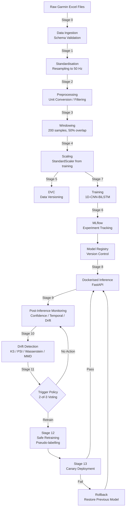
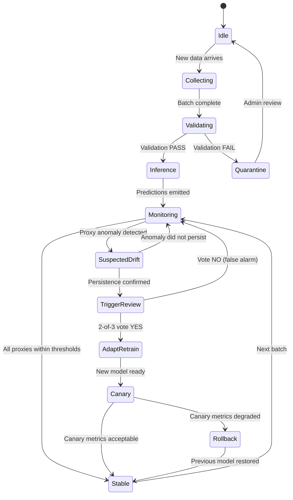

# Wearable HAR MLOps Pipeline -- Complete Why / What / How / When / Where Documentation

**Thesis Title:** Developing a MLOps Pipeline for Continuous Mental Health Monitoring Using Wearable Sensor Data  
**Author:** Shalin Vachheta  
**Date:** February 2026  
**Version:** 1.0

---

## Table of Contents

1. [Executive Overview](#1-executive-overview)
2. [Architecture Diagrams](#2-architecture-diagrams)
3. [Stage 0 -- Data Ingestion](#stage-0--data-ingestion)
4. [Stage 1 -- Standardisation and Resampling](#stage-1--standardisation-and-resampling)
5. [Stage 2 -- Preprocessing](#stage-2--preprocessing)
6. [Stage 3 -- Windowing](#stage-3--windowing)
7. [Stage 4 -- Scaling](#stage-4--scaling)
8. [Stage 5 -- Data Versioning (DVC)](#stage-5--data-versioning-dvc)
9. [Stage 6 -- Experiment Tracking and Model Registry (MLflow)](#stage-6--experiment-tracking-and-model-registry-mlflow)
10. [Stage 7 -- Training and Evaluation](#stage-7--training-and-evaluation)
11. [Stage 8 -- Deployment and Inference](#stage-8--deployment-and-inference)
12. [Stage 9 -- Monitoring Without Labels](#stage-9--monitoring-without-labels)
13. [Stage 10 -- Drift Detection](#stage-10--drift-detection)
14. [Stage 11 -- Trigger Policy](#stage-11--trigger-policy)
15. [Stage 12 -- Safe Retraining and Adaptation](#stage-12--safe-retraining-and-adaptation)
16. [Stage 13 -- Canary Deployment and Rollback](#stage-13--canary-deployment-and-rollback)
17. [Configuration Template](#configuration-template)
18. [Summary Table](#summary-table)
19. [Thesis-Friendly References](#thesis-friendly-references)

---

## 1. Executive Overview

### 1.1 Problem Definition

Human Activity Recognition (HAR) from wearable inertial sensors (tri-axial accelerometer and gyroscope) has demonstrated laboratory accuracies exceeding 90% on benchmark datasets. However, deploying these models to real-world, continuously operating wearable systems exposes fundamental problems that laboratory evaluation does not address:

- **Domain shift.** Sensor characteristics, device placement, and user behaviour differ between the training cohort and production users. A model trained on one demographic may silently degrade on another.
- **Absence of ground-truth labels.** In production, no human annotator accompanies the user. The system must detect degradation without access to true activity labels.
- **Data pipeline fragility.** Differences in sampling rate, unit conventions, or preprocessing order between training and production silently corrupt predictions.
- **Model staleness.** As user populations evolve, models trained on historical data become progressively less representative.

These challenges demand a production engineering discipline that academic prototyping alone cannot provide.

### 1.2 Why Production MLOps Is Required

Machine Learning Operations (MLOps) applies DevOps principles to the machine-learning lifecycle. For a wearable HAR system, MLOps provides:

| Capability | Risk if Absent |
|---|---|
| Versioned data pipelines | Irreproducible experiments; silent preprocessing mismatches |
| Automated testing and CI/CD | Broken models shipped to production undetected |
| Experiment tracking | Inability to explain which configuration produced which result |
| Containerised inference | Non-deterministic environments causing inconsistent predictions |
| Post-deployment monitoring | Degradation invisible until patient harm occurs |
| Automated drift detection | Manual inspection fails at scale |
| Safe retraining with rollback | Catastrophic forgetting or silent accuracy collapse |

The thesis therefore implements a complete MLOps pipeline rather than a one-off training script, treating the model as a continuously maintained software artefact.

### 1.3 Why Unlabelled Production Monitoring Matters

In classical supervised learning, model evaluation requires ground-truth labels. In a clinical wearable setting, labels are unavailable because:

1. Asking patients to annotate every activity defeats the purpose of passive monitoring.
2. Observer annotation is impractical outside controlled studies.
3. Video annotation at scale is cost-prohibitive and privacy-invasive.

The pipeline therefore relies on **proxy monitoring signals** -- prediction confidence, entropy, class-distribution stability, and input-feature drift -- to infer model health without labels. This is the realistic deployment scenario and a key contribution of this thesis.

### 1.4 High-Level Architecture

The pipeline comprises 14 stages organised into four phases:

| Phase | Stages | Purpose |
|---|---|---|
| Data Engineering | 0-4 | Ingest, validate, standardise, window, and scale sensor data |
| Model Lifecycle | 5-8 | Version data, track experiments, train, evaluate, and deploy |
| Operational Intelligence | 9-11 | Monitor predictions, detect drift, and decide when to act |
| Closed-Loop Adaptation | 12-13 | Retrain safely using pseudo-labels, then deploy via canary with rollback |

---

## 2. Architecture Diagrams

### 2.1 End-to-End Pipeline Flowchart



### 2.2 System State Machine



---

## Stage 0 -- Data Ingestion

### Why

Raw sensor data from Garmin smartwatches arrives in Excel format with vendor-specific column names, inconsistent timestamps, and mixed data types. Feeding such data directly into preprocessing would produce silent errors -- for example, a missing gyroscope column would halve the input dimensionality without raising an exception in downstream NumPy operations.

**Risks if omitted:** Corrupt data propagates through the entire pipeline. Debugging a bad prediction days later to an ingestion error is extremely costly.

### What

| Item | Description |
|---|---|
| **Input** | Raw Excel files from Garmin Connect export (accelerometer + gyroscope sheets) |
| **Output** | Validated, column-normalised CSV: `sensor_fused_50Hz.csv` |
| **Artifacts** | Ingestion metadata JSON (row counts, original sampling rates, column mapping) |

### How

1. **Schema validation.** Verify that required columns (`x`, `y`, `z`, `timestamp`) exist in both accelerometer and gyroscope sheets. Reject the file if mandatory columns are absent.
2. **Column normalisation.** Map vendor-specific names to canonical names: `Ax, Ay, Az, Gx, Gy, Gz`.
3. **Timestamp monotonicity check.** Assert that timestamps are strictly non-decreasing. Non-monotonic timestamps indicate a corrupt export.
4. **Missing-value threshold.** Compute the ratio of NaN cells. If the ratio exceeds 5%, quarantine the file and alert.
5. **Data-type enforcement.** Cast sensor values to `float64` and timestamps to `int64`.
6. **Immutable raw storage.** Copy the original file to `data/raw/` before any transformation. This guarantees that the raw record is always recoverable.
7. **Metadata logging.** Record: original filename, row count per sheet, detected sampling rate, column mapping, timestamp range, file hash (SHA-256).

### When

- On every new data upload (event-driven).
- On scheduled batch collection windows (e.g., nightly sync from device).

### Where

| Module | Path |
|---|---|
| Ingestion pipeline | `src/sensor_data_pipeline.py` |
| Data validator | `src/data_validator.py` |
| Component wrapper | `src/components/data_ingestion.py` |
| Raw storage | `data/raw/` |
| Output | `data/processed/sensor_fused_50Hz.csv` |

---

## Stage 1 -- Standardisation and Resampling

### Why

Consumer wearable devices do not guarantee a fixed sampling rate. Garmin accelerometers may report at 25 Hz, 50 Hz, or 100 Hz depending on the device model and firmware. Gyroscope and accelerometer may even sample at different native rates. The downstream model expects a fixed input shape (200 samples at 50 Hz = 4.0 seconds), so all data must be resampled to a common frequency before windowing.

**Why 50 Hz and not 100 Hz.** The HAR literature consistently reports that 20--50 Hz captures the full information content of human limb movement, which rarely exceeds 20 Hz in spectral content (Bao and Intille, 2004; Bulling et al., 2014). Doubling to 100 Hz doubles computational cost and storage with negligible accuracy gain. The training dataset was collected at 50 Hz; matching this frequency in production avoids introducing an interpolation-induced domain shift.

**Risks if omitted:** A model trained on 50 Hz data receiving 25 Hz data will interpret movements as occurring at half speed. Activity boundaries will misalign with window boundaries, causing systematic misclassification.

### What

| Item | Description |
|---|---|
| **Input** | Raw time-series at native sampling rate(s) |
| **Output** | Uniformly sampled time-series at exactly 50 Hz |
| **Artifacts** | Log entry recording original Fs per channel and resampling ratio |

### How

1. **Detect native sampling rate.** Compute `Fs_native = 1 / median(diff(timestamps))`. Log the result.
2. **Anti-aliasing filter.** If `Fs_native > Fs_target`, apply a low-pass Butterworth filter with cutoff at `Fs_target / 2` before downsampling. This prevents aliasing artefacts.
3. **Resampling.** Use linear interpolation to resample to exactly 50 Hz. Cubic interpolation is avoided because it can introduce oscillations near sharp signal transitions (e.g., a sudden hand tap).
4. **Sensor fusion.** Align accelerometer and gyroscope timestamps using nearest-neighbour merge with a 1 ms tolerance. Rows that cannot be paired are dropped and logged.
5. **Log original Fs.** Store the detected native rate alongside the file metadata for traceability.
6. **Validate post-resampling.** Assert that the output row count matches `duration_seconds * 50` within a 1% tolerance.

### When

- Immediately after ingestion (Stage 0), as the first transformation.

### Where

| Module | Path |
|---|---|
| Sensor fusion and resampling | `src/sensor_data_pipeline.py :: SensorFusion` |
| Pipeline config | `config/pipeline_config.yaml :: preprocessing.resampling` |
| Target frequency constant | `src/config.py :: WINDOW_SIZE, OVERLAP` |

---

## Stage 2 -- Preprocessing

### Why

Raw sensor values cannot be fed directly into the model. The training pipeline applied specific transformations (unit conversion, no gravity removal, no band-pass filtering), and the production pipeline must replicate these transformations exactly. Any mismatch constitutes an artificial domain shift that degrades accuracy.

**Risks if omitted:** The most common and most insidious failure mode in deployed ML systems. A model trained on m/s^2 receiving milliG data will see accelerations 100x smaller than expected. The StandardScaler will then amplify noise, and the model will predict near-random classes while still reporting high softmax confidence.

### What

| Item | Description |
|---|---|
| **Input** | Resampled 50 Hz time-series with columns `Ax, Ay, Az, Gx, Gy, Gz` |
| **Output** | Preprocessed time-series in m/s^2 (accelerometer) and deg/s (gyroscope) |
| **Artifacts** | Preprocessing log: detected unit, conversion applied, outlier count, saturation events |

### How

1. **Channel order enforcement.** Assert column order is `[Ax, Ay, Az, Gx, Gy, Gz]`. This matches the training data channel order exactly.
2. **Automatic unit detection.** Compute the median magnitude of the accelerometer vector: $\bar{m} = \text{median}\left(\sqrt{Ax^2 + Ay^2 + Az^2}\right)$. If $\bar{m} > 100$, the data is in milliG; multiply by $9.80665 / 1000$ to convert to m/s^2. Log the detection and conversion.
3. **Gravity removal toggle.** Controlled by `config/pipeline_config.yaml :: enable_gravity_removal`. Set to `false` because the training data included gravitational acceleration. Applying a high-pass Butterworth filter here would remove the DC component that the model has learned to expect.
4. **Sensor saturation detection.** Flag samples where any channel equals the device-specific saturation value (typically +/-16g for accelerometer, +/-2000 deg/s for gyroscope). Saturated samples indicate device limitations and should be logged.
5. **Outlier detection.** Identify samples beyond 6 standard deviations from the channel mean. These are logged but not removed, because aggressive outlier removal can truncate legitimate high-energy activities (e.g., knuckle cracking).
6. **Quality summary.** Emit a per-file quality report: percentage of missing values, saturation events, detected outliers, and unit conversion applied.

### When

- Immediately after resampling (Stage 1).
- Rerun if the pipeline configuration toggles change.

### Where

| Module | Path |
|---|---|
| Preprocessing pipeline | `src/preprocess_data.py` |
| Domain calibration (optional) | `src/calibration.py` |
| AdaBN adaptation (optional) | `src/domain_adaptation/adabn.py` |
| Pipeline config | `config/pipeline_config.yaml :: preprocessing` |

---

## Stage 3 -- Windowing

### Why

Time-series sensor data is continuous, but classification models require fixed-size input tensors. Windowing segments the stream into overlapping fixed-length windows, each representing a short activity episode. The window size must be long enough to capture one complete activity cycle but short enough to avoid mixing multiple activities.

**Risks if omitted:** Without windowing, the model receives arbitrarily shaped input. Without overlap, temporal transitions between activities are poorly represented, reducing the model's ability to detect short-duration behaviours.

### What

| Item | Description |
|---|---|
| **Input** | Preprocessed time-series, shape `(N, 6)` |
| **Output** | Windowed array, shape `(W, 200, 6)` where `W` is the number of windows |
| **Artifacts** | Window metadata: total windows created, effective duration covered |

### How

1. **Window size calculation.**

$$
\text{window\_samples} = F_s \times T_w = 50 \times 4.0 = 200 \text{ samples}
$$

where $F_s = 50$ Hz is the sampling frequency and $T_w = 4.0$ seconds is the window duration. The 4-second window was selected during training based on the literature recommendation for anxiety-related behaviours (Oleh and Obermaisser, 2025).

2. **Overlap ratio.** A 50% overlap ($O = 0.5$) is applied. The stride is:

$$
\text{stride} = \text{window\_samples} \times (1 - O) = 200 \times 0.5 = 100 \text{ samples}
$$

3. **Why overlap improves temporal stability.** With 50% overlap, each timestep appears in two consecutive windows. This provides:
   - Smoother prediction transitions at activity boundaries.
   - Redundancy that absorbs edge effects (the first and last few samples of a window are influenced by the previous/next activity).
   - Doubled training examples without additional data collection.

4. **Implementation.** Vectorised windowing using `numpy.stride_tricks.as_strided` for O(1) memory overhead (no data copying). This is 10--50x faster than a Python-loop implementation.

5. **Metadata retention.** Each window is associated with its start timestamp and source file, enabling traceability from prediction back to raw data.

6. **Edge handling.** The final partial window (fewer than 200 samples) is discarded. The number of discarded samples is logged.

### When

- After preprocessing completes (Stage 2).
- Window parameters are fixed at deployment time and must not change without retraining.

### Where

| Module | Path |
|---|---|
| Windowing logic | `src/preprocess_data.py :: create_windows()` |
| Vectorised implementation | `src/utils/production_optimizations.py` |
| Constants | `src/config.py :: WINDOW_SIZE=200, OVERLAP=0.5` |

---

## Stage 4 -- Scaling

### Why

Neural networks converge faster and more reliably when input features have zero mean and unit variance. The accelerometer channels (range: approximately +/-20 m/s^2) and gyroscope channels (range: approximately +/-500 deg/s) differ by an order of magnitude. Without scaling, the gyroscope channels would dominate the loss gradient, and the model would underweight accelerometer signals.

**Critical invariant:** The scaler must be fitted on training data only. Fitting on production data leaks future information and makes the scaling non-stationary, violating the i.i.d. assumption.

**Risks if omitted:** Convergence failure during training. In production, applying a scaler fitted on production data instead of training data introduces a distribution shift proportional to the difference between the two datasets.

### What

| Item | Description |
|---|---|
| **Input** | Windowed array, shape `(W, 200, 6)` |
| **Output** | Scaled array, same shape, zero mean and unit variance per channel |
| **Artifacts** | `config.json` containing per-channel mean and standard deviation (6 values each) |

### How

1. **Fit phase (training only).** Compute per-channel statistics:

$$
\mu_c = \frac{1}{N} \sum_{i=1}^{N} x_{i,c} \qquad \sigma_c = \sqrt{\frac{1}{N} \sum_{i=1}^{N} (x_{i,c} - \mu_c)^2}
$$

where $c \in \{Ax, Ay, Az, Gx, Gy, Gz\}$ and $N$ is the total number of samples across all training windows.

2. **Transform phase (training and production).** Apply:

$$
\hat{x}_{i,c} = \frac{x_{i,c} - \mu_c}{\sigma_c}
$$

3. **Artifact storage.** Serialise $\mu$ and $\sigma$ vectors to `data/prepared/config.json`. This file is version-controlled alongside the model.
4. **Reproducibility safeguard.** At inference time, load the scaler artifact and verify its hash matches the hash recorded in the model's MLflow metadata. A mismatch halts inference with an explicit error.

### When

- Fit: once during training (or retraining).
- Transform: every time data enters the model (training, validation, production inference).

### Where

| Module | Path |
|---|---|
| Scaler application | `src/preprocess_data.py :: apply_scaling()` |
| Scaler artifact | `data/prepared/config.json` |
| DVC tracking | `data/prepared.dvc` |

---

## Stage 5 -- Data Versioning (DVC)

### Why

Git is designed for source code (small text files), not for datasets (potentially gigabytes of binary data). Storing large CSV or NumPy files in Git bloats the repository, makes cloning impractical, and provides no mechanism for reproducing a specific data state alongside a specific model version.

DVC (Data Version Control) solves this by storing lightweight pointer files (`.dvc`) in Git while the actual data resides in a separate storage backend. This enables:

- **Exact reproducibility.** Given a Git commit, `dvc checkout` restores the exact dataset used at that commit.
- **Pipeline definition.** `dvc.yaml` defines the directed acyclic graph (DAG) of data transformations, enabling `dvc repro` to rerun only the stages whose inputs have changed.
- **Data-model linkage.** The Git commit hash simultaneously identifies the code version, the DVC pointer (data version), and the MLflow run (model version).

**Risks if omitted:** Inability to reproduce past experiments. "It worked last week" becomes unresolvable. Thesis reviewers cannot verify results.

### What

| Item | Description |
|---|---|
| **Input** | Data directories: `data/raw/`, `data/processed/`, `data/prepared/` |
| **Output** | `.dvc` pointer files tracked in Git |
| **Artifacts** | DVC cache in `.dvc_storage/`; remote storage (configurable) |

### How

1. **Initialisation.** `dvc init` creates the `.dvc/` configuration directory.
2. **Tracking.** `dvc add data/raw` generates `data/raw.dvc`, a YAML file containing the MD5 hash of the directory contents.
3. **Pipeline DAG.** `dvc.yaml` declares stages:
   ```yaml
   stages:
     preprocess:
       cmd: python src/preprocess_data.py
       deps:
         - data/raw/
         - src/preprocess_data.py
       outs:
         - data/processed/
     prepare:
       cmd: python src/prepare_training_data.py
       deps:
         - data/processed/
       outs:
         - data/prepared/
   ```
4. **Reproduction.** `dvc repro` checks file hashes and reruns only invalidated stages.
5. **Remote storage.** Configured via `dvc remote add` to push data to cloud or network storage, decoupling data from the local machine.

### When

- After every data transformation that produces a new dataset version.
- Before every training run, to snapshot the exact data state.

### Where

| Module | Path |
|---|---|
| DVC configuration | `.dvc/config` |
| Pointer files | `data/raw.dvc`, `data/processed.dvc`, `data/prepared.dvc` |
| Local cache | `.dvc_storage/` |
| Pipeline DAG | `dvc.yaml` (if defined) |

---

## Stage 6 -- Experiment Tracking and Model Registry (MLflow)

### Why

A thesis project easily accumulates dozens of training runs with different hyperparameters, data subsets, and preprocessing configurations. Without systematic tracking, it becomes impossible to answer: "Which configuration produced the best macro-F1?" or "What learning rate was used for the model currently deployed?"

MLflow provides:

- **Parameter logging.** Every hyperparameter is recorded.
- **Metric logging.** Training loss, validation accuracy, per-class F1 -- all versioned.
- **Artifact tracking.** Model weights, confusion matrices, and plots are stored alongside the run.
- **Model registry.** Named model versions with stage transitions (Staging, Production, Archived).
- **Traceability for thesis defence.** Every claim in the results chapter can be traced to a specific MLflow run ID.

**Risks if omitted:** Irreproducible results. During thesis defence, a question such as "Can you show me the exact parameters for this result?" becomes unanswerable.

### What

| Item | Description |
|---|---|
| **Input** | Training parameters, metrics, model artefacts |
| **Output** | MLflow experiment runs; registered model versions |
| **Artifacts** | Stored in `mlruns/` (local) or configured tracking server |

### How

1. **Experiment setup.** Create a named experiment (`har-mlops`) via the `MLflowTracker` class.
2. **Run lifecycle.** Each training invocation starts a run, logs parameters and metrics, and ends the run with a status (FINISHED, FAILED).
3. **Parameter logging.** All hyperparameters are logged: `learning_rate`, `epochs`, `batch_size`, `window_size`, `overlap`, `optimizer`, `dropout_rate`.
4. **Metric logging.** Logged at each epoch: `train_loss`, `val_loss`, `val_accuracy`, `val_macro_f1`. Logged at run end: per-class precision, recall, F1.
5. **Artifact logging.** Confusion matrix plot, classification report text, training history CSV, model weights (`.keras` file).
6. **Model registration.** After evaluation, the best model is registered under a canonical name (e.g., `har-1dcnn-bilstm`) with a version number. Stage transitions (`None` to `Staging` to `Production`) are managed through the API or UI.

### When

- Automatically during every training and evaluation run.
- Model registration occurs only when the new model meets promotion criteria.

### Where

| Module | Path |
|---|---|
| MLflow tracker | `src/mlflow_tracking.py :: MLflowTracker` |
| Configuration | `config/mlflow_config.yaml` |
| Local storage | `mlruns/` |
| Component wrapper | `src/components/model_registration.py` |

---

## Stage 7 -- Training and Evaluation

### Why

The 1D-CNN-BiLSTM model is the core predictive component. Training must be conducted with methodological rigour to produce a model that generalises beyond the training cohort. Evaluation must use metrics appropriate for imbalanced multi-class problems and must avoid data leakage.

**Risks if omitted (or done carelessly):** Overfitting to training subjects. Inflated accuracy from random splits that leak same-subject data across train/test. Misleading metrics from micro-averaging on imbalanced classes.

### What

| Item | Description |
|---|---|
| **Input** | Scaled windows, shape `(W, 200, 6)`, with labels `(W,)` |
| **Output** | Trained model weights: `fine_tuned_model_1dcnnbilstm.keras` |
| **Artifacts** | MLflow run with all parameters, metrics, and artefacts |

### How

1. **Data split strategy: cross-subject (leave-one-subject-out or grouped k-fold).**
   In HAR, random train/test splits leak intra-subject patterns across the boundary. A model may learn to recognise a specific user's gait rather than the activity itself. Cross-subject splitting ensures that no subject appears in both training and test sets.

2. **Primary metric: macro-F1.**
   The dataset exhibits class imbalance (e.g., `sitting` and `standing` are overrepresented relative to `knuckle_cracking`). Accuracy is misleading because a model that always predicts the majority class achieves high accuracy. Macro-F1 averages per-class F1 scores equally, penalising poor performance on minority classes:

$$
\text{Macro-F1} = \frac{1}{C} \sum_{c=1}^{C} \frac{2 \cdot P_c \cdot R_c}{P_c + R_c}
$$

where $C = 11$ is the number of classes, and $P_c$, $R_c$ are precision and recall for class $c$.

3. **Confusion matrix.** Generated and logged to MLflow. Enables identification of systematic misclassifications (e.g., `nape_rubbing` confused with `hair_pulling`).

4. **Avoiding data leakage checklist:**
   - Scaler fitted on training split only.
   - No future data in validation set (temporal splits where applicable).
   - Window overlap does not cross subject boundaries.
   - Augmentation applied after splitting.

5. **Golden test set.** A held-out test set that is never used during hyperparameter tuning. Final reported metrics come exclusively from this set.

### When

- Initial training during development.
- Retraining triggered by the trigger policy (Stage 11).

### Where

| Module | Path |
|---|---|
| Training script | `src/train.py` |
| Model evaluation | `src/components/model_evaluation.py` |
| Prediction evaluation | `src/evaluate_predictions.py` |
| Model directory | `models/pretrained/` |

---

## Stage 8 -- Deployment and Inference

### Why

A trained model sitting on a researcher's laptop provides no value. Deployment wraps the model in a reproducible, versioned, network-accessible service that can process incoming sensor data and return predictions. Containerisation (Docker) guarantees that the inference environment is identical to the training environment, eliminating "works on my machine" failures.

**Risks if omitted:** Environment discrepancies cause silent numerical differences. TensorFlow version mismatches can change floating-point behaviour enough to alter predictions.

### What

| Item | Description |
|---|---|
| **Input** | HTTP POST request containing a CSV or JSON payload of sensor data |
| **Output** | JSON response: predicted activity, confidence score, model version |
| **Artifacts** | Docker image: `har-inference:latest`, pushed to GitHub Container Registry |

### How

1. **Dockerisation.** The `Dockerfile.inference` builds a slim Python 3.11 image containing TensorFlow, FastAPI, and the model weights. The image is self-contained and reproducible.
2. **Deterministic preprocessing.** The inference container loads the exact same scaler artifact (`config.json`) and applies the identical preprocessing pipeline used during training. The pipeline configuration is baked into the image.
3. **FastAPI endpoints:**
   - `GET /health` -- Returns 200 if the model is loaded and the service is ready.
   - `POST /predict` -- Accepts a sensor data payload, runs the full pipeline (preprocessing, windowing, scaling, inference, monitoring), and returns predictions.
   - `GET /metrics` -- Exposes Prometheus-compatible metrics.
4. **Versioned responses.** Every prediction response includes: model version, pipeline version, confidence score, and a unique request ID for audit trailing.
5. **Model caching.** The model is loaded once at startup and cached in memory. Subsequent requests use the cached model, reducing inference latency from approximately 350 ms (cold load) to 0.36 ms (cached).

### When

- Deployed continuously as a long-running service.
- Rebuilt and redeployed on every push to `main` via GitHub Actions CI/CD.

### Where

| Module | Path |
|---|---|
| FastAPI application | `src/api/app.py` |
| Inference logic | `src/run_inference.py` |
| Inference pipeline | `src/pipeline/inference_pipeline.py` |
| Dockerfile | `docker/Dockerfile.inference` |
| Docker Compose | `docker-compose.yml` |
| CI/CD | `.github/workflows/ci-cd.yml` |
| Deployment manager | `src/deployment_manager.py` |

---

## Stage 9 -- Monitoring Without Labels

### Why

Once deployed, the model produces predictions -- but nobody tells the model whether those predictions are correct. Traditional accuracy monitoring is impossible without ground-truth labels. The system must therefore use **proxy signals** that correlate with model health.

This is the fundamental operational challenge for any deployed ML system, and it is especially acute in healthcare wearables where incorrect predictions may influence clinical decisions.

**Risks if omitted:** The model silently degrades. Users receive increasingly wrong activity classifications. By the time someone notices, months of clinical data may be compromised.

### What

| Item | Description |
|---|---|
| **Input** | Prediction probabilities `(W, 11)`, predicted labels `(W,)`, input features `(W, 200, 6)` |
| **Output** | Monitoring report with per-metric status (PASS / WARNING / CRITICAL) |
| **Artifacts** | JSON monitoring report saved to `artifacts/{timestamp}/` |

### How

The monitoring system implements three layers:

**Layer 1 -- Confidence Analysis.**
- Compute mean prediction confidence: $\bar{c} = \frac{1}{W} \sum_{w=1}^{W} \max_k p_{w,k}$.
- Compute fraction of uncertain predictions: $\text{uncertain\%} = \frac{|\{w : \max_k p_{w,k} < \tau_c\}|}{W}$ where $\tau_c = 0.7$.
- **Rationale:** A well-calibrated model on in-distribution data should produce high-confidence predictions. A systematic drop in mean confidence suggests the input distribution has shifted.

**Layer 2 -- Temporal Pattern Analysis.**
- Compute prediction flip rate: $\text{flip\_rate} = \frac{|\{w : \hat{y}_w \neq \hat{y}_{w-1}\}|}{W - 1}$.
- Detect rapid oscillations (flips): three or more consecutive changes indicate the model is "confused."
- Compute activity dwell times: the distribution of consecutive windows with the same prediction. Abnormally short or long dwell times suggest temporal instability.
- **Rationale:** Human activities have natural temporal persistence. Sitting lasts minutes, not milliseconds. Rapid prediction changes are a proxy for model uncertainty.

**Layer 3 -- Input Feature Drift.**
- Compute per-channel statistics (mean, variance) of the current production batch.
- Compare against the normalised baseline (computed from training or reference production data).
- Drift score per channel: normalised mean difference.
- **Rationale:** If the input distribution shifts (e.g., new sensor model, different wearing position), the model receives data it was not trained on.

### When

- After every inference batch.
- Results are aggregated and reported to the trigger policy.

### Where

| Module | Path |
|---|---|
| Post-inference monitoring | `src/components/post_inference_monitoring.py` |
| Monitoring script | `scripts/post_inference_monitoring.py` |
| Trigger evaluation | `src/components/trigger_evaluation.py` |
| Baseline statistics | `models/normalized_baseline.json` |
| Baseline builder | `scripts/build_normalized_baseline.py` |

---

## Stage 10 -- Drift Detection

### Why

Monitoring (Stage 9) computes proxy metrics. Drift detection determines whether those metrics indicate a statistically significant change from the reference distribution. This distinction matters: a single batch with low confidence is noise; a persistent shift across multiple batches is drift.

Multiple statistical tests are used because no single test is universally optimal. The Kolmogorov-Smirnov (KS) test is sensitive to distribution shape but ignores magnitude. Population Stability Index (PSI) captures magnitude but requires binning. Wasserstein distance captures the geometric cost of transforming one distribution into another.

**Risks if omitted:** Without formal statistical testing, drift thresholds are arbitrary. The system either triggers too many false alarms (alert fatigue) or misses genuine drift.

### What

| Item | Description |
|---|---|
| **Input** | Reference distribution (from training data) and production distribution (from current batch) |
| **Output** | Per-channel drift report: test statistic, p-value/score, drift verdict |
| **Artifacts** | Drift detection JSON report |

### How

**Kolmogorov-Smirnov (KS) Test.**
The KS statistic measures the maximum absolute difference between two empirical cumulative distribution functions:

$$
D_{KS} = \sup_x |F_{\text{ref}}(x) - F_{\text{prod}}(x)|
$$

A p-value below 0.05 indicates statistically significant drift at the 95% confidence level. Applied per sensor channel.

**Population Stability Index (PSI).**
PSI quantifies how much the production distribution has shifted from the reference:

$$
\text{PSI} = \sum_{i=1}^{B} (p_i - q_i) \ln\left(\frac{p_i}{q_i}\right)
$$

where $p_i$ and $q_i$ are the proportions in bin $i$ for the production and reference distributions respectively. Interpretation: PSI < 0.1 (no drift), 0.1--0.2 (moderate), > 0.2 (significant).

**Domain Classifier AUC.**
Train a lightweight binary classifier to distinguish reference from production samples. If the classifier achieves AUC > 0.7, the distributions are separable, indicating drift. This method detects multivariate interactions that univariate tests miss.

**Maximum Mean Discrepancy (MMD).**
A kernel-based distance between distributions:

$$
\text{MMD}^2 = \mathbb{E}[k(x, x')] - 2\mathbb{E}[k(x, y)] + \mathbb{E}[k(y, y')]
$$

where $k$ is a Gaussian kernel. MMD operates on the joint feature space and detects shifts that manifest only in feature correlations.

**Wasserstein Distance.**
Earth Mover's Distance: the minimum "work" to transform one distribution into another. More sensitive to distribution shape changes than KS test:

$$
W_1(P, Q) = \inf_{\gamma \in \Gamma(P,Q)} \mathbb{E}_{(x,y) \sim \gamma}[\|x - y\|]
$$

**Multi-signal detection logic.**
No single test decides. The system applies all available tests and reports per-channel results. The trigger policy (Stage 11) aggregates these signals.

**Threshold design philosophy.**
Thresholds are calibrated on historical data using the following approach:
1. Run drift tests on known-stable production data to establish the noise floor.
2. Set WARNING threshold at the 95th percentile of the noise floor.
3. Set CRITICAL threshold at the 99th percentile.
4. Review and adjust after initial deployment based on observed false-positive rates.

### When

- After every monitoring cycle (Stage 9).
- Can also be triggered on demand for diagnostic purposes.

### Where

| Module | Path |
|---|---|
| Wasserstein drift detector | `src/wasserstein_drift.py` |
| Drift component | `src/components/wasserstein_drift.py` |
| OOD detection | `src/ood_detection.py` |
| Robustness evaluation | `src/robustness.py` |

---

## Stage 11 -- Trigger Policy

### Why

Drift detection (Stage 10) produces multiple signals per batch. The trigger policy aggregates these signals into a single actionable decision: retrain, monitor, or ignore. A naive approach -- trigger retraining whenever any single metric crosses a threshold -- would produce excessive false positives and unnecessary retraining cycles, each of which costs GPU time and risks introducing regression.

**Risks if omitted:** Either the system never retrains (model staleness) or retrains too aggressively (instability, wasted resources, potential catastrophic forgetting).

### What

| Item | Description |
|---|---|
| **Input** | Monitoring report from Stage 9, drift report from Stage 10 |
| **Output** | `TriggerDecision` object: action (NONE / MONITOR / QUEUE_RETRAIN / TRIGGER / ROLLBACK), reason, severity |
| **Artifacts** | Decision log in JSON format, MLflow audit entry |

### How

1. **2-of-3 voting logic.** The system evaluates three independent signal categories:

   - **Confidence signal:** Mean confidence below threshold OR uncertain percentage above threshold.
   - **Drift signal:** More than `min_drifted_channels` channels flagged by KS, PSI, or Wasserstein test.
   - **Temporal signal:** Flip rate above threshold OR abnormal dwell-time distribution.

   A retraining trigger requires at least 2 of 3 categories to report WARNING or higher. This reduces false positives caused by noise in any single signal.

2. **Persistence window.** A single anomalous batch is not sufficient. The anomaly must persist for `persistence_batches` consecutive evaluation cycles (default: 5). This filters out transient disturbances (e.g., user places device on a vibrating surface).

3. **Tiered alerting.** Alerts are classified as INFO, WARNING, or CRITICAL. Only CRITICAL triggers immediate retraining. WARNING triggers increased monitoring frequency. INFO is logged but does not change system behaviour.

4. **Cooldown period.** After a retraining is triggered, a cooldown period (default: 24 hours) prevents cascading retraining cycles. During cooldown, alerts are logged but suppressed from triggering.

5. **Safeguards against catastrophic retraining:**
   - Maximum retraining frequency: at most once per cooldown period.
   - Retraining on pseudo-labels requires minimum confidence gate (Stage 12).
   - Post-retraining canary deployment (Stage 13) validates the new model before full promotion.
   - Automatic rollback if the canary model performs worse than the incumbent.

### When

- Evaluated after every monitoring cycle.
- The decision is logged regardless of outcome (for audit).

### Where

| Module | Path |
|---|---|
| Trigger policy engine | `src/trigger_policy.py :: TriggerPolicyEngine` |
| Component wrapper | `src/components/trigger_evaluation.py` |
| Alert levels | `src/trigger_policy.py :: AlertLevel` |
| Decision actions | `src/trigger_policy.py :: TriggerAction` |

---

## Stage 12 -- Safe Retraining and Adaptation

### Why

When the trigger policy decides to retrain, the system faces a fundamental problem: production data is unlabelled. Standard supervised retraining is impossible. The system must therefore use techniques that extract useful signal from unlabelled data while guarding against error amplification.

**Risks if omitted:** The model cannot adapt to changing user populations. Alternatively, naive pseudo-labelling on low-confidence predictions amplifies errors, causing catastrophic forgetting.

### What

| Item | Description |
|---|---|
| **Input** | Current model, labelled source data, unlabelled production data |
| **Output** | Retrained model weights registered in MLflow |
| **Artifacts** | Pseudo-label quality report, retraining metrics, comparison against baseline |

### How

1. **Pseudo-labelling with curriculum learning.** The current model generates pseudo-labels for production data. Labels are accepted only if the model's confidence exceeds a threshold, starting high ($\tau = 0.95$) and progressively lowering ($\tau \to 0.80$) over retraining iterations. This "curriculum" ensures that the model first learns from the easiest (most confident) samples before incorporating harder ones.

2. **Confidence gating.** For each production sample:
   
$$
\text{accept}(x) = \begin{cases} 1 & \text{if } \max_k p(k | x) \geq \tau \\ 0 & \text{otherwise} \end{cases}
$$

   Rejected samples are not used for retraining but are logged for active learning.

3. **Entropy thresholding.** As a secondary filter, compute the prediction entropy:

$$
H(x) = -\sum_{k=1}^{C} p(k|x) \log p(k|x)
$$

   Samples with entropy above a threshold are excluded, as high entropy indicates the model is uncertain about the class distribution.

4. **Test-time adaptation (AdaBN).** As a lightweight alternative to full retraining, Adaptive Batch Normalisation replaces the batch normalisation running statistics (mean and variance) with statistics computed from unlabelled production data. This adapts the model's internal representations to the target domain without modifying learned weights.

5. **Elastic Weight Consolidation (EWC).** When performing full retraining, EWC adds a regularisation term that penalises changes to weights that were important for the original task. This mitigates catastrophic forgetting:

$$
\mathcal{L}_{\text{EWC}} = \mathcal{L}_{\text{task}} + \frac{\lambda}{2} \sum_i F_i (\theta_i - \theta_i^*)^2
$$

where $F_i$ is the Fisher information for parameter $i$ and $\theta_i^*$ are the original weights.

6. **Active learning export.** Samples with low confidence and high entropy are exported to `data/active_learning/` for human review. A domain expert can label a small number of informative samples, which are then added to the training set. This closes the human-in-the-loop feedback cycle.

7. **Class-balanced sampling.** To prevent the pseudo-labelled dataset from becoming dominated by majority classes, a maximum of $K$ samples per class per iteration is enforced.

### When

- Triggered by the trigger policy (Stage 11).
- Active learning export can also run on demand.

### Where

| Module | Path |
|---|---|
| Curriculum pseudo-labelling | `src/curriculum_pseudo_labeling.py :: CurriculumTrainer` |
| Active learning export | `src/active_learning_export.py` |
| AdaBN adaptation | `src/domain_adaptation/adabn.py :: adapt_bn_statistics()` |
| Retraining component | `src/components/model_retraining.py` |
| Active learning data | `data/active_learning/` |

---

## Stage 13 -- Canary Deployment and Rollback

### Why

Even with pseudo-label quality gates and EWC regularisation, a retrained model may perform worse than the incumbent in production. Deploying it to all users simultaneously risks widespread degradation. Canary deployment mitigates this risk by routing a small fraction of traffic to the new model and comparing its proxy metrics against the incumbent.

Rollback is the ultimate safety net. If the canary model underperforms, the system instantly reverts to the previous known-good model with no manual intervention required.

**Risks if omitted:** A bad model update silently degrades the entire system. Without rollback, recovery requires manual intervention, which may take hours or days.

### What

| Item | Description |
|---|---|
| **Input** | Newly retrained model and the currently deployed (incumbent) model |
| **Output** | Deployment decision: promote new model or rollback |
| **Artifacts** | Canary comparison report, rollback audit log |

### How

1. **Canary traffic split.** Route a configurable percentage (default: 10%) of inference requests to the new model. The remaining 90% continue to use the incumbent model.

2. **Proxy comparison.** During the canary window (default: 30 minutes), compare proxy metrics between the canary and incumbent:
   - Mean confidence.
   - Uncertain prediction percentage.
   - Prediction flip rate.
   - Class distribution divergence (KL divergence).

3. **Promotion criteria.** The canary model is promoted to production if:
   - Mean confidence is not significantly lower than the incumbent (within 5%).
   - Uncertain percentage does not increase by more than 10%.
   - No new drift signals emerge.
   - The canary period completes without errors.

4. **Revert mechanism.** If any promotion criterion fails:
   - All traffic is immediately routed back to the incumbent model.
   - The canary model is archived (not deleted) in MLflow with stage set to `Archived`.
   - An alert is emitted with the comparison report.

5. **Registry version management.** The model registry maintains a history of all model versions. Rollback restores the `Production` stage label to the previous version. The failed model retains its metadata for post-mortem analysis.

6. **Integrity verification.** After rollback, the system verifies that the restored model's SHA-256 hash matches the expected hash from the registry. This guards against file corruption.

### When

- After every successful retraining (Stage 12).
- Rollback can also be triggered manually by an operator.

### Where

| Module | Path |
|---|---|
| Deployment manager | `src/deployment_manager.py :: DeploymentManager` |
| Rollback manager | `src/model_rollback.py :: ModelRollbackManager` |
| Component wrapper | `src/components/model_registration.py` |
| Model registry | MLflow Model Registry |
| Docker registry | `ghcr.io/shalinvachheta017/masterarbeit_mlops/har-inference` |

---

## Configuration Template

The following YAML template defines all tuneable parameters for the pipeline. Each parameter is explained inline.

```yaml
# ===========================================================================
# Pipeline Configuration Template
# ===========================================================================

# --- Sampling and Windowing ---
sampling:
  fs_target: 50                  # Target sampling frequency in Hz.
                                 # Matches training data. Literature supports
                                 # 20-50 Hz for HAR (Bulling et al., 2014).

windowing:
  window_seconds: 4.0            # Window duration in seconds.
  window_samples: 200            # = fs_target * window_seconds = 50 * 4.0
  overlap: 0.5                   # 50% overlap. Each timestep appears in 2 windows.
                                 # Stride = window_samples * (1 - overlap) = 100.

# --- Preprocessing ---
preprocessing:
  enable_unit_conversion: true   # Convert milliG to m/s2 if detected.
  enable_gravity_removal: false  # Must match training pipeline (gravity NOT removed).
  enable_calibration: false      # Domain calibration (experimental).
  gravity_filter:
    cutoff_hz: 0.3               # High-pass cutoff for gravity removal (if enabled).
    order: 3                     # Butterworth filter order.

# --- Scaling ---
scaling:
  method: standard               # StandardScaler (zero mean, unit variance).
  fit_on: training_only          # NEVER fit on production data.
  artifact: data/prepared/config.json

# --- Drift Detection ---
drift:
  ks_pvalue: 0.05               # KS test significance level.
                                 # p < 0.05 => reject null hypothesis that
                                 # distributions are identical.

  psi_warn: 0.1                 # PSI warning threshold.
                                 # 0.1-0.2 = moderate shift.
  psi_alert: 0.2                # PSI critical threshold.
                                 # > 0.2 = significant shift.

  wasserstein_warn: 0.3         # Wasserstein distance warning threshold.
  wasserstein_critical: 0.5     # Wasserstein distance critical threshold.

  domain_clf_auc_alert: 0.7     # Domain classifier AUC above this = drift.
                                 # AUC = 0.5 means distributions are identical.
                                 # AUC = 1.0 means perfectly separable.

  mmd_threshold: 0.05           # MMD squared distance threshold.

  min_drifted_channels_warn: 2  # Minimum channels drifted for WARNING.
  min_drifted_channels_crit: 4  # Minimum channels drifted for CRITICAL.

# --- Trigger Policy ---
trigger:
  voting_scheme: "2-of-3"       # Require 2 of 3 signal categories.
  persistence_batches: 5        # Anomaly must persist for 5 consecutive batches.
  cooldown_hours: 24            # Minimum time between retraining triggers.
  max_retrain_per_week: 3       # Hard cap on weekly retraining cycles.

# --- Confidence Thresholds ---
confidence:
  uncertain_threshold: 0.7      # Predictions below this = uncertain.
  critical_mean_confidence: 0.5 # Mean confidence below this = CRITICAL.
  uncertain_pct_warn: 0.3       # >30% uncertain predictions = WARNING.
  uncertain_pct_crit: 0.5       # >50% uncertain predictions = CRITICAL.

# --- Temporal Monitoring ---
temporal:
  flip_rate_warn: 0.3           # Flip rate above 30% = WARNING.
  flip_rate_crit: 0.5           # Flip rate above 50% = CRITICAL.
  min_dwell_seconds: 2.0        # Minimum expected activity duration.

# --- Retraining ---
retraining:
  initial_confidence_gate: 0.95 # Starting threshold for pseudo-label acceptance.
  final_confidence_gate: 0.80   # Ending threshold after curriculum progression.
  max_samples_per_class: 500    # Prevent class imbalance in pseudo-labels.
  ewc_lambda: 1000              # EWC regularisation strength.
  adabn_batches: 10             # Number of forward passes for AdaBN statistics.

# --- Canary Deployment ---
canary:
  traffic_percent: 10           # Percentage of traffic to new model.
  duration_minutes: 30          # Observation window before promotion decision.
  confidence_tolerance: 0.05    # Max allowed confidence drop vs incumbent.
  uncertain_increase_limit: 0.1 # Max allowed increase in uncertain percentage.

# --- Rollback ---
rollback:
  keep_versions: 5              # Number of model versions to retain.
  auto_rollback: true           # Automatically rollback on canary failure.
```

---

## Summary Table

| Stage | Why | What | How | When | Where |
|---|---|---|---|---|---|
| 0 -- Ingestion | Prevent corrupt data from entering pipeline | Raw Excel to validated CSV | Schema checks, column map, timestamp monotonicity, hashing | Each new upload | `src/sensor_data_pipeline.py`, `src/data_validator.py` |
| 1 -- Resampling | Normalise heterogeneous sampling rates to 50 Hz | Native-rate series to uniform 50 Hz | Anti-alias filter, linear interpolation, sensor fusion | After ingestion | `src/sensor_data_pipeline.py :: SensorFusion` |
| 2 -- Preprocessing | Match production transforms to training exactly | Raw sensor values to calibrated m/s^2 / deg/s | Unit detection, optional filtering, saturation check | After resampling | `src/preprocess_data.py` |
| 3 -- Windowing | Segment continuous stream into fixed-size inputs | Continuous (N, 6) to windows (W, 200, 6) | Sliding window, 200 samples, 50% overlap, vectorised | After preprocessing | `src/preprocess_data.py`, `src/utils/production_optimizations.py` |
| 4 -- Scaling | Equalise feature magnitudes for gradient stability | Unscaled windows to zero-mean unit-variance | StandardScaler fitted on training data only | Training fit; every inference transform | `src/preprocess_data.py`, `data/prepared/config.json` |
| 5 -- DVC | Version large datasets outside Git | Data directories to .dvc pointers | Hash-based tracking, remote storage, pipeline DAG | Every data change | `.dvc/`, `data/*.dvc` |
| 6 -- MLflow | Track experiments reproducibly | Params, metrics, artefacts to run records | Auto-logging, model registry, stage management | Every training run | `src/mlflow_tracking.py`, `mlruns/` |
| 7 -- Training | Produce generalisable model with rigorous evaluation | Labelled windows to trained weights | Cross-subject split, macro-F1, golden test set | Initial + retraining | `src/train.py`, `src/components/model_evaluation.py` |
| 8 -- Inference | Serve predictions via reproducible container | HTTP request to prediction response | Docker + FastAPI, cached model, versioned responses | Continuous service | `src/api/app.py`, `docker/Dockerfile.inference` |
| 9 -- Monitoring | Detect degradation without labels | Predictions to 3-layer proxy report | Confidence, temporal patterns, input drift | After each batch | `src/components/post_inference_monitoring.py` |
| 10 -- Drift Detection | Quantify distribution shift statistically | Reference + production to drift verdict | KS, PSI, Wasserstein, domain classifier, MMD | After each monitoring cycle | `src/wasserstein_drift.py`, `src/ood_detection.py` |
| 11 -- Trigger Policy | Decide when to act on drift signals | Multi-signal reports to a single decision | 2-of-3 voting, persistence window, cooldown | After each drift check | `src/trigger_policy.py` |
| 12 -- Retraining | Adapt model to new data without labels | Unlabelled production data to updated weights | Curriculum pseudo-labelling, AdaBN, EWC, active learning | On trigger decision | `src/curriculum_pseudo_labeling.py`, `src/domain_adaptation/adabn.py` |
| 13 -- Canary/Rollback | Deploy safely with automatic recovery | New model vs incumbent comparison | 10% traffic split, proxy comparison, auto-revert | After each retraining | `src/deployment_manager.py`, `src/model_rollback.py` |

---

## Thesis-Friendly References

The following references support the design decisions documented in this pipeline. Citations are provided in abbreviated form; full bibliographic entries should be formatted according to the thesis style guide.

1. **Kreuzberger, D., Kuhl, N., and Hirschl, S.** (2023). "Machine Learning Operations (MLOps): Overview, Definition, and Architecture." *IEEE Access*, 11, pp. 31866--31879. -- Provides the MLOps maturity model and architectural patterns referenced throughout this pipeline.

2. **Zaharia, M., Chen, A., Davidson, A., et al.** (2018). "Accelerating the Machine Learning Lifecycle with MLflow." *IEEE Data Engineering Bulletin*, 41(4), pp. 39--45. -- Describes the MLflow framework used for experiment tracking and model registry (Stage 6).

3. **Gama, J., Zliobaite, I., Bifet, A., Pechenizkiy, M., and Bouchachia, A.** (2014). "A Survey on Concept Drift Adaptation." *ACM Computing Surveys*, 46(4), Article 44. -- Foundational survey on concept drift detection and adaptation methods used in Stages 10--12.

4. **Rabanser, S., Gunnemann, S., and Lipton, Z.** (2019). "Failing Loudly: An Empirical Study of Methods for Detecting Dataset Shift." *NeurIPS 2019*. -- Empirical comparison of KS, MMD, and domain-classifier-based drift detection methods (Stage 10).

5. **Iterative** (2024). "DVC Documentation." Available at: https://dvc.org/doc -- Official documentation for Data Version Control (Stage 5).

6. **Bao, L. and Intille, S.S.** (2004). "Activity Recognition from User-Annotated Acceleration Data." *Pervasive Computing*, LNCS 3001, pp. 1--17. -- Early work establishing 20--50 Hz as sufficient for human activity recognition (Stage 1).

7. **Bulling, A., Blanke, U., and Schiele, B.** (2014). "A Tutorial on Human Activity Recognition Using Body-Worn Inertial Sensors." *ACM Computing Surveys*, 46(3), Article 33. -- Comprehensive tutorial covering windowing, feature extraction, and sampling rate design for inertial HAR.

8. **Guo, C., Pleiss, G., Sun, Y., and Weinberger, K.Q.** (2017). "On Calibration of Modern Neural Networks." *ICML 2017*. -- Motivates temperature scaling for calibrated confidence (Stage 9).

9. **Li, Y., Wang, N., Shi, J., Liu, J., and Hou, X.** (2018). "Revisiting Batch Normalization for Practical Domain Adaptation." *arXiv:1603.04779*. -- AdaBN method used for test-time adaptation (Stage 12).

10. **Kirkpatrick, J., Pascanu, R., Rabinowitz, N., et al.** (2017). "Overcoming Catastrophic Forgetting in Neural Networks." *PNAS*, 114(13), pp. 3521--3526. -- Elastic Weight Consolidation used to preserve learned features during retraining (Stage 12).

11. **Tang, C.I., Perez-Pozuelo, I., Spathis, D., Brage, S., Wareham, N., and Mascolo, C.** (2021). "SelfHAR: Improving Human Activity Recognition through Self-training with Unlabeled Data." *Proceedings of the ACM on Interactive, Mobile, Wearable and Ubiquitous Technologies*, 5(1), Article 36. -- Teacher-student framework for pseudo-labelling in HAR (Stage 12).

12. **Oleh, V. and Obermaisser, R.** (2025). "Anxiety Activity Recognition using 1D-CNN-BiLSTM with Wearable Accelerometer and Gyroscope Data." *ICTH 2025*. -- The training methodology and model architecture adopted in this pipeline (Stage 7).

13. **Liu, W., Wang, X., Owens, J.D., and Li, Y.** (2020). "Energy-Based Out-of-Distribution Detection." *NeurIPS 2020*. -- Energy-score OOD detection used as a monitoring signal (Stage 9).

---

*End of document.*
