# 🎯 Fine-Tuning Strategy & Retraining Policy

> **📝 Purpose:** Define when and how to fine-tune/retrain models in production for anxiety activity recognition.

> **📅 Created:** January 9, 2026 (Month 4, Week 13)

> **🚨 Current Status:** 14-15% accuracy on production Garmin data (near-random for 11 classes)

---

## 🔍 Problem Diagnosis

### Current Accuracy: 14-15% (Red Flag)

**Random baseline:** ~9% (1/11 classes)  
**Current performance:** 14-15%  
**Conclusion:** Barely above random guessing

### Two Possible Causes

1. **Pipeline Mismatch (Most Likely)** ← Check this FIRST
   - Sampling rate mismatch (50Hz vs different rate)
   - Window size/overlap mismatch
   - Channel order mismatch (ax,ay,az,gx,gy,gz vs different order)
   - Units mismatch (mg vs m/s², deg/s vs rad/s)
   - Normalization mismatch (using wrong scaler stats)
   - Label mapping mismatch
   - Evaluation bug (comparing wrong columns)

2. **True Domain Shift** (If pipeline is correct)
   - Garmin IMU characteristics differ from training smartwatch
   - Different sensor calibration/noise profiles
   - Different user population/wearing style
   - Different sampling properties

---

## 🧪 Step 1: Run Diagnostic (Before Any Fine-Tuning)

### Run the diagnostic tool:

```bash
cd "d:\study apply\ML Ops\MasterArbeit_MLops"
python src/diagnostic_pipeline_check.py
```

### What the diagnostic checks:

1. ✅ Window size consistency (200 samples)
2. ✅ Overlap consistency (0.5)
3. ✅ Sampling rate (50 Hz → 200 samples = 4 seconds)
4. ✅ Sensor channel count (6 channels: 3 accel + 3 gyro)
5. ✅ Normalization (mean≈0, std≈1 after scaling)
6. ✅ Label mapping (0-10 for 11 classes)
7. ✅ Data shape (n_windows, 200, 6)
8. ⚠️ Feature distributions (requires raw data comparison)

### Expected Outcomes:

**If diagnostic finds mismatches:**
- ❌ **DO NOT fine-tune yet**
- Fix the pipeline bugs first
- Re-run inference after fixes
- Accuracy should improve significantly

**If diagnostic passes all checks:**
- ✅ **Pipeline is correct**
- 14-15% accuracy = genuine domain shift
- Proceed to controlled fine-tuning

---

## 📊 Step 2: Verify Domain Shift (If Diagnostic Passes)

### Manual inspection checklist:

```python
# Compare feature statistics
import numpy as np

# Load training config
with open('data/prepared/config.json') as f:
    config = json.load(f)

train_mean = np.array(config['scaler_mean'])
train_std = np.array(config['scaler_scale'])

# Load raw production data (before normalization)
# Check if means/stds are very different from training

# Example expected ranges (adjust based on your data):
# Accelerometer (m/s²): mean ~0-5, std ~3-7
# Gyroscope (deg/s):    mean ~0-1, std ~10-50
```

### Signs of true domain shift:

1. **Feature distribution drift:**
   - Mean/std of sensor values differ by >30%
   - Different magnitude ranges
   
2. **Prediction distribution collapse:**
   - Model predicts 80%+ as 1-2 classes
   - All confidence scores < 50%
   
3. **Sensor characteristics change:**
   - Different noise floor
   - Different dynamic range
   - Different calibration

---

## 🔧 Step 3: Controlled Fine-Tuning (If Domain Shift Confirmed)

### Fine-Tuning Policy: ONE-TIME, SUPERVISED, GATED

**NOT:** Fine-tune every time new data comes  
**YES:** Fine-tune once on representative labeled production data

### Requirements Before Fine-Tuning:

1. ✅ Diagnostic passed (pipeline is correct)
2. ✅ Have labeled production data (minimum 500-1000 windows)
3. ✅ Production data is representative (multiple users/sessions)
4. ✅ Validation set from production domain available
5. ✅ MLflow tracking configured

### Fine-Tuning Strategy: Head-Only Transfer Learning

```python
# Freeze CNN + BiLSTM feature extraction layers
# Only fine-tune the final classification head

model = load_model('models/pretrained/model.keras')

# Freeze all layers except the last few
for layer in model.layers[:-3]:  # Adjust based on architecture
    layer.trainable = False

# Only these layers will be updated:
# - Last LSTM layer (maybe)
# - Dense classification head
# - Dropout layer

model.compile(
    optimizer=Adam(learning_rate=1e-4),  # Low LR for fine-tuning
    loss='sparse_categorical_crossentropy',
    metrics=['accuracy']
)
```

### Training Configuration:

```yaml
fine_tuning:
  learning_rate: 0.0001      # 10x smaller than original training
  epochs: 20                  # Fewer epochs
  early_stopping_patience: 5
  batch_size: 32
  
  # Mixed data strategy (prevent catastrophic forgetting)
  training_data:
    old_domain_samples: 30%   # Keep 30% original training data
    new_domain_samples: 70%   # New production labeled data
  
  # Validation
  validation_source: "production_domain_only"
  
  # Gating criteria (only promote if BOTH pass)
  promotion_thresholds:
    min_accuracy_improvement: 0.05   # 5% better than current model
    min_absolute_accuracy: 0.65      # At least 65% accuracy
```

### MLflow Tracking:

```python
with mlflow.start_run(run_name="production_finetuning_garmin"):
    mlflow.log_params({
        "fine_tuning": True,
        "frozen_layers": len([l for l in model.layers if not l.trainable]),
        "trainable_layers": len([l for l in model.layers if l.trainable]),
        "learning_rate": 1e-4,
        "old_domain_ratio": 0.3,
        "new_domain_ratio": 0.7
    })
    
    # Train
    history = model.fit(...)
    
    # Evaluate on production validation set
    val_accuracy = model.evaluate(X_val_prod, y_val_prod)
    mlflow.log_metric("production_val_accuracy", val_accuracy)
    
    # Compare to baseline
    baseline_accuracy = 0.145  # Current 14-15%
    improvement = val_accuracy - baseline_accuracy
    mlflow.log_metric("accuracy_improvement", improvement)
    
    # Gate: only register if better
    if improvement > 0.05 and val_accuracy > 0.65:
        mlflow.keras.log_model(model, "production_model_v2")
        logger.info("✅ Model promoted to production")
    else:
        logger.warning("❌ Model did not meet promotion criteria")
```

---

## 🔄 Step 4: After Fine-Tuning - Monitoring-Based Retraining

### The Production Pattern: Stable Inference + Triggered Updates

**DO NOT fine-tune every time new data comes.**

Instead, use **monitoring + gated retraining triggers**.

### Retraining Trigger Logic:

```yaml
retraining_triggers:
  # All conditions must be TRUE to trigger retraining
  
  1_drift_detected:
    psi_threshold: 0.2
    consecutive_batches: 3
    
  2_performance_degraded:
    confidence_drop: true      # Mean confidence < 0.6
    error_rate_increase: true  # On labeled samples if available
    
  3_sufficient_labeled_data:
    min_samples: 200           # At least 200 new labeled windows
    min_classes_covered: 8     # At least 8/11 classes represented
    
  4_time_since_last_retrain:
    min_days: 14               # Don't retrain more than every 2 weeks
```

### Monitoring Setup (Week 15-16):

```python
# src/ma_mlops/monitoring/drift_detection.py

def check_retraining_needed(
    drift_reports: List[DriftReport],
    prediction_confidence: np.ndarray,
    labeled_samples_count: int,
    days_since_last_retrain: int
) -> Tuple[bool, str]:
    """
    Check if retraining should be triggered.
    
    Returns:
        (should_retrain, reason)
    """
    reasons = []
    
    # Check 1: Drift
    drift_features = sum(1 for r in drift_reports if r.is_drift_detected)
    if drift_features >= 3:  # At least 3/6 features drifting
        reasons.append(f"Drift detected in {drift_features}/6 features")
    
    # Check 2: Confidence drop
    mean_confidence = prediction_confidence.mean()
    if mean_confidence < 0.6:
        reasons.append(f"Low confidence: {mean_confidence:.2f}")
    
    # Check 3: Data availability
    if labeled_samples_count < 200:
        return False, f"Insufficient labeled data: {labeled_samples_count}/200"
    
    # Check 4: Time gate
    if days_since_last_retrain < 14:
        return False, f"Too soon: {days_since_last_retrain}/14 days"
    
    # Decision
    if len(reasons) >= 2:  # At least 2 issues detected
        return True, " AND ".join(reasons)
    else:
        return False, "No retraining needed"
```

---

## 📁 Implementation Files

### Files to Create/Modify:

1. **Diagnostic Tool** (✅ Already created)
   - `src/diagnostic_pipeline_check.py`

2. **Fine-Tuning Script** (Create next)
   - `src/fine_tune_production.py`
   - Implements head-only transfer learning
   - MLflow tracking
   - Gated promotion

3. **Monitoring Module** (Week 15-16)
   - `src/ma_mlops/monitoring/drift_detection.py`
   - `src/ma_mlops/monitoring/retraining_trigger.py`

4. **Retraining Orchestration** (Week 19-20)
   - `.github/workflows/retrain_on_drift.yml`
   - Or: `scripts/check_and_retrain.sh` (for offline cron job)

---

## 🎯 Decision Tree: What to Do Now

```mermaid
graph TD
    A[14-15% Accuracy] --> B{Run Diagnostic}
    B -->|Mismatches Found| C[Fix Pipeline Bugs]
    C --> D[Re-run Inference]
    D --> E{Accuracy Improved?}
    E -->|Yes >60%| F[Pipeline Fixed ✅]
    E -->|Still Low| B
    
    B -->|No Mismatches| G[Domain Shift Confirmed]
    G --> H{Have Labeled<br/>Production Data?}
    H -->|No| I[Label 500-1000 Windows]
    H -->|Yes| J[Fine-Tune Head-Only]
    J --> K{Accuracy >65%<br/>AND Improvement >5%?}
    K -->|Yes| L[Promote to Production ✅]
    K -->|No| M[Investigate Further]
    
    L --> N[Deploy + Monitor]
    N --> O[Set Drift Triggers]
    O --> P[Only Retrain When Triggered]
```



---

## 📊 Success Metrics

### After Fine-Tuning:

| Metric | Target | Current | Status |
|--------|--------|---------|--------|
| Production Val Accuracy | >65% | 14-15% | ❌ |
| Confidence (Mean) | >0.7 | ? | ❓ |
| Top-1 Error Rate | <35% | ~85% | ❌ |
| Drift Detection | PSI<0.1 | ? | ❓ |

### After Monitoring Setup (Week 16):

- Drift reports generated weekly
- Retraining triggers tracked in MLflow
- Alert system for critical drift (PSI > 0.25)

---

## 🚀 Action Plan for This Week (Week 13)

### Day 1 (Today):
1. ✅ Run diagnostic tool
   ```bash
   python src/diagnostic_pipeline_check.py
   ```

2. ⏳ Review output and fix any mismatches

### Day 2-3:
3. ⏳ If diagnostic passes, label 500-1000 production windows
   - Or use existing labeled Garmin data if available

4. ⏳ Create `src/fine_tune_production.py` script

### Day 4:
5. ⏳ Run fine-tuning with MLflow tracking
6. ⏳ Evaluate on production validation set
7. ⏳ If >65% accuracy, promote to registry

### Day 5 (Week 14):
8. ⏳ Document results in thesis
9. ⏳ Begin monitoring module (Week 15 prep)

---

## 📚 References

- **Training config:** `data/prepared/config.json`
- **Production metadata:** `data/prepared/production_metadata.json`
- **Current model:** `models/pretrained/model.keras`
- **Thesis plan:** Week 13-14 (Activity→Prognosis flow) + Week 15-16 (Monitoring)

---

## 🔑 Key Takeaways

1. **14-15% accuracy = RED FLAG** → Run diagnostic first
2. **Don't fine-tune blindly** → Fix pipeline bugs first if they exist
3. **Fine-tuning is ONE-TIME** → Not a per-batch operation
4. **After fine-tuning: MONITOR** → Only retrain when triggered
5. **This is the production pattern** → Stable deployment + occasional gated updates

---

**Next Step:** Run `python src/diagnostic_pipeline_check.py` and report results.
