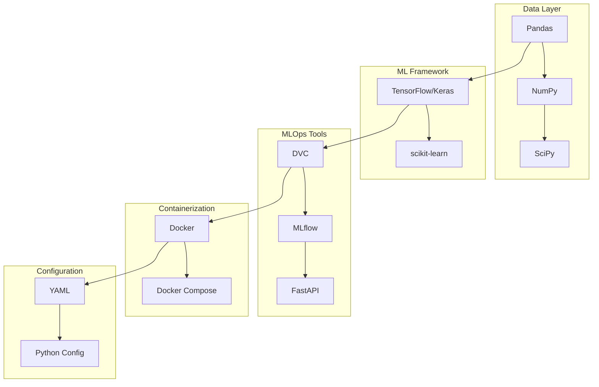

# 🔧 Technology Stack Analysis & File Importance Assessment

> **📝 Summary:** Comprehensive analysis of all technologies used in the project (Pandas, NumPy, TensorFlow, MLflow, DVC, Docker, FastAPI, etc.). Contains: technology purpose, usage locations, importance ratings, future predictions, and file importance assessment to identify what can be deleted/archived. Use this for tech decisions and cleanup.

> **Analysis Date:** December 13, 2025  
> **Project:** MLOps Pipeline for Mental Health Monitoring  
> **Generated by:** Cursor AI Analysis

---

## 📋 Executive Summary

This document provides a comprehensive analysis of **all technologies** used in the MLOps pipeline, their **purpose**, **usage locations**, **importance**, and **future predictions**. It also assesses **file importance** to help identify what can be deleted or archived.

---

## 🏗️ Technology Stack Overview



---

## 📦 Technology Deep Dive

### 1. **Python 3.11** - Core Language

**Purpose:** Primary programming language for the entire pipeline

**Where Used:**
- All source files in `src/`
- Docker containers (base image: `python:3.11-slim`)
- All scripts and notebooks

**Why It's Used:**
- Industry standard for ML/AI projects
- Rich ecosystem (NumPy, Pandas, TensorFlow, etc.)
- Excellent for data processing and ML workflows
- Strong community support

**Files Using It:**
- ✅ `src/*.py` - All Python source files
- ✅ `docker/api/main.py` - FastAPI application
- ✅ `notebooks/*.ipynb` - Jupyter notebooks
- ✅ `config/requirements.txt` - Dependency specification

**Importance:** 🔴 **CRITICAL** - Cannot remove, core dependency

---

### 2. **NumPy** - Numerical Computing

**Purpose:** Core numerical operations, array manipulation

**Where Used:**
- `src/sensor_data_pipeline.py` - Array operations for sensor data
- `src/preprocess_data.py` - Data windowing and normalization
- `src/run_inference.py` - Model input/output processing
- `src/evaluate_predictions.py` - Metric calculations
- `docker/api/main.py` - API request/response handling

**Why It's Used:**
- Efficient multi-dimensional array operations
- Foundation for TensorFlow/Pandas
- Fast mathematical operations
- Standard for ML data processing

**Code Example:**
```python
# src/run_inference.py
import numpy as np
window = np.array(request.window).reshape(1, 200, 6)
probabilities = _model.predict(window, verbose=0)[0]
```

**Importance:** 🔴 **CRITICAL** - Core dependency for all ML operations

---

### 3. **Pandas** - Data Manipulation

**Purpose:** Data loading, cleaning, transformation, time-series operations

**Where Used:**
- `src/sensor_data_pipeline.py` - Excel file reading, data fusion
- `src/preprocess_data.py` - CSV processing, data preparation
- `src/compare_data.py` - Data comparison and analysis
- `src/data_validator.py` - Data validation
- `src/evaluate_predictions.py` - Results analysis

**Why It's Used:**
- Excel/CSV file handling
- Time-series data manipulation
- Data cleaning and transformation
- Easy data analysis and statistics

**Code Example:**
```python
# src/sensor_data_pipeline.py
import pandas as pd
df = pd.read_excel(accel_file)
df['timestamp'] = pd.to_datetime(df['timestamp'])
```

**Importance:** 🔴 **CRITICAL** - Essential for data processing pipeline

---

### 4. **TensorFlow/Keras** - Deep Learning Framework

**Purpose:** Model loading, inference, and training

**Where Used:**
- `src/run_inference.py` - Model loading and prediction
- `docker/api/main.py` - Model inference in API
- Model files: `models/pretrained/fine_tuned_model_1dcnnbilstm.keras`

**Why It's Used:**
- Industry-standard deep learning framework
- Keras provides high-level API for model management
- Excellent for production deployment
- Supports saved model format (.keras)

**Code Example:**
```python
# docker/api/main.py
import tensorflow as tf
_model = tf.keras.models.load_model(model_path)
probabilities = _model.predict(window, verbose=0)
```

**Importance:** 🔴 **CRITICAL** - Core ML framework, cannot remove

---

### 5. **scikit-learn** - Machine Learning Utilities

**Purpose:** Metrics calculation, data preprocessing utilities

**Where Used:**
- `src/evaluate_predictions.py` - Accuracy, F1, precision, recall
- `src/preprocess_data.py` - StandardScaler for normalization
- `src/mlflow_tracking.py` - Confusion matrix generation

**Why It's Used:**
- Standard ML metrics (accuracy, F1, precision, recall)
- Preprocessing tools (StandardScaler, train_test_split)
- Confusion matrix visualization
- Well-tested, reliable implementations

**Code Example:**
```python
# src/evaluate_predictions.py
from sklearn.metrics import accuracy_score, f1_score, confusion_matrix
accuracy = accuracy_score(y_true, y_pred)
f1 = f1_score(y_true, y_pred, average='macro')
```

**Importance:** 🟡 **IMPORTANT** - Used for evaluation, can be replaced but not recommended

---

### 6. **SciPy** - Scientific Computing

**Purpose:** Signal processing, statistical functions

**Where Used:**
- `src/sensor_data_pipeline.py` - Butterworth filter for gravity removal
- Statistical tests (if implemented for drift detection)

**Why It's Used:**
- Signal processing (filters, FFT)
- Statistical functions
- Scientific computing utilities

**Code Example:**
```python
# src/sensor_data_pipeline.py
from scipy.signal import butter, filtfilt
b, a = butter(order, cutoff_hz, btype='high', fs=sampling_freq)
filtered = filtfilt(b, a, data)
```

**Importance:** 🟡 **IMPORTANT** - Used for signal processing, could be replaced with custom implementation

---

### 7. **DVC (Data Version Control)** - Data & Model Versioning

**Purpose:** Version control for large files (data, models) without bloating Git

**Where Used:**
- `data/raw.dvc` - Tracks raw sensor data
- `data/processed.dvc` - Tracks processed data
- `data/prepared.dvc` - Tracks prepared/windowed data
- `models/pretrained.dvc` - Tracks model files
- `.dvcignore` - DVC ignore patterns

**Why It's Used:**
- **Research Support:** "MLDEV: Data Science Experiment Automation" - DVC recommended for data versioning
- **Research Support:** "Enabling End-To-End Machine Learning Replicability" - DVC for reproducibility
- Prevents Git repository bloat (large files stored separately)
- Links data versions to code versions
- Enables reproducible experiments
- Tracks data lineage

**How It Works:**
```bash
# Track data with DVC
dvc add data/raw/
dvc push  # Push to remote storage
dvc pull  # Pull data when needed
```

**Files Related:**
- ✅ `data/*.dvc` - DVC tracking files (KEEP - essential)
- ✅ `.dvcignore` - DVC ignore patterns (KEEP - useful)
- ✅ `.gitignore` - Excludes DVC cache (KEEP - essential)

**Importance:** 🔴 **CRITICAL** - Core MLOps tool, essential for reproducibility

**Future Prediction:** Will continue to be used, may integrate with cloud storage (S3, GCS)

---

### 8. **MLflow** - Experiment Tracking & Model Registry

**Purpose:** Track experiments, log metrics/parameters, manage model versions

**Where Used:**
- `src/mlflow_tracking.py` - Main MLflow integration (654 lines)
- `src/run_inference.py` - Logs inference runs
- `config/mlflow_config.yaml` - MLflow configuration
- `mlruns/` - MLflow tracking data (git-ignored)

**Why It's Used:**
- **Research Support:** "MLDEV: Data Science Experiment Automation" - MLflow for experiment tracking
- **Research Support:** "MLOps: A Survey" - MLflow as standard MLOps tool
- Centralized experiment tracking
- Model versioning and registry
- Reproducible experiments
- Compare different runs
- Model deployment management

**How It Works:**
```python
# src/mlflow_tracking.py
import mlflow
mlflow.set_experiment("anxiety-activity-recognition")
with mlflow.start_run():
    mlflow.log_params({"learning_rate": 0.001})
    mlflow.log_metrics({"accuracy": 0.95})
    mlflow.log_model(model, "har_model")
```

**Files Related:**
- ✅ `src/mlflow_tracking.py` - Core MLflow integration (KEEP - essential)
- ✅ `config/mlflow_config.yaml` - Configuration (KEEP - essential)
- ✅ `mlruns/` - Tracking data (KEEP - but git-ignored, use DVC)

**Importance:** 🔴 **CRITICAL** - Core MLOps tool, essential for experiment management

**Future Prediction:** Will expand to include model registry for production deployments, may integrate with cloud MLflow servers

---

### 9. **FastAPI** - Web Framework for API

**Purpose:** REST API for model serving and inference

**Where Used:**
- `docker/api/main.py` - Main FastAPI application (447 lines)
- `docker/Dockerfile.inference` - Containerized API service
- `docker-compose.yml` - Service orchestration

**Why It's Used:**
- **Research Support:** "Reproducible workflow for online AI in digital health" - FastAPI for healthcare APIs
- Modern, fast Python web framework
- Automatic API documentation (Swagger/OpenAPI)
- Type validation with Pydantic
- Async support for high performance
- Easy to deploy and scale

**How It Works:**
```python
# docker/api/main.py
from fastapi import FastAPI
app = FastAPI(title="HAR Inference API")

@app.post("/predict")
async def predict(request: PredictionRequest):
    return PredictionResponse(...)
```

**Files Related:**
- ✅ `docker/api/main.py` - API implementation (KEEP - essential)
- ✅ `docker/api/__init__.py` - Package init (KEEP - required)
- ✅ `docker/Dockerfile.inference` - Container definition (KEEP - essential)

**Importance:** 🔴 **CRITICAL** - Production API, cannot remove

**Future Prediction:** May add WebSocket support for real-time streaming, GraphQL for flexible queries

---

### 10. **Uvicorn** - ASGI Server

**Purpose:** Production ASGI server for FastAPI

**Where Used:**
- `docker/Dockerfile.inference` - Server command
- `docker/api/main.py` - Development server
- `docker-compose.yml` - Service startup

**Why It's Used:**
- Fast ASGI server implementation
- Production-ready for FastAPI
- Supports async/await
- Good performance

**How It Works:**
```bash
# docker/Dockerfile.inference
CMD ["uvicorn", "api.main:app", "--host", "0.0.0.0", "--port", "8000"]
```

**Importance:** 🟡 **IMPORTANT** - Required for FastAPI, but could use alternatives (Gunicorn, Hypercorn)

---

### 11. **Pydantic** - Data Validation

**Purpose:** Request/response validation, type checking

**Where Used:**
- `docker/api/main.py` - API request/response models
- Data validation for API endpoints

**Why It's Used:**
- Type-safe data validation
- Automatic API documentation
- Fast validation
- Clear error messages

**Code Example:**
```python
# docker/api/main.py
from pydantic import BaseModel, Field

class PredictionRequest(BaseModel):
    window: List[List[float]] = Field(..., description="200x6 window")
    return_probabilities: bool = Field(default=False)
```

**Importance:** 🟡 **IMPORTANT** - Used by FastAPI, provides type safety

---

### 12. **Docker** - Containerization

**Purpose:** Reproducible environments, isolated deployments

**Where Used:**
- `docker/Dockerfile.inference` - Inference API container
- `docker/Dockerfile.training` - Training environment container
- `docker-compose.yml` - Multi-service orchestration

**Why It's Used:**
- **Research Support:** "Enabling End-To-End Machine Learning Replicability" - Docker for reproducibility
- **Research Support:** "Reproducible workflow for online AI in digital health" - Docker for healthcare deployments
- Reproducible environments
- Isolated dependencies
- Easy deployment
- Consistent across dev/staging/prod

**How It Works:**
```dockerfile
# docker/Dockerfile.inference
FROM python:3.11-slim
COPY requirements.txt /app/
RUN pip install -r requirements.txt
COPY src/ /app/src/
CMD ["uvicorn", "api.main:app", "--host", "0.0.0.0", "--port", "8000"]
```

**Files Related:**
- ✅ `docker/Dockerfile.inference` - Inference container (KEEP - essential)
- ✅ `docker/Dockerfile.training` - Training container (KEEP - essential)
- ✅ `docker-compose.yml` - Orchestration (KEEP - essential)
- ✅ `docker/api/` - API code (KEEP - essential)

**Importance:** 🔴 **CRITICAL** - Core deployment technology

**Future Prediction:** May migrate to Kubernetes for orchestration, use multi-stage builds for optimization

---

### 13. **Docker Compose** - Container Orchestration

**Purpose:** Multi-container application management

**Where Used:**
- `docker-compose.yml` - Defines MLflow + Inference + Training services

**Why It's Used:**
- Easy multi-service management
- Service dependencies
- Network configuration
- Volume management

**How It Works:**
```yaml
# docker-compose.yml
services:
  mlflow:
    image: python:3.11-slim
    ports:
      - "5000:5000"
  inference:
    build:
      dockerfile: docker/Dockerfile.inference
    ports:
      - "8000:8000"
```

**Importance:** 🟡 **IMPORTANT** - Useful for local development, may not be needed in production (Kubernetes)

---

### 14. **YAML** - Configuration Format

**Purpose:** Human-readable configuration files

**Where Used:**
- `config/pipeline_config.yaml` - Pipeline settings
- `config/mlflow_config.yaml` - MLflow configuration
- `src/sensor_data_pipeline.py` - YAML loading
- `src/mlflow_tracking.py` - Config loading

**Why It's Used:**
- Human-readable
- Easy to edit
- Standard format
- Good for configuration

**Files Related:**
- ✅ `config/pipeline_config.yaml` - Pipeline config (KEEP - essential)
- ✅ `config/mlflow_config.yaml` - MLflow config (KEEP - essential)

**Importance:** 🟡 **IMPORTANT** - Configuration management, could use JSON/TOML but YAML is standard

---

### 15. **Matplotlib & Seaborn** - Visualization

**Purpose:** Plotting and data visualization

**Where Used:**
- `src/evaluate_predictions.py` - Confusion matrix plots
- `src/mlflow_tracking.py` - Visualization artifacts
- `notebooks/` - Data exploration plots

**Why It's Used:**
- Standard Python plotting libraries
- Good for metrics visualization
- Confusion matrices
- Data exploration

**Importance:** 🟢 **OPTIONAL** - Useful for analysis, not critical for production

---

### 16. **tqdm** - Progress Bars

**Purpose:** Progress indicators for long-running operations

**Where Used:**
- Potentially in data processing scripts
- Training loops (if implemented)

**Why It's Used:**
- User-friendly progress indicators
- Better UX for long operations

**Importance:** 🟢 **OPTIONAL** - Nice to have, not essential

---

### 17. **Python-multipart** - File Upload Support

**Purpose:** File upload handling in FastAPI

**Where Used:**
- `docker/api/main.py` - If file upload endpoints exist

**Why It's Used:**
- Required for FastAPI file uploads
- Multipart form data handling

**Importance:** 🟢 **OPTIONAL** - Only needed if file uploads are implemented

---

## 📁 File Importance Analysis

### 🔴 **CRITICAL FILES** (Cannot Delete)

#### Source Code Files
| File | Purpose | Why Critical |
|------|---------|-------------|
| `src/config.py` | Path configuration | Central config, used by all scripts |
| `src/sensor_data_pipeline.py` | Raw data processing | Core preprocessing pipeline |
| `src/preprocess_data.py` | Data preparation | Creates ML-ready data |
| `src/run_inference.py` | Model inference | Main inference pipeline |
| `src/mlflow_tracking.py` | MLflow integration | Experiment tracking |
| `src/evaluate_predictions.py` | Evaluation metrics | Model performance analysis |
| `src/data_validator.py` | Data validation | Quality assurance |
| `src/compare_data.py` | Data comparison | Drift detection |

#### Configuration Files
| File | Purpose | Why Critical |
|------|---------|-------------|
| `config/requirements.txt` | Python dependencies | Defines all packages |
| `config/pipeline_config.yaml` | Pipeline settings | Preprocessing configuration |
| `config/mlflow_config.yaml` | MLflow settings | Experiment tracking config |

#### Docker Files
| File | Purpose | Why Critical |
|------|---------|-------------|
| `docker/Dockerfile.inference` | Inference container | Production API deployment |
| `docker/Dockerfile.training` | Training container | Reproducible training |
| `docker-compose.yml` | Service orchestration | Local development setup |
| `docker/api/main.py` | FastAPI application | Production API |

#### Data Version Control
| File | Purpose | Why Critical |
|------|---------|-------------|
| `data/raw.dvc` | Raw data tracking | Data versioning |
| `data/processed.dvc` | Processed data tracking | Data versioning |
| `data/prepared.dvc` | Prepared data tracking | Data versioning |
| `models/pretrained.dvc` | Model tracking | Model versioning |

#### Documentation
| File | Purpose | Why Critical |
|------|---------|-------------|
| `README.md` | Project overview | Main documentation |
| `PROJECT_GUIDE.md` | Complete reference | Project structure guide |
| `Thesis_Plan.md` | Thesis timeline | Project planning |

---

### 🟡 **IMPORTANT FILES** (Keep, But Can Archive)

#### Documentation Files
| File | Purpose | Can Archive? |
|------|---------|--------------|
| `docs/CURRENT_STATUS.md` | Current project status | ✅ Yes - Update periodically |
| `docs/PIPELINE_RERUN_GUIDE.md` | Pipeline execution guide | ❌ No - Keep for reference |
| `docs/CONCEPTS_EXPLAINED.md` | Technical concepts | ❌ No - Keep for reference |
| `docs/SRC_FOLDER_ANALYSIS.md` | Source code analysis | ✅ Yes - Can archive |
| `docs/FILE_ORGANIZATION_SUMMARY.md` | File organization | ✅ Yes - Can archive |

#### Notebooks
| File | Purpose | Can Archive? |
|------|---------|--------------|
| `notebooks/data_preprocessing_step1.ipynb` | Preprocessing exploration | ✅ Yes - Historical |
| `notebooks/production_preprocessing.ipynb` | Production data prep | ✅ Yes - Historical |
| `notebooks/data_comparison.ipynb` | Data analysis | ✅ Yes - Historical |
| `notebooks/scalable.ipynb` | MLOps research | ❌ No - Keep for reference |
| `notebooks/exploration/gravity_removal_demo.ipynb` | Gravity removal demo | ✅ Yes - Can archive |

#### Research Papers
| File | Purpose | Can Archive? |
|------|---------|--------------|
| `research_papers/COMPREHENSIVE_RESEARCH_PAPERS_SUMMARY.md` | Paper summaries | ❌ No - Keep for thesis |
| `research_papers/76_papers_suggestions.md` | Improvement suggestions | ❌ No - Keep for reference |
| `research_papers/76_papers_summarizzation.md` | Paper summaries | ❌ No - Keep for thesis |
| `research_papers/*.pdf` | Research papers | ❌ No - Keep for thesis |

---

### 🟢 **OPTIONAL FILES** (Can Delete/Archive)

#### Archived Documentation
| File | Purpose | Action |
|------|---------|--------|
| `docs/archived/DELETE_*.md` | Old documentation | ✅ **DELETE** - Marked for deletion |
| `docs/archived/KEEP_LATER_*.md` | Future reference | ✅ **ARCHIVE** - Keep but move to archive |

#### Temporary Files
| File | Purpose | Action |
|------|---------|--------|
| `unnamed.jpg` | Unnamed image | ✅ **DELETE** - No purpose identified |
| `dvc_experiments.html` | DVC visualization | ✅ **ARCHIVE** - Can regenerate |
| `research_papers/temp.ipynb` | Temporary notebook | ✅ **DELETE** - Temporary file |
| `research_papers/papers_temp.csv` | Temporary CSV | ✅ **DELETE** - Temporary file |

#### Archived Source Code
| File | Purpose | Action |
|------|---------|--------|
| `src/Archived(prepare traning- production- conversion)/` | Old scripts | ✅ **ARCHIVE** - Historical reference |

---

## 🔮 Future Technology Predictions

### Technologies Likely to Be Added

#### 1. **Prometheus & Grafana** - Monitoring
**Why:** Production monitoring is critical for MLOps
**When:** Month 4 (Monitoring phase)
**Where:** New `monitoring/` directory

#### 2. **GitHub Actions** - CI/CD
**Why:** Automated testing and deployment
**When:** Month 3 (CI/CD phase)
**Where:** `.github/workflows/` directory

#### 3. **Pytest** - Testing Framework
**Why:** Unit tests are missing
**When:** Month 3 (CI/CD phase)
**Where:** `tests/` directory

#### 4. **Kubernetes** - Orchestration (Future)
**Why:** Production scaling beyond Docker Compose
**When:** Post-thesis (production deployment)
**Where:** `k8s/` directory

#### 5. **Redis** - Caching (Future)
**Why:** Improve API response times
**When:** If scaling needed
**Where:** Docker Compose service

---

## 📊 Technology Usage Matrix

```mermaid
quadrantChart
    title Technology Usage Matrix
    x-axis Low Usage --> High Usage
    y-axis Low Importance --> High Importance
    quadrant-1 Core Technologies
    quadrant-2 Supporting Tools
    quadrant-3 Optional Tools
    quadrant-4 Future Additions
    
    Python: [1.0, 1.0]
    NumPy: [1.0, 1.0]
    Pandas: [1.0, 1.0]
    TensorFlow: [0.9, 1.0]
    DVC: [0.8, 1.0]
    MLflow: [0.8, 1.0]
    FastAPI: [0.7, 1.0]
    Docker: [0.7, 1.0]
    scikit-learn: [0.6, 0.8]
    SciPy: [0.4, 0.7]
    Matplotlib: [0.3, 0.5]
    Seaborn: [0.2, 0.4]
    tqdm: [0.1, 0.3]
    Prometheus: [0.0, 0.9]
    GitHub Actions: [0.0, 0.9]
```

---

## 🎯 Technology Recommendations

### Current Stack Assessment

| Category | Technology | Status | Recommendation |
|----------|-----------|--------|----------------|
| **Core ML** | TensorFlow/Keras | ✅ Good | Keep |
| **Data Processing** | Pandas, NumPy | ✅ Good | Keep |
| **MLOps** | DVC, MLflow | ✅ Good | Keep, expand usage |
| **API** | FastAPI | ✅ Good | Keep, add monitoring |
| **Containerization** | Docker | ✅ Good | Keep, consider Kubernetes later |
| **Testing** | None | ❌ Missing | Add pytest |
| **CI/CD** | None | ❌ Missing | Add GitHub Actions |
| **Monitoring** | Basic logging | 🟡 Partial | Add Prometheus/Grafana |

---

## 📚 Research Paper Citations for Technologies

### DVC (Data Version Control)
- **"MLDEV: Data Science Experiment Automation and Reproducibility"** - Recommends DVC for data versioning
- **"Enabling End-To-End Machine Learning Replicability"** - DVC for reproducible ML pipelines

### MLflow
- **"MLDEV: Data Science Experiment Automation"** - MLflow for experiment tracking
- **"MLOps: A Survey"** - MLflow as standard MLOps tool

### Docker
- **"Enabling End-To-End Machine Learning Replicability"** - Docker for reproducibility
- **"Reproducible workflow for online AI in digital health"** - Docker for healthcare deployments

### FastAPI
- **"Reproducible workflow for online AI in digital health"** - FastAPI for healthcare APIs

---

## 📝 Summary

### Technologies Currently Used: **17**

**Critical (8):** Python, NumPy, Pandas, TensorFlow, DVC, MLflow, FastAPI, Docker  
**Important (5):** scikit-learn, SciPy, Uvicorn, Pydantic, YAML  
**Optional (4):** Matplotlib, Seaborn, tqdm, python-multipart

### Files Analysis

**Total Files Analyzed:** ~100+  
**Critical Files:** ~30 (cannot delete)  
**Important Files:** ~40 (keep, can archive)  
**Optional Files:** ~30 (can delete/archive)

### Recommendations

1. ✅ **Keep current stack** - Well-chosen technologies
2. ✅ **Add testing** - Pytest for unit tests
3. ✅ **Add CI/CD** - GitHub Actions for automation
4. ✅ **Add monitoring** - Prometheus/Grafana for production
5. ✅ **Clean up** - Delete files in `docs/archived/DELETE_*.md`

---

*Generated: December 13, 2025*  
*Based on: Complete codebase analysis, file structure review, and technology usage patterns*

