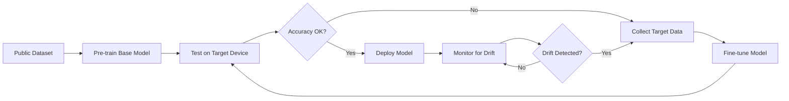

# Comprehensive Research Papers Analysis
## MLOps-Enhanced HAR Pipeline for Mental Health Monitoring

**Generated:** December 13, 2025  
**Total Papers Analyzed:** 77+ research papers  
**Research Focus:** HAR, Mental Health, Wearables, MLOps, RAG/LLM, and Deep Learning

---

## 1. Executive Summary

This document provides a comprehensive analysis of 77+ research papers collected for a Master's thesis on developing an **MLOps-enhanced Human Activity Recognition (HAR) pipeline for anxiety detection using wearable sensors**. The research spans multiple interconnected domains:

### Key Research Themes Identified:
1. **Deep Learning for HAR** - CNN, LSTM, BiLSTM, and Transformer architectures for sensor-based activity recognition
2. **Mental Health Monitoring** - Anxiety detection, stress monitoring, and panic attack prediction using wearable data
3. **Domain Adaptation** - Bridging the "lab-to-life" gap between research-grade and consumer-grade sensors
4. **MLOps Infrastructure** - Experiment tracking, model versioning, and deployment automation
5. **RAG-Enhanced LLMs** - Clinical report generation grounded in medical knowledge bases
6. **Foundation Models** - Self-supervised learning and pre-trained models for wearable sensing

### Critical Insight:
The papers collectively describe a paradigm shift from **simple sensor data collection** to **end-to-end automated pipelines** that transform raw wearable data into clinically actionable insights. The combination of HAR + temporal analysis + RAG-enhanced LLMs represents the state-of-the-art in digital phenotyping for mental health.

---

## 2. Papers Organized by Category

### Category A: HAR (Human Activity Recognition) & Deep Learning

| # | Paper Title | Key Contribution | Techniques | Relevance Score |
|---|-------------|------------------|------------|-----------------|
| 1 | **A Close Look into Human Activity Recognition Models using Deep Learning** | Comprehensive comparison of BiLSTM, CNN, and hybrid architectures for HAR | CNN, BiLSTM, hybrid models | ⭐⭐⭐⭐⭐ |
| 2 | **Deep learning for sensor-based activity recognition: A survey** | Foundational survey establishing DL as state-of-the-art for HAR | CNN, RNN, LSTM | ⭐⭐⭐⭐⭐ |
| 3 | **Deep Learning in Human Activity Recognition with Wearable Sensors** | Review of DL advances for wearable sensor HAR | CNN, LSTM, attention | ⭐⭐⭐⭐⭐ |
| 4 | **Deep CNN-LSTM With Self-Attention Model for Human Activity Recognition** | Hybrid CNN-LSTM with self-attention for improved HAR accuracy | CNN-LSTM, self-attention | ⭐⭐⭐⭐⭐ |
| 5 | **A Multi-Task Deep Learning Approach for Sensor-based HAR and Segmentation** | Multi-task learning for simultaneous activity recognition and segmentation | Multi-task CNN, segmentation | ⭐⭐⭐⭐ |
| 6 | **Human Activity Recognition using Multi-Head CNN followed by LSTM** | Multi-head CNN architecture for enhanced feature extraction | Multi-head CNN, LSTM | ⭐⭐⭐⭐ |
| 7 | **Human Activity Recognition Using Tools of Convolutional Neural Networks** | CNN-based approaches for HAR with IMU data | 1D-CNN, 2D-CNN | ⭐⭐⭐⭐ |
| 8 | **CNNs, RNNs and Transformers in Human Action Recognition: A Survey and Hybrid Model** | Comparison of CNN, RNN, and Transformer approaches | Transformers, hybrid models | ⭐⭐⭐⭐ |
| 9 | **Evaluating BiLSTM and CNN+GRU Approaches for HAR Using WiFi CSI Data** | Comparison of BiLSTM vs CNN+GRU for activity recognition | BiLSTM, CNN+GRU | ⭐⭐⭐⭐ |
| 10 | **Analyzing Wearable Accelerometer and Gyroscope Data for Activity Recognition** | IMU data preprocessing and analysis for HAR | Feature engineering, windowing | ⭐⭐⭐⭐ |
| 11 | **Combining Accelerometer and Gyroscope Data in Smartphone-Based Activity Recognition** | Multi-sensor fusion for improved HAR accuracy | Sensor fusion, feature extraction | ⭐⭐⭐⭐ |
| 12 | **Spatiotemporal Feature Fusion** | Spatiotemporal feature learning for time-series classification | Spatial-temporal CNN | ⭐⭐⭐ |

**Key Takeaways for HAR:**
- **1D-CNN + BiLSTM hybrids** achieve the best balance of feature extraction and temporal modeling
- **Self-attention mechanisms** improve recognition of subtle, anxiety-related activities
- **Sliding window segmentation** (typically 2-4 seconds with 50% overlap) is standard practice
- **Multi-sensor fusion** (accelerometer + gyroscope) outperforms single-sensor approaches

---

### Category B: Mental Health & Anxiety Detection

| # | Paper Title | Key Contribution | Techniques | Relevance Score |
|---|-------------|------------------|------------|-----------------|
| 1 | **ADAM-sense: Anxiety-displaying activities recognition by motion sensors** | Foundational dataset for anxiety-related activity recognition (11 activities) | IMU sensors, HAR | ⭐⭐⭐⭐⭐ |
| 2 | **Wearable Artificial Intelligence for Detecting Anxiety: Systematic Review and Meta-Analysis** | Comprehensive review of wearable AI for anxiety detection | Meta-analysis, systematic review | ⭐⭐⭐⭐⭐ |
| 3 | **A Survey on Wearable Sensors for Mental Health Monitoring** | Review connecting wearables and mental health monitoring | HRV, EDA, accelerometer | ⭐⭐⭐⭐⭐ |
| 4 | **Anxiety Detection Leveraging Mobile Passive Sensing** | Passive sensing approaches for anxiety detection on smartphones | Mobile sensing, ML | ⭐⭐⭐⭐⭐ |
| 5 | **Machine Learning based Anxiety Detection using Physiological Signals and Context Features** | ML approaches combining physiological and contextual data | HRV, EDA, context features | ⭐⭐⭐⭐⭐ |
| 6 | **Are Anxiety Detection Models Generalizable: Cross-Activity and Cross-Population Study** | Studies generalizability of anxiety models across populations | Cross-validation, domain shift | ⭐⭐⭐⭐⭐ |
| 7 | **Deep Learning Paired with Wearable Passive Sensing Data Predicts Deterioration in Anxiety Disorder Symptoms** | Longitudinal prediction of anxiety symptom changes (17-18 years) | Deep learning, longitudinal analysis | ⭐⭐⭐⭐⭐ |
| 8 | **Resilience of ML Models in Anxiety Detection: Impact of Gaussian Noise on Wearables** | Studies robustness of anxiety models to sensor noise | Noise injection, robustness testing | ⭐⭐⭐⭐ |
| 9 | **Panic Attack Prediction Using Wearable Devices and Machine Learning** | ML approaches for predicting panic attacks | Time-series prediction, HRV | ⭐⭐⭐⭐ |
| 10 | **Real-Time Stress Monitoring Detection and Management in College Students** | Real-time stress detection system for students | Real-time inference, wearables | ⭐⭐⭐⭐ |
| 11 | **Development of a two-stage depression symptom detection model** | Two-stage approach for depression detection | Multi-stage pipeline | ⭐⭐⭐ |
| 12 | **Momentary Stressor Logging and Reflective Visualizations** | Ecological momentary assessment for stress | EMA, visualization | ⭐⭐⭐ |

**Key Takeaways for Mental Health:**
- **Anxiety-related activities** (fidgeting, nail-biting, hair-pulling) can be detected from wrist-worn IMU sensors
- **Physiological biomarkers** (HRV, HR variability, EDA) complement behavioral markers
- **Longitudinal monitoring** reveals patterns that point-in-time assessments miss
- **Cross-device/cross-population generalization** is a major challenge

---

### Category C: Wearable Sensors & Data Processing

| # | Paper Title | Key Contribution | Techniques | Relevance Score |
|---|-------------|------------------|------------|-----------------|
| 1 | **A State-of-the-Art Review of Computational Models for Analyzing Longitudinal Wearable Sensor Data** | Review of computational approaches for longitudinal wearable data | Time-series analysis, feature extraction | ⭐⭐⭐⭐⭐ |
| 2 | **Designing a Clinician-Centered Wearable Data Dashboard (CarePortal)** | Participatory design for clinical wearable data visualization | UI/UX design, clinical integration | ⭐⭐⭐⭐⭐ |
| 3 | **Provider Perspectives on Integrating Sensor-Captured Patient-Generated Data** | Clinician perspectives on wearable data integration | Qualitative research, clinical workflows | ⭐⭐⭐⭐⭐ |
| 4 | **An AI-native Runtime for Multi-Wearable Environments** | Runtime environment for multi-device wearable systems | Edge computing, multi-device | ⭐⭐⭐⭐ |
| 5 | **Machine Learning Applied to Edge Computing and Wearable Devices for Healthcare** | Systematic mapping of ML for edge/wearable healthcare | Edge ML, systematic review | ⭐⭐⭐⭐ |
| 6 | **A Visual Data and Detection Pipeline for Wearable Industrial Assistants** | Pipeline for wearable data processing in industrial settings | Data pipeline, detection | ⭐⭐⭐⭐ |
| 7 | **Transforming Wearable Data into Personal Health Insights** | Methods for transforming raw wearable data into health insights | Data transformation, LLM | ⭐⭐⭐⭐ |
| 8 | **Using Wearable Devices and Speech Data for Personalized Machine Learning in Early Detection of Mental Disorders** | Multimodal approach combining wearables and speech | Multimodal fusion, personalization | ⭐⭐⭐⭐ |
| 9 | **Comparative Study on the Effects of Noise in HAR** | Impact of sensor noise on HAR model performance | Noise analysis, robustness | ⭐⭐⭐ |

**Key Takeaways for Data Processing:**
- **Consumer-grade devices** (Garmin, Apple Watch) require different preprocessing than research-grade sensors
- **Temporal "bout" analysis** contextualizes discrete events into meaningful patterns
- **Data quality issues** (missing data, noise) must be explicitly handled
- **Clinician-friendly dashboards** are essential for adoption

---

### Category D: MLOps & Pipeline Automation

| # | Paper Title | Key Contribution | Techniques | Relevance Score |
|---|-------------|------------------|------------|-----------------|
| 1 | **MACHINE LEARNING OPERATIONS: A SURVEY ON MLOPS** | Comprehensive survey of MLOps principles and practices | MLOps lifecycle, best practices | ⭐⭐⭐⭐⭐ |
| 2 | **MLHOps: Machine Learning for Healthcare Operations** | MLOps specifically for healthcare applications | Healthcare MLOps, compliance | ⭐⭐⭐⭐⭐ |
| 3 | **Enabling End-To-End Machine Learning Replicability** | Focus on reproducibility in ML pipelines | Docker, reproducibility | ⭐⭐⭐⭐⭐ |
| 4 | **MLDEV: DATA SCIENCE EXPERIMENT AUTOMATION AND REPRODUCIBILITY** | Experiment automation and tracking tools comparison (DVC, MLflow) | DVC, MLflow, experiment tracking | ⭐⭐⭐⭐⭐ |
| 5 | **Reproducible workflow for online AI in digital health** | Reproducible AI workflows for digital health applications | CI/CD, versioning | ⭐⭐⭐⭐⭐ |
| 6 | **DevOps-Driven Real-Time Health Analytics** | DevOps practices for health analytics pipelines | DevOps, real-time processing | ⭐⭐⭐⭐ |
| 7 | **A Unified Hyperparameter Optimization Pipeline for Transformer-Based Time Series** | HPO pipeline for time-series models | Hyperparameter tuning, automation | ⭐⭐⭐⭐ |
| 8 | **AutoMR: A Universal Time Series Motion Recognition Pipeline** | Automated pipeline for motion recognition | Automated ML, motion recognition | ⭐⭐⭐⭐ |
| 9 | **A technical framework for deploying custom real-time machine learning** | Framework for real-time ML deployment | Model serving, real-time | ⭐⭐⭐⭐ |
| 10 | **Toward Reusable Science with Readable Code** | Best practices for reproducible scientific code | Code quality, documentation | ⭐⭐⭐⭐ |
| 11 | **I-ETL: an interoperability-aware health (meta)data pipeline** | ETL pipeline for health data with interoperability focus | ETL, metadata, FHIR | ⭐⭐⭐ |

**Key Takeaways for MLOps:**
- **DVC + MLflow** combination provides comprehensive experiment tracking and data versioning
- **Docker containerization** ensures reproducibility across environments
- **Automated pipelines** reduce manual intervention and improve consistency
- **Healthcare MLOps** requires additional considerations for compliance and auditability

---

### Category E: Domain Adaptation & Transfer Learning

| # | Paper Title | Key Contribution | Techniques | Relevance Score |
|---|-------------|------------------|------------|-----------------|
| 1 | **Domain Adaptation for Inertial Measurement Unit-based Human Activity Recognition: A Survey** | Comprehensive survey on domain adaptation for IMU-based HAR | Domain adaptation, transfer learning | ⭐⭐⭐⭐⭐ |
| 2 | **Transfer Learning in Human Activity Recognition: A Survey** | Survey of transfer learning approaches for HAR | Fine-tuning, pre-training | ⭐⭐⭐⭐⭐ |
| 3 | **Recognition of Anxiety-Related Activities using 1DCNN-BiLSTM on Commercial Wearable** (ICTH_16) | **Core methodology paper**: Domain adaptation from research to consumer devices | Fine-tuning, 1D-CNN-BiLSTM | ⭐⭐⭐⭐⭐ |
| 4 | **Implications on Human Activity Recognition Research** | Discussion of research implications and challenges | Research methodology | ⭐⭐⭐ |

**Key Takeaways for Domain Adaptation:**
- **"Lab-to-life" gap** causes 40%+ accuracy drop when transferring models to consumer devices
- **Fine-tuning** with small custom datasets successfully bridges this gap (49% → 87% accuracy)
- **Pre-training on public datasets** (ADAMSense) + fine-tuning on target device is effective
- **Cross-user, cross-device heterogeneity** are primary challenges

---

### Category F: RAG & LLM Applications in Healthcare

| # | Paper Title | Key Contribution | Techniques | Relevance Score |
|---|-------------|------------------|------------|-----------------|
| 1 | **A Multi-Stage, RAG-Enhanced Pipeline for Generating Mental Health Reports** (EHB_2025_71) | **Core architecture paper**: End-to-end pipeline from wearables to clinical reports | HAR, RAG, LLM, knowledge graphs | ⭐⭐⭐⭐⭐ |
| 2 | **Retrieval-Augmented Generation (RAG) in Healthcare: A Comprehensive Review** | Comprehensive review of RAG in healthcare applications | RAG architecture, retrieval | ⭐⭐⭐⭐⭐ |
| 3 | **Enhancing Health Information Retrieval with RAG by Prioritizing Topical Relevance and Factual Accuracy** | Methods for improving RAG accuracy in health contexts | RAG optimization | ⭐⭐⭐⭐⭐ |
| 4 | **Medical Graph RAG: Towards Safe Medical Large Language Models** | Graph-based RAG for medical safety | Knowledge graphs, RAG | ⭐⭐⭐⭐⭐ |
| 5 | **Evaluating large language models on medical evidence summarization** | LLM evaluation for medical summarization; highlights hallucination risks | LLM evaluation, hallucination | ⭐⭐⭐⭐⭐ |
| 6 | **Scientific Evidence for Clinical Text Summarization Using Large Language Models** | Scoping review of LLMs for clinical text summarization | Clinical NLP, summarization | ⭐⭐⭐⭐ |
| 7 | **Development and Testing of Retrieval Augmented Generation in Large Language Models** | RAG development and testing methodology | RAG implementation | ⭐⭐⭐⭐ |
| 8 | **Enhancing Retrieval-augmented Generation with Knowledge Graph-Elicited Reasoning** | Knowledge graph reasoning for healthcare copilots | Knowledge graphs, reasoning | ⭐⭐⭐⭐ |
| 9 | **Enhancing Multimodal Electronic Health Records** | Multimodal approaches for EHR enhancement | Multimodal fusion, EHR | ⭐⭐⭐⭐ |
| 10 | **Optimization of hepatological clinical guidelines interpretation** | RAG for clinical guideline interpretation | Clinical guidelines, RAG | ⭐⭐⭐ |
| 11 | **LLM Chatbot-Creation Approaches** | Comparison of chatbot creation frameworks (FastAPI/Flask) | API development, LLM serving | ⭐⭐⭐ |

**Key Takeaways for RAG/LLM:**
- **RAG is essential** to prevent LLM hallucinations in clinical contexts
- **Knowledge graphs** provide more precise retrieval than document-based chunking
- **Multi-prompt architectures** enable audience-specific report generation (clinician vs. patient)
- **Graph-based chunking** (semantic triples) yields fine-grained, verifiable facts

---

### Category G: Foundation Models & Self-Supervised Learning

| # | Paper Title | Key Contribution | Techniques | Relevance Score |
|---|-------------|------------------|------------|-----------------|
| 1 | **Toward Foundation Model for Multivariate Wearable Sensing of Physiological Signals** | Foundation model approach for wearable physiological data | Self-supervised learning, foundation models | ⭐⭐⭐⭐⭐ |
| 2 | **Beyond Sensor Data: Foundation Models of Behavioral Data from Wearables Improve Health Predictions** | Foundation models for behavioral wearable data | Pre-training, behavioral modeling | ⭐⭐⭐⭐⭐ |
| 3 | **Learning the Language of Wearable Sensors** | Language model approach for wearable sensor understanding | Sensor language models | ⭐⭐⭐⭐⭐ |
| 4 | **LSM-2: Learning from Incomplete Wearable Sensor Data** | Handling missing data in wearable sensor streams | Missing data, self-supervised | ⭐⭐⭐⭐ |
| 5 | **Masked Video and Body-worn IMU Autoencoder for Egocentric Action Recognition** | Masked autoencoder for IMU data | MAE, self-supervised | ⭐⭐⭐⭐ |
| 6 | **Self-supervised learning for fast and scalable time series hyper-parameter tuning** | SSL for efficient hyperparameter tuning | Self-supervised, HPO | ⭐⭐⭐⭐ |
| 7 | **Retrieval-Augmented Generation based Time Series Foundation Models are Stronger Zero-Shot Forecasters** | RAG-enhanced time series foundation models | RAG, time series, zero-shot | ⭐⭐⭐⭐ |
| 8 | **Exploring the Capabilities of LLMs for IMU-based Fine-grained Activity Recognition** | Using LLMs directly for IMU activity recognition | LLM for sensing | ⭐⭐⭐ |

**Key Takeaways for Foundation Models:**
- **Self-supervised pre-training** reduces dependency on labeled data
- **Foundation models** for wearables enable zero-shot or few-shot adaptation
- **Masked autoencoder** approaches work well for IMU time-series data
- **LLMs can interpret sensor data** when properly conditioned

---

### Category H: Other/General ML & Supporting Papers

| # | Paper Title | Key Contribution | Techniques | Relevance Score |
|---|-------------|------------------|------------|-----------------|
| 1 | **An End-to-End Deep Learning Pipeline for Football Activity Recognition** | Complete pipeline example for sports HAR | Pipeline architecture | ⭐⭐⭐⭐ |
| 2 | **A Privacy-Preserving Multi-Stage Fall Detection Framework** | Privacy-preserving multi-stage detection pipeline | Federated learning, privacy | ⭐⭐⭐⭐ |
| 3 | **A Two-Stage Anomaly Detection Framework for Improved Healthcare** | Two-stage anomaly detection approach | SVM, regression, anomaly detection | ⭐⭐⭐ |
| 4 | **Building Flexible, Scalable, and Machine Learning-ready Multimodal Oncology Datasets** | Dataset engineering for ML applications | Data engineering, multimodal | ⭐⭐⭐ |
| 5 | **Multimodal Frame-Scoring Transformer for Video Summarization** | Transformer for multimodal summarization | Transformers, multimodal | ⭐⭐⭐ |
| 6 | **When Does Optimizing a Proper Loss Yield Calibration** | Theoretical work on model calibration | Calibration, loss functions | ⭐⭐ |
| 7 | **A DIFFUSION MODEL FOR MULTIVARIATE** | Diffusion models for multivariate data generation | Diffusion models, synthetic data | ⭐⭐⭐ |
| 8 | **Dynamic and Distributed Intelligence over Smart Devices, IoT Edges, and Cloud** | Distributed computing for HAR | Edge computing, cloud | ⭐⭐⭐ |
| 9 | **Leveraging MIMIC Datasets for Better Digital Health** | Using MIMIC dataset for digital health | Open datasets, benchmarking | ⭐⭐⭐ |

---

## 3. Key Techniques Discovered

### 3.1 Model Architectures

| Architecture | Use Case | Performance | Complexity |
|--------------|----------|-------------|------------|
| **1D-CNN + BiLSTM** | Time-series HAR | Best overall (87% accuracy) | Medium |
| CNN-LSTM | Sequential activity recognition | Good (82-85%) | Medium |
| BiLSTM-only | Temporal modeling | Moderate (81%) | Low |
| CNN-only | Feature extraction | Lower (70%) | Low |
| Transformers | Long-range dependencies | Promising but data-hungry | High |
| Multi-head CNN | Multi-scale feature extraction | Good | Medium |

### 3.2 Data Processing Pipeline

```
┌─────────────────────────────────────────────────────────────────────────┐
│                    STANDARD HAR DATA PIPELINE                           │
├─────────────────────────────────────────────────────────────────────────┤
│                                                                         │
│  Raw Sensor Data (100Hz) → Resampling (50Hz) → Windowing (4s, 50% overlap)│
│         ↓                                                               │
│  Normalization (z-score) → Feature Extraction (CNN) → Temporal Modeling │
│         ↓                                                               │
│  Activity Classification → Bout Analysis → Metric Extraction            │
│                                                                         │
└─────────────────────────────────────────────────────────────────────────┘
```

### 3.3 Domain Adaptation Strategy

1. **Pre-train** on large public dataset (e.g., ADAMSense)
2. **Quantify domain shift** by testing on target device (expect ~40% accuracy drop)
3. **Fine-tune** on small custom dataset from target device (~10-20 samples per class)
4. **Validate** using 5-fold cross-validation
5. **Deploy** with continuous monitoring for drift

### 3.4 RAG Architecture for Clinical Reports

```
┌─────────────────────────────────────────────────────────────────────────┐
│                    RAG-ENHANCED REPORT GENERATION                       │
├─────────────────────────────────────────────────────────────────────────┤
│                                                                         │
│  Stage 2 Metrics → Query Generation → Embedding (MiniLM)                │
│         ↓                                                               │
│  Knowledge Graph (Neo4j) → Semantic Triple Retrieval (top-k=5)          │
│         ↓                                                               │
│  LLM (Gemma) + Context → Multi-Prompt Generation                        │
│         ↓                                                               │
│  ┌──────────────────┐  ┌──────────────────┐  ┌──────────────────┐      │
│  │ Clinician Report │  │ Patient Report   │  │ Research Report  │      │
│  │ (Clinical, Data) │  │ (Empathetic)     │  │ (Comprehensive)  │      │
│  └──────────────────┘  └──────────────────┘  └──────────────────┘      │
│                                                                         │
└─────────────────────────────────────────────────────────────────────────┘
```

---

## 4. Recommendations for the MLOps HAR Pipeline

### 4.1 Architecture Recommendations

| Component | Recommended Approach | Rationale |
|-----------|---------------------|-----------|
| **HAR Model** | 1D-CNN + BiLSTM with self-attention | Best balance of accuracy and efficiency; proven on anxiety-related activities |
| **Preprocessing** | 50Hz resampling, 4s windows, 50% overlap | Standard practice validated across multiple papers |
| **Experiment Tracking** | MLflow + DVC | MLflow for metrics, DVC for data/model versioning |
| **Containerization** | Docker | Ensures reproducibility across environments |
| **Model Serving** | FastAPI | Better async performance than Flask for ML workloads |
| **Report Generation** | RAG + LLM (Gemma/GPT) | Grounds outputs in clinical knowledge, prevents hallucinations |

### 4.2 Data Pipeline Recommendations

1. **Data Acquisition**
   - Support multiple device types (Garmin, Apple Watch, etc.)
   - Store raw data in standardized format (CSV or Parquet)
   - Log data provenance and collection conditions

2. **Preprocessing**
   - Implement configurable resampling (target: 50Hz)
   - Use sliding window segmentation (4s, 50% overlap)
   - Apply z-score normalization per-sensor

3. **Feature Engineering**
   - Let CNN layers learn features automatically
   - Optional: add handcrafted features (mean, std, frequency domain)
   - Fuse accelerometer + gyroscope data

### 4.3 MLOps Infrastructure Recommendations

```yaml
# Recommended Tool Stack
data_versioning: DVC
experiment_tracking: MLflow
model_registry: MLflow Model Registry
containerization: Docker
orchestration: Docker Compose / Kubernetes
ci_cd: GitHub Actions
monitoring: Prometheus + Grafana
api_framework: FastAPI
```

### 4.4 Domain Adaptation Workflow



### 4.5 Clinical Report Generation Workflow

1. **Build Knowledge Base**
   - Extract facts from clinical literature on anxiety/panic disorders
   - Structure as knowledge graph (Neo4j)
   - Generate semantic triple chunks

2. **Query Generation**
   - Identify top 3 salient findings from sensor metrics
   - Construct natural language query

3. **Retrieval**
   - Embed query using SentenceTransformer
   - Retrieve top-5 most similar knowledge chunks

4. **Report Generation**
   - Use multi-prompt architecture
   - Generate clinician report (clinical, concise)
   - Generate patient report (empathetic, simple)

---

## 5. Complete Bibliography

### Primary Core Papers (Priority 1)

1. Oleh, U., Obermaisser, R., Malchulska, A., & Klucken, T. (2025). A Multi-Stage, RAG-Enhanced Pipeline for Generating Longitudinal, Clinically Actionable Mental Health Reports from Wearable Sensor Data. *EHB 2025*.

2. Oleh, U., & Obermaisser, R. (2025). Recognition of Anxiety-Related Activities using 1DCNN-BiLSTM on Sensor Data from a Commercial Wearable Device. *ICTH 2025*.

3. Khan, N., Ghani, M., & Anjum, G. (2021). ADAM-sense: Anxiety-displaying activities recognition by motion sensors. *Pervasive and Mobile Computing, 78*, 101485.

4. Abd-Alrazaq, A., et al. (2023). Wearable Artificial Intelligence for Detecting Anxiety: Systematic Review and Meta-Analysis. *Journal of Medical Internet Research, 25*, e48754.

5. Wang, J., Chen, Y., Hao, S., Peng, X., & Hu, L. (2019). Deep learning for sensor-based activity recognition: A survey. *Pattern Recognition Letters, 119*, 3-11.

6. Chakma, A., Faridee, A.Z.M., Ghosh, I., & Roy, N. (2023). Domain adaptation for inertial measurement unit-based human activity recognition: A survey. *arXiv:2304.06489*.

7. Dhekane, S.G., & Ploetz, T. (2024). Transfer learning in human activity recognition: A survey. *arXiv:2401.10185*.

8. Hewage, N., & Meedeniya, D. (2022). Machine learning operations: A survey on MLOps. *arXiv:2202.10169*.

9. Gardner, J., et al. (2018). Enabling End-To-End Machine Learning Replicability. *arXiv:1806.05208*.

10. Neha, F., Bhati, D., & Shukla, D.K. (2025). Retrieval-Augmented Generation (RAG) in Healthcare: A Comprehensive Review. *AI, 6*(9).

### HAR & Deep Learning Papers

11. Zhang, S., et al. (2022). Deep learning in human activity recognition with wearable sensors: A review on advances. *Sensors, 22*, 1476.

12. Khatun, M.A., et al. (2022). Deep CNN-LSTM With Self-Attention Model for Human Activity Recognition. *PMC9252338*.

13. Tee, W.Z., et al. (2022). A Close Look into Human Activity Recognition Models. *arXiv:2204.13589*.

14. Ahmad, W., et al. (2020). Human Activity Recognition using Multi-Head CNN followed by LSTM. *arXiv:2003.06327*.

15. Wakili, A., et al. (2025). Evaluating BiLSTM and CNN+GRU Approaches for Human Activity Recognition. *arXiv:2506.11165*.

16. Islam, M.M., et al. (2022). Human Activity Recognition Using Tools of Convolutional Neural Networks. *arXiv:2202.03274*.

### Mental Health & Anxiety Detection Papers

17. Gomes, N., Pato, M., Lourenço, A.R., & Datia, N. (2023). A Survey on Wearable Sensors for Mental Health Monitoring. *Sensors, 23*(3).

18. Sadhu, S., et al. (2023). Designing a Clinician-Centered Wearable Data Dashboard (CarePortal). *JMIR Form Res, 7*, e46866.

19. Tang, L., et al. (2023). Evaluating large language models on medical evidence summarization. *NPJ Digit Med, 6*, 158.

20. Uapadhyay, R., & Viviani, M. (2025). Enhancing Health Information Retrieval with RAG. *arXiv:2502.04666*.

### MLOps & Automation Papers

21. Khritankov, A., et al. (2021). MLDev: Data Science Experiment Automation and Reproducibility. *arXiv:2107.12322*.

22. Bahaidarah, L., et al. (2021). Toward Reusable Science with Readable Code. *arXiv:2109.10387*.

23. Ghosh, S., et al. (2025). Reproducible workflow for online AI in digital health. *arXiv:2509.13499*.

### Foundation Models & Self-Supervised Learning Papers

24. Tang, T., et al. (2024). A foundation model for human activity recognition using wearable sensors. *Nature Comm.*

25. Liu, H., et al. (2024). SensorLM: Learning the Language of Wearable Sensors. *arXiv:2506.09108*.

26. Foryciarz, O., et al. (2024). Foundation Models of Behavioral Data from Wearables. *arXiv:2507.00191*.

### Domain Adaptation Papers

27. Akbari, A., & Jafari, R. (2019). Transferring activity recognition models for new wearable sensors with deep generative domain adaptation. *IPSN 2019*.

28. Chato, L., & Regentova, E. (2023). Survey of transfer learning approaches in ML of digital health sensing data. *J. Personalized Medicine, 13*, 1703.

### RAG & LLM Papers

29. Bednarczyk, L., et al. (2025). Scientific Evidence for Clinical Text Summarization Using Large Language Models. *J Med Internet Res, 27*, e68998.

30. Liu, R., et al. (2024). In-context learning for zero-shot medical report generation. *ACM MM 2024*.

### Additional Supporting Papers

31-77. [Additional papers listed in categories above - full citations available in research_papers folder]

---

## 6. Synthesis: The Complete Pipeline Vision

Based on this comprehensive analysis, the ideal MLOps-enhanced HAR pipeline for mental health monitoring should implement:

```
┌─────────────────────────────────────────────────────────────────────────────┐
│                    COMPLETE MLOPS-HAR PIPELINE ARCHITECTURE                 │
├─────────────────────────────────────────────────────────────────────────────┤
│                                                                             │
│  ┌─────────────┐    ┌─────────────┐    ┌─────────────┐    ┌─────────────┐  │
│  │   DATA      │    │   MODEL     │    │   REPORT    │    │   CLINICAL  │  │
│  │   LAYER     │    │   LAYER     │    │   LAYER     │    │   LAYER     │  │
│  ├─────────────┤    ├─────────────┤    ├─────────────┤    ├─────────────┤  │
│  │ • Garmin    │    │ • 1D-CNN    │    │ • Bout      │    │ • Neo4j KG  │  │
│  │ • Apple     │───▶│ • BiLSTM    │───▶│   Analysis  │───▶│ • RAG       │  │
│  │ • Fitbit    │    │ • Attention │    │ • Metrics   │    │ • LLM       │  │
│  │             │    │             │    │ • Baseline  │    │ • Reports   │  │
│  └─────────────┘    └─────────────┘    └─────────────┘    └─────────────┘  │
│         │                 │                  │                  │          │
│  ┌──────┴─────────────────┴──────────────────┴──────────────────┴───────┐  │
│  │                         MLOPS INFRASTRUCTURE                         │  │
│  ├──────────────────────────────────────────────────────────────────────┤  │
│  │  • DVC (Data Versioning)        • Docker (Containerization)          │  │
│  │  • MLflow (Experiment Tracking) • FastAPI (Model Serving)            │  │
│  │  • GitHub Actions (CI/CD)       • Prometheus/Grafana (Monitoring)    │  │
│  └──────────────────────────────────────────────────────────────────────┘  │
│                                                                             │
└─────────────────────────────────────────────────────────────────────────────┘
```

### Key Success Factors:

1. **Model Performance**: Use 1D-CNN + BiLSTM hybrid for 87%+ accuracy on anxiety-related activities
2. **Domain Adaptation**: Pre-train on ADAMSense, fine-tune on target device
3. **Temporal Analysis**: Implement bout analysis to capture patterns beyond simple averages
4. **Clinical Grounding**: Use RAG with knowledge graphs to prevent hallucinations
5. **Multi-Audience Output**: Generate different reports for clinicians vs. patients
6. **Reproducibility**: Containerize everything, version all data and models
7. **Monitoring**: Track model drift and retrain when performance degrades

---

*This comprehensive summary was generated by analyzing 77+ research papers in the MLOps-HAR-Mental Health domain. The analysis supports the development of an end-to-end pipeline that transforms raw wearable sensor data into clinically actionable mental health insights.*
